# Chapter 1. Why Event-Driven Microservices

---

## 📌 핵심 요약

> 이 장에서는 **이벤트 기반 마이크로서비스(Event-Driven Microservices, EDM)**가 왜 필요한지를 다룬다. 핵심은 조직의 **데이터 통신 구조(Data Communication Structure)**가 기존 시스템에서 부재하거나 미흡했으며, 이벤트 스트림을 통한 데이터 공유가 이 문제를 해결한다는 것이다. Conway의 법칙에 따라 시스템 설계는 조직 구조를 반영하므로, 느슨한 결합과 높은 응집도를 갖춘 Bounded Context 설계가 중요하다.

---

## 🎯 학습 목표

이 내용을 읽고 나면:
- [ ] 이벤트 기반 마이크로서비스의 정의와 특징을 설명할 수 있다
- [ ] 도메인 주도 설계(DDD)의 핵심 개념(Domain, Subdomain, Bounded Context)을 이해할 수 있다
- [ ] 3가지 Communication Structure(Business, Implementation, Data)의 차이를 비교할 수 있다
- [ ] Conway의 법칙이 시스템 설계에 미치는 영향을 설명할 수 있다
- [ ] 동기식 마이크로서비스와 비동기식 이벤트 기반 마이크로서비스의 장단점을 비교할 수 있다

---

## 📖 본문 정리

### 1. 이벤트 기반 마이크로서비스란?

마이크로서비스는 여러 형태로 오랫동안 존재해왔다:
- **SOA(Service-Oriented Architecture)**: 동기식 직접 통신
- **메시지 전달 아키텍처(Message-passing)**: 비동기 이벤트 기반 통신

**현대 이벤트 기반 마이크로서비스의 특징:**

| 특성 | 설명 |
|------|------|
| **이벤트 지속성** | 이벤트가 소비되어도 삭제되지 않고 유지됨 |
| **무제한 저장** | 대규모로 무기한 저장 가능 |
| **다중 소비** | 여러 서비스가 필요한 만큼 소비 가능 |
| **온디맨드 확장** | 컴퓨팅 리소스를 쉽게 획득/해제 |

> 💬 **비유**: 기존 메시지 시스템이 "읽고 버리는 메모"라면, 이벤트 스트림은 "모두가 참조할 수 있는 회의록"과 같다. 누가 읽어도 원본은 그대로 남아있다.

**마이크로서비스의 "작은(Small)" 정의:**
- **2주 이내** 작성 가능한 규모
- 또는 **한 사람의 머릿속에 들어갈 수 있는** 개념적 크기

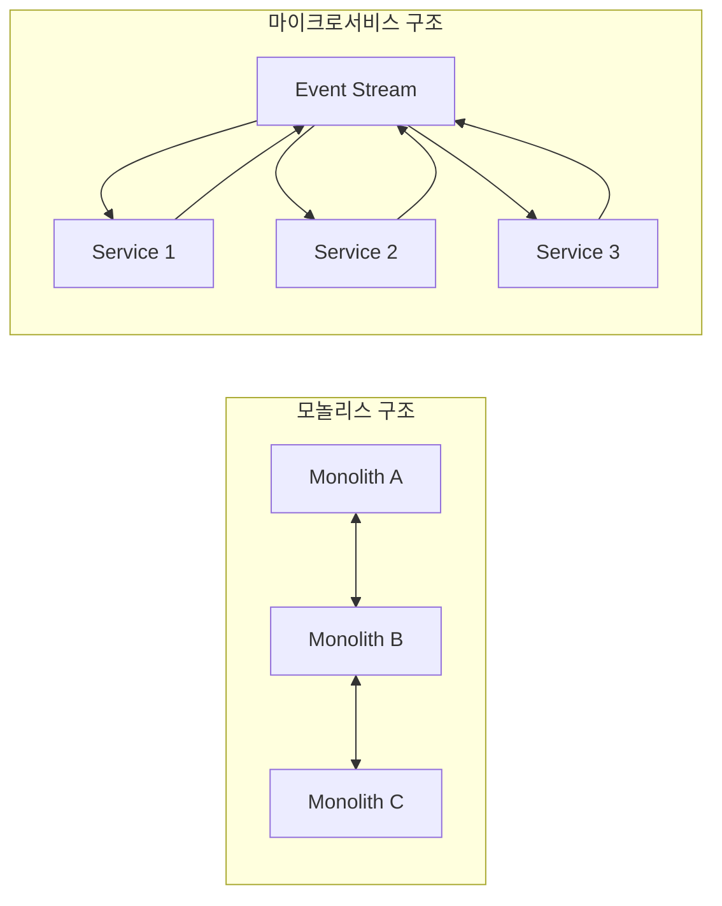

---

### 2. 도메인 주도 설계(DDD)와 Bounded Context

Eric Evans의 도메인 주도 설계에서 파생된 핵심 개념들:

#### 핵심 개념 정의

| 개념 | 영역 | 설명 |
|------|------|------|
| **Domain** | 문제 공간 | 비즈니스가 해결하는 전체 문제 영역 |
| **Subdomain** | 문제 공간 | 도메인의 구성요소 (예: 창고, 영업, 엔지니어링) |
| **Domain Model** | 솔루션 공간 | 비즈니스 목적에 유용한 도메인의 추상화 |
| **Bounded Context** | 솔루션 공간 | 입력, 출력, 이벤트, 프로세스, 데이터 모델의 논리적 경계 |

#### Bounded Context 설계 원칙

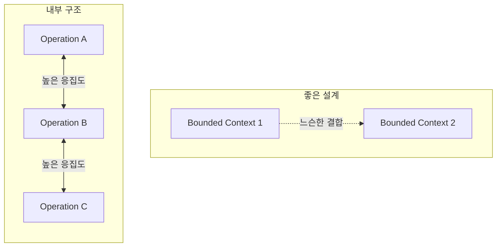

**핵심 원칙:**
- **높은 응집도(High Cohesion)**: 내부 작업은 긴밀하게 연관, 대부분의 통신이 내부에서 발생
- **느슨한 결합(Loose Coupling)**: 한 컨텍스트의 변경이 다른 컨텍스트에 영향을 최소화

---

### 3. 비즈니스 요구사항 기반 정렬 vs 기술적 요구사항 기반 정렬

#### 비즈니스 요구사항 기반 (권장)

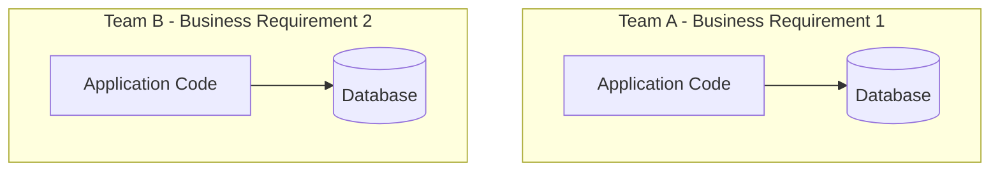

**장점:**
- 팀이 자율적으로 설계/구현 가능
- 팀 간 의존성 감소
- 변경이 로컬 범위에 한정됨

#### 기술적 요구사항 기반 (비권장)

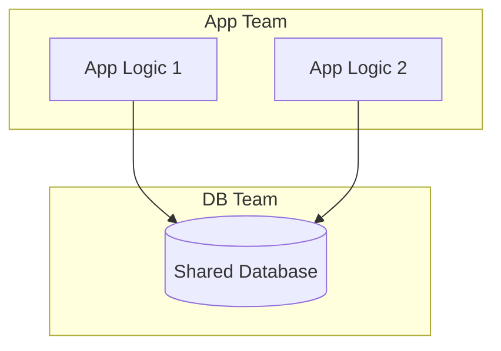

**문제점:**
- 비즈니스 기능 책임이 여러 팀에 분산
- 팀 간 API 경계에서 결합 발생
- 변경 비용이 높음
- 한 서비스의 실패가 전체에 파급

> ⚠️ **주의**: 기술적 정렬은 EDM 아키텍처에서 거의 사용되지 않으며 가능하면 완전히 피해야 한다.

---

### 4. Communication Structures

조직의 팀, 시스템, 사람들 간의 통신은 **통신 구조(Communication Structure)**라는 상호 연결된 의존성 토폴로지를 형성한다.

#### 4.1 Business Communication Structure

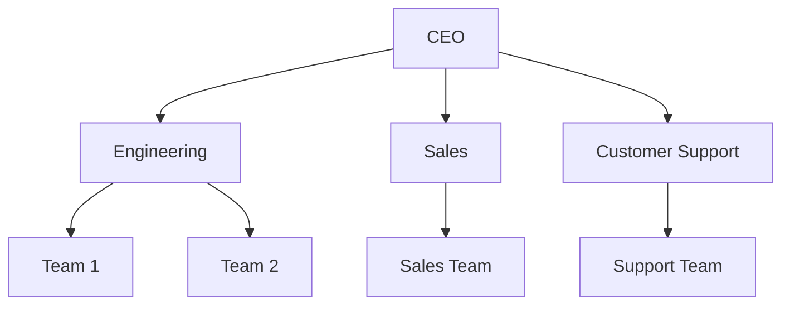

- 팀과 부서 간의 통신 방식
- 주요 요구사항과 책임에 의해 결정
- 시간에 따라 변경됨

#### 4.2 Implementation Communication Structure

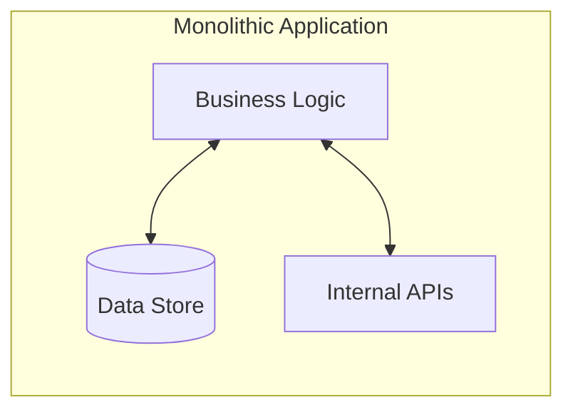

- 서브도메인 모델의 데이터와 로직
- 비즈니스 프로세스, 데이터 구조, 시스템 설계를 형식화
- 변경 시 로직 재작성 필요

#### 4.3 Data Communication Structure (종종 부재)

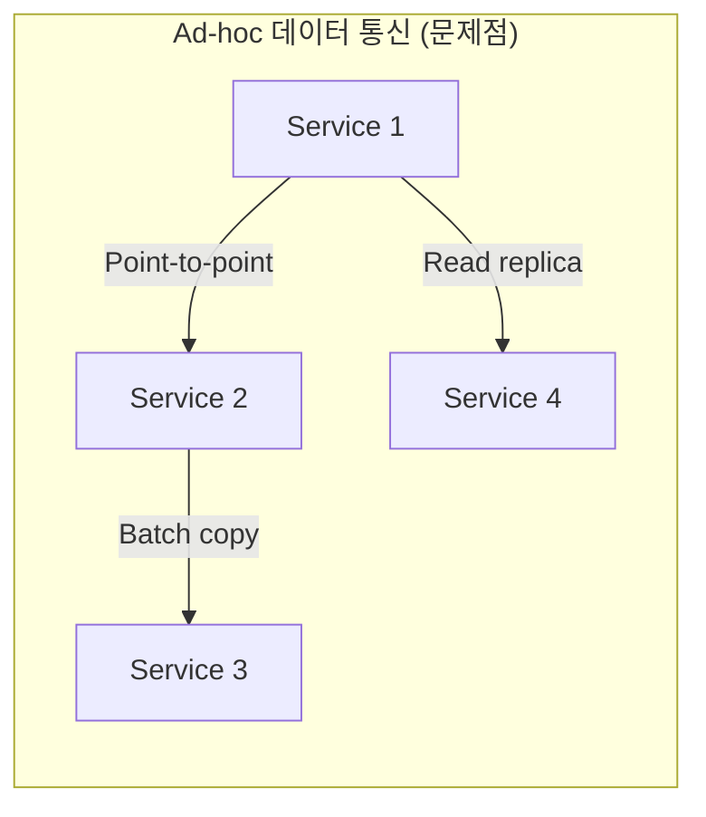

- 비즈니스 전반에 걸쳐 데이터가 통신되는 프로세스
- **대부분의 조직에서 부재하거나 ad-hoc**
- Implementation 구조가 이중 역할을 하며 문제 발생

---

### 5. Conway의 법칙

> "시스템을 설계하는 조직은... 그 조직의 통신 구조를 복사한 설계를 생산하도록 제약된다."
> — Melvin Conway, 1968

**Conway의 법칙이 시스템에 미치는 영향:**

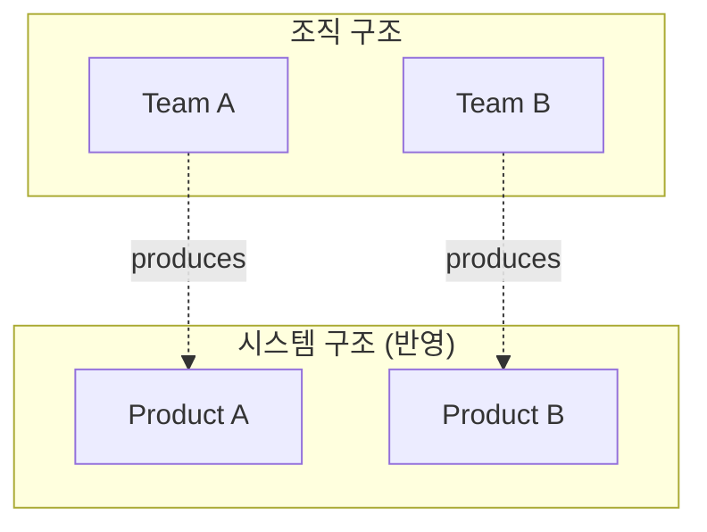

**Implementation 구조의 두 가지 영향:**
1. **새로운 제품 생성 억제**: 조직 전반에 필요한 도메인 데이터 통신의 비효율성
2. **모놀리스 확장 유도**: 기존 도메인 데이터에 쉽게 접근 → 새 요구사항을 기존 시스템에 추가

---

### 6. 전통적 컴퓨팅의 문제점 - 시나리오

#### 시나리오: 새로운 비즈니스 요구사항 발생

팀이 새로운 비즈니스 요구사항을 받았을 때의 선택지:

| 옵션 | 접근법 | 장점 | 단점 |
|------|--------|------|------|
| **Option 1** | 새 서비스 생성 | 모듈성, 팀 분리 용이 | 데이터 접근 어려움, 인프라 오버헤드 |
| **Option 2** | 기존 서비스 확장 | 빠른 구현, 기존 인프라 활용 | 경계 모호화, 긴밀한 결합, 모듈성 상실 |

**대부분의 팀이 Option 2를 선택하는 이유:**

1. **데이터 접근 문제**: 다른 시스템의 데이터를 안정적으로, 대규모로, 실시간으로 접근하기 어려움
2. **서비스 생성 오버헤드**: 새 서비스 생성/관리에 상당한 오버헤드와 리스크

#### 1년 후: 팀 분리의 어려움

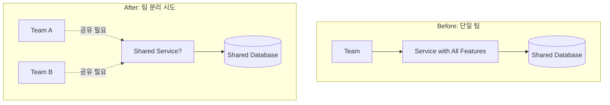

**발생하는 질문들:**
- 어떤 팀이 어떤 데이터를 소유해야 하는가?
- 데이터는 어디에 있어야 하는가?
- 두 팀 모두 값을 수정해야 하는 데이터는 어떻게 하는가?

> 💡 **근본 원인**: 약하고 정의되지 않은 **데이터 통신 구조**

---

### 7. 이벤트 기반 통신 구조

이벤트 기반 접근 방식은 Implementation과 Data 통신 구조의 전통적인 동작에 대한 대안을 제공한다.

#### 7.1 이벤트가 통신의 기반

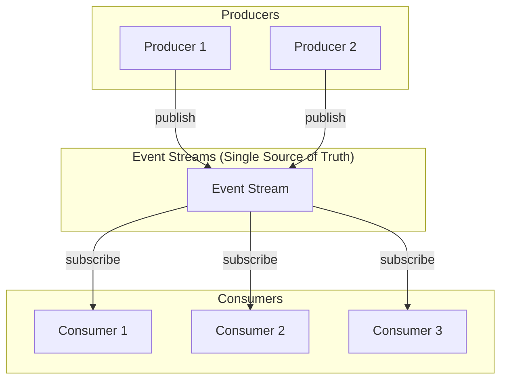

**핵심 특징:**
- **이벤트 = 데이터**: 단순한 신호가 아닌 데이터 자체
- **Single Source of Truth**: 각 이벤트는 사실의 진술(statement of fact)
- **비동기 통신**: 서비스 간 느슨한 결합

#### 7.2 소비자가 자체 모델링/쿼리 수행

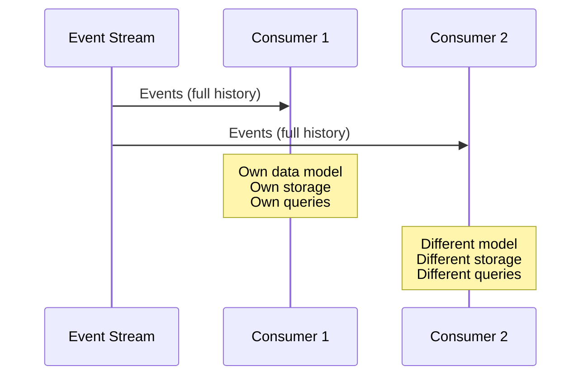

**책임의 전환:**
- 데이터 접근/모델링 요구사항이 완전히 소비자에게 이전
- 프로듀서/소비자는 쿼리 메커니즘, 데이터 전송 API 제공 의무에서 해방
- 각 서비스는 자신의 Bounded Context 필요만 해결

#### 7.3 조직 전반의 데이터 통신 개선

| 기존 방식 | 이벤트 기반 방식 |
|-----------|-----------------|
| Point-to-point 결합 | 이벤트 스트림을 통한 분리 |
| 데이터 접근 어려움 | 정규화된 이벤트 스트림에서 획득 |
| 팀 구조 변경 시 영향 | 핵심 도메인 이벤트는 팀 변경과 독립적 |
| 배치 동기화 문제 | 실시간 이벤트 소비 |

---

### 8. 비동기 이벤트 기반 마이크로서비스의 장점

| 장점 | 설명 |
|------|------|
| **세분성(Granularity)** | Bounded Context에 깔끔하게 매핑, 요구사항 변경 시 쉽게 재작성 |
| **확장성(Scalability)** | 개별 서비스 독립적으로 스케일 업/다운 |
| **기술적 유연성** | 각 서비스에 가장 적합한 언어/기술 사용 |
| **비즈니스 유연성** | 세분화된 서비스의 소유권 재구성 용이 |
| **느슨한 결합** | 특정 구현 API가 아닌 도메인 데이터에 결합 |
| **지속적 배포 지원** | 작은 모듈식 서비스 배포/롤백 용이 |
| **높은 테스트 용이성** | 의존성이 적어 Mock 테스트 용이 |

---

### 9. 동기식 마이크로서비스와의 비교

#### 동기식 마이크로서비스의 단점

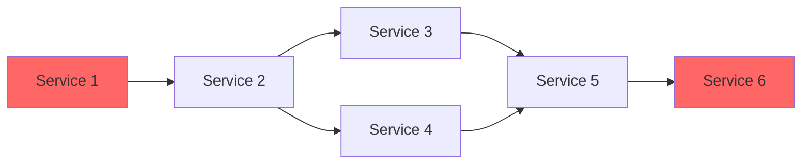

| 문제점 | 설명 |
|--------|------|
| **Point-to-point 결합** | 서비스 간 의존성이 과도하게 팬아웃 |
| **종속적 확장** | 자체 확장이 모든 의존 서비스의 확장에 의존 |
| **서비스 장애 처리** | 의존 서비스 다운 시 예외 처리 복잡 |
| **API 버전 관리** | 여러 API 버전 동시 존재, 조율 복잡 |
| **분산 모놀리스** | 서비스가 분산되어 있지만 모놀리스처럼 동작 |
| **테스트 어려움** | 완전히 작동하는 의존 서비스 필요 |

#### 동기식 마이크로서비스의 장점

- **특정 데이터 접근 패턴에 적합**: 사용자 인증, AB 테스트 리포팅
- **외부 통합**: 대부분 동기식 HTTP 사용
- **추적 용이성**: 상세 로그로 어떤 함수가 어떤 시스템에서 호출되었는지 파악
- **경험 풍부한 인력**: 대부분의 개발자가 동기식, 모놀리스 스타일에 익숙

> 💡 **핵심**: 회사의 아키텍처가 완전히 이벤트 기반으로만 구성되는 경우는 드물다. 동기식과 비동기식 솔루션이 문제 영역에 따라 나란히 배포되는 **하이브리드 아키텍처**가 일반적이다.

---

## 🔍 심화 학습

### 추가 조사 내용

#### Conway의 법칙 확장: Inverse Conway Maneuver

Conway의 법칙을 역으로 활용하여, **원하는 시스템 아키텍처에 맞게 조직 구조를 설계**하는 접근법:

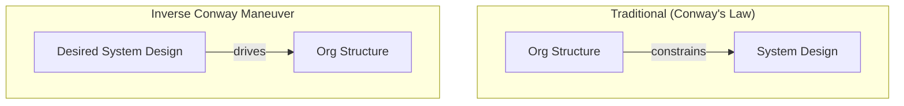

- ThoughtWorks, Netflix 등에서 적극 활용
- 마이크로서비스 도입 시 팀 구조도 함께 재설계 필요

#### Event Sourcing vs Event-Driven Architecture

| 개념 | Event Sourcing | Event-Driven Architecture |
|------|----------------|--------------------------|
| **목적** | 상태 저장 방식 | 통신 패턴 |
| **이벤트 역할** | 상태의 유일한 원천 | 서비스 간 메시지 |
| **재구성** | 이벤트 재생으로 상태 복원 | 불필요 |
| **복잡도** | 높음 | 상대적으로 낮음 |

### 출처
- [Martin Fowler - Bounded Context](https://martinfowler.com/bliki/BoundedContext.html)
- [Eric Evans - Domain-Driven Design](https://www.domainlanguage.com/ddd/)
- [ThoughtWorks - Inverse Conway Maneuver](https://www.thoughtworks.com/radar/techniques/inverse-conway-maneuver)

---

## 💡 실무 적용 포인트

### 이런 상황에서 이벤트 기반 마이크로서비스를 고려하세요

1. **데이터 접근이 어려운 경우**: 다른 팀/시스템의 데이터가 필요하지만 얻기 어려울 때
2. **제품 범위가 계속 확장되는 경우**: 모든 데이터가 하나의 시스템에 있어서 기능이 계속 추가될 때
3. **팀 재구성이 예상되는 경우**: 성장하는 조직에서 팀 분리가 필요할 때
4. **실시간 데이터 처리가 필요한 경우**: 배치 동기화로는 충분하지 않을 때

### 주의할 점 / 흔한 실수

- ⚠️ **모든 것을 이벤트로 만들지 마라**: 인증, AB 테스트 등 동기식이 적합한 경우 존재
- ⚠️ **기술적 요구사항으로 팀을 나누지 마라**: 비즈니스 요구사항 기반으로 Bounded Context 정의
- ⚠️ **단기 이점에 속지 마라**: 기존 서비스에 기능 추가가 빠르지만, 장기적으로 긴밀한 결합 비용 발생
- ⚠️ **이벤트 스트림을 Single Source of Truth로 유지하라**: 일부 팀이 다른 곳에 충돌하는 데이터를 넣으면 목적 상실

### 면접에서 나올 수 있는 질문

- **Q**: 이벤트 기반 마이크로서비스와 동기식 마이크로서비스의 차이점은 무엇인가요?
- **Q**: Conway의 법칙이 무엇이고, 이것이 마이크로서비스 설계에 어떤 영향을 미치나요?
- **Q**: Bounded Context를 비즈니스 요구사항에 맞춰 정렬해야 하는 이유는 무엇인가요?
- **Q**: 전통적인 모놀리스 시스템에서 데이터 통신의 문제점은 무엇인가요?
- **Q**: 이벤트 스트림이 "Single Source of Truth"가 되어야 하는 이유는 무엇인가요?

---

## ✅ 핵심 개념 체크리스트

- [ ] 이벤트 기반 마이크로서비스에서 이벤트가 소비 후에도 삭제되지 않는 이유를 설명할 수 있는가?
- [ ] Domain, Subdomain, Bounded Context의 차이를 설명할 수 있는가?
- [ ] Business, Implementation, Data Communication Structure의 역할을 구분할 수 있는가?
- [ ] 기술적 정렬 대신 비즈니스 정렬을 해야 하는 이유를 알고 있는가?
- [ ] Conway의 법칙이 시스템 설계에 미치는 영향을 이해했는가?
- [ ] 동기식 마이크로서비스의 "분산 모놀리스(Distributed Monolith)" 문제를 설명할 수 있는가?
- [ ] 하이브리드 아키텍처가 필요한 이유를 알고 있는가?

---

## 🔗 참고 자료

- 📄 공식 문서: [Apache Kafka Documentation](https://kafka.apache.org/documentation/)
- 📚 연관 서적:
  - "Domain-Driven Design" by Eric Evans
  - "Building Microservices" by Sam Newman (O'Reilly, 2015)
  - "Microservices for the Enterprise" by Kasun Indrasiri and Prabath Siriwardena (Apress, 2018)
- 🎬 추천 영상: [Martin Fowler - Event-Driven Architecture](https://www.youtube.com/watch?v=STKCRSUsyP0)

---

*📅 작성일: 2025-12-31*
*📖 원서: Building Event-Driven Microservices by Adam Bellemare (O'Reilly)*
