# Chapter 2. Event-Driven Microservice Fundamentals

---

## 📌 핵심 요약

> 이 장에서는 **이벤트 기반 마이크로서비스의 기본 구성 요소**를 다룬다. 핵심은 **이벤트 브로커(Event Broker)**가 데이터 통신의 중심이 되며, **이벤트 스트림과 테이블의 이중성(Table-Stream Duality)**을 통해 상태를 관리한다는 것이다. 또한 **Single Writer Principle**과 **Single Source of Truth** 개념이 이벤트 기반 아키텍처의 근간을 이룬다.

---

## 🎯 학습 목표

이 내용을 읽고 나면:
- [ ] Microservice Topology와 Business Topology의 차이를 설명할 수 있다
- [ ] 3가지 이벤트 유형(Unkeyed, Entity, Keyed)을 구분하고 용도를 설명할 수 있다
- [ ] Table-Stream Duality 개념과 상태 구체화(Materialization)를 이해할 수 있다
- [ ] Event Broker와 Message Broker의 차이를 비교할 수 있다
- [ ] 마이크로서비스 세금(Microservice Tax)의 개념과 고려사항을 알 수 있다

---

## 📖 본문 정리

### 1. 이벤트 기반 마이크로서비스 정의

이벤트 기반 마이크로서비스는 **특정 Bounded Context를 충족하기 위해 구축된 작은 애플리케이션**이다.

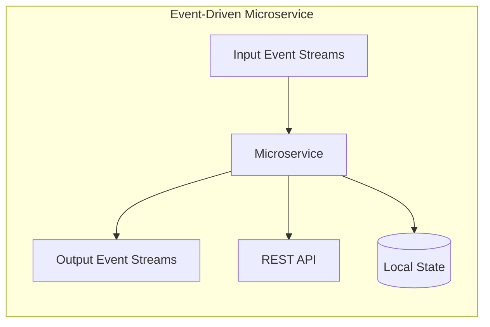

| 역할 | 설명 |
|------|------|
| **Consumer** | 하나 이상의 입력 이벤트 스트림에서 이벤트를 소비하고 처리 |
| **Producer** | 다른 서비스가 소비할 이벤트 스트림에 이벤트 생성 |
| **Hybrid** | 입력 스트림을 소비하고 출력 스트림을 생산하는 일반적인 형태 |

> 💬 **핵심**: 이벤트 기반 마이크로서비스 간의 통신은 **완전히 비동기적**이다.

---

### 2. Building Topologies

"Topology"라는 용어는 두 가지 의미로 사용된다:

#### 2.1 Microservice Topology (내부)

단일 마이크로서비스 내부의 이벤트 기반 처리 로직을 정의한다.

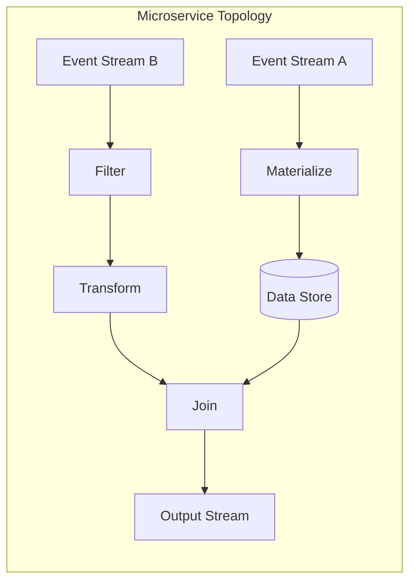

**구성 요소:**
- **Ingestion**: 이벤트 스트림에서 이벤트 수집
- **Materialization**: 이벤트를 데이터 스토어에 구체화
- **Transformation**: 이벤트 변환
- **Emission**: 새로운 이벤트 스트림으로 출력

#### 2.2 Business Topology (외부)

복잡한 비즈니스 기능을 충족하는 마이크로서비스, 이벤트 스트림, API의 집합이다.

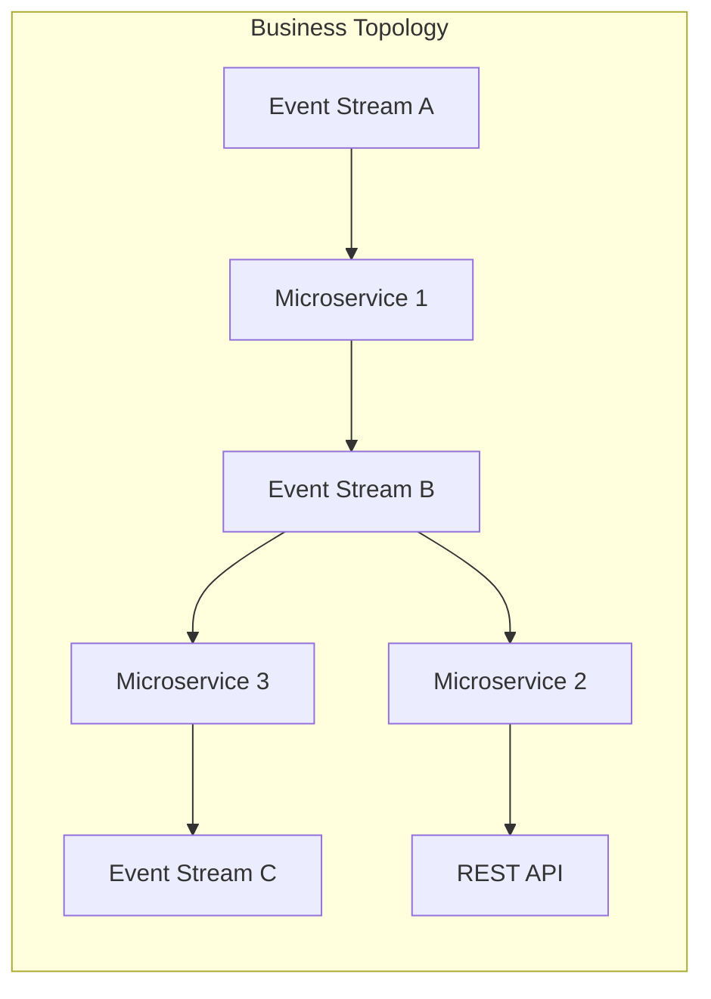

| Topology 유형 | 범위 | 설명 |
|--------------|------|------|
| **Microservice** | 내부 | 단일 마이크로서비스의 내부 작동 방식 |
| **Business** | 외부 | 서비스 간의 관계와 상호작용 |

---

### 3. The Contents of an Event

이벤트는 비즈니스 통신 구조 내에서 발생한 **모든 것**이 될 수 있다.

> 💬 **비유**: 이벤트는 애플리케이션의 정보/오류 로그와 비슷하지만, 동시에 **Single Source of Truth**로서 발생한 것을 정확히 설명하는 데 필요한 모든 정보를 포함해야 한다.

#### 3.1 이벤트 구조 (Key/Value)

```
┌─────────────┬─────────────────────────────────────┐
│    Key      │              Value                  │
├─────────────┼─────────────────────────────────────┤
│ Unique ID   │ Details pertaining to the Unique ID│
└─────────────┴─────────────────────────────────────┘
```

- **Key**: 식별, 라우팅, 집계 작업에 사용 (필수 아님)
- **Value**: 이벤트의 완전한 세부 정보 저장

#### 3.2 세 가지 이벤트 유형

| 유형 | Key | 설명 | 예시 |
|------|-----|------|------|
| **Unkeyed Event** | 없음 | 단일 사실의 진술 | 사용자가 책을 열람함 |
| **Entity Event** | 엔티티 ID | 특정 시점의 엔티티 상태 | ISBN으로 키된 도서 정보 |
| **Keyed Event** | 있음 (비엔티티) | 파티셔닝/집계용 | 어떤 사용자가 책과 상호작용했는지 |

**Unkeyed Event 예시:**
```json
{
  "key": null,
  "value": {
    "ISBN": "372719",
    "timestamp": 1538913600
  }
}
```

**Entity Event 예시:**
```json
{
  "key": "ISBN:372719",
  "value": {
    "author": "Adam Bellemare",
    "title": "Building Event-Driven Microservices",
    "price": 49.99
  }
}
```

**Keyed Event 예시:**
```json
{
  "key": "ISBN:372719",
  "value": {
    "userId": "A537FE",
    "action": "view"
  }
}
```

> 💡 **Entity Event의 중요성**: 엔티티의 상태 이력을 지속적으로 제공하며, 가장 최근의 엔티티 이벤트만으로 현재 상태를 결정할 수 있다.

---

### 4. Materializing State from Entity Events

#### 4.1 Table-Stream Duality

**이벤트 스트림 → 테이블 (Materialization)**

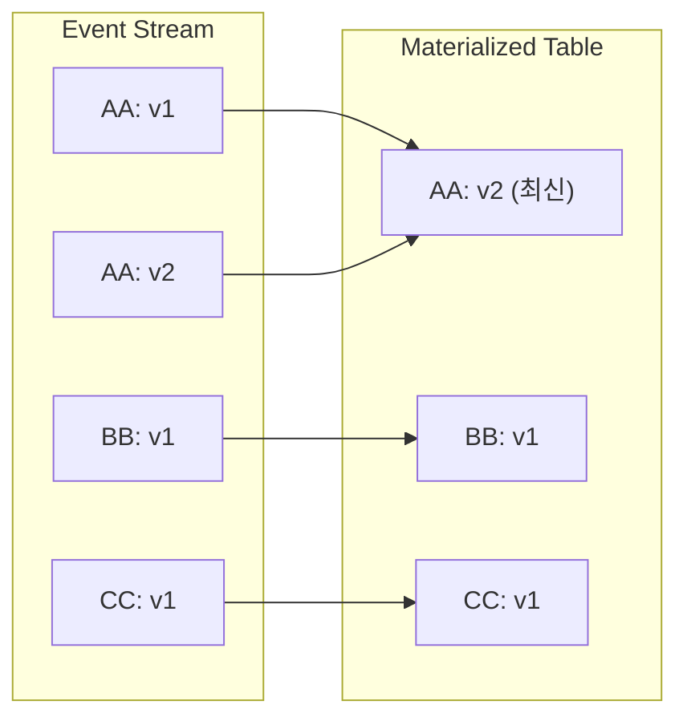

**Upsert 동작:**
- 키가 테이블에 없으면 새 행 **삽입(Insert)**
- 키가 이미 존재하면 **업데이트(Update)**

**테이블 → 이벤트 스트림 (Change Data Capture)**

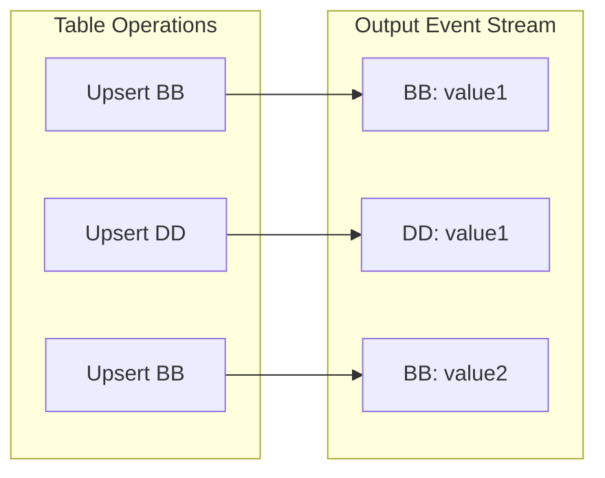

> 💡 **핵심 패턴**: Table-Stream Duality를 통해 마이크로서비스는 **이벤트만으로 상태를 공유**할 수 있으며, 프로듀서와 컨슈머 서비스 간의 직접적인 결합 없이 통신이 가능하다.

#### 4.2 Tombstone (삭제 처리)

키가 있는 이벤트의 삭제는 **Tombstone**을 생성하여 처리한다.

```json
{
  "key": "ISBN:372719",
  "value": null  // Tombstone 표시
}
```

- Value가 `null`인 이벤트
- 컨슈머에게 해당 키의 이벤트를 구체화된 데이터 스토어에서 **삭제**하라는 의미

#### 4.3 Compaction (압축)

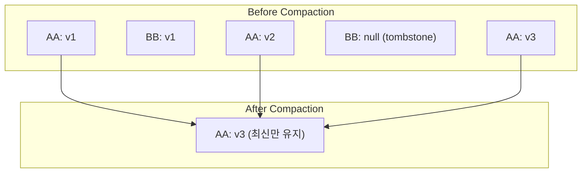

| 항목 | 설명 |
|------|------|
| **목적** | 디스크 사용량 감소, 처리해야 할 이벤트 수 감소 |
| **동작** | 동일 키에 대해 가장 최근 이벤트만 유지 |
| **Tombstone** | Tombstone과 해당 키의 모든 이전 이벤트 삭제 |
| **트레이드오프** | 이벤트 히스토리 손실 |

---

### 5. Event Data Definitions and Schemas

이벤트 데이터는 **장기 저장 수단**이자 **서비스 간 통신 메커니즘**이다.

#### 스키마의 중요성

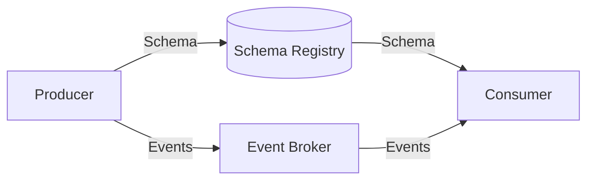

**스키마 도구 (Apache Avro, Protobuf) 의 두 가지 기능:**

| 기능 | 설명 |
|------|------|
| **Schema Evolution** | 특정 변경 사항을 다운스트림 컨슈머의 코드 변경 없이 안전하게 적용 |
| **Code Generation** | 스키마화된 데이터를 선택한 언어의 타입이 있는 클래스로 변환 |

---

### 6. Microservice Single Writer Principle

> 각 이벤트 스트림에는 **하나의 프로듀싱 마이크로서비스만** 있어야 한다.

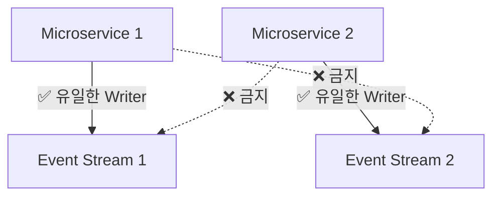

**이점:**
- 모든 이벤트에 대해 **권위 있는 진실의 원천(Authoritative Source of Truth)** 항상 알 수 있음
- 시스템을 통한 **데이터 계보(Data Lineage)** 추적 가능
- 접근 제어 메커니즘으로 소유권과 쓰기 경계 강제

---

### 7. Event Broker

#### 7.1 Event Broker의 역할

모든 프로덕션 준비된 이벤트 기반 마이크로서비스 플랫폼의 **핵심**이다.

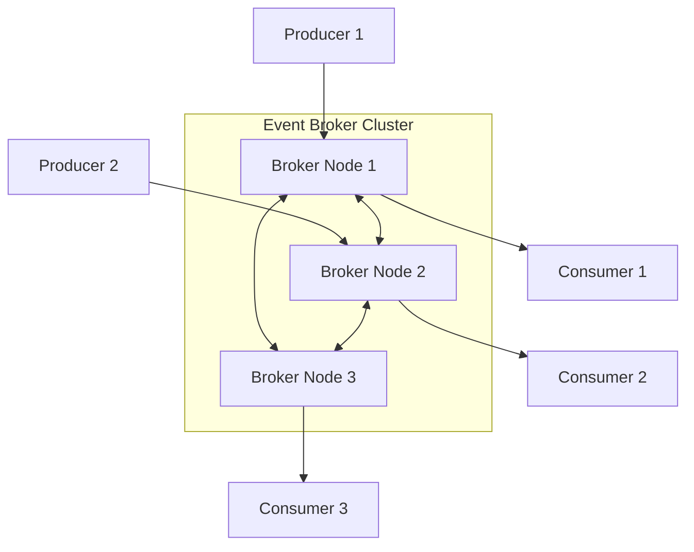

**필수 기능:**

| 기능 | 설명 |
|------|------|
| **Scalability** | 브로커 인스턴스 추가로 용량 확장 |
| **Durability** | 노드 간 데이터 복제로 장애 시에도 데이터 보존 |
| **High Availability** | 브로커 장애 시 다른 노드로 연결 |
| **High Performance** | 초당 수십만 건의 읽기/쓰기 처리 |

#### 7.2 Event Storage and Serving 요구사항

| 요구사항 | 설명 |
|----------|------|
| **Partitioning** | 병렬 처리를 위한 서브스트림 분할 |
| **Strict Ordering** | 파티션 내 데이터의 엄격한 순서 보장 |
| **Immutability** | 발행된 이벤트 데이터는 완전히 불변 |
| **Indexing** | 이벤트에 인덱스 할당, 컨슈머 오프셋 관리 |
| **Infinite Retention** | 무기한 이벤트 보존 가능 |
| **Replayability** | 컨슈머가 필요한 데이터를 언제든 다시 읽을 수 있음 |

#### 7.3 Event Broker vs Message Broker

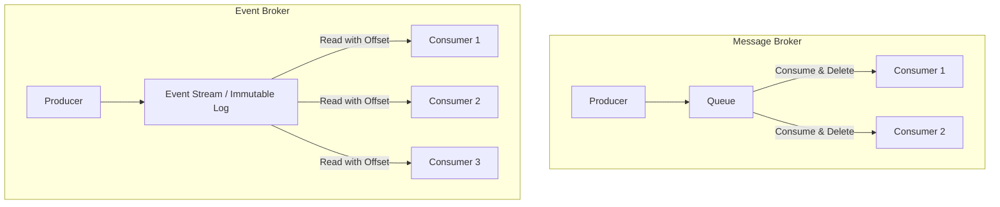

| 특성 | Message Broker | Event Broker |
|------|----------------|--------------|
| **소비 후** | 메시지 삭제 | 이벤트 보존 |
| **다중 소비** | 각 컨슈머가 일부만 받음 | 모든 컨슈머가 전체 받음 |
| **재생** | 불가능 | 가능 |
| **상태 통신** | 부적합 | 적합 |
| **순서 보장** | 큐 레벨 | 파티션 레벨에서 엄격 |
| **사용 사례** | 작업 분배 | 이벤트 소싱, 상태 공유 |

> 💡 **핵심**: Event Broker는 **불변의, 추가 전용 사실 로그**를 가능하게 하여 이벤트 순서의 상태를 보존한다. 컨슈머는 언제든지 로그의 어느 위치에서든 재처리할 수 있다.

---

### 8. Consuming from the Immutable Log

#### 8.1 Event Stream으로 소비

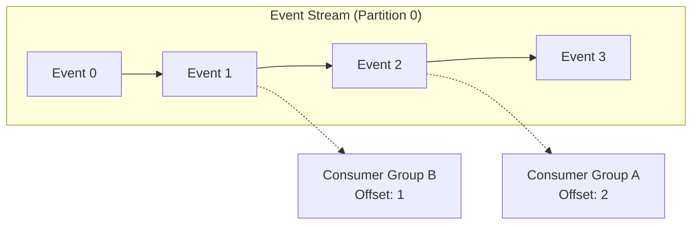

**Consumer Group 특성:**
- 여러 컨슈머가 동일한 논리적 엔티티로 취급됨
- 수평 확장을 위해 활용
- 파티션은 그룹 내 **단일 컨슈머 인스턴스에만** 할당
- 활성 컨슈머 인스턴스 수는 파티션 수로 제한

#### 8.2 Queue로 소비

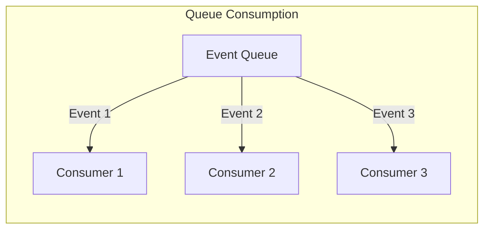

| 특성 | Event Stream | Queue |
|------|--------------|-------|
| **소비 방식** | 오프셋 기반 | 이벤트별 개별 처리 |
| **순서 보장** | ✅ 파티션 내 보장 | ⚠️ 보장되지 않음 |
| **중복 소비** | 동일 이벤트 다중 소비 가능 | 한 번만 소비 |
| **확장성** | 파티션 수 제한 | 무제한 컨슈머 |

> ⚠️ **주의**: 큐에서 처리할 때 이벤트 순서가 유지되지 않는다. 병렬 컨슈머가 순서 없이 처리하고, 단일 컨슈머도 실패 시 이벤트를 나중에 처리하기 위해 큐에 반환할 수 있다.

---

### 9. Managing Microservices at Scale

#### 9.1 Containers vs Virtual Machines

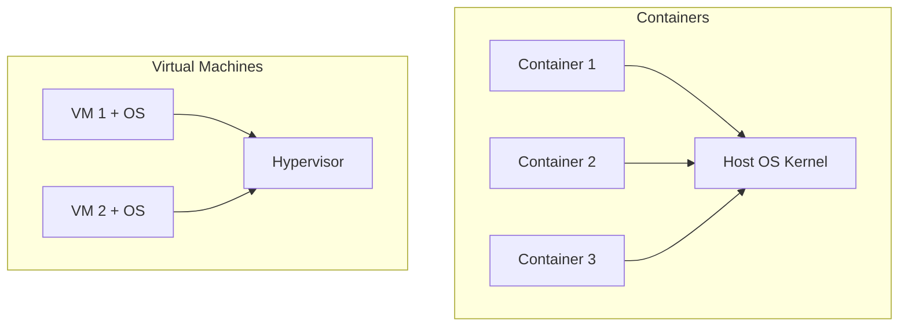

| 특성 | Containers | Virtual Machines |
|------|------------|------------------|
| **격리 수준** | 프로세스 수준 | 완전 격리 (OS 포함) |
| **시작 시간** | 빠름 | 느림 |
| **리소스 오버헤드** | 낮음 | 높음 |
| **보안** | 커널 공유로 취약점 위험 | 높은 보안 |
| **유연성** | 호스트 OS에 종속 | 독립적 OS 가능 |

> 💡 **동향**: Google의 gVisor, Amazon의 Firecracker, Kata Containers 등이 VM을 더 저렴하고 효율적으로 만들고 있다. 보안 우선 요구사항이 있다면 이 분야를 주시하라.

#### 9.2 Container Management Systems (CMS)

**주요 CMS:**
- Kubernetes
- Docker Engine
- Mesos Marathon
- Amazon ECS
- Nomad

**CMS 필수 기능:**

| 기능 | 설명 |
|------|------|
| **Vertical Scaling** | CPU, 메모리, 디스크 증감 |
| **Horizontal Scaling** | 인스턴스 추가/제거 |
| **Single Unit Deployment** | 단일 배포 단위로 관리 |
| **Pod 개념** | 여러 컨테이너를 단일 액션으로 배포/롤백 |

---

### 10. Microservice Tax

**마이크로서비스 세금(Microservice Tax)**은 마이크로서비스 아키텍처 구현과 관련된 **재정적, 인력, 기회 비용의 총합**이다.

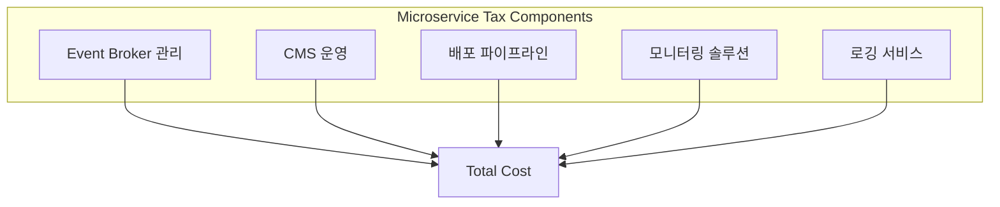

#### 지불 방식 비교

| 방식 | 결과 |
|------|------|
| **중앙 집중식** | 확장 가능하고 단순화된 통합 프레임워크 |
| **팀별 개별** | 과도한 오버헤드, 중복 솔루션, 단편화된 도구 |

#### 조직 규모별 권장사항

| 조직 규모 | 권장 사항 |
|-----------|-----------|
| **소규모** | 모듈형 모놀리스가 더 적합할 수 있음 |
| **대규모** | 구현 및 유지보수의 총 비용을 계산하고 장기 로드맵과 비교 |

> 💡 **다행히**: 오픈 소스와 호스팅 서비스가 최근 몇 년간 훨씬 더 사용 가능하고 쉬워졌다. CMS, Event Broker, 기타 도구 간의 새로운 통합으로 마이크로서비스 세금이 꾸준히 감소하고 있다.

---

## 🔍 심화 학습

### 추가 조사 내용

#### Event Sourcing과의 관계

| 개념 | 이 책의 접근법 | Event Sourcing |
|------|---------------|----------------|
| **이벤트 역할** | 통신 및 상태 공유 | 상태의 유일한 원천 |
| **상태 저장** | 구체화된 뷰 사용 | 이벤트만으로 재구성 |
| **Compaction** | 허용 | 이벤트 히스토리 필수 유지 |

#### Apache Kafka vs Apache Pulsar

| 특성 | Apache Kafka | Apache Pulsar |
|------|--------------|---------------|
| **아키텍처** | 브로커에 저장 | 저장과 서빙 분리 (BookKeeper) |
| **Queue 지원** | 네이티브 미지원 | 네이티브 지원 |
| **Tiered Storage** | 플러그인 필요 | 네이티브 지원 |
| **멀티 테넌시** | 제한적 | 강력 지원 |

### 출처
- [Apache Kafka Documentation](https://kafka.apache.org/documentation/)
- [Apache Pulsar Documentation](https://pulsar.apache.org/docs/)
- [Martin Kleppmann - Turning the database inside-out](https://www.confluent.io/blog/turning-the-database-inside-out-with-apache-samza/)

---

## 💡 실무 적용 포인트

### 이런 상황에서 적용하세요

1. **Entity Event 사용**: 엔티티의 현재 상태를 다른 서비스와 공유해야 할 때
2. **Table-Stream Duality**: 이벤트 스트림에서 조회 가능한 상태를 만들어야 할 때
3. **Consumer Group**: 처리량을 높이기 위해 수평 확장이 필요할 때
4. **Compaction**: 최신 상태만 필요하고 히스토리가 불필요할 때

### 주의할 점 / 흔한 실수

- ⚠️ **Single Writer Principle 위반하지 마라**: 여러 서비스가 같은 스트림에 쓰면 데이터 계보 추적 불가
- ⚠️ **Message Broker를 Event Broker로 오해하지 마라**: RabbitMQ 등은 이벤트 재생이 불가능
- ⚠️ **Compaction의 트레이드오프 이해하라**: 히스토리가 필요한 경우 압축하면 안 됨
- ⚠️ **마이크로서비스 세금을 과소평가하지 마라**: 소규모 조직에서는 모놀리스가 더 적합할 수 있음
- ⚠️ **Queue 소비 시 순서 보장 기대하지 마라**: 병렬 처리 시 순서가 뒤섞임

### 면접에서 나올 수 있는 질문

- **Q**: Table-Stream Duality란 무엇이고, 왜 중요한가요?
- **Q**: Entity Event와 Keyed Event의 차이점은 무엇인가요?
- **Q**: Event Broker와 Message Broker의 차이점을 설명해주세요.
- **Q**: Tombstone이란 무엇이고, 왜 필요한가요?
- **Q**: Single Writer Principle을 지켜야 하는 이유는 무엇인가요?
- **Q**: 마이크로서비스 세금이란 무엇이고, 어떻게 관리해야 하나요?

---

## ✅ 핵심 개념 체크리스트

- [ ] Microservice Topology와 Business Topology의 차이를 설명할 수 있는가?
- [ ] Unkeyed, Entity, Keyed Event의 차이와 용도를 알고 있는가?
- [ ] Table-Stream Duality를 통해 상태가 어떻게 구체화되는지 이해했는가?
- [ ] Tombstone과 Compaction의 역할을 알고 있는가?
- [ ] Event Broker가 Message Broker와 어떻게 다른지 설명할 수 있는가?
- [ ] Consumer Group의 동작 방식과 파티션과의 관계를 이해했는가?
- [ ] 마이크로서비스 세금의 구성 요소와 고려사항을 알고 있는가?

---

## 🔗 참고 자료

- 📄 공식 문서:
  - [Apache Kafka Documentation](https://kafka.apache.org/documentation/)
  - [Kubernetes Documentation](https://kubernetes.io/docs/)
- 📚 연관 서적:
  - "Designing Data-Intensive Applications" by Martin Kleppmann
  - "Kafka: The Definitive Guide" by Neha Narkhede, Gwen Shapira, Todd Palino
- 🎬 추천 영상:
  - [Confluent - Event Streaming Fundamentals](https://www.youtube.com/watch?v=Et8DmTfFTfg)

---

*📅 작성일: 2025-12-31*
*📖 원서: Building Event-Driven Microservices by Adam Bellemare (O'Reilly)*
