# Chapter 3. Communication and Data Contracts

---

## 📌 핵심 요약

> 이 장에서는 **이벤트 기반 시스템에서의 데이터 계약(Data Contracts)**을 다룬다. 핵심은 **명시적 스키마(Explicit Schema)**를 사용하여 프로듀서와 컨슈머 간의 계약을 명확히 정의하고, **스키마 진화(Schema Evolution)**를 통해 독립적인 서비스 업데이트를 가능하게 하는 것이다. 잘 설계된 이벤트는 단일 목적을 가지며, "진실 그 자체(Single Source of Truth)"로서 발생한 모든 것을 완전히 기술해야 한다.

---

## 🎯 학습 목표

이 내용을 읽고 나면:
- [ ] 데이터 계약의 두 구성 요소(데이터 정의, 트리거링 로직)를 설명할 수 있다
- [ ] 명시적 스키마와 암묵적 스키마의 차이와 장단점을 비교할 수 있다
- [ ] 세 가지 스키마 호환성 유형(Forward, Backward, Full)을 이해하고 적용할 수 있다
- [ ] Breaking Schema Change 발생 시 Entity와 Event의 처리 방법을 구분할 수 있다
- [ ] 이벤트 설계 시 피해야 할 안티패턴을 식별하고 올바른 설계 원칙을 적용할 수 있다

---

## 📖 본문 정리

### 1. Event-Driven Data Contracts

> "통신의 근본적인 문제는 한 지점에서 선택된 메시지를 다른 지점에서 정확히 또는 대략적으로 재현하는 것이다."
> — Claude Shannon (정보 이론의 아버지)

**데이터 계약(Data Contract)**은 통신할 데이터의 형식과 그것이 생성되는 로직으로 구성된다.

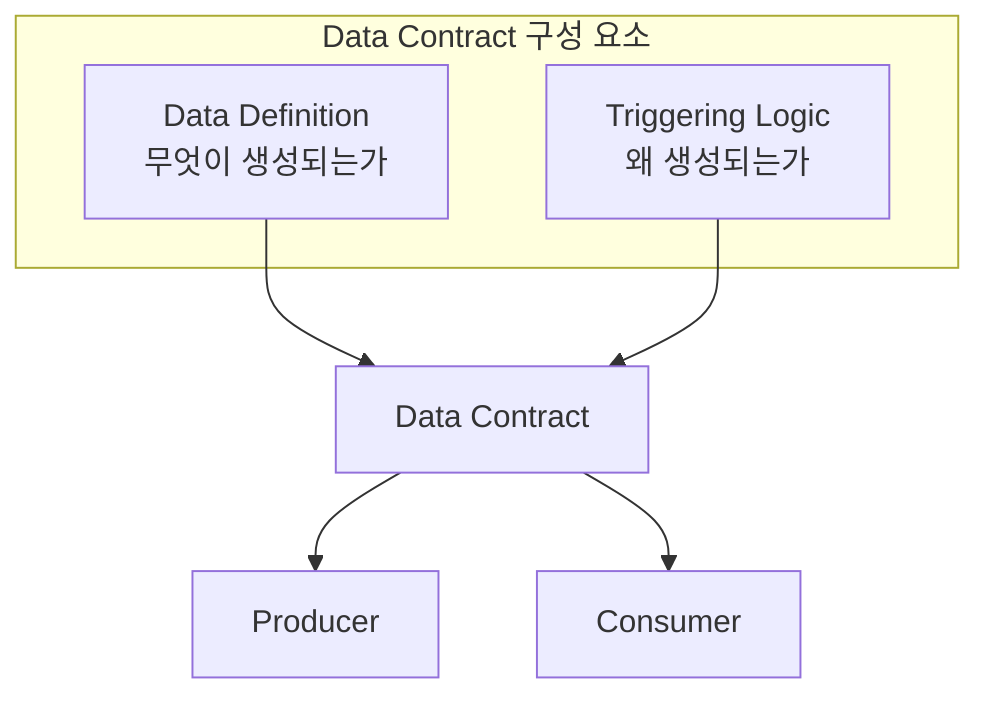

#### 데이터 계약의 두 구성 요소

| 구성 요소 | 설명 | 변경 시 영향 |
|-----------|------|-------------|
| **Data Definition** | 필드, 타입, 데이터 구조 | 다운스트림 컨슈머가 사용 중인 필드 삭제/변경 주의 |
| **Triggering Logic** | 이벤트 생성을 촉발한 비즈니스 로직 | 원래 이벤트 정의의 의미를 깨뜨릴 수 있음 |

> 💬 **비유**: 데이터 계약은 API 정의와 같다. 동기식 서비스에서 API 명세가 있듯이, 비동기 이벤트 기반 시스템에서는 데이터 계약이 그 역할을 한다.

---

### 2. Explicit Schema vs Implicit Schema

#### 명시적 스키마 (Explicit Schema) — 권장

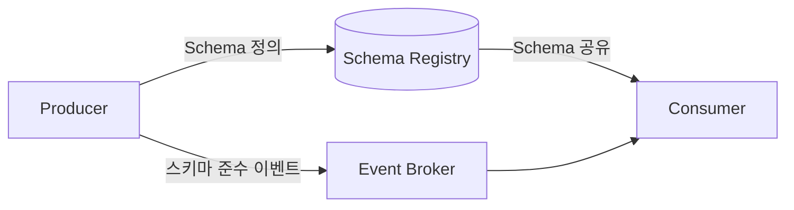

**명시적 스키마의 이점:**
- 컨슈머가 프로듀싱 서비스 소유자와 상담하지 않고도 이벤트 내용/의미 해석 가능
- 코드 변경 없이도 특정 스키마 변경 안전하게 적용 (Schema Evolution)
- 타입이 있는 클래스로 변환하여 비즈니스 로직 개발 단순화

#### 암묵적 스키마 (Implicit Schema) — 비권장

| 문제점 | 설명 |
|--------|------|
| **취약성** | 통제되지 않은 변경에 취약, 다운스트림 컨슈머에 예상치 못한 장애 유발 |
| **부족한 관리** | 트리발 지식과 팀 간 커뮤니케이션에 의존 (확장 불가) |
| **불일치** | 각 컨슈머가 데이터를 다르게 해석하여 Single Source of Truth 일관성 상실 |
| **프로듀서 불안정** | 단위 테스트로도 이벤트 데이터 정의 변경을 발견하지 못할 수 있음 |

> ⚠️ **경고**: 명시적으로 사전 정의된 스키마가 없는 이벤트 기반 통신은 결국 암묵적 스키마에 의존하게 된다. 암묵적 스키마는 취약하고 통제되지 않은 변경에 취약하다.

---

### 3. Schema Definition Best Practices

#### 3.1 Schema Definition Comments

스키마 정의에서 통합된 주석과 메타데이터 지원은 **이벤트의 의미를 전달하는 데 필수적**이다.

**주석이 특히 가치 있는 두 영역:**

| 영역 | 설명 | 예시 |
|------|------|------|
| **Triggering Logic** | 이벤트가 생성된 이유 명시 | 스키마 정의 상단 블록 헤더 |
| **Field Context** | 특정 필드의 맥락과 명확성 | datetime 필드가 UTC/ISO/Unix 형식인지 |

```protobuf
// 예시: Protobuf 스키마 주석
message OrderCreated {
  // 이벤트 트리거: 사용자가 결제 완료 후 주문 확정 시 생성됨

  // 주문 고유 식별자 (UUID v4 형식)
  string order_id = 1;

  // 주문 생성 시각 (ISO 8601 UTC 형식, 예: 2025-01-15T10:30:00Z)
  string created_at = 2;

  // 주문 총 금액 (센트 단위, 예: 10000 = $100.00)
  int64 total_amount_cents = 3;
}
```

#### 3.2 Full-Featured Schema Evolution

스키마 진화는 프로듀서가 서비스의 출력 형식을 업데이트하면서도 컨슈머가 중단 없이 이벤트를 계속 소비할 수 있게 한다.

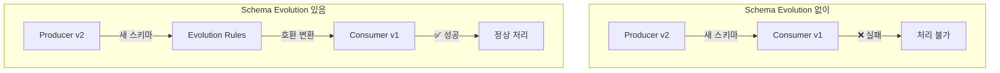

**세 가지 호환성 유형:**

| 호환성 유형 | 방향 | 설명 | 사용 사례 |
|-------------|------|------|-----------|
| **Forward** | Producer → Consumer | 새 스키마로 생성된 데이터를 이전 스키마로 읽기 | 프로듀서가 먼저 업데이트 |
| **Backward** | Consumer ← Producer | 이전 스키마로 생성된 데이터를 새 스키마로 읽기 | 컨슈머가 먼저 업데이트, 과거 데이터 재처리 |
| **Full** | 양방향 | Forward + Backward의 합집합 | **권장** - 가장 강력한 보장 |

> 💡 **팁**: 가능하면 항상 Full Compatibility를 사용하라. 나중에 호환성 요구사항을 완화할 수 있지만, 강화하기는 훨씬 어렵다.

---

### 4. Code Generator Support

코드 생성기는 이벤트 스키마를 프로그래밍 언어의 클래스 정의로 변환한다.

#### Producer 워크플로우

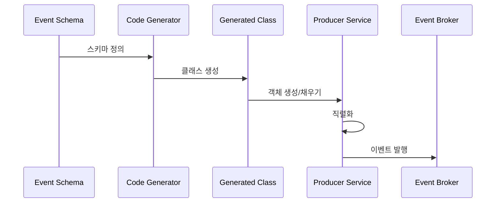

#### Consumer 워크플로우

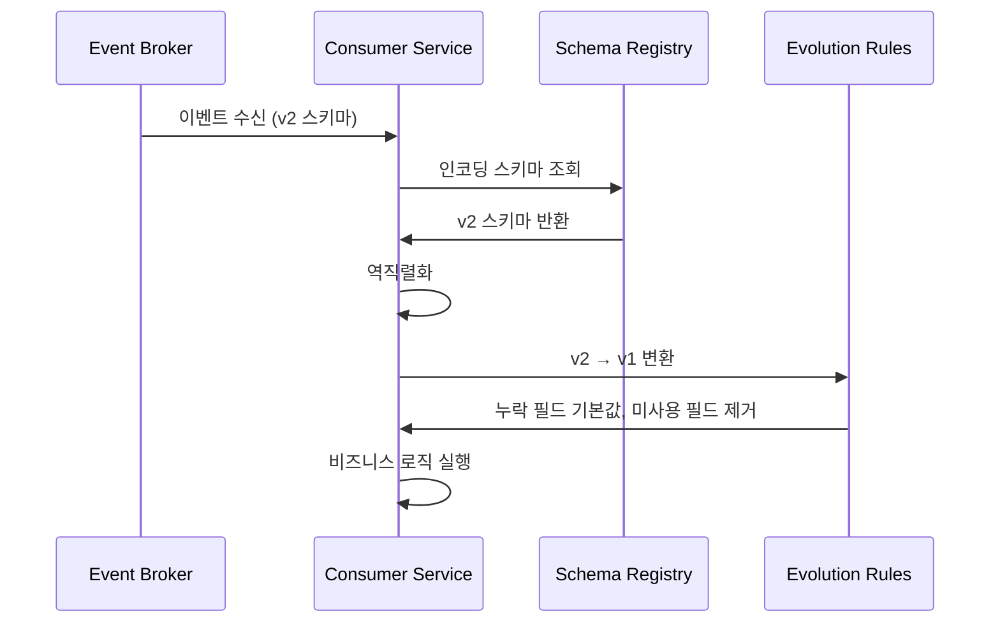

**코드 생성기의 이점:**

| 이점 | 설명 |
|------|------|
| **컴파일러 검사** | 이벤트 타입 오처리, non-null 필드 누락 방지 |
| **IDE 지원** | 잘못된 타입 전달 시 알림 |
| **데이터 품질** | 데이터 오처리 위험 감소 |

---

### 5. Breaking Schema Changes

스키마 정의가 호환되지 않는 방식으로 변경되어야 하는 경우가 있다.

#### 5.1 Entity에 대한 Breaking Change 처리

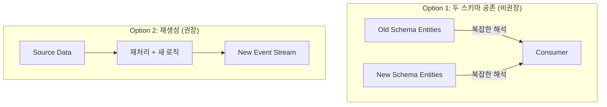

| 옵션 | 프로듀서 부담 | 컨슈머 부담 | 권장 여부 |
|------|--------------|------------|-----------|
| **Option 1** | 낮음 | 높음 (복잡한 해석) | ❌ |
| **Option 2** | 높음 (재처리) | 낮음 (일관된 형식) | ✅ |

> ⚠️ **경고**: 컨슈머는 프로듀서보다 분기된 스키마 정의를 해결하기에 절대 더 좋은 위치에 있지 않다. 이 책임을 컨슈머에게 미루는 것은 나쁜 관행이다.

> 💡 **팁**: 이전 엔티티는 원래 이벤트 스트림에 이전 스키마로 남겨두라 (재처리 검증 및 포렌식 조사용). 새로운 스키마로 새 엔티티를 새 스트림에 생성하라.

#### 5.2 Event에 대한 Breaking Change 처리

비-엔티티 이벤트는 더 간단하게 처리할 수 있다.

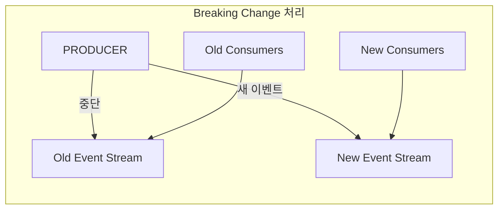

**처리 단계:**
1. 새 이벤트 스트림 생성
2. 새 이벤트를 새 스트림에 생성 시작
3. 기존 스트림 컨슈머에게 알림
4. 컨슈머가 새 스트림 등록
5. 기존 스트림 보존 기간 만료 후 삭제

> ⚠️ **경고**: 진화적으로 호환되지 않는 다른 이벤트 유형을 이벤트 스트림에 혼합하지 마라. 이벤트 스트림 오버헤드는 저렴하고, 논리적 분리가 중요하다.

---

### 6. Selecting an Event Format

#### 권장 포맷 비교

| 포맷 | Schema Evolution | Code Generation | 타입 안전성 | 권장 |
|------|------------------|-----------------|-------------|------|
| **Apache Avro** | ✅ Full 지원 | ✅ | ✅ | ✅ |
| **Protobuf** | ✅ Full 지원 | ✅ | ✅ | ✅ |
| **Thrift** | ✅ 지원 | ✅ | ✅ | ✅ |
| **JSON** | ⚠️ 제한적 | ❌ | ❌ | ❌ |
| **Plain Text** | ❌ | ❌ | ❌ | ❌ |

> 💡 **팁**: JSON은 Full-Compatibility Schema Evolution을 제공하지 않으므로 권장하지 않는다. Apache Avro 또는 Protobuf를 선택하라.

---

### 7. Designing Events - Best Practices

#### 7.1 진실을, 전체 진실을, 오직 진실만을 (Tell the Truth, the Whole Truth, and Nothing but the Truth)

좋은 이벤트 정의는 단순히 무언가 발생했다는 메시지가 아니라, **그 이벤트 동안 발생한 모든 것의 완전한 설명**이다.

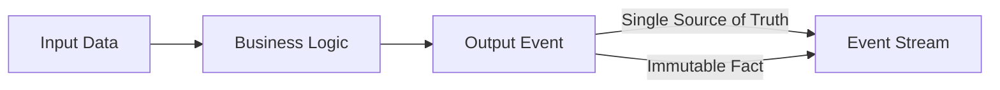

#### 7.2 스트림당 단일 이벤트 정의 사용

| 방식 | 권장 | 이유 |
|------|------|------|
| **단일 정의** | ✅ | 명확한 정의, 스키마 검증 용이 |
| **혼합 정의** | ❌ | 정의 모호화, 동적 스키마 추가 어려움 |

#### 7.3 가장 좁은 데이터 타입 사용

**피해야 할 실수들:**

| 실수 | 문제점 | 올바른 방법 |
|------|--------|------------|
| `string`으로 숫자 저장 | 파싱/변환 필요, null/빈 문자열 오류 | 적절한 숫자 타입 사용 |
| `integer`를 boolean으로 | 2나 -1은 무슨 의미? | `boolean` 타입 사용 |
| `string`을 enum으로 | 오타, 잘못된 값, 암묵적 정의 | `enum` 타입 사용 |

```protobuf
// ❌ 잘못된 예
message BadEvent {
  string latitude = 1;   // 숫자를 문자열로
  int32 is_active = 2;   // boolean을 정수로
  string status = 3;     // enum을 문자열로
}

// ✅ 올바른 예
message GoodEvent {
  double latitude = 1;
  bool is_active = 2;
  Status status = 3;

  enum Status {
    UNKNOWN = 0;
    PENDING = 1;
    COMPLETED = 2;
  }
}
```

> 💡 **Enum 처리**: Protobuf와 Avro 모두 알 수 없는 enum 토큰을 우아하게 처리하는 방법이 있다. 컨슈머는 인식하지 못하는 enum 토큰에 대해 기본값으로 처리하거나 예외를 발생시킬지 결정해야 한다.

---

### 8. Anti-Pattern: Type Field로 이벤트 오버로딩

#### 문제 시나리오

사용자가 책을 읽거나 영화를 볼 수 있는 웹사이트를 상상해보자.

**초기 설계:**

```protobuf
enum TypeEnum { BOOK, MOVIE }
enum ActionEnum { CLICK }

message ProductEngagement {
  int64 product_id = 1;
  TypeEnum product_type = 2;
  ActionEnum action_type = 3;
}
```

**새 요구사항 1**: 영화 시청 전 예고편 시청 여부 추적

```protobuf
message ProductEngagement {
  int64 product_id = 1;
  TypeEnum product_type = 2;
  ActionEnum action_type = 3;

  // ⚠️ Movie에만 적용됨
  optional bool watched_preview = 4;
}
```

**새 요구사항 2**: 책 북마크 페이지 추적

```protobuf
enum ActionEnum { CLICK, BOOKMARK }

message ProductEngagement {
  int64 product_id = 1;
  TypeEnum product_type = 2;
  ActionEnum action_type = 3;

  // ⚠️ Movie에만 적용됨
  optional bool watched_preview = 4;

  // ⚠️ Book + Bookmark에만 적용됨
  optional int32 page_id = 5;
}
```

#### 문제점

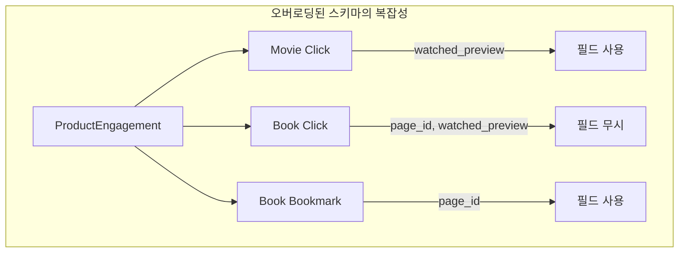

| 문제 | 영향 |
|------|------|
| **의미 혼란** | 각 type 값이 근본적으로 다른 비즈니스 의미 |
| **범위 확장** | 시간이 지남에 따라 이벤트가 커버하는 범위 증가 |
| **필터링 필요** | 컨슈머가 관심 없는 데이터 필터링 필수 |
| **진화 어려움** | 스키마 발전이 더 어려워짐 |

#### 올바른 설계

```protobuf
// ✅ 단일 목적 이벤트로 분리
message MovieClick {
  int64 movie_id = 1;
  bool watched_preview = 2;
}

message BookClick {
  int64 book_id = 1;
}

message BookBookmark {
  int64 book_id = 1;
  int32 page_id = 2;
}
```

**개선 결과:**

| 항목 | Before | After |
|------|--------|-------|
| 스키마 수 | 1 | 3 |
| 스키마당 복잡도 | 높음 | 낮음 |
| 필드 관련성 | 조건부 | 100% |
| 진화 용이성 | 어려움 | 쉬움 |

> ⚠️ **주의**: type 필드를 추가해도 데이터에 내재된 복잡성이 줄거나 없어지지 않는다. 실제로 복잡성은 여러 개의 명확한 스키마에서 하나의 병합된 스키마로 이동한 것뿐이며, 이는 복잡성을 증가시킨다고도 볼 수 있다.

---

### 9. 기타 설계 원칙

#### 9.1 이벤트 크기 최소화

| 고려사항 | 권장 조치 |
|----------|-----------|
| 데이터가 이벤트와 직접 관련? | 불필요한 "혹시 모를" 데이터 제거 |
| Bounded Context 범위 적절? | 서비스 범위 축소 고려 |
| 매우 큰 출력 (이미지 등)? | 포인터 사용 (단, Single Source of Truth 위험) |

#### 9.2 예상 컨슈머를 이벤트 설계에 참여시키기

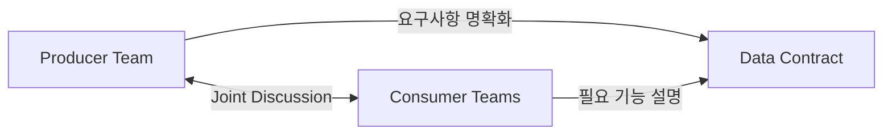

#### 9.3 이벤트를 세마포어/신호로 사용하지 마라

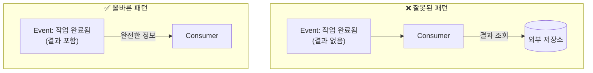

> ⚠️ **경고**: 두 개의 진실의 원천이 있으면 일관성 문제가 발생한다. 이벤트는 결과에 대한 Single Source of Truth여야 한다.

---

## 🔍 심화 학습

### 추가 조사 내용

#### Schema Registry

스키마 레지스트리는 스키마를 중앙에서 관리하고, 프로듀서/컨슈머가 온디맨드로 접근할 수 있게 한다.

| 구현체 | 지원 형식 | 특징 |
|--------|----------|------|
| **Confluent Schema Registry** | Avro, Protobuf, JSON Schema | Kafka 생태계 표준 |
| **AWS Glue Schema Registry** | Avro, JSON Schema | AWS 통합 |
| **Apicurio Registry** | Avro, Protobuf, JSON Schema, OpenAPI | 오픈 소스 |

#### Avro vs Protobuf 상세 비교

| 특성 | Avro | Protobuf |
|------|------|----------|
| **스키마 위치** | 데이터와 함께 또는 레지스트리 | 별도 .proto 파일 |
| **기본값 처리** | 스키마에 정의 | 언어별 기본값 |
| **동적 타이핑** | 지원 | 제한적 |
| **성능** | 좋음 | 약간 더 좋음 |
| **생태계** | Kafka, Hadoop | gRPC, 다양한 언어 |

### 출처
- [Confluent Schema Registry Documentation](https://docs.confluent.io/platform/current/schema-registry/)
- [Apache Avro Specification](https://avro.apache.org/docs/current/spec.html)
- [Protocol Buffers Documentation](https://developers.google.com/protocol-buffers)

---

## 💡 실무 적용 포인트

### 이런 상황에서 적용하세요

1. **새 이벤트 설계 시**: 명시적 스키마 + 주석 + 트리거링 로직 문서화
2. **필드 추가/삭제 시**: Schema Evolution 규칙 확인 (Full Compatibility 권장)
3. **도메인 모델 재정의 시**: Breaking Change 프로세스 따르기
4. **다중 목적 이벤트 발견 시**: 단일 목적 이벤트로 분리

### 주의할 점 / 흔한 실수

- ⚠️ **암묵적 스키마에 의존하지 마라**: 초기에는 쉬워 보이지만 장기적으로 큰 부담
- ⚠️ **type 필드로 이벤트 오버로딩하지 마라**: 복잡성이 사라지지 않고 이동할 뿐
- ⚠️ **이벤트를 신호로만 사용하지 마라**: 결과 데이터를 포함해야 함
- ⚠️ **Breaking Change를 컨슈머에게 미루지 마라**: 프로듀서가 해결해야 함
- ⚠️ **JSON을 이벤트 형식으로 선택하지 마라**: Full Compatibility 미지원

### 면접에서 나올 수 있는 질문

- **Q**: 데이터 계약의 두 구성 요소는 무엇인가요?
- **Q**: 명시적 스키마와 암묵적 스키마의 차이점과 각각의 장단점은?
- **Q**: Forward, Backward, Full Compatibility의 차이점을 설명해주세요.
- **Q**: Breaking Schema Change가 발생했을 때 Entity와 Event는 각각 어떻게 처리하나요?
- **Q**: 이벤트에 type 필드를 추가하는 것이 왜 안티패턴인가요?
- **Q**: 이벤트 설계 시 "진실을, 전체 진실을, 오직 진실만을"이란 원칙은 무엇을 의미하나요?

---

## ✅ 핵심 개념 체크리스트

- [ ] 데이터 계약의 두 구성 요소(Data Definition, Triggering Logic)를 설명할 수 있는가?
- [ ] 명시적 스키마가 왜 암묵적 스키마보다 우월한지 알고 있는가?
- [ ] Forward, Backward, Full Compatibility의 차이와 사용 사례를 이해했는가?
- [ ] 코드 생성기가 프로듀서와 컨슈머에게 어떤 이점을 주는지 알고 있는가?
- [ ] Breaking Change 시 Entity와 Event의 처리 방법 차이를 구분할 수 있는가?
- [ ] type 필드 오버로딩이 왜 안티패턴인지 설명할 수 있는가?
- [ ] 이벤트가 세마포어/신호로만 사용되면 안 되는 이유를 알고 있는가?

---

## 🔗 참고 자료

- 📄 공식 문서:
  - [Apache Avro Documentation](https://avro.apache.org/docs/current/)
  - [Protocol Buffers Documentation](https://developers.google.com/protocol-buffers)
  - [Confluent Schema Registry](https://docs.confluent.io/platform/current/schema-registry/)
- 📚 연관 서적:
  - "Designing Data-Intensive Applications" by Martin Kleppmann
- 🎬 추천 영상:
  - [Schema Evolution in Kafka - Confluent](https://www.youtube.com/watch?v=5fi1vhK2NlQ)

---

*📅 작성일: 2025-12-31*
*📖 원서: Building Event-Driven Microservices by Adam Bellemare (O'Reilly)*
