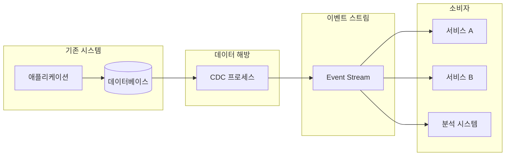
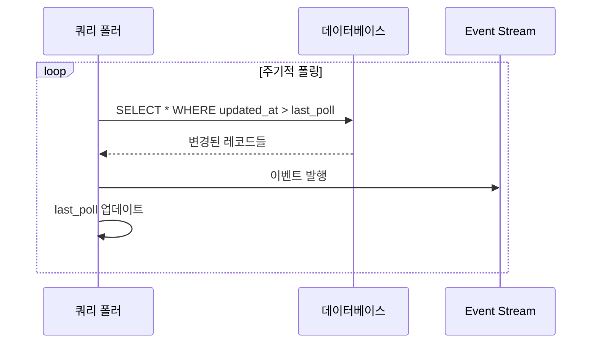
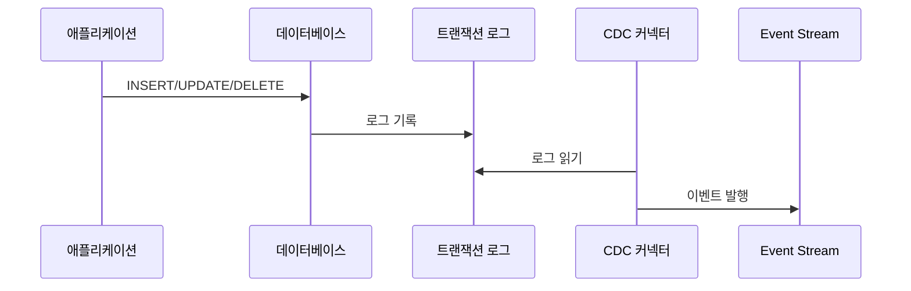
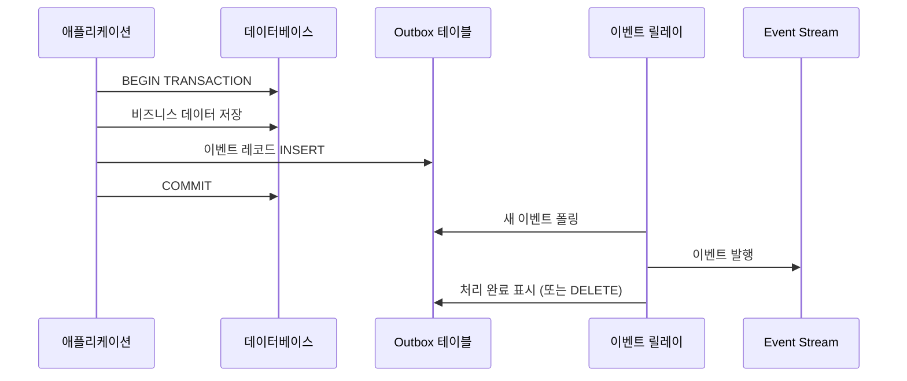
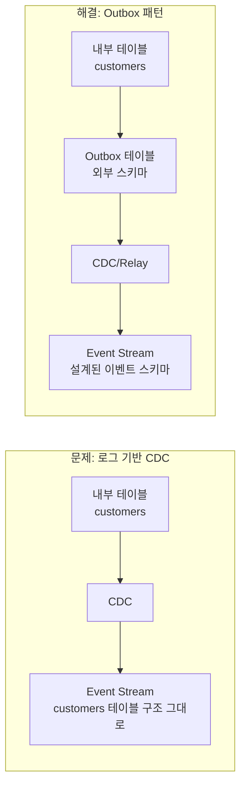
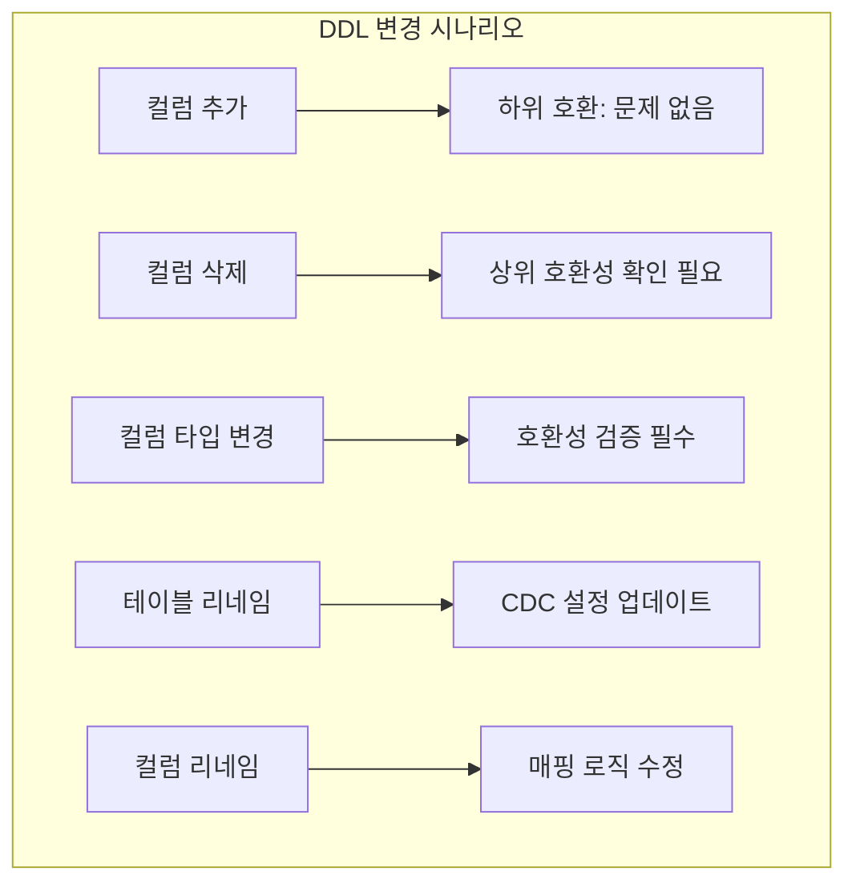
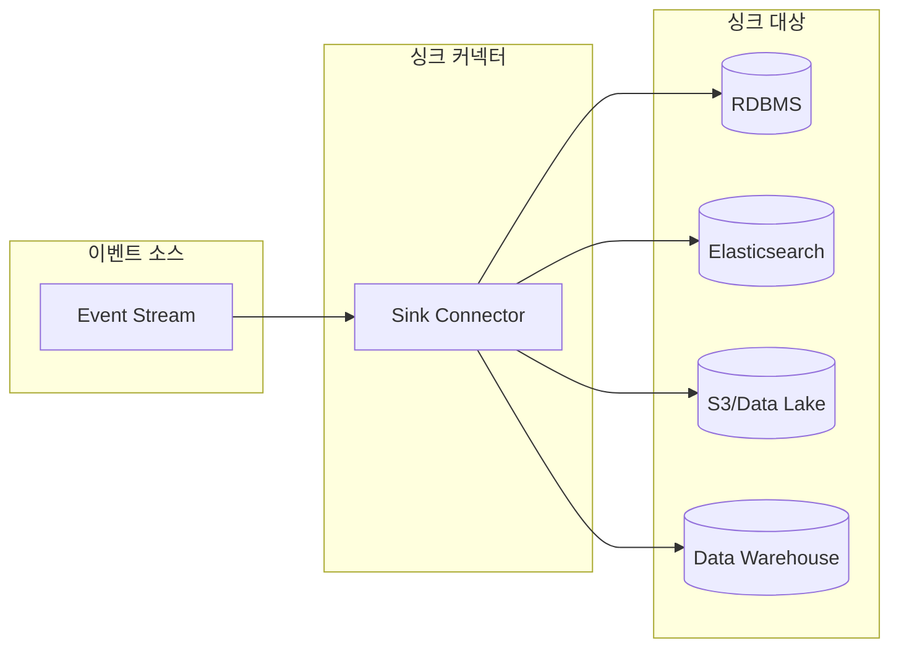
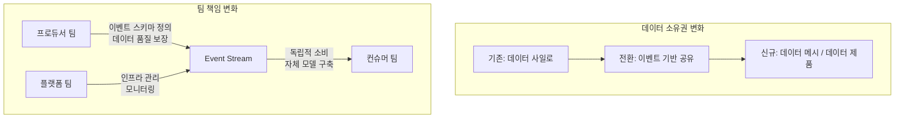

# Chapter 4. 기존 시스템과의 이벤트 기반 아키텍처 통합

## 핵심 요약

이벤트 기반 아키텍처(EDA)로의 전환은 기존 시스템의 데이터를 **이벤트 스트림(Event Stream)**으로 해방(Liberation)하는 것에서 시작합니다. **데이터 해방(Data Liberation)**은 세 가지 주요 패턴으로 구현됩니다:

1. **쿼리 기반 패턴(Query-based)**: 직접 데이터베이스 쿼리
2. **로그 기반 패턴(Log-based CDC)**: 데이터베이스 변경 로그 캡처
3. **테이블 기반 패턴(Outbox)**: 전용 이벤트 릴레이 테이블 사용

각 패턴은 고유한 장단점이 있으며, 조직의 기술 성숙도와 데이터 일관성 요구사항에 따라 선택해야 합니다. 이벤트 스트림을 기존 데이터 스토어로 다시 싱크(Sink)하는 것도 중요한 통합 전략입니다.

---

## 학습 목표

이 챕터를 학습한 후 다음을 할 수 있어야 합니다:

1. **데이터 해방(Data Liberation)**의 개념과 필요성을 설명할 수 있다
2. **세 가지 CDC 패턴**(Query, Log, Outbox)의 작동 방식과 트레이드오프를 비교할 수 있다
3. **Outbox 패턴**에서 스키마 호환성과 트리거 사용법을 이해할 수 있다
4. **이벤트 싱킹(Event Sinking)**의 목적과 구현 방식을 설명할 수 있다
5. **CDC 도입의 조직적 영향**과 데이터 소유권 문제를 이해할 수 있다

---

## 본문 정리

### 1. 데이터 해방 (Data Liberation)

**데이터 해방**은 기존 시스템의 데이터를 이벤트 스트림으로 변환하여 다른 서비스가 사용할 수 있도록 하는 프로세스입니다.



#### 왜 데이터 해방이 필요한가?

| 문제 | 데이터 해방의 해결책 |
|------|---------------------|
| 데이터 사일로 | 중앙화된 이벤트 스트림으로 공유 |
| 동기식 의존성 | 비동기 이벤트 소비로 디커플링 |
| 실시간 요구사항 | 변경 즉시 이벤트 발행 |
| 레거시 통합 | 기존 시스템 수정 없이 데이터 추출 |

---

### 2. 데이터 해방 패턴

#### 2.1 쿼리 기반 패턴 (Query-based / Data Store Query)

데이터베이스를 **주기적으로 쿼리**하여 변경사항을 감지합니다.



**구현 예시:**

```sql
-- 변경된 레코드 조회 (타임스탬프 기반)
SELECT * FROM orders
WHERE updated_at > :last_poll_time
ORDER BY updated_at ASC;

-- 자동 증가 ID 기반
SELECT * FROM orders
WHERE id > :last_processed_id
ORDER BY id ASC;
```

**장점:**
- 구현이 단순함
- 대부분의 데이터베이스에서 지원
- 기존 시스템 수정 불필요

**단점:**
- 삭제(DELETE) 감지 어려움
- 폴링 간격 동안의 지연 발생
- 다중 업데이트 시 중간 상태 손실 가능
- 데이터베이스 부하 증가

#### 2.2 로그 기반 패턴 (Log-based CDC)

데이터베이스의 **트랜잭션 로그(WAL, Binlog 등)**를 읽어 변경사항을 캡처합니다.



**주요 도구:**
- **Debezium**: Kafka Connect 기반 오픈소스 CDC
- **Maxwell**: MySQL binlog 기반
- **AWS DMS**: 관리형 CDC 서비스

**장점:**
- 모든 변경(INSERT, UPDATE, DELETE) 캡처
- 실시간에 가까운 지연 시간
- 데이터베이스 성능 영향 최소
- 트랜잭션 순서 보장

**단점:**
- 데이터베이스별 구현 필요
- **내부 데이터 모델(Internal Data Model) 노출**
- DDL 변경 시 복잡성 증가
- 로그 보관 기간 제한

#### 2.3 테이블 기반 패턴 (Outbox Pattern)

전용 **아웃박스 테이블(Outbox Table)**에 이벤트를 기록하고, 별도 프로세스가 이를 이벤트 스트림으로 릴레이합니다.



**Outbox 테이블 스키마:**

```sql
CREATE TABLE outbox_events (
    id BIGINT AUTO_INCREMENT PRIMARY KEY,
    aggregate_type VARCHAR(255) NOT NULL,    -- 예: 'Order', 'Customer'
    aggregate_id VARCHAR(255) NOT NULL,       -- 예: 주문 ID
    event_type VARCHAR(255) NOT NULL,         -- 예: 'OrderCreated'
    payload JSON NOT NULL,                    -- 이벤트 데이터 (외부 스키마)
    created_at TIMESTAMP DEFAULT CURRENT_TIMESTAMP,
    processed_at TIMESTAMP NULL               -- 처리 완료 시간
);

-- 인덱스
CREATE INDEX idx_outbox_unprocessed
ON outbox_events(processed_at) WHERE processed_at IS NULL;
```

**장점:**
- **내부 데이터 모델과 외부 이벤트 스키마 분리**
- 트랜잭션 일관성 보장 (비즈니스 로직 + 이벤트 = 원자적)
- 스키마 호환성 제어 가능
- 어떤 CDC 방식과도 조합 가능

**단점:**
- 애플리케이션 코드 수정 필요
- 추가 테이블 및 릴레이 프로세스 필요
- 약간의 쓰기 오버헤드

---

### 3. 패턴 비교

| 특성 | 쿼리 기반 | 로그 기반 (CDC) | 테이블 기반 (Outbox) |
|------|-----------|-----------------|---------------------|
| **구현 복잡도** | 낮음 | 중간 | 중간 |
| **코드 수정** | 불필요 | 불필요 | 필요 |
| **삭제 감지** | 어려움 | 가능 | 가능 |
| **지연 시간** | 폴링 주기 | 실시간 | 폴링/CDC 의존 |
| **내부 모델 노출** | 쿼리 의존 | **노출됨** | **분리됨** |
| **스키마 제어** | 제한적 | 제한적 | **완전 제어** |
| **DB 부하** | 높음 | 낮음 | 낮음 |
| **트랜잭션 일관성** | 제한적 | 보장 | **완전 보장** |

---

### 4. 내부 데이터 모델 격리 (Isolating Internal Data Models)

로그 기반 CDC의 가장 큰 단점은 **내부 데이터 모델이 그대로 외부에 노출**된다는 것입니다.



#### 내부 모델 노출의 문제점:

1. **스키마 변경 전파**: 내부 테이블 변경이 소비자에게 영향
2. **불필요한 정보 노출**: 내부용 컬럼까지 외부에 전달
3. **이벤트 의미 불명확**: 테이블 변경 ≠ 비즈니스 이벤트
4. **버전 관리 어려움**: 스키마 호환성 유지 부담

---

### 5. Outbox 패턴의 스키마 호환성

Outbox 패턴은 **이벤트 스키마를 명시적으로 정의**하므로 스키마 진화를 제어할 수 있습니다.

```java
// 내부 도메인 모델 (변경 가능)
@Entity
public class Order {
    private Long id;
    private String customerId;
    private BigDecimal totalAmount;
    private String internalStatus;      // 내부용 필드
    private String legacySystemRef;     // 레거시 참조
    // ...
}

// 외부 이벤트 스키마 (호환성 유지)
public class OrderCreatedEvent {
    private String orderId;             // 외부 공개 필드만
    private String customerId;
    private BigDecimal amount;
    private String status;              // 매핑된 상태값
    // 스키마 버전 관리
    private int schemaVersion = 2;
}
```

**Outbox 레코드 생성:**

```java
// 비즈니스 로직에서 Outbox 이벤트 생성
@Transactional
public Order createOrder(CreateOrderRequest request) {
    // 1. 비즈니스 데이터 저장
    Order order = orderRepository.save(new Order(request));

    // 2. 외부 이벤트 스키마로 변환하여 Outbox에 저장
    OrderCreatedEvent event = OrderCreatedEvent.builder()
        .orderId(order.getId().toString())
        .customerId(order.getCustomerId())
        .amount(order.getTotalAmount())
        .status(mapToExternalStatus(order.getInternalStatus()))
        .build();

    outboxRepository.save(new OutboxEvent(
        "Order",
        order.getId().toString(),
        "OrderCreated",
        objectMapper.writeValueAsString(event)
    ));

    return order;
    // 트랜잭션 커밋 시 둘 다 저장됨
}
```

---

### 6. 트리거를 사용한 CDC (Triggers for Capturing Changes)

데이터베이스 **트리거(Trigger)**를 사용하여 변경사항을 캡처할 수 있습니다.

```sql
-- 변경 캡처 테이블
CREATE TABLE customer_changes (
    change_id BIGINT AUTO_INCREMENT PRIMARY KEY,
    customer_id BIGINT NOT NULL,
    operation ENUM('INSERT', 'UPDATE', 'DELETE'),
    old_data JSON,
    new_data JSON,
    changed_at TIMESTAMP DEFAULT CURRENT_TIMESTAMP
);

-- INSERT 트리거
CREATE TRIGGER customer_insert_trigger
AFTER INSERT ON customers
FOR EACH ROW
BEGIN
    INSERT INTO customer_changes
        (customer_id, operation, new_data)
    VALUES
        (NEW.id, 'INSERT', JSON_OBJECT(
            'id', NEW.id,
            'name', NEW.name,
            'email', NEW.email
        ));
END;

-- UPDATE 트리거
CREATE TRIGGER customer_update_trigger
AFTER UPDATE ON customers
FOR EACH ROW
BEGIN
    INSERT INTO customer_changes
        (customer_id, operation, old_data, new_data)
    VALUES
        (NEW.id, 'UPDATE',
         JSON_OBJECT('id', OLD.id, 'name', OLD.name, 'email', OLD.email),
         JSON_OBJECT('id', NEW.id, 'name', NEW.name, 'email', NEW.email));
END;

-- DELETE 트리거
CREATE TRIGGER customer_delete_trigger
AFTER DELETE ON customers
FOR EACH ROW
BEGIN
    INSERT INTO customer_changes
        (customer_id, operation, old_data)
    VALUES
        (OLD.id, 'DELETE',
         JSON_OBJECT('id', OLD.id, 'name', OLD.name, 'email', OLD.email));
END;
```

**트리거 방식의 트레이드오프:**

| 장점 | 단점 |
|------|------|
| 애플리케이션 수정 불필요 | 데이터베이스 성능 영향 |
| 모든 변경 캡처 가능 | 트리거 관리 복잡성 |
| 삭제 감지 가능 | 데이터베이스 의존적 |
| 동기적으로 캡처 | 디버깅 어려움 |

---

### 7. DDL 변경 처리 (Handling DDL Changes)

스키마 변경(DDL)은 CDC 파이프라인에 영향을 줄 수 있습니다.



**DDL 변경 대응 전략:**

1. **사전 통지**: 스키마 변경 전 다운스트림 팀에 알림
2. **점진적 마이그레이션**: 새 컬럼 추가 → 데이터 마이그레이션 → 구 컬럼 삭제
3. **스키마 레지스트리 활용**: 호환성 자동 검증
4. **Outbox 패턴 사용**: 내부 DDL과 외부 이벤트 분리

---

### 8. 이벤트 싱킹 (Sinking Event Data to Data Stores)

**이벤트 싱킹**은 이벤트 스트림의 데이터를 데이터 스토어로 다시 저장하는 프로세스입니다.



#### 싱킹 사용 사례:

| 사용 사례 | 싱크 대상 | 목적 |
|----------|----------|------|
| 검색 기능 | Elasticsearch | 전문 검색 지원 |
| 분석/리포팅 | Data Warehouse | OLAP 쿼리 |
| 아카이빙 | S3/Data Lake | 장기 보관 |
| 캐싱 | Redis | 빠른 읽기 |
| 레거시 통합 | RDBMS | 기존 시스템 연동 |

**Kafka Connect 싱크 커넥터 예시:**

```json
{
  "name": "elasticsearch-sink",
  "config": {
    "connector.class": "io.confluent.connect.elasticsearch.ElasticsearchSinkConnector",
    "topics": "orders",
    "connection.url": "http://elasticsearch:9200",
    "type.name": "_doc",
    "key.ignore": "false",
    "schema.ignore": "true",
    "transforms": "extractKey",
    "transforms.extractKey.type": "org.apache.kafka.connect.transforms.ExtractField$Key",
    "transforms.extractKey.field": "orderId"
  }
}
```

---

### 9. 조직적 영향 (Organizational Impacts of CDC)

CDC 도입은 기술적 변화를 넘어 **조직 구조와 프로세스**에도 영향을 미칩니다.



#### 주요 조직적 고려사항:

1. **데이터 소유권 명확화**
   - 누가 이벤트 스키마를 정의하고 유지하는가?
   - 스키마 변경 시 승인 프로세스는?

2. **팀 간 계약**
   - 이벤트 SLA (지연 시간, 가용성)
   - 스키마 호환성 정책
   - 버전 관리 및 폐기 절차

3. **거버넌스**
   - 이벤트 카탈로그 관리
   - 데이터 품질 모니터링
   - 컴플라이언스 및 보안

4. **기술 부채 관리**
   - 레거시 CDC → 표준화된 CDC 전환
   - 스키마 레지스트리 도입
   - 모니터링 및 알림 체계

---

## 심화 학습

### 고급 CDC 패턴

1. **이중 쓰기 문제 (Dual Write Problem)**
   - 데이터베이스와 이벤트 스트림에 동시 쓰기 시 일관성 문제
   - Outbox 패턴이나 트랜잭셔널 메시징으로 해결

2. **Exactly-Once 의미론**
   - 이벤트 중복 발행 방지
   - 멱등성(Idempotency) 키 사용

3. **스키마 레지스트리 통합**
   - Confluent Schema Registry
   - AWS Glue Schema Registry
   - 호환성 자동 검증

### 도구 비교

| 도구 | 지원 DB | 특징 |
|------|---------|------|
| **Debezium** | MySQL, PostgreSQL, MongoDB, etc. | Kafka Connect 기반, 오픈소스 |
| **Maxwell** | MySQL | 경량, binlog 특화 |
| **AWS DMS** | 다양 | 관리형, AWS 생태계 통합 |
| **Striim** | 다양 | 엔터프라이즈, 실시간 분석 |
| **Airbyte** | 다양 | ELT 중심, 오픈소스 |

---

## 실무 적용 포인트

### 패턴 선택 가이드

```
레거시 시스템, 코드 수정 불가 → 쿼리 기반 또는 로그 기반
├─ 삭제 감지 필요 → 로그 기반 (Debezium 등)
├─ 단순 동기화 → 쿼리 기반
└─ 실시간 요구 → 로그 기반

새로운 시스템, 코드 수정 가능 → Outbox 패턴 권장
├─ 스키마 제어 필요 → Outbox 필수
├─ 트랜잭션 일관성 → Outbox 필수
└─ 마이크로서비스 → Outbox + CDC 조합
```

### 구현 체크리스트

**쿼리 기반:**
- [ ] 타임스탬프/시퀀스 컬럼 존재 확인
- [ ] 인덱스 최적화
- [ ] 폴링 주기 결정
- [ ] 삭제 감지 전략 (Soft Delete?)

**로그 기반:**
- [ ] 데이터베이스 binlog/WAL 활성화
- [ ] CDC 커넥터 선택 및 설정
- [ ] 스키마 레지스트리 통합
- [ ] DDL 변경 대응 절차

**Outbox:**
- [ ] Outbox 테이블 스키마 설계
- [ ] 릴레이 프로세스 구현/선택
- [ ] 외부 이벤트 스키마 정의
- [ ] 트랜잭션 경계 설계

---

## 체크리스트

### 개념 이해 확인

- [ ] 데이터 해방(Data Liberation)의 목적을 설명할 수 있다
- [ ] 세 가지 CDC 패턴의 차이점을 비교할 수 있다
- [ ] 로그 기반 CDC의 내부 모델 노출 문제를 이해한다
- [ ] Outbox 패턴이 스키마 호환성을 보장하는 방법을 안다
- [ ] 이벤트 싱킹의 사용 사례를 나열할 수 있다

### 실습 과제

- [ ] Debezium을 사용해 MySQL CDC 설정
- [ ] Outbox 패턴을 Spring Boot에서 구현
- [ ] Kafka Connect 싱크 커넥터 설정
- [ ] 스키마 레지스트리로 호환성 검증

---

## 참고 자료

### 공식 문서
- [Debezium Documentation](https://debezium.io/documentation/)
- [Kafka Connect](https://kafka.apache.org/documentation/#connect)
- [Confluent Schema Registry](https://docs.confluent.io/platform/current/schema-registry/)

### 패턴 및 아키텍처
- [Transactional Outbox Pattern - microservices.io](https://microservices.io/patterns/data/transactional-outbox.html)
- [Change Data Capture - Martin Fowler](https://martinfowler.com/articles/patterns-of-distributed-systems/change-data-capture.html)

### 도서
- "Building Event-Driven Microservices" - Adam Bellemare, Chapter 4
- "Designing Data-Intensive Applications" - Martin Kleppmann

---

## 핵심 용어 정리

| 용어 | 정의 |
|------|------|
| **Data Liberation** | 기존 시스템 데이터를 이벤트 스트림으로 해방하는 프로세스 |
| **CDC (Change Data Capture)** | 데이터 변경사항을 캡처하는 기술/패턴 |
| **Outbox Pattern** | 이벤트를 전용 테이블에 기록 후 릴레이하는 패턴 |
| **Event Sinking** | 이벤트 스트림 데이터를 저장소로 저장하는 프로세스 |
| **Dual Write Problem** | DB와 이벤트 스트림 동시 쓰기 시 일관성 문제 |
| **Schema Registry** | 이벤트 스키마를 중앙 관리하는 저장소 |
