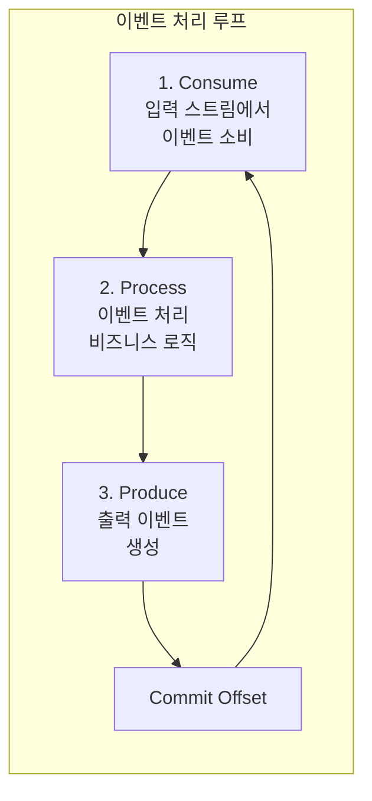
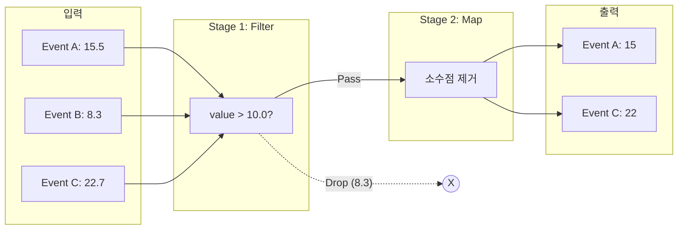
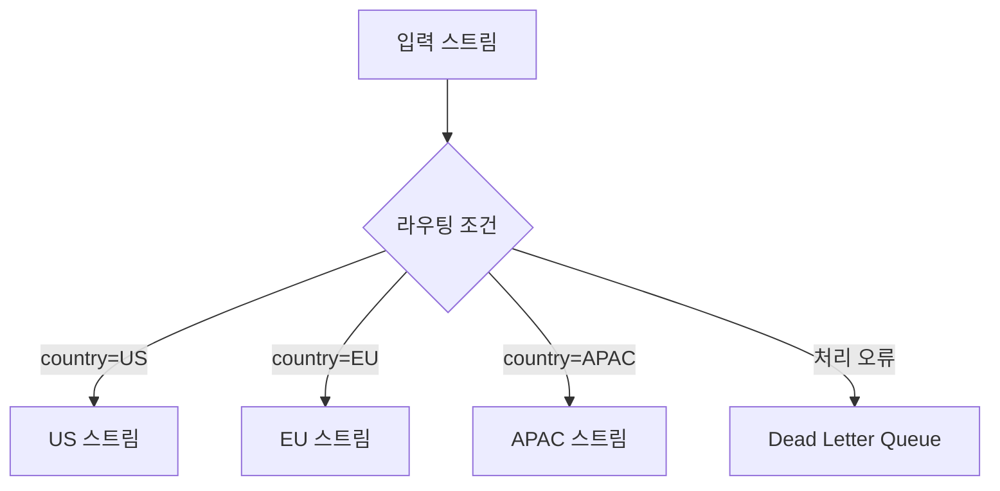
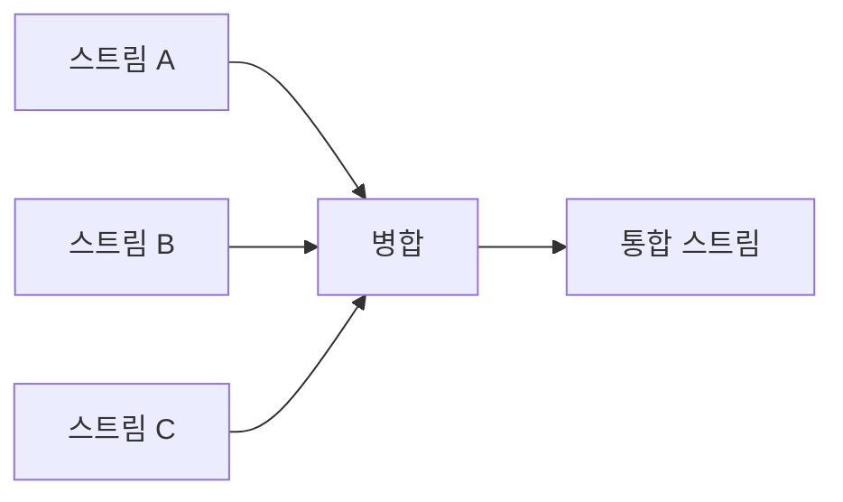
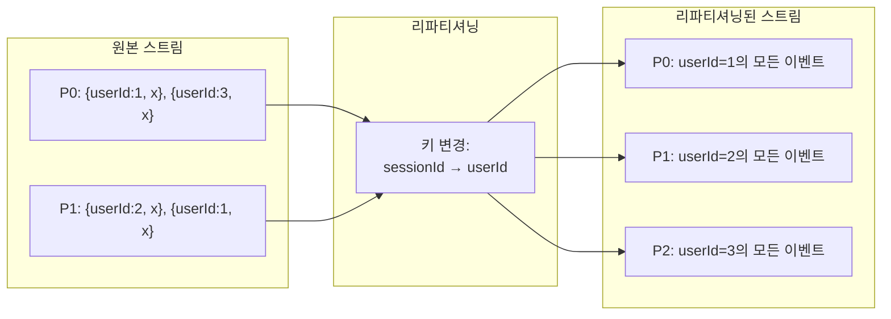
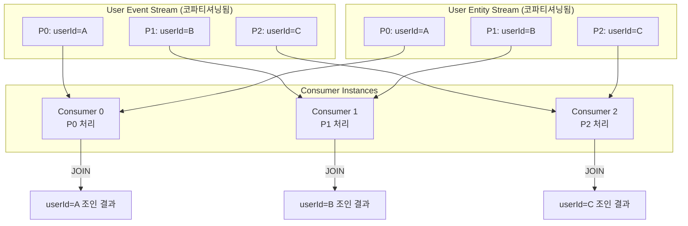
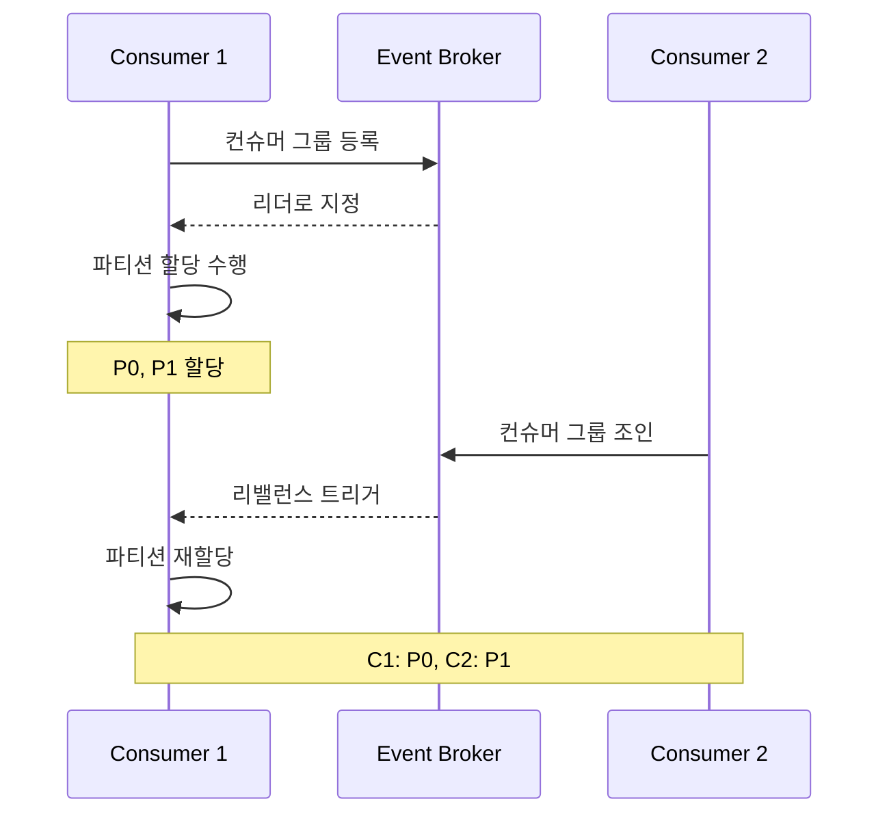
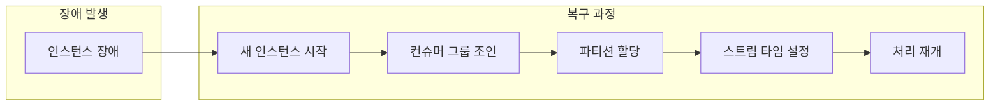
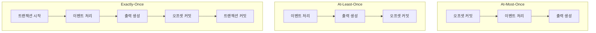

# Chapter 5. 이벤트 기반 처리 기초

## 핵심 요약

이벤트 기반 마이크로서비스는 세 가지 기본 단계를 따릅니다: **소비(Consume) → 처리(Process) → 생산(Produce)**. 처리 로직은 **토폴로지(Topology)**로 구성되며, **Filter**, **Map**, **MapValue** 등의 변환 연산자를 조합합니다.

**파티셔닝(Partitioning)**은 이벤트 기반 처리의 핵심입니다. **리파티셔닝(Repartitioning)**은 키, 파티션 수, 파티셔너 변경을 위해 새 스트림을 생성하고, **코파티셔닝(Copartitioning)**은 조인 등 상태 처리를 위해 동일한 파티션 구조를 보장합니다. **파티션 어사이너(Partition Assignor)**가 컨슈머 인스턴스에 파티션을 균등 배분합니다.

---

## 학습 목표

이 챕터를 학습한 후 다음을 할 수 있어야 합니다:

1. **이벤트 처리 루프**(Consume → Process → Produce)의 구조를 설명할 수 있다
2. **Stateless Topology**와 주요 변환 연산자(Filter, Map, MapValue)를 활용할 수 있다
3. **Repartitioning**과 **Copartitioning**의 차이점과 필요성을 이해한다
4. **Partition Assignor**의 역할과 할당 전략을 설명할 수 있다
5. **Stateless 처리 인스턴스 장애 복구**의 간단함을 이해한다

---

## 본문 정리

### 1. 기본 이벤트 처리 루프

대부분의 이벤트 기반 마이크로서비스는 동일한 세 단계를 따릅니다:



**기본 처리 루프 의사코드:**

```java
// 컨슈머 및 프로듀서 클라이언트 초기화
Consumer consumerClient = new ConsumerClient(consumerGroupName, ...);
Producer producerClient = new ProducerClient(...);

while (true) {
    // 1. 입력 스트림에서 이벤트 소비
    InputEvent event = consumerClient.pollOneEvent(inputEventStream);

    // 2. 이벤트 처리 (비즈니스 로직 적용)
    OutputEvent output = processEvent(event);

    // 3. 출력 스트림에 이벤트 생성
    producerClient.produceEventToStream(outputEventStream, output);

    // At-least-once 처리를 위한 오프셋 커밋
    consumerClient.commitOffsets();
}
```

#### processEvent 함수

`processEvent` 함수는 마이크로서비스의 **처리 토폴로지(Processing Topology)**의 진입점입니다:
- 비즈니스 로직 적용
- 어떤 이벤트를 발행할지 결정
- 데이터 기반 패턴으로 변환 및 처리

---

### 2. Stateless 토폴로지 구성

토폴로지는 이벤트에 대해 수행할 **연산의 시퀀스**입니다.



| 이벤트 | Stage 1 (Filter: >10.0) | Stage 2 (Map) | 결과 |
|--------|-------------------------|---------------|------|
| A: 15.5 | ✅ Pass | 15 | 출력됨 |
| B: 8.3 | ❌ Drop | - | 필터링 |
| C: 22.7 | ✅ Pass | 22 | 출력됨 |

---

### 3. 주요 변환 연산자 (Transformations)

변환은 **단일 이벤트를 처리하여 0개 이상의 출력 이벤트**를 생성합니다.

| 연산자 | 설명 | 출력 수 | 리파티션 필요 |
|--------|------|---------|--------------|
| **Filter** | 조건 충족 시 이벤트 전달 | 0 또는 1 | 불필요 |
| **Map** | 키 및/또는 값 변경 | 정확히 1 | 키 변경 시 필요 |
| **MapValue** | 값만 변경 (키 유지) | 정확히 1 | 불필요 |
| **Custom** | 커스텀 로직, 상태 조회, 외부 시스템 통신 | 0개 이상 | 상황에 따라 |

#### 코드 예시 (Kafka Streams 스타일):

```java
// Filter: 조건 충족 이벤트만 통과
stream
    .filter((key, value) -> value.getAmount() > 100)

// Map: 키와 값 모두 변환 (리파티션 필요할 수 있음)
    .map((key, value) -> KeyValue.pair(
        value.getCustomerId(),           // 새 키
        new OrderSummary(value)          // 새 값
    ))

// MapValues: 값만 변환 (키 유지, 리파티션 불필요)
    .mapValues(value -> value.toUpperCase())

// 출력 스트림에 전송
    .to("output-topic");
```

---

### 4. 스트림 분기와 병합 (Branching and Merging)

#### 분기 (Branching)

이벤트를 조건에 따라 **다른 출력 스트림으로 라우팅**합니다.



**사용 사례:**
- 국가/지역별 이벤트 라우팅
- 제품 카테고리별 분기
- 처리 오류 시 Dead Letter Queue로 전송

#### 병합 (Merging)

여러 입력 스트림을 **하나의 출력 스트림으로 결합**합니다.



> ⚠️ **경고**: 스트림을 병합할 때는 **통합된 도메인을 대표하는 새로운 스키마**를 정의해야 합니다. 도메인이 맞지 않으면 병합하지 않고 시스템 설계를 재고하는 것이 좋습니다.

---

### 5. 리파티셔닝 (Repartitioning)

**리파티셔닝**은 다음 속성이 다른 새 이벤트 스트림을 생성하는 것입니다:

| 변경 대상 | 목적 |
|----------|------|
| **파티션 수** | 다운스트림 병렬성 증가, 코파티셔닝 매칭 |
| **이벤트 키** | 동일 키 이벤트를 동일 파티션으로 라우팅 |
| **파티셔너** | 파티션 선택 로직 변경 |



#### 데이터 지역성 (Data Locality)

> 💡 **Tip**: 파티셔너 알고리즘은 이벤트 키를 특정 파티션에 **결정적으로 매핑**합니다 (보통 해시 함수 사용). 이로써 동일 키의 모든 이벤트가 동일 파티션에 저장됩니다.

**데이터 지역성의 이점:**
- 컨슈머가 단일 파티션만 소비하면 해당 키의 **완전한 이벤트 그림** 구축 가능
- 마이크로서비스 스케일아웃 시 각 인스턴스가 특정 키 집합의 **완전한 상태 유지**
- 상태 기반 처리의 기초

---

### 6. 코파티셔닝 (Copartitioning)

**코파티셔닝**은 두 스트림이 다음 조건을 만족하도록 하는 것입니다:

1. **동일한 파티션 수**
2. **동일한 파티셔너 알고리즘**
3. **동일한 키 분포**

#### 코파티셔닝이 필요한 이유

조인 등 **상태 기반 처리**에서 여러 스트림의 동일 키 이벤트가 **같은 노드에서 처리**되어야 합니다.



| 특성 | User Event Stream | User Entity Stream |
|------|-------------------|-------------------|
| 파티션 수 | 3 | 3 |
| 키 | userId | userId |
| 파티셔너 | 동일한 해시 함수 | 동일한 해시 함수 |
| P0 키 분포 | A | A |
| P1 키 분포 | B | B |
| P2 키 분포 | C | C |

---

### 7. 파티션 할당 (Partition Assignment)

#### 컨슈머 그룹과 파티션 할당



#### 이벤트 브로커별 차이

| 브로커 | 파티션 할당 주체 | 특징 |
|--------|-----------------|------|
| **Apache Kafka** | 첫 번째 온라인 클라이언트 (리더) | 클라이언트 측 할당 |
| **Apache Pulsar** | 브로커 (중앙화) | 서버 측 할당 |

---

### 8. 파티션 할당 전략 (Assignment Strategies)

#### 8.1 라운드 로빈 (Round-Robin)

모든 파티션을 목록화하여 각 컨슈머에 순환 할당합니다.

**2개 인스턴스:**

```
┌─────────────────────────────────────────────────────┐
│                    Consumer C0                       │
│  ┌─────────┐ ┌─────────┐ ┌─────────┐ ┌─────────┐   │
│  │Stream A │ │Stream A │ │Copart B │ │Copart B │   │
│  │   P0    │ │   P2    │ │   P0    │ │   P2    │   │
│  └─────────┘ └─────────┘ └─────────┘ └─────────┘   │
│  ┌─────────┐ ┌─────────┐                            │
│  │Copart C │ │Copart C │                            │
│  │   P0    │ │   P2    │                            │
│  └─────────┘ └─────────┘                            │
└─────────────────────────────────────────────────────┘

┌─────────────────────────────────────────────────────┐
│                    Consumer C1                       │
│  ┌─────────┐ ┌─────────┐ ┌─────────┐               │
│  │Stream A │ │Copart B │ │Copart C │               │
│  │   P1    │ │   P1    │ │   P1    │               │
│  └─────────┘ └─────────┘ └─────────┘               │
└─────────────────────────────────────────────────────┘
```

**4개 인스턴스로 확장:**

```
C0: Stream A P0, Copart B P0, Copart C P0
C1: Stream A P1, Copart B P1, Copart C P1
C2: Stream A P2, Copart B P2, Copart C P2
C3: Stream A P3 (추가 파티션 없으면 유휴)
```

#### 8.2 정적 할당 (Static Assignment)

특정 파티션을 특정 컨슈머에 **고정 할당**합니다.

**사용 사례:**
- 대량의 상태 데이터가 특정 인스턴스에 물질화된 경우
- 내부 상태 저장소(Internal State Store) 사용 시

**동작:**
- 컨슈머가 그룹을 떠나도 파티션 재할당 안 함
- 원래 컨슈머가 돌아올 때까지 대기
- 타임아웃 시 동적 재할당 가능

#### 8.3 커스텀 할당 (Custom Assignment)

외부 신호와 도구를 활용한 맞춤형 할당.

**예시:**
- 입력 스트림의 **현재 Lag**에 기반한 할당
- 컨슈머 인스턴스 간 **작업량 균등 분배**

---

### 9. 코파티션 할당 보장

파티션 어사이너는 **코파티셔닝 요구사항**도 보장해야 합니다:

```java
// 코파티션 검증 예시
public void assignPartitions(List<TopicPartition> userEvents,
                             List<TopicPartition> userEntities) {
    // 파티션 수 동일 여부 검증
    if (userEvents.size() != userEntities.size()) {
        throw new IllegalStateException(
            "코파티셔닝 실패: 파티션 수 불일치 - " +
            "userEvents: " + userEvents.size() +
            ", userEntities: " + userEntities.size()
        );
    }

    // 같은 파티션 번호는 같은 컨슈머에 할당
    for (int i = 0; i < userEvents.size(); i++) {
        Consumer consumer = selectConsumer(i);
        consumer.assign(userEvents.get(i));
        consumer.assign(userEntities.get(i));
    }
}
```

---

### 10. Stateless 처리 인스턴스 장애 복구

**Stateless 프로세서**의 장애 복구는 매우 간단합니다:



**Stateless 복구가 빠른 이유:**
- 상태 복원(State Restoration) 불필요
- 파티션 할당 즉시 처리 시작 가능
- 새 인스턴스 추가와 동일한 과정

---

## 심화 학습

### Stateful vs Stateless 처리 비교

| 특성 | Stateless | Stateful |
|------|-----------|----------|
| **상태 관리** | 없음 | 로컬 상태 저장소 필요 |
| **복구 시간** | 즉시 | 상태 복원 필요 |
| **리파티셔닝** | 드물게 필요 | 자주 필요 |
| **코파티셔닝** | 선택적 | 조인 시 필수 |
| **복잡도** | 낮음 | 높음 |
| **예시 연산** | Filter, Map | Join, Aggregate, Window |

### 처리 보장 수준



---

## 실무 적용 포인트

### 토폴로지 설계 가이드

```
처리 요구사항 분석
├─ 단순 필터링/변환 → Filter + Map 조합
├─ 키 변경 필요 → Map + Repartition
├─ 여러 스트림 조인 → Copartitioning 먼저
├─ 조건별 라우팅 → Branch 사용
└─ 오류 처리 → Dead Letter Queue 분기
```

### 파티션 전략 선택

```
파티션 수 결정
├─ 예상 처리량 기반
├─ 컨슈머 인스턴스 수 고려
├─ 코파티셔닝 대상 스트림과 매칭
└─ 향후 확장성 고려 (증가만 가능)

할당 전략 선택
├─ 일반적인 경우 → Round-Robin
├─ 상태 기반 처리 → Static Assignment
└─ 특수 요구사항 → Custom Assignment
```

### 구현 체크리스트

**기본 처리 루프:**
- [ ] Consumer/Producer 클라이언트 초기화
- [ ] 적절한 오프셋 커밋 전략 선택
- [ ] 에러 핸들링 및 재시도 로직

**토폴로지 구성:**
- [ ] 필요한 변환 연산자 식별
- [ ] 리파티셔닝 필요 여부 확인
- [ ] 분기/병합 스트림 스키마 정의

**파티셔닝:**
- [ ] 적절한 파티션 수 결정
- [ ] 코파티셔닝 요구사항 확인
- [ ] 파티션 할당 전략 선택

---

## 체크리스트

### 개념 이해 확인

- [ ] Consume → Process → Produce 루프를 설명할 수 있다
- [ ] Filter, Map, MapValue의 차이점을 안다
- [ ] Repartitioning이 필요한 상황을 식별할 수 있다
- [ ] Copartitioning의 세 가지 조건을 나열할 수 있다
- [ ] 라운드 로빈과 정적 할당의 차이를 안다
- [ ] Stateless 복구가 빠른 이유를 설명할 수 있다

### 실습 과제

- [ ] Kafka Streams로 간단한 Filter → Map 토폴로지 구현
- [ ] 이벤트 키 변경 후 리파티셔닝 적용
- [ ] 두 스트림 코파티셔닝 후 조인 수행
- [ ] 컨슈머 그룹 리밸런스 동작 관찰

---

## 참고 자료

### 공식 문서
- [Kafka Streams Developer Guide](https://kafka.apache.org/documentation/streams/)
- [Apache Flink Documentation](https://flink.apache.org/docs/)
- [Apache Pulsar Consumer Concepts](https://pulsar.apache.org/docs/concepts-messaging/)

### 패턴 및 아키텍처
- [Stream Processing Topologies](https://www.confluent.io/learn/stream-processing/)
- [Partition Assignment Strategies](https://kafka.apache.org/documentation/#consumerconfigs_partition.assignment.strategy)

### 도서
- "Building Event-Driven Microservices" - Adam Bellemare, Chapter 5
- "Kafka: The Definitive Guide" - Neha Narkhede et al.

---

## 핵심 용어 정리

| 용어 | 정의 |
|------|------|
| **Topology** | 이벤트에 대해 수행할 연산의 시퀀스 |
| **Transformation** | 단일 이벤트를 처리하여 0개 이상의 출력 생성 |
| **Repartitioning** | 새로운 키/파티션 수/파티셔너로 스트림 재생성 |
| **Copartitioning** | 두 스트림이 동일한 파티션 구조를 갖도록 함 |
| **Data Locality** | 동일 키 데이터가 동일 파티션에 위치하는 특성 |
| **Partition Assignor** | 컨슈머 인스턴스에 파티션을 분배하는 컴포넌트 |
| **Consumer Group** | 동일 애플리케이션의 컨슈머 인스턴스 집합 |
| **Rebalance** | 컨슈머 추가/제거 시 파티션 재분배 |
