# Chapter 6. 결정적 스트림 처리

## 핵심 요약

**결정적 처리(Deterministic Processing)**는 마이크로서비스가 실시간 처리든 과거 데이터 재처리든 **동일한 결과를 생성**하는 것을 목표로 합니다. 이를 달성하기 위해 세 가지 핵심 질문에 답해야 합니다:

1. 여러 파티션에서 소비할 때 **이벤트 처리 순서**를 어떻게 선택하는가?
2. **순서가 맞지 않는 이벤트(Out-of-Order)**와 **지연 도착 이벤트(Late-Arriving)**를 어떻게 처리하는가?
3. 실시간 처리와 재처리 시 **동일한 결정적 결과**를 어떻게 보장하는가?

**타임스탬프**, **이벤트 스케줄링**, **워터마크(Watermark)**, **스트림 타임(Stream Time)**이 결정적 처리의 핵심 구성 요소입니다.

---

## 학습 목표

이 챕터를 학습한 후 다음을 할 수 있어야 합니다:

1. **결정적 처리**의 개념과 중요성을 설명할 수 있다
2. **네 가지 타임스탬프 유형**(Event Time, Broker Ingestion, Consumer Ingestion, Processing Time)을 구분할 수 있다
3. **이벤트 스케줄링**이 왜 필요한지 설명할 수 있다
4. **워터마크**와 **스트림 타임**의 차이점을 비교할 수 있다
5. **지연 이벤트 처리 전략**(Drop, Wait, Grace Period)을 상황에 맞게 선택할 수 있다
6. **재처리(Reprocessing)** 시 고려해야 할 사항을 나열할 수 있다

---

## 본문 정리

### 1. 결정적 처리란?

**결정적 처리(Deterministic Processing)**는 마이크로서비스가 **언제 실행되든 동일한 입력에 대해 동일한 출력**을 생성하는 것입니다.

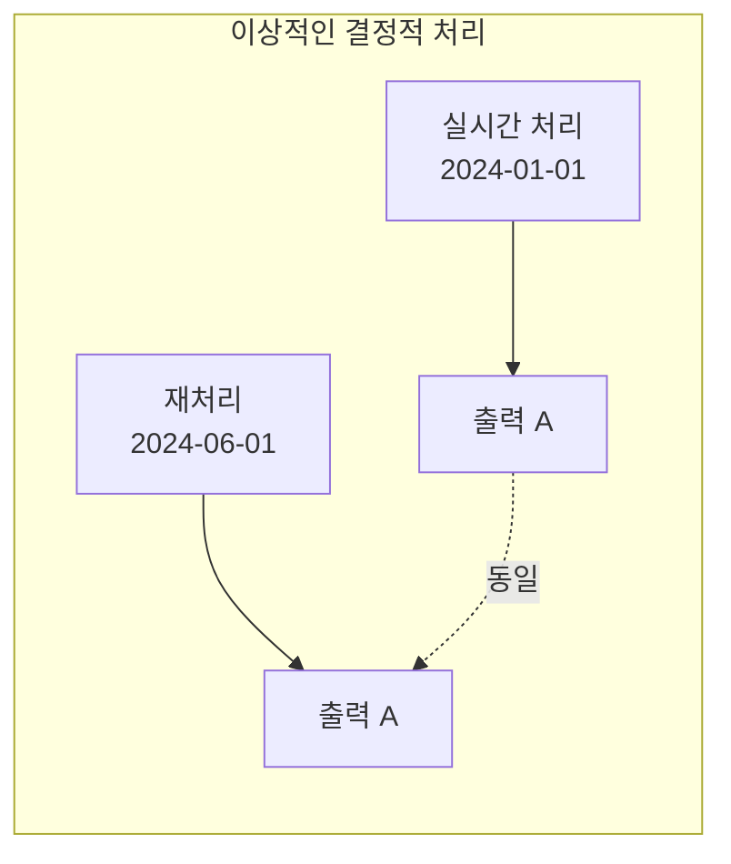

#### 두 가지 처리 상태

| 상태 | 설명 | 특징 |
|------|------|------|
| **실시간 처리** | 이벤트 발생 즉시 처리 | 장기 실행 서비스의 일반적 상태 |
| **따라잡기 처리** | 과거 이벤트를 현재까지 처리 | 신규 서비스, 언더스케일 서비스 |

#### 비결정적 워크플로우

> ⚠️ **주의**: 다음은 명시적으로 비결정적인 워크플로우입니다:
> - **현재 벽시계 시간(Wall-clock Time)** 기반 처리
> - **외부 서비스 쿼리** (쿼리 시점에 따라 결과가 다름)

---

### 2. 타임스탬프 (Timestamps)

분산 시스템에서 이벤트를 비교하려면 **동기화된 일관된 타임스탬프**가 필수입니다.

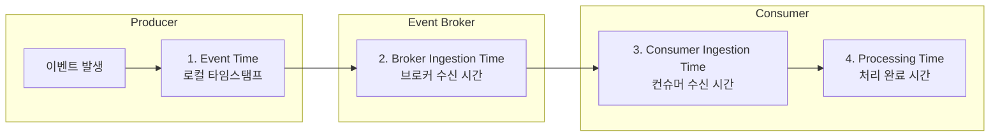

#### 네 가지 타임스탬프 비교

| 타임스탬프 | 발생 시점 | 특징 |
|-----------|----------|------|
| **Event Time** | 프로듀서에서 이벤트 발생 시 | 가장 정확한 실제 발생 시간 |
| **Broker Ingestion Time** | 브로커가 이벤트 수신 시 | 프로듀서 시간이 불안정할 때 대안 |
| **Consumer Ingestion Time** | 컨슈머가 이벤트 수신 시 | 재처리 시 달라질 수 있음 |
| **Processing Time** | 이벤트 처리 완료 시 | 벽시계 시간, 비결정적 |

---

### 3. 분산 타임스탬프 동기화

#### NTP (Network Time Protocol)

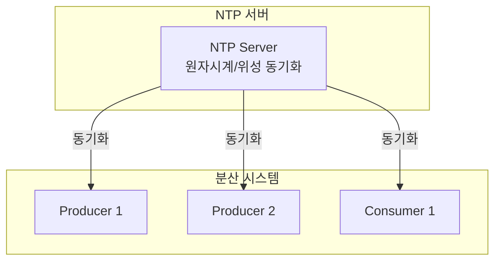

| 환경 | 동기화 정확도 | 비고 |
|------|-------------|------|
| **LAN 내 NTP 동기화** | 수 밀리초 드리프트 | 15분 후 기준 |
| **최적 조건** | 1mS 이하 | 빈번한 동기화 필요 |
| **인터넷 전역** | ±100mS | 글로벌 이벤트 동기화 시 고려 |

#### NTP 동기화 실패 시나리오
- 네트워크 장애
- 설정 오류
- VM 멀티테넌시 이슈
- NTP 서버 자체 장애

---

### 4. 이벤트 스케줄링 (Event Scheduling)

여러 입력 파티션에서 소비할 때 **다음에 처리할 이벤트를 선택**하는 프로세스입니다.

#### 문제 상황: 은행 입출금 처리

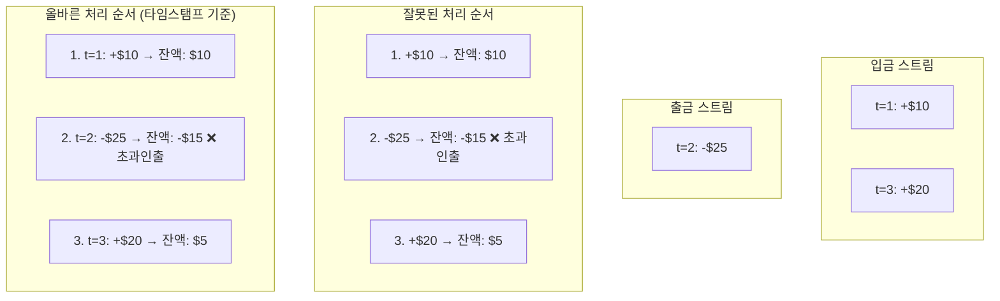

> 💡 **Tip**: 가장 일반적인 이벤트 스케줄링 구현은 **모든 할당된 입력 파티션에서 가장 오래된 타임스탬프를 가진 이벤트**를 선택하여 다운스트림 토폴로지에 디스패치합니다.

#### 이벤트 스케줄링이 필요한 경우

> ⚠️ **Warning**: 이벤트 소비 및 처리 순서가 **비즈니스 로직에 영향**을 미치는 경우 이벤트 스케줄링이 필요합니다.

---

### 5. 워터마크 (Watermarks)

**워터마크**는 처리 토폴로지를 통해 이벤트 시간의 진행 상황을 추적하고, **특정 시간 t 이전의 모든 데이터가 처리되었음**을 선언합니다.

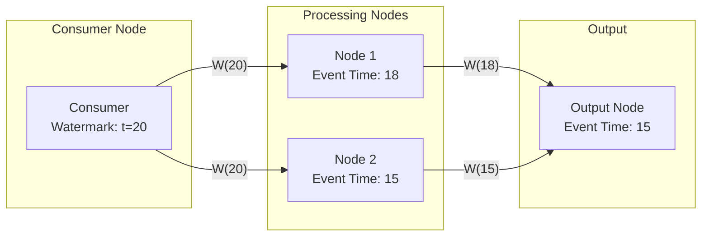

#### 워터마크 전파 규칙

1. **소스 함수**에서 워터마크 생성 (이벤트 스트림에서 소비 시)
2. **다운스트림 노드**로 워터마크 전파
3. **다중 입력 노드**는 모든 입력 소스의 **최소 이벤트 시간**을 자신의 이벤트 시간으로 사용

#### 병렬 처리에서의 워터마크

```mermaid
flowchart TB
    subgraph "Instance 0"
        S0[Source P0<br/>W=15]
        G0[groupByKey<br/>W=15]
    end

    subgraph "Instance 1"
        S1[Source P1<br/>W=13]
        G1[groupByKey<br/>W=13]
    end

    subgraph "Aggregate Nodes"
        A0[Aggregate 0<br/>W=min(15,13)=13]
        A1[Aggregate 1<br/>W=min(15,13)=13]
    end

    S0 --> G0
    S1 --> G1
    G0 --> A0
    G0 --> A1
    G1 --> A0
    G1 --> A1
```

---

### 6. 스트림 타임 (Stream Time)

**스트림 타임**은 Apache Kafka Streams에서 사용하는 접근 방식으로, **처리된 이벤트의 가장 높은 타임스탬프**를 유지합니다.

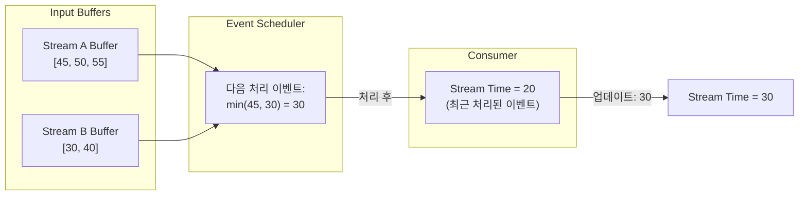

#### 스트림 타임 특징

- 각 이벤트가 토폴로지를 **완전히 통과한 후** 다음 이벤트 처리
- **리파티션 스트림**이 있으면 토폴로지가 분할되어 각 서브토폴로지가 독립적 스트림 타임 유지
- **Depth-first** 방식으로 처리

#### 리파티션과 스트림 타임

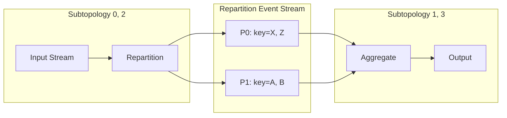

> 💡 **Tip**: Kafka Streams는 리파티션된 이벤트를 **이벤트 브로커로 다시 전송**하여 셔플링합니다. 이는 전용 클러스터 없이도 마이크로서비스 친화적인 처리를 가능하게 합니다.

---

### 7. 워터마크 vs 스트림 타임

| 특성 | 워터마크 (Watermarks) | 스트림 타임 (Stream Time) |
|------|----------------------|-------------------------|
| **사용 프레임워크** | Spark, Flink, Samza, Beam | Kafka Streams |
| **시간 추적 방식** | 각 노드별 독립적 이벤트 시간 | 서브토폴로지별 단일 시간 |
| **이벤트 버퍼링** | 각 노드 입력에서 버퍼링 | 소스 노드에서만 버퍼링 |
| **셔플 방식** | 클러스터 내부 통신 | 이벤트 브로커 경유 |
| **지연 이벤트 판단** | W(t) 이후 도착 시 지연 | 스트림 타임 초과 시 지연 |
| **인프라 요구사항** | 전용 처리 클러스터 | 이벤트 브로커만 필요 |

---

### 8. 순서가 맞지 않는 이벤트 (Out-of-Order Events)

이벤트의 타임스탬프가 앞선 이벤트보다 **크거나 같지 않은 경우** 순서가 맞지 않는 것입니다.

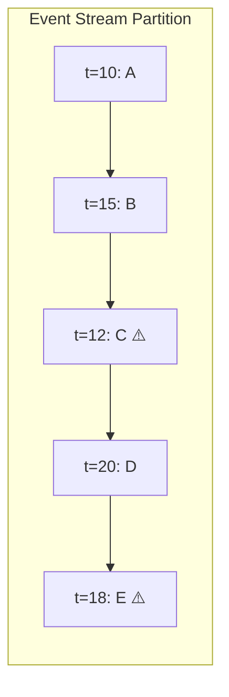

#### 순서가 맞지 않는 이벤트의 원인

| 원인 | 설명 |
|------|------|
| **소스 데이터 자체** | 이미 순서가 맞지 않는 스트림에서 소비 |
| **다중 프로듀서 → 다중 파티션** | 리파티셔닝 시 발생 가능 |
| **독립적 스트림 타임** | 인스턴스 간 시간 동기화 없음 |
| **불균형 파티션** | 처리 속도 차이로 인한 시간 스큐 |

#### 리파티셔닝과 순서 문제

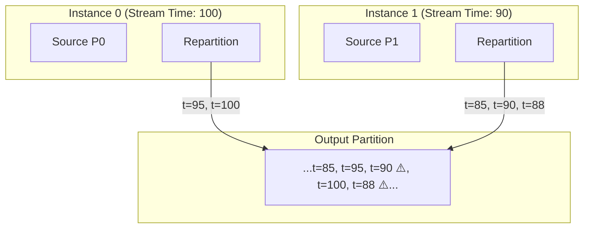

> 💡 **Tip**: 단일 스레드 프로듀서는 정상 운영 시 순서가 맞지 않는 이벤트를 생성하지 않습니다 (소스 데이터가 이미 순서가 맞지 않는 경우 제외).

---

### 9. 지연 이벤트 (Late Events)

**지연 이벤트**는 **소비하는 마이크로서비스 관점**에서만 정의됩니다.

| 시간 관리 방식 | 지연 이벤트 정의 |
|---------------|-----------------|
| **워터마크** | 워터마크 W(t) 이후에 도착한 t' < t 이벤트 |
| **스트림 타임** | 스트림 타임이 t'를 지난 후에 도착한 이벤트 |

> 💡 **Tip**: 이벤트는 **소비자에게 특정한 마감 시한을 놓쳤을 때만** 지연된 것으로 간주됩니다.

---

### 10. 윈도우 함수 (Windowing Functions)

지연 이벤트는 주로 **시간 기반 비즈니스 로직**에서 문제가 됩니다.

#### 10.1 텀블링 윈도우 (Tumbling Windows)

**고정 크기**의 겹치지 않는 윈도우입니다.

```mermaid
gantt
    title Tumbling Windows (크기: 1시간)
    dateFormat HH:mm
    axisFormat %H:%M

    section Windows
    Window 1    :w1, 00:00, 1h
    Window 2    :w2, 01:00, 1h
    Window 3    :w3, 02:00, 1h
```

**사용 사례**: "제품 사용량의 피크 시간대는 언제인가?"

#### 10.2 슬라이딩 윈도우 (Sliding Windows)

**고정 크기**와 **슬라이드 간격**을 가진 윈도우입니다.

```mermaid
gantt
    title Sliding Windows (크기: 1시간, 슬라이드: 15분)
    dateFormat HH:mm
    axisFormat %H:%M

    section Windows
    Window 1    :w1, 00:00, 1h
    Window 2    :w2, 00:15, 1h
    Window 3    :w3, 00:30, 1h
    Window 4    :w4, 00:45, 1h
```

**사용 사례**: "지난 1시간 동안 몇 명의 사용자가 내 제품을 클릭했는가?"

#### 10.3 세션 윈도우 (Session Windows)

**동적 크기**의 윈도우로, 비활성 시간 초과 시 종료됩니다.

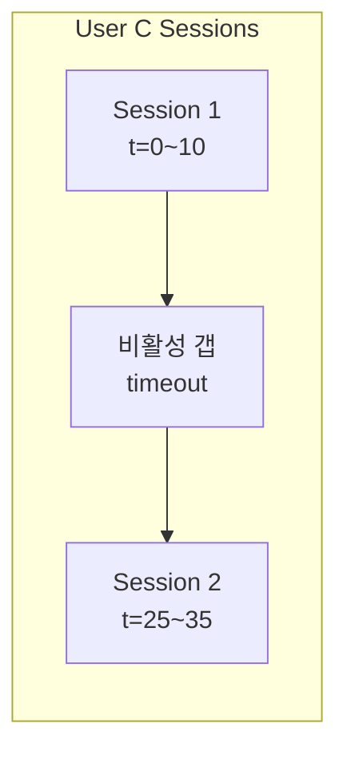

**사용 사례**: "사용자가 특정 브라우징 세션에서 무엇을 보았는가?"

---

### 11. 지연 이벤트 처리 전략

| 전략 | 설명 | 장점 | 단점 |
|------|------|------|------|
| **Drop** | 이벤트 삭제 | 간단, 낮은 지연 | 데이터 손실 |
| **Wait** | 고정 시간 대기 후 결과 출력 | 높은 결정성 | 높은 지연 |
| **Grace Period** | 즉시 출력 후 유예 기간 동안 업데이트 | 균형잡힌 접근 | 여러 번 출력 발생 |

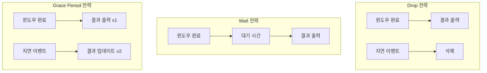

#### 지연 이벤트 처리를 위한 비즈니스 질문

1. 지연 이벤트가 발생할 **가능성**은 얼마나 되는가?
2. 지연 이벤트를 **얼마나 오래** 기다려야 하는가?
3. 지연 이벤트를 **삭제할 경우** 비즈니스 영향은?
4. **오래 기다리는 것**의 비즈니스 이점은?
5. 상태 유지에 필요한 **디스크/메모리 비용**은?
6. 대기 비용이 이점을 **초과**하는가?

---

### 12. 재처리 (Reprocessing)

불변 이벤트 스트림은 컨슈머 그룹 오프셋을 되감아 **임의 시점부터 재처리**할 수 있습니다.

#### 재처리 단계

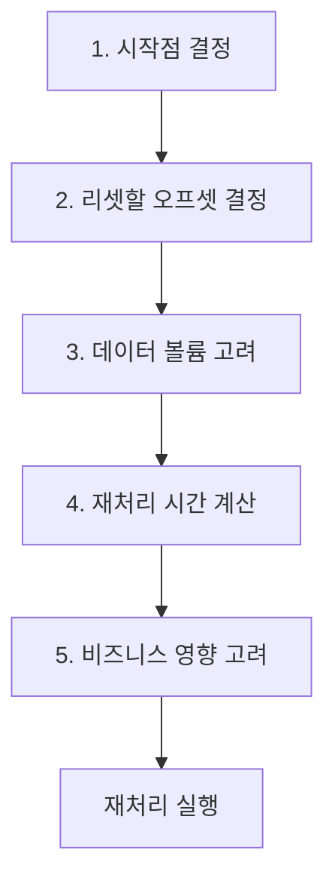

#### 재처리 체크리스트

| 단계 | 고려사항 |
|------|----------|
| **시작점 결정** | 상태 기반 컨슈머는 모든 엔티티 스트림의 **처음부터** 재처리 |
| **오프셋 리셋** | 상태 처리에 사용되는 모든 스트림을 처음으로 리셋 |
| **데이터 볼륨** | 대량 이벤트 처리 시간, 브로커 I/O 쿼터 고려 |
| **재처리 시간** | 다운타임 계산, 다운스트림 컨슈머 통지 |
| **비즈니스 영향** | 예: 배송 알림 서비스가 재처리 시 중복 이메일 발송 방지 |

---

### 13. 간헐적 장애와 지연 이벤트

#### 프로듀서/브로커 연결 장애 시나리오

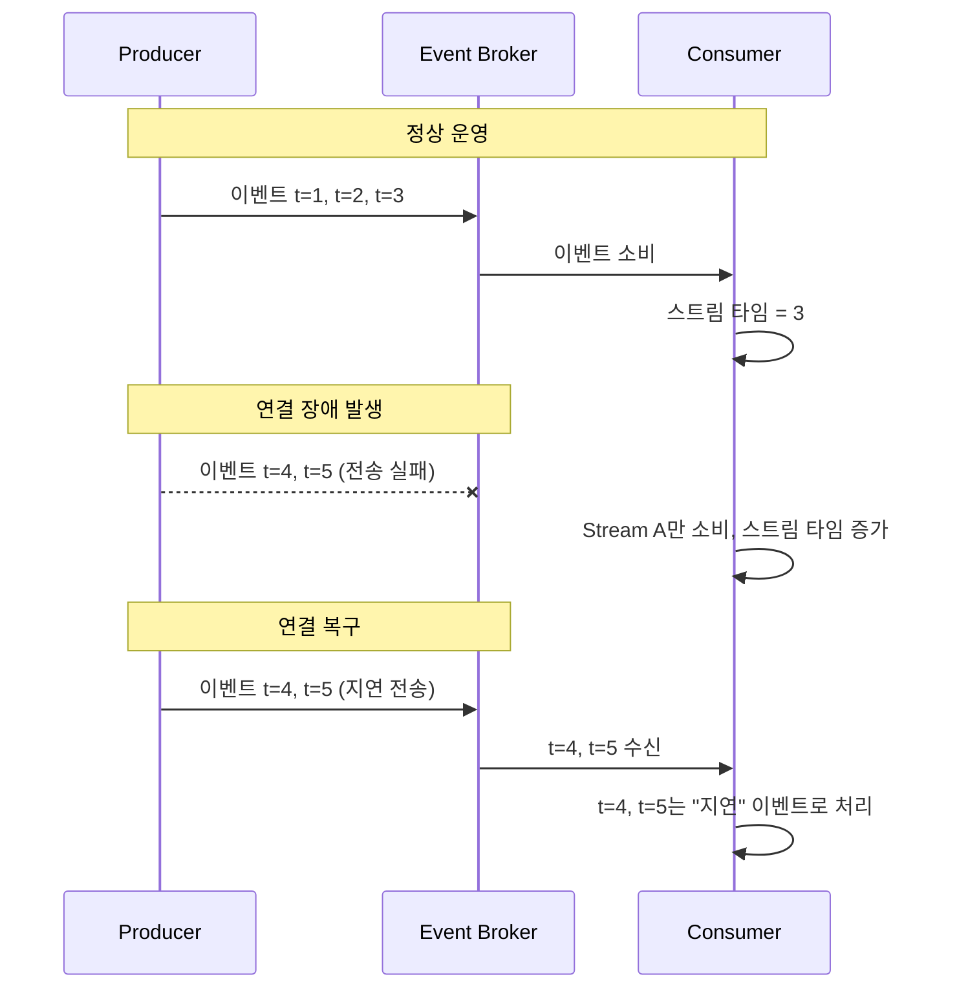

#### 완화 전략

1. **사전 대기 시간**: 처리 전 미리 정해진 시간 대기 (지연 비용 발생)
2. **견고한 지연 이벤트 처리 로직**: 비즈니스 로직이 지연 이벤트에 영향받지 않도록 설계

---

## 심화 학습

### 배치 처리 vs 스트림 처리의 결정성

| 처리 방식 | 결정성 | 지연 시간 | 지연 이벤트 처리 |
|----------|--------|----------|-----------------|
| **배치 (Bounded)** | 높음 | 높음 (24시간+) | 전체 배치가 하나의 윈도우 |
| **스트림 (Unbounded)** | 최선의 노력 | 낮음 (실시간) | 비즈니스 결정 필요 |

### 타임스탬프 선택 가이드

```
타임스탬프 선택
├─ 프로듀서 시간 신뢰 가능 → Event Time 사용
├─ 프로듀서 시간 불안정 → Broker Ingestion Time 사용
└─ 둘 다 불가능 → Consumer Ingestion Time (비결정적)
```

### 추가 학습 자료

- Tyler Akidau의 "The World Beyond Batch: Streaming 101, 102"
- Mikito Takada의 "Distributed Systems for Fun and Profit"
- "Streaming Systems" by Tyler Akidau, Slava Chernyak, Reuven Lax (O'Reilly)

---

## 실무 적용 포인트

### 결정적 처리 설계 가이드

```
결정적 처리 요구사항 분석
├─ 비즈니스 요구사항
│   ├─ 지연 시간 vs 결정성 우선순위
│   ├─ 지연 이벤트 허용 범위
│   └─ 재처리 필요 빈도
├─ 기술적 요구사항
│   ├─ 프레임워크 선택 (워터마크 vs 스트림 타임)
│   ├─ 이벤트 스케줄링 필요 여부
│   └─ 상태 저장 요구사항
└─ 운영 요구사항
    ├─ 모니터링 및 알림
    ├─ 재처리 절차
    └─ 다운스트림 영향 관리
```

### 구현 체크리스트

**타임스탬프:**
- [ ] NTP 동기화 설정 확인
- [ ] 타임스탬프 소스 선택 (Event Time 권장)
- [ ] 타임스탬프 추출기 구현

**이벤트 스케줄링:**
- [ ] 비즈니스 로직에 순서 의존성 확인
- [ ] 이벤트 스케줄러 구현/설정
- [ ] 커스텀 스케줄러 필요 여부 평가

**지연 이벤트 처리:**
- [ ] 비즈니스 요구사항에 따른 전략 선택
- [ ] 유예 기간(Grace Period) 설정
- [ ] Dead Letter Queue 구성

**재처리:**
- [ ] 재처리 절차 문서화
- [ ] 다운스트림 통지 프로세스
- [ ] 스케일링 계획

---

## 체크리스트

### 개념 이해 확인

- [ ] 결정적 처리의 목표를 설명할 수 있다
- [ ] 네 가지 타임스탬프 유형을 구분할 수 있다
- [ ] 이벤트 스케줄링이 필요한 이유를 안다
- [ ] 워터마크와 스트림 타임의 차이를 비교할 수 있다
- [ ] 세 가지 윈도우 유형을 설명할 수 있다
- [ ] 지연 이벤트 처리 전략 세 가지를 나열할 수 있다
- [ ] 재처리 시 고려사항을 알고 있다

### 실습 과제

- [ ] Kafka Streams에서 이벤트 타임 기반 윈도우 구현
- [ ] 지연 이벤트 처리를 위한 Grace Period 설정
- [ ] 컨슈머 그룹 오프셋 리셋 후 재처리 실행
- [ ] 순서가 맞지 않는 이벤트 시나리오 시뮬레이션

---

## 참고 자료

### 공식 문서
- [Kafka Streams Time Concepts](https://kafka.apache.org/documentation/streams/core-concepts#streams_time)
- [Flink Event Time and Watermarks](https://flink.apache.org/docs/stable/concepts/time.html)
- [Beam Windowing](https://beam.apache.org/documentation/programming-guide/#windowing)

### 논문 및 아티클
- [The Dataflow Model (Google Whitepaper)](https://research.google/pubs/pub43864/)
- [The World Beyond Batch: Streaming 101](https://www.oreilly.com/ideas/the-world-beyond-batch-streaming-101)
- [The World Beyond Batch: Streaming 102](https://www.oreilly.com/ideas/the-world-beyond-batch-streaming-102)

### 도서
- "Building Event-Driven Microservices" - Adam Bellemare, Chapter 6
- "Streaming Systems" - Tyler Akidau, Slava Chernyak, Reuven Lax
- "Distributed Systems for Fun and Profit" - Mikito Takada

---

## 핵심 용어 정리

| 용어 | 정의 |
|------|------|
| **Deterministic Processing** | 동일 입력에 대해 언제 실행해도 동일 결과 생성 |
| **Event Time** | 프로듀서에서 이벤트 발생 시 할당된 타임스탬프 |
| **Event Scheduling** | 여러 파티션에서 다음 처리할 이벤트 선택 |
| **Watermark** | 특정 시간 이전 모든 데이터 처리 완료 선언 |
| **Stream Time** | 처리된 이벤트의 최고 타임스탬프 |
| **Out-of-Order Event** | 타임스탬프가 이전 이벤트보다 작은 이벤트 |
| **Late Event** | 마감 시한을 놓친 이벤트 |
| **Tumbling Window** | 고정 크기, 겹치지 않는 윈도우 |
| **Sliding Window** | 고정 크기, 슬라이드 간격 있는 윈도우 |
| **Session Window** | 비활성 타임아웃으로 종료되는 동적 윈도우 |
| **Reprocessing** | 과거 이벤트를 처음부터 다시 처리 |
