# Chapter 7. 상태 기반 스트리밍

## 핵심 요약

**상태 기반 스트리밍(Stateful Streaming)**은 이벤트 기반 마이크로서비스의 가장 중요한 구성 요소입니다. 대부분의 애플리케이션은 처리 요구사항을 위해 어느 정도의 상태를 유지해야 합니다.

상태 저장소는 두 가지 유형으로 나뉩니다:
- **내부 상태 저장소(Internal State Store)**: 프로세서와 동일한 컨테이너에 저장 (메모리/로컬 디스크)
- **외부 상태 저장소(External State Store)**: 프로세서 외부의 별도 서비스에 저장 (네트워크 경유)

**Changelog**는 상태 저장소의 모든 변경사항을 기록하여 장애 복구와 스케일링을 지원합니다. **Effectively Once Processing**은 트랜잭션 또는 중복 제거를 통해 정확히 한 번 처리된 것과 동일한 결과를 보장합니다.

---

## 학습 목표

이 챕터를 학습한 후 다음을 할 수 있어야 합니다:

1. **Materialized State**와 **State Store**의 차이를 설명할 수 있다
2. **Internal**과 **External State Store**의 장단점을 비교할 수 있다
3. **Changelog**의 역할과 상태 복구 방법을 이해한다
4. **Hot Replica**를 사용한 고가용성 구현 방법을 안다
5. **Effectively Once Processing**의 두 가지 구현 방식을 설명할 수 있다
6. **Deduplication** 전략과 구현 방법을 이해한다

---

## 본문 정리

### 1. 상태 저장소 기본 개념

#### 핵심 정의

| 용어 | 정의 | 특성 |
|------|------|------|
| **Materialized State** | 소스 이벤트 스트림의 프로젝션 | **불변(Immutable)** |
| **State Store** | 서비스의 비즈니스 상태 저장 | **가변(Mutable)** |

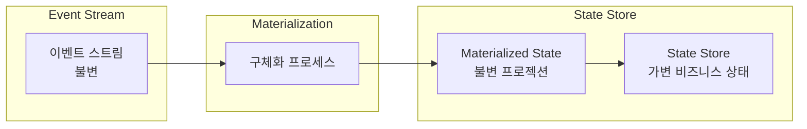

---

### 2. 내부 vs 외부 상태 저장소

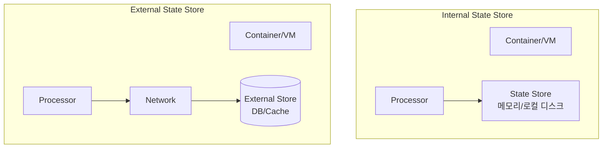

| 특성 | Internal State Store | External State Store |
|------|---------------------|---------------------|
| **위치** | 동일 컨테이너/VM | 외부 서비스 (네트워크 경유) |
| **성능** | 매우 높음 (로컬 접근) | 네트워크 지연 발생 |
| **스케일링** | 이벤트 브로커에 위임 | 별도 관리 필요 |
| **데이터 지역성** | 파티션별 분산 | 전체 데이터 접근 가능 |
| **복잡도** | 낮음 | 높음 (별도 기술 관리) |
| **비용** | 컴퓨팅 리소스만 | 추가 서비스 비용 |

---

### 3. Changelog Event Stream

**Changelog**는 상태 저장소의 모든 변경사항을 기록하는 이벤트 스트림입니다.

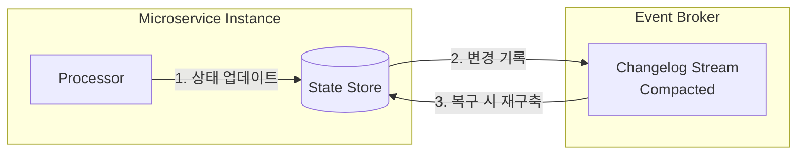

#### Changelog의 역할

> 💡 **Tip**: Changelog는 이전 처리 결과를 저장하므로, 복구 시 모든 입력 이벤트를 재처리할 필요 없이 빠르게 상태를 복원할 수 있습니다.

| 기능 | 설명 |
|------|------|
| **상태 백업** | 모든 상태 변경사항의 영구 복사본 |
| **장애 복구** | 새 인스턴스가 빠르게 상태 재구축 |
| **스케일링 지원** | 새 인스턴스에 파티션 할당 시 상태 로드 |
| **체크포인팅** | 이벤트 처리 진행 상황 기록 |

#### Changelog 복구 과정

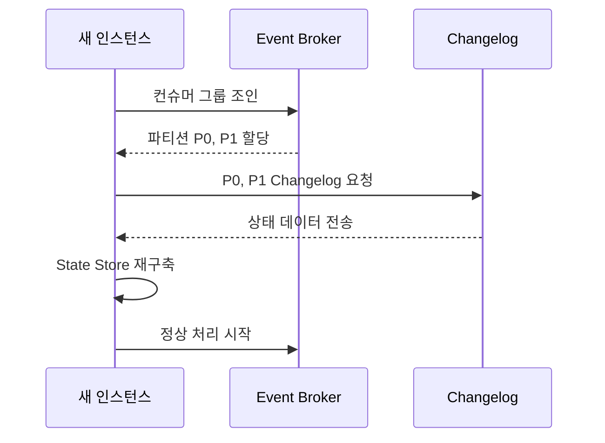

---

### 4. Global State Store

**Global State Store**는 모든 파티션의 데이터를 각 인스턴스에 복제하는 특수한 내부 상태 저장소입니다.

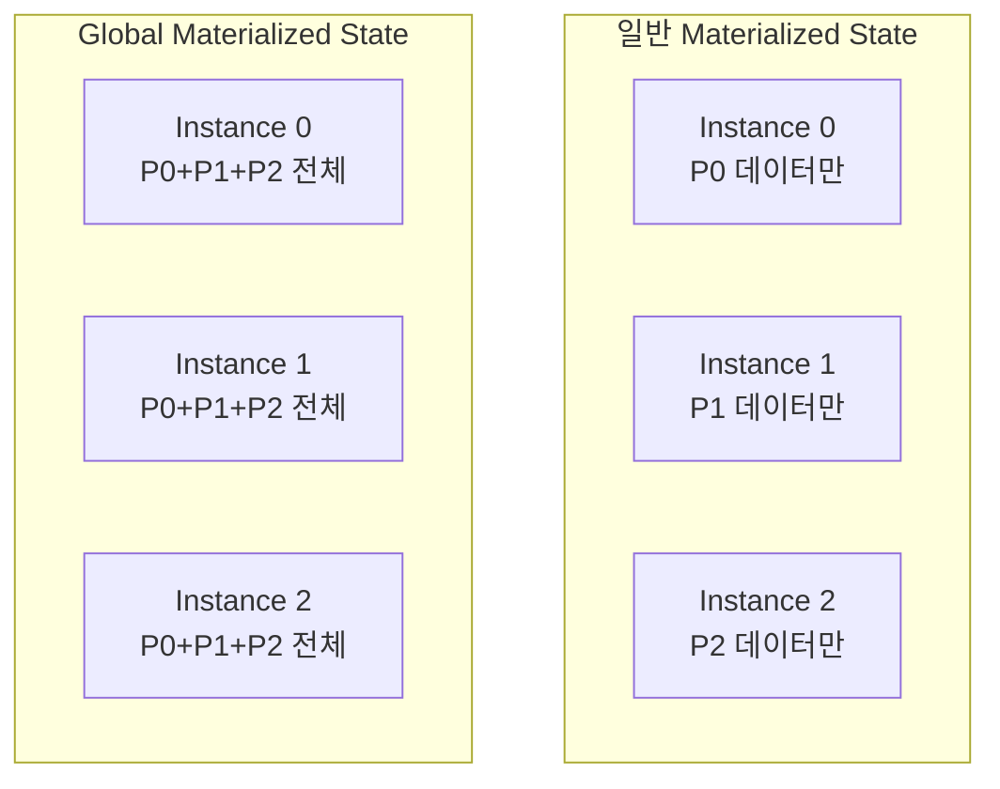

#### Global State Store 사용 사례

| 적합 | 부적합 |
|------|--------|
| 작은 데이터셋 | 대용량 데이터 |
| 자주 변경되지 않는 데이터 | 빈번히 변경되는 데이터 |
| 공통 룩업 테이블 | 이벤트 기반 로직 드라이버 |
| 차원 테이블 | 중복 출력 발생 가능성 |

> ⚠️ **Warning**: Global State Store를 이벤트 기반 로직의 드라이버로 사용하면 각 인스턴스가 중복 출력을 생성할 수 있습니다.

---

### 5. Internal State Store 장단점

#### 장점

| 장점 | 설명 |
|------|------|
| **스케일링 단순화** | 이벤트 브로커와 컴퓨팅 클러스터에 위임 |
| **고성능 디스크 옵션** | RocksDB + SSD: ~15.4k req/sec (단일 스레드) |
| **메모리 성능** | 수백만 req/sec 가능 |
| **네트워크 디스크 유연성** | 상태 마이그레이션, 온디맨드 노드 활용 |

**RocksDB 성능 비교:**

| 저장소 유형 | 지연 시간 | 처리량 (단일 스레드) |
|------------|----------|---------------------|
| **로컬 SSD** | ~65μs | ~15.4k req/sec |
| **네트워크 디스크 (1ms RTT)** | ~1ms | ~939 req/sec |
| **메모리** | ~ns | 수백만 req/sec |

#### 단점

| 단점 | 설명 |
|------|------|
| **런타임 디스크 제한** | 볼륨 크기 변경 시 서비스 재시작 필요 |
| **디스크 낭비** | 피크 트래픽 기준 예약, 비피크 시 낭비 |

---

### 6. External State Store 장단점

#### 장점

| 장점 | 설명 |
|------|------|
| **전체 데이터 지역성** | 모든 인스턴스가 전체 데이터 접근 가능 |
| **기술 유연성** | 조직에 익숙한 기술 활용 가능 |
| **다양한 쿼리 지원** | 관계형 쿼리, 지리공간 검색 등 |

#### 단점

| 단점 | 설명 |
|------|------|
| **기술 관리 부담** | 별도 스케일링, 모니터링, 백업 필요 |
| **네트워크 지연** | 처리량 및 성능 저하 |
| **비용** | 트랜잭션당, 데이터 크기당 과금 |
| **레이스 컨디션** | 인스턴스 간 독립적 스트림 타임으로 인한 문제 |

> ⚠️ **Warning**: 마이크로서비스 간에 상태 저장소를 직접 공유하지 마세요. 각 마이크로서비스는 자체 상태 복사본을 구체화해야 합니다.

---

### 7. 스케일링과 복구: Hot Replicas

**Hot Replica**는 파티션별 상태의 추가 복제본으로, 장애 시 즉각적인 복구를 가능하게 합니다.

#### Hot Replica 구성 (복제 계수 = 2)

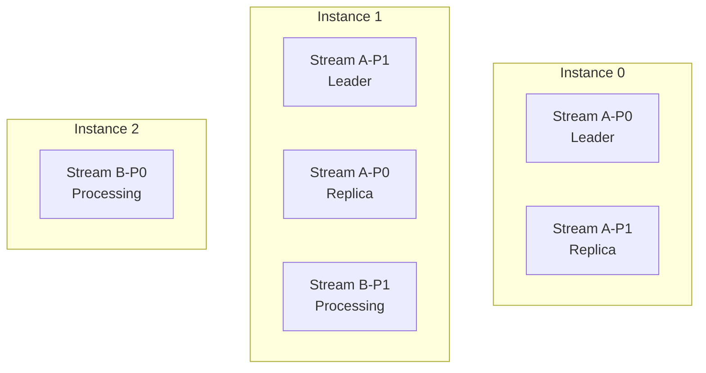

#### 장애 복구 시나리오

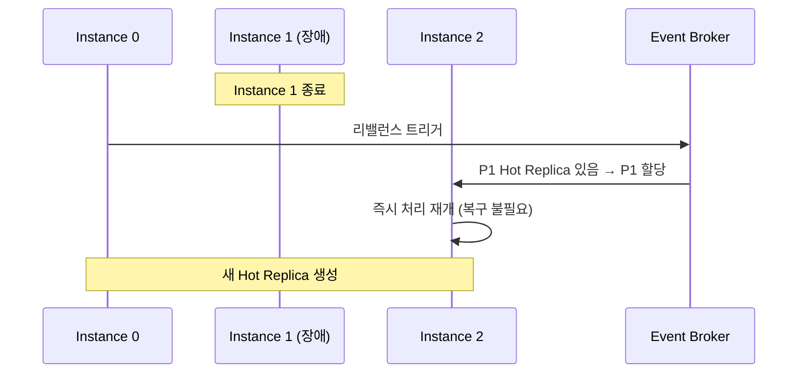

> 💡 **Note**: Hot Replica의 주요 트레이드오프는 **추가 디스크 사용**과 **다운타임 감소** 간의 교환입니다.

---

### 8. 상태 복원 방법 비교

| 방법 | 소스 | 다운타임 | 출력 이벤트 |
|------|------|----------|------------|
| **Changelog** | Changelog 스트림 | 짧음 | 없음 |
| **소스 스트림** | 입력 이벤트 스트림 | 길음 | 재생성됨 |
| **스냅샷** | 외부 백업 | 짧음 | 없음 |

> ⚠️ **Warning**: 전체 재처리 시 생성되는 출력 이벤트의 영향을 고려하세요. 다운스트림 컨슈머가 멱등적으로 처리하거나 중복을 제거해야 할 수 있습니다.

---

### 9. Rebuilding vs Migrating

#### Rebuilding (재구축)


**적합한 경우:**
- 비즈니스 로직 변경
- 출력 형식 변경
- 재해 복구 테스트

#### Migrating (마이그레이션)

```sql
-- 단순한 마이그레이션 예시
ALTER TABLE state_store
ADD COLUMN new_field VARCHAR(255) DEFAULT NULL;
```

**적합한 경우:**
- 옵션 필드 추가
- 과거 데이터 재처리 불필요
- 대용량 상태 저장소

> 💡 **Tip**: 복잡한 마이그레이션은 오류 발생 가능성이 높으므로, 엄격한 테스트와 재구축 기반 접근과의 비교가 필요합니다.

---

### 10. Effectively Once Processing

**Effectively Once Processing**은 단일 진실의 원천(Single Source of Truth)에 대한 업데이트가 **장애에 관계없이 일관되게 적용**됨을 보장합니다.

> 💡 **Tip**: "Exactly Once"와 "Effectively Once"는 대부분 상호 교환적으로 사용됩니다. 실제로는 이벤트가 여러 번 처리될 수 있지만, 최종 결과는 한 번 처리된 것과 동일합니다.

#### 예시: 재고 회계 서비스

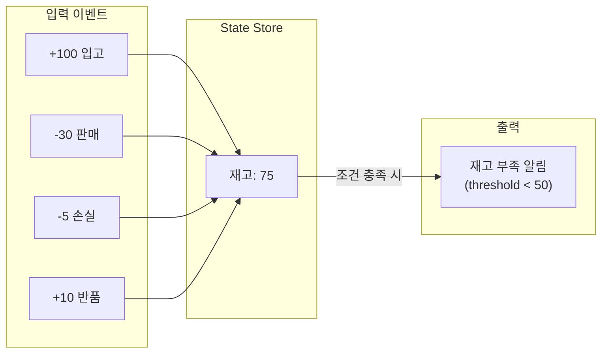

---

### 11. Client-Broker 트랜잭션

이벤트 브로커가 트랜잭션을 지원하는 경우, **출력 이벤트, Changelog 업데이트, 오프셋 커밋**을 단일 원자적 트랜잭션으로 묶을 수 있습니다.

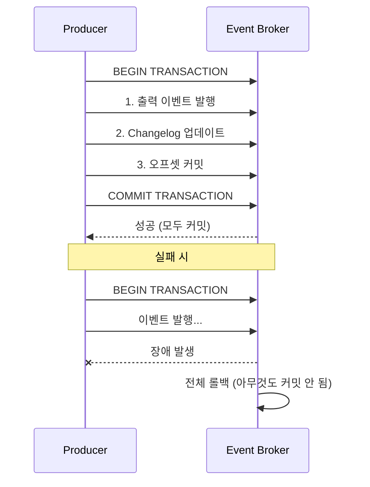

#### 장애 복구 흐름

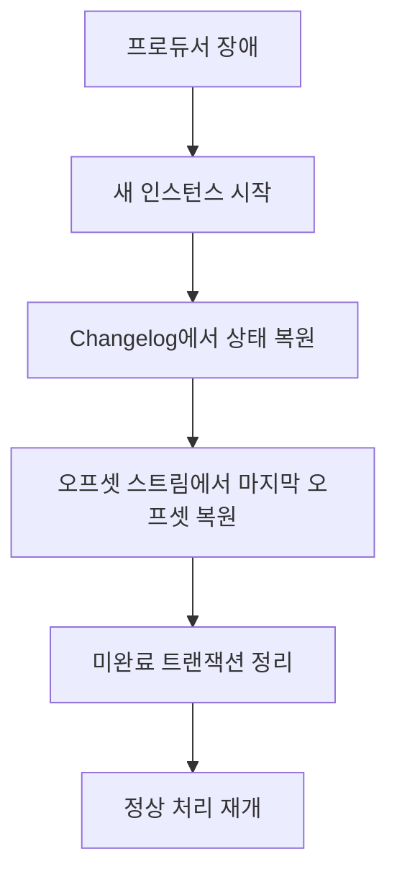

> 💡 **Tip**: 트랜잭션은 매우 강력하며, Apache Kafka에 경쟁 제품 대비 상당한 이점을 제공합니다.

---

### 12. 트랜잭션 없이 Effectively Once 달성

트랜잭션을 지원하지 않는 경우, **중복 제거(Deduplication)**와 **로컬 트랜잭션**으로 Effectively Once를 달성할 수 있습니다.

#### 중복 이벤트 발생 원인

| 시나리오 | 설명 |
|----------|------|
| **ACK 실패 후 재시도** | 프로듀서가 쓰기 성공했지만 ACK를 못 받아 재시도 |
| **오프셋 업데이트 전 크래시** | 이벤트 발행 후 오프셋 커밋 전 장애 |

#### 중복 식별 방법

```java
// Dedupe ID 생성 예시
public String generateDedupeId(Event event) {
    return hash(
        event.getKey(),
        event.getValue(),
        event.getCreationTime()
    );
}
```

**Dedupe ID 생성 가능한 경우:**
- 은행 계좌 이체 (출발지, 목적지, 금액, 날짜, 시간)
- 이커머스 주문 (제품, 구매자, 날짜, 시간, 총액)
- 기존 고유 ID가 있는 이벤트 (예: orderId)

#### Deduplication Store 워크플로우

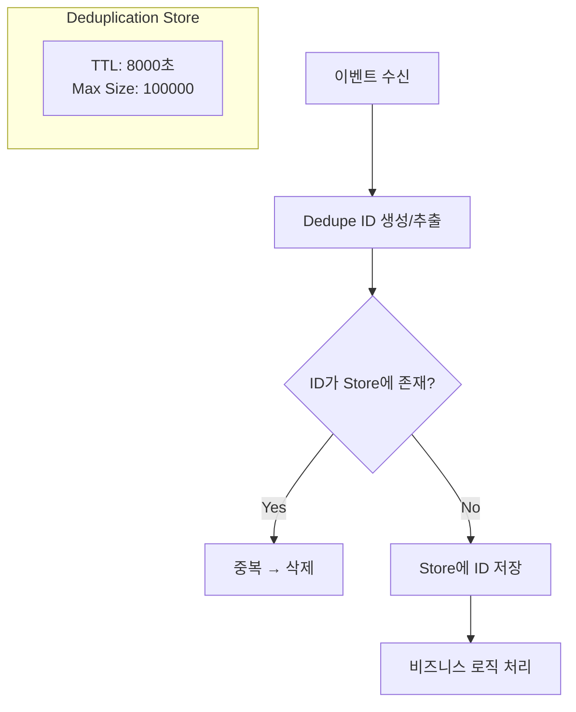

> 💡 **Tip**: TTL(Time-to-Live), 최대 캐시 크기, 주기적 삭제를 사용하여 Deduplication Store를 작게 유지하세요.

> ⚠️ **Warning**: 키 없는 이벤트의 중복 제거는 파티션 지역성 보장이 안 되어 매우 어렵습니다. 가능하면 키가 있는 이벤트를 생성하고 멱등적 쓰기를 사용하세요.

---

### 13. 일관된 상태 유지

이벤트 브로커 대신 **상태 저장소의 트랜잭션**을 활용하여 Effectively Once를 달성할 수 있습니다.

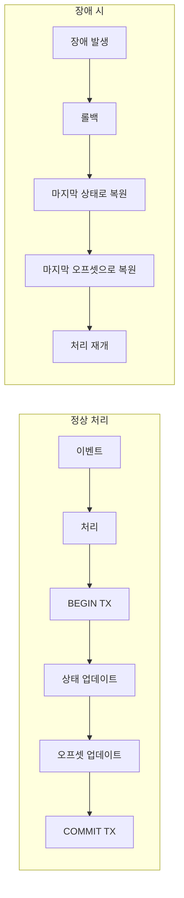

**핵심**: 컨슈머 오프셋을 이벤트 브로커가 아닌 **데이터 서비스 내부**에 저장하여, 상태와 오프셋을 **단일 트랜잭션**으로 원자적 업데이트합니다.

---

## 심화 학습

### 상태 저장소 기술 비교

| 기술 | 유형 | 특징 |
|------|------|------|
| **RocksDB** | Key-Value | 로컬 SSD 최적화, Kafka Streams 기본 |
| **Redis** | Key-Value | 인메모리, 고성능 캐시 |
| **PostgreSQL** | 관계형 | 복잡한 쿼리, 트랜잭션 |
| **Elasticsearch** | 문서 | 전문 검색, 지리공간 |
| **MongoDB** | 문서 | 유연한 스키마 |

### 처리 보장 수준 비교

| 보장 수준 | 설명 | 복잡도 |
|----------|------|--------|
| **At-Most-Once** | 최대 한 번, 손실 가능 | 낮음 |
| **At-Least-Once** | 최소 한 번, 중복 가능 | 중간 |
| **Effectively Once** | 실질적으로 정확히 한 번 | 높음 |

---

## 실무 적용 포인트

### 상태 저장소 선택 가이드

```
상태 저장소 선택
├─ 고성능 필요, 단순 K/V
│   ├─ 로컬 SSD 가능 → Internal (RocksDB)
│   └─ 로컬 SSD 불가 → 네트워크 디스크 고려
├─ 복잡한 쿼리 필요
│   ├─ 관계형 쿼리 → External (PostgreSQL)
│   ├─ 전문 검색 → External (Elasticsearch)
│   └─ 지리공간 → External (Elasticsearch)
├─ 전체 데이터 접근 필요
│   ├─ 작은 데이터셋 → Global State Store
│   └─ 큰 데이터셋 → External State Store
└─ 팀 기술 스택
    └─ 익숙한 기술 우선 고려
```

### Effectively Once 구현 선택

```
Effectively Once 구현
├─ 이벤트 브로커가 트랜잭션 지원 (Kafka)
│   └─ Client-Broker 트랜잭션 사용
├─ 트랜잭션 미지원
│   ├─ 상태 저장소가 트랜잭션 지원
│   │   └─ 상태 저장소 내 오프셋 관리
│   └─ 둘 다 미지원
│       └─ Deduplication + 멱등적 처리
└─ 성능 우선
    └─ At-Least-Once + 멱등적 컨슈머
```

### 구현 체크리스트

**Internal State Store:**
- [ ] RocksDB 또는 동등한 K/V 스토어 설정
- [ ] Changelog 활성화
- [ ] Hot Replica 수 결정
- [ ] 디스크 용량 계획

**External State Store:**
- [ ] 기술 선택 및 프로비저닝
- [ ] 스케일링 정책 설정
- [ ] 백업/복원 절차 수립
- [ ] 모니터링 구성

**Effectively Once:**
- [ ] 트랜잭션 지원 여부 확인
- [ ] Deduplication 전략 수립
- [ ] Dedupe ID 생성 로직 구현
- [ ] TTL 및 캐시 크기 설정

---

## 체크리스트

### 개념 이해 확인

- [ ] Materialized State와 State Store의 차이를 설명할 수 있다
- [ ] Internal vs External State Store의 트레이드오프를 안다
- [ ] Changelog의 역할과 복구 과정을 이해한다
- [ ] Global State Store의 적합한 사용 사례를 안다
- [ ] Hot Replica를 사용한 고가용성 구현을 설명할 수 있다
- [ ] Effectively Once와 Exactly Once의 차이를 안다
- [ ] Client-Broker 트랜잭션의 작동 방식을 이해한다
- [ ] Deduplication 전략을 구현할 수 있다

### 실습 과제

- [ ] Kafka Streams로 내부 상태 저장소 구현
- [ ] Changelog 기반 상태 복구 테스트
- [ ] Hot Replica 설정 및 장애 복구 시나리오 실행
- [ ] Deduplication Store 구현 및 TTL 설정

---

## 참고 자료

### 공식 문서
- [Kafka Streams State Stores](https://kafka.apache.org/documentation/streams/developer-guide/processor-api.html#state-stores)
- [RocksDB Documentation](https://rocksdb.org/docs/)
- [Kafka Transactions](https://kafka.apache.org/documentation/#semantics)

### 패턴 및 아키텍처
- [Event Sourcing Pattern](https://martinfowler.com/eaaDev/EventSourcing.html)
- [CQRS Pattern](https://martinfowler.com/bliki/CQRS.html)

### 도서
- "Building Event-Driven Microservices" - Adam Bellemare, Chapter 7
- "Designing Data-Intensive Applications" - Martin Kleppmann

---

## 핵심 용어 정리

| 용어 | 정의 |
|------|------|
| **Materialized State** | 이벤트 스트림의 불변 프로젝션 |
| **State Store** | 가변 비즈니스 상태를 저장하는 곳 |
| **Changelog** | 상태 저장소 변경사항의 이벤트 스트림 |
| **Internal State Store** | 프로세서와 동일 컨테이너에 위치한 상태 저장소 |
| **External State Store** | 외부 서비스에 위치한 상태 저장소 |
| **Global State Store** | 모든 파티션 데이터를 각 인스턴스에 복제 |
| **Hot Replica** | 즉각적 장애 복구를 위한 상태 복제본 |
| **Effectively Once** | 장애에 관계없이 한 번 처리된 것과 동일한 결과 보장 |
| **Deduplication** | 중복 이벤트 식별 및 제거 |
| **Dedupe ID** | 중복 식별을 위한 고유 식별자 |
