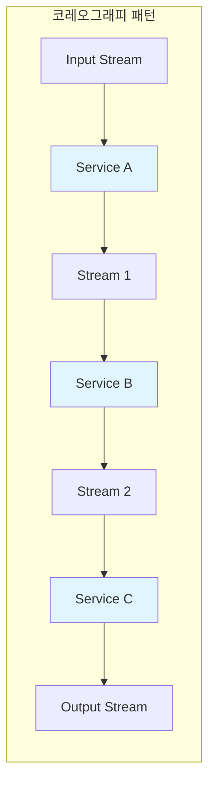
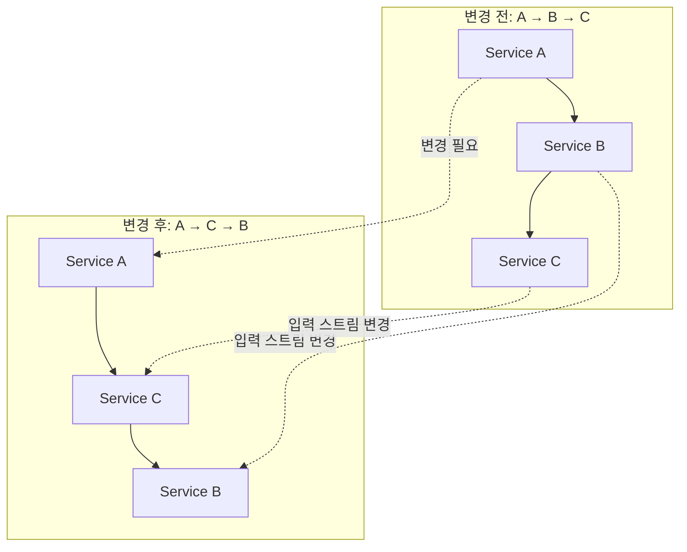
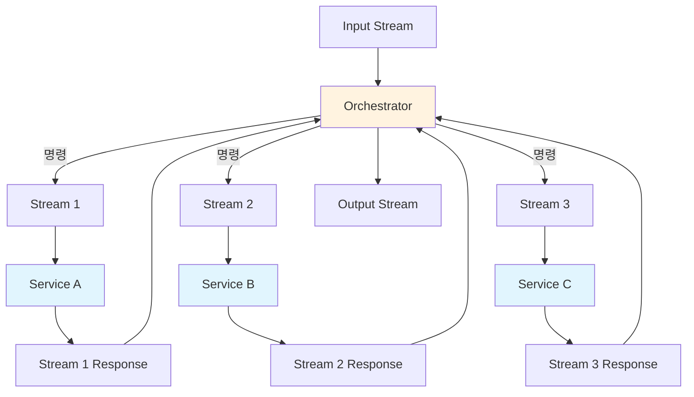
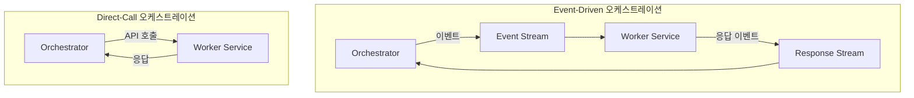
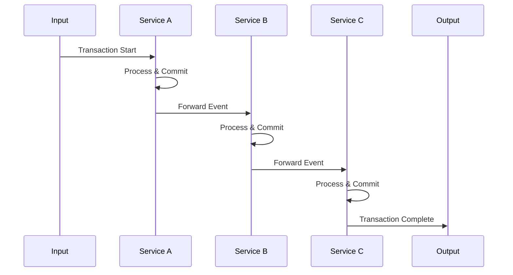
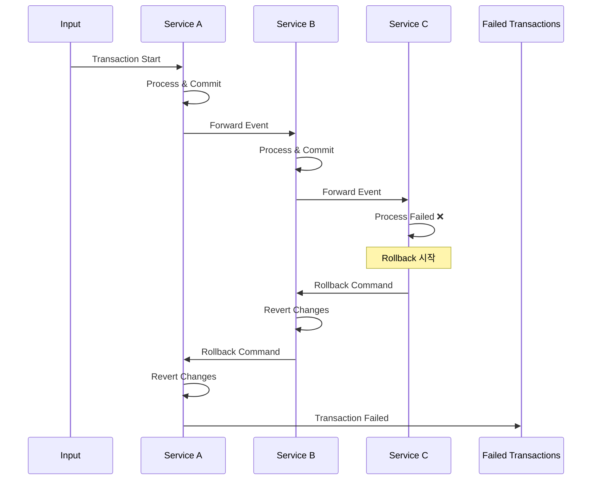
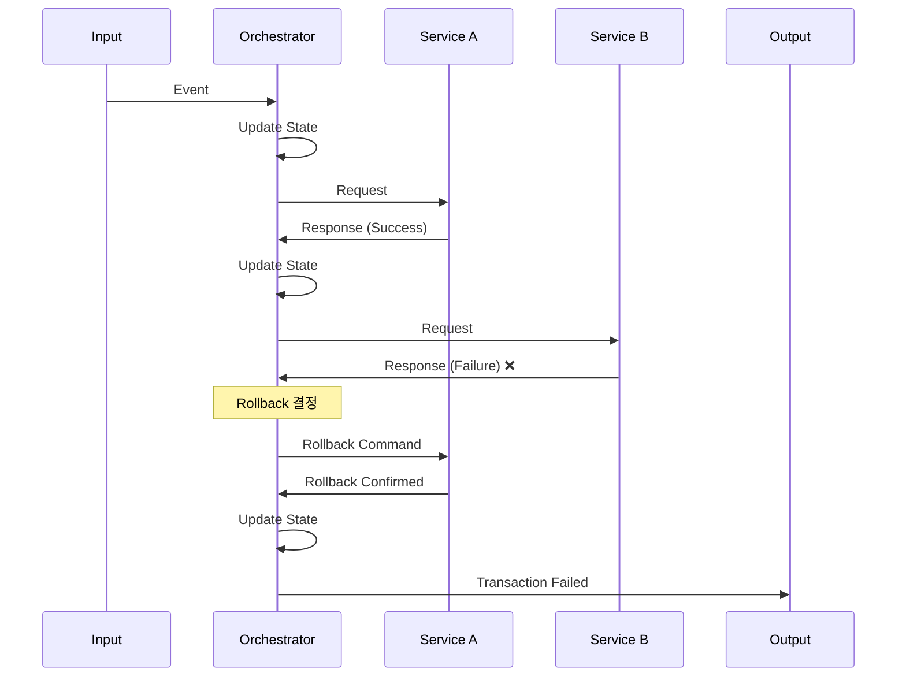
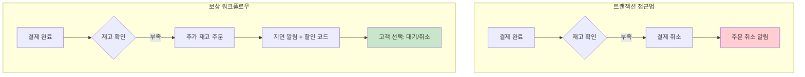
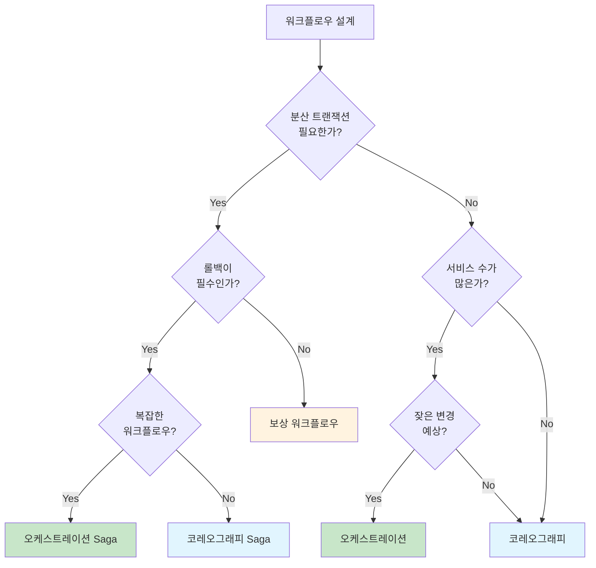
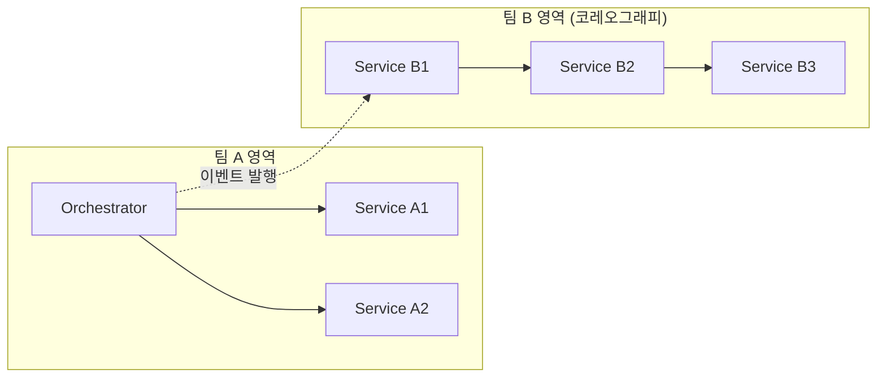

# Chapter 8. 마이크로서비스로 워크플로우 구축하기 (Building Workflows with Microservices)

## 핵심 요약

마이크로서비스는 조직의 전체 비즈니스 워크플로우 중 일부만 처리한다. **워크플로우(Workflow)**는 비즈니스 프로세스를 구성하는 특정 작업들의 집합으로, 논리적 분기와 보상 작업을 포함한다. 복잡한 워크플로우는 여러 마이크로서비스가 협력하여 수행하며, 이를 조율하는 두 가지 주요 패턴이 있다:

1. **코레오그래피(Choreography)**: 분산된 서비스들이 독립적으로 이벤트에 반응하는 패턴
2. **오케스트레이션(Orchestration)**: 중앙 오케스트레이터가 워커 서비스들을 조율하는 패턴

분산 트랜잭션이 필요한 경우 **Saga 패턴**을 적용할 수 있으며, 완벽한 롤백이 불가능한 경우 **보상 워크플로우(Compensation Workflow)**로 대응한다.

---

## 학습 목표

이 장을 학습한 후 다음을 할 수 있어야 한다:

1. **워크플로우 설계 고려사항** 이해하기
   - 워크플로우 생성 및 수정 전략
   - 워크플로우 모니터링 방법
   - 분산 트랜잭션 구현 접근법

2. **코레오그래피 패턴** 적용하기
   - 느슨한 결합의 장점과 한계
   - 워크플로우 수정 시 고려사항
   - 모니터링 전략

3. **오케스트레이션 패턴** 적용하기
   - 오케스트레이터의 역할과 책임
   - 워커 서비스와의 관계 설계
   - 상태 추적 및 가시성 확보

4. **분산 트랜잭션(Saga)** 구현하기
   - 코레오그래피 기반 Saga
   - 오케스트레이션 기반 Saga
   - 롤백 처리 전략

5. **보상 워크플로우** 설계하기
   - 트랜잭션 대안으로서의 보상 전략
   - 비즈니스 정책 기반 보상 처리

---

## 본문 정리

### 1. 워크플로우 설계 고려사항

EDM 워크플로우 구현 시 세 가지 핵심 고려사항:

```
┌─────────────────────────────────────────────────────────────┐
│                    워크플로우 설계 고려사항                      │
├─────────────────────────────────────────────────────────────┤
│  1. 생성 및 수정 (Creating & Modifying)                       │
│     - 서비스 간 관계는 어떻게 정의되는가?                         │
│     - 진행 중인 작업을 중단하지 않고 수정 가능한가?                 │
│     - 다수 서비스 변경 없이 수정 가능한가?                        │
│     - 모니터링과 가시성을 유지할 수 있는가?                       │
├─────────────────────────────────────────────────────────────┤
│  2. 모니터링 (Monitoring)                                     │
│     - 특정 이벤트의 워크플로우 완료 여부 확인                      │
│     - 이벤트 처리 실패 또는 중단 감지                             │
│     - 워크플로우 전체 건강 상태 모니터링                          │
├─────────────────────────────────────────────────────────────┤
│  3. 분산 트랜잭션 (Distributed Transactions)                   │
│     - 여러 작업의 원자성 보장                                    │
│     - 롤백 메커니즘 구현                                        │
└─────────────────────────────────────────────────────────────┘
```

---

### 2. 코레오그래피 패턴 (Choreography Pattern)

#### 2.1 개념

**코레오그래피(Choreography)**는 고도로 분리된 마이크로서비스 아키텍처를 의미한다. 각 서비스가 입력 이벤트에 독립적으로 반응하며, 상위/하위 서비스와 무관하게 동작한다.



**핵심 특징**:
- **느슨한 결합**: 프로듀서는 컨슈머를 알지 못함
- **독립적 동작**: 각 서비스가 자율적으로 처리
- **이벤트 중심**: 모든 통신은 이벤트 스트림을 통해 수행
- **창발적 행동(Emergent Behavior)**: 워크플로우는 서비스 간 관계에서 자연스럽게 발생

#### 2.2 코레오그래피 vs Direct-Call

| 특성 | 코레오그래피 (EDM) | Direct-Call |
|------|-------------------|-------------|
| **결합도** | 느슨한 결합 | 강한 결합 |
| **초점** | 재사용 가능한 이벤트 | 재사용 가능한 서비스 |
| **의존성** | 하위 소비자 알 필요 없음 | 호출 대상과 이유 알아야 함 |
| **확장성** | 새 컨슈머 쉽게 추가 | 명시적 API 연결 필요 |

#### 2.3 워크플로우 수정의 어려움

워크플로우 순서 변경 시 발생하는 문제:



**수정 시 고려사항**:
1. 각 서비스의 입력 스트림 변경 필요
2. 스키마 호환성 검토 필요
3. 진행 중인 이벤트 처리 완료 확인 필요
4. 다른 컨슈머에 대한 영향 평가

#### 2.4 코레오그래피 모니터링

```
┌─────────────────────────────────────────────────────────────┐
│                    모니터링 과제                              │
├─────────────────────────────────────────────────────────────┤
│  • 특정 이벤트의 진행 상황 파악 어려움                          │
│  • 각 스트림을 개별적으로 Materialize 필요                     │
│  • 워크플로우 변경 시 모니터링 시스템도 변경 필요                 │
│  • 대규모 워크플로우에서 복잡도 급증                            │
└─────────────────────────────────────────────────────────────┘

💡 Tip: 모니터링 대상을 명확히 정의하라.
         모든 단계가 명시적 노출을 필요로 하지는 않는다.
```

---

### 3. 오케스트레이션 패턴 (Orchestration Pattern)

#### 3.1 개념

**오케스트레이션(Orchestration)**에서는 중앙 **오케스트레이터(Orchestrator)**가 워커 서비스들에게 명령을 내리고 응답을 기다린다.



#### 3.2 오케스트레이터의 역할

```java
// 오케스트레이터 워크플로우 로직 예시
while (true) {
    Event[] events = consumer.consume(streams);

    for (Event event : events) {
        if (event.source == "Input Stream") {
            // 이벤트 처리 + 상태 업데이트
            producer.send("Stream 1", ...);  // Service A로 전송

        } else if (event.source == "Stream 1-Response") {
            // 결과 처리 + 상태 업데이트
            producer.send("Stream 2", ...);  // Service B로 전송

        } else if (event.source == "Stream 2-Response") {
            // 결과 처리 + 상태 업데이트
            producer.send("Stream 3", ...);  // Service C로 전송

        } else if (event.source == "Stream 3-Response") {
            // 최종 결과 구성 + 출력
            producer.send("Output", ...);
        }
    }
    consumer.commitOffsets();
}
```

#### 3.3 오케스트레이터의 상태 추적

| Input Event ID | Service A | Service B | Service C | Status |
|----------------|-----------|-----------|-----------|--------|
| 100 | `<results>` | `<results>` | `<results>` | Done |
| 101 | `<results>` | `<results>` | Dispatched | Processing |
| 102 | Dispatched | null | null | Processing |

#### 3.4 오케스트레이터 설계 원칙

```
⚠️ Anti-Pattern: "God" Service
┌─────────────────────────────────────────────────────────────┐
│  ❌ 잘못된 설계                                               │
│     - 오케스트레이터가 세부 명령을 발행                         │
│     - 비즈니스 로직이 오케스트레이터에 분산                      │
│     - 워커 서비스가 단순한 "Minion"으로 전락                    │
├─────────────────────────────────────────────────────────────┤
│  ✅ 올바른 설계                                               │
│     - 오케스트레이터는 워크플로우 로직만 담당                    │
│     - 비즈니스 로직은 워커 서비스에 위임                        │
│     - 워커 서비스가 자체 재시도, 오류 처리 담당                  │
└─────────────────────────────────────────────────────────────┘
```

**핵심 원칙**:
- 오케스트레이터: 워크플로우 조율만 담당
- 워커 서비스: 비즈니스 로직 수행
- 재시도 정책: 각 워커 서비스가 자체적으로 관리

---

### 4. Direct-Call vs Event-Driven 오케스트레이션 비교



| 특성 | Event-Driven | Direct-Call |
|------|--------------|-------------|
| **속도** | 상대적으로 느림 | 빠름 |
| **내구성** | 높음 (이벤트 브로커 격리) | 낮음 (연결 장애 영향) |
| **재시도** | 내장 (이벤트 스트림 유지) | 오케스트레이터가 관리 |
| **모니터링** | 기존 EDM 도구 활용 | 별도 도구 필요 |
| **스트림 재사용** | 다른 서비스도 소비 가능 | 불가 |
| **장애 격리** | 높음 | 낮음 |
| **적합한 상황** | 느리지만 견고한 처리 | 실시간 빠른 응답 |

---

### 5. 분산 트랜잭션 (Distributed Transactions)

#### 5.1 분산 트랜잭션 개요

**분산 트랜잭션(Distributed Transaction)**은 두 개 이상의 마이크로서비스에 걸친 트랜잭션이다.

```
⚠️ 경고: 분산 트랜잭션은 가능하면 피하라!

복잡성 요소:
  • 시스템 간 작업 동기화
  • 롤백 처리
  • 일시적 인스턴스 장애
  • 네트워크 연결 문제
```

#### 5.2 Saga 패턴

**Saga**는 이벤트 기반 세계에서의 분산 트랜잭션 패턴:
- 코레오그래피 또는 오케스트레이션으로 구현
- 각 서비스는 **롤백 액션** 제공 필수
- 모든 액션은 **멱등성(Idempotent)** 보장 필요

---

### 6. 코레오그래피 기반 Saga

#### 6.1 성공 시나리오



#### 6.2 실패 및 롤백 시나리오



#### 6.3 코레오그래피 Saga의 한계

| 문제점 | 설명 |
|--------|------|
| **분산된 출력** | 성공은 C에서, 실패는 A에서 출력 |
| **모니터링 어려움** | 전체 스트림 Materialize 필요 |
| **강한 결합** | 느슨한 결합 서비스 간 의존성 발생 |
| **변경 어려움** | 비트랜잭션보다 더 복잡한 수정 |
| **적합한 상황** | 서비스 수가 적고, 순서 변경 가능성 낮을 때 |

---

### 7. 오케스트레이션 기반 Saga

#### 7.1 트랜잭션 처리 흐름



#### 7.2 오케스트레이터의 롤백 처리

```java
// 오케스트레이터 롤백 로직 의사 코드
void handleTransactionFailure(Event event, TransactionState state) {
    // 현재까지 완료된 서비스들에 대해 역순으로 롤백
    for (Service service : state.getCompletedServices().reverse()) {
        RollbackResult result = service.rollback(event.getId());

        if (result.isFailed()) {
            // 롤백 실패 시 처리 옵션:
            // 1. 재시도
            // 2. 알림 발송
            // 3. 애플리케이션 종료
            handleRollbackFailure(service, event);
        }
    }

    // 롤백 완료 후 실패 이벤트 출력
    producer.send("Output", TransactionFailed(event));
}
```

#### 7.3 오케스트레이션 Saga의 장점

```
┌─────────────────────────────────────────────────────────────┐
│              오케스트레이션 Saga 장점                          │
├─────────────────────────────────────────────────────────────┤
│  ✅ 단일 출력 스트림: 성공/실패 모두 같은 곳에서 확인           │
│  ✅ 중앙 모니터링: 오케스트레이터에서 전체 상태 파악            │
│  ✅ 유연한 변경: 워크플로우 로직 한 곳에서 수정                 │
│  ✅ 다양한 신호 지원: 타임아웃, 사용자 입력 등                  │
│  ✅ 진행 상태 노출: 스트림 기반 모니터링 가능                   │
├─────────────────────────────────────────────────────────────┤
│  ⚠️ 주의사항                                                 │
│  • 오케스트레이터 인스턴스 관리 오버헤드                        │
│  • 워커 서비스는 자체 상태 일관성 책임                          │
└─────────────────────────────────────────────────────────────┘
```

---

### 8. 보상 워크플로우 (Compensation Workflows)

모든 워크플로우가 완벽한 롤백을 필요로 하지는 않는다. **보상 워크플로우**는 트랜잭션 대신 사후 조치로 상황을 해결한다.

#### 8.1 예시: 재고 부족 상황



#### 8.2 보상 워크플로우 활용 사례

| 도메인 | 상황 | 보상 전략 |
|--------|------|-----------|
| **이커머스** | 재고 부족 | 추가 주문 + 지연 알림 + 할인 제공 |
| **항공사** | 오버부킹 | 대체 항공편 + 보상금 + 업그레이드 |
| **공연/스포츠** | 티켓 초과 판매 | 환불 + 다음 공연 우선권 |
| **호텔** | 룸 초과 예약 | 대체 호텔 + 교통비 지원 |

---

### 9. 패턴 선택 가이드

#### 9.1 코레오그래피 vs 오케스트레이션 비교

| 기준 | 코레오그래피 | 오케스트레이션 |
|------|--------------|----------------|
| **결합도** | 느슨함 | 강함 (오케스트레이터-워커) |
| **서비스 관계** | 암시적 (스트림 기반) | 명시적 (정의됨) |
| **워크플로우 정의** | 서비스 간 관계에서 발생 | 오케스트레이터에 집중 |
| **변경 용이성** | 낮음 (다수 서비스 수정) | 높음 (단일 지점 수정) |
| **모니터링** | 어려움 (분산) | 쉬움 (중앙 집중) |
| **트랜잭션 지원** | 제한적 | 강력함 |
| **적합한 상황** | 단순 워크플로우, 변경 없음 | 복잡 워크플로우, 잦은 변경 |

#### 9.2 선택 결정 트리



---

## 심화 학습

### 1. Saga 패턴 심화

#### 1.1 Saga Execution Coordinator (SEC)

오케스트레이션 Saga에서 SEC는 다음을 관리:
- 트랜잭션 상태 추적
- 보상 액션 순서 결정
- 실패 복구 전략 실행

#### 1.2 멱등성 보장 전략

```java
// 멱등성 보장을 위한 중복 체크
public Result processWithIdempotency(Event event) {
    String idempotencyKey = event.getId() + "-" + event.getVersion();

    // 이미 처리된 이벤트인지 확인
    if (processedEvents.contains(idempotencyKey)) {
        return previousResult.get(idempotencyKey);
    }

    // 비즈니스 로직 실행
    Result result = executeBusinessLogic(event);

    // 처리 결과 저장
    processedEvents.add(idempotencyKey);
    previousResult.put(idempotencyKey, result);

    return result;
}
```

### 2. 하이브리드 접근법

실무에서는 두 패턴을 혼합하여 사용:



- **팀 내부**: 오케스트레이션 (긴밀한 조율)
- **팀 간**: 코레오그래피 (느슨한 결합)

---

## 실무 적용 포인트

### 1. 코레오그래피 적용 시

```
✅ 적합한 상황:
  • 팀 간 독립적인 워크플로우
  • 순서 변경 가능성 낮음
  • 2-3개 서비스의 단순 흐름
  • 다양한 컨슈머가 스트림 재사용

⚠️ 주의사항:
  • Bounded Context 명확히 정의
  • 스키마 호환성 유지
  • 모니터링 전략 사전 수립
```

### 2. 오케스트레이션 적용 시

```
✅ 적합한 상황:
  • 복잡한 비즈니스 워크플로우
  • 잦은 워크플로우 변경 예상
  • 트랜잭션 요구사항 있음
  • 높은 가시성 필요

⚠️ 주의사항:
  • 오케스트레이터를 "God Service"로 만들지 않기
  • 워커 서비스에 비즈니스 로직 위임
  • 재시도 정책은 워커 서비스가 담당
```

### 3. 분산 트랜잭션 구현 시

```
⚠️ 최우선 원칙: 가능하면 분산 트랜잭션 피하기

불가피한 경우:
  1. 모든 액션에 멱등성 보장
  2. 명확한 롤백 전략 정의
  3. 타임아웃 및 장애 복구 계획
  4. 충분한 테스트 및 모니터링
```

---

## 체크리스트

### 워크플로우 설계 체크리스트

- [ ] 워크플로우의 복잡도와 변경 빈도 분석
- [ ] 적절한 패턴 선택 (코레오그래피 vs 오케스트레이션)
- [ ] 분산 트랜잭션 필요 여부 평가
- [ ] 모니터링 및 가시성 요구사항 정의
- [ ] 장애 시나리오 및 복구 전략 수립

### 코레오그래피 구현 체크리스트

- [ ] 각 서비스의 Bounded Context 명확히 정의
- [ ] 이벤트 스키마 호환성 확인
- [ ] 단일 작성자 원칙 준수
- [ ] 워크플로우 진행 상태 모니터링 방안 마련

### 오케스트레이션 구현 체크리스트

- [ ] 오케스트레이터는 워크플로우 로직만 담당
- [ ] 워커 서비스에 비즈니스 로직 완전 위임
- [ ] 워커 서비스가 자체 재시도 정책 관리
- [ ] 상태 Materialize 및 모니터링 구현
- [ ] 타임아웃 및 사용자 입력 처리 지원

### Saga 구현 체크리스트

- [ ] 모든 액션 및 롤백 액션 멱등성 보장
- [ ] 롤백 순서 명확히 정의
- [ ] 실패한 롤백에 대한 처리 전략
- [ ] 트랜잭션 상태 추적 및 모니터링

---

## 참고 자료

### 관련 패턴

| 패턴 | 설명 | 관련 장 |
|------|------|---------|
| Event Sourcing | 이벤트로 상태 재구성 | Chapter 7 |
| CQRS | 읽기/쓰기 분리 | Chapter 7 |
| Outbox Pattern | 트랜잭션 + 이벤트 발행 | Chapter 4 |
| Saga Pattern | 분산 트랜잭션 | 본 장 |

### 추가 학습 자료

- **Saga Pattern**: Chris Richardson의 Microservices.io
- **Choreography vs Orchestration**: Martin Fowler의 Enterprise Integration Patterns
- **Distributed Transactions**: Pat Helland의 "Life Beyond Distributed Transactions"

---

## 핵심 용어 정리

| 용어 | 정의 |
|------|------|
| **Workflow** | 비즈니스 프로세스를 구성하는 작업들의 집합 |
| **Choreography** | 분산 서비스가 독립적으로 이벤트에 반응하는 패턴 |
| **Orchestration** | 중앙 조율자가 워커 서비스를 조율하는 패턴 |
| **Orchestrator** | 워크플로우 로직을 관리하는 중앙 서비스 |
| **Worker Service** | 오케스트레이터의 명령을 수행하는 서비스 |
| **Saga** | 이벤트 기반 분산 트랜잭션 패턴 |
| **Compensation Workflow** | 트랜잭션 대신 사후 보상 조치로 해결하는 패턴 |
| **Emergent Behavior** | 서비스 간 관계에서 자연스럽게 발생하는 워크플로우 |
| **Idempotency** | 동일 요청을 여러 번 실행해도 결과가 같은 특성 |
| **Bounded Context** | 특정 도메인 모델이 적용되는 경계 |
