# Chapter 9. FaaS 기반 마이크로서비스 (Microservices Using Function-as-a-Service)

## 핵심 요약

**Function-as-a-Service (FaaS)**는 인프라 오버헤드 없이 애플리케이션 기능을 구축, 관리, 배포, 확장할 수 있는 "서버리스(Serverless)" 솔루션이다. 이벤트 기반 시스템에서 단순~중간 복잡도의 솔루션 구현에 효과적이다.

**함수(Function)**는 특정 트리거 조건이 발생하면 실행되어 작업을 완료한 후 종료되는 코드 단위이다. FaaS는 로드에 따라 함수 인스턴스 수를 유연하게 확장/축소할 수 있어 변동이 큰 워크로드에 적합하다.

핵심 고려사항:
- 함수는 일정 시간 후 항상 종료됨 → 연결과 상태가 사라짐
- **Cold Start** vs **Warm Start** 이해 필요
- 오프셋 커밋 시점 (처리 완료 후 커밋 권장)
- 상태 관리는 외부 저장소 필요

---

## 학습 목표

이 장을 학습한 후 다음을 할 수 있어야 한다:

1. **FaaS 솔루션 설계 원칙** 이해하기
   - Bounded Context 소속 보장
   - 오프셋 커밋 전략
   - 함수 수 최적화 (Less is More)

2. **FaaS 구성 요소** 파악하기
   - 함수, 입력 이벤트 스트림, 트리거 로직
   - 오류/스케일링 정책 및 메타데이터

3. **트리거 메커니즘** 활용하기
   - Event-Stream Listener
   - Consumer Group Lag
   - 스케줄 기반, Webhook, 리소스 이벤트

4. **함수 간 통신 패턴** 구현하기
   - 이벤트 기반 통신 (코레오그래피)
   - Direct-Call (동기/비동기)
   - 오케스트레이션 패턴

5. **성능 튜닝 및 스케일링** 적용하기
   - 리소스 할당 최적화
   - 배치 파라미터 설정
   - 스케일링 정책 설계

---

## 본문 정리

### 1. FaaS 개념

#### 1.1 FaaS란?

```
┌─────────────────────────────────────────────────────────────┐
│                    Function-as-a-Service                    │
├─────────────────────────────────────────────────────────────┤
│  • 서버리스(Serverless) 솔루션                               │
│  • 인프라 관리 없이 코드 실행                                 │
│  • 트리거 조건 발생 시 함수 실행                              │
│  • 작업 완료 후 자동 종료                                    │
│  • 로드에 따른 자동 스케일링                                  │
├─────────────────────────────────────────────────────────────┤
│  💡 FaaS를 "정기적으로 실패하는 Consumer/Producer"로 생각하라  │
│     → 함수는 일정 시간 후 종료, 연결과 상태 사라짐             │
└─────────────────────────────────────────────────────────────┘
```

#### 1.2 Cold Start vs Warm Start

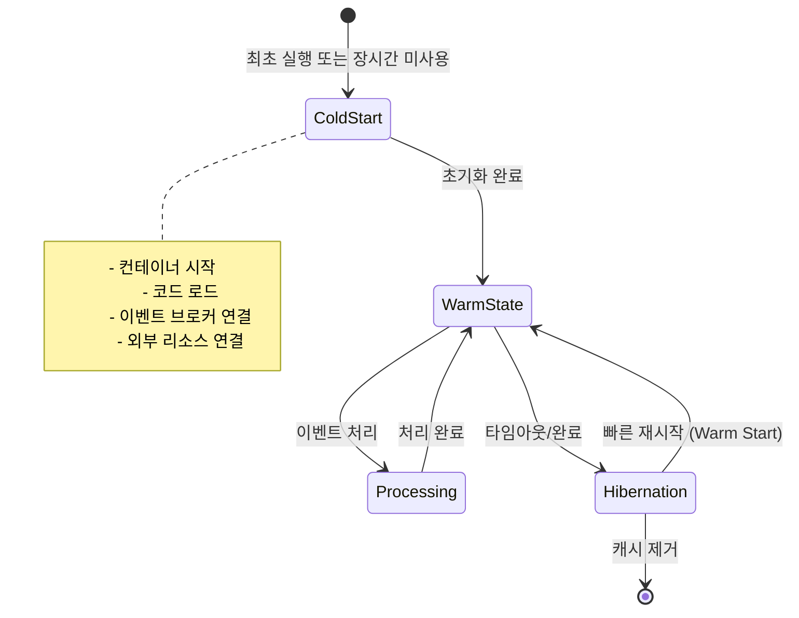

| 상태 | 설명 | 특징 |
|------|------|------|
| **Cold Start** | 최초 실행 또는 오랜 미사용 후 | 모든 연결 재생성 필요, 느림 |
| **Warm State** | 초기화 완료, 처리 준비 완료 | 즉시 처리 가능 |
| **Hibernation** | 일시 중단 상태 | 빠른 재활성화 가능 |
| **Warm Start** | Hibernation에서 재시작 | 연결 재사용 가능, 빠름 |

---

### 2. FaaS 솔루션 설계 원칙

#### 2.1 Bounded Context 엄격 준수

```
✅ Bounded Context 유지 방법:

1. 데이터 저장소는 외부 컨텍스트에 비공개
2. 다른 컨텍스트와 연결 시 표준 인터페이스 사용
   - Request-Response
   - Event-Driven
3. 함수-컨텍스트 1:1 매핑 메타데이터 관리
4. Bounded Context 단위로 리포지토리 유지
```

#### 2.2 오프셋 커밋 전략

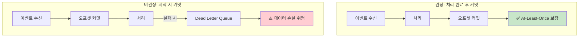

| 커밋 시점 | 장점 | 단점 | 적합한 상황 |
|-----------|------|------|-------------|
| **처리 완료 후** | At-Least-Once 보장 | 재처리 가능성 | 데이터 손실 민감 |
| **시작 시** | 단순한 구현 | 데이터 손실 위험 | 손실 허용 가능 |

#### 2.3 Less Is More

```
⚠️ 과도한 함수 분리의 문제:
  • Bounded Context 내 동작 파악 어려움
  • 함수 소유권 모호
  • 버전 관리 복잡도 증가
  • 변경 시 영향 범위 불명확

✅ 권장:
  "적은 수의 함수 > 많은 세분화된 함수"

  단일 함수 테스트, 디버깅, 관리가 훨씬 쉬움
```

---

### 3. FaaS 구성 요소

#### 3.1 네 가지 핵심 구성 요소

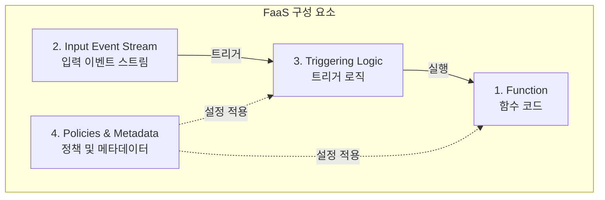

#### 3.2 Function-Trigger 매핑

| Function | Event Stream(s) | Trigger | Policies & Metadata |
|----------|-----------------|---------|---------------------|
| myFunction | myInputStream | onNewEvent | Consumer Group, Batch Size, Retry Policy, Scaling Policy |

#### 3.3 함수 코드 예시

```java
// 기본 함수 구조
public int myfunction(Event[] events, Context context) {
    // events: 처리할 이벤트 배열 (key, value, timestamp, offset, partition_id)
    // context: 함수 컨텍스트 정보 (name, stream ID, 남은 수명)

    for (Event event : events) {
        try {
            println(event.key + ", " + event.value);
        } catch (Exception e) {
            println("error processing " + event.toString());
        }
    }

    // FaaS 프레임워크에 배치 처리 완료 알림
    context.success();
    return 0;
}
```

---

### 4. 트리거 메커니즘

#### 4.1 트리거 유형 비교

| 트리거 유형 | 설명 | 사용 사례 |
|-------------|------|-----------|
| **Event-Stream Listener** | 새 이벤트 도착 시 트리거 | 실시간 이벤트 처리 |
| **Consumer Group Lag** | 소비자 지연 감지 시 트리거 | SLA 기반 스케일링 |
| **Schedule** | 정해진 시간/주기에 트리거 | 배치 처리, 주기적 작업 |
| **Webhook** | 직접 호출로 트리거 | 외부 시스템 연동 |
| **Resource Events** | 리소스 변경 시 트리거 | 파일 업로드, DB 변경 |

#### 4.2 Event-Stream Listener

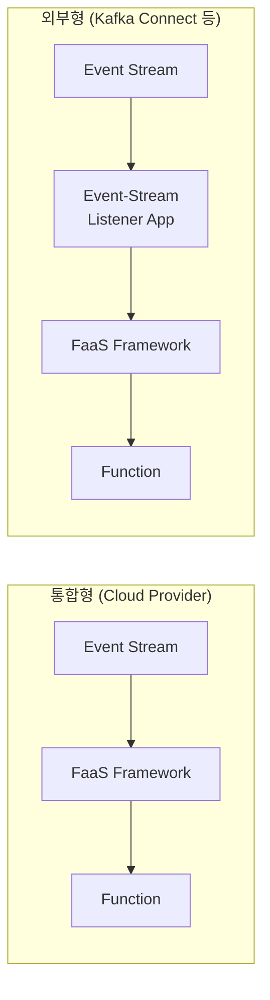

**주요 파라미터**:
- **Batch Size**: 한 번에 처리할 최대 이벤트 수
- **Batch Window**: 추가 이벤트를 기다리는 최대 시간
- **동기/비동기**: 순서 보장 여부 결정

```java
// Event-Stream Listener 함수 예시
public int myEventFunction(Event[] events, Context context) {
    for (Event event : events) {
        try {
            println(event.key + ", " + event.value);
        } catch (Exception e) {
            println("error printing " + event.toString());
        }
    }
    context.success();  // 오프셋 업데이트 신호
    return 0;
}
```

#### 4.3 Consumer Group Lag 트리거

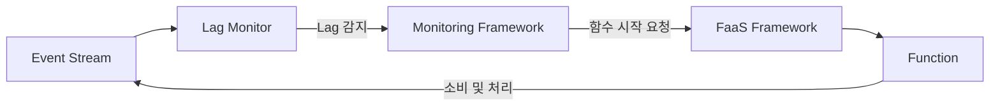

```java
// Lag 기반 트리거 함수 (자체 연결 관리)
public int myLagConsumerFunction(Context context) {
    String consumerGroup = context.consumerGroup;
    String streamName = context.streamName;

    // 이벤트 브로커 클라이언트 생성
    EventBrokerClient client = new EventBrokerClient(consumerGroup, ...);

    // 이벤트 소비
    Event[] events = client.consumeBatch(streamName, ...);

    for (Event event : events) {
        doWork(event);  // 비즈니스 로직
    }

    // 오프셋 커밋
    client.commitOffsets();

    context.success();
    return 0;
}
```

**Lag 트리거 vs Event-Stream Listener**:

| 특성 | Event-Stream Listener | Lag 트리거 |
|------|----------------------|-----------|
| 이벤트 소비 | 프레임워크가 처리 | 함수가 직접 처리 |
| 연결 관리 | 자동 | 수동 |
| 코드 복잡도 | 낮음 | 높음 |
| 유연성 | 제한적 | 높음 |
| 스케일링 | 프레임워크 의존 | 커스텀 가능 |

---

### 5. 상태 관리

#### 5.1 외부 상태 저장소 필요성

```
┌─────────────────────────────────────────────────────────────┐
│                    FaaS 상태 관리 특징                        │
├─────────────────────────────────────────────────────────────┤
│  • 함수 수명이 짧음 → 로컬 상태 유지 어려움                     │
│  • FaaS 제공자는 유연한 스케일링을 위해 "No Local State" 강제   │
│  • Warm Start 시 이전 상태 사용 가능하나 보장되지 않음          │
│  • 외부 상태 저장소 연결 필수                                  │
└─────────────────────────────────────────────────────────────┘
```

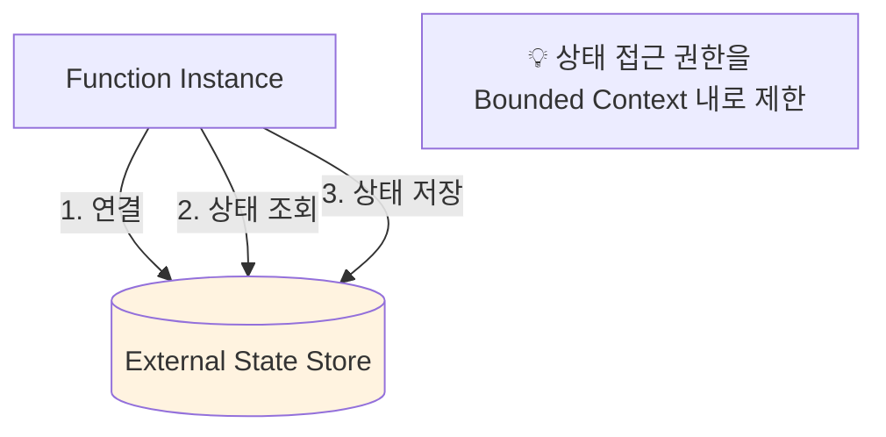

#### 5.2 Durable Functions (Microsoft Azure 예시)

```
Durable Functions 장점:
  • 상태 관리 자동화
  • 로컬 메모리 사용 (자동 외부 영속화)
  • 함수 일시 중단/재개 지원
  • 명시적 상태 저장/조회 코드 불필요
```

---

### 6. 함수 간 통신 패턴

#### 6.1 이벤트 기반 통신 (코레오그래피)

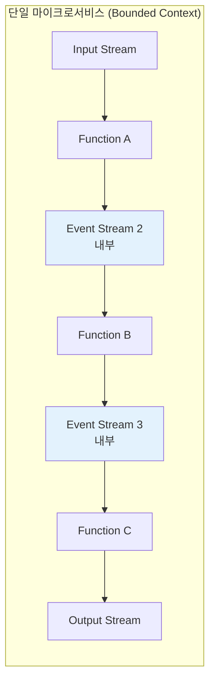

**장점**:
- 각 함수가 독립적으로 오프셋 관리
- 함수 간 조율 불필요
- 장애 시 데이터 손실 없음 (이벤트 브로커에 저장)

#### 6.2 Direct-Call: 비동기 (코레오그래피)

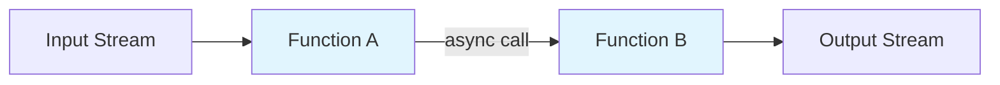

```java
// 비동기 Direct-Call 예시
public int functionA(Event[] events, Context context) {
    for (Event event : events) {
        // Function A 처리
        doWorkA(event);

        // Function B 비동기 호출 (결과 대기 안 함)
        asyncFunctionB(event);
    }
    context.success();
    return 0;
}
```

**⚠️ 비동기 호출의 문제점**:
1. Function B 실패 시 Function A에 피드백 없음 → 오프셋 잘못 커밋 가능
2. 다중 Function B 인스턴스 생성 → 순서 보장 안 됨
3. Race Condition 발생 가능

#### 6.3 Direct-Call: 동기 (오케스트레이션)

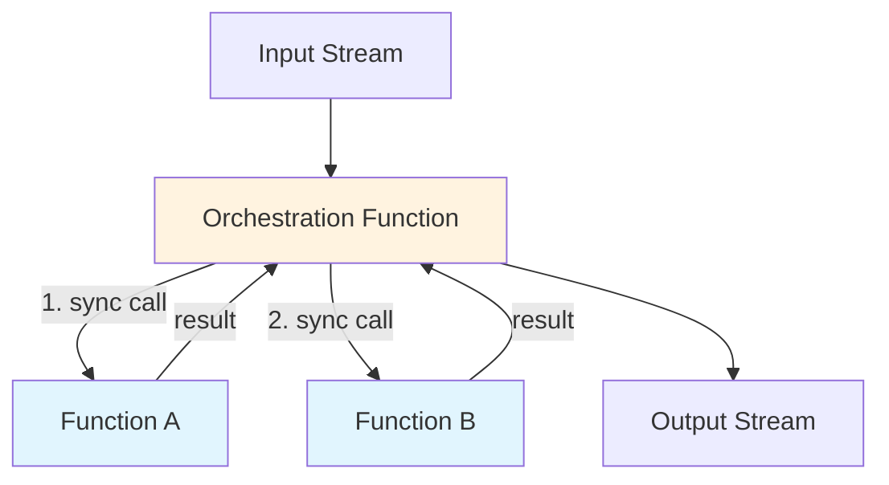

```java
// 오케스트레이션 함수 예시
public int orchestrationFunction(Event[] events, Context context) {
    for (Event event : events) {
        // 동기 함수 호출 - 순서 보장
        Result resultFromA = invokeFunctionA(event);
        Result resultFromB = invokeFunctionB(event, resultFromA);

        // 결과 조합 및 출력
        Output output = composeOutputEvent(resultFromA, resultFromB);
        producer.produce("Output Stream", output);
    }

    // 모든 이벤트 처리 완료 후 오프셋 업데이트
    context.success();
    return 0;
}
```

**오케스트레이션 장점**:
- 이벤트 순서 보장
- Function A → B 순차 실행
- 모든 처리 완료 후 오프셋 커밋

#### 6.4 통신 패턴 비교

| 패턴 | 순서 보장 | 구현 복잡도 | 장애 대응 | 적합한 상황 |
|------|----------|------------|----------|------------|
| **이벤트 기반** | O | 중간 | 우수 | 내구성 필요 |
| **비동기 Direct-Call** | X | 낮음 | 제한적 | 순서 무관 |
| **동기 Direct-Call** | O | 높음 | 중간 | 빠른 응답 필요 |

---

### 7. 종료 및 셧다운

#### 7.1 함수 종료 시나리오

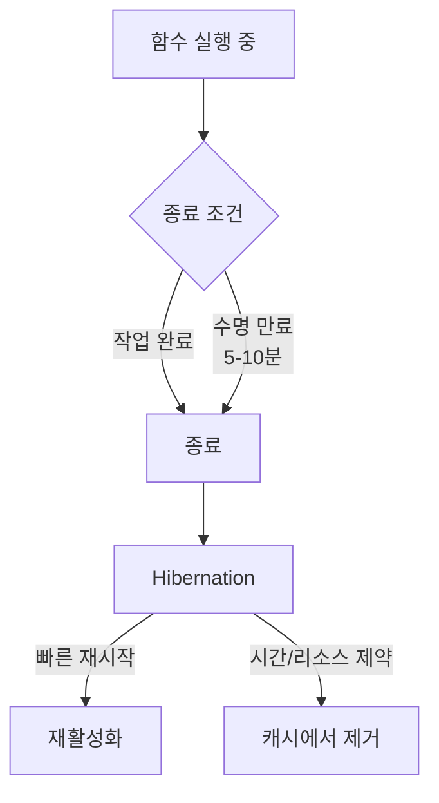

#### 7.2 연결 및 리소스 관리

```
┌─────────────────────────────────────────────────────────────┐
│                    종료 시 리소스 처리                        │
├─────────────────────────────────────────────────────────────┤
│  상시 실행 함수 (이벤트 지속 유입):                            │
│    → 연결 유지, 재시작 시 재사용                              │
│    → Consumer Group 리밸런싱 불필요                          │
├─────────────────────────────────────────────────────────────┤
│  간헐적 실행 함수:                                           │
│    → 연결 종료 및 파티션 할당 해제 권장                        │
│    → 다음 인스턴스가 새로 연결                                │
├─────────────────────────────────────────────────────────────┤
│  💡 확신이 없으면 연결 정리가 일반적으로 좋은 선택              │
│     - 외부 데이터 저장소/이벤트 브로커 부하 감소               │
│     - 중단된 함수의 파티션 점유 방지                          │
└─────────────────────────────────────────────────────────────┘
```

---

### 8. 튜닝 및 스케일링

#### 8.1 리소스 할당

| 리소스 | 고려사항 |
|--------|----------|
| **CPU/Memory** | 과다 할당 = 비용 증가, 과소 할당 = 크래시/지연 |
| **최대 실행 시간** | 배치 크기와 연관, 예상 처리 시간보다 높게 설정 |
| **외부 I/O** | 상태 저장소 I/O 용량 고려 |

#### 8.2 배치 파라미터 최적화

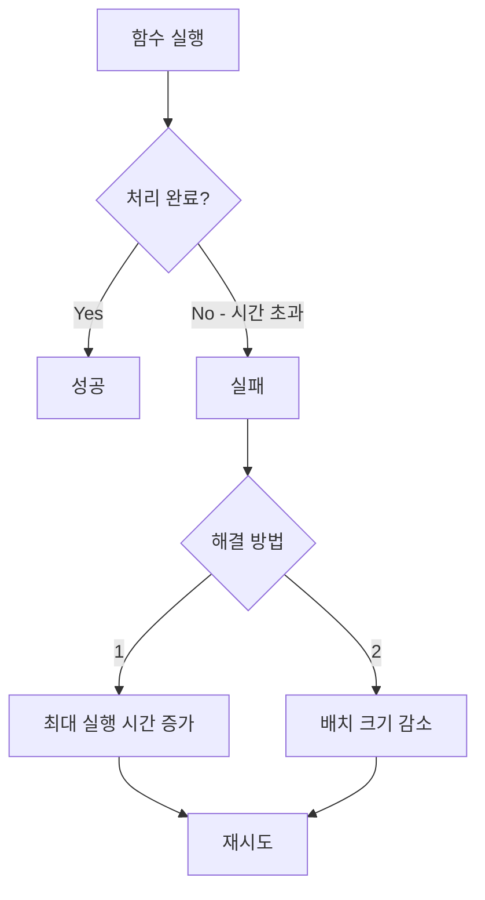

**자동 배치 조정** (AWS, Azure 등):
- 실패 시 배치 크기 자동으로 절반 감소
- 처리 가능할 때까지 반복
- 점진적 복구 지원

#### 8.3 스케일링 정책

```
⚠️ 스케일링 주의사항:

1. 파티션 수가 최대 병렬 처리 한계
   → 순서 중요 시 파티션 수 = 최대 함수 인스턴스 수

2. Consumer Group 리밸런싱 오버헤드
   → 함수가 자주 Join/Leave하면 리밸런싱 과부하
   → 가상 교착 상태 발생 가능

3. 권장 대책:
   → 단계적 스케일링 정책 사용
   → Hysteresis Loop 적용 (민감도 낮추기)
   → 몇 분 간격으로 스케일링
   → Static Partition Assignment 고려
```

---

### 9. FaaS 제공자 선택

#### 9.1 제공자 유형

| 유형 | 예시 | 장점 | 단점 |
|------|------|------|------|
| **오픈소스** | OpenWhisk, OpenFaaS, Kubeless, Nuclio | 커스터마이징, 벤더 종속 없음 | 직접 관리 필요 |
| **Cloud Provider** | AWS Lambda, GCP Cloud Functions, Azure Functions | 빠른 시작, 관리 간편 | 벤더 종속, 7일 보존 제한 |
| **통합형** | Apache Pulsar Functions | 이벤트 브로커와 통합 | 플랫폼 의존 |

#### 9.2 이벤트 브로커 통합 고려

```
┌─────────────────────────────────────────────────────────────┐
│              Cloud Provider FaaS 주의사항                    │
├─────────────────────────────────────────────────────────────┤
│  AWS, GCP, Azure 모두 자체 이벤트 브로커 보존 기간 7일 제한    │
│                                                             │
│  해결책:                                                     │
│  • Kafka Connect 등으로 오픈소스 브로커 연동                  │
│  • 추가 설정/관리 오버헤드 발생                               │
│                                                             │
│  💡 이미 클라우드 구독 중이면 실험 오버헤드는 낮음              │
└─────────────────────────────────────────────────────────────┘
```

---

## 심화 학습

### 1. FaaS 적합성 평가

#### 1.1 FaaS가 적합한 경우

```
✅ 적합한 워크로드:
  • 단순한 토폴로지
  • Stateless 처리
  • 결정적 처리가 필요 없는 경우
  • 큐 기반 처리 (순서 무관)
  • 변동이 큰 워크로드
  • 빠른 스케일 업/다운 필요
```

#### 1.2 FaaS가 부적합한 경우

```
❌ 부적합한 워크로드:
  • 복잡한 상태 관리 필요
  • 다중 이벤트 스트림의 결정적 처리
  • 이벤트 스케줄링 필요
  • 장시간 실행 작업
  • 지속적인 연결 유지 필요
```

### 2. 순서 보장 전략

```java
// 순서 보장을 위한 이벤트별 완전 처리
public int orderedProcessing(Event[] events, Context context) {
    for (Event event : events) {
        // 💡 각 이벤트를 완전히 처리한 후 다음 이벤트로
        Result resultA = invokeFunctionA(event);
        Result resultB = invokeFunctionB(event, resultA);

        // 동일 데이터 저장소 접근 시 순서 보장 필수
        updateExternalStore(resultA, resultB);
    }
    context.success();
    return 0;
}
```

### 3. Static Partition Assignment

```
Static Partition Assignment 장점:
  • 리밸런싱 오버헤드 제거
  • 이벤트 스트림 Copartitioning 가능
  • 함수가 할당된 파티션을 미리 인지
  • 트리거 시 즉시 소비 시작

주의사항:
  • 각 파티션이 소비되는지 확인 필요
  • 더 세밀한 함수 작업 설계 필요
```

---

## 실무 적용 포인트

### 1. FaaS 도입 체크리스트

```
□ 워크로드가 FaaS에 적합한가?
  - Stateless 또는 단순 Stateful
  - 변동이 큰 처리량
  - 순서 보장 불필요 또는 파티션 기반 보장 가능

□ Bounded Context가 명확한가?
  - 함수-컨텍스트 매핑 정의
  - 데이터 저장소 접근 권한 제한

□ 오프셋 커밋 전략 결정
  - 데이터 손실 민감도 평가
  - 처리 완료 후 커밋 권장

□ 적절한 FaaS 제공자 선택
  - 기존 인프라와의 통합
  - 이벤트 브로커 호환성
```

### 2. 성능 최적화 가이드

```
1. Cold Start 최소화:
   - 함수 코드 경량화
   - 연결 재사용 (Warm State 활용)
   - 적절한 실행 빈도 유지

2. 배치 처리 최적화:
   - 배치 크기 vs 실행 시간 균형
   - 오버헤드 분산을 위한 배치

3. 스케일링 안정화:
   - 단계적 스케일링 적용
   - 리밸런싱 빈도 최소화
   - 파티션 수 기반 최대 병렬도 계획
```

### 3. 모니터링 포인트

```
핵심 메트릭:
  • Cold Start 빈도 및 시간
  • 함수 실행 시간 분포
  • 실패율 및 재시도 횟수
  • Consumer Group Lag
  • 배치 처리량

알람 설정:
  • 타임아웃 빈도 증가
  • Dead Letter Queue 누적
  • 리밸런싱 과다 발생
```

---

## 체크리스트

### FaaS 설계 체크리스트

- [ ] Bounded Context 소속 명확히 정의
- [ ] 함수 수 최소화 (Less is More)
- [ ] 오프셋 커밋 전략 결정 (처리 완료 후 권장)
- [ ] 각 함수의 독립적 Consumer Group 설정
- [ ] 외부 상태 저장소 접근 권한 제한

### 트리거 설정 체크리스트

- [ ] 적절한 트리거 유형 선택
- [ ] Batch Size 및 Batch Window 최적화
- [ ] 동기/비동기 처리 요구사항 확인
- [ ] 스케일링 정책 정의

### 함수 간 통신 체크리스트

- [ ] 순서 보장 필요 여부 평가
- [ ] 코레오그래피 vs 오케스트레이션 선택
- [ ] 비동기 호출 시 데이터 손실 위험 인지
- [ ] 외부 데이터 저장소 동시 접근 고려

### 성능 튜닝 체크리스트

- [ ] CPU/Memory 적정 할당
- [ ] 최대 실행 시간 설정
- [ ] 배치 파라미터 조정
- [ ] 리밸런싱 오버헤드 최소화
- [ ] 모니터링 및 알람 설정

---

## 참고 자료

### 관련 패턴

| 패턴 | 설명 | 관련 장 |
|------|------|---------|
| Choreography | 분산 서비스 독립 반응 | Chapter 8 |
| Orchestration | 중앙 조율자 기반 워크플로우 | Chapter 8 |
| Event-Stream Listener | 이벤트 기반 함수 트리거 | 본 장 |
| Consumer Group | 병렬 소비 및 오프셋 관리 | Chapter 5, 7 |

### FaaS 프레임워크

| 유형 | 제품 |
|------|------|
| **오픈소스** | OpenWhisk, OpenFaaS, Kubeless, Nuclio |
| **Cloud** | AWS Lambda, GCP Cloud Functions, Azure Functions |
| **통합형** | Apache Pulsar Functions |

---

## 핵심 용어 정리

| 용어 | 정의 |
|------|------|
| **FaaS** | Function-as-a-Service, 서버리스 함수 실행 플랫폼 |
| **Cold Start** | 함수가 처음 실행되거나 오랜 미사용 후 시작되는 상태 |
| **Warm Start** | Hibernation에서 빠르게 재시작되는 상태 |
| **Event-Stream Listener** | 새 이벤트 도착 시 함수를 트리거하는 패턴 |
| **Batch Size** | 한 번에 처리할 최대 이벤트 수 |
| **Batch Window** | 추가 이벤트를 기다리는 최대 시간 |
| **Consumer Group Lag** | 현재 오프셋과 최신 오프셋 간 차이 |
| **Durable Functions** | 상태 관리를 자동화하는 FaaS 확장 (Azure) |
| **Static Partition Assignment** | 고정 파티션 할당으로 리밸런싱 제거 |
| **Hysteresis Loop** | 스케일링 민감도를 낮추는 기법 |
