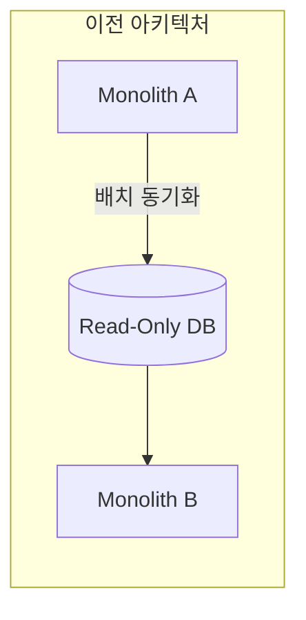
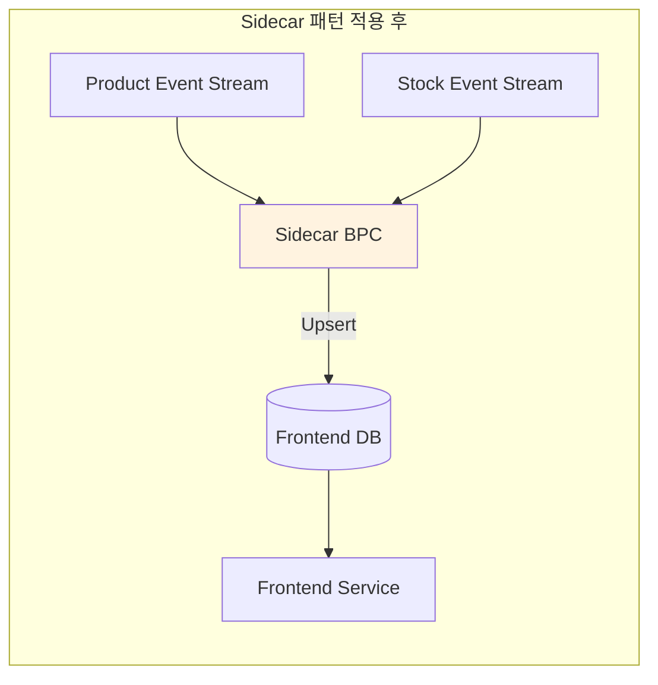
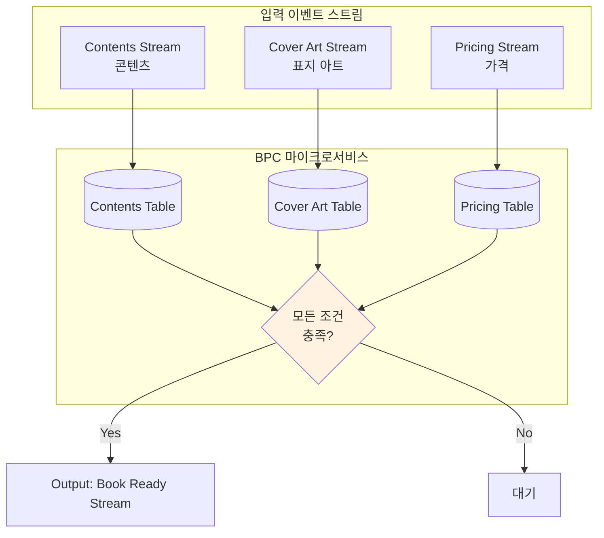
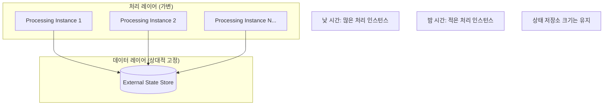
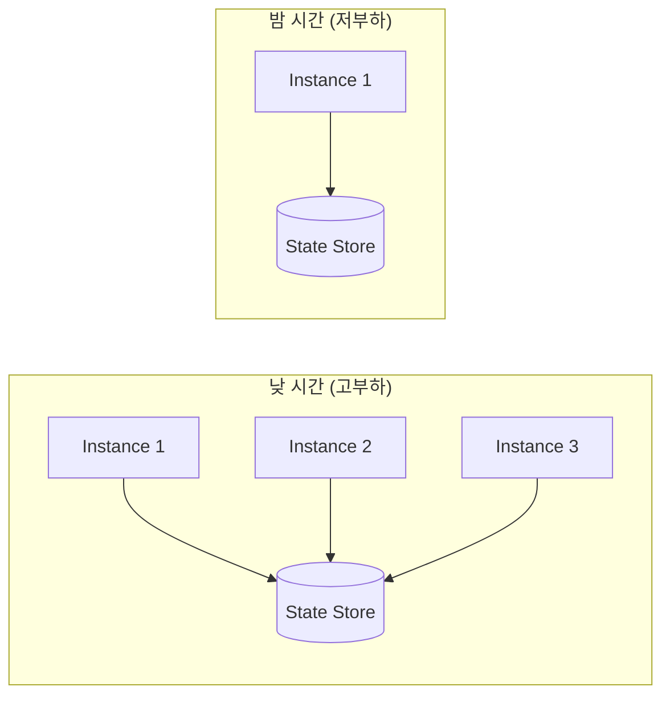
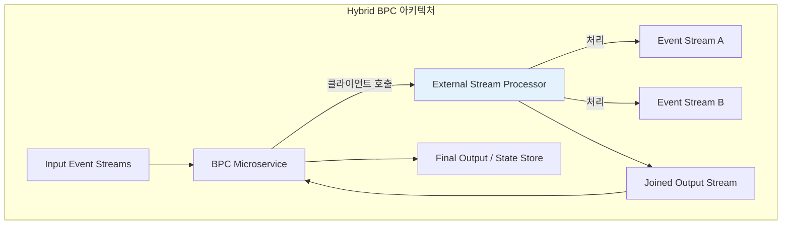
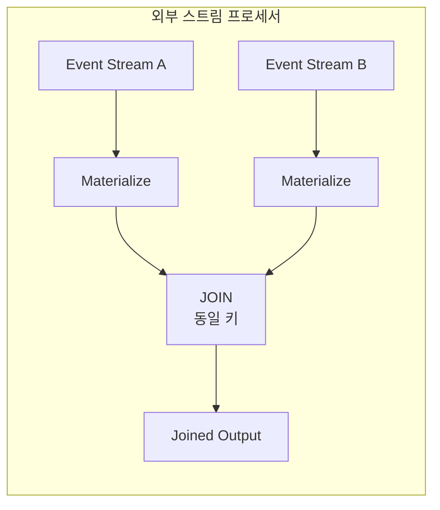
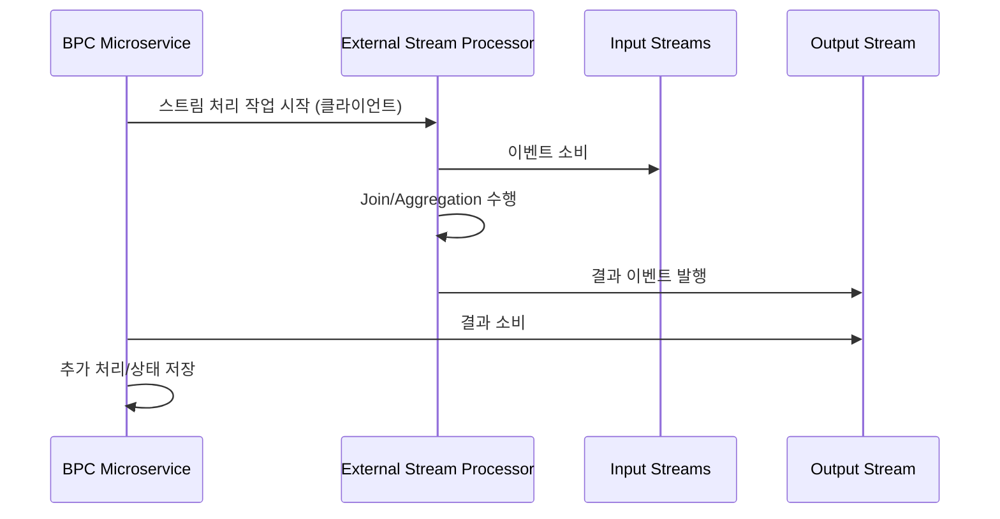
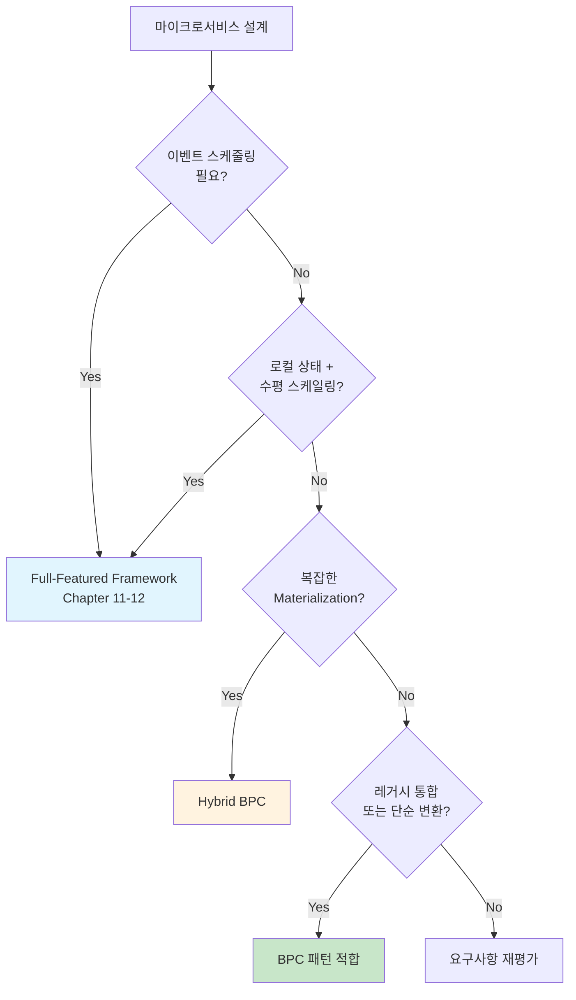
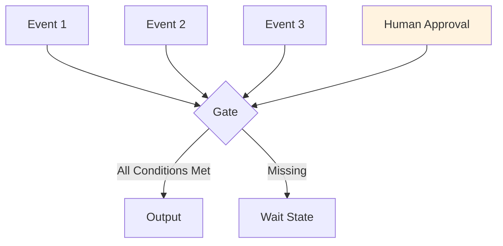

# Chapter 10. 기본 프로듀서/컨슈머 마이크로서비스 (Basic Producer and Consumer Microservices)

## 핵심 요약

**Basic Producer and Consumer (BPC)** 마이크로서비스는 하나 이상의 이벤트 스트림에서 이벤트를 수집하고, 필요한 변환이나 비즈니스 로직을 적용한 후, 출력 이벤트 스트림으로 이벤트를 발행하는 패턴이다.

**BPC의 특징**:
- 기본 Consumer/Producer 클라이언트 사용
- 이벤트 스케줄링, 워터마크, Materialization, Changelog 등 고급 기능 미포함
- 대부분의 언어에서 쉽게 사용 가능
- Bounded Context 전체 워크플로우가 단일 애플리케이션 코드에 포함

**적합한 사용 사례**:
- 레거시 시스템 통합 (Sidecar 패턴)
- 이벤트 순서에 의존하지 않는 상태 기반 로직 (Gating 패턴)
- 데이터 레이어가 비즈니스 로직 대부분을 처리하는 경우
- 처리와 데이터 레이어의 독립적 스케일링이 필요한 경우
- 외부 스트림 처리 시스템과의 하이브리드 구성

---

## 학습 목표

이 장을 학습한 후 다음을 할 수 있어야 한다:

1. **BPC 패턴의 특성과 한계** 이해하기
   - 기본 클라이언트의 기능 범위
   - 풀피처 프레임워크와의 차이

2. **BPC 적합 사례** 파악하기
   - Sidecar 패턴을 통한 레거시 통합
   - Gating 패턴을 통한 비순서 의존 상태 로직
   - 데이터 레이어 위임 패턴

3. **독립적 스케일링** 설계하기
   - 처리 레이어와 데이터 레이어 분리
   - 워크로드 변동에 따른 스케일링

4. **Hybrid BPC** 구현하기
   - 외부 스트림 처리 프레임워크 활용
   - 장점과 복잡도 트레이드오프

---

## 본문 정리

### 1. BPC 마이크로서비스 개념

#### 1.1 BPC란?

```
┌─────────────────────────────────────────────────────────────┐
│           Basic Producer and Consumer (BPC)                 │
├─────────────────────────────────────────────────────────────┤
│  Input Event Stream(s)                                      │
│         ↓                                                   │
│  ┌─────────────────────────────────────────┐                │
│  │       BPC Microservice                  │                │
│  │  • 이벤트 수집 (Consume)                 │                │
│  │  • 변환/비즈니스 로직 적용               │                │
│  │  • 이벤트 발행 (Produce)                 │                │
│  └─────────────────────────────────────────┘                │
│         ↓                                                   │
│  Output Event Stream(s)                                     │
└─────────────────────────────────────────────────────────────┘
```

#### 1.2 BPC의 특성

| 특성 | 설명 |
|------|------|
| **기본 클라이언트** | Producer/Consumer 클라이언트만 사용 |
| **언어 지원** | 대부분의 언어에서 사용 가능 |
| **단순성** | Bounded Context 전체가 단일 코드에 포함 |
| **컨테이너 친화적** | 쉽게 컨테이너화 및 배포 가능 |

#### 1.3 BPC에 **없는** 기능

```
┌─────────────────────────────────────────────────────────────┐
│                BPC에 포함되지 않는 기능                       │
├─────────────────────────────────────────────────────────────┤
│  ❌ Event Scheduling (이벤트 스케줄링)                       │
│  ❌ Watermarks (워터마크)                                    │
│  ❌ Materialization 메커니즘                                 │
│  ❌ Changelog                                                │
│  ❌ 로컬 상태 저장소를 가진 수평 스케일링                      │
├─────────────────────────────────────────────────────────────┤
│  💡 이러한 기능이 필요하면 Chapter 11, 12의                   │
│     Full-Featured Framework 사용 검토                        │
└─────────────────────────────────────────────────────────────┘
```

#### 1.4 BPC vs Full-Featured Framework

| 특성 | BPC | Full-Featured Framework |
|------|-----|------------------------|
| **복잡도** | 낮음 | 높음 |
| **이벤트 스케줄링** | ❌ | ✅ |
| **워터마크** | ❌ | ✅ |
| **로컬 상태 저장소** | ❌ (외부 사용) | ✅ |
| **수평 스케일링** | 제한적 | 자동 지원 |
| **언어 지원** | 광범위 | 제한적 |
| **학습 곡선** | 낮음 | 높음 |

---

### 2. BPC가 잘 작동하는 사례

#### 2.1 레거시 시스템 통합

레거시 시스템은 BPC 클라이언트를 코드베이스에 통합하여 이벤트 기반 아키텍처에 참여할 수 있다.





**Sidecar 패턴 장점**:
- 레거시 코드 수정 없이 이벤트 기반 기능 추가
- 거의 실시간 데이터 피드 제공
- 별도 컨테이너로 독립 배포 가능

**Sidecar 패턴 주의사항**:
- 프론트엔드 서비스의 단일 배포 단위에 포함되어야 함
- 통합 테스트 필수

#### 2.2 이벤트 순서에 의존하지 않는 상태 로직: Gating 패턴

많은 비즈니스 프로세스는 이벤트 도착 순서가 중요하지 않지만, 모든 필요한 이벤트가 결국 도착해야 한다.

**예시: 도서 출판**



**Gating 로직**:

| ISBN | Contents | Cover Art | Pricing | Status |
|------|----------|-----------|---------|--------|
| ...0010 | ✅ | ✅ | ✅ | **Published** |
| ...0011 | ✅ | ❌ (대기) | ✅ | Waiting |

```java
// Gating 패턴 의사 코드
void processEvent(Event event) {
    // 1. 이벤트를 해당 테이블에 Materialize
    materializeToTable(event);

    // 2. 다른 모든 테이블에서 관련 데이터 조회
    String isbn = event.getIsbn();
    boolean hasContents = contentsTable.exists(isbn);
    boolean hasCoverArt = coverArtTable.exists(isbn);
    boolean hasPricing = pricingTable.exists(isbn);

    // 3. 모든 조건 충족 시 출력
    if (hasContents && hasCoverArt && hasPricing) {
        Book book = composeBook(isbn);
        producer.send("book-ready-stream", book);
    }
}
```

**💡 Tip**: 인간의 명시적 승인이 필요한 경우도 Gating 패턴에 포함될 수 있다. (Approval Pattern)

#### 2.3 데이터 레이어가 대부분의 작업을 수행하는 경우

```
┌─────────────────────────────────────────────────────────────┐
│              데이터 레이어 위임 패턴                          │
├─────────────────────────────────────────────────────────────┤
│  BPC가 적합한 데이터 레이어 유형:                             │
│                                                             │
│  • Geospatial 데이터 저장소 (위치 기반 서비스)                │
│  • Free-text 검색 엔진 (Elasticsearch 등)                   │
│  • ML/AI/Neural Network 애플리케이션                        │
├─────────────────────────────────────────────────────────────┤
│  예시:                                                      │
│  • 웹 스크래핑 → ML 분류기로 제품 카테고리화                  │
│  • 사용자 행동 이벤트 → Geospatial로 근처 광고주 찾기         │
├─────────────────────────────────────────────────────────────┤
│  BPC 역할: 단순한 통합 메커니즘                               │
│  복잡한 처리: 데이터 레이어에 위임                            │
└─────────────────────────────────────────────────────────────┘
```

---

### 3. 처리와 데이터 레이어의 독립적 스케일링

#### 3.1 개념

마이크로서비스의 처리 요구와 데이터 저장 요구는 항상 선형적으로 관련되지 않는다.



#### 3.2 예시: 사용자 참여 프로필 집계

```
시나리오:
  • 사용자 행동 이벤트를 24시간 세션으로 집계
  • 집계 데이터로 인기 상품 광고 결정
  • 24시간 후 데이터 플러시 및 출력

데이터 구조:
┌──────────────────────────┬─────────────────────────┐
│ Key                      │ Value                   │
├──────────────────────────┼─────────────────────────┤
│ userId, timestamp        │ List(productId)         │
└──────────────────────────┴─────────────────────────┘
```

**시간대별 스케일링**:

| 시간대 | 처리 인스턴스 | 상태 저장소 | 설명 |
|--------|--------------|------------|------|
| **낮** | 다수 | 전체 유지 | 높은 이벤트 볼륨 처리 |
| **밤** | 최소 (1개) | 전체 유지 | 적은 이벤트, 모든 사용자 데이터 접근 필요 |



**💡 Tip**: Google, Amazon, Microsoft는 이 패턴에 적합한 읽기/쓰기당 과금 데이터 저장소를 제공한다.

---

### 4. Hybrid BPC: 외부 스트림 처리 활용

#### 4.1 개념

BPC는 외부 스트림 처리 시스템을 활용하여 로컬에서 구현하기 어려운 작업을 수행할 수 있다.



#### 4.2 예시: 외부 스트림 처리로 이벤트 스트림 Join



#### 4.3 Hybrid BPC 워크플로우



#### 4.4 Hybrid BPC 장단점

| 장점 | 단점 |
|------|------|
| 고급 스트림 처리 기능 활용 | 테스트 복잡도 증가 |
| 언어 특정 기능/라이브러리 유지 | 디버깅 어려움 |
| 대규모 Join/Aggregation 가능 | 이동 부품 증가 |
| SQL 기반 스트림 처리 활용 (KSQL 등) | Bounded Context 관리 복잡 |

**⚠️ 주의**: BPC가 종료되면 외부 스트림 처리 인스턴스도 함께 종료해야 한다. (Ghost 프로세스 방지)

---

### 5. BPC 패턴 적합성 평가

#### 5.1 BPC 적합 체크리스트

```
✅ BPC가 적합한 경우:

□ Stateless 변환만 필요
□ 이벤트 순서가 중요하지 않은 상태 로직
□ 데이터 레이어가 비즈니스 로직 대부분 처리
□ 레거시 시스템 통합 (Sidecar)
□ 독립적인 처리/데이터 스케일링 필요
□ 특정 언어 기능/라이브러리 필수
□ 단순한 구현 선호
```

```
❌ BPC가 부적합한 경우:

□ 이벤트 스케줄링 필요
□ 워터마크 기반 처리 필요
□ 로컬 상태 저장소와 수평 스케일링 필요
□ 복잡한 Materialization 필요
□ Changelog 기반 복구 필요
```

#### 5.2 결정 트리



---

## 심화 학습

### 1. 외부 상태 저장소 선택

BPC에서는 외부 상태 저장소 사용이 일반적:

| 저장소 유형 | 사용 사례 | 특징 |
|------------|----------|------|
| **Redis** | 캐싱, 세션, 실시간 집계 | 고속, 메모리 기반 |
| **DynamoDB** | 키-값 조회, 고가용성 | 읽기/쓰기당 과금 |
| **Elasticsearch** | 전문 검색, 로그 분석 | 검색 최적화 |
| **PostgreSQL** | 관계형 데이터, 트랜잭션 | ACID 보장 |
| **MongoDB** | 문서 기반, 유연한 스키마 | 수평 확장 용이 |

### 2. Sidecar 패턴 구현 고려사항

```
┌─────────────────────────────────────────────────────────────┐
│               Sidecar 구현 체크리스트                        │
├─────────────────────────────────────────────────────────────┤
│  □ 메인 서비스와 동일 Pod/배포 단위에 포함                    │
│  □ 독립적인 헬스 체크 구현                                   │
│  □ 메인 서비스와의 통신 인터페이스 정의                       │
│  □ 리소스 제한 설정 (CPU, Memory)                           │
│  □ 로깅 및 모니터링 통합                                    │
│  □ 장애 시 메인 서비스에 영향 최소화                         │
│  □ 통합 테스트 포함                                         │
└─────────────────────────────────────────────────────────────┘
```

### 3. Gating 패턴 확장

**Approval Pattern** (인간 승인 포함):



```java
// Approval Pattern 예시
void checkReadiness(String entityId) {
    boolean hasData = dataTable.exists(entityId);
    boolean hasApproval = approvalTable.exists(entityId);
    boolean hasReview = reviewTable.exists(entityId);

    // 인간 승인도 하나의 게이팅 조건
    if (hasData && hasApproval && hasReview) {
        publishToOutput(entityId);
    }
}
```

---

## 실무 적용 포인트

### 1. BPC 구현 시 고려사항

```
1. Consumer Group 설정:
   • 각 BPC 마이크로서비스에 독립 Consumer Group
   • 파티션 할당 전략 선택

2. 오류 처리:
   • 재시도 정책 정의
   • Dead Letter Queue 구성
   • 장애 알림 설정

3. 모니터링:
   • Consumer Lag 모니터링
   • 처리 지연 시간 추적
   • 오류율 추적

4. 스케일링:
   • 파티션 수 = 최대 병렬도
   • 외부 상태 저장소 용량 계획
```

### 2. Hybrid BPC 운영 가이드

```
┌─────────────────────────────────────────────────────────────┐
│                 Hybrid BPC 운영 체크리스트                   │
├─────────────────────────────────────────────────────────────┤
│  배포:                                                      │
│    □ BPC와 외부 스트림 프로세서 배포 동기화                   │
│    □ 롤백 계획 수립                                         │
│    □ 버전 호환성 확인                                       │
│                                                             │
│  모니터링:                                                   │
│    □ 양쪽 시스템 모두 모니터링                               │
│    □ 중간 이벤트 스트림 Lag 추적                             │
│    □ 처리 시간 End-to-End 추적                              │
│                                                             │
│  종료:                                                       │
│    □ BPC 종료 시 외부 프로세서도 종료                        │
│    □ Ghost 프로세스 방지 메커니즘                            │
└─────────────────────────────────────────────────────────────┘
```

### 3. 레거시 통합 전략

```
1단계: 평가
  • 레거시 코드 수정 가능 여부 확인
  • Sidecar 패턴 필요 여부 결정
  • 데이터 동기화 요구사항 파악

2단계: 구현
  • BPC/Sidecar 개발
  • 이벤트 스키마 정의
  • 통합 테스트 작성

3단계: 배포
  • 점진적 롤아웃
  • 기존 배치 동기화와 병행 운영
  • 성능 비교 및 검증

4단계: 전환
  • 배치 동기화 제거
  • 모니터링 완성
  • 운영 문서화
```

---

## 체크리스트

### BPC 구현 체크리스트

- [ ] 비즈니스 요구사항이 BPC에 적합한지 확인
- [ ] 상태 저장소 선택 (외부 권장)
- [ ] Consumer Group 독립 설정
- [ ] 오류 처리 및 재시도 정책 정의
- [ ] 모니터링 및 알림 구성

### Sidecar 패턴 체크리스트

- [ ] 메인 서비스와 동일 배포 단위
- [ ] 독립 헬스 체크 구현
- [ ] 리소스 제한 설정
- [ ] 통합 테스트 작성
- [ ] 장애 격리 확인

### Gating 패턴 체크리스트

- [ ] 모든 게이팅 조건 정의
- [ ] 각 이벤트 스트림 Materialize
- [ ] 조건 충족 시 출력 로직
- [ ] 부분 상태 조회 최적화
- [ ] 타임아웃 처리 (필요 시)

### Hybrid BPC 체크리스트

- [ ] 외부 스트림 프로세서 선택
- [ ] 클라이언트 호환성 확인
- [ ] 배포 동기화 전략
- [ ] 종료 시 정리 로직
- [ ] End-to-End 테스트

---

## 참고 자료

### 관련 패턴

| 패턴 | 설명 | 관련 장 |
|------|------|---------|
| Sidecar | 레거시 시스템에 기능 추가 | 본 장 |
| Gating | 모든 조건 충족 시 진행 | 본 장 |
| Event Sourcing | 이벤트로 상태 재구성 | Chapter 7 |
| Lightweight Framework | 경량 스트림 처리 | Chapter 11 |
| Heavyweight Framework | 중량 스트림 처리 | Chapter 12 |

### 다음 장 미리보기

| 장 | 주제 | BPC와의 차이 |
|----|------|-------------|
| **Chapter 11** | Lightweight Framework | 이벤트 스케줄링, 로컬 상태 지원 |
| **Chapter 12** | Heavyweight Framework | 클러스터 기반 대규모 처리 |
| **Chapter 13** | Request-Response 통합 | 동기식 API 호출 통합 |

---

## 핵심 용어 정리

| 용어 | 정의 |
|------|------|
| **BPC** | Basic Producer and Consumer, 기본 생산자/소비자 패턴 |
| **Sidecar Pattern** | 메인 서비스에 영향 없이 기능을 추가하는 패턴 |
| **Gating Pattern** | 모든 필요 조건이 충족될 때까지 대기하는 패턴 |
| **Hybrid BPC** | 외부 스트림 처리 시스템과 결합한 BPC |
| **External State Store** | BPC에서 사용하는 외부 상태 저장소 |
| **Approval Pattern** | 인간 승인을 포함한 Gating 패턴 |
| **Ghost Process** | 종료되지 않고 남아있는 외부 프로세스 |
| **Consumer Group** | 병렬 소비를 위한 소비자 그룹 |
| **Partition Assignor** | 파티션 할당을 관리하는 컴포넌트 |
