# Chapter 11. 헤비웨이트 프레임워크 마이크로서비스 (Heavyweight Framework Microservices)

## 핵심 요약

**헤비웨이트 프레임워크(Heavyweight Framework)**는 이벤트 기반 처리에서 가장 일반적으로 사용되는 풀피처 프레임워크이다. Apache Spark, Flink, Storm, Heron, Beam 등이 대표적이다.

**두 가지 핵심 특성**:
1. **독립 클러스터 필요**: 처리 리소스를 위한 별도의 클러스터 (Master Nodes + Worker Nodes + Zookeeper)
2. **자체 내부 메커니즘**: 장애 복구, 리소스 할당, 태스크 분배, 데이터 저장, 통신, 조율 등을 자체적으로 처리

**"Heavyweight"라 불리는 이유**:
- 이벤트 브로커와 CMS 외에 추가 클러스터 관리 필요
- 운영 오버헤드 증가

**주요 용도**:
- ETL (추출, 변환, 적재)
- 세션/윈도우 기반 분석
- 이상 패턴 감지
- 스트림 집계 및 상태 유지
- 대규모 실시간 데이터 처리

---

## 학습 목표

이 장을 학습한 후 다음을 할 수 있어야 한다:

1. **헤비웨이트 프레임워크 특성** 이해하기
   - 독립 클러스터 아키텍처
   - Lightweight/FaaS/BPC와의 차이점

2. **클러스터 설정 옵션** 파악하기
   - 호스팅 서비스, 독립 클러스터, CMS 통합
   - Driver 모드 vs Cluster 모드

3. **상태 관리 및 체크포인트** 구현하기
   - Operator State vs Key State
   - 체크포인트 기반 복구

4. **스케일링 전략** 적용하기
   - 실행 중 스케일링 vs 재시작 스케일링
   - 오토스케일링 메커니즘

5. **프레임워크 선택 기준** 평가하기
   - 운영 오버헤드, 기능, 인기도

---

## 본문 정리

### 1. 헤비웨이트 프레임워크 개념

#### 1.1 정의 및 특성

```
┌─────────────────────────────────────────────────────────────┐
│              Heavyweight Framework 핵심 특성                 │
├─────────────────────────────────────────────────────────────┤
│  1. 독립 클러스터 필요                                       │
│     • 전용 Master Node + Worker Node                        │
│     • Apache Zookeeper (고가용성 지원)                       │
│     • 이벤트 브로커, CMS와 별도 운영                         │
├─────────────────────────────────────────────────────────────┤
│  2. 자체 내부 메커니즘                                       │
│     • 장애 처리 및 복구                                      │
│     • 리소스 할당 및 태스크 분배                              │
│     • 데이터 저장 및 통신                                    │
│     • 처리 인스턴스 간 조율                                  │
├─────────────────────────────────────────────────────────────┤
│  💡 CMS와 이벤트 브로커의 기능을 하나로 통합한 솔루션          │
└─────────────────────────────────────────────────────────────┘
```

#### 1.2 대표 프레임워크

| 프레임워크 | 특징 | 배치/스트리밍 |
|-----------|------|---------------|
| **Apache Spark** | 가장 인기, 범용 | 배치 + 스트리밍 |
| **Apache Flink** | 실시간 스트리밍 특화 | 배치 + 스트리밍 |
| **Apache Storm** | 순수 스트리밍 | 스트리밍만 |
| **Apache Heron** | Storm 개선판 | 스트리밍만 |
| **Apache Beam** | 통합 API 모델 | 배치 + 스트리밍 |

#### 1.3 역사적 배경

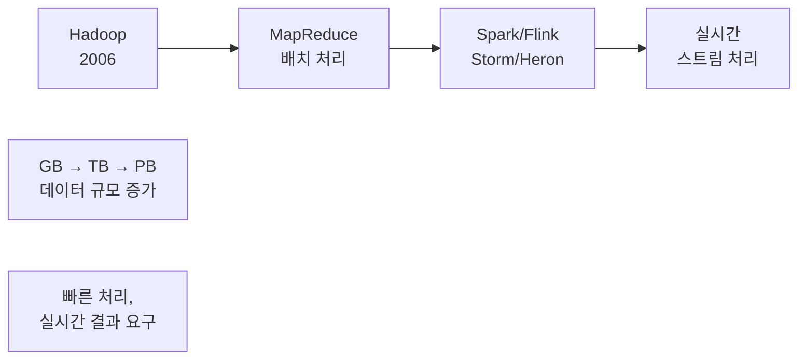

---

### 2. 내부 구조

#### 2.1 클러스터 아키텍처

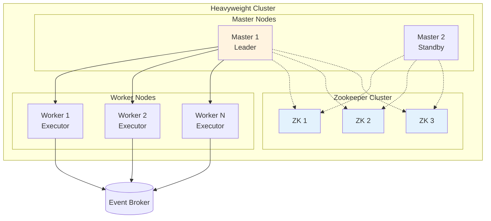

#### 2.2 역할 구분

| 역할 | 설명 |
|------|------|
| **Master Node** | 작업 우선순위, 할당, 관리 |
| **Worker Node (Executor)** | 실제 태스크 실행 |
| **Zookeeper** | 분산 조율, 리더 선출, 고가용성 |
| **Task Manager** | 태스크 모니터링, 실패 시 재시작 |

#### 2.3 Job 제출 흐름

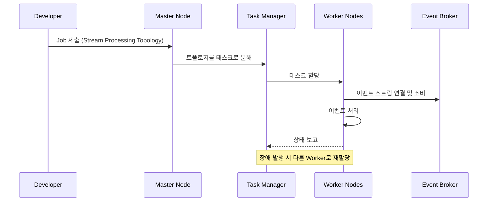

---

### 3. 장점과 한계

#### 3.1 장점

```
✅ 장점:

• 대규모 실시간 데이터 처리 최적화
• 성숙한 기술, 활발한 커뮤니티
• 다양한 분석 패턴 지원
  - ETL
  - 세션/윈도우 분석
  - 이상 패턴 감지
  - 스트림 집계
  - Stateless 스트리밍
```

#### 3.2 한계

```
⚠️ 한계:

1. 마이크로서비스 배포에 최적화되지 않음
   • 전용 리소스 클러스터 필요
   • 대규모 애플리케이션 관리 복잡

2. 언어 제한
   • 주로 JVM 기반 (Java, Scala)
   • Python 지원하지만 제한적

3. Entity Stream → Table Materialization
   • 모든 프레임워크에서 기본 지원 X
   • Table-Table Join, Stream-Table Join 제한
   • Gating 패턴 구현 어려움

4. 문서화 편향
   • 시계열 분석, 시간 기반 집계에 집중
   • 무한 윈도우(Global Window) 기능 문서 부족
```

---

### 4. 클러스터 설정 옵션

#### 4.1 옵션 비교

| 옵션 | 설명 | 장점 | 단점 |
|------|------|------|------|
| **호스팅 서비스** | 클라우드 제공자 관리 | 운영 오버헤드 최소 | 비용 높음, 기능 제한 |
| **독립 클러스터** | 자체 클러스터 구축 | 완전한 제어 | 운영 복잡 |
| **CMS 통합** | Kubernetes와 통합 | 기존 인프라 활용 | 일부 기능 제한 |

#### 4.2 CMS 통합 방식

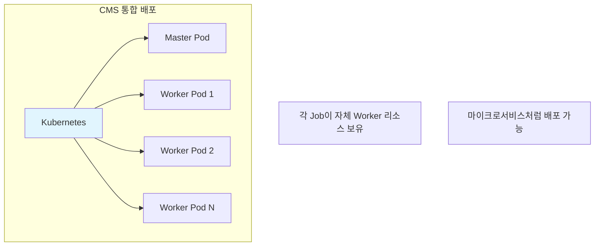

**CMS 통합 장점**:
- CMS 리소스 획득 모델 활용
- Job 간 완전 격리
- 다른 프레임워크/버전 사용 가능
- 마이크로서비스와 동일한 배포 프로세스

**CMS 통합 단점**:
- 모든 프레임워크에서 지원 X
- 모든 CMS에서 통합 X
- 자동 스케일링 등 일부 기능 미지원

---

### 5. 애플리케이션 제출 모드

#### 5.1 Driver 모드

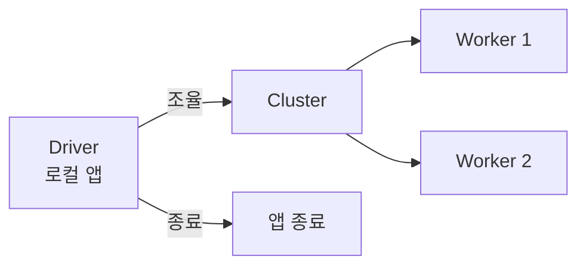

**특징**:
- Spark, Flink 지원
- 로컬 독립 애플리케이션이 클러스터 조율
- Driver 종료 → 애플리케이션 종료
- CMS로 Driver를 마이크로서비스처럼 배포 가능

#### 5.2 Cluster 모드

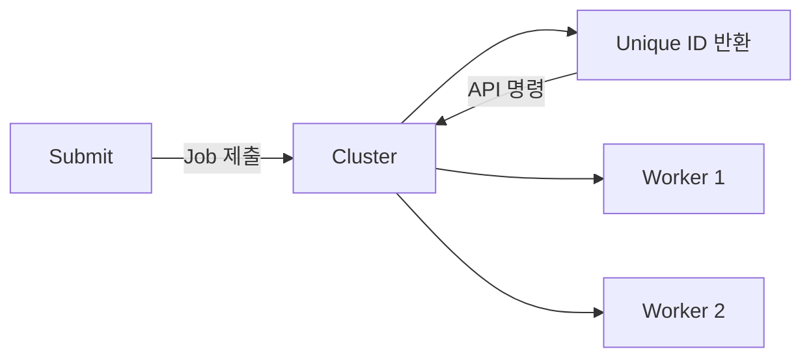

**특징**:
- Spark, Flink, Storm, Heron 지원
- 전체 애플리케이션이 클러스터에 제출
- 고유 ID로 애플리케이션 제어
- 마이크로서비스 배포 파이프라인과 맞지 않을 수 있음

---

### 6. 상태 관리 및 체크포인트

#### 6.1 상태 저장 방식

```
┌─────────────────────────────────────────────────────────────┐
│                    상태 저장 전략                            │
├─────────────────────────────────────────────────────────────┤
│  Internal State (선호):                                     │
│    • 메모리에 저장 → 빠른 접근                               │
│    • 디스크로 Spill (데이터 내구성)                          │
│    • 메모리 초과 시 디스크 사용                              │
│                                                             │
│  위험 요소:                                                  │
│    • 디스크 장애 → 상태 손실                                 │
│    • 노드 장애 → 상태 손실                                   │
│    • CMS의 공격적 스케일링 → 일시적 중단                     │
│                                                             │
│  💡 성능 이점이 위험보다 크며, 체크포인트로 완화 가능          │
└─────────────────────────────────────────────────────────────┘
```

#### 6.2 체크포인트 (Checkpoint)

체크포인트는 애플리케이션의 현재 내부 상태 스냅샷으로, 스케일링이나 노드 장애 후 상태 복구에 사용된다.

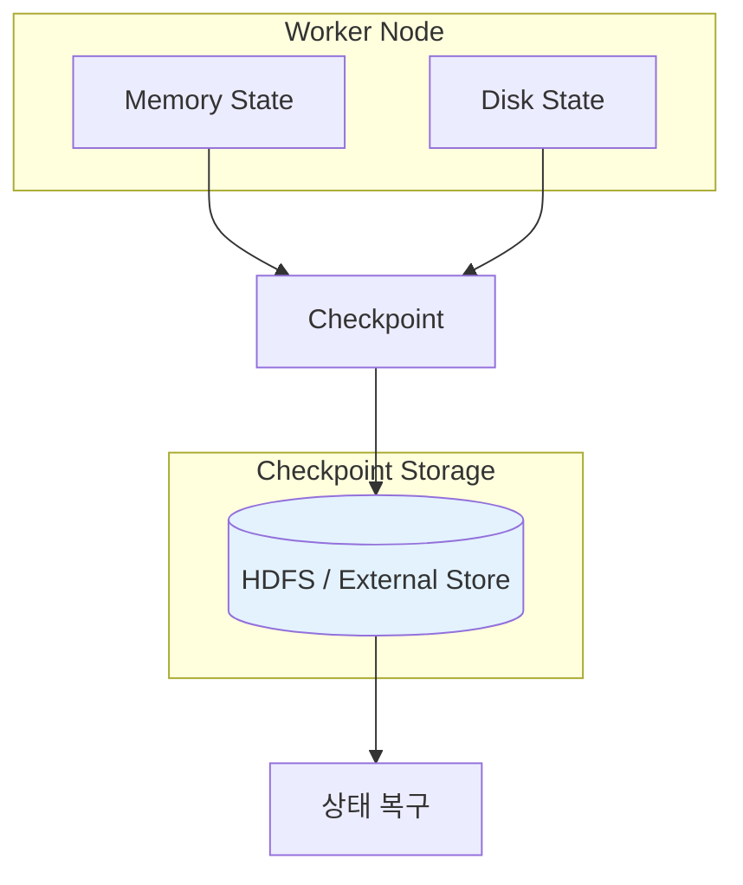

#### 6.3 체크포인트에 저장되는 상태

| 상태 유형 | 설명 | 예시 |
|----------|------|------|
| **Operator State** | `<partitionId, offset>` 쌍 | 소비자 오프셋 |
| **Key State** | `<key, state>` 쌍 | 집계, 윈도우, 조인 상태 |

```
┌─────────────────────────────────────────────────────────────┐
│                    체크포인트 예시                           │
├─────────────────────────────────────────────────────────────┤
│  Operator State:                                            │
│    Partition 0: offset 1000                                 │
│    Partition 1: offset 850                                  │
│                                                             │
│  Key State:                                                 │
│    user_123: { count: 5, sum: 150 }                        │
│    user_456: { count: 3, sum: 75 }                         │
├─────────────────────────────────────────────────────────────┤
│  ⚠️ 중요: Operator State와 Key State가 동기화되어야 함       │
│     → 이벤트 누락 또는 중복 처리 방지                        │
└─────────────────────────────────────────────────────────────┘
```

---

### 7. 스케일링

#### 7.1 스케일링 제약

최대 병렬 처리는 Chapter 5에서 다룬 것처럼 **가장 낮은 파티션 수를 가진 입력 스트림**에 제한된다.

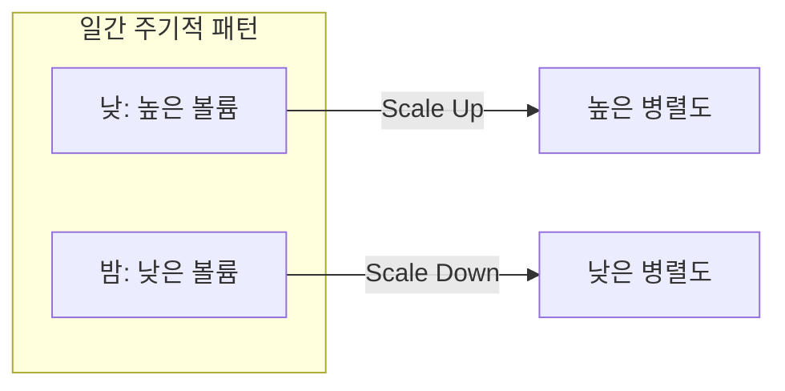

#### 7.2 스케일링 전략

##### 전략 1: 실행 중 스케일링

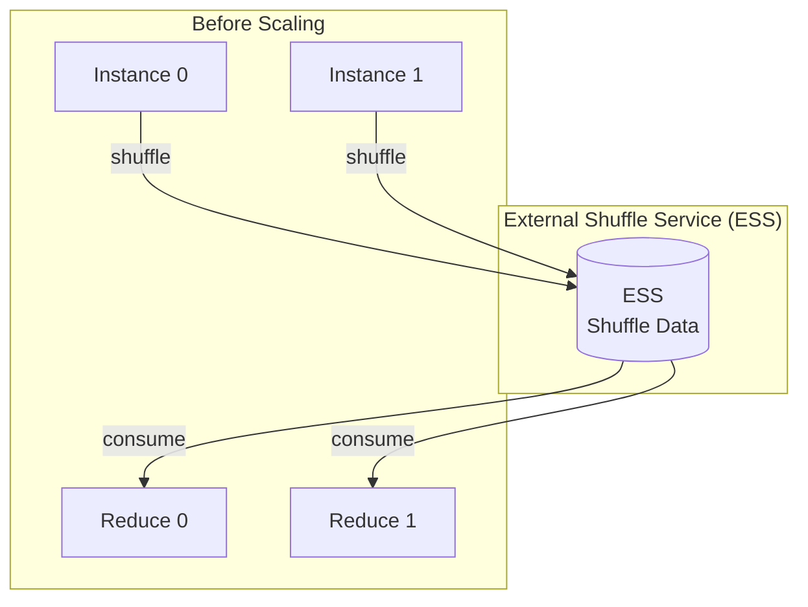

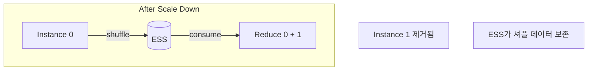

**지원 프레임워크**:
- Spark: Dynamic Resource Allocation + ESS
- Google Dataflow: 자동 스케일링
- Heron: Health Manager (실험적)

##### 전략 2: 재시작 스케일링

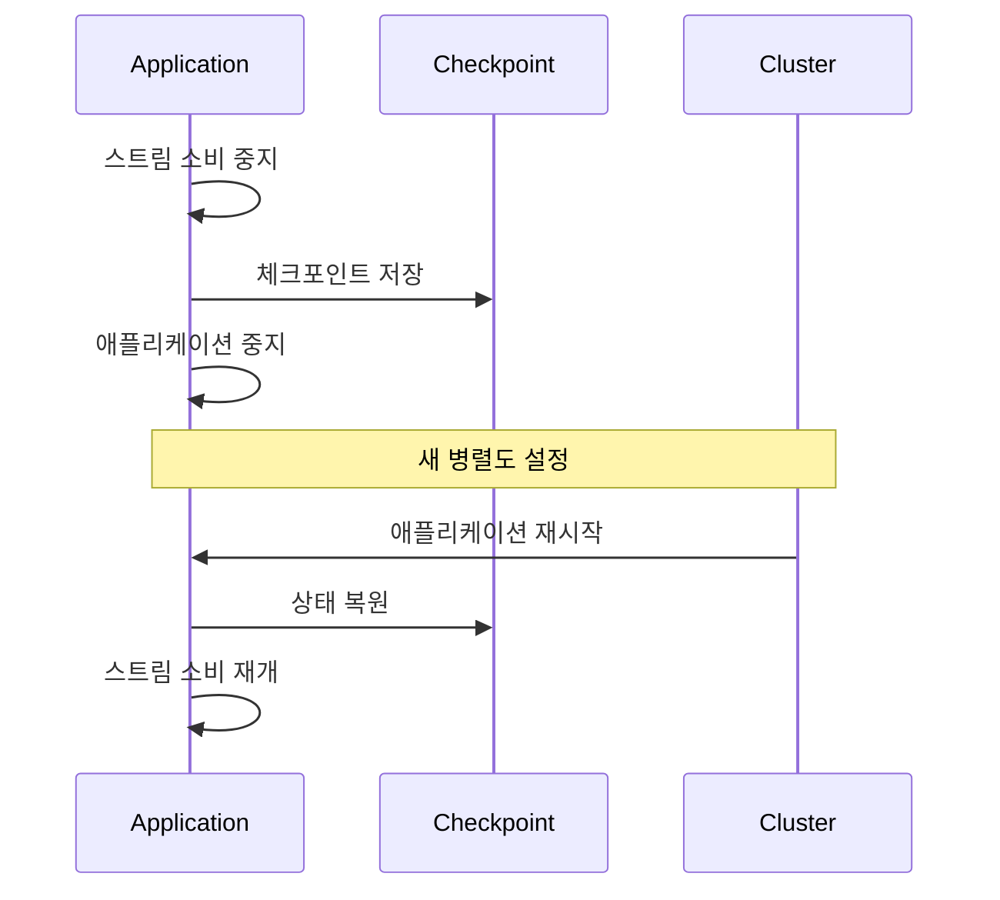

**지원**: 모든 헤비웨이트 프레임워크

#### 7.3 오토스케일링

```
오토스케일링 메트릭:
  • 처리 지연 시간
  • Consumer Lag
  • 메모리 사용량
  • CPU 사용량

내장 오토스케일링:
  • Google Dataflow
  • Heron Health Manager
  • Spark Streaming Dynamic Allocation

외부 연동:
  • Lag Monitor 도구 연결
  • 프레임워크 스케일링 API 호출
```

---

### 8. 장애 복구

#### 8.1 장애 유형별 처리

| 장애 유형 | 처리 방식 |
|----------|----------|
| **Worker Node 장애** | 태스크를 다른 Worker로 이동, 체크포인트에서 상태 복원 |
| **Master Node 장애** | Standby Master 승격 (Zookeeper), 새 Job 배포 불가 가능 |
| **Zookeeper Node 장애** | 쿼럼 유지 시 계속 운영, 쿼럼 손실 시 클러스터 문제 |

```
💡 모니터링 및 알림 필수

• Master/Worker 노드 상태 모니터링
• 단일 노드 장애로 처리 중단되지 않지만
• 성능 저하 및 연속 장애 대응 불가 위험
```

---

### 9. 멀티테넌시 고려사항

#### 9.1 문제점

```
⚠️ 멀티테넌시 문제:

• 리소스 획득 우선순위 경쟁
• 새 애플리케이션이 대부분의 리소스 점유 가능
• 기존 애플리케이션 SLO 미달 위험
```

#### 9.2 해결 방법

| 방법 | 설명 | 장점 | 단점 |
|------|------|------|------|
| **다중 소규모 클러스터** | 팀/비즈니스 단위별 별도 클러스터 | 완전 격리 | 오버헤드 증가, 비용 증가 |
| **네임스페이스** | 단일 클러스터 내 리소스 할당 분리 | 리소스 공유 가능 | 예비 리소스 분산, 비효율 |

---

### 10. 언어 및 문법

#### 10.1 지원 언어

| 언어 | 지원 수준 | 비고 |
|------|----------|------|
| **Java** | 최고 | 모든 프레임워크 |
| **Scala** | 높음 | 대부분 프레임워크 |
| **Python** | 중간 | 데이터 과학자용 |
| **SQL** | 증가 중 | 인지 부담 감소 |

#### 10.2 API 스타일

```java
// MapReduce 스타일 API (Flink 예시)
clickStream
  .union(viewStream)
  .keyBy(<key selector>)
  .window(EventTimeSessionWindows.withGap(Time.minutes(30)))
  .aggregate(<aggregator function>)
  .addSink(<producer to output stream>)
```

---

### 11. 예제: 클릭 및 뷰 세션 윈도우

#### 11.1 시나리오

온라인 광고 회사에서 사용자 광고 뷰와 클릭을 30분 세션으로 집계

**입력 스트림**:

| Key | Value | Timestamp |
|-----|-------|-----------|
| userId (String) | advertisementId (Long) | createdEventTime (Long) |

**출력 스트림**:

| Key | Value |
|-----|-------|
| `<Window, userId>` | `Action[]` (순차적 사용자 액션) |

#### 11.2 처리 토폴로지

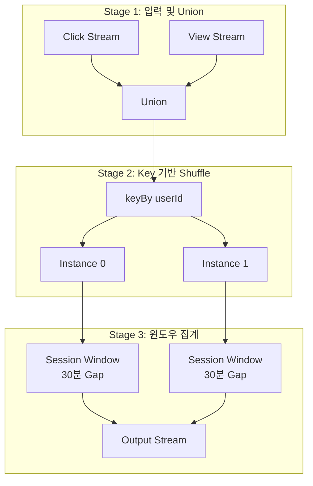

#### 11.3 Flink 코드

```java
DataStream clickStream = ...  // 클릭 이벤트 스트림
DataStream viewStream = ...   // 뷰 이벤트 스트림

clickStream
  .union(viewStream)                                    // 스트림 병합
  .keyBy(<key selector>)                                // userId로 그룹화
  .window(EventTimeSessionWindows.withGap(Time.minutes(30)))  // 30분 세션
  .aggregate(<aggregator function>)                     // 집계
  .addSink(<producer to output stream>)                 // 출력
```

#### 11.4 스케일링 시 동작

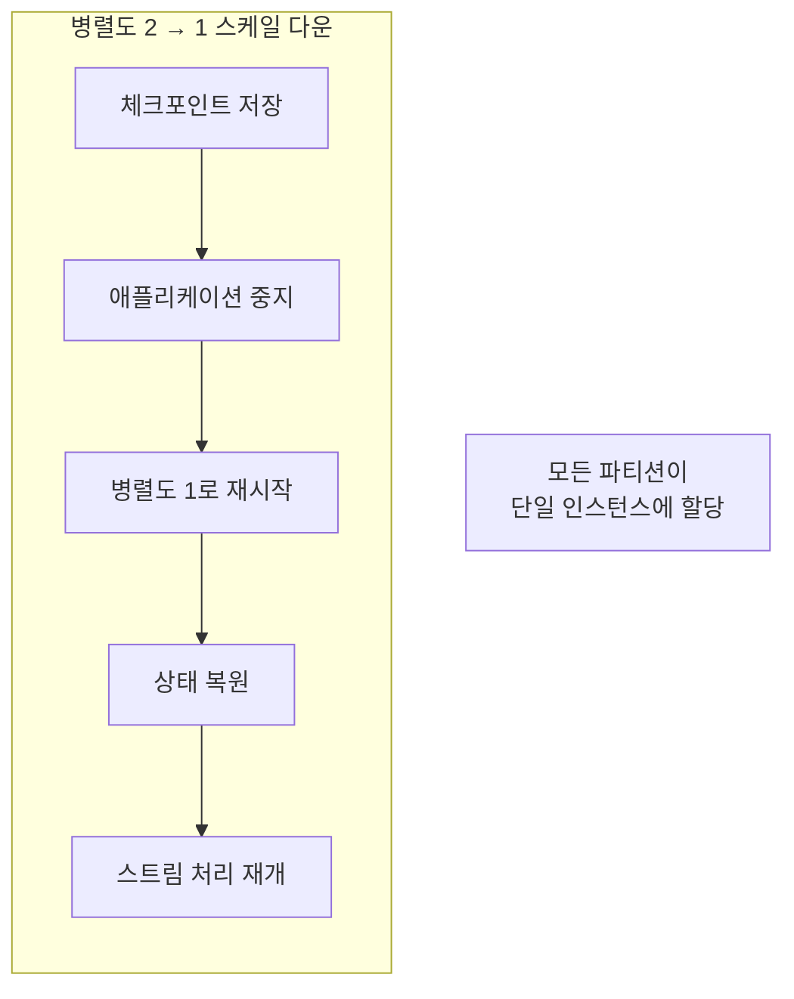

---

## 심화 학습

### 1. 프레임워크 선택 가이드

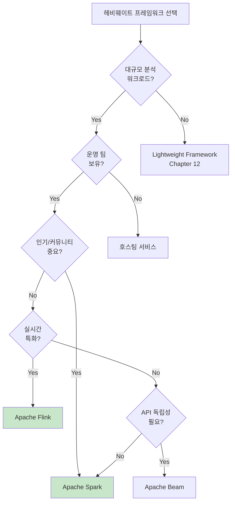

### 2. Spark 3.0 동적 스케일링

```
Spark 3.0의 새로운 기능:

• ESS 없이 동적 인스턴스 스케일링
• 셔플 파일 생성 스테이지 추적
• 다운스트림 작업이 활성화된 동안 소스 유지
• 셔플 파일 불필요 시 자동 정리
• Kubernetes와 더 나은 통합
```

### 3. Global Window 활용

대부분의 문서가 시간 기반 윈도우에 집중하지만, **Global Window**를 사용하면 이벤트 스트림의 무한 Materialization이 가능:

```java
// Global Window 예시
stream
  .keyBy(event -> event.getKey())
  .window(GlobalWindows.create())
  .trigger(ContinuousEventTimeTrigger.of(Time.seconds(1)))
  .process(new CustomJoinFunction())
```

---

## 실무 적용 포인트

### 1. 헤비웨이트 도입 전 체크리스트

```
□ 워크로드가 대규모 분석에 적합한가?
□ 운영 팀의 역량이 충분한가?
□ 클러스터 관리 오버헤드를 감당할 수 있는가?
□ JVM 언어 제약이 문제되지 않는가?
□ 마이크로서비스 배포 전략과 호환되는가?
```

### 2. 클러스터 운영 가이드

```
모니터링:
  • Master/Worker/Zookeeper 노드 상태
  • 리소스 사용률 (CPU, Memory, Disk)
  • Job 성능 메트릭
  • Consumer Lag

알림 설정:
  • 노드 장애
  • 리소스 고갈
  • Job 실패/지연
  • 체크포인트 실패
```

### 3. 마이크로서비스 통합 전략

```
권장 접근법:

1. CMS 통합 배포 활용 (Kubernetes + Spark/Flink)
2. Driver 모드로 마이크로서비스처럼 배포
3. 각 Job을 독립 리소스로 격리
4. 체크포인트를 외부 저장소에 보관
5. 모니터링을 기존 마이크로서비스와 통합
```

---

## 체크리스트

### 클러스터 설정 체크리스트

- [ ] 배포 방식 결정 (호스팅/독립/CMS 통합)
- [ ] Master Node 고가용성 구성
- [ ] Worker Node 리소스 계획
- [ ] Zookeeper 클러스터 구성 (필요 시)
- [ ] 모니터링 및 알림 설정

### 애플리케이션 개발 체크리스트

- [ ] 제출 모드 선택 (Driver/Cluster)
- [ ] 체크포인트 저장소 구성
- [ ] 상태 관리 전략 정의
- [ ] 스케일링 정책 설정
- [ ] 장애 복구 테스트

### 운영 체크리스트

- [ ] 멀티테넌시 전략 수립
- [ ] 리소스 할당 정책 정의
- [ ] 오토스케일링 구성 (가능 시)
- [ ] 정기 체크포인트 검증
- [ ] 비상 복구 절차 문서화

---

## 참고 자료

### 프레임워크별 문서

| 프레임워크 | 주요 참고 문서 |
|-----------|---------------|
| **Spark** | Spark Structured Streaming, Dynamic Allocation |
| **Flink** | Flink Checkpointing, Session Windows |
| **Storm** | Storm Topology, Trident |
| **Heron** | Heron Architecture, Health Manager |
| **Beam** | Beam Model, Runners |

### 관련 장

| 장 | 주제 | 관계 |
|----|------|------|
| Chapter 5 | 이벤트 기반 처리 기초 | 병렬 처리 제약 |
| Chapter 6 | 결정적 스트림 처리 | 윈도우, 워터마크 |
| Chapter 7 | 상태 기반 스트리밍 | 상태 저장소, 체크포인트 |
| Chapter 12 | Lightweight Framework | 헤비웨이트와 비교 |

---

## 핵심 용어 정리

| 용어 | 정의 |
|------|------|
| **Heavyweight Framework** | 독립 클러스터가 필요한 풀피처 스트림 처리 프레임워크 |
| **Master Node** | 작업 스케줄링 및 관리 담당 노드 |
| **Worker Node (Executor)** | 실제 태스크 실행 노드 |
| **Zookeeper** | 분산 조율 및 리더 선출 서비스 |
| **Checkpoint** | 애플리케이션 상태 스냅샷 |
| **Operator State** | 파티션-오프셋 쌍 |
| **Key State** | 키-상태 쌍 (집계, 윈도우 등) |
| **Driver Mode** | 로컬 애플리케이션이 클러스터 조율 |
| **Cluster Mode** | 전체 애플리케이션이 클러스터에 제출 |
| **External Shuffle Service** | 셔플 데이터 격리 서비스 |
| **Session Window** | 비활동 간격 기반 윈도우 |
| **Global Window** | 무한 Materialization을 위한 윈도우 |
