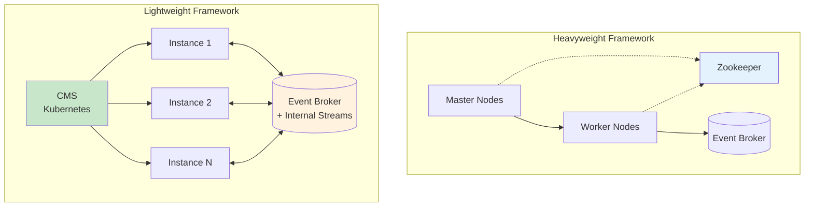
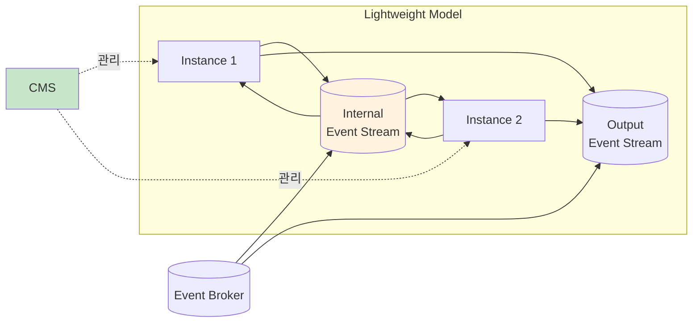
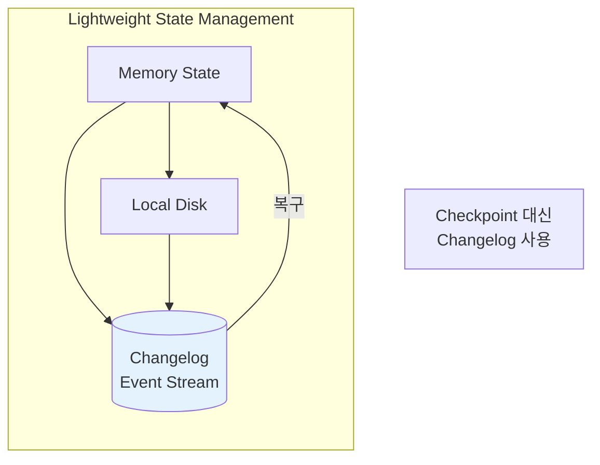
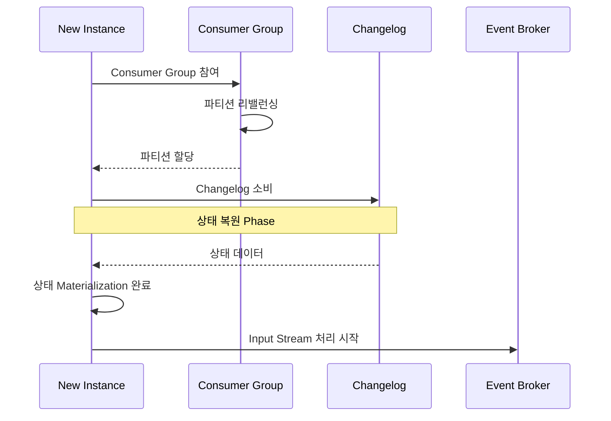
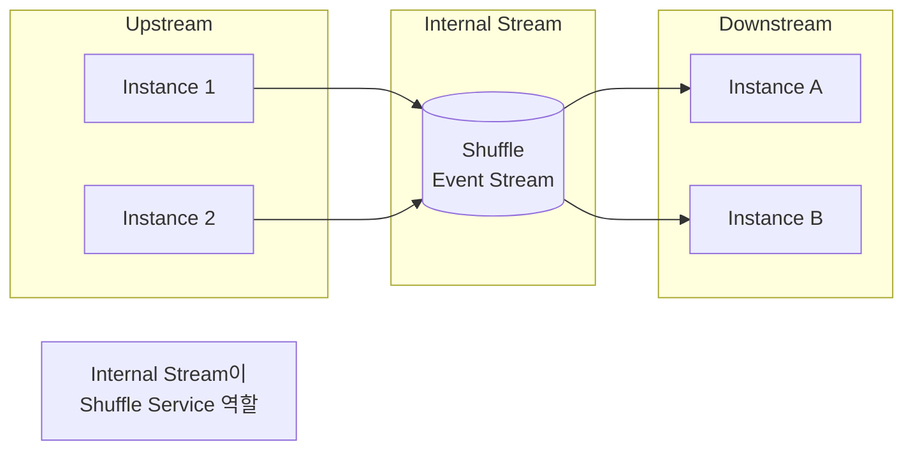
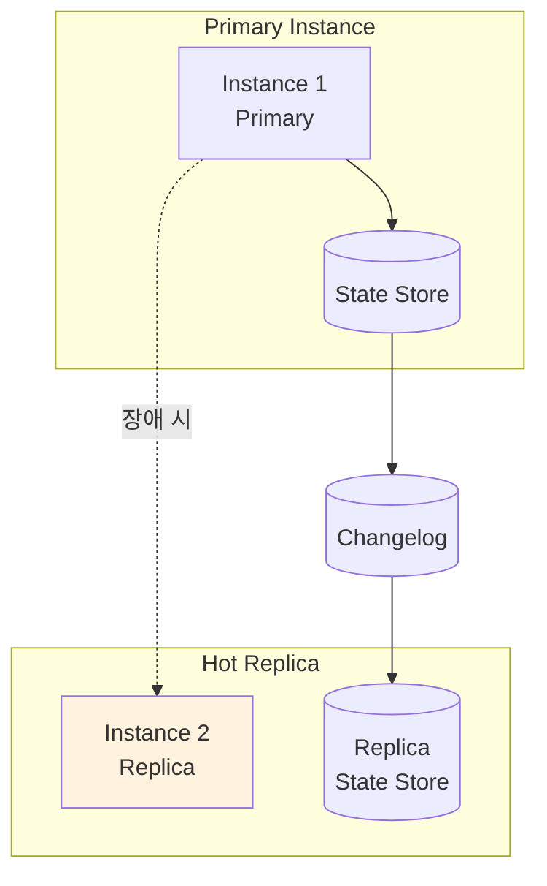
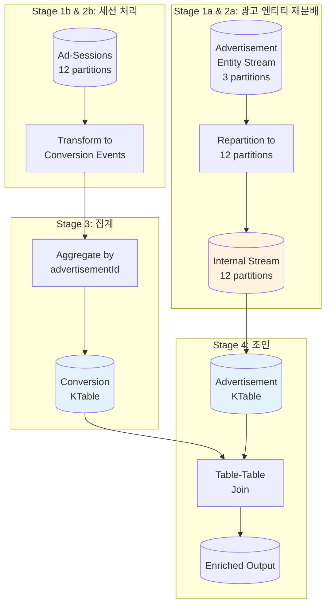
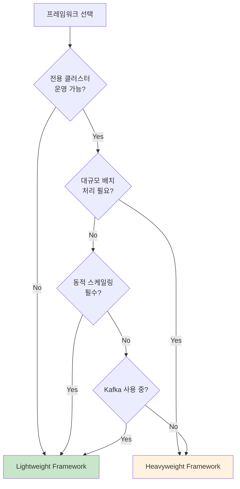

# Chapter 12. 라이트웨이트 프레임워크 마이크로서비스 (Lightweight Framework Microservices)

## 핵심 요약

**라이트웨이트 프레임워크(Lightweight Framework)**는 헤비웨이트 프레임워크와 유사한 기능을 제공하지만, **이벤트 브로커**와 **컨테이너 관리 시스템(CMS)**에 크게 의존하는 방식으로 동작한다.

**핵심 차이점 (vs Heavyweight)**:
- **전용 클러스터 불필요**: 프레임워크 전용 리소스 클러스터가 없음
- **Event Broker + CMS 활용**: 수평 확장, 상태 관리, 장애 복구를 이벤트 브로커와 CMS가 담당
- **마이크로서비스처럼 배포**: BPC 마이크로서비스와 동일한 방식으로 배포
- **Consumer Group 기반 병렬 처리**: 파티션 소유권과 컨슈머 그룹 멤버십으로 병렬성 제어

**주요 장점**:
- 스트림을 테이블로 Materialization
- Primary-Key Join, Foreign-Key Join 지원
- 동적 스케일링 (재시작 불필요)
- Changelog 기반 내구성 있는 상태 저장

---

## 학습 목표

이 장을 학습한 후 다음을 할 수 있어야 한다:

1. **Lightweight vs Heavyweight 차이점** 이해하기
   - 클러스터 의존성, 상태 관리 방식, 배포 모델

2. **Changelog 기반 상태 관리** 구현하기
   - Internal State + Changelog 저장
   - Checkpoint 대신 Changelog 활용

3. **동적 스케일링 메커니즘** 파악하기
   - Event Shuffling, State Assignment
   - Hot Replica 활용

4. **프레임워크 선택** 평가하기
   - Kafka Streams vs Apache Samza

5. **Stream-Table-Table Join 패턴** 적용하기
   - 광고 전환 집계 예제

---

## 본문 정리

### 1. 라이트웨이트 프레임워크 개념

#### 1.1 아키텍처 비교



#### 1.2 핵심 특성

| 구분 | Heavyweight | Lightweight |
|------|-------------|-------------|
| **전용 클러스터** | 필요 (Master + Worker) | 불필요 |
| **조율 메커니즘** | 자체 내부 메커니즘 | Event Broker 활용 |
| **상태 저장** | Checkpoint | Changelog |
| **배포 방식** | Cluster Mode / Driver Mode | 일반 마이크로서비스 |
| **스케일링** | 재시작 필요 (대부분) | 동적 스케일링 |
| **셔플 통신** | 인스턴스 직접 통신 | Internal Event Stream |

#### 1.3 라이트웨이트 모델



**Internal Event Stream 역할**:
- 인스턴스 간 데이터 재분배 (Repartitioning)
- 키 기반 연산을 위한 데이터 지역성 보장
- Heavyweight의 Shuffle Service 역할 대체

---

### 2. 장점과 한계

#### 2.1 장점

```
✅ Lightweight Framework 장점:

1. 스트림 → 테이블 Materialization
   • 무한 보존 Materialized Stream
   • Primary-Key Join 지원
   • Foreign-Key Join 지원 (Kafka Streams)

2. 간편한 배포
   • CMS (Kubernetes)와 완벽 통합
   • 일반 마이크로서비스처럼 배포
   • 동일한 CI/CD 파이프라인 활용

3. 동적 스케일링
   • 재시작 없이 인스턴스 추가/제거
   • Consumer Group 리밸런싱
   • 자동 파티션 재할당

4. 상태 내구성
   • Changelog 기반 상태 백업
   • 장애 시 자동 복구
   • Event Broker가 내구성 보장
```

#### 2.2 한계

```
⚠️ Lightweight Framework 한계:

1. 선택지 제한
   • Apache Kafka 브로커 필수
   • 다른 브로커 이식성 낮음

2. 언어 제한
   • JVM 기반 언어만 지원 (Java, Scala)

3. 아직 성숙 단계
   • Heavyweight 대비 역사 짧음
   • 일부 기능 개발 중

4. Event Broker 의존성
   • 브로커 장애 시 전체 영향
```

---

### 3. 상태 관리와 Changelog

#### 3.1 상태 저장 방식



**Internal State + Changelog**:
- 기본 모드: Internal State (메모리 + 로컬 디스크)
- Changelog가 Event Broker에 저장
- 스케일링 및 장애 복구에 활용

#### 3.2 Checkpoint vs Changelog 비교

| 구분 | Checkpoint (Heavyweight) | Changelog (Lightweight) |
|------|--------------------------|-------------------------|
| **저장 위치** | HDFS / 외부 저장소 | Event Broker |
| **저장 방식** | 주기적 스냅샷 | 연속적 변경 기록 |
| **복구 방식** | 스냅샷에서 전체 복원 | Changelog 재생 |
| **관리 주체** | 프레임워크 내부 | Event Broker |

#### 3.3 플러그인 가능한 저장 엔진

```
💡 다양한 저장 엔진 지원:

• 기본: RocksDB (키-값 저장소)
• 플러그인 가능:
  - Graph Database
  - Document Store
  - 외부 상태 저장소

인스턴스별 맞춤 설정 가능:
  - Instance A: 고성능 SSD
  - Instance B: 대용량 HDD
```

---

### 4. 스케일링 및 장애 복구

#### 4.1 스케일링 = 장애 복구

```
🔄 동일한 프로세스:

스케일 업 = 인스턴스 추가
스케일 다운 = 인스턴스 제거
장애 복구 = 실패한 인스턴스 재시작/교체

모든 경우에:
1. 파티션 재할당 (Rebalancing)
2. 상태 복원 (Changelog에서)
3. 처리 재개
```

#### 4.2 스케일 업 프로세스



#### 4.3 핵심 고려사항

##### Event Shuffling



- Upstream과 Downstream 인스턴스 분리
- 동적 스케일링 시 Downstream만 재할당
- Heavyweight의 External Shuffle Service와 유사

##### State Assignment

```
상태 할당 프로세스:

1. Operator State
   - <partitionId, offset> 쌍
   - Consumer Group에 저장

2. Key State
   - <key, state> 쌍
   - Changelog에 저장

⚠️ 중요: 상태 복원 Phase에서는
   새 이벤트 처리 금지 (비결정적 결과 방지)
```

---

### 5. Hot Replica

#### 5.1 개념



#### 5.2 Hot Replica 장점

```
✅ Hot Replica 활용:

1. 고가용성
   • Primary 장애 시 즉시 인계
   • 처리 중단 최소화

2. 무중단 스케일 다운
   • 종료 전 Replica에 상태 이전
   • Consumer Group 리밸런스 후 즉시 처리 재개

3. 빠른 스케일 업
   • 새 인스턴스에 미리 Replica 생성
   • Changelog 재생 시간 제거

⚠️ 비용: 추가 디스크 + 프로세서 사용
```

#### 5.3 현재 스케일 업 워크플로우

```
현재 Lightweight 스케일 업 과정:

1. 새 인스턴스 시작
2. Consumer Group 참여 및 리밸런싱
3. Changelog에서 상태 Materialization (시간 소요)
4. 처리 재개

⏳ 개선 중 (Kafka Streams):
   - Replica로 먼저 상태 생성
   - Changelog HEAD까지 따라잡기
   - 리밸런싱으로 Input 파티션 할당
   → 처리 중단 시간 대폭 감소
```

---

### 6. 프레임워크 선택

#### 6.1 Apache Kafka Streams

```
Apache Kafka Streams:

✅ 장점:
• 풍부한 기능 (Stream-Table Join, Foreign-Key Join)
• 표준 JVM 애플리케이션으로 배포
• Kafka 클러스터와 깊은 통합
• 활발한 커뮤니티 및 문서

📋 특징:
• Java 라이브러리 형태
• 독립 실행형 애플리케이션 내장
• KStream (스트림), KTable (테이블) 추상화
• 무한 보존 Materialized View 지원
```

#### 6.2 Apache Samza: Embedded Mode

```
Apache Samza (Embedded Mode):

✅ 장점:
• Kafka Streams와 유사한 기능
• 기존 Heavyweight 모드에서 진화

⚠️ 주의:
• Embedded Mode는 상대적으로 최신
• 기본적으로 Zookeeper 조율 사용
  (Kubernetes 등으로 변경 가능)
• Cluster Mode의 모든 기능 미지원

📋 특징:
• Java 라이브러리 형태
• SQL 지원 (단, 제한적 - Stateless 쿼리만)
```

#### 6.3 프레임워크 비교

| 기능 | Kafka Streams | Samza Embedded |
|------|--------------|----------------|
| **성숙도** | 높음 | 중간 |
| **Foreign-Key Join** | ✅ 지원 | ❌ 미지원 |
| **SQL 지원** | KSQL (별도) | 내장 (제한적) |
| **Zookeeper** | 불필요 | 기본 필요 |
| **문서/커뮤니티** | 활발 | 적음 |

---

### 7. 언어 및 문법

#### 7.1 지원 언어

| 언어 | 지원 수준 |
|------|----------|
| **Java** | 최고 (네이티브) |
| **Scala** | 높음 |
| **기타 JVM** | 가능 |

#### 7.2 API 스타일

```java
// Kafka Streams 예시: MapReduce 스타일 API
KStream<WindowKey, Actions> userSessions = ...

// 변환 및 집계
KTable<AdvertisementId, Long> conversions = userSessions
  .transform(...)         // 변환 함수 적용
  .groupByKey()           // 키로 그룹화
  .aggregate(...);        // 집계하여 KTable 생성

// 테이블 Materialization
KTable<AdvertisementId, Advertisement> advertisements = ...

// 테이블-테이블 조인
conversions
  .join(advertisements, joinFunc)  // 조인
  .to("output-stream");            // 출력
```

---

### 8. 예제: Stream-Table-Table Join (광고 전환 분석)

#### 8.1 시나리오

Chapter 11의 세션 윈도우 결과를 소비하여:
1. 광고 뷰-클릭 쌍을 전환 이벤트로 집계
2. advertisementId별 전환 합계 계산
3. 광고 엔티티와 조인하여 고객 정보 추가

#### 8.2 입출력 정의

**입력: Advertisement-Sessions**
| Key | Value |
|-----|-------|
| `WindowKey<Window, String userId>` | `Action[] sequentialUserActions` |

**출력: Enriched-Advertising-Engagements**
| Key | Value |
|-----|-------|
| `Long advertisementId` | `EnrichedAd<sum, name, type>` |

#### 8.3 처리 토폴로지



#### 8.4 Kafka Streams 코드

```java
// 입력 스트림
KStream<WindowKey, Actions> userSessions = ...

// Stage 1b, 2b, 3: 전환 이벤트 생성 및 집계
KTable<AdvertisementId, Long> conversions = userSessions
  .transform(...)     // userSession → conversion events 변환
  .groupByKey()       // advertisementId로 그룹화
  .aggregate(...);    // 합계 집계 → KTable 생성

// Stage 1a, 2a: 광고 엔티티 Materialization
// (자동으로 copartition됨 - 조인 토폴로지에 포함)
KTable<AdvertisementId, Advertisement> advertisements = ...

// Stage 4: 테이블-테이블 조인
conversions
  .join(advertisements, joinFunc)     // 조인
  .to("AdvertisementEngagements");    // 출력
```

#### 8.5 조인 함수

```java
// Java Join Function
public EnrichedAd joinFunction(Long sum, Advertisement ad) {
  if (sum != null || ad != null) {
    return new EnrichedAd(sum, ad.name, ad.type);
  } else {
    // 둘 중 하나가 null이면 tombstone 반환 (삭제)
    return null;
  }
}
```

**SQL 동등 표현**:
```sql
SELECT adConversionSumTable.sum, adTable.name, adTable.type
FROM adConversionSumTable
FULL OUTER JOIN adTable
ON adConversionSumTable.id = adTable.id
```

#### 8.6 결과 예시

| AdvertisementId (Key) | Enriched Ad (Value) |
|-----------------------|---------------------|
| AdKey1 | sum=402, name="Josh's Gerbils", type="Pets" |
| AdKey2 | sum=600, name="David's Ducks", type="Pets" |
| AdKey3 | sum=38, name="Andrew's Anvils", type="Metalworking" |
| AdKey4 | sum=10, name=null, type=null |
| AdKey5 | sum=null, name="Gary's Grahams", type="Food" |

**AdKey4, AdKey5**: Full Outer Join 결과
- AdKey4: 전환은 있으나 광고 엔티티 없음
- AdKey5: 광고 엔티티는 있으나 전환 없음

---

## 심화 학습

### 1. Lightweight vs Heavyweight 선택 가이드



### 2. Copartitioning 자동화

```
💡 Kafka Streams의 자동 Copartitioning:

조인 토폴로지에 두 스트림 포함 시:
1. 파티션 수가 다르면 자동 재분배
2. Internal Stream으로 키 기반 copartition
3. 동일 파티션 → 동일 인스턴스 할당 보장

예시:
  - Advertisement Stream: 3 partitions
  - Session Stream: 12 partitions

  → Advertisement를 12 partitions로 자동 재분배
  → advertisementId 기준 colocate
```

### 3. Tombstone 이벤트 처리

```
⚠️ Tombstone 이벤트 주의사항:

• Tombstone = key에 대한 삭제 표시 (value = null)
• 조인에서 한쪽이 삭제되면 처리 필요

대부분의 프레임워크 지원:
  - Inner Join: 한쪽 null → 결과 없음
  - Left Join: 오른쪽 null → 왼쪽만 출력
  - Outer Join: null 처리 로직 필요

💡 프레임워크가 자동 처리하지만,
   복잡한 비즈니스 로직에서는 명시적 처리 권장
```

---

## 실무 적용 포인트

### 1. 도입 전 체크리스트

```
□ Apache Kafka를 Event Broker로 사용 중인가?
□ JVM 언어 (Java/Scala) 개발 역량이 있는가?
□ 동적 스케일링이 필요한가?
□ 전용 클러스터 운영 부담을 줄이고 싶은가?
□ Stream-Table 조인 패턴이 필요한가?
```

### 2. Kafka Streams 배포 가이드

```
배포 체크리스트:

□ Kubernetes (CMS) 환경 준비
□ Kafka 클러스터 연결 설정
□ 상태 저장소 볼륨 설정 (PVC)
□ Consumer Group ID 설정
□ Changelog Topic 자동 생성 설정
□ 모니터링 (Consumer Lag, 처리 지연)
```

### 3. 스케일링 전략

```
스케일링 권장 사항:

1. 최대 병렬도 = min(Input Partition 수)
2. Hot Replica 활성화 (고가용성 필요 시)
3. Consumer Lag 기반 오토스케일링 고려
4. 리밸런싱 시 처리 지연 모니터링
5. 상태 크기에 따른 복구 시간 예측
```

---

## 체크리스트

### 프레임워크 선택 체크리스트

- [ ] Kafka 브로커 사용 여부 확인
- [ ] JVM 언어 지원 확인
- [ ] 필요 기능 비교 (Foreign-Key Join 등)
- [ ] 커뮤니티 및 문서 확인
- [ ] 기존 팀 경험 고려

### 개발 체크리스트

- [ ] KStream vs KTable 선택
- [ ] Changelog 설정 (Retention, Compaction)
- [ ] 조인 유형 결정 (Inner/Left/Outer)
- [ ] Tombstone 처리 로직
- [ ] 상태 저장소 설정

### 운영 체크리스트

- [ ] Consumer Group 모니터링
- [ ] Changelog Topic 모니터링
- [ ] 리밸런싱 알림 설정
- [ ] Hot Replica 설정 (선택)
- [ ] 스케일링 정책 정의

---

## 참고 자료

### 프레임워크별 문서

| 프레임워크 | 주요 참고 문서 |
|-----------|---------------|
| **Kafka Streams** | Streams DSL, Interactive Queries |
| **Apache Samza** | Embedded Mode, SamzaSQL |
| **KSQL** | Streaming SQL (Confluent) |

### 관련 장

| 장 | 주제 | 관계 |
|----|------|------|
| Chapter 5 | 이벤트 기반 처리 기초 | 파티션, Consumer Group |
| Chapter 7 | 상태 기반 스트리밍 | Changelog, 상태 저장소 |
| Chapter 11 | Heavyweight Framework | 비교 대상 |

---

## 핵심 용어 정리

| 용어 | 정의 |
|------|------|
| **Lightweight Framework** | Event Broker와 CMS에 의존하는 스트림 처리 프레임워크 |
| **Internal Event Stream** | 인스턴스 간 데이터 재분배용 내부 스트림 |
| **Changelog** | 상태 변경을 기록하는 이벤트 스트림 |
| **Hot Replica** | 상태 저장소의 대기 복제본 |
| **KStream** | Kafka Streams의 스트림 추상화 |
| **KTable** | Kafka Streams의 테이블 추상화 (Materialized View) |
| **Copartitioning** | 조인을 위해 동일 키 데이터를 같은 파티션에 배치 |
| **Consumer Group Rebalancing** | 파티션 소유권 재분배 |
| **Tombstone** | 키 삭제를 나타내는 null 값 이벤트 |
| **Foreign-Key Join** | 외래 키 기반 테이블-테이블 조인 |
