# Chapter 13. 이벤트 기반과 요청-응답 마이크로서비스 통합 (Integrating Event-Driven and Request-Response Microservices)

## 핵심 요약

**요청-응답(Request-Response)** 패턴은 이벤트 기반 아키텍처만으로는 충족할 수 없는 비즈니스 요구를 해결한다. 두 패턴의 **통합**을 통해 각각의 장점을 활용할 수 있다.

**요청-응답이 필요한 주요 시나리오**:
- 외부 소스(모바일 앱, IoT 디바이스)에서 메트릭 수집
- 기존 요청-응답 시스템(특히 서드파티)과의 통합
- 웹/모바일 사용자에게 실시간 콘텐츠 제공
- 위치, 시간, 날씨 등 실시간 정보 기반 동적 요청 처리

**핵심 통합 패턴**:
1. **외부 이벤트 수집**: 분석 이벤트, 반응형 이벤트
2. **상태 서빙**: Internal/External State Store 활용
3. **워크플로우 내 요청 처리**: 동기 처리 vs 이벤트 변환
4. **마이크로프론트엔드**: 프론트엔드와 백엔드의 완전한 정렬

---

## 학습 목표

이 장을 학습한 후 다음을 할 수 있어야 한다:

1. **외부 이벤트 유형** 구분하기
   - Autonomously Generated Events (자율 생성)
   - Reactively Generated Events (반응 생성)

2. **분석 이벤트 수집** 구현하기
   - 스키마 활용, 버전 관리

3. **서드파티 API 통합** 설계하기
   - 이벤트 기반 워크플로우 내 동기 호출

4. **상태 서빙 패턴** 선택하기
   - Internal vs External State Store
   - Smart Load Balancer

5. **마이크로프론트엔드** 이해하기
   - 조합 기반 아키텍처
   - 비즈니스 정렬

---

## 본문 정리

### 1. 외부 이벤트 처리

#### 1.1 외부 이벤트 유형

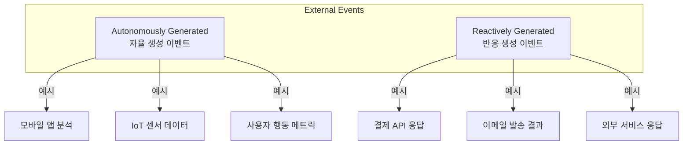

| 유형 | 설명 | 예시 |
|------|------|------|
| **Autonomously Generated** | 클라이언트가 자율적으로 발생 | 앱 사용 메트릭, 센서 데이터 |
| **Reactively Generated** | 서비스 요청에 대한 응답 | 결제 결과, API 응답 |

#### 1.2 자율 생성 이벤트 (분석 이벤트)

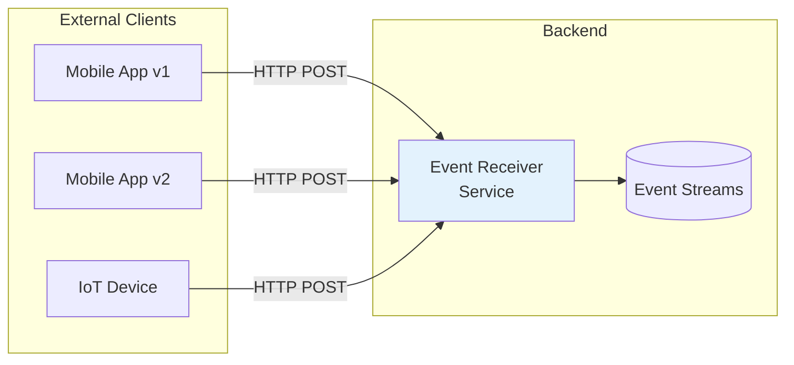

**분석 이벤트 처리 모범 사례**:

```
✅ 스키마 활용:
• 클라이언트에서 스키마 기반 이벤트 생성
• 다운스트림 오해 감소
• 버전 관리 및 진화 지원
• 프로듀서(앱 개발자)가 검증 책임

⚠️ 다중 버전 지원:
• 사용자가 앱을 즉시 업데이트하지 않음
• 여러 버전의 이벤트 동시 처리 필요
• 새 필드 추가, 기존 필드 제거 대응

💡 외부 이벤트 소스 = 마이크로서비스 인스턴스 집합
   각 인스턴스가 스키마화된 이벤트를 생산
```

#### 1.3 반응 생성 이벤트 (서드파티 API)

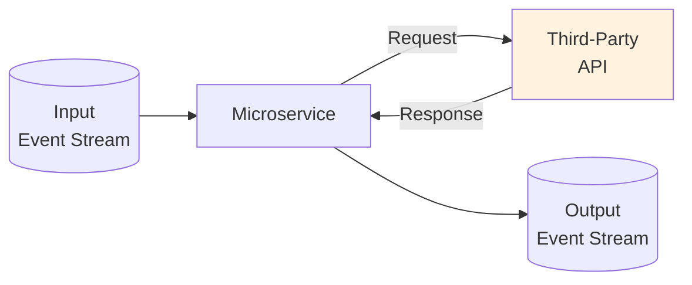

**서드파티 API 통합 코드 예시**:

```java
while (true) {
    Event[] eventsToProcess = Consumer.consume("input-event-stream");

    for (Event event : eventsToProcess) {
        // 비즈니스 로직으로 요청 생성
        Request request = generateRequest(event, ...);

        // 외부 엔드포인트에 블로킹 요청
        Response response =
            RequestService.makeBlockingRequest(request, timeout, retries);

        if (response.code == 200) {
            // 응답 파싱 및 비즈니스 로직 적용
            ParsedObj parsedObj = parseResponseToObject(response);
            OutputEvent outEvent = applyBusinessLogic(parsedObj, event);

            // 결과를 출력 스트림에 생산
            Producer.produce("output-stream-name", outEvent);
        } else {
            // 실패 처리: 재시도, 로그, 건너뛰기 등
        }
    }

    // 처리 완료 후 오프셋 커밋
    consumer.commitOffsets();
}
```

**장점과 단점**:

| 장점 | 단점 |
|------|------|
| 이벤트 처리와 API 호출 혼합 | 비결정적 요소 도입 (Chapter 6) |
| 필요한 API 자유롭게 호출 | 서드파티 변경 시 실패 가능 |
| 병렬 처리 가능 (비블로킹) | 재처리 시 다른 결과 가능 |
| | 대량 요청 시 API 제한/차단 위험 |

---

### 2. 상태 서빙 패턴

#### 2.1 Internal State Store 서빙

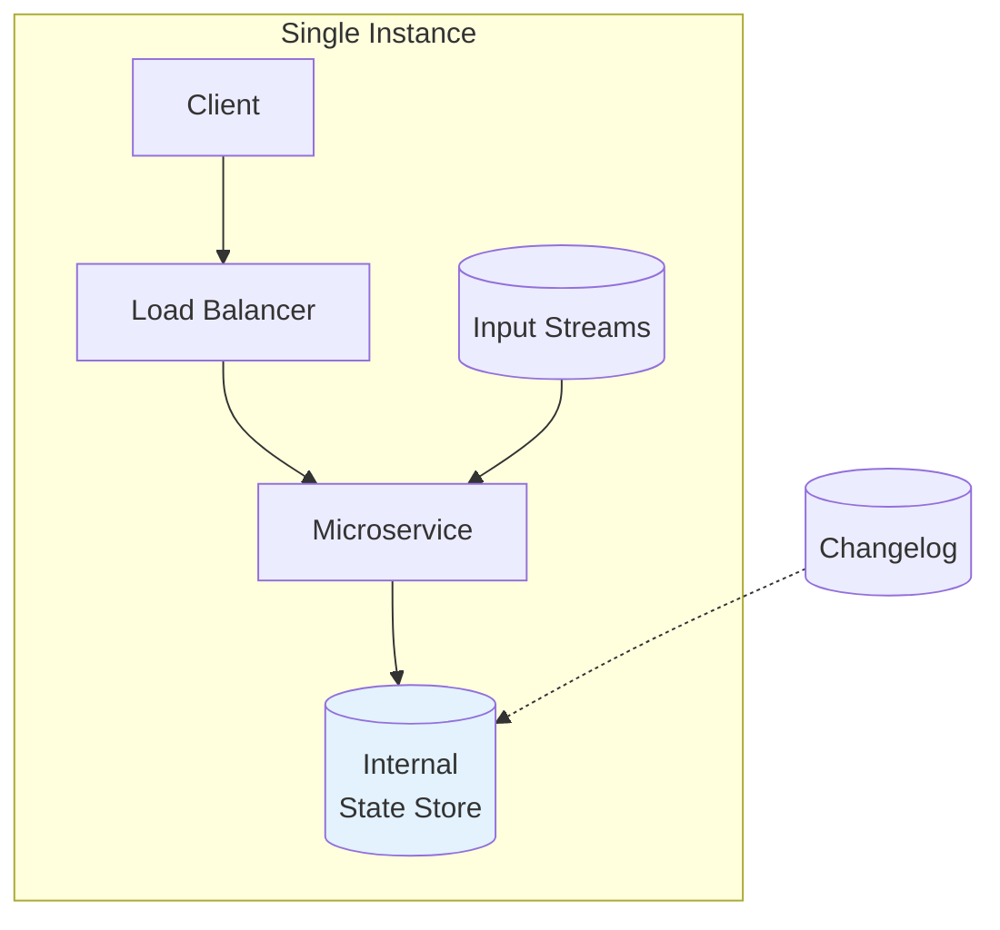

**단일 인스턴스**: 모든 상태가 하나의 인스턴스에 존재

#### 2.2 다중 인스턴스 + Internal State

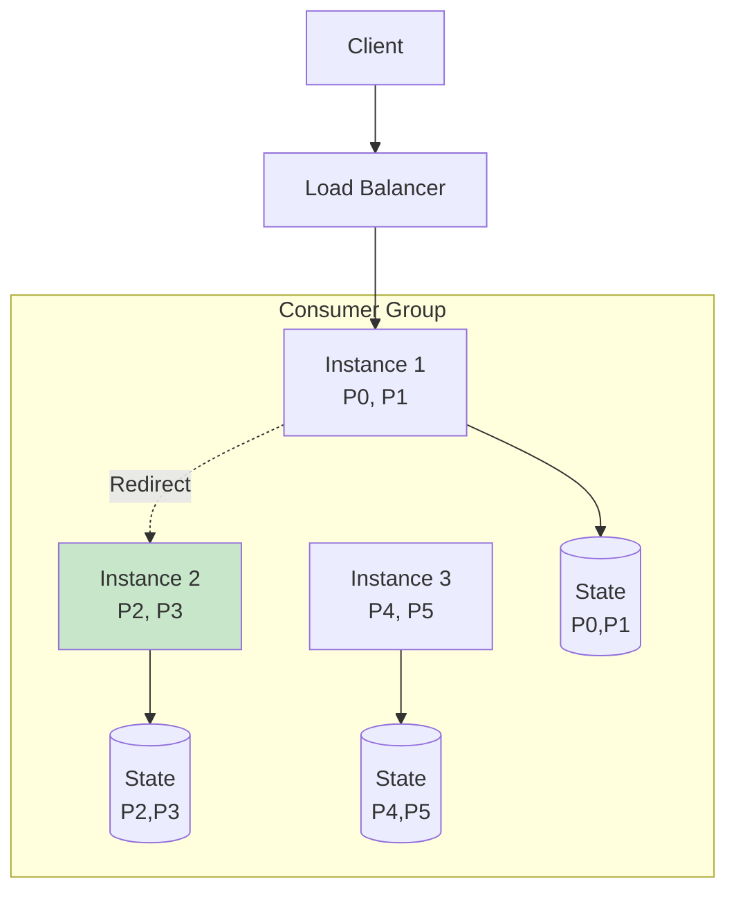

**라우팅 로직**:

```
1. 요청의 Key에 Partitioner 적용 → Partition ID
2. Consumer Group 할당 조회 → Instance 확인
3. 해당 Instance로 요청 전달

문제점:
• 인스턴스 수 증가 → Hit Rate 감소
• Hit Rate = 1 / 인스턴스 수
• 대부분 요청이 Redirect 필요
```

#### 2.3 Smart Load Balancer

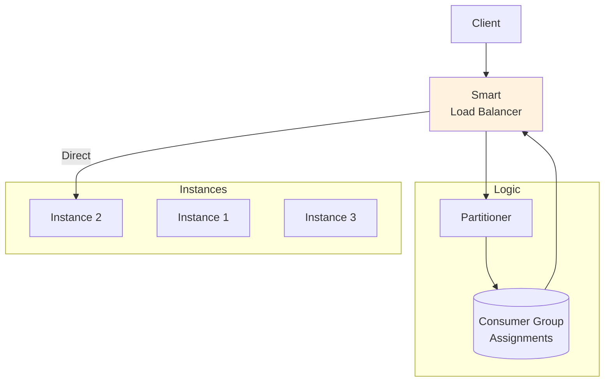

**Smart Load Balancer**:
- Partitioner 로직으로 Partition ID 계산
- Consumer Group 할당 테이블 조회
- 첫 번째 요청에서 정확한 인스턴스로 전달
- **주의**: 리밸런싱으로 인한 Race Condition 대비 필요

#### 2.4 External State Store 서빙

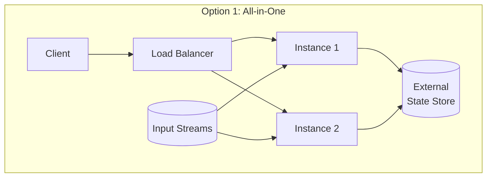

**장점**:
- 모든 인스턴스가 전체 상태 접근 가능
- 리밸런싱 시 상태 재구축 불필요
- 무중단 스케일링 용이

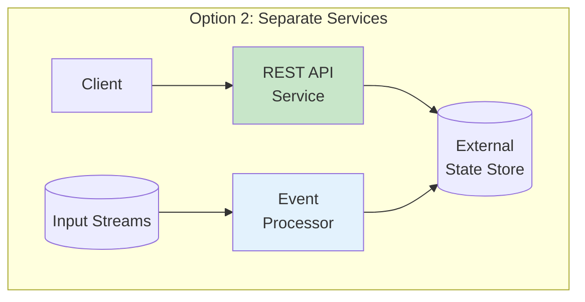

**Separate Services 장점**:
- Event Processor와 API 독립 스케일링
- 언어/기술 스택 독립 선택
- Event Processor 장애가 API에 영향 없음

**Separate Services 단점**:
- 두 서비스 간 조율 필요
- 공유 데이터 스토어 (EDM 원칙 위반 우려)
- 복잡성 증가

---

### 3. 워크플로우 내 요청 처리

#### 3.1 직접 처리 vs 이벤트 변환

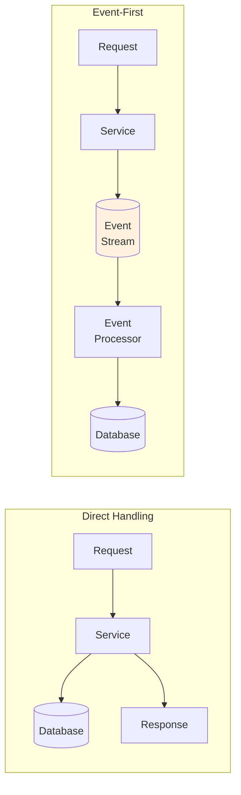

| 방식 | 장점 | 단점 |
|------|------|------|
| **Direct** | 즉시 응답, 낮은 지연 | 이벤트 기록 없음 |
| **Event-First** | 내구성 있는 기록, 공유 가능 | 지연 발생, Eventually Consistent |

#### 3.2 비동기 UI 고려사항

```
💡 비동기 UI 모범 사례:

1. 사용자 기대 관리
   • "요청 전송됨" 표시
   • 로딩 스피너 / 대기 메시지
   • 추가 입력 차단

2. 상태 업데이트 시점 결정
   • 비즈니스 규칙에 따라 판단
   • 오래된 상태 기반 의사결정 영향 고려
   • UI 업데이트 성능 영향 고려

⚠️ 중복 이벤트 처리:
   네트워크 재시도로 중복 발생 가능
   → 멱등성(Idempotency) 구현 필수
```

---

### 4. 예제: 신문 출판 워크플로우 (승인 패턴)

#### 4.1 시나리오

- 신문 디자이너: 기사와 광고 배치
- 편집자: 레이아웃 승인/거절
- 광고주: 광고 배치 승인/거절

#### 4.2 워크플로우 다이어그램

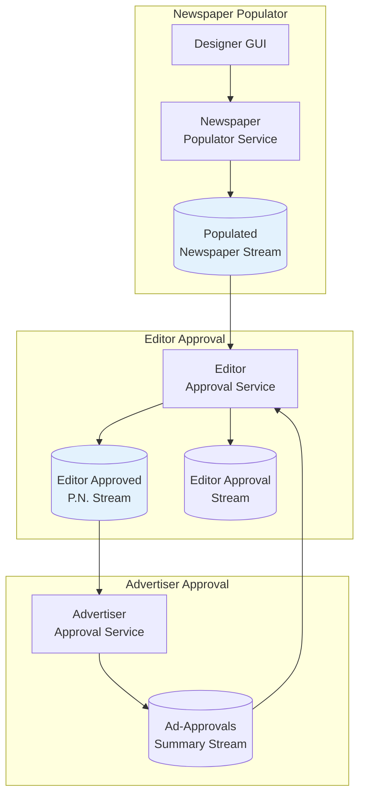

#### 4.3 이벤트 정의

**Populated Newspaper Event**:
```java
Key: String pn_key          // 신문 키
Value: {
  String pdf_uri            // PDF 저장 위치
  int version               // 버전
  Pages[] page_metadata     // 페이지 메타데이터
    - int page_number
    - Enum content          // Ad or Article
    - String id
}
```

**Editor Approval Event**:
```java
Key: String pn_key
Value: {
  String marked_up_pdf_uri  // 마크업된 PDF
  int version
  Enum status               // awaiting_approval, approved, rejected
  String editor_id
  String editor_comments
  RejectedAdvertisements[]  // 거절된 광고
}
```

**Advertiser Approval Event**:
```java
Key: String pn_key
Value: {
  String advertiser_pdf_uri
  int version
  int page_number
  boolean approved
  String advertisement_id
  String advertiser_id
  String advertiser_comments
}
```

#### 4.4 분리된 서비스의 장점

```
✅ 이벤트 기반 분리 장점:

1. 감사 기록
   • 제출, 승인, 거절의 전체 이력
   • 문제 발생 시 추적 가능

2. 상태 Materialization
   • 스트림에서 직접 상태 구축
   • 외부 상태 저장소 불필요

3. Bounded Context 분리
   • 편집자 서비스: 내부 직원 대상
   • 광고주 서비스: 외부 고객 대상, 보안 강화

4. 게이팅 로직 캡슐화
   • 편집자 승인 로직 → 편집자 서비스 내부
   • 광고주 승인 로직 → 광고주 서비스 내부
```

---

### 5. 마이크로프론트엔드 (Microfrontends)

#### 5.1 프론트엔드/백엔드 조직 패턴

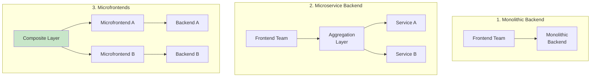

#### 5.2 마이크로프론트엔드 장점

```
✅ 장점:

1. 조합 기반 (Composition-Based)
   • 필요에 따라 서비스 추가
   • 이벤트 기반 백엔드와 완벽 호환

2. 비즈니스 정렬
   • 요구사항 → 구현 직접 추적
   • 실험적 기능 쉽게 추가/제거

3. 자율성
   • 팀 독립, 배포 독립
   • 언어/기술 스택 독립

4. 유연성
   • 백엔드 상태 저장소 자유 선택
   • 이벤트 스트림 소비 자유
```

#### 5.3 마이크로프론트엔드 단점

```
⚠️ 단점:

1. UI 일관성 유지 어려움
   • 스타일 가이드 + 공통 UI 라이브러리 필요
   • Stewardship 모델로 관리

2. 성능 차이
   • 각 프론트엔드 로딩 속도 다름
   • 일부 장애 시 Graceful Degradation 필요

3. 운영 복잡성
   • 여러 마이크로서비스 관리
   • 통합 테스트 필요
```

---

### 6. 예제: 경험 검색 및 리뷰 애플리케이션

#### 6.1 Version 1: 단일 서비스

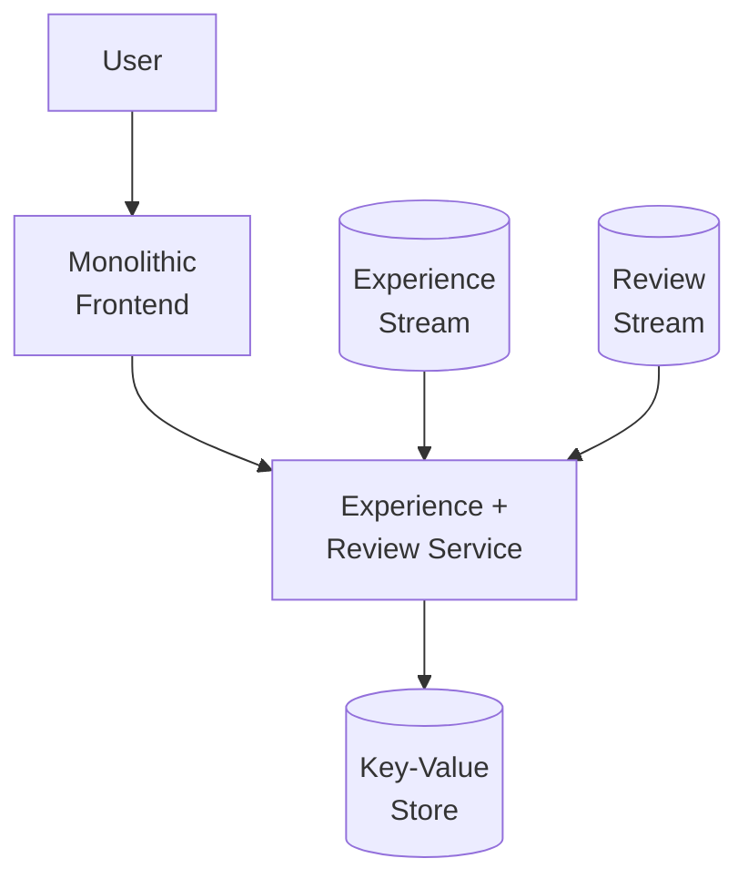

**제한사항**:
- 기본 검색만 가능 (위치 검색 불가)
- 검색과 리뷰가 하나의 서비스에 결합

#### 6.2 Version 2: 마이크로프론트엔드

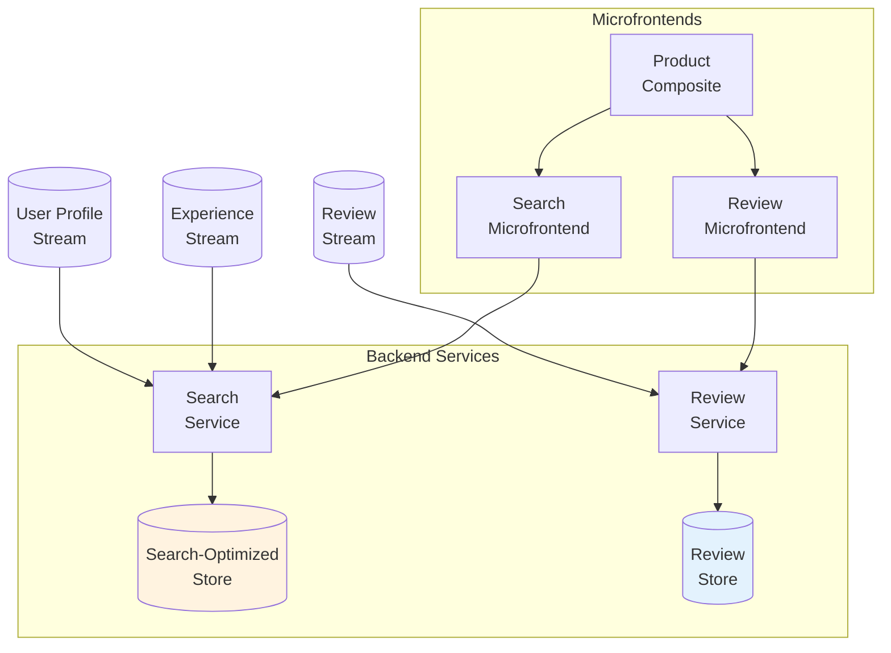

**개선사항**:

| 항목 | Version 1 | Version 2 |
|------|-----------|-----------|
| **검색** | Key-Value만 | Geo-location 검색 |
| **상태 저장소** | 공유 | 목적별 분리 |
| **스케일링** | 함께 | 독립적 |
| **데이터 소스** | 혼합 | 명확한 입력 스트림 |

---

## 심화 학습

### 1. 통합 패턴 선택 가이드

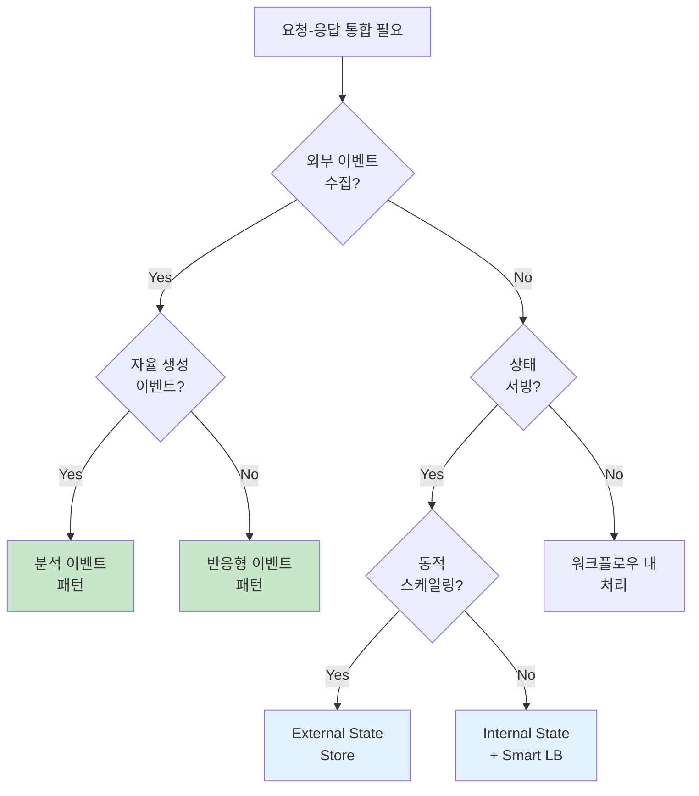

### 2. Hot Replica를 활용한 요청 서빙

```
💡 Hot Replica 활용:

• Internal State Store에서 Hot Replica 활용 가능
• 읽기 요청을 Replica로 분산
• 주의: Replication Lag로 인한 Stale 데이터

적합한 경우:
  - 약간의 지연 허용 가능
  - 읽기 부하 분산 필요
  - 고가용성 요구
```

### 3. Quota를 활용한 API 보호

```
외부 API 호출 시 Quota 활용:

문제:
  • 재처리 시 대량 요청 발생
  • API Rate Limit 초과
  • IP 차단 위험

해결:
  • Consumer Quota로 소비 속도 제한
  • 마이크로서비스 내 Throttling
  • 외부 API 제한에 맞춤 설정
```

---

## 실무 적용 포인트

### 1. 외부 이벤트 수집 체크리스트

```
□ 스키마 정의 및 버전 관리
□ Event Receiver 서비스 구현
□ 다중 버전 이벤트 처리 로직
□ 이벤트 스트림별 분리 저장
□ 인증/인가 처리
```

### 2. 상태 서빙 패턴 선택

```
Internal State Store 선택 시:
□ Smart Load Balancer 구현 고려
□ Hot Replica 활성화 검토
□ 리밸런싱 시 Redirect 로직

External State Store 선택 시:
□ All-in-One vs Separate 결정
□ 상태 저장소 선택 (Redis, MongoDB 등)
□ 접근 제어 (API를 통해서만 접근)
```

### 3. 마이크로프론트엔드 도입

```
□ 비즈니스 Bounded Context 정의
□ 공통 UI 컴포넌트 라이브러리
□ 스타일 가이드 수립
□ Composite Layer 설계
□ 통합 테스트 전략
```

---

## 체크리스트

### 외부 이벤트 처리 체크리스트

- [ ] 이벤트 유형 식별 (자율/반응)
- [ ] 스키마 정의 및 버전 전략
- [ ] Event Receiver 엔드포인트 구현
- [ ] 오류 처리 및 재시도 로직
- [ ] 모니터링 및 알림 설정

### 상태 서빙 체크리스트

- [ ] Internal vs External 선택
- [ ] 라우팅 전략 결정
- [ ] 스케일링 정책 정의
- [ ] 장애 시 Fallback 처리
- [ ] 성능 테스트

### 마이크로프론트엔드 체크리스트

- [ ] Bounded Context 분리
- [ ] UI 일관성 전략
- [ ] 배포 파이프라인
- [ ] 통합 테스트
- [ ] 성능 모니터링

---

## 참고 자료

### 관련 패턴

| 패턴 | 설명 | 적용 |
|------|------|------|
| **Gateway 패턴** | API 집계 계층 | 마이크로서비스 백엔드 |
| **BFF (Backend for Frontend)** | 프론트엔드 전용 백엔드 | 마이크로프론트엔드 |
| **Event Sourcing** | 이벤트로 상태 구축 | 워크플로우 내 처리 |

### 관련 장

| 장 | 주제 | 관계 |
|----|------|------|
| Chapter 4 | 기존 시스템 통합 | Data Liberation |
| Chapter 6 | 결정적 스트림 처리 | 비결정적 요소 |
| Chapter 7 | 상태 기반 스트리밍 | 상태 저장소 |
| Chapter 8 | 워크플로우 구축 | 승인 패턴 |

---

## 핵심 용어 정리

| 용어 | 정의 |
|------|------|
| **Request-Response** | 동기적 API 통신 (HTTP 등) |
| **Autonomously Generated Event** | 클라이언트가 자율적으로 생성하는 이벤트 |
| **Reactively Generated Event** | 서비스 요청에 대한 응답으로 생성되는 이벤트 |
| **Analytical Event** | 측정값, 사실에 대한 진술 이벤트 |
| **Internal State Store** | 마이크로서비스 인스턴스 내부 상태 저장소 |
| **External State Store** | 마이크로서비스 외부의 공유 상태 저장소 |
| **Smart Load Balancer** | 파티션 할당 기반 라우팅 로드밸런서 |
| **Microfrontend** | 독립적 프론트엔드 컴포넌트 |
| **Composite Layer** | 마이크로프론트엔드 조합 계층 |
| **Event-First** | 요청을 이벤트로 변환 후 처리하는 방식 |
| **Approval Pattern** | 승인 워크플로우 패턴 |
