# Chapter 14. 지원 도구 (Supportive Tooling)

## 핵심 요약

**지원 도구(Supportive Tooling)**는 대규모 이벤트 기반 마이크로서비스를 효율적으로 관리할 수 있게 해준다. **셀프 서브(Self-Serve)** 도구를 통해 DevOps 역량을 갖추는 것이 확장 가능하고 탄력적인 비즈니스 구조를 위해 필수적이다.

**핵심 도구 카테고리**:

1. **소유권 관리**: 마이크로서비스-팀 할당 시스템
2. **스트림 관리**: 생성, 수정, 메타데이터 태깅
3. **스키마 관리**: Schema Registry, 변경 알림
4. **접근 제어**: ACL, 권한 관리
5. **운영 도구**: 오프셋 관리, 상태 리셋, Lag 모니터링
6. **인프라 관리**: 클러스터, 컨테이너, 복제
7. **시각화**: 의존성 추적, 토폴로지 시각화

**현실**:
- 오픈소스 도구 부족
- 대부분 자체 개발 필요
- 가능하면 오픈소스 활용 및 기여 권장

---

## 학습 목표

이 장을 학습한 후 다음을 할 수 있어야 한다:

1. **마이크로서비스-팀 할당 시스템** 이해하기
   - 소유권 추적의 중요성
   - 다른 도구의 기반

2. **스트림 관리 도구** 활용하기
   - 메타데이터 태깅
   - Quota 설정

3. **스키마 레지스트리** 운영하기
   - 스키마 등록 및 조회 워크플로우
   - 변경 알림 시스템

4. **ACL 및 권한 관리** 구현하기
   - Single Writer Principle 적용
   - Bounded Context 강화

5. **토폴로지 시각화** 활용하기
   - 의존성 추적
   - 팀 경계 최적화

---

## 본문 정리

### 1. 마이크로서비스-팀 할당 시스템

#### 1.1 필요성

```
⚠️ 마이크로서비스 환경에서의 문제:

• 소수 시스템: 암묵적 지식으로 소유권 파악 가능
• 다수 시스템: 명시적 소유권 추적 필수

💡 Single Writer Principle에 따라:
   이벤트 스트림 소유권 = 쓰기 권한 보유 마이크로서비스
```

#### 1.2 시스템 구조

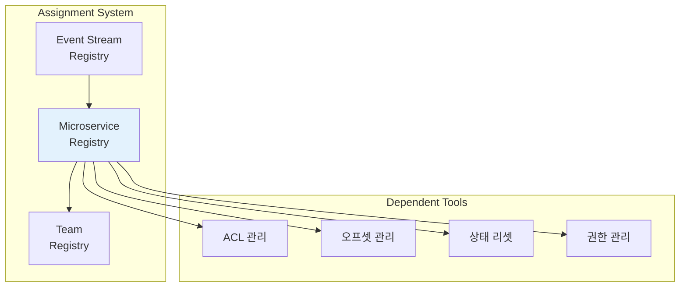

**핵심 기능**:
- 사람, 팀, 마이크로서비스 간 의존성 추적
- 다른 모든 도구의 기반
- 세분화된 DevOps 권한 할당

---

### 2. 이벤트 스트림 생성 및 수정

#### 2.1 팀의 자율적 스트림 관리

```
✅ 팀이 제어해야 할 속성:

• Partition Count: 병렬 처리 수준
• Retention Policy: 데이터 보존 기간
• Replication Factor: 복제 수준

예시:
┌────────────────────────────────────────────────────┐
│ 고중요도 민감 데이터:                               │
│   • Retention: Infinite                            │
│   • Replication Factor: 높음                       │
├────────────────────────────────────────────────────┤
│ 대용량 저중요도 업데이트:                           │
│   • Partition Count: 높음                          │
│   • Replication Factor: 낮음                       │
│   • Retention: 짧음                                │
└────────────────────────────────────────────────────┘
```

#### 2.2 내부 스트림 자동 생성

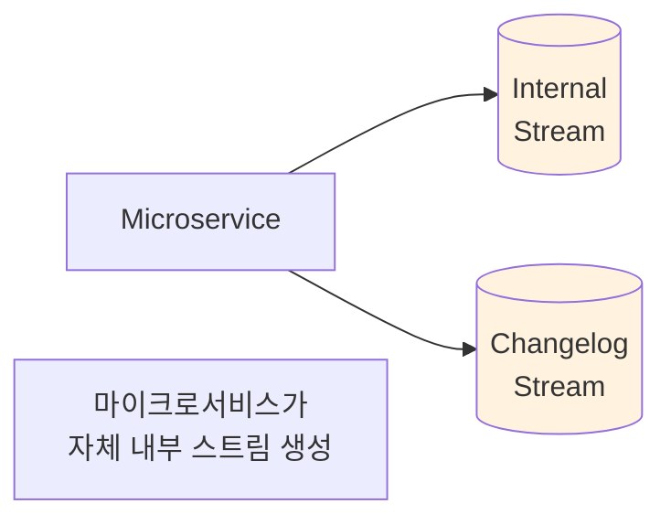

---

### 3. 이벤트 스트림 메타데이터 태깅

#### 3.1 유용한 메타데이터 태그

| 태그 | 설명 | 활용 |
|------|------|------|
| **Stream Owner** | 스트림 소유 서비스 | 변경 요청, 감사 |
| **PII** | 개인 식별 정보 | 접근 제한 |
| **Financial** | 금융 정보 | 보안 강화 |
| **Namespace** | 중첩된 Bounded Context | 데이터 검색 필터링 |
| **Deprecation** | 폐기 예정 | 신규 구독 차단 |
| **Custom Tags** | 비즈니스 맞춤 태그 | 조직별 요구사항 |

#### 3.2 태그 활용 예시

```
┌─────────────────────────────────────────────────────┐
│  Deprecation 태그 활용:                             │
│                                                     │
│  1. 기존 스트림에 "deprecated" 태그 추가            │
│  2. 기존 소비자: 계속 사용 가능                     │
│  3. 신규 소비자: 구독 차단                          │
│  4. 새 스트림으로 이벤트 생산                       │
│  5. 소비자 마이그레이션                             │
│  6. 등록된 소비자 0명 → 알림 → 삭제 가능            │
└─────────────────────────────────────────────────────┘
```

```
┌─────────────────────────────────────────────────────┐
│  Namespace 태그 활용:                               │
│                                                     │
│  • 네임스페이스 외부 서비스에게 스트림 숨김          │
│  • 네임스페이스 내부 서비스만 접근 가능              │
│  • 데이터 검색 오버로드 감소                        │
└─────────────────────────────────────────────────────┘
```

---

### 4. Quota (할당량)

#### 4.1 Quota의 목적

```
💡 Quota = 서비스 거부 방지

문제 시나리오:
• 예상치 못한 대량 생산자
• 대규모 병렬 소비자 그룹
• 스트림 시작점부터 대량 소비

해결:
• 단일 프로듀서/컨슈머의 리소스 제한
• 클러스터 포화 방지
• Throttling 적용
```

#### 4.2 세분화된 Quota 설정

| 시나리오 | Quota 설정 |
|----------|-----------|
| **안정적 소비자** | 기본 Quota |
| **Surge-prone 시스템** | 높은 Quota |
| **외부 소스 프로듀서** | Quota 제거 또는 높음 |

```
⚠️ 외부 소스 프로듀서 주의:

서드파티 입력 또는 외부 동기 요청 기반 프로듀서:
• Throttling으로 수신 속도보다 생산 속도 낮아지면
• 데이터 유실 또는 크래시 발생 가능
• → Quota 제거 또는 높게 설정
```

---

### 5. 스키마 레지스트리 (Schema Registry)

#### 5.1 스키마 레지스트리의 이점

```
✅ Schema Registry 장점:

1. 대역폭 절약
   • 이벤트에 스키마 대신 ID만 포함
   • 전체 스키마 전송 불필요

2. 단일 참조점
   • 스키마 조회의 중앙 저장소
   • 일관된 스키마 관리

3. 데이터 검색 지원
   • 자유 텍스트 검색
   • 스키마 기반 데이터 탐색
```

#### 5.2 워크플로우

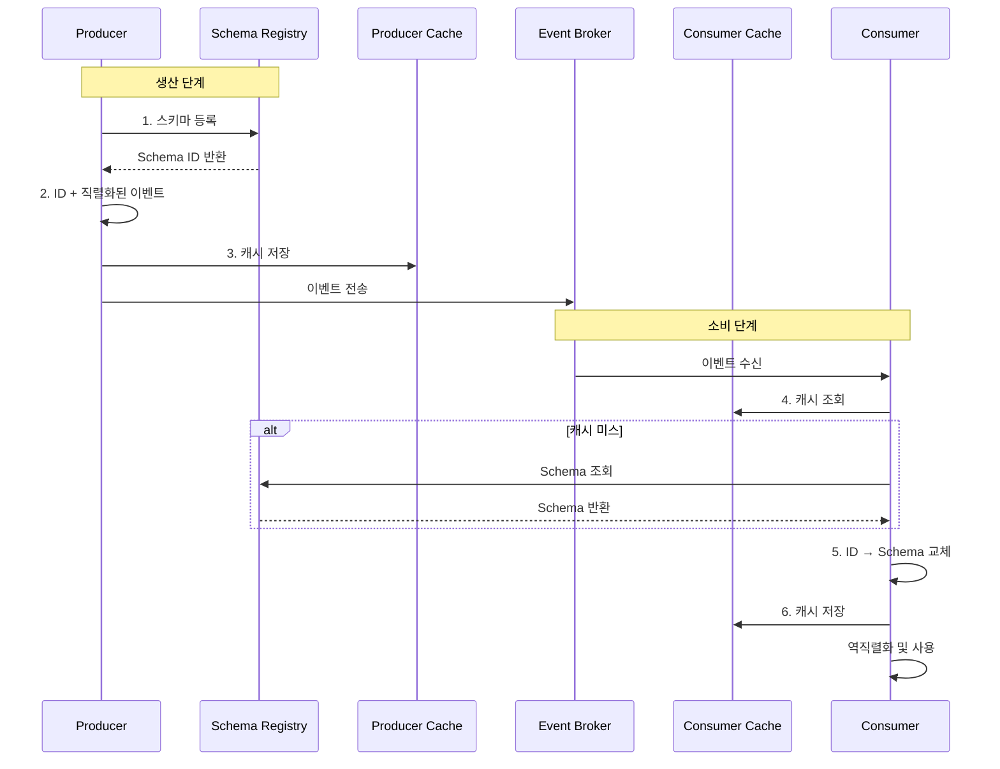

#### 5.3 구현 예시

```
📦 Confluent Schema Registry:

• Apache Kafka용 스키마 레지스트리
• 지원 포맷: Avro, Protobuf, JSON
• 무료 프로덕션 사용 가능
• 스키마를 전용 이벤트 스트림에 저장
  → 별도 내구성 저장소 불필요
```

---

### 6. 스키마 변경 알림

#### 6.1 알림 시스템 구조

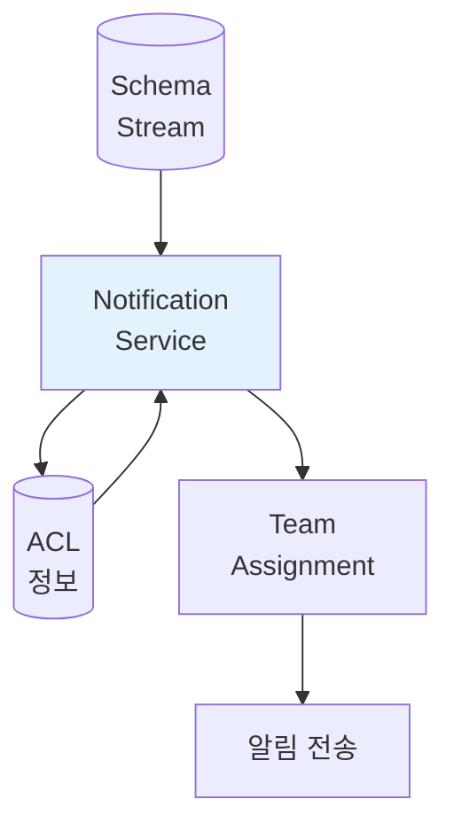

#### 6.2 알림 프로세스

```
스키마 변경 알림 흐름:

1. Schema Stream에서 업데이트 소비
2. 스키마 → 이벤트 스트림 연결
3. ACL에서 소비 서비스 조회
4. 서비스 → 팀 매핑 (Assignment System)
5. 팀에 알림 전송

✅ 장점:
• 상위 스트림 변경 사전 감지
• 파괴적 변경 위기 전 식별
• 새 스트림 온라인 시 인사이트 제공
```

---

### 7. 오프셋 관리 (Offset Management)

#### 7.1 오프셋 조정 시나리오

| 시나리오 | 동작 | 사용 사례 |
|----------|------|----------|
| **Application Reset** | 오프셋 초기화 | 로직 변경 후 재처리 |
| **Skip Old Data** | 최신 오프셋으로 이동 | 과거 데이터 불필요 시 |
| **Specific Offset** | 특정 시점으로 설정 | 멀티클러스터 Failover |

#### 7.2 권한 요구사항

```
⚠️ 오프셋 수정 권한:

• 마이크로서비스 소유 팀만 오프셋 수정 가능
• Microservice-to-Team Assignment System 활용
• 프로덕션 DevOps 필수 요구사항
```

---

### 8. 권한 및 접근 제어 목록 (ACL)

#### 8.1 ACL의 역할

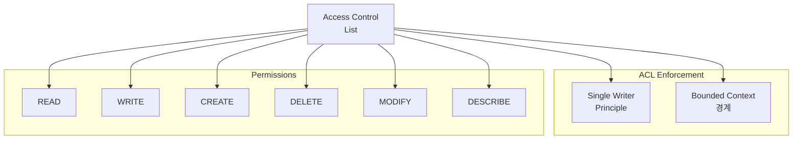

#### 8.2 일반적인 권한 할당

| 컴포넌트 | 마이크로서비스 권한 |
|----------|-------------------|
| **Input Event Streams** | READ |
| **Output Event Streams** | CREATE, WRITE (+ READ 선택) |
| **Internal/Changelog Streams** | CREATE, WRITE, READ |

#### 8.3 ACL 모범 사례

```
⚠️ 중요 권고사항:

1. Day 1부터 식별(Identification) 활성화
   • 사후 추가는 매우 고통스러움
   • 모든 서비스 업데이트/검토 필요

2. 권한 부여 프로세스
   • 팀이 자체적으로 접근 요청
   • 민감 정보는 중앙 보안 검토

3. 권한 변경 이력 유지
   • 이벤트 스트림으로 기록
   • 감사 목적으로 활용

4. 내부 스트림 보호
   • 다른 마이크로서비스의 내부 스트림 접근 차단
   • Bounded Context 위반 방지
```

---

### 9. 상태 관리 및 애플리케이션 리셋

#### 9.1 리셋이 필요한 경우

```
애플리케이션 리셋 트리거:

• 데이터 구조 변경 (Internal/Changelog 스트림)
• 토폴로지 워크플로우 변경
• 상태 저장소 스키마 변경
```

#### 9.2 리셋 도구 요구사항

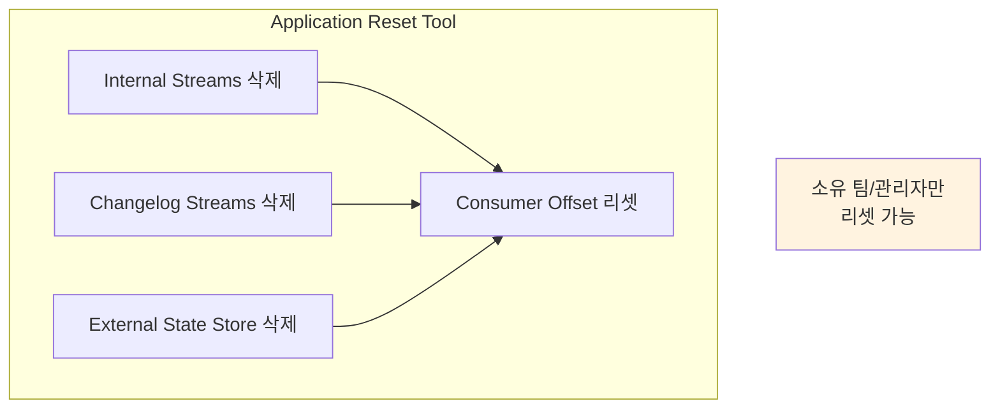

**보안 요구사항**:
- 다른 팀의 스트림/상태 삭제 불가
- Microservice-to-Team Assignment 활용
- 소유자 또는 관리자만 리셋 가능

---

### 10. Consumer Offset Lag 모니터링

#### 10.1 Lag 정의

```
Lag = 최신 이벤트 오프셋 - 마지막 처리 오프셋

Lag 증가 → 스케일 업 필요 신호
```

#### 10.2 스케일링 로직

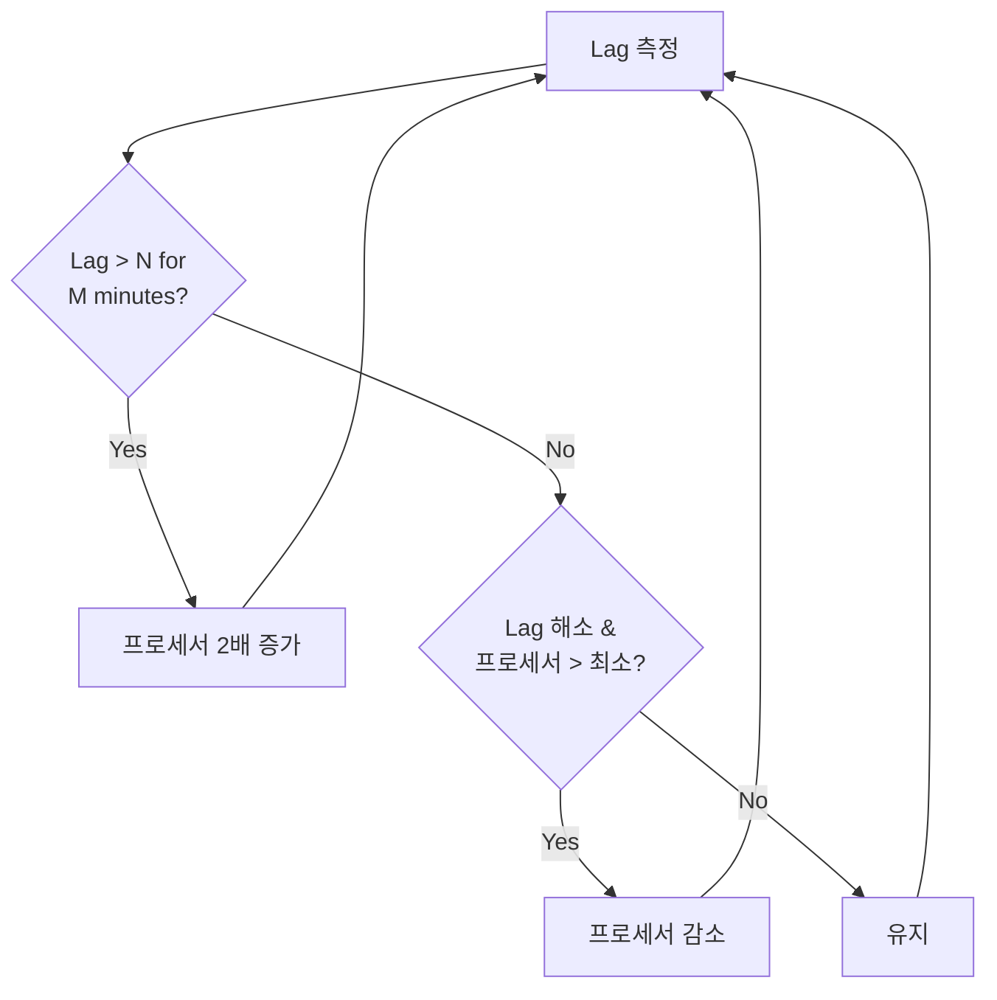

#### 10.3 고급 Lag 분석

```
💡 Burrow (Apache Kafka용):

• 히스토리 기반 Lag 분석
• 단순 임계값 대신 편차 측정
• 대용량 스트림에서 유용
  (Lag가 항상 0이 아닐 수 있음)

⚠️ Hysteresis (이력 현상) 필요:
• 스케일 업/다운 무한 반복 방지
• 임계값에 허용 오차 추가
• AWS CloudWatch, GCP Operations 지원
```

---

### 11. 스트림라인 마이크로서비스 생성 프로세스

#### 11.1 자동화된 생성 워크플로우

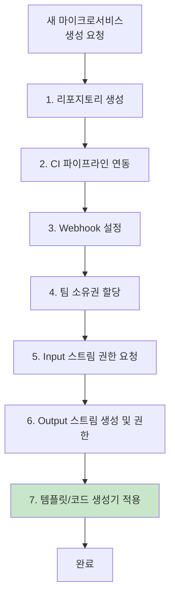

#### 11.2 자동화의 이점

```
✅ 스트림라인 프로세스 장점:

• 팀이 반복 수행하는 작업 → 시간 절약
• 최신 템플릿/도구 자동 적용
• 오래된 프로젝트 복사 방지
• 일관된 프로젝트 구조
• 공통 도구와 자동 통합
```

---

### 12. 컨테이너 관리 제어

#### 12.1 팀에 노출할 CMS 기능

```
✅ 셀프 서브 DevOps 기능:

□ 환경 변수 설정
□ 클러스터 선택 (테스트, 통합, 프로덕션)
□ CPU, 메모리, 디스크 리소스 관리
□ 인스턴스 수 수동 조정
□ SLA 및 Lag 기반 자동 스케일링
□ CPU/메모리/디스크/Lag 메트릭 기반 오토스케일링
```

#### 12.2 조직별 결정

```
💡 DevOps 문화에 따른 결정:

개발자에게 노출할 옵션 vs 운영 팀 관리 옵션

균형 고려사항:
• 팀 자율성 vs 중앙 제어
• 개발 속도 vs 안정성
• 비용 관리 vs 유연성
```

---

### 13. 클러스터 생성 및 관리

#### 13.1 멀티클러스터 필요 이유

```
멀티클러스터 시나리오:

1. 국제 기업
   • 특정 데이터는 발생 국가 내 유지 필요

2. 대규모 데이터
   • 단일 클러스터로 감당 불가

3. 비즈니스 격리
   • 조직 단위별 분리 필요

4. 재해 복구
   • 멀티 리전 복제
   • 클러스터 전체 장애 대비
```

#### 13.2 클러스터 관리 도구

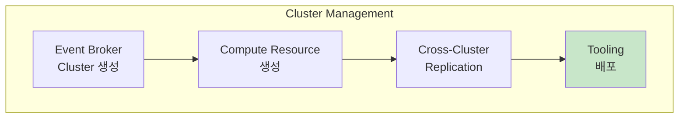

---

### 14. Cross-Cluster 이벤트 데이터 복제

#### 14.1 복제 도구 선택 시 고려사항

| 고려사항 | 질문 |
|----------|------|
| **자동 복제** | 새 스트림이 자동으로 복제되는가? |
| **수정/삭제 처리** | 스트림 변경/삭제 시 어떻게 처리? |
| **정확성** | 오프셋, 파티션, 타임스탬프 동일한가? |
| **지연 시간** | 복제 지연이 비즈니스에 허용 가능? |
| **성능** | 비즈니스 요구에 맞게 확장 가능? |

#### 14.2 Tooling의 Programmatic 배포

```
💡 새 클러스터에 동일 도구 자동 배포:

장점:
1. 도구 사용 빈도 증가 → 버그 발견
2. 사용자가 이미 익숙한 인터페이스
3. 클러스터 종료 시 함께 정리
4. Event Broker 외 별도 저장소 불필요
```

---

### 15. 의존성 추적 및 토폴로지 시각화

#### 15.1 의존성 추적 방법

```
⚠️ 자기 보고 시스템의 문제:

• 자발적 참여 → 불완전한 데이터
• 누락된 팀 존재
• 토폴로지 갭 발생

✅ ACL 기반 의존성 추적:

1. 마이크로서비스는 권한 없이 작동 불가
2. 권한 변경 시 자동으로 의존성 업데이트
3. 별도 변경 작업 불필요
```

#### 15.2 토폴로지 시각화 활용

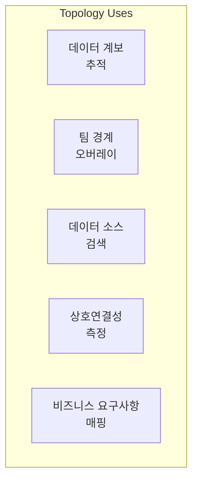

| 활용 | 설명 |
|------|------|
| **Data Lineage** | 데이터 출처 및 변환 경로 추적 |
| **Team Boundaries** | 팀 소유권 시각화 |
| **Data Discovery** | 사용 가능한 스트림 탐색 |
| **Interconnectedness** | 팀 간 연결 수 측정 |
| **Business Mapping** | 구현 → 비즈니스 요구사항 연결 |

---

### 16. 토폴로지 예제: 팀 경계 최적화

#### 16.1 초기 토폴로지

```
4개 팀, 25개 마이크로서비스:

Team 2의 문제점:
• 2개 서비스가 주 Bounded Context 외부에 위치
• Team 1, 3, 4와 많은 의존성
• 외부 노출 "표면적" 증가
```

#### 16.2 상호연결성 측정

| 팀 | Incoming | Outgoing | Incoming Teams | Outgoing Teams | Services |
|----|----------|----------|----------------|----------------|----------|
| Team 1 | 1 | 3 | 1 | 2 | 5 |
| Team 2 | 8 | 2 | 3 | 2 | 8 |
| Team 3 | 3 | 3 | 2 | 1 | 6 |
| Team 4 | 1 | 5 | 1 | 2 | 8 |

#### 16.3 최적화 후

```
재할당:
• Microservice 7 → Team 1
• Microservice 2 → Team 4
• Microservice 1 → Team 4 (추가 고려)

결과:
• 팀 간 연결 3개 감소
• Team 2: Incoming 8→4, Outgoing 2→0
```

#### 16.4 비즈니스 정렬 고려

```
💡 수치적 최적화만으로는 불충분:

고려해야 할 요소:
• 팀의 비즈니스 목표와 서비스 기능 정렬
• 팀의 인력 규모
• 전문 분야
• 구현 복잡도

예: 데이터 소싱 전담 팀
   → 많은 스트림 연결은 정상적
   → 비즈니스 기능으로 판단해야 함
```

---

### 17. EDA 문서화 도구 — EventCatalog & AsyncAPI

#### 17.1 스키마를 넘어서: 의미론적 문서화

5절에서 다룬 스키마 레지스트리는 이벤트의 **기술적 구조**(필드명, 타입, 호환성)를 관리한다. 그러나 스키마만으로는 이벤트의 비즈니스 맥락을 전달할 수 없다.

```
💡 David Boyne (EventCatalog 창시자):

"스키마는 이벤트의 구조를 알려주지만,
 그 이벤트가 왜 존재하고 언제 발행되며
 어떤 비즈니스 의미를 갖는지는 알려주지 않는다."

스키마가 답하는 것:
  • OrderCreated에 어떤 필드가 있는가?
  • 필드 타입은 무엇인가?

스키마가 답하지 못하는 것:
  • OrderCreated는 언제 발행되는가?
  • 이 이벤트를 받으면 어떤 행동을 해야 하는가?
  • 이 이벤트와 PaymentProcessed의 순서 관계는?
  • 이 이벤트의 소유 도메인은 어디인가?
```

```
┌─────────────────────────────────────────────────────┐
│  스키마 vs 의미론적 문서화 비교                      │
│                                                     │
│  Schema Registry (5절):                             │
│    • 필드명, 타입, 호환성 규칙                      │
│    • 직렬화/역직렬화 자동화                         │
│    • 기술적 계약                                    │
│                                                     │
│  의미론적 문서화 (이 절):                           │
│    • 비즈니스 맥락과 발행 조건                      │
│    • 이벤트 간 관계와 흐름                          │
│    • 소비자가 취해야 할 행동                        │
│    • 도메인 소유권과 책임                           │
└─────────────────────────────────────────────────────┘
```

#### 17.2 EventCatalog

EventCatalog는 EDA의 **발견성(Discoverability)**과 **문서화** 문제를 해결하기 위한 오픈소스 도구다. 특정 브로커나 프로토콜에 종속되지 않아 Kafka, RabbitMQ, SNS/SQS 등 어떤 인프라에서도 사용할 수 있다.

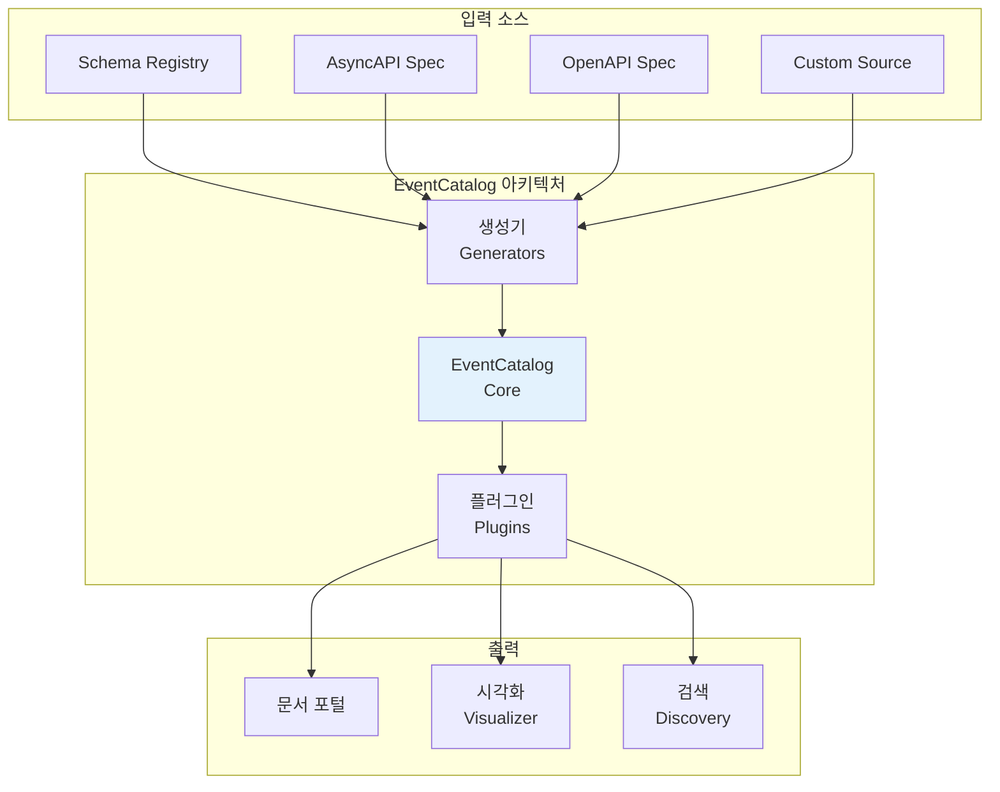

**핵심 기능**:

| 기능 | 설명 |
|------|------|
| **이벤트 카탈로그** | 모든 이벤트/커맨드를 중앙에서 검색·탐색 |
| **서비스 매핑** | 어떤 서비스가 어떤 이벤트를 생산/소비하는지 시각화 |
| **스키마 뷰어** | Avro, Protobuf, JSON Schema 등 다중 포맷 렌더링 |
| **버전 관리** | 이벤트 스키마의 변경 이력 추적 |
| **플러그인 생태계** | 생성기(Generator)를 통해 기존 시스템에서 자동 문서 생성 |

```
📦 EventCatalog 도입 시나리오:

AS-IS:
  • 개발자가 이벤트를 찾으려면 코드를 직접 탐색
  • "이 이벤트 누가 소비하지?" → Slack에서 질문
  • 스키마 변경 시 영향 범위 파악 어려움

TO-BE:
  • eventcatalog.dev 포털에서 이벤트 검색
  • 서비스 → 이벤트 의존성 그래프 즉시 확인
  • 스키마 변경 전 소비자 목록 자동 조회
```

15절의 토폴로지 시각화가 **인프라 수준** 의존성을 보여준다면, EventCatalog는 **비즈니스 수준** 이벤트 흐름과 문서를 함께 제공한다는 점에서 상호 보완적이다.

#### 17.3 AsyncAPI

AsyncAPI는 비동기 API를 위한 표준 명세 형식으로, REST API 세계의 OpenAPI(Swagger)에 해당한다. 이벤트 채널, 메시지 구조, 프로토콜 바인딩을 하나의 명세 파일로 정의할 수 있다.

```
┌─────────────────────────────────────────────────────┐
│  AsyncAPI가 정의하는 것:                             │
│                                                     │
│  • Channels: 이벤트가 흐르는 토픽/큐                │
│  • Messages: 메시지의 구조(페이로드 + 헤더)         │
│  • Operations: publish / subscribe 동작             │
│  • Bindings: Kafka, AMQP 등 프로토콜별 설정         │
│  • Servers: 브로커 연결 정보                        │
│                                                     │
│  OpenAPI와의 관계:                                  │
│  • OpenAPI = 동기 HTTP API 명세                     │
│  • AsyncAPI = 비동기 메시지 API 명세                │
│  • 두 표준 모두 YAML/JSON 형식                     │
└─────────────────────────────────────────────────────┘
```

EventCatalog는 AsyncAPI 명세를 입력으로 받아 문서를 자동 생성할 수 있다. Schema Registry가 스키마의 기술적 저장소라면, AsyncAPI는 그 스키마가 사용되는 채널과 동작까지 포함하는 상위 명세에 해당한다.

#### 17.4 DDD와 이벤트 문서화 통합

이벤트 스토밍(Event Storming)에서 도출된 도메인 이벤트는 코드로 구현될 때 비즈니스 맥락이 희석되기 쉽다. 문서화 도구를 통해 이 연결을 유지할 수 있다.

```
이벤트 스토밍 → 문서화 연결:

1. 이벤트 스토밍 워크숍
   → 도메인 이벤트, 커맨드, 애그리거트 도출
   → 비즈니스 용어와 규칙이 포스트잇에 명시됨

2. 네이밍 컨벤션 표준화
   → OrderPlaced (과거형 도메인 이벤트)
   → PlaceOrder (명령형 커맨드)
   → 유비쿼터스 언어 그대로 코드에 반영

3. 문서화 도구에 맥락 기록
   → EventCatalog에 각 이벤트의 비즈니스 규칙 기술
   → "주문이 결제 완료 후 발행됨" 같은 발행 조건 명시
   → Bounded Context 소유권 명시

4. 지속적 동기화
   → 코드 변경 시 AsyncAPI 명세 업데이트
   → 생성기가 EventCatalog 자동 갱신
   → 이벤트 스토밍 결과와 실제 구현의 괴리 감소
```

---

## 심화 학습

### 1. 도구 구축 우선순위

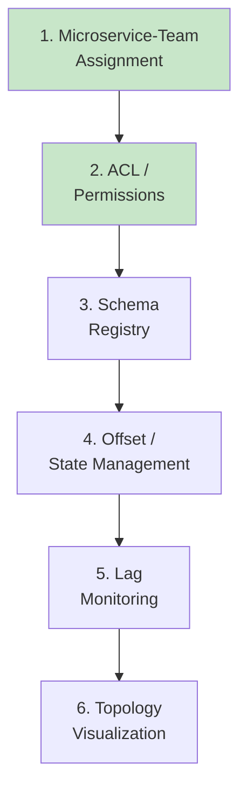

### 2. 오픈소스 도구 현황

| 영역 | 오픈소스 | 비고 |
|------|----------|------|
| Schema Registry | Confluent Schema Registry | Kafka용 |
| Lag Monitoring | Burrow | Kafka용 |
| Cluster Management | AWS MSK, GCP Kafka | 클라우드 |
| Container Management | Kubernetes | 범용 |
| EDA 문서화/발견성 | EventCatalog | 브로커 중립 |
| 비동기 API 명세 | AsyncAPI | OpenAPI의 비동기 버전 |
| 기타 도구 | 대부분 자체 개발 필요 | |

---

## 실무 적용 포인트

### 1. 도구 도입 체크리스트

```
□ Microservice-Team Assignment 시스템 구축
□ ACL 및 권한 관리 Day 1부터 적용
□ Schema Registry 도입
□ 스트림 메타데이터 태깅 전략 수립
□ 오프셋 관리 도구 제공
□ Lag 모니터링 및 알림 설정
□ 마이크로서비스 생성 자동화
□ 토폴로지 시각화 도구 구축
```

### 2. 셀프 서브 DevOps 전략

```
팀 자율성 vs 중앙 제어 균형:

개발자 셀프 서브:
  □ 오프셋 리셋
  □ 상태 리셋
  □ 스케일링
  □ 환경 변수

중앙 관리:
  □ 프로덕션 클러스터 접근
  □ 민감 데이터 권한
  □ 리소스 Quota
  □ 클러스터 생성/삭제
```

### 3. 토폴로지 최적화 프로세스

```
1. 현재 토폴로지 시각화
2. 상호연결성 측정
3. 팀 경계 분석
4. 비즈니스 목표와 정렬 확인
5. 재할당 후보 식별
6. 영향도 분석
7. 점진적 재할당
8. 결과 모니터링
```

---

## 체크리스트

### 소유권 관리 체크리스트

- [ ] Microservice-Team Assignment 시스템
- [ ] 스트림 소유권 명시
- [ ] 팀 변경 시 업데이트 프로세스

### 스트림 관리 체크리스트

- [ ] 스트림 생성 자동화
- [ ] 메타데이터 태깅 정책
- [ ] Quota 설정
- [ ] 폐기 프로세스

### 스키마 관리 체크리스트

- [ ] Schema Registry 운영
- [ ] 스키마 변경 알림
- [ ] 버전 관리 정책

### ACL 관리 체크리스트

- [ ] Day 1부터 식별 활성화
- [ ] 권한 요청 프로세스
- [ ] 권한 변경 감사 로그

### 운영 도구 체크리스트

- [ ] 오프셋 관리 도구
- [ ] 상태 리셋 도구
- [ ] Lag 모니터링 및 알림
- [ ] 오토스케일링 설정

---

## 참고 자료

### 오픈소스 도구

| 도구 | 용도 | URL |
|------|------|-----|
| **Confluent Schema Registry** | 스키마 관리 | Confluent |
| **Burrow** | Lag 모니터링 | LinkedIn |
| **Kubernetes** | 컨테이너 관리 | CNCF |
| **EventCatalog** | EDA 문서화/발견성 | eventcatalog.dev |
| **AsyncAPI** | 비동기 API 명세 | asyncapi.com |
| **EDA Visuals** | EDA 시각화 리소스 | edavisualiser.com |

### 관련 장

| 장 | 주제 | 관계 |
|----|------|------|
| Chapter 2 | 마이크로서비스 기초 | CMS 개념 |
| Chapter 7 | 상태 기반 스트리밍 | 상태 리셋 |

---

## 핵심 용어 정리

| 용어 | 정의 |
|------|------|
| **Microservice-to-Team Assignment** | 마이크로서비스와 팀 간 소유권 매핑 시스템 |
| **Metadata Tagging** | 스트림에 PII, 네임스페이스 등 메타데이터 추가 |
| **Quota** | 프로듀서/컨슈머의 리소스 사용 제한 |
| **Schema Registry** | 스키마 등록 및 조회 중앙 서비스 |
| **ACL (Access Control List)** | 스트림 접근 권한 관리 목록 |
| **Consumer Lag** | 최신 이벤트와 마지막 처리 이벤트 간 차이 |
| **Hysteresis** | 스케일링 무한 반복 방지용 허용 임계값 |
| **Topology Visualization** | 마이크로서비스 의존성 그래프 시각화 |
| **Data Lineage** | 데이터의 출처 및 변환 경로 |
| **Orphaned Stream** | 소비자가 없는 버려진 스트림 |
