# Chapter 15. 이벤트 기반 마이크로서비스 테스팅

## 핵심 요약

> **이벤트 기반 마이크로서비스의 모듈성은 테스팅을 용이하게 만든다.**
> 입력은 이벤트 스트림이나 요청-응답 API로 제공되고, 상태는 독립적인 State Store에 구체화되며,
> 출력은 서비스의 출력 스트림에 기록된다. 이러한 표준화된 I/O와 상태 처리 방식은
> 테스팅 도구의 재사용성을 높이고, 단위 테스트부터 성능 테스트까지 체계적인 검증을 가능하게 한다.

---

## 학습 목표

이 챕터를 통해 다음을 이해할 수 있습니다:

1. **테스팅 원칙**: 기능적(Functional) vs 비기능적(Nonfunctional) 테스팅의 구분
2. **단위 테스팅**: Stateless/Stateful 함수와 토폴로지 테스팅 방법
3. **통합 테스팅**: 로컬 vs 원격 통합 테스팅의 장단점
4. **환경 구성**: 임시 환경, 공유 환경, 프로덕션 환경 테스팅 전략
5. **이벤트 데이터 준비**: 프로덕션 복사, 큐레이션, 목 생성 전략

---

## 본문 정리

### 1. 일반 테스팅 원칙 (General Testing Principles)

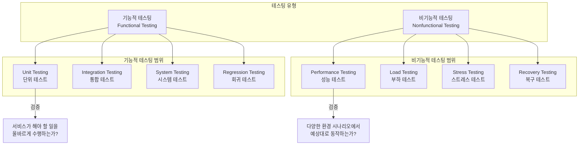

#### 테스팅 유형 비교

| 구분 | 기능적 테스팅 | 비기능적 테스팅 |
|------|--------------|----------------|
| **목적** | 서비스가 해야 할 일 수행 검증 | 환경 조건별 동작 검증 |
| **단위 테스트** | 개별 함수/메서드 검증 | - |
| **통합 테스트** | 컴포넌트 간 상호작용 | - |
| **성능 테스트** | - | 처리량, 지연시간 측정 |
| **부하 테스트** | - | 고부하 상황 동작 검증 |
| **복구 테스트** | - | 장애 후 복구 능력 검증 |

---

### 2. 토폴로지 함수 단위 테스팅 (Unit-Testing Topology Functions)

#### 2.1 Stateless 함수 테스팅

Stateless 함수는 이전 호출의 상태를 필요로 하지 않아 **독립적으로 테스트하기 쉽다**.

```java
// 토폴로지 정의 예시
myInputStream
    .filter(myFilterFunction)  // Stateless 필터
    .map(myMapFunction)        // Stateless 매핑
    .to(outputStream)
```

**테스팅 포인트**:
- `myFilterFunction`: 필터 조건 경계값 테스트
- `myMapFunction`: 변환 로직 검증
- **Corner Case**: null 값, 최대값, 경계 조건 필수 테스트

#### 2.2 Stateful 함수 테스팅

Stateful 함수는 **시간과 입력 이벤트에 따라 상태가 변화**하므로 더 복잡하다.

```java
// Stateful 집계 함수 예시
public Long addValueToAggregation(String key, Long eventValue) {
    // 데이터 스토어가 단위 테스트 환경에서 사용 가능해야 함
    Long storedValue = datastore.getOrElse(key, 0L);

    // 값을 합산하고 State Store에 저장
    Long sum = storedValue + eventValue;
    datastore.upsert(key, sum);
    return sum;
}
```

**Stateful 테스팅 전략**:

| 전략 | 설명 | 장점 | 단점 |
|------|------|------|------|
| **Mocking** | 데이터 스토어를 Mock 객체로 대체 | 고성능, 빠른 실행 | 실제 구현과 차이 가능 |
| **로컬 인스턴스** | 실제 데이터 스토어의 로컬 버전 | 실제 동작과 유사 | 오버헤드 증가 |
| **In-Memory Store** | 메모리 기반 임시 저장소 | 빠른 테스트 | 제한된 기능 |

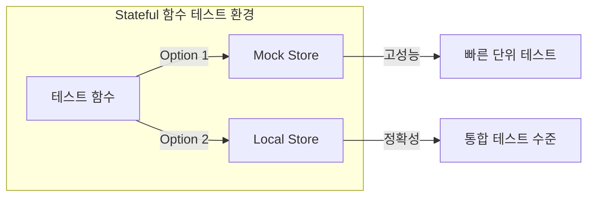

#### 2.3 토폴로지 테스팅 (Testing the Topology)

프레임워크별로 제공하는 **토폴로지 테스팅 도구**:

| 프레임워크 | 테스팅 도구 | 특징 |
|-----------|-----------|------|
| **Kafka Streams** | TopologyTestDriver | 이벤트 브로커 없이 토폴로지 테스트 |
| **Apache Spark** | StreamingSuiteBase, spark-fast-tests, MemoryStream | 서드파티 및 내장 옵션 |
| **Apache Flink** | Flink Testing Utilities | 자체 토폴로지 테스트 옵션 |
| **Apache Beam** | Beam Testing | 자체 테스팅 프레임워크 |

```java
// 토폴로지 정의 예시
myInputStream
    .map(myMapFunction)      // 단위 테스트 가능
    .groupByKey()            // 프레임워크 연산 - 토폴로지 테스트 필요
    .reduce(myReduceFunction) // 단위 테스트 가능
```

**토폴로지 테스팅이 필요한 이유**:
- `map`, `groupByKey`, `reduce` 등의 **프레임워크 연산**은 단위 테스트로 재현 불가
- 시간 기반 집계, 이벤트 스케줄링, Stateful 함수의 통합 동작 검증

---

### 3. 스키마 진화 및 호환성 테스팅 (Testing Schema Evolution)

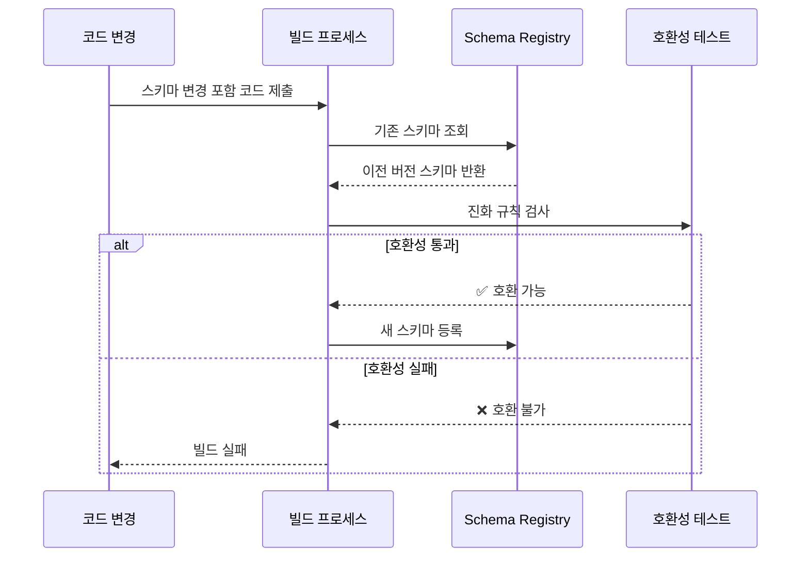

**스키마 테스팅 방법**:
1. Schema Registry에서 기존 스키마 Pull
2. 코드 제출 프로세스의 일부로 진화 규칙 검사 수행
3. 컴파일 타임에 자동 생성된 스키마와 이전 버전 비교

---

### 4. 통합 테스팅 (Integration Testing)

#### 4.1 통합 테스팅의 두 가지 유형

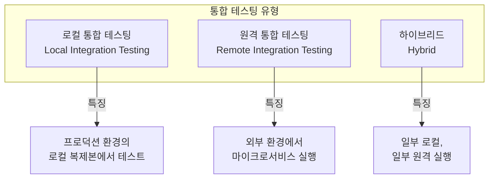

#### 4.2 통합 테스팅 전 고려 질문

| 질문 | 고려사항 |
|------|---------|
| **테스팅 목적** | 단순 실행 확인? 스모크 테스트? 복잡한 워크플로우 검증? |
| **재시작 지원** | 전체 데이터 손실 시 입력 스트림 처음부터 재처리 가능? |
| **데이터 요구사항** | 수동 생성? 프로그래밍 생성? 실제 프로덕션 데이터? |
| **성능 테스트** | 성능, 부하, 처리량, 스케일링 테스트 필요? |
| **표준화** | 각 마이크로서비스마다 자체 솔루션 필요 방지 방법? |

---

### 5. 로컬 통합 테스팅 (Local Integration Testing)

#### 5.1 로컬 환경 구성 요소

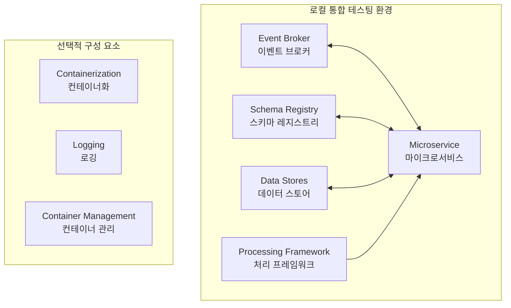

#### 5.2 각 구성 요소별 테스트 기능

**Event Broker**:
- 이벤트 스트림 생성/삭제
- 시간 기반 로직 테스트를 위한 선택적 이벤트 순서 지정
- 파티션 수 변경
- 브로커 장애 및 복구 유도
- 이벤트 스트림 가용성 장애 및 복구 유도

**Schema Registry**:
- 진화 호환 스키마 발행 및 입력 이벤트 생성에 사용
- 장애 및 복구 유도

**Data Stores**:
- 기존 테이블 스키마 변경
- Stored Procedure 변경
- 애플리케이션 인스턴스 수 변경 시 내부 상태 재구축
- 장애 및 복구 유도

**Processing Framework (해당 시)**:
- Internal Event Stream(경량) 또는 Shuffle 메커니즘(헤비웨이트)을 통한 셔플링
- 체크포인팅, 장애, 체크포인트에서 복구
- Worker 인스턴스 장애 유도 (헤비웨이트)

**Application**:
- 인스턴스 수 스케일링
- 리밸런싱 정상 동작 확인
- 내부 상태 복원 검증
- 외부 상태 접근 영향 없음 확인
- 요청-응답 접근 영향 없음 확인

#### 5.3 로컬 환경 구성 방법

##### Option 1: 테스트 코드 런타임 내 임시 환경

```java
// 의사 코드 - 선언 및 인스턴스화 생략
broker.start(brokerUrl, brokerPort, ...);
schemaRegistry.start(schemaRegistryUrl, srPort, ...);

// 첫 번째 마이크로서비스 인스턴스
topologyOne.start(brokerUrl, schemaRegistryUrl,
  inputStreamOne, inputStreamTwo ...);

// 동일 마이크로서비스의 두 번째 인스턴스
topologyTwo.start(brokerUrl, schemaRegistryUrl,
  inputStream, inputStreamTwo, ...);

// 입력 스트림 1에 테스트 데이터 발행
producer.publish(inputStreamOne, ...);
// 입력 스트림 2에 테스트 데이터 발행
producer.publish(inputStreamTwo, ...);

// 잠시 대기 (최선의 방법은 아님)
Thread.sleep(5000);

// topologyOne 장애 시뮬레이션
topologyOne.stop();

// 출력 토픽 결과 확인
event = consumer.consume(outputTopic, ...)

// 나머지 컴포넌트 종료
topologyTwo.stop();
schemaRegistry.stop();
broker.stop();

if (event ...) // 컨슈머 출력 검증
  // 테스트 통과
else
  // 테스트 실패
```

**제약사항**: JVM 기반 접근법 (Kafka, Confluent Schema Registry 모두 JVM 기반)

##### Option 2: 테스트 코드 외부 임시 환경 (컨테이너화)

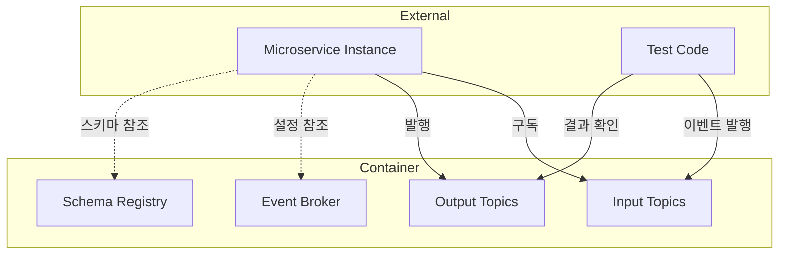

**장점**:
- 모든 프로그래밍 언어에서 사용 가능
- 팀 간 공유 및 재사용 가능
- 오픈소스 기여 모델로 유지보수

#### 5.4 호스팅 서비스 통합 (Mocking/Simulator)

| 서비스 | 로컬 옵션 | 비고 |
|--------|----------|------|
| **Google PubSub** | ✅ Emulator 제공 | 충분한 로컬 테스팅 기능 |
| **Amazon Kinesis** | ✅ LocalStack | 오픈소스 에뮬레이터 |
| **Azure Event Hubs** | ❌ 없음 | Kafka 클라이언트 사용 가능 (제한적) |
| **Google Cloud Functions** | ✅ 로컬 테스팅 라이브러리 | |
| **AWS Lambda** | ✅ 로컬 테스팅 라이브러리 | |
| **Azure Functions** | ✅ 로컬 테스팅 라이브러리 | |
| **OpenWhisk/OpenFaaS/Kubeless** | ✅ 자체 테스팅 메커니즘 | 오픈소스 FaaS |

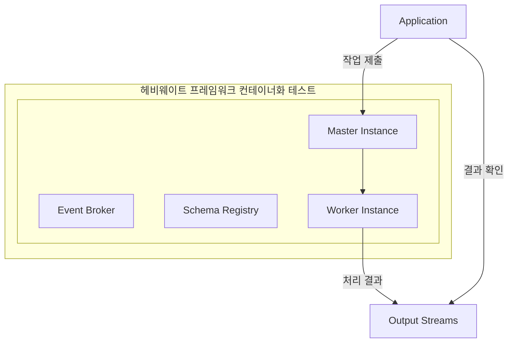

---

### 6. 전체 원격 통합 테스팅 (Full Remote Integration Testing)

#### 6.1 세 가지 전략

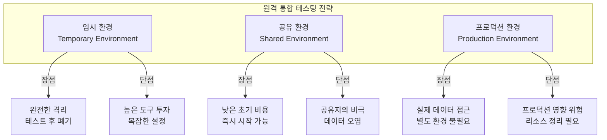

#### 6.2 이벤트 스트림 데이터 채우기 전략

##### 전략 1: 프로덕션에서 복사

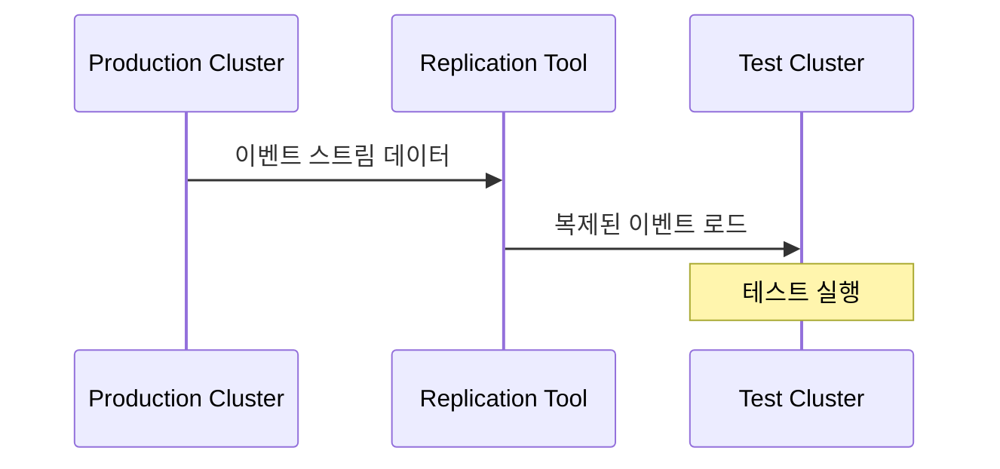

| 장점 | 단점 |
|------|------|
| 프로덕션 데이터 정확히 반영 | 프로덕션 성능 영향 가능 |
| 필요한 만큼 이벤트 복사 가능 | 대량 데이터 복사 시 시간 소요 |
| 완전히 격리된 환경 | 민감 정보 처리 필요 |

##### 전략 2: 큐레이션된 테스트 데이터

| 장점 | 단점 |
|------|------|
| 작은 데이터 세트 | 유지보수 오버헤드 큼 |
| 특정 값/관계 보장 | 데이터 진부화 가능 |
| 프로덕션 영향 없음 | 새 이벤트 스트림 대응 필요 |
| | 스키마 변경 대응 필요 |

##### 전략 3: 스키마 기반 Mock 이벤트 생성

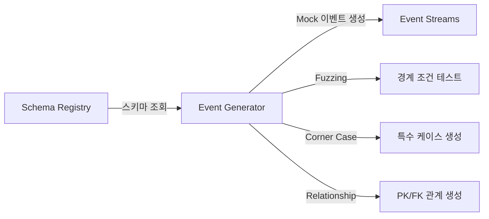

| 장점 | 단점 |
|------|------|
| 프로덕션 영향 없음 | 현실적 데이터 생성에 주의 필요 |
| Fuzzing으로 경계 조건 테스트 | 프로덕션 분포와 다를 수 있음 |
| 프로덕션에 없는 케이스 생성 가능 | 특정 필드 파싱 실패 가능성 |
| 서드파티 도구 활용 가능 | |

#### 6.3 공유 환경 테스팅의 문제점

> **경고**: 공유 환경은 사용성 측면에서 **최악의 옵션**이 될 수 있다.
> 이벤트 브로커가 결국 혼란스러운 이벤트 스트림과 깨진 데이터의 덤핑 그라운드가 된다.

**"공유지의 비극" 현상**:
- `-testing-01`, `-testing-02`, `-testing-02-final`, `-testing-02-final-v2` 같은 스트림 난립
- 어떤 스트림이 유효한 테스트 입력인지 구분 어려움
- 이벤트 데이터 신뢰성, 최신성, 스키마 정합성 불확실
- 부족한 도구 투자 시 발생하는 전형적인 결과

**완화 전략**:
- 깨끗하고 신뢰할 수 있는 소스 스트림 명확히 표시
- 미사용 테스팅 아티팩트 삭제
- 명확한 네이밍 컨벤션
- 이벤트 스트림 쓰기 제한
- 성능/부하 테스트 조율

#### 6.4 프로덕션 환경 테스팅

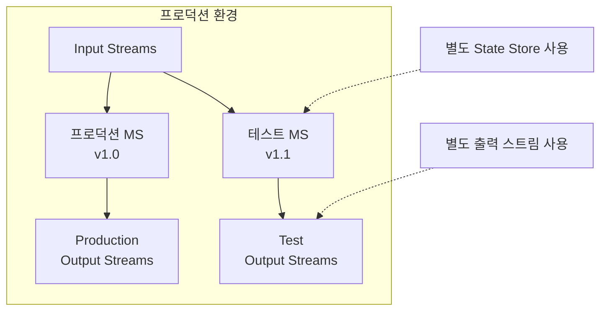

| 장점 | 단점 |
|------|------|
| 프로덕션 이벤트 완전 접근 | 프로덕션 용량 영향 위험 |
| 프로덕션 보안 모델 활용 | 성능/부하 테스트에 부적합 |
| 스모크 테스트에 적합 | 테스트 리소스 정리 필요 |
| 별도 환경 유지 불필요 | 테스트 서비스와 실제 서비스 구분 도구 필요 |

---

### 7. 테스팅 전략 선택 가이드

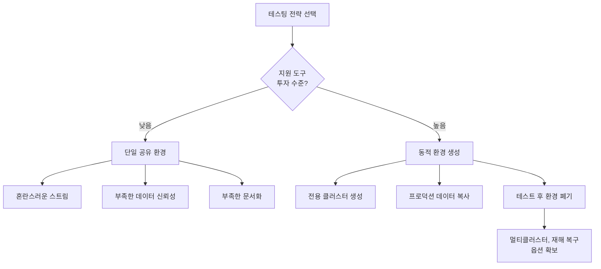

#### 도구 투자 수준별 결과

| 투자 수준 | 환경 유형 | 결과 |
|----------|----------|------|
| **낮음** | 단일 공유 클러스터 | 스트림 혼란, 부족한 관리, 높은 비용 |
| **높음** | 동적 전용 클러스터 | 격리된 환경, 깔끔한 정리, 멀티클러스터 역량 |

---

## 심화 학습

### 1. 테스팅 피라미드와 EDM

```
                    /\
                   /  \
                  / E2E \        ← 적음: 전체 원격 통합 테스트
                 /______\
                /        \
               /Integration\     ← 중간: 로컬 통합 테스트
              /______________\
             /                \
            /    Unit Tests    \  ← 많음: 토폴로지 함수 단위 테스트
           /____________________\
```

### 2. 테스팅 도구 체인

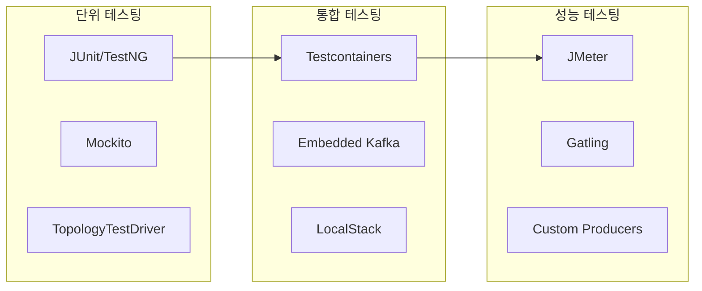

### 3. Chaos Engineering과 EDM 테스팅

| Chaos 유형 | 테스트 시나리오 | 검증 항목 |
|-----------|----------------|----------|
| **브로커 장애** | 리더 파티션 브로커 종료 | 페일오버, 데이터 무손실 |
| **네트워크 분할** | 컨슈머-브로커 연결 끊김 | 재연결, 리밸런싱 |
| **인스턴스 장애** | 워커 노드 강제 종료 | 상태 복구, 재처리 |
| **지연 주입** | 이벤트 처리 지연 | 백프레셔, 타임아웃 |

---

## 실무 적용 포인트

### 1. 단위 테스팅 우선순위

```
1. Stateless 함수 → 가장 쉬움, 먼저 작성
2. Stateful 함수 → Mock 또는 In-Memory Store 사용
3. 토폴로지 테스트 → 프레임워크 제공 도구 활용
4. 스키마 호환성 → CI/CD 파이프라인에 통합
```

### 2. 로컬 통합 테스팅 환경 구축 패턴

```yaml
# docker-compose.yml 예시
version: '3'
services:
  broker:
    image: confluentinc/cp-kafka:latest
    ports:
      - "9092:9092"

  schema-registry:
    image: confluentinc/cp-schema-registry:latest
    depends_on:
      - broker
    ports:
      - "8081:8081"

  # 테스트 대상 마이크로서비스는 외부에서 실행
```

### 3. 이벤트 데이터 전략 결정 트리

```
테스트 목적이 무엇인가?
├─ 기능 검증 → 큐레이션된 테스트 데이터 또는 Mock 생성
├─ 성능 테스트 → 프로덕션 데이터 복사 (볼륨 중요)
├─ 엣지 케이스 → Mock 생성 + Fuzzing
└─ 스모크 테스트 → 프로덕션 환경 직접 사용
```

---

## 체크리스트

### 단위 테스팅
- [ ] Stateless 함수에 대한 단위 테스트 작성
- [ ] Stateful 함수에 대한 Mock 기반 테스트 작성
- [ ] 경계 조건 (null, 최대값) 테스트 포함
- [ ] 프레임워크 제공 토폴로지 테스트 도구 활용

### 스키마 테스팅
- [ ] 스키마 진화 규칙 검사를 CI/CD에 통합
- [ ] 이전 버전 스키마와의 호환성 자동 검증

### 로컬 통합 테스팅
- [ ] 컨테이너화된 테스트 환경 구축
- [ ] 이벤트 브로커, 스키마 레지스트리, 데이터 스토어 포함
- [ ] 장애 시나리오 테스트 케이스 작성
- [ ] 스케일링 테스트 (인스턴스 수 변경) 포함

### 원격 통합 테스팅
- [ ] 테스트 환경 전략 결정 (임시/공유/프로덕션)
- [ ] 이벤트 데이터 채우기 전략 결정
- [ ] 테스트 아티팩트 정리 프로세스 수립
- [ ] 성능/부하 테스트 계획 수립

### 도구 투자
- [ ] 프로그래밍 방식 환경 생성 도구 구축
- [ ] 크로스 클러스터 이벤트 복사 도구 구축
- [ ] 테스트 환경 표준화 및 팀 간 공유

---

## 참고 자료

- Apache Kafka: TopologyTestDriver 문서
- Testcontainers: 통합 테스트를 위한 컨테이너 라이브러리
- LocalStack: AWS 서비스 로컬 에뮬레이터
- Chaos Monkey: Netflix의 Chaos Engineering 도구

---

## 핵심 용어 정리

| 용어 | 영문 | 설명 |
|------|------|------|
| 기능적 테스팅 | Functional Testing | 서비스가 명세대로 동작하는지 검증 |
| 비기능적 테스팅 | Nonfunctional Testing | 성능, 부하, 복구 등 품질 속성 검증 |
| 토폴로지 테스팅 | Topology Testing | 전체 스트림 처리 토폴로지의 통합 테스트 |
| 스키마 진화 | Schema Evolution | 스키마 버전 간 호환성 유지하며 변경 |
| 로컬 통합 테스팅 | Local Integration Testing | 프로덕션 복제 로컬 환경에서의 테스트 |
| 원격 통합 테스팅 | Remote Integration Testing | 외부 환경에서 마이크로서비스 실행 테스트 |
| 임시 환경 | Temporary Environment | 테스트 후 폐기되는 일회용 환경 |
| 공유 환경 | Shared Environment | 여러 팀이 공유하는 테스트 환경 |
| 큐레이션된 데이터 | Curated Data | 특정 테스트 목적으로 준비된 데이터 세트 |
| Mock 이벤트 | Mock Events | 스키마 기반으로 프로그래밍 생성된 이벤트 |
| 공유지의 비극 | Tragedy of the Commons | 공유 자원의 남용으로 인한 품질 저하 |
| Fuzzing | Fuzzing | 무작위/경계값 입력으로 결함 찾는 기법 |
| TopologyTestDriver | TopologyTestDriver | Kafka Streams 토폴로지 테스트 도구 |
| Testcontainers | Testcontainers | 통합 테스트용 Docker 컨테이너 라이브러리 |
| LocalStack | LocalStack | AWS 서비스 로컬 에뮬레이션 도구 |
