# Chapter 16. 이벤트 기반 마이크로서비스 배포

## 핵심 요약

> **마이크로서비스의 수가 증가할수록 표준화된 배포 프로세스의 중요성이 높아진다.**
> 수십 개의 서비스는 몇 가지 커스텀 배포 프로세스로 관리할 수 있지만,
> 마이크로서비스에 진지하게 투자하는 조직은 반드시 표준화와 배포 프로세스 간소화에 투자해야 한다.
> CI/CD 파이프라인과 컨테이너 관리 시스템은 이러한 "마이크로서비스 세금(Microservice Tax)"의 핵심이다.

---

## 학습 목표

이 챕터를 통해 다음을 이해할 수 있습니다:

1. **배포 원칙**: 팀 자율성, 표준화, SLA 준수의 중요성
2. **아키텍처 구성요소**: CI/CD 시스템과 컨테이너 관리 시스템(CMS)
3. **배포 패턴**: Full-Stop, Rolling Update, Blue-Green 패턴
4. **Breaking Schema Change**: 점진적 마이그레이션 vs 동기화 마이그레이션
5. **배포 시 고려사항**: 의존 서비스 영향, 이벤트 스트림 재처리

---

## 본문 정리

### 1. 마이크로서비스 배포 원칙 (Principles of Microservice Deployment)

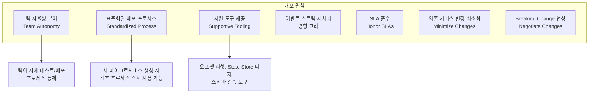

#### 배포 원칙 상세

| 원칙 | 설명 | 주의사항 |
|------|------|---------|
| **팀 자율성** | 팀이 자체적으로 테스트/배포 통제 | 팀의 재량에 따라 배포 가능해야 함 |
| **표준화** | 서비스 간 일관된 배포 프로세스 | CI 프레임워크로 주로 구현 |
| **지원 도구** | Consumer Group 오프셋 리셋, State Store 리셋 등 | 자동화 및 자율성 지원 |
| **재처리 영향** | 대용량 출력 이벤트로 하류 서비스 부하 | 부작용 고려 (예: 프로모션 이메일 재발송) |
| **SLA 준수** | State Store 재구축으로 인한 다운타임 고려 | 배포 중 모든 SLA 준수 필요 |
| **변경 최소화** | 다른 서비스의 API/데이터 모델 변경 최소화 | 타 팀 자율성 침해 방지 |
| **협상** | Breaking Schema Change 시 사전 협의 | 마이그레이션 계획 수립 필수 |

> **⚠️ 경고**: 마이크로서비스는 **독립적으로 배포 가능**해야 한다.
> 특정 서비스 배포가 다른 서비스의 동기화 배포를 정기적으로 요구한다면,
> 이는 **Bounded Context가 잘못 정의**되었다는 신호이다.

---

### 2. 배포 아키텍처 구성요소 (Architectural Components)

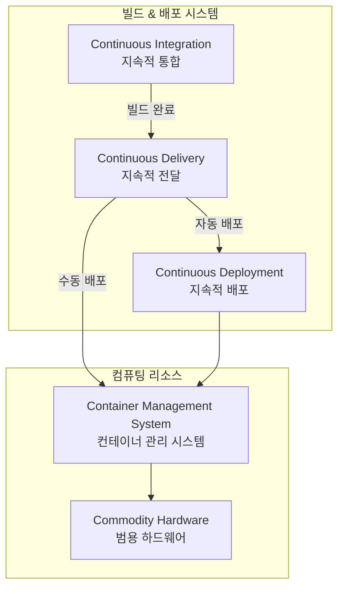

#### 2.1 CI/CD 시스템

| 단계 | 영문 | 설명 | 자동화 수준 |
|------|------|------|-----------|
| **지속적 통합** | Continuous Integration | 코드 변경 자동 통합, 빌드, 테스트 | 빌드까지 자동 |
| **지속적 전달** | Continuous Delivery | 배포 가능 상태 유지, 수동 배포 | 배포 준비까지 자동 |
| **지속적 배포** | Continuous Deployment | 프로덕션까지 자동 배포 | 완전 자동 |

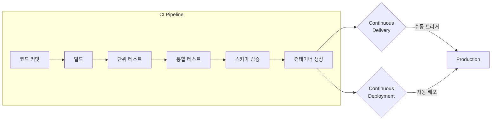

**CI 파이프라인에서 수행하는 작업**:
- 빌드 작업 (Build Operations)
- 단위 테스트 (Unit Testing)
- 통합 테스트 (Integration Testing)
- 코드 스타일 검증
- 스키마 진화 검증
- **출력**: 배포 준비된 컨테이너 또는 VM

> **⚠️ 경고**: **지속적 배포는 실제로 수행하기 어렵다.**
> Stateful 서비스는 State Store 재구축과 이벤트 스트림 재처리가 필요할 수 있어
> 의존 서비스에 특히 파괴적일 수 있다.

#### 2.2 컨테이너 관리 시스템 (CMS)

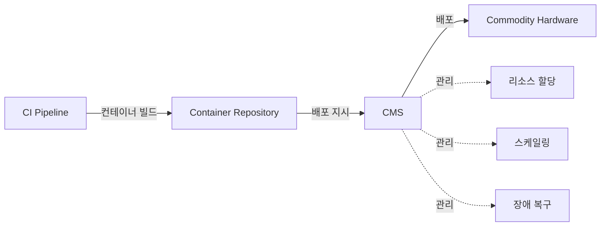

**범용 하드웨어(Commodity Hardware) 장점**:
- 저렴하고 안정적인 성능
- 수평 확장 지원
- 필요에 따라 리소스 풀 추가/제거 가능
- 장애 인스턴스는 새 하드웨어에 재배포

**특수 리소스 풀**:
- **메모리 집약적**: 캐싱 목적
- **프로세서 집약적**: 고성능 처리 요구 애플리케이션

---

### 3. Basic Full-Stop 배포 패턴

가장 기본적인 배포 패턴으로, 모든 다른 패턴의 기반이 된다.

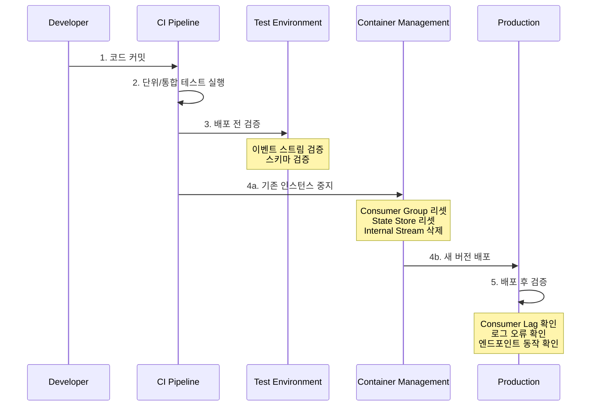

#### Full-Stop 배포 단계

| 단계 | 작업 | 상세 |
|------|------|------|
| **1. 코드 커밋** | 마스터 브랜치 병합 | Commit Hook으로 CI 파이프라인 시작 |
| **2. 자동 테스트** | 단위/통합 테스트 | 임시 환경 생성 및 데이터 채우기 |
| **3. 배포 전 검증** | 이벤트 스트림/스키마 검증 | 입출력 스트림 존재, 권한, 스키마 호환성 |
| **4. 배포** | 중지 → 정리 → 배포 | State Store 리셋, Consumer Group 리셋 |
| **5. 배포 후 검증** | 정상 동작 확인 | Consumer Lag, 로그 오류, 엔드포인트 |

**3단계: 배포 전 검증 상세**

```
이벤트 스트림 검증:
├─ 입력 스트림 존재 확인
├─ 출력 스트림 존재 (또는 자동 생성 가능) 확인
└─ 읽기/쓰기 권한 확인

스키마 검증:
├─ 입력 스키마 진화 규칙 준수 확인
├─ 출력 스키마 진화 규칙 준수 확인
└─ 스키마-이벤트 스트림 매핑 검증
```

**4단계: 배포 시 고려사항**

| 옵션 | 설명 | 장점 | 단점 |
|------|------|------|------|
| **리셋 후 배포** | State Store, Consumer Group, Internal Topic 리셋 | 깨끗한 시작 | 재처리 시간 소요 |
| **신규 서비스로 배포** | 기존 상태 유지, 새 서비스로 배포 | 빠른 롤백 가능 | 리소스 중복 사용 |

> **⚠️ 경고**: 모든 의존 서비스에 대한 영향을 고려해야 한다.
> SLA, 다운타임, 스트림 처리 따라잡기 시간, 출력 이벤트 부하, 새 이벤트 스트림, Breaking Schema Change

---

### 4. Rolling Update 패턴

서비스를 실행 중인 상태로 유지하면서 개별 인스턴스를 업데이트하는 패턴.

#### 4.1 전제조건

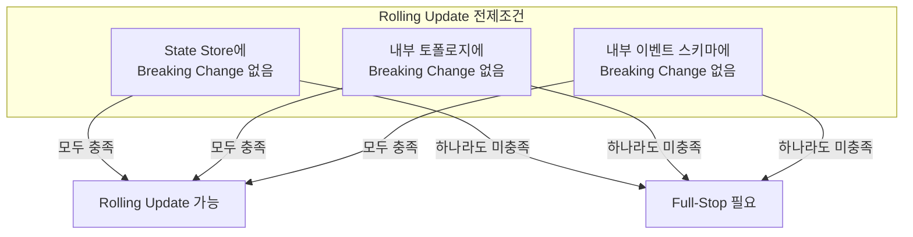

#### 4.2 적합한 시나리오

| 시나리오 | 설명 |
|---------|------|
| **새 필드 추가** | 입력 이벤트에 새 필드 추가, 비즈니스 로직 반영 |
| **새 입력 스트림** | 새로운 입력 스트림 소비 시작 |
| **버그 수정** | 재처리 필요 없는 버그 수정 |

#### 4.3 Rolling Update 프로세스

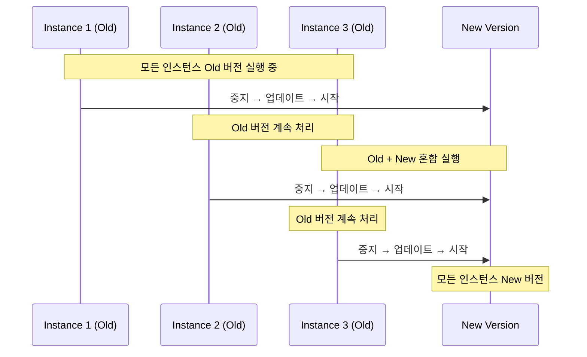

**장점**:
- 거의 실시간 처리 중단 없이 서비스 업데이트
- 다운타임 제거

**단점**:
- 전제조건 제약으로 특정 시나리오에서만 사용 가능
- 잠시 동안 Old/New 로직이 동시에 실행됨

> **💡 팁**: 스마트한 구현은 릴리스의 호환성을 자동으로 검사하여
> Rolling Update가 유효한지 알려준다. 수동 검사는 오류 발생 가능성이 높다.

> **⚠️ 경고**: **내부 토폴로지를 실수로 변경**하는 것이 이 패턴 사용 시
> 가장 흔한 실수이다. 이는 Breaking Change이며 Full-Stop이 필요하다.

---

### 5. Breaking Schema Change 패턴

Breaking Schema Change는 때때로 불가피하며, 여러 의존성을 고려해야 한다.

#### 5.1 엔티티 vs 비엔티티 이벤트의 차이

| 구분 | 엔티티 이벤트 | 비엔티티 이벤트 |
|------|-------------|----------------|
| **복잡도** | 더 복잡 | 상대적으로 단순 |
| **이유** | 컨슈머 구체화를 위한 일관된 정의 필요 | 재처리 빈도 낮음 |
| **재생성** | 새 스키마로 스트림 재생성 필요 | 종종 새 스트림 추가만으로 해결 |
| **처리** | 소스 데이터 재처리 필요 | 이전 이벤트 만료 후 제거 가능 |

#### 5.2 프로듀서 옵션

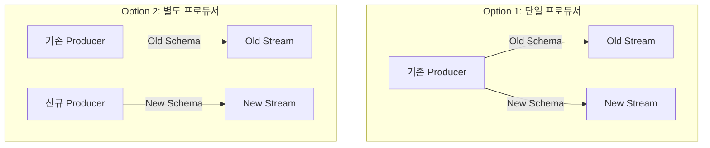

| 옵션 | 장점 | 단점 |
|------|------|------|
| **단일 프로듀서** | 모든 로직이 하나의 서비스에 캡슐화 | 기존 프로듀서 변경 필요 |
| **별도 프로듀서** | 기존 프로듀서 중단 없이 운영 | 서비스 증가 |

#### 5.3 마이그레이션 전략

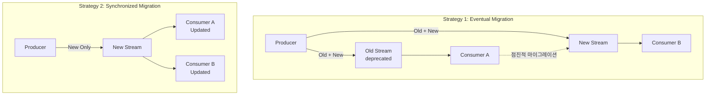

##### 전략 1: 두 이벤트 스트림을 통한 점진적 마이그레이션 (Eventual Migration)

| 항목 | 설명 |
|------|------|
| **동작** | 프로듀서가 Old/New 두 포맷으로 각 스트림에 이벤트 생성 |
| **가정 1** | Old/New 모두 생성 가능한 데이터 보유 |
| **가정 2** | 점진적 마이그레이션이 하류 불일치 유발하지 않음 |
| **위험** | 마이그레이션이 완료되지 않고 두 스트림이 무기한 사용될 수 있음 |

> **⚡ 주의**: 점진적 마이그레이션의 가장 큰 위험은 **마이그레이션이 완료되지 않는 것**이다.
> 메타데이터 태깅으로 스트림을 deprecated로 표시하고, 마이그레이션 기간을 짧게 유지하라.

##### 전략 2: 새 이벤트 스트림으로 동기화 마이그레이션 (Synchronized Migration)

| 항목 | 설명 |
|------|------|
| **동작** | 프로듀서가 새 포맷으로만 이벤트 생성, Old 스트림 업데이트 중단 |
| **가정 1** | 이벤트 정의 변경이 너무 커서 Old 포맷 유지 불가 |
| **가정 2** | 하류 불일치 방지를 위해 동기화 마이그레이션 필수 |
| **위험** | 컨슈머가 마이그레이션 실패 시 이전 데이터로 폴백 불가 |

> **📝 참고**: 동기화 마이그레이션은 실제로 드물다.
> 핵심 비즈니스 엔티티는 매우 안정적인 도메인 모델을 가지지만,
> 주요 Breaking Change 발생 시 동기화 마이그레이션이 불가피할 수 있다.

---

### 6. Blue-Green 배포 패턴

제로 다운타임으로 새 기능을 배포하는 패턴.

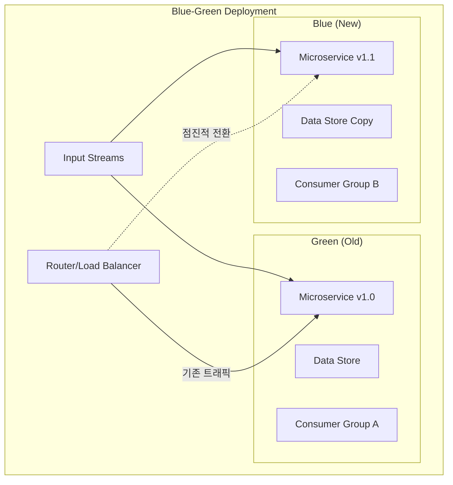

#### Blue-Green 배포 프로세스

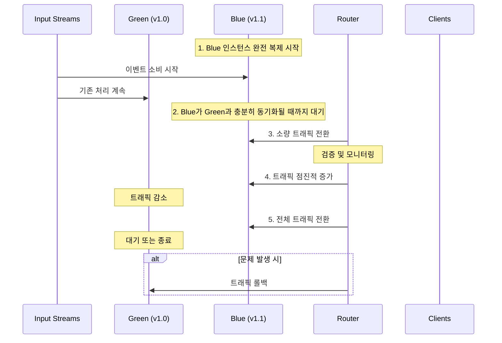

#### Blue-Green 배포 구성요소

| 구성요소 | Blue (New) | Green (Old) |
|---------|-----------|-------------|
| **마이크로서비스** | v1.1 인스턴스 | v1.0 인스턴스 |
| **데이터 스토어** | 완전히 격리된 복사본 | 기존 스토어 |
| **Consumer Group** | 별도 Consumer Group | 기존 Consumer Group |
| **IP 주소** | 별도 IP | 기존 IP |

#### 적용 가능 시나리오

| 시나리오 | Blue-Green 적합 여부 | 이유 |
|---------|---------------------|------|
| **이벤트 스트림 소비** | ✅ 적합 | 격리된 Consumer Group으로 독립 처리 |
| **요청-응답 → 이벤트 변환** | ✅ 적합 | 요청 기반 이벤트 생성 |
| **입력 이벤트 → 출력 이벤트** | ❌ 부적합 | 두 서비스가 결과 덮어쓰기/중복 생성 |

> **⚠️ 경고**: Blue-Green 배포는 **입력 이벤트 스트림에 반응하여 출력 스트림에 이벤트를 생성**하는
> 마이크로서비스에는 작동하지 않는다. 엔티티 스트림의 경우 결과를 덮어쓰고,
> 이벤트 스트림의 경우 중복 이벤트를 생성한다.
> 대신 **Rolling Update 패턴** 또는 **Basic Full-Stop 패턴**을 사용하라.

#### 모니터링 통합 필수 항목

```
색상 전환 프로세스에 통합해야 할 모니터링:
├─ 리소스 사용량 메트릭
├─ Consumer Group Lag
├─ 오토스케일링 트리거
└─ 시스템 알림
```

---

### 7. 배포 패턴 선택 가이드

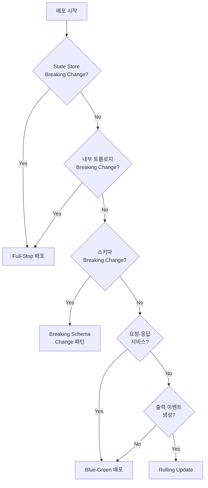

#### 패턴별 비교

| 패턴 | 다운타임 | 복잡도 | 사용 시나리오 |
|------|---------|--------|--------------|
| **Full-Stop** | 있음 | 낮음 | State Store 리셋, 주요 변경 |
| **Rolling Update** | 없음 | 중간 | 마이너 업데이트, 버그 수정 |
| **Blue-Green** | 없음 | 높음 | 요청-응답 서비스, 제로 다운타임 |
| **Breaking Schema** | 가변 | 높음 | 도메인 모델 변경 |

---

## 심화 학습

### 1. 마이크로서비스 세금 (Microservice Tax)

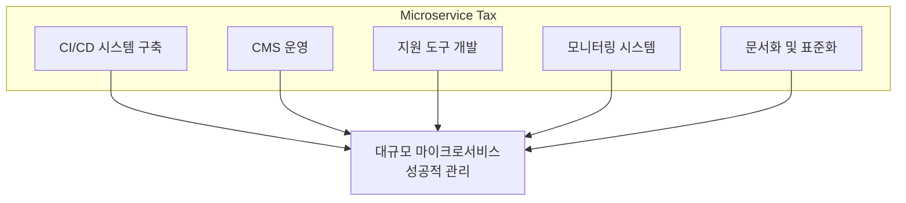

### 2. 배포 자동화 성숙도 모델

| 수준 | 설명 | 특징 |
|------|------|------|
| **Level 1** | 수동 배포 | 스크립트 기반, 팀별 상이한 프로세스 |
| **Level 2** | CI 구축 | 자동 빌드/테스트, 수동 배포 |
| **Level 3** | CD (Delivery) | 배포 준비 자동화, 버튼 하나로 배포 |
| **Level 4** | CD (Deployment) | 완전 자동화, 코드 커밋 → 프로덕션 |
| **Level 5** | GitOps | 선언적 인프라, 자동 복구, 감사 추적 |

### 3. 롤백 전략

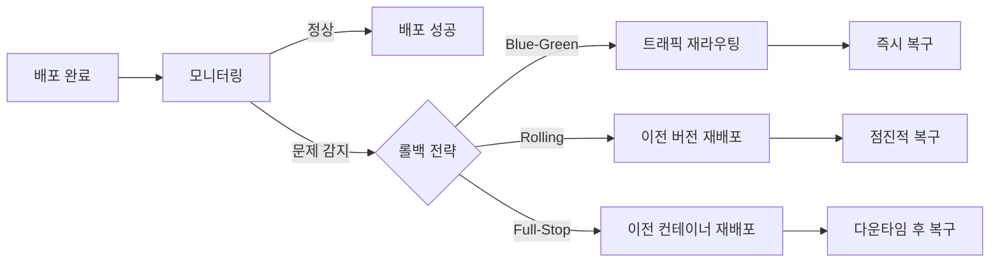

---

## 실무 적용 포인트

### 1. CI/CD 파이프라인 구성 체크리스트

```yaml
# 예시 CI/CD 파이프라인 단계
stages:
  - build:
      - compile
      - unit-test

  - validate:
      - schema-compatibility-check
      - event-stream-permission-check

  - integration-test:
      - spin-up-test-environment
      - run-integration-tests
      - tear-down-environment

  - deploy:
      - stop-current-instances     # Full-Stop 시
      - reset-consumer-groups      # 필요 시
      - deploy-new-containers
      - health-check

  - post-deploy:
      - verify-consumer-lag
      - verify-endpoints
      - notify-stakeholders
```

### 2. 배포 전 검증 자동화

```
배포 전 자동 검증 항목:
├─ 입력 이벤트 스트림
│   ├─ 존재 여부 확인
│   ├─ 읽기 권한 확인
│   └─ 스키마 호환성 확인
├─ 출력 이벤트 스트림
│   ├─ 존재 여부 (또는 자동 생성 가능)
│   ├─ 쓰기 권한 확인
│   └─ 스키마 호환성 확인
└─ 외부 의존성
    ├─ 데이터 스토어 연결 확인
    └─ 외부 API 접근 확인
```

### 3. 의존 서비스 영향 체크리스트

| 항목 | 확인 내용 | 조치 |
|------|----------|------|
| **SLA** | 다운타임이 SLA 내인가? | 유지보수 윈도우 조정 |
| **재처리 시간** | 이벤트 스트림 따라잡기 시간 | 사전 알림 |
| **출력 부하** | 대량 이벤트 생성 여부 | 쓰로틀링 고려 |
| **스키마 변경** | Breaking Change 여부 | 사전 협의 |
| **API 변경** | 인터페이스 변경 여부 | 버전 관리 |

---

## 체크리스트

### 배포 인프라
- [ ] CI/CD 파이프라인 구축 완료
- [ ] 컨테이너 관리 시스템(CMS) 운영 중
- [ ] 컨테이너 레지스트리 구축
- [ ] 범용 하드웨어 리소스 풀 구성

### 배포 프로세스
- [ ] 표준화된 배포 프로세스 문서화
- [ ] 팀별 배포 자율성 확보
- [ ] 배포 전 자동 검증 구현
- [ ] 배포 후 자동 검증 구현

### 지원 도구
- [ ] Consumer Group 오프셋 리셋 도구
- [ ] State Store 퍼지 도구
- [ ] 스키마 호환성 검사 도구
- [ ] Internal Event Stream 관리 도구

### 배포 패턴 준비
- [ ] Full-Stop 배포 프로세스 정의
- [ ] Rolling Update 호환성 검사 자동화
- [ ] Blue-Green 환경 구성 가능
- [ ] Breaking Schema Change 마이그레이션 계획 템플릿

### 모니터링 및 롤백
- [ ] 배포 중 모니터링 대시보드
- [ ] Consumer Lag 알림 설정
- [ ] 롤백 절차 문서화 및 테스트
- [ ] 배포 실패 시 자동 롤백 구현

---

## 참고 자료

- Kubernetes Deployment Strategies 문서
- Argo CD - GitOps 지속적 배포 도구
- Spinnaker - 멀티클라우드 지속적 배포 플랫폼
- Jenkins - CI/CD 자동화 서버

---

## 핵심 용어 정리

| 용어 | 영문 | 설명 |
|------|------|------|
| 마이크로서비스 세금 | Microservice Tax | 마이크로서비스 성공적 관리를 위한 필수 인프라 투자 |
| 지속적 통합 | Continuous Integration (CI) | 코드 변경의 자동 통합, 빌드, 테스트 |
| 지속적 전달 | Continuous Delivery | 항상 배포 가능한 상태 유지, 수동 배포 |
| 지속적 배포 | Continuous Deployment | 프로덕션까지 완전 자동 배포 |
| 컨테이너 관리 시스템 | Container Management System | 컨테이너화된 애플리케이션 관리/배포/리소스 제어 |
| Full-Stop 배포 | Full-Stop Deployment | 모든 인스턴스 중지 후 새 버전 배포 |
| Rolling Update | Rolling Update | 인스턴스를 하나씩 업데이트하며 서비스 유지 |
| Blue-Green 배포 | Blue-Green Deployment | 신구 버전 병렬 운영 후 트래픽 전환 |
| 점진적 마이그레이션 | Eventual Migration | 두 스트림 운영하며 점진적 전환 |
| 동기화 마이그레이션 | Synchronized Migration | 모든 컨슈머 동시 전환 |
| 범용 하드웨어 | Commodity Hardware | 저렴하고 표준화된 하드웨어 |
| 배포 자율성 | Deployment Autonomy | 팀이 자체적으로 배포 시점/방법 결정 |
| 롤백 | Rollback | 배포 실패 시 이전 버전으로 복원 |
| 쿨다운 기간 | Cooldown Period | Blue-Green에서 이전 버전 대기 시간 |
