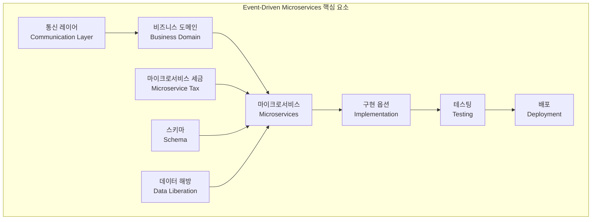
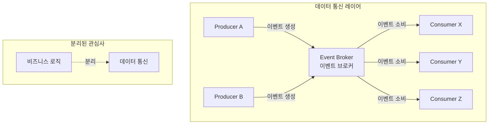
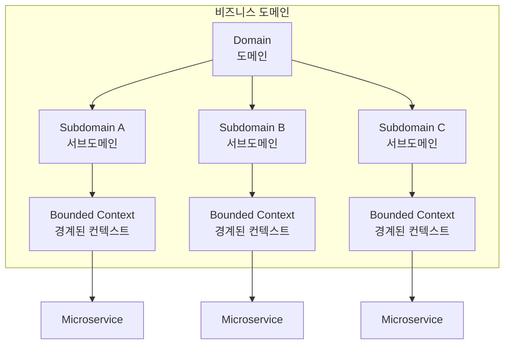
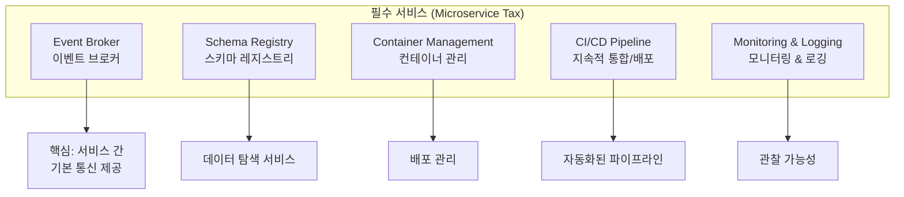
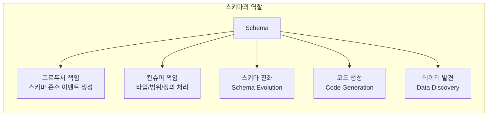
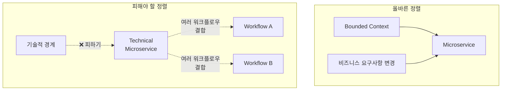
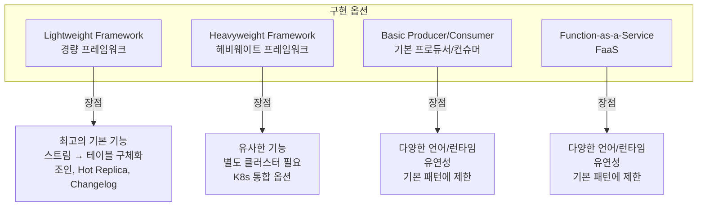
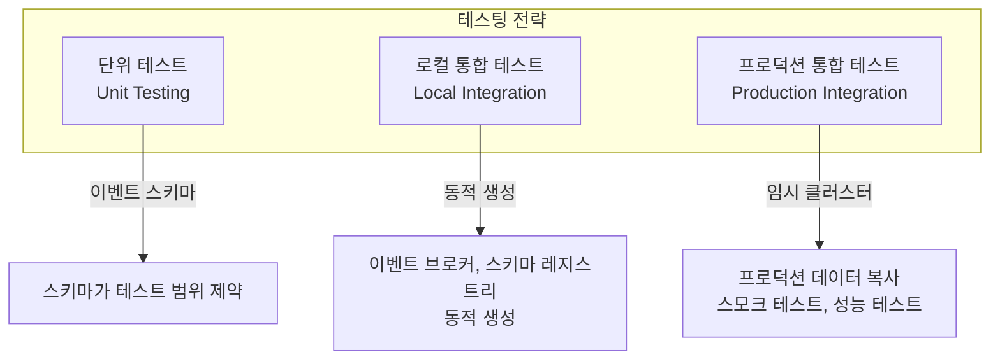
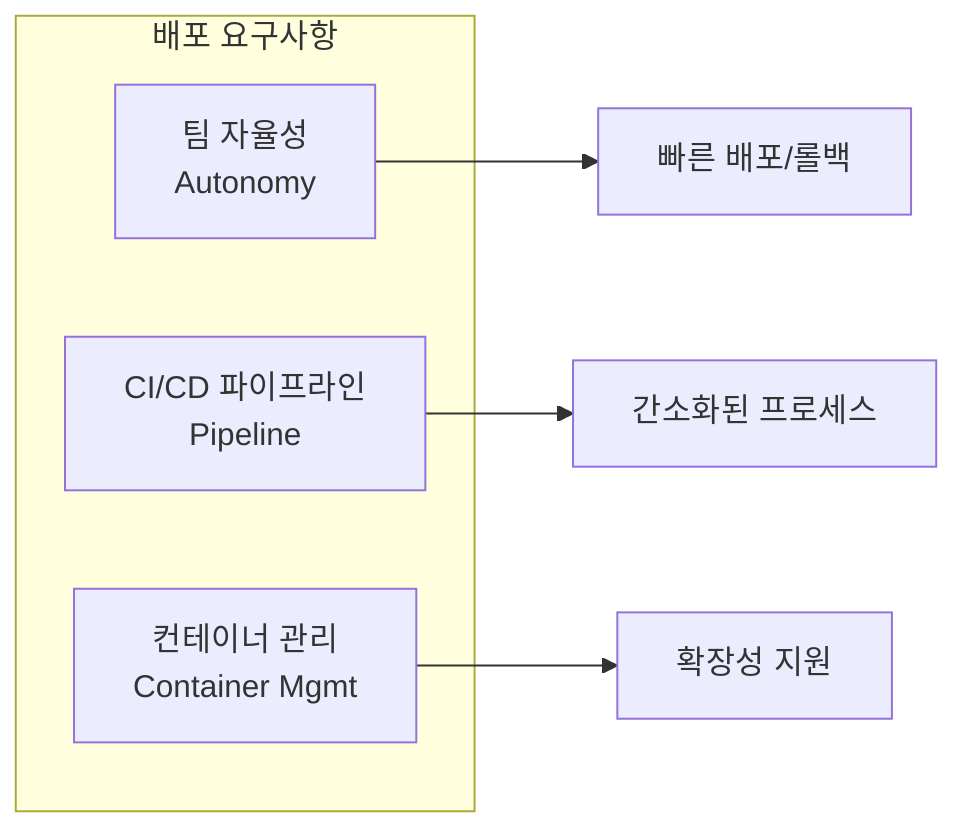
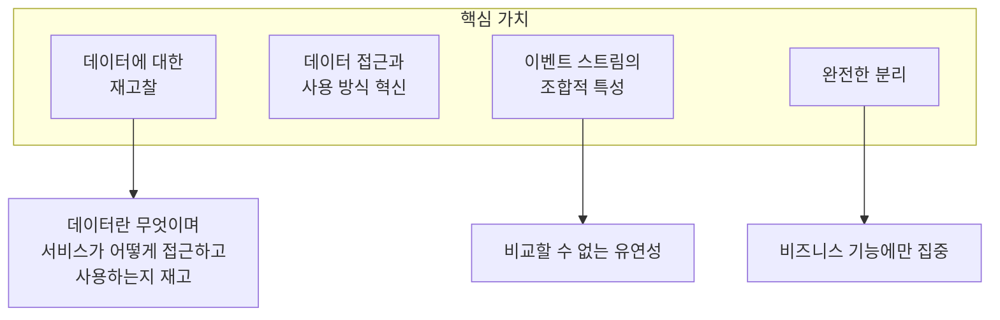

# Chapter 17. 결론 (Conclusion)

## 핵심 요약

> **이벤트 기반 마이크로서비스 아키텍처는 비즈니스 문제를 해결하기 위한**
> **강력하고, 유연하며, 잘 정의된 접근 방식을 제공한다.**
>
> 데이터 통신 레이어는 조직의 데이터 파워를 필요로 하는 모든 서비스와 팀에게 확장하고,
> 접근 경계를 제거하며, 중요한 비즈니스 정보의 생산과 배포와 관련된 불필요한 복잡성을 줄인다.

---

## 전체 책 요약

이 챕터는 책 전체의 핵심 개념을 요약합니다.



---

## 1. 통신 레이어 (Communication Layers)

### 핵심 개념



### 주요 특징

| 특징 | 설명 |
|------|------|
| **범용 접근** | 조직 전체에서 중요한 비즈니스 이벤트에 접근 가능 |
| **엄격한 데이터 조직** | 데이터의 체계적 구조화 |
| **근실시간 전파** | 업데이트의 빠른 전달 |
| **빅데이터 스케일** | 대규모 데이터 처리 가능 |
| **비즈니스 로직 분리** | 데이터 통신이 비즈니스 로직과 분리됨 |

### 성숙한 데이터 통신 레이어의 효과

```
Before (기존):
├─ 서비스가 이중 역할 수행
│   ├─ 내부 비즈니스 로직 처리
│   └─ 외부 서비스에 데이터 동기화/직접 접근 제공
└─ 프로듀서 장애 = 데이터 접근 불가

After (이벤트 기반):
├─ 서비스는 비즈니스 로직에만 집중
├─ 데이터 소유권과 생산이 접근/소비와 분리
├─ 프로듀서 장애 시에도 이벤트 브로커에서 소비 가능
└─ 서비스 간 장애 모드 분리
```

---

## 2. 비즈니스 도메인과 Bounded Context

### 핵심 구조



### Bounded Context가 정의하는 것

| 요소 | 설명 |
|------|------|
| **입력 (Inputs)** | 서비스가 받아들이는 데이터 |
| **출력 (Outputs)** | 서비스가 생성하는 데이터 |
| **이벤트 (Events)** | 도메인 내에서 발생하는 사건 |
| **요구사항 (Requirements)** | 비즈니스 규칙과 제약 |
| **프로세스 (Processes)** | 비즈니스 워크플로우 |
| **데이터 모델 (Data Models)** | 도메인 특화 데이터 구조 |

---

## 3. 공유 도구와 인프라 (Microservice Tax)

### 마이크로서비스 세금의 구성요소



### 도입 전략

| 단계 | 권장 순서 |
|------|----------|
| **시작** | Event Broker 또는 Container Management System |
| **확장** | 필요에 따라 다른 구성요소 추가 |
| **선택** | 자체 구축 vs 클라우드 서비스 (Google, Microsoft, Amazon) |

> **💡 팁**: 마이크로서비스 세금 지불은 전부 아니면 전무(all-or-nothing)가 아니다.
> 조직은 일반적으로 하나의 서비스부터 시작하여 점진적으로 확장한다.

---

## 4. 스키마화된 이벤트 (Schematized Events)

### 스키마의 역할



### 스키마의 이점

| 이점 | 설명 |
|------|------|
| **강타입 이벤트** | 프로듀서/컨슈머가 데이터 현실과 직면 |
| **오해 감소** | 컨슈머의 이벤트 오해석 가능성 대폭 감소 |
| **변경 계약** | 미래 변경에 대한 계약 제공 |
| **스키마 진화** | 비필수 변경의 빈도와 위험 감소 |
| **코드 생성** | 클래스/구조체 자동 생성 |
| **데이터 발견** | 어떤 데이터가 어떤 스트림에 있는지 검색 가능 |

### 스키마 진화의 효과

```
Producer 관점:
├─ 새로운/변경된 필드로 데이터 생성 가능
└─ 하위 호환성 유지

Consumer 관점:
├─ 변경에 관심 없는 컨슈머: 이전 스키마 계속 사용
├─ 변경이 필요한 컨슈머: 독립적으로 코드 업그레이드
└─ 최신 데이터 필드 접근 가능
```

---

## 5. 데이터 해방과 단일 진실 공급원 (Data Liberation & SSOT)

### 데이터 해방 전략


### 데이터 해방 우선순위

| 우선순위 | 기준 |
|---------|------|
| **1순위** | 가장 자주 사용되는 데이터 |
| **2순위** | 조직의 다음 주요 목표에 가장 중요한 데이터 |
| **3순위** | 나머지 비즈니스 크리티컬 데이터 |

### 고려사항

```
데이터 해방 시 균형 잡아야 할 요소:
├─ 기존 서비스에 대한 영향
├─ 오래된 데이터(Stale Data)의 위험
├─ 스키마 부재의 위험
└─ 내부 데이터 모델 노출 위험
```

> **💡 팁**: 이벤트 스트림 형태의 비즈니스 데이터가 준비되면,
> 새 서비스는 **조합(Composition)**으로 구축할 수 있다.
> 각 서비스에 직접 연결하는 대신 이벤트 브로커를 통해 구독만 하면 된다.

---

## 6. 마이크로서비스 설계 원칙

### 정렬 원칙



### 기술적 경계 마이크로서비스의 문제점

| 문제 | 설명 |
|------|------|
| **워크플로우 결합** | 관련 없는 워크플로우들이 서로 결합됨 |
| **변경 민감성** | 비즈니스 변경에 과도하게 민감 |
| **연쇄 장애** | 하나의 장애가 여러 비즈니스 워크플로우에 영향 |

### 크기에 대한 유연성

> **모든 마이크로서비스가 "마이크로"일 필요는 없다.**
>
> 마이크로서비스 세금을 완전히 지불하지 않은 조직은
> 더 큰 서비스를 사용하는 것이 합리적이다.

**대규모 서비스에서 세분화된 서비스로 전환하기 위한 원칙**:

1. 중요한 비즈니스 엔티티와 이벤트를 이벤트 브로커에 넣기
2. 이벤트 브로커를 단일 진실 공급원으로 사용
3. 서비스 간 직접 호출 피하기

---

## 7. 마이크로서비스 구현 옵션

### 프레임워크 비교



### 구현 옵션 상세 비교

| 옵션 | 강점 | 약점 | 적합한 사용 사례 |
|------|------|------|----------------|
| **Lightweight** | 최고의 기본 기능, 무한 테이블 유지, FK 조인 | 특정 프레임워크 종속 | 복잡한 스트림 처리 |
| **Heavyweight** | 유사한 기능, 빅데이터 분석 | 별도 클러스터 필요 | 대규모 배치/스트림 분석 |
| **BPC** | 언어 유연성 | 기본 패턴만, 이벤트 스케줄링 없음 | 단순 이벤트 처리 |
| **FaaS** | 언어 유연성, 서버리스 | 기본 패턴만, 이벤트 스케줄링 없음 | 단순 이벤트 처리 |

---

## 8. 테스팅 요약

### 테스팅 수준



### 테스팅 이점

| 테스팅 유형 | 이점 |
|------------|------|
| **단위 테스트** | 이벤트 스키마로 테스트 케이스 구성 용이 |
| **로컬 통합** | 부하, 타이밍, 장애, 중단 시뮬레이션 가능 |
| **프로덕션 통합** | 배포 전 스모크 테스트, 성능/수평 확장 테스트 |

---

## 9. 배포 요약

### 핵심 요구사항



### 배포 시 고려사항

| 고려사항 | 설명 |
|---------|------|
| **SLA** | 다운타임뿐 아니라 하류 컨슈머 영향 포함 |
| **상태 재구축** | 이벤트 브로커에 상당한 부하 발생 가능 |
| **입력 스트림 재소비** | 하류 컨슈머의 급격한 스케일업 필요 가능 |
| **쿼터** | 영향 완화 가능하나 불일치 상태 기간 존재 |

### 배포 전략 대안

```
Blue-Green 배포의 복잡성을 피하는 대안:

┌─────────────────────────────────────────┐
│  Thin Serving Layer (항상 ON)           │
│  - 동기 요청 처리                        │
│  - 일시적으로 Stale 데이터 제공 가능      │
├─────────────────────────────────────────┤
│  Backend Event Processor                │
│  - 독립적으로 교체 가능                  │
│  - 자체 시간에 재처리 가능               │
└─────────────────────────────────────────┘

장점: 도구 증강 불필요, 복잡한 스왑 작업 불필요
단점: 일시적으로 Stale 데이터 제공
```

---

## 10. 최종 결론 (Final Words)

### 이벤트 기반 마이크로서비스의 본질



### 데이터 통신 레이어의 궁극적 가치

> **"데이터 통신 레이어는 조직의 데이터 파워를 필요로 하는 모든 서비스와 팀에게 확장하고,
> 접근 경계를 제거하며, 중요한 비즈니스 정보의 생산과 배포와 관련된 불필요한 복잡성을 줄인다."**

| 효과 | 설명 |
|------|------|
| **파워 확장** | 조직의 데이터 파워를 모든 서비스/팀에 확장 |
| **경계 제거** | 접근 경계 제거 |
| **복잡성 감소** | 중요 비즈니스 정보의 생산/배포 관련 불필요한 복잡성 감소 |

### 미래 전망

```
데이터의 현실:
├─ 특정 도메인에 속하는 데이터 양이 매년 급격히 증가
├─ 더 크고 더 유비쿼터스해지는 데이터
└─ 하나의 대형 데이터 스토어에 모든 목적으로 넣는 시대는 끝남

이벤트 기반 마이크로서비스:
├─ 대규모/다양한 데이터 세트 처리를 위한 컴퓨팅의 자연스러운 진화
├─ 이벤트 스트림의 조합적 특성 → 비교할 수 없는 유연성
└─ 개별 비즈니스 유닛이 목표 달성에 필요한 데이터 사용에 집중 가능
```

---

## 전체 책 핵심 원칙 정리

### 10가지 핵심 원칙

| # | 원칙 | 설명 |
|---|------|------|
| 1 | **이벤트 브로커 중심** | 모든 서비스 간 통신의 중심 |
| 2 | **Bounded Context 정렬** | 기술적 경계가 아닌 비즈니스 경계 기준 |
| 3 | **단일 진실 공급원** | 이벤트 브로커를 SSOT로 사용 |
| 4 | **스키마 우선** | 강타입 이벤트와 스키마 진화 |
| 5 | **데이터 해방** | 레거시 시스템에서 데이터 추출 |
| 6 | **마이크로서비스 세금** | 필수 인프라에 투자 |
| 7 | **직접 호출 회피** | 서비스 간 직접 연결 대신 이벤트 기반 |
| 8 | **테스트 용이성** | 이벤트 스키마 기반 테스트 |
| 9 | **팀 자율성** | 독립적인 배포 권한 |
| 10 | **점진적 진화** | 전부 아니면 전무가 아닌 점진적 도입 |

---

## 실무 적용 로드맵

### Phase 1: 기반 구축

```
1. 이벤트 브로커 도입
2. 스키마 레지스트리 구축
3. 가장 중요한 데이터 해방
```

### Phase 2: 확장

```
4. CI/CD 파이프라인 구축
5. 컨테이너 관리 시스템 도입
6. 모니터링/로깅 시스템 구축
```

### Phase 3: 최적화

```
7. 추가 데이터 해방
8. 새 서비스 조합으로 구축
9. 레거시 시스템 점진적 분해
```

---

## 체크리스트: 이벤트 기반 아키텍처 준비도

### 인프라
- [ ] 이벤트 브로커 운영 중
- [ ] 스키마 레지스트리 구축
- [ ] 컨테이너 관리 시스템 운영 중
- [ ] CI/CD 파이프라인 구축
- [ ] 모니터링/로깅 시스템 구축

### 데이터
- [ ] 핵심 비즈니스 데이터 해방 완료
- [ ] 이벤트 스키마 정의 및 등록
- [ ] 단일 진실 공급원 정책 수립

### 조직
- [ ] 팀별 배포 자율성 확보
- [ ] Bounded Context 기반 서비스 설계
- [ ] 기술적 경계 마이크로서비스 회피

### 프로세스
- [ ] 표준화된 배포 프로세스
- [ ] 테스팅 전략 수립
- [ ] 스키마 진화 정책 수립

---

## 핵심 용어 총정리

| 용어 | 영문 | 설명 |
|------|------|------|
| 이벤트 브로커 | Event Broker | 서비스 간 이벤트 통신의 중심 인프라 |
| Bounded Context | Bounded Context | 도메인 문제 해결을 위한 경계와 모델 |
| 마이크로서비스 세금 | Microservice Tax | 마이크로서비스 성공을 위한 필수 인프라 투자 |
| 스키마 진화 | Schema Evolution | 하위 호환성을 유지하며 스키마 변경 |
| 데이터 해방 | Data Liberation | 레거시 시스템에서 데이터를 이벤트 스트림으로 추출 |
| 단일 진실 공급원 | Single Source of Truth | 데이터의 권위 있는 단일 출처 |
| 데이터 통신 레이어 | Data Communication Layer | 조직 전체 데이터 접근을 위한 공유 인프라 |
| 조합 | Composition | 이벤트 스트림 구독으로 새 서비스 구축 |
| 경량 프레임워크 | Lightweight Framework | Kafka Streams 등 독립 실행 가능한 프레임워크 |
| 헤비웨이트 프레임워크 | Heavyweight Framework | Spark, Flink 등 별도 클러스터 필요 프레임워크 |
| 팀 자율성 | Team Autonomy | 팀이 독립적으로 배포/운영 결정 권한 |

---

## 마무리

이 책은 **이벤트 기반 마이크로서비스 아키텍처**의 전체 그림을 제공했습니다:

1. **왜** 이벤트 기반 아키텍처가 필요한지 (데이터 증가, 분리의 필요성)
2. **무엇**이 필요한지 (이벤트 브로커, 스키마, 마이크로서비스 세금)
3. **어떻게** 구현하는지 (프레임워크 선택, 테스팅, 배포)

**핵심 메시지**:
> 이벤트 기반 마이크로서비스 자체의 미래와 관계없이,
> **데이터 통신 레이어는 조직의 데이터 파워를 확장하고,
> 접근 경계를 제거하며, 불필요한 복잡성을 줄인다.**
