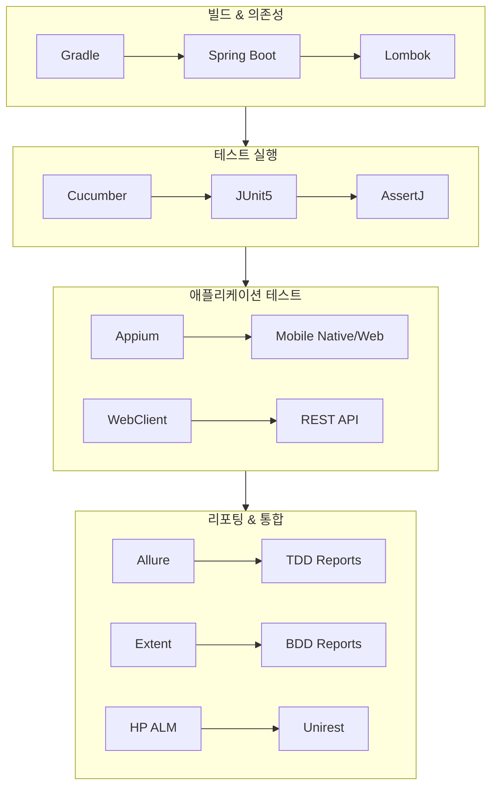
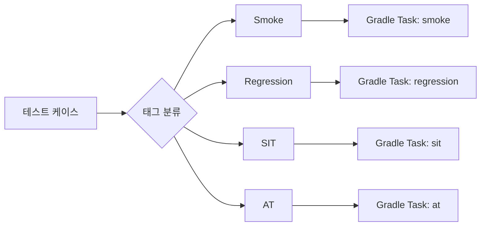
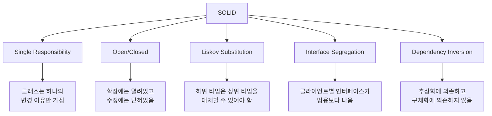

# Chapter 1: Automation Framework Overview (자동화 프레임워크 개요)

## 📌 핵심 요약

> **"테스트 자동화 프레임워크는 테스트 엔지니어가 테스트를 구축할 수 있는 도구 세트와 재사용 가능한 유틸리티 클래스를 확립한다. 프레임워크는 기업 요구사항에 따라 진화하면서도, 테스트 스크립트 개발에 집중할 수 있도록 안정적이어야 한다."**

이 챕터에서는 엔터프라이즈급 테스트 자동화 프레임워크의 기술 스택, 핵심 기능, 스크립팅 전략, 그리고 코딩 표준을 다룬다. Spring Boot, Gradle, JUnit5, Appium을 기반으로 TDD와 BDD를 모두 지원하는 프레임워크를 구축한다.

---

## 🎯 학습 목표

이 챕터를 완료하면 다음을 할 수 있다:

- [ ] 프레임워크 기술 스택 구성 요소와 각각의 역할 이해
- [ ] 프레임워크의 핵심 기능 파악
- [ ] 테스트 스크립팅 전략 수립
- [ ] 클린 코드와 SOLID 원칙 기반 코딩 표준 적용

---

## 📖 본문 정리

### 1.1 프레임워크 기술 스택



#### 기술 스택 상세

| 컴포넌트 | 역할 | 특징 |
|----------|------|------|
| **Gradle** | 빌드 도구 | DSL 기반, Maven보다 빠름 |
| **JUnit5** | 테스트 러너 | 최신 세대 JUnit |
| **AssertJ** | 검증/단언 | 가독성 높은 Fluent Assertions |
| **WebClient** | REST API 테스트 | 비동기, 논블로킹 (RestTemplate 대체) |
| **Lombok** | 보일러플레이트 제거 | Getter/Setter 자동 생성 |
| **Allure** | 리포팅 | TDD 프로젝트에 널리 사용 |
| **HP ALM** | 테스트 관리 통합 | REST API로 HP QC 연동 |
| **Unirest** | HTTP 클라이언트 | HP QC 연동용, 경량 라이브러리 |
| **Appium** | 모바일 테스트 | 플랫폼 독립적, 오픈소스 |
| **Cucumber** | BDD 구현 | Gherkin 문법 사용 |
| **Spring** | DI, 설정 관리 | 어노테이션 기반 의존성 주입 |

---

### 1.2 프레임워크 핵심 기능

```
지원 기능:
├── 모바일 자동화
│   ├── iOS/Android Native App
│   └── iOS/Android Mobile Web
│
├── 웹 자동화
│   ├── Web Application
│   └── REST/SOAP Web Service
│
├── 데이터베이스
│   ├── SQL Database
│   └── NoSQL Database
│
├── 통합
│   └── HP ALM (REST API)
│
├── 리포팅
│   ├── HTML Report
│   ├── Allure Report (TDD/BDD)
│   ├── Extent Report (BDD)
│   └── Email Notification
│
└── 실행
    ├── Multi-Driver 지원
    └── Parallel Execution
```

#### 기존 프레임워크와 비교

| 기능 | Our FW | BDD FW | TDD FW |
|------|--------|--------|--------|
| **Spring DI (Auto-wiring)** | ✅ | ❌ | ❌ |
| **Spring Property 읽기** | ✅ | ❌ | ❌ |
| **Lombok (보일러플레이트 제거)** | ✅ | ❌ | ❌ |
| **BDD 지원** | ✅ | ✅ | ❌ |
| **TDD 지원 (리팩토링 없이)** | ✅ | ❌ | ✅ |
| **JIRA 통합** | ✅ | ✅ | ✅ |
| **HP-QC 통합** | ✅ | ✅ | ✅ |
| **Gradle (DSL 기반)** | ✅ | ❌ | ❌ |
| **Fluent Assertions** | ✅ | ❌ | ✅ |
| **병렬 실행** | ✅ | ✅ | ✅ |
| **Custom PDF 리포팅** | ✅ | ❌ | ❌ |

---

### 1.3 스크립팅 전략



**스크립팅 전략 가이드라인**:

| 원칙 | 설명 |
|------|------|
| **테스트 태깅** | Smoke/Regression/SIT/AT 태그로 테스트 분류 |
| **Gradle Task 분리** | 태그별 실행 Task 생성 |
| **Workflow 그룹화** | 공통 워크플로우는 Workflows 폴더에 |
| **Navigation 클래스** | ScreenNavigation.java로 화면 탐색 메서드 집중 |

---

### 1.4 자동화 코딩 표준

#### 클린 코드 원칙

```java
// ✅ Good: Builder 패턴 + Lombok
@Builder
@Data
public class Employee {
    private String empCode;
    private String empName;
    private LocalDate joiningDate;
}

// ❌ Bad: 수동 Getter/Setter
public class Employee {
    private String empCode;
    public String getEmpCode() { return empCode; }
    public void setEmpCode(String code) { this.empCode = code; }
    // ... 반복
}
```

**클린 코드 체크리스트**:

| 항목 | 설명 |
|------|------|
| **Builder 패턴** | Lombok 사용으로 POJO 간소화 |
| **어노테이션 활용** | `@Step` (Allure), `@DisplayName` (JUnit5) |
| **Page Object Model** | 로케이터와 메서드를 페이지별로 분리 |
| **메서드 인자** | 최대 3개, 초과 시 객체로 전달 |
| **의도 드러내는 이름** | `AppLoginScreen` ✅ vs `GetStartedScreen` ❌ |
| **단일 책임** | 메서드는 한 가지 일만 수행 |

#### 메서드 인자 제한

```java
// ❌ Bad: 인자 3개 초과
public void createUser(String name, String email, String phone,
                       String address, String city) { ... }

// ✅ Good: 객체로 전달
public void createUser(UserDto user) { ... }
```

#### 단일 책임 원칙 (SRP)

```java
// ❌ Bad: 메서드가 두 가지 일을 함
public void sortMails(List<Mail> mails) {
    for (Mail mail : mails) {
        MailStatus mailStatus = repository.findStatus(mail.getId());
        if (mailStatus.isActive()) {
            sort(mail);
        }
    }
}

// ✅ Good: 책임 분리
public void sortMails(List<Mail> mails) {
    mails.stream()
         .filter(this::isActive)
         .forEach(this::sort);
}

private boolean isActive(Mail mail) {
    return repository.findStatus(mail.getId()).isActive();
}
```

---

### 1.5 SOLID 원칙



#### SRP 위반 예시

```java
// ❌ Bad: Employee 클래스가 조직명 출력까지 담당
public class Employee {
    private String empCode;
    private String empName;

    // Employee 관련 메서드들...

    // SRP 위반: 조직 정보는 Employee 책임이 아님
    public void printOrgName() {
        System.out.println("XXXX");
    }
}
```

#### LSP 위반 예시

```java
// ❌ Bad: 파생 클래스가 기본 클래스 동작을 변경
public class TwoDimension {
    public void addHeight(int x, int y) { ... }
    public void addWidth(int x, int y) { ... }
}

public class ThreeDimension extends TwoDimension {
    // 시그니처 변경 - LSP 위반
    public void addHeight(int x, int y, int z) { ... }
    public void addWidth(int x, int y, int z) { ... }
}
```

---

### 1.6 함수형 프로그래밍 활용

```java
// ❌ Bad: 명령형 접근
public static double getSum() {
    double sum = 0;
    for (int i = 0; i < numbersList.size(); i++) {
        if (!numbersList.isEmpty()) {
            sum = sum + numbersList.get(i);
        }
    }
    return sum;
}

// ✅ Good: 함수형 접근
public static double getSum() {
    return numbersList.stream()
                      .reduce(0.0, Double::sum);
}
```

**함수형 프로그래밍 장점**:
- 멀티코어 프로세서 활용 (멀티스레딩 구현 없이)
- 선언적 코드로 가독성 향상
- 간결한 코드

---

## 💡 실무 적용 포인트

### 프레임워크 설계 체크리스트

```
기술 스택 선택:
├── 빌드: Gradle (DSL, 빠른 속도)
├── DI: Spring Boot (자동 와이어링)
├── 테스트: JUnit5 + AssertJ
├── 모바일: Appium
├── BDD: Cucumber + Gherkin
├── 리포팅: Allure + Extent
└── 코드 간소화: Lombok

코딩 표준:
├── Page Object Model 적용
├── 메서드 인자 3개 이하
├── SOLID 원칙 준수
├── 함수형 프로그래밍 우선
└── 의미 있는 네이밍
```

### 로케이터 우선순위

```
로케이터 선택 순서:
1. ID / Accessibility ID / Predicate (최우선)
2. Name / ClassName
3. XPath / CSS Selector (최후 수단)
```

---

## ✅ 핵심 개념 체크리스트

- [ ] 프레임워크 기술 스택 12개 컴포넌트 역할
- [ ] Spring DI와 Lombok의 보일러플레이트 제거 효과
- [ ] 테스트 태깅 전략 (Smoke/Regression/SIT/AT)
- [ ] 클린 코드 원칙 (Builder 패턴, 단일 책임)
- [ ] SOLID 5원칙과 위반 사례
- [ ] 함수형 vs 명령형 프로그래밍
- [ ] Page Object Model 패턴

---

## 🔗 참고 자료

- [Gradle vs Maven](https://gradle.org/maven-vs-gradle/)
- [JUnit5 User Guide](https://junit.org/junit5/)
- [AssertJ Documentation](https://assertj.github.io/doc/)
- [Project Lombok](https://projectlombok.org/)
- [Allure Report](https://docs.qameta.io/allure/)
- [Appium Documentation](http://appium.io/)
- [Cucumber BDD](https://cucumber.io/docs/bdd/)
- [Spring Framework](https://spring.io/)
- [WebClient vs RestTemplate](https://www.baeldung.com/spring-webclient-resttemplate)
