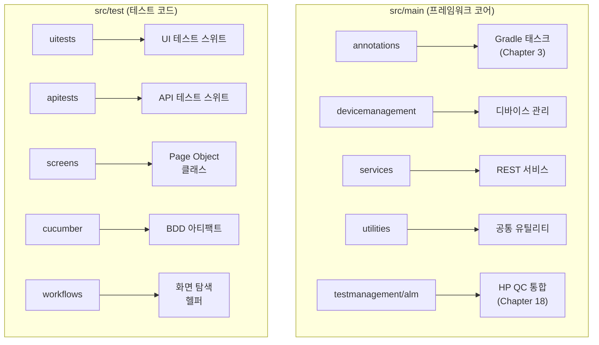

# Chapter 2: Creating the Wireframe with Spring-Boot (Spring-Boot 와이어프레임 생성)

## 📌 핵심 요약

> **"Spring-Boot는 JUnit 테스트와 프레임워크의 엔진이다. Spring Initializr를 사용하여 프로젝트를 부트스트래핑하고, 체계적인 폴더 구조를 설계한다."**

이 챕터에서는 Spring Initializr를 통해 프로젝트를 생성하고, IntelliJ에서 프로젝트를 열고, 필요한 플러그인을 설치하며, 테스트 자동화 프레임워크를 위한 폴더 구조를 설계한다.

---

## 🎯 학습 목표

이 챕터를 완료하면 다음을 할 수 있다:

- [ ] Spring Initializr로 프로젝트 부트스트래핑
- [ ] IntelliJ에서 Gradle 프로젝트 열기
- [ ] 필수 IntelliJ 플러그인 설치 (Lombok, Cucumber)
- [ ] 테스트 자동화 프레임워크 폴더 구조 설계

---

## 📖 본문 정리

### 2.1 Spring Initializr로 부트스트래핑

#### 프로젝트 생성 단계


#### Spring Initializr 설정

| 항목 | 선택값 | 설명 |
|------|--------|------|
| **Project** | Gradle Project | DSL 기반 빌드 도구 |
| **Language** | Java | 주 개발 언어 |
| **Spring Boot** | 2.4.1 (Release) | 안정 버전 선택 |
| **Group** | com.taf | 조직/회사 식별자 |
| **Artifact** | testautomation | 프로젝트명 |
| **Packaging** | Jar | 패키징 형식 |
| **Java** | 8 이상 | 함수형 프로그래밍 지원 |

**접속 URL**: https://start.spring.io

---

### 2.2 IntelliJ에서 프로젝트 열기

#### 프로젝트 열기 순서

```
1. IntelliJ 실행
2. File 메뉴 → Open
3. 다운로드 폴더로 이동
4. build.gradle 파일 선택
5. "Open as Project" 클릭
```

#### 생성된 기본 파일

```
testautomation/
├── build.gradle              # Gradle 빌드 설정
├── settings.gradle           # 프로젝트 설정
├── src/
│   ├── main/
│   │   ├── java/
│   │   │   └── com/taf/testautomation/
│   │   │       └── TestautomationApplication.java  # Spring Boot 메인 클래스
│   │   └── resources/
│   │       └── application.properties              # 설정 파일 (Chapter 4)
│   └── test/
│       └── java/
│           └── com/taf/testautomation/
│               └── TestautomationApplicationTests.java  # 기본 테스트 클래스
└── gradle/
    └── wrapper/
```

#### TestautomationApplicationTests.java

```java
package com.taf.testautomation;

import org.junit.jupiter.api.Test;
import org.springframework.boot.test.context.SpringBootTest;

@SpringBootTest
class TestautomationApplicationTests {
    @Test
    void contextLoads() {
        // Spring Context 로딩 테스트
    }
}
```

**핵심 포인트**:
- `@SpringBootTest`: Spring Context를 로드하는 통합 테스트
- `TestautomationApplication.java`: Spring Boot 러너 클래스 (main 메서드)
- 이 클래스는 나중에 API 테스트에 활용

---

### 2.3 IntelliJ 플러그인 설치

#### 필수 플러그인

| 플러그인 | 용도 | 필수 여부 |
|----------|------|----------|
| **Lombok** | 보일러플레이트 코드 제거 | ✅ 필수 |
| **Cucumber for Java** | BDD 지원, Gherkin 문법 | ✅ 필수 |

#### 플러그인 설치 방법

```
IntelliJ 설정:
├── File → Settings (Windows/Linux)
├── IntelliJ IDEA → Preferences (Mac)
└── Plugins → Marketplace → 검색 → Install
```

---

### 2.4 폴더 구조 설계

#### 최종 프로젝트 구조

```
src/
├── main/java/com/taf/testautomation/
│   ├── annotations/           # Gradle 태스크 관련
│   ├── devicemanagement/      # 디바이스 관리 메서드
│   ├── services/              # REST 서비스
│   ├── utilities/             # 유틸리티 클래스
│   └── testmanagement/
│       └── alm/               # HP QC 통합 (Chapter 18)
│
└── test/java/com/taf/testautomation/
    ├── uitests/               # UI 테스트
    ├── apitests/              # API 테스트
    │   └── TestautomationApplicationTests.java
    ├── screens/               # Page Object 클래스
    ├── cucumber/              # Cucumber 아티팩트
    └── workflows/             # 화면 탐색 헬퍼 메서드
```

#### 폴더 역할 설명



| 폴더 | 위치 | 용도 |
|------|------|------|
| `annotations` | main | Gradle 커스텀 태스크 |
| `devicemanagement` | main | iOS/Android 디바이스 관리 |
| `services` | main | REST API 서비스 클래스 |
| `utilities` | main | 공통 유틸리티 (날짜, 파일 등) |
| `testmanagement/alm` | main | HP ALM 통합 |
| `uitests` | test | UI 테스트 케이스 |
| `apitests` | test | API 테스트 케이스 |
| `screens` | test | Page Object 클래스 |
| `cucumber` | test | Feature 파일, Step Definitions |
| `workflows` | test | 화면 탐색 헬퍼 메서드 |

---

## 💡 실무 적용 포인트

### 프로젝트 초기 설정 체크리스트

```
□ Spring Initializr에서 프로젝트 생성
  └── Gradle + Java + Spring Boot Release 버전

□ IntelliJ에서 프로젝트 열기
  └── build.gradle 선택 → Open as Project

□ 필수 플러그인 설치
  ├── Lombok
  └── Cucumber for Java

□ 폴더 구조 생성
  ├── main: annotations, devicemanagement, services, utilities, testmanagement/alm
  └── test: uitests, apitests, screens, cucumber, workflows

□ 기본 파일 확인
  ├── TestautomationApplication.java (Spring Boot 메인)
  ├── application.properties (설정 - Chapter 4)
  └── TestautomationApplicationTests.java → apitests로 이동
```

### 폴더 구조 설계 원칙

```
관심사 분리 (Separation of Concerns):
├── main: 프레임워크 인프라 코드
│   └── 재사용 가능한 유틸리티, 서비스
│
└── test: 실제 테스트 코드
    ├── Page Objects (screens/)
    ├── Test Suites (uitests/, apitests/)
    └── BDD (cucumber/)
```

---

## ✅ 핵심 개념 체크리스트

- [ ] Spring Initializr 사용법 (start.spring.io)
- [ ] Gradle Project + Java + Spring Boot 조합
- [ ] IntelliJ에서 build.gradle로 프로젝트 열기
- [ ] Lombok, Cucumber 플러그인 설치
- [ ] main vs test 폴더 역할 구분
- [ ] Page Object 클래스 위치 (screens/)
- [ ] 워크플로우 헬퍼 위치 (workflows/)

---

## 🔗 참고 자료

- [Spring Initializr](https://start.spring.io)
- [IntelliJ IDEA](https://www.jetbrains.com/idea/)
- [Lombok IntelliJ Plugin](https://plugins.jetbrains.com/plugin/6317-lombok)
- [Cucumber for Java Plugin](https://plugins.jetbrains.com/plugin/7212-cucumber-for-java)

---

## 📚 다음 챕터 미리보기

- **Chapter 3**: Gradle 설정 - 의존성 관리와 태스크 실행
- **Chapter 4**: application.properties 설정
