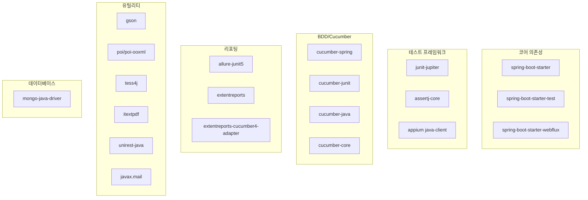

# Chapter 3: Configuring Gradle (Gradle 설정)

## 📌 핵심 요약

> **"Gradle은 의존성 관리와 태스크 실행을 담당한다. build.gradle에서 플러그인과 의존성을 정의하고, gradle.properties에서 버전을 관리하며, 커스텀 어노테이션으로 테스트 태스크를 실행한다."**

이 챕터에서는 build.gradle 파일에 필요한 의존성을 추가하고, Gradle 태스크를 정의하며, 병렬 실행 설정을 구성한다. 또한 gradle.properties로 버전을 관리하고, 커스텀 어노테이션을 생성한다.

---

## 🎯 학습 목표

이 챕터를 완료하면 다음을 할 수 있다:

- [ ] build.gradle에 플러그인과 의존성 추가
- [ ] Gradle 태스크 정의 (Smoke, Regression, SIT, AT)
- [ ] JUnit5 병렬 실행 설정
- [ ] gradle.properties로 버전 관리
- [ ] 커스텀 어노테이션 생성

---

## 📖 본문 정리

### 3.1 build.gradle 플러그인 설정

```groovy
plugins {
    id 'org.springframework.boot' version '2.4.1'
    id 'io.spring.dependency-management' version '1.0.10.RELEASE'
    id 'io.franzbecker.gradle-lombok' version '3.1.0'    // Lombok
    id 'io.qameta.allure' version '2.8.1'                // Allure Report
    id 'java'
}

group = 'com.taf'
version = '0.0.1-SNAPSHOT'
sourceCompatibility = '1.8'
```

#### 플러그인 역할

| 플러그인 | 역할 |
|----------|------|
| `spring.boot` | Spring Boot 애플리케이션 지원 |
| `dependency-management` | 의존성 버전 관리 |
| `gradle-lombok` | Lombok 통합 |
| `allure` | Allure 리포트 생성 |
| `java` | Java 컴파일 지원 |

---

### 3.2 Allure 설정

```groovy
allure {
    version = '2.12.1'
    downloadLinkFormat = 'https://dl.bintray.com/qameta/maven/io/qameta/allure/allure-commandline/%s/allure-commandline-%<s.zip'
    useJUnit5 {
        version = '2.12.1'
    }
    autoconfigure = false    // 수동으로 의존성 지정
    aspectjweaver = true     // @Step 어노테이션 사용
    aspectjVersion = "${aspectj_version}"
}
```

**설정 포인트**:
- `autoconfigure = false`: 직접 의존성 지정 시 false
- `aspectjweaver = true`: `@Step` 어노테이션 사용에 필요

---

### 3.3 저장소 설정

```groovy
repositories {
    jcenter()       // mavenCentral의 슈퍼셋
    mavenLocal()    // 로컬 Maven 저장소
    mavenCentral()  // 중앙 Maven 저장소
}
```

---

### 3.4 의존성 구성



#### 의존성 상세

```groovy
dependencies {
    // Spring Boot 코어
    implementation 'org.springframework.boot:spring-boot-starter'
    testImplementation('org.springframework.boot:spring-boot-starter-test') {
        exclude group: 'org.junit.vintage', module: 'junit-vintage-engine'  // JUnit4 제외
    }

    // JUnit5
    implementation "org.junit.jupiter:junit-jupiter:${junit_jupiter_version}"
    implementation "org.junit.jupiter:junit-jupiter-api:${junit_jupiter_api_version}"
    implementation "org.junit.jupiter:junit-jupiter-engine:${junit_jupiter_engine_version}"
    implementation "org.junit.jupiter:junit-jupiter-params:${junit_jupiter_params_version}"

    // Assertion
    implementation "org.assertj:assertj-core:${assertj_version}"

    // Appium
    implementation "io.appium:java-client:${appium_version}"

    // Cucumber (BDD)
    compile group: 'io.cucumber', name: 'cucumber-spring', version: '5.6.0'
    compile group: 'io.cucumber', name: 'cucumber-junit-platform-engine', version: '5.6.0'
    compile group: 'io.cucumber', name: 'cucumber-core', version: '5.6.0'
    testImplementation 'io.cucumber:cucumber-java:5.6.0'
    testImplementation 'io.cucumber:cucumber-junit:5.6.0'

    // Allure Report
    implementation "io.qameta.allure:allure-junit5:${allure_junit_version}"
    implementation "io.qameta.allure:allure-java-commons:${allure_version}"
    testImplementation "io.qameta.allure:allure-cucumber5-jvm:${allurePluginVersion}"

    // Extent Report (BDD)
    compile "com.aventstack:extentreports-cucumber4-adapter:${report_version}"
    compile group: 'com.aventstack', name: 'extentreports', version: '4.1.5'

    // WebFlux (REST API)
    compile "org.springframework.boot:spring-boot-starter-webflux:${spring_boot_version}"

    // Utility
    compile "com.google.code.gson:gson:${gson_version}"                    // JSON 처리
    compile group: 'org.apache.poi', name: 'poi', version: '4.1.2'         // Excel
    compile group: 'org.apache.poi', name: 'poi-ooxml', version: '4.1.2'
    compile group: 'net.sourceforge.tess4j', name: 'tess4j', version: '4.5.3'  // OCR
    compile group: 'com.itextpdf', name: 'itextpdf', version: '5.5.13.2'       // PDF
    compile group: 'com.konghq', name: 'unirest-java', version: '3.11.01'      // HP QC 연동
    compile group: 'com.sun.mail', name: 'javax.mail', version: '1.6.2'        // 이메일

    // XML
    compile group: 'javax.xml.bind', name: 'jaxb-api', version: '2.3.1'
    compile group: 'org.glassfish.jaxb', name: 'jaxb-runtime', version: '2.3.1'

    // MongoDB
    compile group: 'org.mongodb', name: 'mongo-java-driver', version: '3.12.3'

    // WebDriver Manager
    testCompile("io.github.bonigarcia:webdrivermanager:3.7.1")
}
```

#### 의존성 용도 요약

| 의존성 | 용도 | 관련 챕터 |
|--------|------|----------|
| `cucumber-*` | BDD 통합 | Chapter 11 |
| `extentreports-cucumber4-adapter` | BDD Extent Report | Chapter 11 |
| `gson` | JSON ↔ Map 변환 | Chapter 9, 16 |
| `jaxb-*` | XML 읽기/생성 | Chapter 18 |
| `javax.mail` | 이메일 유틸리티 | Appendix A |
| `mongo-java-driver` | 리포트 호스팅 | - |
| `poi-*` | Excel 데이터 처리 | - |
| `tess4j` | OCR 유틸리티 | Appendix A |
| `itextpdf` | PDF 리포트 생성 | Chapter 12 |
| `unirest-java` | HP QC 연동 | Chapter 18 |
| `webdrivermanager` | 드라이버 자동 관리 | - |

---

### 3.5 Gradle 태스크 정의

```groovy
// Smoke 테스트 태스크
task Smoke(type: Test, description: 'Run Smoke tests on App...') {
    useJUnitPlatform() { includeTags 'smoke' }
}

// Regression 테스트 태스크
task Regression(type: Test, description: 'Run Regression tests on App...') {
    useJUnitPlatform() { includeTags 'regression' }
}

// SIT 테스트 태스크
task SIT(type: Test, description: 'Run SIT tests on App...') {
    useJUnitPlatform() { includeTags 'sittest' }
}

// AT 테스트 태스크
task AT(type: Test, description: 'Run AT tests on App...') {
    useJUnitPlatform() { includeTags 'attest' }
}

// Cucumber 옵션 전달
test {
    systemProperty "cucumber.options", System.getProperty("cucumber.options")
}
```

**태스크 실행 방법**:
```bash
./gradlew Smoke      # Smoke 테스트만 실행
./gradlew Regression # Regression 테스트만 실행
./gradlew SIT        # SIT 테스트만 실행
./gradlew AT         # AT 테스트만 실행
```

---

### 3.6 JUnit5 병렬 실행 설정

```groovy
tasks.withType(Test) {
    doFirst {
        systemProperties System.getProperties()

        // 병렬 실행 활성화
        systemProperties['junit.jupiter.execution.parallel.enabled'] = true

        // 기본 모드: 같은 스레드
        systemProperties['junit.jupiter.execution.parallel.mode.default'] = "same_thread"

        // 전략: 고정 스레드 수
        systemProperties['junit.jupiter.execution.parallel.config.strategy'] = "fixed"

        // 병렬 스레드 수: 5
        systemProperties['junit.jupiter.execution.parallel.config.fixed.parallelism'] = 5

        // 클래스 레벨: 동시 실행
        systemProperties['junit.jupiter.execution.parallel.mode.classes.default'] = "concurrent"
    }
}
```

#### 병렬 실행 설정 설명

| 속성 | 값 | 설명 |
|------|-----|------|
| `parallel.enabled` | true | 병렬 실행 활성화 |
| `mode.default` | same_thread | 메서드는 같은 스레드 |
| `config.strategy` | fixed | 고정 스레드 수 사용 |
| `fixed.parallelism` | 5 | 최대 5개 스레드 |
| `mode.classes.default` | concurrent | 클래스는 동시 실행 |

---

### 3.7 gradle.properties 설정

```properties
# gradle.properties
version=1.0-SNAPSHOT

# 라이브러리 버전
gson_version=2.8.6
spring_boot_version=2.2.0.RELEASE
aspectj_version=1.8.10
report_version=1.0.12

# Allure 버전
allure_version=2.13.0
allure_junit_version=2.13.0
allurePluginVersion=2.13.5

# Appium 버전
appium_version=7.3.0

# JUnit5 버전
junit_jupiter_version=5.5.2
junit_jupiter_engine_version=5.5.2
junit_jupiter_api_version=5.5.2
junit_jupiter_params_version=5.5.2

# AssertJ 버전
assertj_version=3.13.2
```

**버전 관리 장점**:
- 중앙 집중식 버전 관리
- build.gradle 간결화
- 버전 업그레이드 용이

---

### 3.8 커스텀 어노테이션 생성

#### AT 태스크 어노테이션 예시

```java
package com.taf.testautomation.annotations;

import org.junit.jupiter.api.Tag;
import org.junit.jupiter.api.Test;

import java.lang.annotation.ElementType;
import java.lang.annotation.Retention;
import java.lang.annotation.RetentionPolicy;
import java.lang.annotation.Target;

@Target({ElementType.TYPE, ElementType.METHOD})
@Retention(RetentionPolicy.RUNTIME)
@Tag("attest")    // Gradle 태스크와 연결
@Test
public @interface AT {
}
```

#### 모든 태스크 어노테이션

| 어노테이션 | Tag 값 | Gradle 태스크 |
|------------|--------|--------------|
| `@Smoke` | smoke | `./gradlew Smoke` |
| `@Regression` | regression | `./gradlew Regression` |
| `@SIT` | sittest | `./gradlew SIT` |
| `@AT` | attest | `./gradlew AT` |

#### 어노테이션 사용 예시

```java
@AT
@DisplayName("로그인 테스트")
void testLogin() {
    // AT 태스크 실행 시 포함됨
}

@Smoke
@DisplayName("기본 기능 테스트")
void testBasicFeature() {
    // Smoke 태스크 실행 시 포함됨
}
```

---

### 3.9 settings.gradle

```groovy
// settings.gradle
rootProject.name = 'testautomation'
```

**역할**: 빌드 레벨 설정, build.gradle 실행 전에 먼저 실행됨

---

## 💡 실무 적용 포인트

### 의존성 타입 가이드

```
의존성 스코프:
├── implementation: 컴파일 + 런타임 (일반적)
├── testImplementation: 테스트 전용
├── compile: implementation의 레거시 (상호 호환)
└── testCompile: testImplementation의 레거시
```

### Gradle 설정 체크리스트

```
□ build.gradle
  ├── 플러그인 (Spring Boot, Lombok, Allure)
  ├── 저장소 (jcenter, mavenCentral)
  ├── 의존성 (테스트, BDD, 리포팅, 유틸리티)
  ├── Gradle 태스크 (Smoke, Regression, SIT, AT)
  └── 병렬 실행 설정

□ gradle.properties
  └── 버전 매개변수 정의

□ settings.gradle
  └── 프로젝트 루트 이름

□ annotations/
  ├── Smoke.java
  ├── Regression.java
  ├── SIT.java
  └── AT.java
```

---

## ✅ 핵심 개념 체크리스트

- [ ] Gradle 플러그인 설정 (Lombok, Allure)
- [ ] JUnit4 제외 (`exclude junit-vintage-engine`)
- [ ] 의존성 카테고리별 역할
- [ ] Gradle 태스크 정의 (`useJUnitPlatform`, `includeTags`)
- [ ] JUnit5 병렬 실행 설정
- [ ] gradle.properties로 버전 매개변수화
- [ ] 커스텀 어노테이션과 `@Tag` 연결

---

## 🔗 참고 자료

- [Gradle User Guide](https://docs.gradle.org/current/userguide/userguide.html)
- [JUnit5 Parallel Execution](https://junit.org/junit5/docs/current/user-guide/#writing-tests-parallel-execution)
- [Allure Gradle Plugin](https://docs.qameta.io/allure/#_gradle_3)

---

## 📚 다음 챕터 미리보기

- **Chapter 4**: Properties 파일 생성 및 읽기 방법
