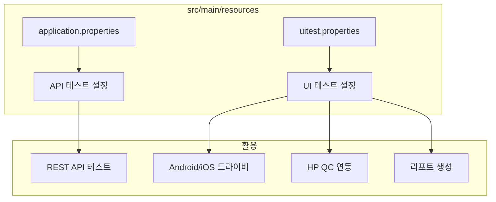
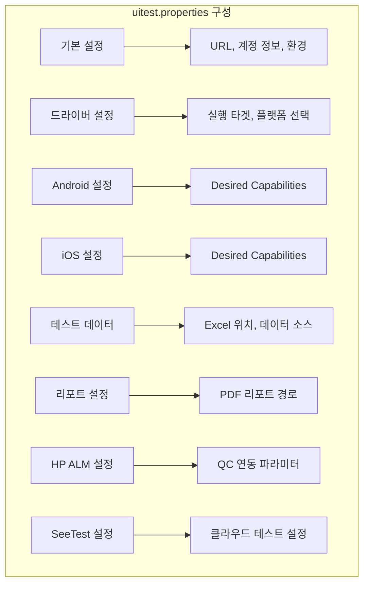
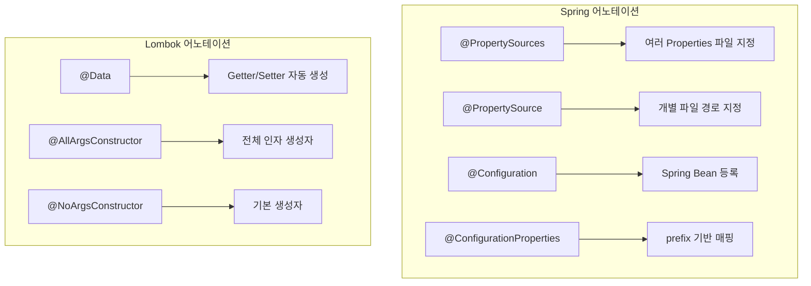

# Chapter 4: Creating the Properties Files (Properties 파일 생성)

## 📌 핵심 요약

> **"Properties 파일은 테스트 환경 설정의 중앙 저장소다. Spring-Boot의 @PropertySource 어노테이션으로 여러 설정 파일을 한 번에 읽고, Lombok으로 보일러플레이트 코드를 제거하며, POJO에 자동 매핑한다."**

이 챕터에서는 API 테스트용 application.properties와 UI 테스트용 uitest.properties 파일을 생성하고, Spring-Boot 어노테이션을 사용하여 설정 값을 읽는 방법을 학습한다.

---

## 🎯 학습 목표

이 챕터를 완료하면 다음을 할 수 있다:

- [ ] application.properties와 uitest.properties 파일 생성
- [ ] Properties 파일의 카테고리별 설정 항목 이해
- [ ] Spring-Boot 어노테이션으로 Properties 읽기
- [ ] Lombok을 활용한 POJO 간소화
- [ ] 전통적인 Properties 읽기 방식 이해

---

## 📖 본문 정리

### 4.1 Properties 파일 개요



---

### 4.2 application.properties (API 테스트용)

```properties
# application.properties
prop.url=https://jsonplaceholder.typicode.com/users
```

**용도**: REST API 테스트 (Chapter 16에서 활용)

---

### 4.3 uitest.properties (UI 테스트용)

#### 파일 생성 위치
```
src/main/resources/ → 우클릭 → New → File → uitest.properties
```

#### 설정 카테고리별 구성



#### 카테고리 1: 기본 설정

```properties
# URL 및 계정 정보
url=https://jsonplaceholder.typicode.com/users
username=testuser@gmail.com
password=Password1
userFirstName=Test
userLastName=User
environment=env
```

#### 카테고리 2: 드라이버 생성 파라미터

```properties
# 드라이버 선택 플래그
executionTarget=LOCAL
isMobile=true
isAndroid=true        # Android: true, iOS: false
isIos=false           # iOS: true, Android: false
browserName=          # Web 테스트 시 사용
hubAddress=http://127.0.0.1:4723/wd/hub
```

| 파라미터 | Android 테스트 | iOS 테스트 | 설명 |
|----------|---------------|-----------|------|
| `isMobile` | true | true | 모바일 테스트 여부 |
| `isAndroid` | true | false | Android 플랫폼 |
| `isIos` | false | true | iOS 플랫폼 |
| `browserName` | (empty) | (empty) | Web 테스트 시 지정 |

#### 카테고리 3: Android Desired Capabilities

```properties
# Android 설정
platformName=android
platformVersion=10.0.0
deviceName=emulator-5554
noReset=true
automationName=UiAutomator2
appPackage=com.xxxx           # 앱별 고유값
appActivity=com.xxxx          # 앱별 고유값
app=/Users/{userId}/Downloads/xxxx.apk
defaultService=no
```

#### 카테고리 4: iOS Desired Capabilities

```properties
# iOS 설정
iosPlatformName=iOS
iosPlatformVersion=13.6
iosUdid=xxxx                  # 디바이스 고유 ID
iosDeviceName=Koushik's iPhone
iosAutomationName=XCUITest
iosXcodeOrgId=xxxx            # Apple 개발자 ID
iosXcodeSigningId=iPhone Developer
iosApp=/Users/{userId}/Downloads/xxxx.ipa
iosBundleId=com.xxx           # 앱별 고유값
iosNoReset=true
```

**iOS UDID 확인 방법**:

| 방법 | 명령어/위치 |
|------|------------|
| Terminal (시뮬레이터) | `instruments -s devices` |
| iTunes | 디바이스 정보에서 확인 |
| Xcode | Window → Devices and Simulators |
| Terminal (실제 기기) | `ios-deploy -c` |

#### 카테고리 5: 테스트 데이터 및 리포트

```properties
# Excel 테스트 데이터
loadExcel=Y
dataTable1=src/test/resources/testdata/excel/testData1.xlsx
dataTable2=src/test/resources/testdata/excel/testData2.xlsx

# 데이터 소스
dataSource1=source1
dataSource2=source2

# PDF 리포트
reportPrefix=./
mergedReport=./test-result/pdfreport/Report.pdf
```

#### 카테고리 6: 로컬라이제이션

```properties
# 다국어 테스트 (Chapter 19)
deviceLanguage=de-DE,en-GB,en-US,es-ES,fr-FR
language=en
localization=no
appLanguage=en-US
```

#### 카테고리 7: HP ALM 연동

```properties
# HP QC 설정 (Chapter 18)
almUsername=
almPassword=
updateURL=https://xxxx/qcbin/rest/domains/xxxx/projects/xxxx/runs/
updateKeyPass=status
updateValuePass=Passed
updateKeyFail=status
updateValueFail=Failed
```

---

### 4.4 Spring-Boot로 Properties 읽기

#### TestAutomationProperties 클래스

```
파일 위치: src/main/java/com/taf/testautomation/TestAutomationProperties.java
```

```java
package com.taf.testautomation;

import lombok.AllArgsConstructor;
import lombok.Data;
import lombok.NoArgsConstructor;
import org.springframework.boot.context.properties.ConfigurationProperties;
import org.springframework.context.annotation.Configuration;
import org.springframework.context.annotation.PropertySource;
import org.springframework.context.annotation.PropertySources;

@Data
@AllArgsConstructor
@NoArgsConstructor
@Configuration
@PropertySources({
    @PropertySource("classpath:application.properties")
})
@ConfigurationProperties(prefix = "prop")
public class TestAutomationProperties {
    private String url;
}
```

#### 어노테이션 역할



| 어노테이션 | 출처 | 역할 |
|-----------|------|------|
| `@PropertySources` | Spring | 여러 Properties 파일 그룹화 |
| `@PropertySource` | Spring | 개별 Properties 파일 경로 지정 |
| `@Configuration` | Spring | Spring Context Bean 등록 |
| `@ConfigurationProperties` | Spring Boot | prefix 기반 변수 자동 매핑 |
| `@Data` | Lombok | Getter/Setter/toString/equals 생성 |
| `@AllArgsConstructor` | Lombok | 모든 필드 생성자 |
| `@NoArgsConstructor` | Lombok | 기본 생성자 |

#### @ConfigurationProperties prefix 동작

```properties
# application.properties
prop.url=https://jsonplaceholder.typicode.com/users
```

```java
@ConfigurationProperties(prefix = "prop")
public class TestAutomationProperties {
    private String url;  // prop.url 값이 자동 매핑
}
```

**매핑 규칙**: `prefix.변수명` → `변수명`에 값 할당

#### 여러 Properties 파일 읽기

```java
@PropertySources({
    @PropertySource("classpath:application.properties"),
    @PropertySource("classpath:uitest.properties"),
    @PropertySource("classpath:another.properties")
})
```

---

### 4.5 전통적인 Properties 읽기 방식


| 방식 | 클래스 | 특징 |
|------|--------|------|
| Properties 클래스 | `java.util.Properties` | key-value 직접 접근 |
| BufferedReader | `java.io.BufferedReader` | 라인별 순차 읽기 |

---

## 💡 실무 적용 포인트

### Properties 파일 설계 체크리스트

```
□ application.properties
  └── API 테스트 전용 설정

□ uitest.properties
  ├── 기본 설정 (URL, 계정, 환경)
  ├── 드라이버 설정 (플랫폼 선택 플래그)
  ├── Android Desired Capabilities
  ├── iOS Desired Capabilities
  ├── 테스트 데이터 위치 (Excel)
  ├── 리포트 설정 (PDF 경로)
  ├── 로컬라이제이션 설정
  └── HP ALM 연동 설정
```

### 앱별 커스터마이징 필수 항목

```
앱 고유 설정 (xxxx로 표시된 항목):
├── Android
│   ├── appPackage: 앱 패키지명
│   ├── appActivity: 시작 Activity
│   └── app: APK 파일 경로
│
└── iOS
    ├── iosUdid: 디바이스 고유 ID
    ├── iosXcodeOrgId: Apple 개발자 ID
    ├── iosBundleId: 앱 번들 ID
    └── iosApp: IPA 파일 경로
```

### Spring-Boot Properties 활용 패턴

```java
// 1. Bean 등록 (TestAutomationProperties.java)
@Configuration
@PropertySources({
    @PropertySource("classpath:application.properties")
})
@ConfigurationProperties(prefix = "prop")
public class TestAutomationProperties {
    private String url;
}

// 2. 의존성 주입 (다른 클래스에서)
@Autowired
private TestAutomationProperties properties;

// 3. 값 사용
String apiUrl = properties.getUrl();
```

---

## ✅ 핵심 개념 체크리스트

- [ ] application.properties vs uitest.properties 용도 구분
- [ ] uitest.properties 카테고리별 설정 항목
- [ ] Android/iOS Desired Capabilities 차이
- [ ] iOS UDID 확인 방법 (4가지)
- [ ] `@PropertySource`, `@PropertySources` 사용법
- [ ] `@Configuration`으로 Bean 등록
- [ ] `@ConfigurationProperties` prefix 매핑
- [ ] Lombok `@Data`, `@AllArgsConstructor`, `@NoArgsConstructor`

---

## 🔗 참고 자료

- [Spring Boot Configuration Properties](https://docs.spring.io/spring-boot/docs/current/reference/html/features.html#features.external-config)
- [Project Lombok @Data](https://projectlombok.org/features/Data)
- [Appium Desired Capabilities](http://appium.io/docs/en/writing-running-appium/caps/)
- [iOS UDID Guide](https://developer.apple.com/documentation/xcode/installing-and-running-on-a-test-device)

---

## 📚 다음 챕터 미리보기

- **Chapter 5**: Properties 파일을 읽어 Appium 세션과 드라이버 객체 생성
