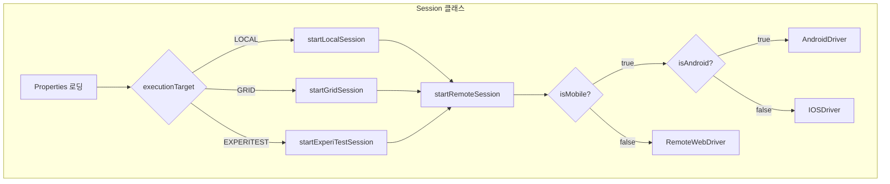
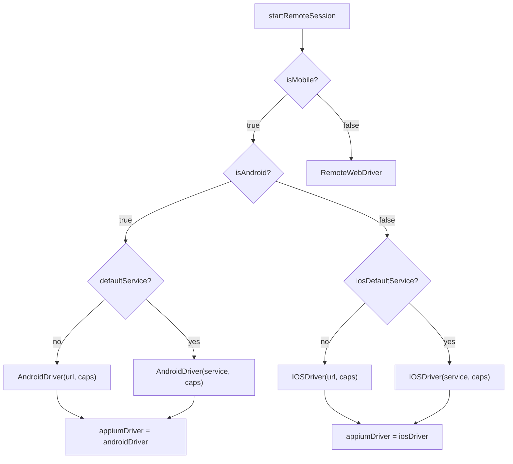
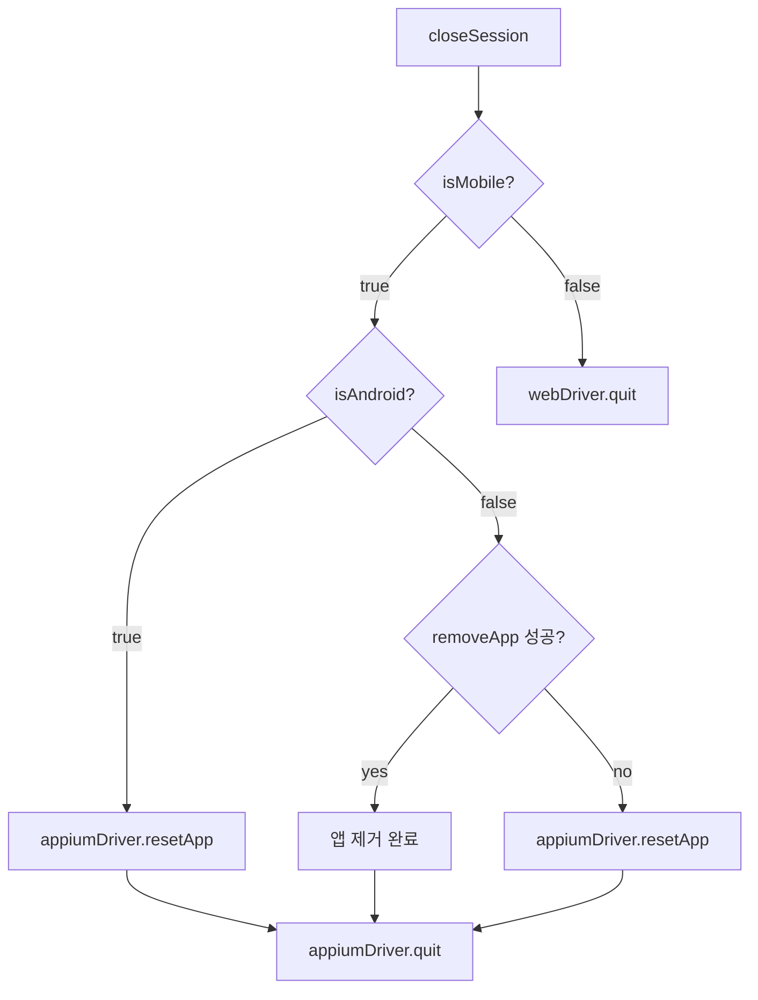

# Chapter 5: Creating Android, iOS, and Web Drivers on Demand (드라이버 생성)

## 📌 핵심 요약

> **"Session 클래스는 드라이버 팩토리 역할을 한다. Properties 파일의 플래그를 기반으로 Android, iOS, Web 드라이버를 동적으로 생성하고, DesiredCapabilities를 설정하며, 세션 종료 시 Teardown을 수행한다."**

이 챕터에서는 uitest.properties의 설정값을 읽어 Android/iOS 드라이버를 생성하는 Session 클래스를 구현한다. LOCAL, GRID, EXPERITEST 등 다양한 실행 환경을 지원하며, AppiumDriverLocalService를 활용한 서버 관리 방법도 학습한다.

---

## 🎯 학습 목표

이 챕터를 완료하면 다음을 할 수 있다:

- [ ] Session 클래스로 드라이버 동적 생성
- [ ] Properties 파일에서 DesiredCapabilities 로드
- [ ] LOCAL/GRID/EXPERITEST 세션 구분
- [ ] AppiumDriverLocalService로 Appium 서버 관리
- [ ] Teardown 로직 구현

---

## 📖 본문 정리

### 5.1 Session 클래스 구조

```
파일 위치: src/test/java/com/taf/testautomation/Session.java
```



#### Session 클래스 필드

```java
@Setter
@Slf4j
public class Session {
    private WebDriver webDriver;
    private AppiumDriver<MobileElement> appiumDriver;
    private AndroidDriver<MobileElement> androidDriver;
    private IOSDriver<MobileElement> iosDriver;
    private Boolean isMobile;
    private HashMap<String, String> customProperties = new HashMap<>();
    protected String prevBuild = "no";

    // Properties 로딩
    Reader reader;
    ClassLoader loader = this.getClass().getClassLoader();
    URL myURL = loader.getResource("uitest.properties");
    String path = myURL.getPath();
}
```

| 필드 | 타입 | 역할 |
|------|------|------|
| `webDriver` | WebDriver | Web 테스트용 |
| `appiumDriver` | AppiumDriver | 공통 모바일 드라이버 참조 |
| `androidDriver` | AndroidDriver | Android 전용 |
| `iosDriver` | IOSDriver | iOS 전용 |
| `customProperties` | HashMap | Properties 값 저장 |
| `prevBuild` | String | 이전 빌드 테스트 플래그 |

---

### 5.2 Properties 로딩 (Non-static Block)

```java
{
    try {
        reader = new FileReader(path);
    } catch (FileNotFoundException e) {
        e.printStackTrace();
    }
    Properties prop = new Properties();
    try {
        prop.load(reader);
    } catch (IOException e) {
        e.printStackTrace();
    }
    prop.forEach((k, v) -> customProperties.put(k.toString(), v.toString()));
}
```

**Non-static Block 사용 이유**:
- 같은 Session 객체를 여러 Page Object 생성자에 전달
- Static Block 불필요

---

### 5.3 세션 시작 로직

#### startSession() 메서드

```java
public void startSession() throws Exception {
    if (customProperties.get("executionTarget").isEmpty()) {
        throw new RuntimeException("Session configuration error, execution target is empty");
    } else if (customProperties.get("executionTarget").equals("LOCAL")) {
        startLocalSession();
    } else if (customProperties.get("executionTarget").equals("GRID")) {
        startGridSession();
    } else if (customProperties.get("executionTarget").equals("EXPERITEST")) {
        startExperiTestSession();
    }
}
```

#### 실행 타겟별 처리

| executionTarget | 메서드 | 설명 |
|-----------------|--------|------|
| `LOCAL` | `startLocalSession()` | 로컬 Appium 서버 |
| `GRID` | `startGridSession()` | Selenium Grid |
| `EXPERITEST` | `startExperiTestSession()` | SeeTest 클라우드 |

---

### 5.4 드라이버 생성 (startRemoteSession)

```java
private void startRemoteSession(URL url, final DesiredCapabilities desiredCapabilities)
        throws IOException {
    if (Boolean.parseBoolean(customProperties.get("isMobile"))) {
        if (Boolean.parseBoolean(customProperties.get("isAndroid"))) {
            if (customProperties.get("defaultService").equals("no")) {
                // URL 기반 드라이버 생성
                this.androidDriver = new AndroidDriver(url, desiredCapabilities);
                this.appiumDriver = this.androidDriver;
            } else {
                // AppiumDriverLocalService 사용
                Runtime.getRuntime().exec("./command.txt");
                AppiumDriverLocalService service = AppiumDriverLocalService.buildDefaultService();
                service.start();
                this.androidDriver = new AndroidDriver(service, desiredCapabilities);
                this.appiumDriver = this.androidDriver;
            }
        } else if (Boolean.parseBoolean(customProperties.get("isIos"))) {
            if (customProperties.get("iosDefaultService").equals("no")) {
                this.iosDriver = new IOSDriver(url, desiredCapabilities);
                this.appiumDriver = this.iosDriver;
            } else {
                File testLogFile = new File("./log.txt");
                Runtime.getRuntime().exec("./command.txt");
                AppiumDriverLocalService service = new AppiumServiceBuilder()
                        .withLogFile(testLogFile).build();
                service.start();
                this.iosDriver = new IOSDriver(service, desiredCapabilities);
                this.appiumDriver = this.iosDriver;
            }
            this.webDriver = this.appiumDriver;
        } else {
            // Web 드라이버
            RemoteWebDriver remoteWebDriver = new RemoteWebDriver(url, desiredCapabilities);
            this.webDriver = remoteWebDriver;
            this.webDriver.manage().window().maximize();
        }
    }
}
```

#### 드라이버 생성 흐름도



---

### 5.5 DesiredCapabilities 설정

#### Android Capabilities

```java
public DesiredCapabilities getDesiredCapabilities() {
    DesiredCapabilities desiredCapabilities = new DesiredCapabilities();

    if (Boolean.parseBoolean(customProperties.get("isAndroid"))) {
        desiredCapabilities.setCapability("platformName", customProperties.get("platformName"));
        desiredCapabilities.setCapability("platformVersion", customProperties.get("platformVersion"));
        desiredCapabilities.setCapability("deviceName", customProperties.get("deviceName"));
        desiredCapabilities.setCapability("noReset", customProperties.get("noReset"));
        desiredCapabilities.setCapability("appPackage", customProperties.get("appPackage"));
        desiredCapabilities.setCapability("appActivity", customProperties.get("appActivity"));
        desiredCapabilities.setCapability("automationName", customProperties.get("automationName"));

        // 이전 빌드 테스트 지원
        if (prevBuild.equals("yes")) {
            desiredCapabilities.setCapability("app", customProperties.get("appOld"));
        } else {
            desiredCapabilities.setCapability("app", customProperties.get("app"));
        }
    }

    return desiredCapabilities;
}
```

#### iOS Capabilities

```java
if (Boolean.parseBoolean(customProperties.get("isIos"))) {
    desiredCapabilities.setCapability("platformName", customProperties.get("iosPlatformName"));
    desiredCapabilities.setCapability("platformVersion", customProperties.get("iosPlatformVersion"));
    desiredCapabilities.setCapability("deviceName", customProperties.get("iosDeviceName"));
    desiredCapabilities.setCapability("app", customProperties.get("iosApp"));
    desiredCapabilities.setCapability("noReset", customProperties.get("iosNoReset"));
    desiredCapabilities.setCapability("automationName", customProperties.get("iosAutomationName"));
    desiredCapabilities.setCapability("udid", customProperties.get("iosUdid"));
    desiredCapabilities.setCapability("xcodeOrgId", customProperties.get("iosXcodeOrgId"));
    desiredCapabilities.setCapability("xcodeSigningId", customProperties.get("iosXcodeSigningId"));

    // 로컬라이제이션 테스트
    if (customProperties.get("localization").equals("yes")) {
        desiredCapabilities.setCapability("language", customProperties.get("appLanguage"));
        desiredCapabilities.setCapability("locale", customProperties.get("appLanguage"));
    } else {
        desiredCapabilities.setCapability("showIOSLog", customProperties.get("showIOSLog"));
    }
}
```

#### Capabilities 요약

| 플랫폼 | 필수 Capability | 옵션 Capability |
|--------|----------------|-----------------|
| **Android** | platformName, platformVersion, deviceName, appPackage, appActivity | noReset, automationName, app |
| **iOS** | platformName, platformVersion, deviceName, udid, xcodeOrgId | noReset, automationName, app, language, locale |

---

### 5.6 AppiumDriverLocalService 활용

#### 기본 서비스 생성

```java
// 방법 1: buildDefaultService()
AppiumDriverLocalService service = AppiumDriverLocalService.buildDefaultService();
service.start();

// 방법 2: AppiumServiceBuilder
AppiumDriverLocalService service = new AppiumServiceBuilder()
        .withLogFile(new File("./log.txt"))
        .build();
service.start();
```

#### 기존 Appium 프로세스 종료 스크립트

**Mac/Linux (command.txt)**:
```bash
#! /bin/bash
cd ~
lsof -t -i tcp:4723 | xargs kill -9
```

**Windows (command.bat)**:
```batch
@ECHO OFF
FOR /F "tokens=5 delims= " %%P IN ('netstat -a -n -o ^| findstr :8080') DO TaskKill.exe /PID %%P
PAUSE
```

---

### 5.7 드라이버 Getter 메서드

```java
public AppiumDriver<MobileElement> getAppiumDriver() {
    if (Boolean.parseBoolean(customProperties.get("isMobile"))) {
        return this.appiumDriver;
    }
    throw new IllegalArgumentException("Appium driver requested, but session is not configured");
}

public AndroidDriver<MobileElement> getAndroidDriver() {
    if (Boolean.parseBoolean(customProperties.get("isAndroid"))) {
        return this.androidDriver;
    }
    throw new IllegalArgumentException("Android driver requested, but session is not configured");
}

public IOSDriver<MobileElement> getIosDriver() {
    if (Boolean.parseBoolean(customProperties.get("isIos"))) {
        return this.iosDriver;
    }
    throw new IllegalArgumentException("iOS driver requested, but session is not configured");
}
```

---

### 5.8 Teardown (closeSession)

```java
public void closeSession() {
    if (Boolean.parseBoolean(customProperties.get("isMobile"))) {
        try {
            if (customProperties.get("isAndroid").equals("true")) {
                appiumDriver.resetApp();  // Android: 앱 리셋
            } else if (!appiumDriver.removeApp(customProperties.get("iosBundleId"))) {
                appiumDriver.resetApp();  // iOS: 앱 제거 시도, 실패 시 리셋
            }
        } catch (Exception e) {
            log.error("Error closing App");
            e.printStackTrace();
        }
        try {
            appiumDriver.quit();
        } catch (Exception e) {
            log.error("Error closing session");
            e.printStackTrace();
        }
    } else {
        getWebDriver().quit();
    }
}
```

#### Teardown 프로세스



| 플랫폼 | Teardown 방식 | 이유 |
|--------|--------------|------|
| **Android** | `resetApp()` | 리셋이 안정적으로 동작 |
| **iOS** | `removeApp()` → `resetApp()` | 앱 제거 우선 시도 |

---

### 5.9 SeeTest (ExperiTest) 지원

```java
public DesiredCapabilities getDesiredCapabilitiesSeeTest() {
    DesiredCapabilities desiredCapabilities = new DesiredCapabilities();

    if (Boolean.parseBoolean(customProperties.get("isAndroid"))) {
        desiredCapabilities.setCapability("accessKey", customProperties.get("accessKey"));
        desiredCapabilities.setCapability("testName", customProperties.get("testNameAndroid"));
        desiredCapabilities.setCapability("deviceQuery", customProperties.get("deviceQueryAndroid"));
        desiredCapabilities.setCapability(MobileCapabilityType.APP, customProperties.get("cloudAppAndroid"));
        desiredCapabilities.setCapability(AndroidMobileCapabilityType.APP_PACKAGE, customProperties.get("appPackage"));
        desiredCapabilities.setCapability(AndroidMobileCapabilityType.APP_ACTIVITY, customProperties.get("appActivity"));
    }

    if (Boolean.parseBoolean(customProperties.get("isIos"))) {
        desiredCapabilities.setCapability("accessKey", customProperties.get("accessKey"));
        desiredCapabilities.setCapability("testName", customProperties.get("testNameIos"));
        desiredCapabilities.setCapability("deviceQuery", customProperties.get("deviceQueryIos"));
        desiredCapabilities.setCapability("appVersion", customProperties.get("appVersionIos"));
        desiredCapabilities.setCapability("platformName", customProperties.get("iosPlatformName"));
        desiredCapabilities.setCapability("newCommandTimeout", customProperties.get("newCommandTimeout"));
        desiredCapabilities.setCapability("automationName", customProperties.get("iosAutomationName"));
        desiredCapabilities.setCapability("app", customProperties.get("cloudAppIos"));
        desiredCapabilities.setCapability("bundleId", customProperties.get("iosBundleId"));
    }

    return desiredCapabilities;
}
```

---

## 💡 실무 적용 포인트

### Session 클래스 설계 체크리스트

```
□ Properties 로딩
  ├── Non-static block으로 uitest.properties 로드
  └── HashMap에 key-value 저장

□ 세션 시작
  ├── executionTarget 분기 (LOCAL/GRID/EXPERITEST)
  ├── DesiredCapabilities 생성
  └── 드라이버 인스턴스화

□ 드라이버 생성
  ├── isMobile 체크
  ├── isAndroid/isIos 분기
  ├── defaultService 여부에 따른 서버 생성
  └── appiumDriver에 공통 참조 저장

□ Teardown
  ├── Android: resetApp() → quit()
  └── iOS: removeApp() → resetApp() → quit()
```

### prevBuild 활용 (버전 테스트)

```java
// 테스트 스위트에서 이전 빌드 테스트 설정
session.setPrevBuild("yes");  // Lombok @Setter 활용
session.startSession();       // appOld 경로의 APK 사용
```

### 로컬라이제이션 테스트

```java
// uitest.properties
localization=yes
appLanguage=es-ES

// DesiredCapabilities에 자동 추가
desiredCapabilities.setCapability("language", "es-ES");
desiredCapabilities.setCapability("locale", "es-ES");
```

---

## ✅ 핵심 개념 체크리스트

- [ ] Session 클래스의 드라이버 팩토리 역할
- [ ] Non-static block으로 Properties 로딩
- [ ] executionTarget별 세션 시작 분기
- [ ] DesiredCapabilities Android vs iOS 차이
- [ ] AppiumDriverLocalService 두 가지 생성 방식
- [ ] 기존 Appium 프로세스 종료 스크립트 (Mac/Windows)
- [ ] Teardown 시 Android/iOS 차이 (resetApp vs removeApp)
- [ ] SeeTest 클라우드 Capabilities

---

## 🔗 참고 자료

- [Appium Desired Capabilities](http://appium.io/docs/en/writing-running-appium/caps/)
- [AppiumDriverLocalService](http://appium.io/docs/en/advanced-concepts/server-args/)
- [AndroidDriver API](https://javadoc.io/doc/io.appium/java-client/latest/io/appium/java_client/android/AndroidDriver.html)
- [IOSDriver API](https://javadoc.io/doc/io.appium/java-client/latest/io/appium/java_client/ios/IOSDriver.html)

---

## 📚 다음 챕터 미리보기

- **Chapter 6**: MobileBaseActionScreen 클래스 - 공통 모바일 액션 (tap, click, swipe, scroll 등) 구현
