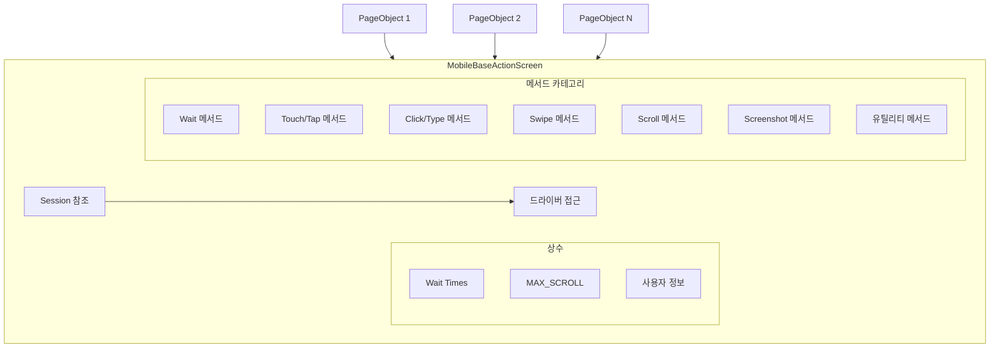
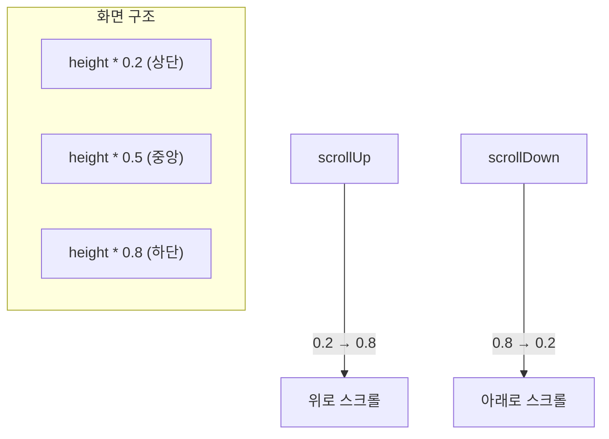

# Chapter 6: Enhancing the Framework - Common Mobile Actions (공통 모바일 액션)

## 📌 핵심 요약

> **"MobileBaseActionScreen은 모든 Page Object의 부모 클래스다. Wait, Click, Tap, Swipe, Scroll, Screenshot 등 공통 액션을 정의하고, Session 객체를 통해 Appium 드라이버에 접근한다. 모든 Page Object는 이 클래스를 상속받아 재사용 가능한 메서드를 활용한다."**

이 챕터에서는 Direction/SwipeDirection Enum을 생성하고, MobileBaseActionScreen 클래스에 공통 모바일 액션 메서드를 구현한다. FluentWait, TouchAction, Scroll, Screenshot 등 다양한 유틸리티 메서드를 학습한다.

---

## 🎯 학습 목표

이 챕터를 완료하면 다음을 할 수 있다:

- [ ] Direction, SwipeDirection Enum 생성
- [ ] MobileBaseActionScreen 클래스 구조 이해
- [ ] FluentWait 기반 대기 메서드 구현
- [ ] TouchAction 기반 Tap/Swipe 구현
- [ ] Scroll 액션 구현 (Android UiScrollable 포함)
- [ ] Screenshot 캡처 메서드 구현

---

## 📖 본문 정리

### 6.1 Enum 정의

#### Direction Enum (스크롤용)

```java
// 파일: src/main/java/com/taf/testautomation/Direction.java
package com.taf.testautomation;

public enum Direction {
    UP,
    DOWN,
    LEFT,
    RIGHT;
}
```

#### SwipeDirection Enum (스와이프용)

```java
// 파일: src/main/java/com/taf/testautomation/SwipeDirection.java
package com.taf.testautomation;

public enum SwipeDirection {
    RIGHT("right"),
    LEFT("left");

    private String direction;

    SwipeDirection(String direction) {
        this.direction = direction;
    }

    public String direction() {
        return direction;
    }
}
```

| Enum | 용도 | 값 |
|------|------|-----|
| `Direction` | 스크롤 방향 | UP, DOWN, LEFT, RIGHT |
| `SwipeDirection` | 스와이프 방향 | RIGHT, LEFT (문자열 포함) |

---

### 6.2 PdfUtil 빈 메서드 (Chapter 12 준비)

```java
// 파일: src/main/java/com/taf/testautomation/utilities/pdfutil/PdfUtil.java
public static void getPdfFromImage(String image, String pdfFile) { }
```

---

### 6.3 MobileBaseActionScreen 구조

```
파일 위치: src/test/java/com/taf/testautomation/screens/MobileBaseActionScreen.java
```



#### 상수 정의

```java
@Slf4j
public class MobileBaseActionScreen {
    private Session session;

    // Wait 타임아웃 상수
    public static final int MIN_WAIT = 2;
    public static final int SMALL_WAIT = 10;
    public static final int MED_WAIT = 30;
    public static final int LONG_WAIT = 60;
    public static final int MAX_WAIT = 120;

    // 스크롤 최대 횟수 (무한 루프 방지)
    public static final int MAX_SCROLL = 100;

    // 사용자 정보 (계정 생성 테스트용)
    protected static String email;
    protected static String password;
    protected static String firstName;
    protected static String lastName;

    public MobileBaseActionScreen(Session session) {
        this.session = session;
    }

    public Session getSession() {
        return this.session;
    }
}
```

| 상수 | 값 | 용도 |
|------|-----|------|
| `MIN_WAIT` | 2초 | 빠른 대기 |
| `SMALL_WAIT` | 10초 | 짧은 대기 |
| `MED_WAIT` | 30초 | 중간 대기 |
| `LONG_WAIT` | 60초 | 긴 대기 |
| `MAX_WAIT` | 120초 | 최대 대기 |
| `MAX_SCROLL` | 100회 | 무한 스크롤 방지 |

---

### 6.4 Wait 메서드

#### FluentWait 구현

```java
/**
 * FluentWait 인스턴스 생성
 */
protected <K> FluentWait<K> waitOn(K object, int timeOutSeconds) {
    return new FluentWait<>(object)
            .ignoring(NoSuchElementException.class)
            .ignoring(StaleElementReferenceException.class)
            .ignoring(Exception.class)
            .withTimeout(Duration.ofSeconds(timeOutSeconds));
}

public FluentWait<MobileDriver<MobileElement>> getWait() {
    return waitOn(getSession().getAppiumDriver(), MAX_WAIT);
}
```

#### 요소 존재 여부 확인

```java
protected boolean doesElementExist(MobileElement element, int timeout) {
    try {
        waitOn(getSession().getAppiumDriver(), timeout).until(visibilityOf(element));
    } catch (Exception toe) {
        return false;
    }
    return true;
}
```

#### 대기 메서드들

```java
// 초 단위 대기
protected void waitInSeconds(int seconds) {
    try {
        TimeUnit.SECONDS.sleep(seconds);
    } catch (InterruptedException e) {
        log.error("Interrupted!", e);
        Thread.currentThread().interrupt();
    }
}

// 요소가 클릭 가능할 때까지 대기
protected void waitForDisplayedElement(MobileElement element, int seconds) {
    waitOn(getSession().getAppiumDriver(), seconds).until(elementToBeClickable(element));
}

// 요소가 사라질 때까지 대기
protected void waitForInvisibilityOf(MobileElement element, int timeout) {
    try {
        waitOn(getSession().getAppiumDriver(), timeout).until(invisibilityOf(element));
    } catch (Exception e) {
        log.info("The element is not displayed");
    }
}
```

---

### 6.5 TouchAction 메서드

#### TouchAction 인스턴스

```java
protected TouchAction getTouchAction() {
    return new TouchAction(getSession().getAppiumDriver());
}
```

#### Tap 액션

```java
// 요소에 탭
protected void tapOn(MobileElement element) {
    getTouchAction()
        .tap(point(element.getLocation().getX(), element.getLocation().getY()))
        .perform();
}

// 좌표에 탭
protected void tapByCoordinates(int x, int y) {
    getTouchAction().tap(point(x, y)).perform();
}
```

#### Touch 액션 (스와이프 기본)

```java
public void touchAction(int width, int start, int end) {
    getTouchAction()
        .press(point(width, start))
        .waitAction(waitOptions(ofMillis(1000)))
        .moveTo(point(width, end))
        .release()
        .perform();
}

protected void swipeTouchAction(int startx, int starty, int endx, int endy, int duration) {
    getTouchAction()
        .press(PointOption.point(startx, starty))
        .waitAction(WaitOptions.waitOptions(Duration.ofMillis(duration)))
        .moveTo(PointOption.point(endx, endy))
        .release()
        .perform();
}
```

---

### 6.6 Click/Type 메서드

```java
// 클릭
protected void click(MobileElement element) {
    getWait().until(elementToBeClickable(element)).click();
}

// 텍스트 입력
public void type(MobileElement element, String text) {
    getWait().until(elementToBeClickable(element));
    element.clear();
    element.sendKeys(text);
}

// 클릭 후 텍스트 입력
public void clickAndType(MobileElement element, String text) {
    getWait().until(elementToBeClickable(element));
    element.click();
    element.clear();
    element.sendKeys(text);
}
```

---

### 6.7 요소 위치/크기 메서드

```java
// 중심 좌표
public int getXCenter(MobileElement element) {
    int leftX = element.getLocation().getX();
    int rightX = leftX + element.getSize().getWidth();
    return (rightX + leftX) / 2;
}

public int getYCenter(MobileElement element) {
    int upperY = element.getLocation().getY();
    int lowerY = upperY + element.getSize().getHeight();
    return (upperY + lowerY) / 2;
}

// 위치 및 크기
protected Integer getX(MobileElement element) { return element.getLocation().getX(); }
protected Integer getY(MobileElement element) { return element.getLocation().getY(); }
protected Integer getWidth(MobileElement element) { return element.getSize().getWidth(); }
protected Integer getHeight(MobileElement element) { return element.getSize().getHeight(); }

// 끝 위치
public Integer getEndPositionInX(MobileElement element) { return getX(element) + getWidth(element); }
public Integer getEndPositionInY(MobileElement element) { return getY(element) + getHeight(element); }
```

#### 요소 상대 위치 비교

```java
// element1이 element2 아래에 있는지 확인
public boolean checkIfFirstElementIsDisplayedBelowSecondElement(
        MobileElement element1, MobileElement element2) {
    return element1.getLocation().getY() > element2.getLocation().getY();
}

// element2가 element1 오른쪽에 있는지 확인
public boolean isElementRightSideOfOther(MobileElement element1, MobileElement element2) {
    return element1.getLocation().getX() < element2.getLocation().getX();
}
```

---

### 6.8 Swipe 메서드

#### 수평 스와이프

```java
public void horizontalSwipe(SwipeDirection direction) {
    waitInSeconds(MIN_WAIT);
    Dimension size = getSession().getAppiumDriver().manage().window().getSize();
    int anchor = size.getHeight();
    int startPoint = size.getWidth();
    int endPoint = size.getWidth();
    swipeActionDirectional(direction, anchor, startPoint, endPoint, 0.50);
}

public void horizontalSwipeAcrossWidth(SwipeDirection direction) {
    waitInSeconds(MIN_WAIT);
    Dimension size = getSession().getAppiumDriver().manage().window().getSize();
    int startPoint = 0, endPoint = 0;
    int anchor = size.getHeight();
    if (direction.name().equalsIgnoreCase(SwipeDirection.RIGHT.direction())) {
        startPoint = size.getWidth();
        endPoint = size.getWidth();
    } else {
        startPoint = 1;
        endPoint = size.getWidth();
    }
    swipeActionDirectional(direction, anchor, startPoint, endPoint, 0.50);
}
```

#### 요소 기준 스와이프

```java
public void horizontalSwipeOnContent(MobileElement element, SwipeDirection direction) {
    scrollFastToElement(element);
    int yCenter = getYCenter(element);
    int startPoint = 0, endPoint = 0;
    Dimension size = getSession().getAppiumDriver().manage().window().getSize();

    if (direction.equals(SwipeDirection.RIGHT)) {
        startPoint = getXCenter(element);
        endPoint = (int) (size.getWidth() * 0.1);
    } else {
        startPoint = getXCenter(element);
        endPoint = (int) (size.getWidth() * 0.9);
    }
    swipeTouchAction(startPoint, yCenter, endPoint, yCenter, 500);
}
```

---

### 6.9 Scroll 메서드

#### 기본 스크롤

```java
protected void scroll(Direction direction) {
    HashMap<String, String> scrollObject = new HashMap<>();
    scrollObject.put("direction", direction.name().toLowerCase());
    getSession().getAppiumDriver().executeScript("mobile: scroll", new Object[]{scrollObject});
}
```

#### TouchAction 기반 스크롤

```java
// 빠른 아래로 스크롤
public void fastScrollDownTouchAction() {
    Dimension size = getSession().getAppiumDriver().manage().window().getSize();
    int width = size.getWidth() / 2;
    int start = (int) (size.getHeight() * 0.8);
    int end = (int) (size.getHeight() * 0.2);
    touchAction(width, start, end);
}

// 느린 아래로 스크롤
public void slowScrollDownTouchAction() {
    Dimension size = getSession().getAppiumDriver().manage().window().getSize();
    int width = size.getWidth() / 2;
    int start = (int) (size.getHeight() * 0.8);
    int end = (int) (size.getHeight() * 0.6);
    touchAction(width, start, end);
}

// 빠른 위로 스크롤
public void scrollUpTouchAction() {
    Dimension size = getSession().getAppiumDriver().manage().window().getSize();
    int width = size.getWidth() / 2;
    int start = (int) (size.getHeight() * 0.2);
    int end = (int) (size.getHeight() * 0.8);
    touchAction(width, start, end);
}
```

#### 스크롤 좌표 계산



#### 요소까지 스크롤

```java
public MobileElement scrollFastToElement(MobileElement element) {
    for (int scroll = 0; scroll < MAX_SCROLL; scroll++) {
        try {
            if (element.isDisplayed())
                return element;
            else
                fastScrollDownTouchAction();
        } catch (Exception e) {
            fastScrollDownTouchAction();
        }
    }
    return null;
}
```

#### Android UiScrollable (텍스트로 스크롤)

```java
public MobileElement scrollToTextAndroid(String text) {
    String automator = "new UiScrollable(new UiSelector().scrollable(true))"
            + ".scrollIntoView(new UiSelector().text(\"%s\"))";
    return (AndroidElement) getWait().until(
            visibilityOfElementLocated(AndroidUIAutomator(format(automator, text))));
}
```

---

### 6.10 앱 관리 메서드

```java
// 백그라운드로 보내기
@Step("Send app to background")
public void sendAppToBackground(int seconds) {
    log.info("Send app to background " + seconds + " seconds");
    getSession().getAppiumDriver().runAppInBackground(Duration.ofSeconds(seconds));
}

// 앱 재시작
public void restartApp() {
    if (getSession().getCustomProperties().get("isIos").equals("true"))
        restartAppIos();
    else if (getSession().getCustomProperties().get("isAndroid").equals("true"))
        restartAppAndroid();
}

private void restartAppIos() {
    getSession().getAppiumDriver().closeApp();
    getSession().getAppiumDriver().launchApp();
}

@Step("Restart the Android application.")
private void restartAppAndroid() {
    if (getSession().getCustomProperties().get("defaultService").equals("yes")) {
        getSession().getAppiumDriver().launchApp();
        getSession().getAppiumDriver().activateApp(getSession().getCustomProperties().get("appPackage"));
    } else {
        try {
            getSession().getAppiumDriver().activateApp(getSession().getCustomProperties().get("appPackage"));
        } catch (Exception e) {
            AndroidDriver<MobileElement> androidDriver =
                    (AndroidDriver<MobileElement>) getSession().getAppiumDriver();
            getSession().getAppiumDriver().closeApp();
            Activity activity = new Activity(
                    getSession().getCustomProperties().get("appPackage"),
                    getSession().getCustomProperties().get("appActivity"));
            activity.setAppWaitActivity("com.xxxx");
            androidDriver.startActivity(activity);
        }
    }
}
```

---

### 6.11 Screenshot 메서드

```java
// 기본 스크린샷
public void takeScreenShot() throws IOException {
    File scrFile = ((TakesScreenshot) getSession().getAppiumDriver())
            .getScreenshotAs(OutputType.FILE);
    BufferedImage image = ImageIO.read(scrFile);
    File outputFile = new File("screenshot.png");
    ImageIO.write(image, "png", outputFile);
}

// 파일명 지정
public void takeScreenShot(String fileName) throws IOException {
    File scrFile = ((TakesScreenshot) getSession().getAppiumDriver())
            .getScreenshotAs(OutputType.FILE);
    BufferedImage image = ImageIO.read(scrFile);
    File outputFile = new File(fileName);
    ImageIO.write(image, "png", outputFile);
}

// PDF 변환
public void takeScreenShotPdf(String fileName) throws IOException {
    File scrFile = ((TakesScreenshot) getSession().getAppiumDriver())
            .getScreenshotAs(OutputType.FILE);
    BufferedImage image = ImageIO.read(scrFile);
    File outputFile = new File(fileName);
    ImageIO.write(image, "png", outputFile);
    String name = fileName.substring(fileName.lastIndexOf("/") + 1, fileName.indexOf("."));
    PdfUtil.getPdfFromImage(fileName, "test-output/PdfReport/" + name + ".pdf");
}
```

---

### 6.12 배경색 검증 메서드

```java
@Step("Verifying if Background Color is Displayed in graph")
public boolean isBackGroundColorDisplayed(MobileElement element, double number, String color)
        throws IOException {
    int x1 = getXCenter(element);
    int y = getYCenter(element);
    int y1 = (int) (y + (getHeight(element) * number));

    File scrFile = ((TakesScreenshot) getSession().getAppiumDriver())
            .getScreenshotAs(OutputType.FILE);
    BufferedImage image = ImageIO.read(scrFile);

    int clr = image.getRGB(x1, y1);
    int red = (clr & 0x00ff0000) >> 16;
    int green = (clr & 0x0000ff00) >> 8;
    int blue = clr & 0x000000ff;

    if (color.equals("blue"))
        return ((blue > 200) && (red < 100) && (green < 100));
    if (color.equals("green"))
        return ((green > 200) && (red < 100) && (blue < 100));
    if (color.equals("red"))
        return ((red > 200) && (green < 100) && (blue < 100));
    return false;
}
```

---

## 💡 실무 적용 포인트

### MobileBaseActionScreen 메서드 분류

```
Wait 메서드:
├── waitOn() - FluentWait 생성
├── getWait() - MAX_WAIT FluentWait
├── doesElementExist() - 요소 존재 확인
├── waitInSeconds() - 초 대기
├── waitForDisplayedElement() - 클릭 가능 대기
└── waitForInvisibilityOf() - 사라짐 대기

Touch/Tap 메서드:
├── getTouchAction() - TouchAction 인스턴스
├── touchAction() - 좌표 기반 터치
├── swipeTouchAction() - 스와이프 터치
├── tapOn() - 요소 탭
└── tapByCoordinates() - 좌표 탭

Click/Type 메서드:
├── click() - 클릭
├── type() - 텍스트 입력
└── clickAndType() - 클릭 후 입력

Swipe 메서드:
├── horizontalSwipe() - 수평 스와이프
├── horizontalSwipeAcrossWidth() - 전체 너비 스와이프
└── horizontalSwipeOnContent() - 요소 기준 스와이프

Scroll 메서드:
├── scroll() - mobile:scroll 스크립트
├── scrollUpTouchAction() - 위로 스크롤
├── fastScrollDownTouchAction() - 빠른 아래 스크롤
├── slowScrollDownTouchAction() - 느린 아래 스크롤
├── scrollFastToElement() - 요소까지 스크롤
├── scrollToText() - 텍스트로 스크롤
└── scrollToTextAndroid() - UiScrollable 사용

앱 관리 메서드:
├── sendAppToBackground() - 백그라운드
├── restartApp() - 앱 재시작
├── restartAppIos() - iOS 재시작
├── restartAppAndroid() - Android 재시작
└── navigateBack() - 뒤로가기

Screenshot 메서드:
├── takeScreenShot() - 기본 캡처
├── takeScreenShot(fileName) - 파일명 지정
└── takeScreenShotPdf() - PDF 변환
```

### 상수 사용 권장사항

```java
// ✅ 권장: 상수 사용
doesElementExist(element, MIN_WAIT);
waitForDisplayedElement(element, SMALL_WAIT);

// ❌ 비권장: 하드코딩
doesElementExist(element, 2);
waitForDisplayedElement(element, 10);
```

---

## ✅ 핵심 개념 체크리스트

- [ ] Direction/SwipeDirection Enum 구조
- [ ] MobileBaseActionScreen이 모든 Page Object의 부모
- [ ] Session 객체를 통한 드라이버 접근
- [ ] FluentWait 기반 대기 메서드
- [ ] TouchAction 기반 Tap/Swipe
- [ ] 좌표 계산 메서드 (getXCenter, getYCenter)
- [ ] Android UiScrollable 사용법
- [ ] InteractsWithApps 인터페이스 메서드 (closeApp, launchApp, activateApp)
- [ ] Screenshot 캡처 및 PDF 변환

---

## 🔗 참고 자료

- [Appium TouchAction](http://appium.io/docs/en/writing-running-appium/touch-actions/)
- [Android UiScrollable](https://developer.android.com/reference/androidx/test/uiautomator/UiScrollable)
- [FluentWait Documentation](https://www.selenium.dev/selenium/docs/api/java/org/openqa/selenium/support/ui/FluentWait.html)
- [Appium InteractsWithApps](https://javadoc.io/doc/io.appium/java-client/latest/io/appium/java_client/InteractsWithApps.html)

---

## 📚 다음 챕터 미리보기

- **Chapter 7**: Page Object 생성 - 로케이터 정의, 요소 초기화, 화면 탐색, Assertion 메서드 구현
