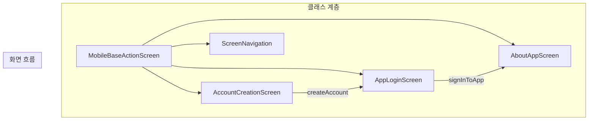
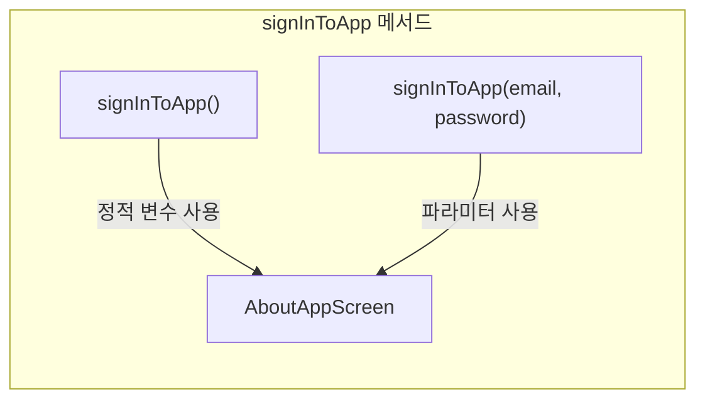
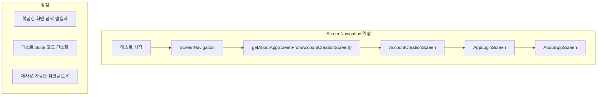
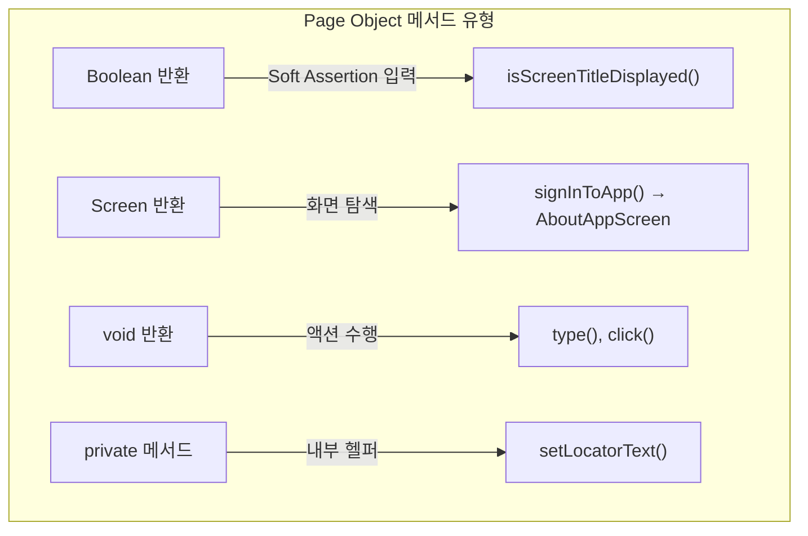
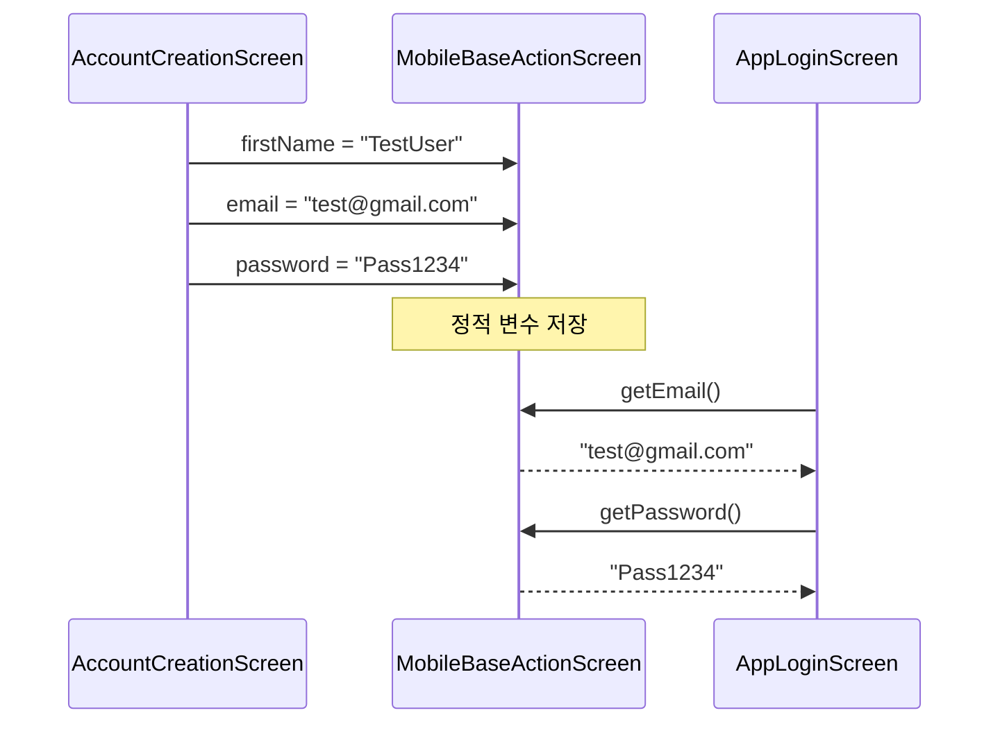

# Chapter 7: Creating Page Objects (Page Object 생성)

## 📌 핵심 요약

> **"Page Object Model(POM)은 화면별로 로케이터와 액션을 캡슐화한다. @AndroidFindBy, @iOSXCUITFindBy로 요소를 정의하고, PageFactory.initElements로 초기화하며, @HowToUseLocators로 다중 로케이터를 지원한다. Workflow 클래스로 화면 탐색을 체계화한다."**

이 챕터에서는 AccountCreationScreen, AppLoginScreen, AboutAppScreen 등 Page Object를 구현하고, ScreenNavigation Workflow 클래스로 화면 탐색을 관리한다.

---

## 🎯 학습 목표

이 챕터를 완료하면 다음을 할 수 있다:

- [ ] Page Object Model 패턴 이해 및 적용
- [ ] @AndroidFindBy, @iOSXCUITFindBy 로케이터 정의
- [ ] @HowToUseLocators로 다중 로케이터 설정
- [ ] PageFactory.initElements로 요소 초기화
- [ ] 화면 탐색 메서드 구현 (Screen 객체 반환)
- [ ] Boolean 반환 Assertion 메서드 구현
- [ ] Workflow 클래스로 화면 탐색 관리

---

## 📖 본문 정리

### 7.1 폴더 구조

```
src/test/java/com/taf/testautomation/
├── screens/
│   ├── MobileBaseActionScreen.java
│   ├── AccountCreationScreen.java
│   ├── AppLoginScreen.java
│   └── AboutAppScreen.java
└── workflows/
    └── ScreenNavigation.java
```



---

### 7.2 AccountCreationScreen (계정 생성 화면)

```java
package com.taf.testautomation.screens;

import com.taf.testautomation.Session;
import io.appium.java_client.MobileElement;
import io.appium.java_client.pagefactory.*;
import io.qameta.allure.Step;
import org.apache.commons.lang3.RandomStringUtils;
import org.openqa.selenium.support.PageFactory;

public class AccountCreationScreen extends MobileBaseActionScreen {

    public AccountCreationScreen(Session session) {
        super(session);
        PageFactory.initElements(
            new AppiumFieldDecorator(session.getAppiumDriver()),
            this
        );
    }

    private String XPATH_ANDROID = "", XPATH_IOS = "";

    // 로케이터 정의
    @AndroidFindBy(xpath = "//android.widget.EditText[@text='xxxx']")
    @iOSXCUITFindBy(accessibility = "xxxx")
    private MobileElement firstNameField;

    @AndroidFindBy(xpath = "//android.widget.EditText[@text='xxxx']")
    @iOSXCUITFindBy(accessibility = "xxxx")
    private MobileElement lastNameField;

    @AndroidFindBy(xpath = "//android.widget.EditText[@text='xxxx']")
    @iOSXCUITFindBy(accessibility = "xxxx")
    private MobileElement emailIdField;

    @AndroidFindBy(xpath = "//android.widget.EditText[@text='xxxx']")
    @iOSXCUITFindBy(accessibility = "xxxx")
    private MobileElement passwordField;

    @AndroidFindBy(xpath = "//android.widget.EditText[@text='xxxx']")
    @iOSXCUITFindBy(accessibility = "xxxx")
    private MobileElement confirmPasswordField;

    @AndroidFindBy(xpath = "//android.widget.Button[@text='xxxx']")
    @iOSXCUITFindBy(accessibility = "xxxx")
    private MobileElement createAccountButton;

    // 다중 로케이터 설정
    @HowToUseLocators(androidAutomation = LocatorGroupStrategy.ALL_POSSIBLE,
            iOSXCUITAutomation = LocatorGroupStrategy.ALL_POSSIBLE)
    @AndroidFindBy(accessibility = "xxxx")
    @AndroidFindBy(xpath = "//android.widget.Button[@text='xxxx']")
    @iOSXCUITFindBy(accessibility = "xxxx")
    @iOSXCUITFindBy(xpath = "//XCUIElementTypeButton[@name='xxxx']")
    private MobileElement okButton;

    /**
     * 계정 생성 후 AppLoginScreen으로 이동
     * @return {@link AppLoginScreen}
     */
    @Step("Create account with firstName, lastName, email and password")
    public AppLoginScreen createAccount() {
        // RandomStringUtils로 테스트 데이터 생성
        firstName = RandomStringUtils.randomAlphanumeric(10);
        lastName = RandomStringUtils.randomAlphanumeric(10);
        email = RandomStringUtils.randomAlphanumeric(10) + "@gmail.com";
        password = RandomStringUtils.randomAlphanumeric(4)
                 + RandomStringUtils.randomNumeric(2)
                 + RandomStringUtils.random(2).toLowerCase()
                 + RandomStringUtils.random(2).toUpperCase();

        // 플랫폼별 분기 처리
        if (getSession().getCustomProperties().get("isAndroid").equals("true")) {
            type(firstNameField, firstName);
            type(lastNameField, lastName);
            type(emailIdField, email);
            type(passwordField, password);
        } else {
            clickAndType(firstNameField, firstName);
            clickAndType(lastNameField, lastName);
            clickAndType(emailIdField, email);
            clickAndType(passwordField, password);
            getSession().getAppiumDriver().hideKeyboard();
        }

        click(createAccountButton);

        if (doesElementExist(okButton, MIN_WAIT)) {
            click(okButton);
        }

        waitInSeconds(SMALL_WAIT);
        return new AppLoginScreen(getSession());
    }
}
```

#### 핵심 포인트

| 항목 | 설명 |
|------|------|
| **RandomStringUtils** | 테스트 데이터 자동 생성 |
| **플랫폼별 분기** | Android는 `type()`, iOS는 `clickAndType()` |
| **키보드 숨김** | iOS에서 `hideKeyboard()` 필요 |
| **정적 변수 공유** | `firstName`, `lastName`, `email`, `password`는 MobileBaseActionScreen의 정적 변수로 다른 Page Object에서도 접근 가능 |

---

### 7.3 AppLoginScreen (로그인 화면)

```java
package com.taf.testautomation.screens;

import com.taf.testautomation.Session;
import io.appium.java_client.MobileElement;
import io.appium.java_client.pagefactory.*;
import io.qameta.allure.Step;
import org.openqa.selenium.support.PageFactory;

public class AppLoginScreen extends MobileBaseActionScreen {

    public AppLoginScreen(Session session) {
        super(session);
        PageFactory.initElements(
            new AppiumFieldDecorator(session.getAppiumDriver()),
            this
        );
    }

    private String XPATH_ANDROID = "", XPATH_IOS = "";

    @AndroidFindBy(id = "xxxx")
    @iOSXCUITFindBy(accessibility = "xxxx")
    private MobileElement emailField;

    @AndroidFindBy(xpath = "//android.widget.EditText[@text='xxxx']")
    @iOSXCUITFindBy(accessibility = "xxxx")
    private MobileElement passwordField;

    @HowToUseLocators(androidAutomation = LocatorGroupStrategy.ALL_POSSIBLE,
            iOSXCUITAutomation = LocatorGroupStrategy.ALL_POSSIBLE)
    @AndroidFindBy(id = "xxxx")
    @AndroidFindBy(xpath = "//android.widget.Button[contains(@resource-id,'xxxx')]")
    @iOSXCUITFindBy(accessibility = "xxxx")
    @iOSXCUITFindBy(xpath = "//XCUIElementTypeButton[@name='xxxx']")
    private MobileElement signInButton;

    /**
     * 새로 생성된 계정으로 로그인 (정적 변수 사용)
     * @return {@link AboutAppScreen}
     */
    @Step("Sign-in to App with new account")
    public AboutAppScreen signInToApp() {
        if (getSession().getCustomProperties().get("isAndroid").equals("true")) {
            type(emailField, email);       // 정적 변수 email
            type(passwordField, password); // 정적 변수 password
        } else {
            clickAndType(emailField, email);
            clickAndType(passwordField, password);
            getSession().getAppiumDriver().hideKeyboard();
        }
        click(signInButton);
        waitInSeconds(SMALL_WAIT);
        return new AboutAppScreen(getSession());
    }

    /**
     * 기존 계정으로 로그인 (파라미터 사용)
     * @return {@link AboutAppScreen}
     */
    @Step("Sign-in to App with existing account")
    public AboutAppScreen signInToApp(String email, String password) {
        if (getSession().getCustomProperties().get("isAndroid").equals("true")) {
            type(emailField, email);
            type(passwordField, password);
        } else {
            clickAndType(emailField, email);
            clickAndType(passwordField, password);
            getSession().getAppiumDriver().hideKeyboard();
        }
        click(signInButton);
        waitInSeconds(SMALL_WAIT);
        return new AboutAppScreen(getSession());
    }
}
```

#### 메서드 오버로딩 패턴



---

### 7.4 AboutAppScreen (앱 정보 화면)

```java
package com.taf.testautomation.screens;

import com.taf.testautomation.Session;
import io.appium.java_client.MobileElement;
import io.appium.java_client.pagefactory.*;
import io.qameta.allure.Step;
import org.openqa.selenium.NoSuchElementException;
import org.openqa.selenium.support.PageFactory;

import java.util.List;
import java.util.stream.Collectors;
import java.util.stream.IntStream;
import java.util.stream.Stream;

public class AboutAppScreen extends MobileBaseActionScreen {

    public AboutAppScreen(Session session) {
        super(session);
        PageFactory.initElements(
            new AppiumFieldDecorator(session.getAppiumDriver()),
            this
        );
    }

    private String XPATH_ANDROID = "", XPATH_IOS = "";

    @AndroidFindBy(xpath = "//android.widget.TextView[@text='xxxx']")
    @iOSXCUITFindBy(xpath = "//XCUIElementTypeStaticText[@name='xxxx'][@label='xxxx']")
    private MobileElement screenTitle;

    @AndroidFindBy(accessibility = "xxxx")
    @iOSXCUITFindBy(accessibility = "xxxx")
    private MobileElement appVersion;

    @HowToUseLocators(androidAutomation = LocatorGroupStrategy.ALL_POSSIBLE,
            iOSXCUITAutomation = LocatorGroupStrategy.ALL_POSSIBLE)
    @AndroidFindBy(xpath = "//android.widget.TextView[@text='xxxx']")
    @AndroidFindBy(accessibility = "xxxx")
    @iOSXCUITFindBy(xpath = "//XCUIElementTypeStaticText[@name='xxxx']")
    @iOSXCUITFindBy(accessibility = "xxxx")
    private MobileElement appName;

    // or 키워드로 다중 조건 xpath
    @AndroidFindBy(xpath = "//android.widget.TextView[@text='xxxx' or @text='xxxx']")
    @iOSXCUITFindBy(xpath = "//XCUIElementTypeStaticText[contains(@name,'xxxx') or contains(@value,'xxxx')]")
    private MobileElement copyrightText;

    @AndroidFindBy(xpath = "//android.widget.ImageView[@index='xxxx']")
    @iOSXCUITFindBy(xpath = "//XCUIElementTypeImage[contains(@name,'xxxx')]")
    private MobileElement appLogo;

    // List<MobileElement>로 다중 요소 처리
    @AndroidFindBy(xpath = "//android.widget.ImageView")
    @iOSXCUITFindBy(xpath = "//XCUIElementTypeImage")
    private List<MobileElement> appImages;

    // ========== Assertion 메서드 (Boolean 반환) ==========

    @Step("Verifying the Screen Title is Displayed")
    public boolean isScreenTitleDisplayed() {
        return doesElementExist(screenTitle, SMALL_WAIT);
    }

    @Step("Verifying the App logo is Displayed")
    public boolean isAppLogoDisplayed() {
        fastScrollDownTouchAction();
        if (getSession().getCustomProperties().get("isAndroid").equals("true")) {
            return doesElementExist(appLogo, SMALL_WAIT);
        } else {
            return appLogo.isEnabled();
        }
    }

    @Step("Verifying the App Name is Displayed")
    public boolean isAppNameDisplayed() {
        fastScrollDownTouchAction();
        return doesElementExist(appName, SMALL_WAIT)
            && doesElementExist(appName, MIN_WAIT);
    }

    @Step("Verifying the App Version is Displayed")
    public boolean isAppVersionDisplayed(String text) {
        IntStream.range(0, 2).forEach(i -> scrollUpTouchAction());
        waitInSeconds(MIN_WAIT);
        return doesElementExist(appVersion, SMALL_WAIT)
            && appVersion.getText().contains(text);
    }

    @Step("Verifying the Copyright text is Displayed")
    public boolean isCopyrightTextDisplayed(String str) {
        setLocatorText(str);
        if (getSession().getCustomProperties().get("isAndroid").equals("true")) {
            try {
                return doesElementExist(
                    getSession().getAppiumDriver().findElementByXPath(XPATH_ANDROID),
                    MIN_WAIT
                );
            } catch (NoSuchElementException e) {
                return false;
            }
        } else {
            try {
                fastScrollDownTouchAction();
                return doesElementExist(
                    getSession().getAppiumDriver().findElementByXPath(XPATH_IOS),
                    MIN_WAIT
                );
            } catch (NoSuchElementException e) {
                return false;
            }
        }
    }

    @Step("Verifying the App Description is Displayed")
    public boolean isAppDescriptionDisplayed(String str1, String str2) {
        boolean result = true;
        Stream<String> locatorTextStream = Stream.of(str1, str2);
        List<String> locatorTextList = locatorTextStream.collect(Collectors.toList());

        for (String str : locatorTextList) {
            setLocatorText(str);
            if (getSession().getCustomProperties().get("isAndroid").equals("true")) {
                result = result && doesElementExist(
                    getSession().getAppiumDriver().findElementByXPath(XPATH_ANDROID),
                    MIN_WAIT
                );
            } else {
                result = result && doesElementExist(
                    getSession().getAppiumDriver().findElementByXPath(XPATH_IOS),
                    MIN_WAIT
                );
            }
        }
        return result;
    }

    @Step("Verifying the app images are Displayed")
    public boolean areAppImagesDisplayed() {
        return doesElementExist(appImages.get(0), MIN_WAIT)
            && doesElementExist(appImages.get(1), MIN_WAIT)
            && doesElementExist(appImages.get(2), MIN_WAIT);
    }

    // ========== Private 헬퍼 메서드 ==========

    private void setLocatorText(String text) {
        XPATH_ANDROID = "//android.widget.TextView[@text='" + text + "']";
        XPATH_IOS = "//XCUIElementTypeStaticText[@name='" + text + "']";
    }
}
```

#### 동적 로케이터 패턴

```java
// setLocatorText()로 런타임에 XPath 생성
private void setLocatorText(String text) {
    XPATH_ANDROID = "//android.widget.TextView[@text='" + text + "']";
    XPATH_IOS = "//XCUIElementTypeStaticText[@name='" + text + "']";
}

// 사용 예시 - 로컬라이제이션 테스트에 활용 (Chapter 19)
public boolean isCopyrightTextDisplayed(String str) {
    setLocatorText(str);  // 동적 XPath 생성
    return doesElementExist(
        getSession().getAppiumDriver().findElementByXPath(XPATH_ANDROID),
        MIN_WAIT
    );
}
```

---

### 7.5 ScreenNavigation (Workflow 클래스)

```java
package com.taf.testautomation.workflows;

import com.taf.testautomation.Session;
import com.taf.testautomation.screens.AboutAppScreen;
import com.taf.testautomation.screens.AccountCreationScreen;
import com.taf.testautomation.screens.MobileBaseActionScreen;

public class ScreenNavigation extends MobileBaseActionScreen {

    public ScreenNavigation(Session session) {
        super(session);
    }

    /**
     * 계정 생성 후 AboutAppScreen으로 이동
     * @param username 사용자명
     * @param password 비밀번호
     * @return {@link AboutAppScreen}
     */
    public AboutAppScreen getAboutAppScreenFromAccountCreationScreen(
            String username, String password) {

        AccountCreationScreen accountCreationScreen =
            new AccountCreationScreen(getSession());

        if (getSession().getCustomProperties().get("isAndroid").equals("true")) {
            return accountCreationScreen
                    .createAccount()
                    .signInToApp(username, password);
        } else {
            return accountCreationScreen
                    .createAccount()
                    .signInToApp();  // iOS는 정적 변수 사용
        }
    }
}
```

#### Workflow 클래스 용도



---

### 7.6 @HowToUseLocators 어노테이션

```java
@HowToUseLocators(
    androidAutomation = LocatorGroupStrategy.ALL_POSSIBLE,
    iOSXCUITAutomation = LocatorGroupStrategy.ALL_POSSIBLE
)
@AndroidFindBy(accessibility = "xxxx")
@AndroidFindBy(xpath = "//android.widget.Button[@text='xxxx']")
@iOSXCUITFindBy(accessibility = "xxxx")
@iOSXCUITFindBy(xpath = "//XCUIElementTypeButton[@name='xxxx']")
private MobileElement okButton;
```

**LocatorGroupStrategy 옵션**:

| 옵션 | 설명 |
|------|------|
| `ALL_POSSIBLE` | 모든 로케이터를 순차적으로 시도 (하나라도 찾으면 성공) |
| `CHAIN` | 이전 로케이터 결과에서 다음 로케이터 검색 |

---

### 7.7 Page Object 메서드 유형



| 유형 | 반환 타입 | 용도 | 예시 |
|------|----------|------|------|
| **Assertion** | `boolean` | Soft Assertion 피드 | `isScreenTitleDisplayed()` |
| **Navigation** | `Screen` | 화면 전환 | `signInToApp() → AboutAppScreen` |
| **Action** | `void` | 단순 액션 | `type()`, `click()` |
| **Helper** | `void`/기타 | 내부 로직 | `setLocatorText()` |

---

### 7.8 로케이터 전략

#### 로케이터 옵션

| 전략 | Android 예시 | iOS 예시 |
|------|-------------|----------|
| **Accessibility ID** | `@AndroidFindBy(accessibility = "btn")` | `@iOSXCUITFindBy(accessibility = "btn")` |
| **Resource ID** | `@AndroidFindBy(id = "com.app:id/btn")` | N/A |
| **XPath** | `@AndroidFindBy(xpath = "//*[@text='OK']")` | `@iOSXCUITFindBy(xpath = "//XCUIElementTypeButton")` |
| **ClassName** | `@AndroidFindBy(className = "android.widget.Button")` | N/A |
| **iOSNsPredicate** | N/A | `@iOSXCUITFindBy(iOSNsPredicate = "type == 'XCUIElementTypeButton'")` |
| **iOSClassChain** | N/A | `@iOSXCUITFindBy(iOSClassChain = "**/XCUIElementTypeButton")` |

#### XPath 고급 패턴

```java
// or 키워드로 다중 조건
@AndroidFindBy(xpath = "//android.widget.TextView[@text='xxxx' or @text='yyyy']")

// contains로 부분 일치
@iOSXCUITFindBy(xpath = "//XCUIElementTypeStaticText[contains(@name,'copyright')]")

// 속성 조합
@AndroidFindBy(xpath = "//android.widget.Button[contains(@resource-id,'submit')]")
```

---

### 7.9 정적 변수 공유 메커니즘



**MobileBaseActionScreen의 정적 변수**:
```java
protected static String firstName;
protected static String lastName;
protected static String email;
protected static String password;
```

**활용**:
- AccountCreationScreen에서 값 할당
- AppLoginScreen에서 동일한 값 접근 가능
- 테스트 데이터 공유에 유용

---

## 💡 실무 적용 포인트

### Page Object 생성 체크리스트

```
□ 클래스 정의
  ├── extends MobileBaseActionScreen
  ├── 패키지: com.taf.testautomation.screens
  └── Workflow: com.taf.testautomation.workflows

□ 생성자
  ├── super(session) 호출
  └── PageFactory.initElements(new AppiumFieldDecorator(...), this)

□ 로케이터 정의
  ├── @AndroidFindBy (Android용)
  ├── @iOSXCUITFindBy (iOS용)
  ├── @HowToUseLocators (다중 로케이터)
  └── private MobileElement 필드

□ 메서드
  ├── @Step 어노테이션 (Allure 리포트)
  ├── Navigation: return new NextScreen(getSession())
  ├── Assertion: boolean + doesElementExist()
  └── 플랫폼별 분기: isAndroid 체크
```

### 드라이버 직접 접근

```java
// 드라이버 인스턴스 획득
AppiumDriver driver = getSession().getAppiumDriver();

// 동적 요소 검색
driver.findElementByXPath(XPATH_ANDROID);

// 키보드 숨김 (iOS)
driver.hideKeyboard();
```

---

## ✅ 핵심 개념 체크리스트

- [ ] Page Object Model 패턴 이해
- [ ] MobileBaseActionScreen 상속
- [ ] @AndroidFindBy, @iOSXCUITFindBy 어노테이션
- [ ] @HowToUseLocators + LocatorGroupStrategy.ALL_POSSIBLE
- [ ] PageFactory.initElements() + AppiumFieldDecorator
- [ ] 생성자에서 Session 전달
- [ ] @Step 어노테이션으로 Allure 리포트 연동
- [ ] Boolean 반환 메서드 → Soft Assertion 입력
- [ ] Screen 반환 메서드 → 화면 탐색
- [ ] 정적 변수로 Page Object 간 데이터 공유
- [ ] Workflow 클래스로 복잡한 화면 탐색 캡슐화
- [ ] 동적 로케이터 생성 (setLocatorText 패턴)
- [ ] getSession().getAppiumDriver()로 드라이버 직접 접근

---

## 🔗 참고 자료

- [Appium PageFactory](http://appium.io/docs/en/writing-running-appium/web/hybrid/#using-the-page-object-model-with-appium)
- [iOSNsPredicate Guide](https://developer.apple.com/library/archive/documentation/Cocoa/Conceptual/Predicates/Articles/pSyntax.html)
- [RandomStringUtils](https://commons.apache.org/proper/commons-lang/apidocs/org/apache/commons/lang3/RandomStringUtils.html)
- [Allure @Step Annotation](https://docs.qameta.io/allure/#_steps)

---

## 📚 다음 챕터 미리보기

- **Chapter 8**: Test Suite 생성 - @BeforeEach, @AfterEach, 테스트 메서드 작성, SoftAssertions 활용
