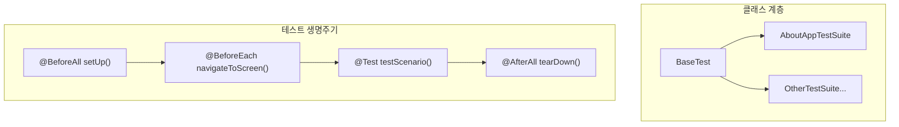
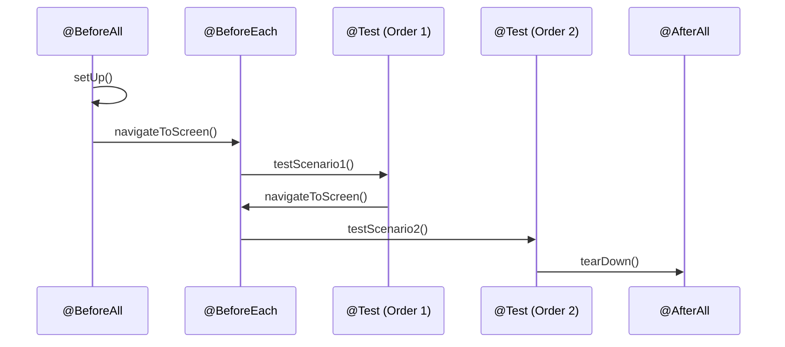
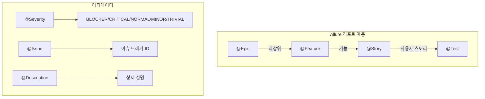
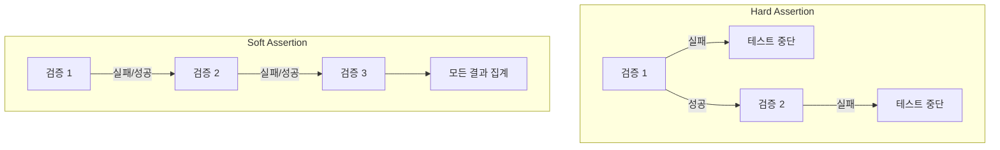

# Chapter 8: Writing Your First Test Suite (첫 번째 테스트 스위트 작성)

## 📌 핵심 요약

> **"BaseTest로 세션 생성/종료를 중앙 관리하고, JUnit5와 Allure 어노테이션으로 테스트를 구조화한다. AssertJ의 SoftAssertions로 여러 검증을 수행하고, @Smoke/@Regression/@SIT/@AT 커스텀 어노테이션으로 Gradle 태스크에 테스트를 할당한다."**

이 챕터에서는 BaseTest와 AboutAppTestSuite를 작성하고, JUnit5/Allure 어노테이션, Soft Assertion, Gradle 태스크 실행 방법을 학습한다.

---

## 🎯 학습 목표

이 챕터를 완료하면 다음을 할 수 있다:

- [ ] BaseTest 클래스로 세션 생명주기 관리
- [ ] JUnit5 어노테이션 활용 (@TestMethodOrder, @TestInstance, @BeforeAll, @BeforeEach, @AfterAll, @Order)
- [ ] Allure 어노테이션 활용 (@Epic, @Feature, @Severity, @Issue, @Description)
- [ ] 커스텀 Gradle 태스크 어노테이션 적용 (@Smoke, @Regression, @SIT, @AT)
- [ ] AssertJ SoftAssertions로 다중 검증
- [ ] Gradle로 테스트 스위트 실행

---

## 📖 본문 정리

### 8.1 폴더 구조

```
src/test/java/com/taf/testautomation/
├── BaseTest.java
└── uitests/
    └── AboutAppTestSuite.java
```



---

### 8.2 BaseTest 클래스

```java
package com.taf.testautomation;

import lombok.Getter;
import lombok.Setter;
import org.assertj.core.api.SoftAssertions;
import org.junit.jupiter.api.AfterAll;
import org.junit.jupiter.api.BeforeAll;
import org.slf4j.Logger;
import org.slf4j.LoggerFactory;

import java.util.HashMap;

@Getter
@Setter
@SuppressWarnings("rawtypes")
public class BaseTest {

    protected Session session = new Session();
    protected HashMap<String, String> customProperties = session.getCustomProperties();
    private Logger logger = LoggerFactory.getLogger(this.getClass());
    protected static String[][] dataTable;  // Chapter 10에서 활용

    @BeforeAll
    public void setUp() throws Exception {
        log("Initializing Session");
        session = startDefaultSession();
        log("Session created");
    }

    @AfterAll
    public void tearDown() throws Exception {
        log("Destroying Session");
        closeSession();
        log("Session destroyed");
    }

    public void log(String message) {
        getLogger().info(message);
    }

    public void logError(String message) {
        getLogger().error(message);
    }

    public Session startDefaultSession() throws Exception {
        try {
            session.startSession();
        } catch (Exception e) {
            logError("Error starting Session" + e.getMessage());
        }
        if (session.getAppiumDriver() != null) {
            return session;
        } else {
            return startDefaultSession();  // 재시도 로직
        }
    }

    public void closeSession() {
        try {
            session.closeSession();
        } catch (Exception e) {
            logError("Error closing Session" + e.getMessage());
        }
    }
}
```

#### BaseTest 구성 요소

| 요소 | 역할 |
|------|------|
| `session` | Appium 드라이버 세션 관리 |
| `customProperties` | Properties 파일 설정값 |
| `logger` | SLF4J 로깅 |
| `dataTable` | Excel 테스트 데이터 (Chapter 10) |
| `setUp()` | 테스트 시작 전 세션 생성 |
| `tearDown()` | 테스트 종료 후 세션 정리 |
| `startDefaultSession()` | 재시도 로직 포함 세션 시작 |

---

### 8.3 AboutAppTestSuite 클래스

```java
package com.taf.testautomation.uitests;

import com.taf.testautomation.BaseTest;
import com.taf.testautomation.annotations.*;
import com.taf.testautomation.screens.AboutAppScreen;
import com.taf.testautomation.workflows.ScreenNavigation;
import io.qameta.allure.*;
import org.assertj.core.api.SoftAssertions;
import org.junit.jupiter.api.*;

@TestMethodOrder(MethodOrderer.OrderAnnotation.class)
@TestInstance(TestInstance.Lifecycle.PER_CLASS)
@Epic("xxxx")
@Feature("About App Page Layout")
public class AboutAppTestSuite extends BaseTest {

    private AboutAppScreen aboutAppScreen;
    protected String testStatus = "";
    private static final String SCREEN_NAME = "aboutAppScreen";
    private static int i = 0, j = 0;  // 테스트 카운터

    @BeforeAll
    @Override
    public void setUp() throws Exception {
        super.setUp();
    }

    @BeforeEach
    public void navigateToScreen() {
        log("Navigating to " + SCREEN_NAME);
        if (testStatus.isEmpty()) {
            // 첫 테스트: 화면 탐색 수행
            aboutAppScreen = new ScreenNavigation(session)
                .getAboutAppScreenFromAccountCreationScreen(
                    getCustomProperties().get("username"),
                    getCustomProperties().get("password")
                );
        } else {
            log("User in About App screen already");
        }
    }

    @AfterAll
    @Override
    public void tearDown() throws Exception {
        super.tearDown();
    }

    // ========== 테스트 메서드 ==========

    @Severity(SeverityLevel.CRITICAL)
    @Issue("xxxx")
    @DisplayName("xxxx")
    @Description("xxxx: Verify that the AboutAppScreen Title is displayed")
    @Test
    @Order(1)
    @Smoke
    @Regression
    @SIT
    @AT
    public void testScenario1() {
        String tcName = new Object() {}.getClass().getEnclosingMethod().getName();
        log("Test Name" + tcName);

        SoftAssertions.assertSoftly(softAssertions -> {
            softAssertions.assertThat(aboutAppScreen.isScreenTitleDisplayed())
                .as("The Screen title is displayed")
                .isTrue();
        });

        testStatus = aboutAppScreen.isScreenTitleDisplayed() ? "Passed" : "Failed";
        updateTCPassCount();
    }

    @Severity(SeverityLevel.CRITICAL)
    @Issue("xxxx")
    @DisplayName("xxxx")
    @Description("xxxx: Verify that the App Logo is displayed")
    @Test
    @Order(2)
    @Smoke
    public void testScenario2() {
        String tcName = new Object() {}.getClass().getEnclosingMethod().getName();
        log("Test Name" + tcName);

        SoftAssertions.assertSoftly(softAssertions -> {
            softAssertions.assertThat(aboutAppScreen.isAppLogoDisplayed())
                .as("The App Logo is displayed")
                .isTrue();
        });

        testStatus = aboutAppScreen.isAppLogoDisplayed() ? "Passed" : "Failed";
        updateTCPassCount();
    }

    @Severity(SeverityLevel.CRITICAL)
    @Issue("xxxx")
    @DisplayName("xxxx")
    @Description("xxxx: Verify that the Software Name is displayed")
    @Test
    @Order(3)
    @Regression
    public void testScenario3() {
        String tcName = new Object() {}.getClass().getEnclosingMethod().getName();
        log("Test Name" + tcName);

        SoftAssertions.assertSoftly(softAssertions -> {
            softAssertions.assertThat(aboutAppScreen.isAppNameDisplayed())
                .as("The App Name is displayed")
                .isTrue();
        });

        testStatus = aboutAppScreen.isAppNameDisplayed() ? "Passed" : "Failed";
        updateTCPassCount();
    }

    @Severity(SeverityLevel.CRITICAL)
    @Issue("xxxx")
    @DisplayName("xxxx")
    @Description("xxxx: Verify that the App Version is displayed")
    @Test
    @Order(4)
    @SIT
    public void testScenario4() {
        String tcName = new Object() {}.getClass().getEnclosingMethod().getName();
        log("Test Name" + tcName);

        SoftAssertions.assertSoftly(softAssertions -> {
            softAssertions.assertThat(aboutAppScreen.isAppVersionDisplayed("xxxx"))
                .as("The App Version is displayed")
                .isTrue();
        });

        testStatus = aboutAppScreen.isAppVersionDisplayed("xxxx") ? "Passed" : "Failed";
        updateTCPassCount();
    }

    @Severity(SeverityLevel.CRITICAL)
    @Issue("xxxx")
    @DisplayName("xxxx")
    @Description("xxxx: Verify that the App images are displayed")
    @Test
    @Order(5)
    @AT
    public void testScenario5() {
        String tcName = new Object() {}.getClass().getEnclosingMethod().getName();
        log("Test Name" + tcName);

        SoftAssertions.assertSoftly(softAssertions -> {
            softAssertions.assertThat(aboutAppScreen.areAppImagesDisplayed())
                .as("The App images are displayed")
                .isTrue();
        });

        testStatus = aboutAppScreen.areAppImagesDisplayed() ? "Passed" : "Failed";
        updateTCPassCount();
    }

    // ========== 헬퍼 메서드 ==========

    private void updateTCPassCount() {
        i++;
        if (testStatus.equals("Passed")) j++;
    }
}
```

---

### 8.4 JUnit5 어노테이션

#### 클래스 레벨 어노테이션

```java
@TestMethodOrder(MethodOrderer.OrderAnnotation.class)
@TestInstance(TestInstance.Lifecycle.PER_CLASS)
public class AboutAppTestSuite extends BaseTest {
```

| 어노테이션 | 역할 |
|-----------|------|
| `@TestMethodOrder` | 테스트 메서드 실행 순서 지정 방식 |
| `MethodOrderer.OrderAnnotation.class` | `@Order` 어노테이션 기반 순서 결정 |
| `@TestInstance(Lifecycle.PER_CLASS)` | 클래스당 하나의 테스트 인스턴스 생성 |
| `@TestInstance(Lifecycle.PER_METHOD)` | 메서드당 새 인스턴스 생성 (기본값) |

#### 메서드 레벨 어노테이션

```java
@BeforeAll    // 모든 테스트 전 1회 실행
@BeforeEach   // 각 테스트 전 실행
@Test         // 테스트 메서드 표시
@Order(1)     // 실행 순서 지정
@DisplayName  // 커스텀 표시 이름
@AfterAll     // 모든 테스트 후 1회 실행
```



#### @TestInstance 모드 비교

| 모드 | 설명 | 사용 시나리오 |
|------|------|--------------|
| `PER_METHOD` | 각 테스트 메서드마다 새 인스턴스 생성 (기본값) | 테스트 격리가 중요할 때 |
| `PER_CLASS` | 클래스당 하나의 인스턴스 공유 | 상태 공유, `@BeforeAll` non-static 사용 시 |

---

### 8.5 Allure 어노테이션

```java
@Epic("xxxx")                    // 최상위 그룹핑
@Feature("About App Page Layout") // 기능 단위
@Severity(SeverityLevel.CRITICAL) // 심각도
@Issue("xxxx")                    // 이슈 트래커 링크
@Description("xxxx: Verify...")   // 상세 설명
```

#### Allure 어노테이션 계층



| 어노테이션 | 위치 | 역할 |
|-----------|------|------|
| `@Epic` | 클래스 | 최상위 기능 그룹 (예: 앱 이름) |
| `@Feature` | 클래스 | 기능 단위 (예: About 페이지) |
| `@Story` | 메서드 | 사용자 스토리 |
| `@Severity` | 메서드 | 테스트 심각도 |
| `@Issue` | 메서드 | Jira/ALM 이슈 링크 |
| `@Description` | 메서드 | 테스트 상세 설명 |

#### SeverityLevel 옵션

| 레벨 | 설명 |
|------|------|
| `BLOCKER` | 테스트 차단 |
| `CRITICAL` | 핵심 기능 |
| `NORMAL` | 일반 기능 |
| `MINOR` | 부수 기능 |
| `TRIVIAL` | 사소한 기능 |

---

### 8.6 커스텀 Gradle 태스크 어노테이션

```java
@Test
@Order(1)
@Smoke        // Smoke 테스트
@Regression   // Regression 테스트
@SIT          // SIT 테스트
@AT           // AT 테스트
public void testScenario1() { ... }
```

#### 테스트별 태그 매핑

| 테스트 시나리오 | @Smoke | @Regression | @SIT | @AT |
|----------------|--------|-------------|------|-----|
| testScenario1 | ✅ | ✅ | ✅ | ✅ |
| testScenario2 | ✅ | | | |
| testScenario3 | | ✅ | | |
| testScenario4 | | | ✅ | |
| testScenario5 | | | | ✅ |

**실행 예시**:
- `./gradlew Smoke` → testScenario1, testScenario2 실행
- `./gradlew Regression` → testScenario1, testScenario3 실행
- `./gradlew SIT` → testScenario1, testScenario4 실행
- `./gradlew AT` → testScenario1, testScenario5 실행

---

### 8.7 SoftAssertions (Soft Assertion)

#### AssertJ assertSoftly 사용법

```java
import org.assertj.core.api.SoftAssertions;

// 패턴 1: Lambda 사용
SoftAssertions.assertSoftly(softAssertions -> {
    softAssertions.assertThat(aboutAppScreen.isScreenTitleDisplayed())
        .as("The Screen title is displayed")
        .isTrue();

    softAssertions.assertThat(aboutAppScreen.isAppLogoDisplayed())
        .as("The App Logo is displayed")
        .isTrue();
});

// 패턴 2: 인스턴스 사용 (MobileBaseActionScreen)
SoftAssertions softAssertions = new SoftAssertions();
softAssertions.assertThat(condition1).isTrue();
softAssertions.assertThat(condition2).isTrue();
softAssertions.assertAll();  // 모든 검증 실행
```

#### Hard Assertion vs Soft Assertion



| 유형 | 특징 | 사용 시나리오 |
|------|------|--------------|
| **Hard Assertion** | 첫 실패 시 테스트 중단 | 후속 단계에 영향 주는 검증 |
| **Soft Assertion** | 모든 검증 실행 후 집계 | 독립적인 여러 조건 검증 |

---

### 8.8 테스트 메서드 패턴

```java
@Severity(SeverityLevel.CRITICAL)
@Issue("xxxx")
@DisplayName("xxxx")
@Description("xxxx: Verify that the AboutAppScreen Title is displayed")
@Test
@Order(1)
@Smoke
@Regression
public void testScenario1() {
    // 1. 테스트 이름 로깅
    String tcName = new Object() {}.getClass().getEnclosingMethod().getName();
    log("Test Name" + tcName);

    // 2. Soft Assertion 수행
    SoftAssertions.assertSoftly(softAssertions -> {
        softAssertions.assertThat(aboutAppScreen.isScreenTitleDisplayed())
            .as("The Screen title is displayed")
            .isTrue();
    });

    // 3. 테스트 상태 업데이트
    testStatus = aboutAppScreen.isScreenTitleDisplayed() ? "Passed" : "Failed";

    // 4. 카운터 업데이트
    updateTCPassCount();
}
```

#### 테스트 이름 동적 추출

```java
// 현재 메서드 이름 가져오기
String tcName = new Object() {}.getClass().getEnclosingMethod().getName();
// 결과: "testScenario1"
```

---

### 8.9 Gradle 테스트 실행 방법

#### 방법 1: IntelliJ 우클릭

```
테스트 스위트 우클릭 → Run → 태스크 선택 (Smoke, Regression 등)
```

#### 방법 2: Run Configuration

```
Run → Edit Configurations → Gradle
→ Tasks: Smoke (또는 :cleanTest Smoke)
→ Run
```

#### 방법 3: 명령줄

```bash
# Smoke 테스트 실행
./gradlew Smoke

# cleanTest와 함께 실행 (캐시 클리어)
./gradlew :cleanTest Smoke

# Regression 테스트 실행
./gradlew Regression

# SIT 테스트 실행
./gradlew SIT

# AT 테스트 실행
./gradlew AT
```

#### cleanTest 옵션

| 옵션 | 설명 |
|------|------|
| `:cleanTest` | 테스트 캐시 삭제 후 실행 |
| 권장 | 이전 테스트 결과가 캐시되지 않도록 |

---

## 💡 실무 적용 포인트

### 테스트 스위트 작성 체크리스트

```
□ 클래스 구조
  ├── extends BaseTest
  ├── @TestMethodOrder(MethodOrderer.OrderAnnotation.class)
  ├── @TestInstance(TestInstance.Lifecycle.PER_CLASS)
  ├── @Epic, @Feature (Allure)
  └── 패키지: com.taf.testautomation.uitests

□ setUp/tearDown
  ├── @BeforeAll setUp() - super.setUp() 호출
  ├── @BeforeEach navigateToScreen() - 화면 탐색
  └── @AfterAll tearDown() - super.tearDown() 호출

□ 테스트 메서드
  ├── @Severity, @Issue, @DisplayName, @Description (Allure)
  ├── @Test, @Order (JUnit5)
  ├── @Smoke/@Regression/@SIT/@AT (Gradle 태스크)
  ├── SoftAssertions.assertSoftly() (검증)
  └── testStatus 업데이트

□ 헬퍼 메서드
  ├── log(), logError()
  └── updateTCPassCount()
```

### 테스트 태그 전략

```
프로젝트 테스트 단계:
├── @Smoke: 핵심 기능 빠른 검증 (빌드 후)
├── @Regression: 전체 기능 검증 (릴리즈 전)
├── @SIT: 시스템 통합 테스트
└── @AT: 인수 테스트 (고객 요구사항)

테스트별 태그 할당 기준:
├── 핵심 기능 → @Smoke + @Regression + @SIT + @AT
├── 주요 기능 → @Regression + @SIT
├── 세부 기능 → @SIT
└── 인수 조건 → @AT
```

### 테스트 상태 관리

```java
// testStatus로 화면 탐색 최적화
@BeforeEach
public void navigateToScreen() {
    if (testStatus.isEmpty()) {
        // 첫 테스트: 전체 탐색
        aboutAppScreen = new ScreenNavigation(session)
            .getAboutAppScreenFromAccountCreationScreen(...);
    } else {
        // 이후 테스트: 이미 화면에 있음
        log("User in About App screen already");
    }
}
```

---

## ✅ 핵심 개념 체크리스트

- [ ] BaseTest로 세션 생명주기 관리
- [ ] @TestMethodOrder + @Order로 테스트 순서 지정
- [ ] @TestInstance(Lifecycle.PER_CLASS) 이해
- [ ] @BeforeAll, @BeforeEach, @AfterAll 생명주기
- [ ] @Epic, @Feature, @Severity, @Issue, @Description (Allure)
- [ ] @Smoke, @Regression, @SIT, @AT 커스텀 어노테이션
- [ ] SoftAssertions.assertSoftly() 사용법
- [ ] .as() 메서드로 검증 설명 추가
- [ ] testStatus로 화면 탐색 최적화
- [ ] Gradle 태스크 실행 (명령줄, Run Configuration)
- [ ] :cleanTest로 캐시 클리어

---

## 🔗 참고 자료

- [JUnit5 @TestInstance](https://www.baeldung.com/junit-testinstance-annotation)
- [JUnit5 Test Order](https://junit.org/junit5/docs/current/user-guide/#writing-tests-test-execution-order)
- [AssertJ SoftAssertions](https://assertj.github.io/doc/#assertj-core-soft-assertions)
- [Allure Annotations](https://docs.qameta.io/allure/#_features)

---

## 📚 다음 챕터 미리보기

- **Chapter 9**: 다양한 형식의 테스트 데이터 관리 (JSON)
