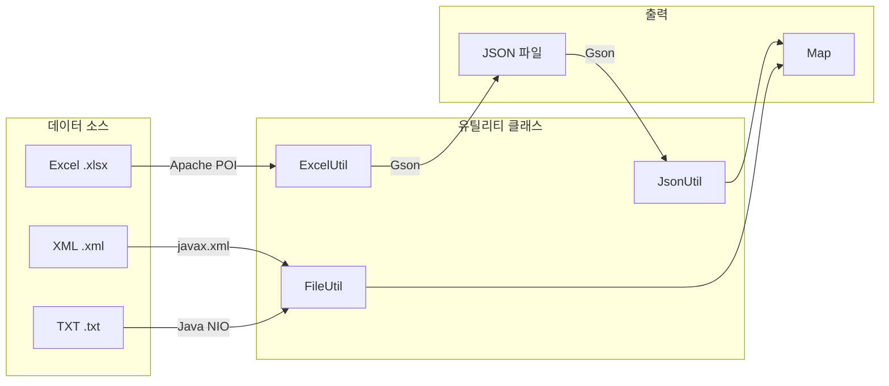
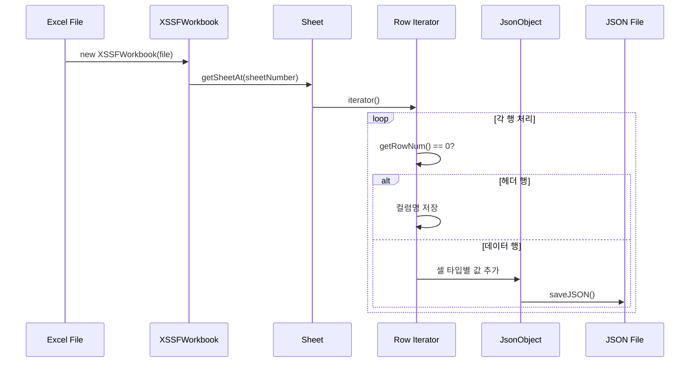
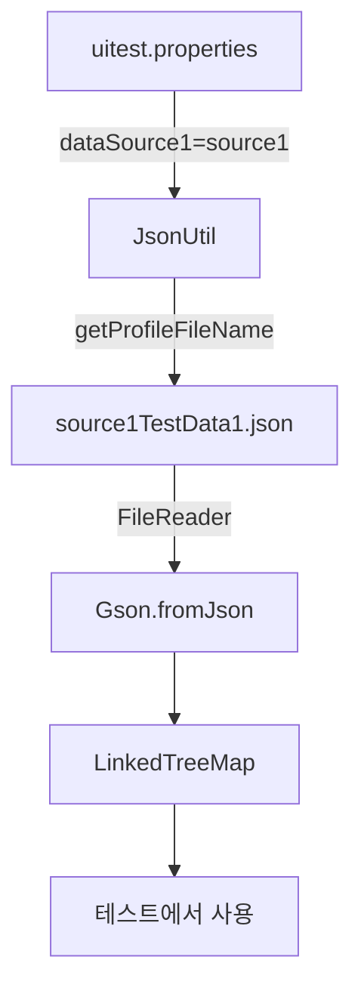
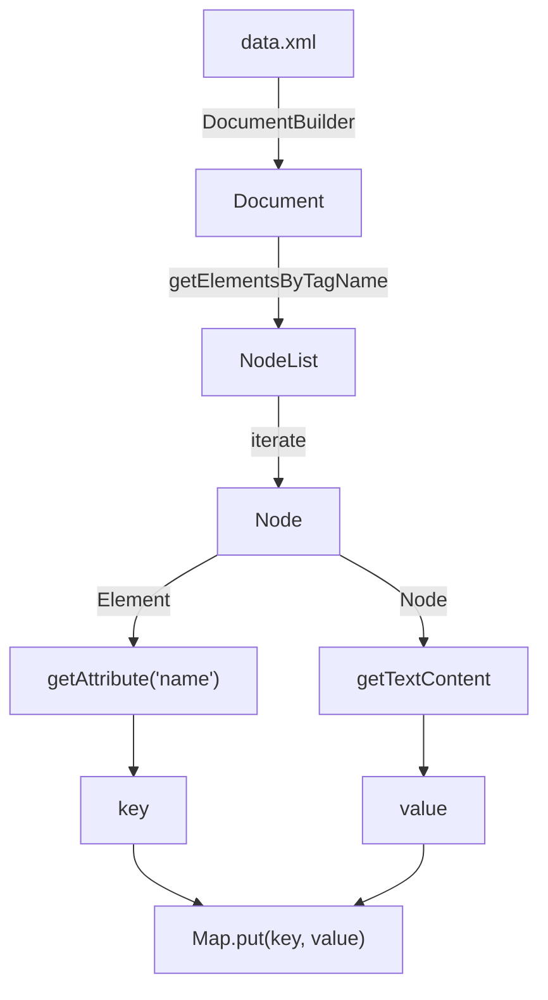
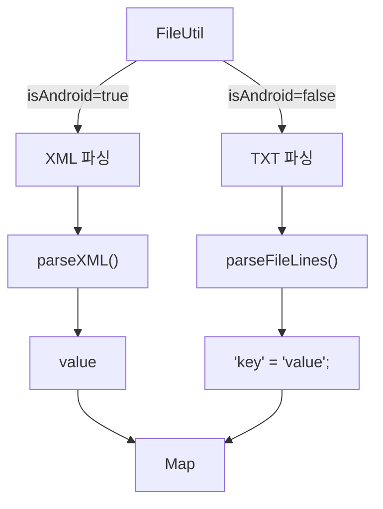

# Chapter 9: Importing Test Data from Excel, XML, or Other Formats (테스트 데이터 가져오기)

## 📌 핵심 요약

> **"ExcelUtil로 Excel 데이터를 JSON으로 변환하고, JsonUtil로 테스트 스위트에 로드한다. FileUtil은 XML과 TXT 파일을 파싱하며, 플랫폼별로 다른 데이터 소스를 지원한다. 모든 테스트 데이터는 Map<String, String>에 저장되어 테스트에서 활용된다."**

이 챕터에서는 Excel, JSON, XML, TXT 형식의 테스트 데이터를 읽고 변환하는 유틸리티 클래스를 구현한다.

---

## 🎯 학습 목표

이 챕터를 완료하면 다음을 할 수 있다:

- [ ] Apache POI로 Excel 파일 읽기
- [ ] Gson으로 JSON 파일 생성 및 파싱
- [ ] javax.xml.parsers로 XML 파싱
- [ ] Java NIO로 텍스트 파일 읽기
- [ ] 플랫폼별 데이터 소스 분기 처리
- [ ] 테스트 스위트에서 테스트 데이터 활용

---

## 📖 본문 정리

### 9.1 폴더 구조

```
src/
├── main/java/com/taf/testautomation/utilities/
│   ├── excelutil/
│   │   └── ExcelUtil.java
│   ├── jsonutil/
│   │   └── JsonUtil.java
│   └── fileutil/
│       └── FileUtil.java
│
└── test/resources/testdata/
    ├── excel/
    │   ├── testData1.xlsx
    │   └── testData2.xlsx
    ├── json/
    │   ├── source1TestData1.json
    │   └── source2TestData1.json
    ├── xml/
    │   └── data.xml
    └── txt/
        └── data.txt
```



---

### 9.2 Excel 데이터 구조

```
| RowNum | DataType | value1     | value2     | value3 |
|--------|----------|------------|------------|--------|
| 1      | source1  | data1      | data2      | data3  |
| 2      | source2  | data4      | data5      | data6  |
```

**변환 결과**:
- Row 1 → `source1TestData1.json`
- Row 2 → `source2TestData1.json`

---

### 9.3 ExcelUtil 클래스

```java
package com.taf.testautomation.utilities.excelutil;

import com.google.gson.Gson;
import com.google.gson.GsonBuilder;
import com.google.gson.JsonObject;
import org.apache.poi.ss.usermodel.CellType;
import org.apache.poi.ss.usermodel.Row;
import org.apache.poi.ss.usermodel.Sheet;
import org.apache.poi.ss.usermodel.Workbook;
import org.apache.poi.xssf.usermodel.XSSFWorkbook;

import java.io.*;
import java.net.URL;
import java.util.ArrayList;
import java.util.HashMap;
import java.util.Iterator;
import java.util.Properties;

public class ExcelUtil {

    private Workbook dataTable;
    private static HashMap<String, String> customProperties = new HashMap<>();
    private static final String JSON_LOCATION = "src/test/resources/testdata/json/";
    private static final String JSON1_POSTFIX = "TestData1.json";
    private static final String JSON2_POSTFIX = "TestData2.json";

    private static Reader reader;

    /**
     * uitest.properties에서 설정값 로드
     */
    public static HashMap<String, String> getCustomProperties() {
        ClassLoader loader = ExcelUtil.class.getClassLoader();
        URL myURL = loader.getResource("uitest.properties");
        String path = myURL.getPath();

        try {
            reader = new FileReader(path);
        } catch (FileNotFoundException e) {
            e.printStackTrace();
        }

        Properties prop = new Properties();
        try {
            prop.load(reader);
        } catch (IOException e) {
            e.printStackTrace();
        }

        prop.forEach((k, v) -> customProperties.put(k.toString(), v.toString()));
        return customProperties;
    }

    public void generateJsonFilesFromExcel1() throws Exception {
        File excelFile = new File(getCustomProperties().get("dataTable1"));
        getJsonFromExcel1(excelFile);
    }

    public void generateJsonFilesFromExcel2() throws Exception {
        File excelFile = new File(getCustomProperties().get("dataTable2"));
        getJsonFromExcel2(excelFile);
    }

    public void getJsonFromExcel1(File excelFile) throws Exception {
        dataTable = new XSSFWorkbook(excelFile);
        int sheetNumber = dataTable.getNumberOfSheets() - 1;
        ArrayList<String> columnNames = new ArrayList<String>();
        Sheet sheet = dataTable.getSheetAt(sheetNumber);
        Iterator<Row> sheetIterator = sheet.iterator();

        while (sheetIterator.hasNext()) {
            Row currentRow = sheetIterator.next();

            if (currentRow.getRowNum() != 0) {
                // 데이터 행 처리
                JsonObject jsonObject = new JsonObject();

                for (int j = 0; j < columnNames.size(); j++) {
                    if (currentRow.getCell(j) != null) {
                        if (currentRow.getCell(j).getCellTypeEnum() == CellType.STRING) {
                            jsonObject.addProperty(columnNames.get(j),
                                currentRow.getCell(j).getStringCellValue());
                        } else if (currentRow.getCell(j).getCellTypeEnum() == CellType.NUMERIC) {
                            jsonObject.addProperty(columnNames.get(j),
                                currentRow.getCell(j).getNumericCellValue());
                        } else if (currentRow.getCell(j).getCellTypeEnum() == CellType.BOOLEAN) {
                            jsonObject.addProperty(columnNames.get(j),
                                currentRow.getCell(j).getBooleanCellValue());
                        } else if (currentRow.getCell(j).getCellTypeEnum() == CellType.BLANK) {
                            jsonObject.addProperty(columnNames.get(j), "");
                        }
                    } else {
                        jsonObject.addProperty(columnNames.get(j), "");
                    }
                }

                // DataType 컬럼 값으로 파일명 생성
                saveJSON(currentRow.getCell(1).getStringCellValue().toLowerCase(), jsonObject);

            } else if (currentRow.getRowNum() == 0) {
                // 헤더 행: 컬럼명 저장
                for (int k = 0; k < currentRow.getPhysicalNumberOfCells(); k++) {
                    columnNames.add(currentRow.getCell(k).getStringCellValue());
                }
            }
        }
    }

    public static void saveJSON(String fileName, JsonObject jsonObject) throws Exception {
        fileName = JSON_LOCATION + fileName + JSON1_POSTFIX;
        try (Writer writer = new FileWriter(fileName)) {
            Gson gson = new GsonBuilder()
                .setPrettyPrinting()
                .serializeNulls()
                .create();
            gson.toJson(jsonObject, writer);
        }
    }
}
```

#### Excel 처리 흐름



#### CellType 처리

| CellType | 처리 방법 |
|----------|----------|
| `STRING` | `getStringCellValue()` |
| `NUMERIC` | `getNumericCellValue()` |
| `BOOLEAN` | `getBooleanCellValue()` |
| `BLANK` | 빈 문자열 `""` |

---

### 9.4 JsonUtil 클래스

```java
package com.taf.testautomation.utilities.jsonutil;

import com.google.gson.Gson;
import com.google.gson.GsonBuilder;
import com.google.gson.internal.LinkedTreeMap;
import lombok.extern.slf4j.Slf4j;

import java.io.File;
import java.io.FileReader;
import java.io.Reader;
import java.lang.reflect.Type;
import java.util.Map;

import static com.taf.testautomation.utilities.excelutil.ExcelUtil.getCustomProperties;

@Slf4j
public class JsonUtil {

    private LinkedTreeMap<String, String> customSettings;
    private static final String JSON_LOCATION = "src/test/resources/testdata/json";
    private static final String JSON_POSTFIX = "TestData1.json";

    public JsonUtil() {
    }

    public Map<String, String> getCustomSettings() {
        String profileName = getProfileFileName(
            getCustomProperties().get("dataSource1")
        );
        loadJsonConfig(profileName);
        return customSettings;
    }

    public void loadJsonConfig(String profileName) {
        File resourcesDirectory = new File(JSON_LOCATION);
        File configurationFile = new File(resourcesDirectory, profileName);

        try {
            Reader reader = new FileReader(configurationFile);
            GsonBuilder gsonBuilder = new GsonBuilder();
            Gson gson = gsonBuilder
                .enableComplexMapKeySerialization()
                .create();
            customSettings = gson.fromJson(reader, (Type) Map.class);
        } catch (Exception e) {
            JsonUtil.log.error("Error parsing configuration file {};", profileName, e);
            throw new RuntimeException(e);
        }
    }

    public String getProfileFileName(String name) {
        return name + JSON_POSTFIX;
    }
}
```

#### JSON 데이터 로드 흐름



---

### 9.5 테스트 스위트에서 데이터 로드

```java
package com.taf.testautomation.uitests;

public class AboutAppTestSuite extends BaseTest {

    private AboutAppScreen aboutAppScreen;
    private JsonUtil jsonUtil;
    private ExcelUtil excelUtil = new ExcelUtil();
    protected String testStatus = "";
    private static final String SCREEN_NAME = "aboutAppScreen";
    private static int i = 0, j = 0;

    @BeforeAll
    @Override
    public void setUp() throws Exception {
        super.setUp();

        // Excel → JSON 변환 (loadExcel=Y인 경우)
        if (getCustomProperties().get("loadExcel").equals("Y")) {
            excelUtil.generateJsonFilesFromExcel1();
        }

        // JSON → Map 로드
        jsonUtil = new JsonUtil();
    }

    // 테스트에서 데이터 사용
    @Test
    public void testWithData() {
        Map<String, String> testData = jsonUtil.getCustomSettings();
        String value1 = testData.get("value1");
        // ...
    }
}
```

#### uitest.properties 설정

```properties
# Excel 로드 여부
loadExcel=Y

# Excel 파일 경로
dataTable1=src/test/resources/testdata/excel/testData1.xlsx
dataTable2=src/test/resources/testdata/excel/testData2.xlsx

# 데이터 소스 이름
dataSource1=source1
dataSource2=source2
```

---

### 9.6 XML 데이터 파일

```xml
<?xml version="1.0" encoding="utf-8"?>
<!-- Test Data for Test Engineer to Architect -->
<resources>
   <!-- Data -->
   <string name="datatype1">Data1</string>
   <string name="datatype2">Data2</string>
   <string name="datatype3">Data3</string>
   <string name="datatype4">Data4</string>
   <string name="datatype5">Data5</string>
   <string name="datatype6">Data6</string>
   <string name="datatype7">Data7</string>
   <string name="datatype8">Data8</string>
   <string name="datatype9">Data9</string>
   <string name="datatype10">Data10</string>
</resources>
```

---

### 9.7 TXT 데이터 파일

```text
/* Test Data for Test Engineer to Architect */
/* Data */
"datatype1" = "Data1";
"datatype2" = "Data2";
"datatype3" = "Data3";
"datatype4" = "Data4";
"datatype5" = "Data5";
"datatype6" = "Data6";
"datatype7" = "Data7";
"datatype8" = "Data8";
"datatype9" = "Data9";
"datatype10" = "Data10";
```

---

### 9.8 FileUtil 클래스

```java
package com.taf.testautomation.utilities.fileutil;

import lombok.extern.slf4j.Slf4j;
import org.w3c.dom.Document;
import org.w3c.dom.Element;
import org.w3c.dom.Node;
import org.w3c.dom.NodeList;

import javax.xml.parsers.DocumentBuilder;
import javax.xml.parsers.DocumentBuilderFactory;
import java.io.File;
import java.nio.file.Files;
import java.nio.file.Paths;
import java.util.LinkedHashMap;
import java.util.Map;
import java.util.stream.Collectors;
import java.util.stream.Stream;

import static com.taf.testautomation.utilities.excelutil.ExcelUtil.getCustomProperties;

@Slf4j
public class FileUtil {

    private LinkedHashMap<String, String> customSettings = new LinkedHashMap<>();
    private static final String INPUT_XML_BASE_PATH = "src/test/resources/testdata/xml/";
    private static final String INPUT_TXT_BASE_PATH = "src/test/resources/testdata/txt/";
    private static final String XML_FILENAME = "data.xml";
    private static final String DATA_FILENAME = "data.txt";

    public FileUtil() {
    }

    /**
     * XML 파일에서 전체 데이터를 Map으로 로드
     */
    public Map<String, String> getCustomSettings() {
        String filePath = getInputFilePath();
        try {
            parseXML(filePath, customSettings);
        } catch (Exception e) {
            e.printStackTrace();
        }
        return customSettings;
    }

    /**
     * 특정 키에 대한 값 조회 (XML/TXT 모두 지원)
     */
    public String getCustomValues(String key) {
        String filePath = getInputFilePath();
        String value = "";
        try {
            value = parseFileLines(filePath, key);
        } catch (Exception e) {
            e.printStackTrace();
        }
        return value;
    }

    /**
     * 플랫폼별 파일 경로 결정
     */
    private String getInputFilePath() {
        if (getCustomProperties().get("isAndroid").equals("true")) {
            return INPUT_XML_BASE_PATH + XML_FILENAME;  // Android: XML
        } else {
            return INPUT_TXT_BASE_PATH + DATA_FILENAME; // iOS: TXT
        }
    }

    /**
     * XML 파싱 - javax.xml.parsers 사용
     */
    private void parseXML(String filePath, LinkedHashMap<String, String> customProperties)
            throws Exception {
        File fXmlFile = new File(filePath);
        DocumentBuilderFactory dbFactory = DocumentBuilderFactory.newInstance();
        DocumentBuilder dBuilder = dbFactory.newDocumentBuilder();
        Document doc = dBuilder.parse(fXmlFile);
        doc.getDocumentElement().normalize();

        log.info("Root element :" + doc.getDocumentElement().getNodeName());

        NodeList nList = doc.getElementsByTagName("string");

        for (int i = 0; i < nList.getLength(); i++) {
            Node nNode = nList.item(i);
            Element eElement = (Element) nNode;

            String key = eElement.getAttribute("name");   // name 속성
            String value = nNode.getTextContent();        // 태그 내용

            customProperties.put(key, value);
        }
    }

    /**
     * 파일 라인 파싱 - Java NIO 사용
     */
    private String parseFileLines(String filePath, String key) {
        String strLine = "";
        try {
            Stream<String> lines = Files.lines(Paths.get(filePath));
            strLine = lines.filter(s -> s.contains(key))
                          .collect(Collectors.toList())
                          .get(0);
        } catch (Exception e) {
            e.printStackTrace();
        }

        // 플랫폼별 값 추출
        if (getCustomProperties().get("isAndroid").equals("true")) {
            // XML: <string name="key">value</string>
            return strLine.substring(
                strLine.indexOf(">") + 1,
                strLine.lastIndexOf("<")
            );
        } else {
            // TXT: "key" = "value";
            return strLine.substring(
                strLine.indexOf("=") + 3,
                strLine.indexOf(";") - 1
            );
        }
    }
}
```

#### XML 파싱 흐름



#### 플랫폼별 데이터 소스



---

### 9.9 값 추출 패턴

#### XML 값 추출

```java
// <string name="datatype1">Data1</string>
String line = "<string name=\"datatype1\">Data1</string>";
String value = line.substring(
    line.indexOf(">") + 1,    // ">" 다음 위치
    line.lastIndexOf("<")      // 마지막 "<" 위치
);
// 결과: "Data1"
```

#### TXT 값 추출

```java
// "datatype1" = "Data1";
String line = "\"datatype1\" = \"Data1\";";
String value = line.substring(
    line.indexOf("=") + 3,     // "= " 다음 + 1
    line.indexOf(";") - 1      // ";" 이전 - 1
);
// 결과: "Data1"
```

---

## 💡 실무 적용 포인트

### 테스트 데이터 관리 전략

```
테스트 데이터 소스:
├── Excel (.xlsx)
│   ├── 장점: 비개발자 친화적, 대량 데이터 관리
│   ├── 처리: ExcelUtil → JSON → JsonUtil
│   └── 용도: 테스트 케이스별 입력/기대값
│
├── JSON (.json)
│   ├── 장점: 프로그래밍 친화적, 구조화
│   ├── 처리: JsonUtil → Map
│   └── 용도: API 응답, 설정값
│
├── XML (.xml)
│   ├── 장점: Android 리소스 형식
│   ├── 처리: FileUtil → Map
│   └── 용도: 로컬라이제이션 (Chapter 19)
│
└── TXT (.txt)
    ├── 장점: iOS Localizable.strings 형식
    ├── 처리: FileUtil → Map
    └── 용도: 로컬라이제이션 (Chapter 19)
```

### 유틸리티 클래스 체크리스트

```
□ ExcelUtil
  ├── uitest.properties에서 dataTable 경로 로드
  ├── Apache POI로 Excel 파싱
  ├── CellType별 값 추출
  ├── Gson으로 JSON 파일 생성
  └── 위치: src/main/java/.../utilities/excelutil/

□ JsonUtil
  ├── uitest.properties에서 dataSource 이름 로드
  ├── JSON 파일 경로 생성
  ├── Gson으로 Map 변환
  └── 위치: src/main/java/.../utilities/jsonutil/

□ FileUtil
  ├── 플랫폼별 파일 경로 결정
  ├── XML: javax.xml.parsers로 파싱
  ├── TXT: Java NIO로 라인 읽기
  └── 위치: src/main/java/.../utilities/fileutil/
```

### 의존성 (build.gradle)

```groovy
dependencies {
    // Excel 처리
    compile group: 'org.apache.poi', name: 'poi', version: '4.1.2'
    compile group: 'org.apache.poi', name: 'poi-ooxml', version: '4.1.2'

    // JSON 처리
    compile "com.google.code.gson:gson:${gson_version}"

    // XML 처리 (JDK 내장)
    // javax.xml.parsers - 추가 의존성 불필요
}
```

---

## ✅ 핵심 개념 체크리스트

- [ ] Apache POI XSSFWorkbook으로 Excel 읽기
- [ ] Row Iterator로 행 순회
- [ ] CellType별 값 추출 (STRING, NUMERIC, BOOLEAN, BLANK)
- [ ] Gson으로 JsonObject 생성 및 파일 저장
- [ ] Gson으로 JSON → Map 변환
- [ ] LinkedTreeMap으로 순서 보존
- [ ] DocumentBuilder로 XML 파싱
- [ ] getElementsByTagName으로 노드 조회
- [ ] getAttribute, getTextContent로 값 추출
- [ ] Files.lines()로 텍스트 파일 스트림 읽기
- [ ] 플랫폼별 데이터 소스 분기 (isAndroid)
- [ ] uitest.properties로 경로/설정 외부화

---

## 🔗 참고 자료

- [Apache POI Documentation](https://poi.apache.org/components/spreadsheet/)
- [Gson User Guide](https://github.com/google/gson/blob/master/UserGuide.md)
- [Java DOM Parser Tutorial](https://docs.oracle.com/javase/tutorial/jaxp/dom/index.html)
- [Java NIO Files](https://docs.oracle.com/javase/8/docs/api/java/nio/file/Files.html)

---

## 📚 다음 챕터 미리보기

- **Chapter 10**: BDD/Cucumber 통합 - JUnit 테스트를 BDD 모드로 실행
