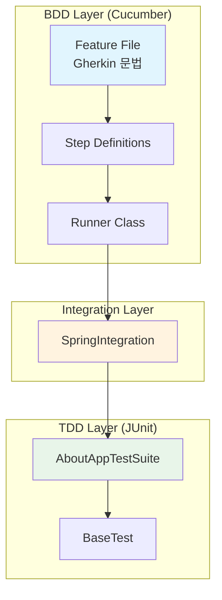
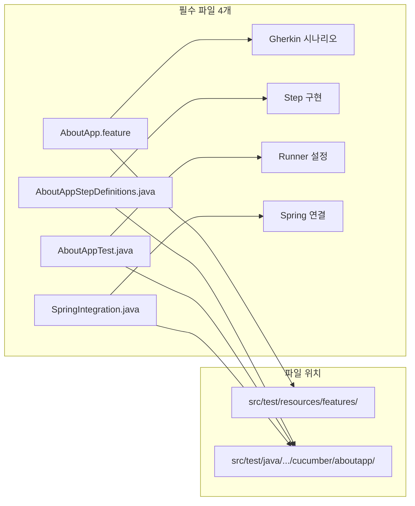
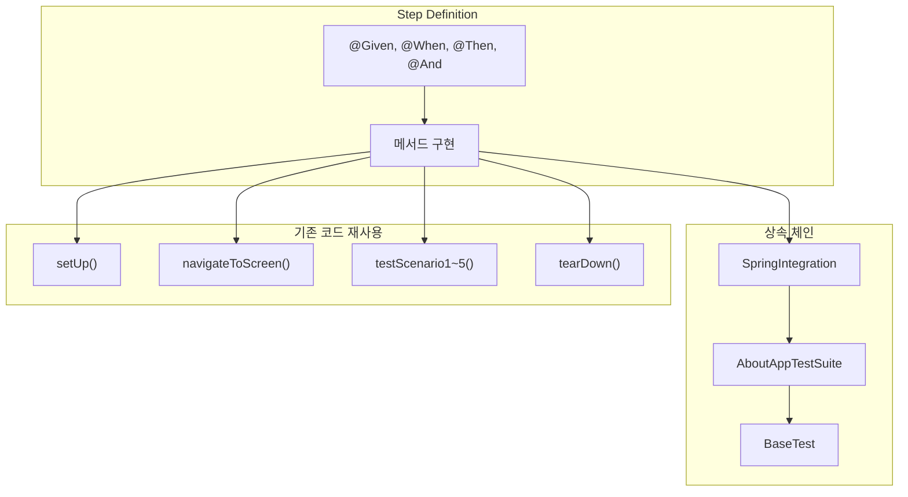
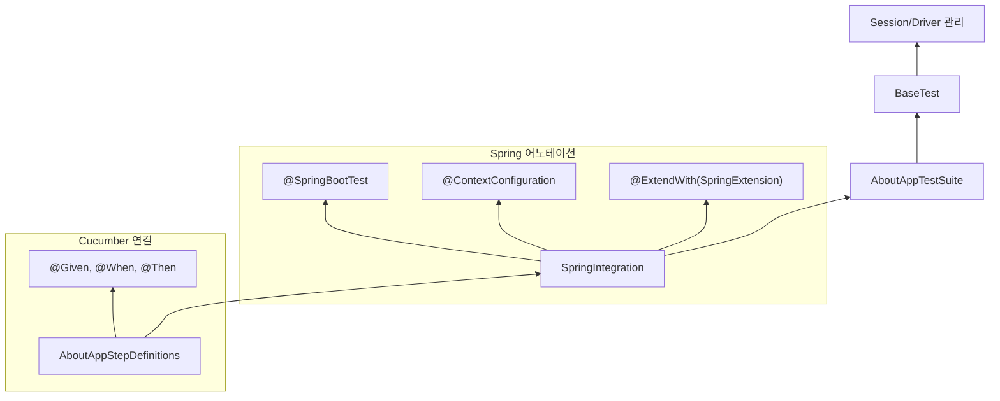
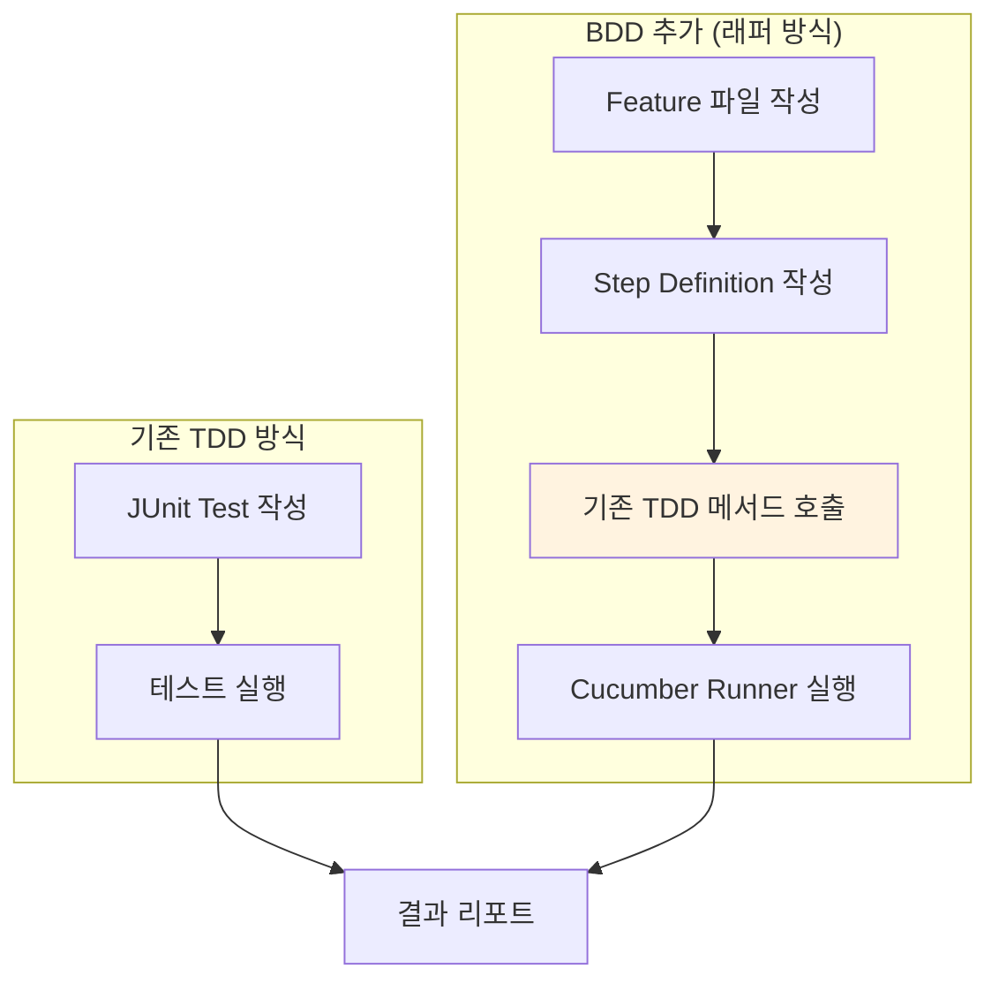

# Chapter 10: Adding BDD Capabilities with Cucumber (Cucumber를 활용한 BDD 기능 추가)

## 📌 핵심 요약

> **"Cucumber를 JUnit 테스트의 래퍼(Wrapper)로 사용하여 기존 TDD 코드 수정 없이 BDD 모드를 추가한다. SpringIntegration 클래스가 Cucumber와 Spring을 연결하는 브릿지 역할을 하며, Step Definition에서 기존 테스트 메서드를 호출하여 TDD와 BDD를 동시 지원한다."**

이 챕터에서는 Cucumber를 활용하여 프레임워크에 BDD 기능을 추가하고, TDD와 BDD 모드를 동시에 지원하는 방법을 학습한다.

---

## 🎯 학습 목표

이 챕터를 완료하면 다음을 할 수 있다:

- [ ] Cucumber Feature 파일 작성 (Gherkin 문법)
- [ ] Step Definition 클래스 구현
- [ ] Cucumber Runner 클래스 설정
- [ ] SpringIntegration으로 Spring + Cucumber 통합
- [ ] DataTable을 활용한 데이터 기반 테스트
- [ ] Gradle로 BDD 테스트 실행

---

## 📖 본문 정리

### 10.1 BDD 개요 및 아키텍처



**BDD 도입 장점**:
- Product Owner가 Gherkin으로 인수 조건(Acceptance Criteria) 작성
- 테스트 자동화 팀이 동일한 인수 조건을 Feature 파일로 활용
- Agile/DevOps 환경에서 협업 촉진

---

### 10.2 BDD 구현에 필요한 파일 구조



| 파일 | 역할 | 위치 |
|------|------|------|
| `AboutApp.feature` | Gherkin 시나리오 정의 | `src/test/resources/features/` |
| `AboutAppStepDefinitions.java` | Step 메서드 구현 | `src/test/java/.../cucumber/aboutapp/` |
| `AboutAppTest.java` | Cucumber Runner | `src/test/java/.../cucumber/aboutapp/` |
| `SpringIntegration.java` | Spring + Cucumber 브릿지 | `src/test/java/.../cucumber/aboutapp/` |

---

### 10.3 Feature 파일 (Gherkin 문법)

#### AboutApp.feature

```gherkin
@AboutApp
Feature: AboutApp
  Req number: xxxx

  Background:
    Given application is installed and launched

  @AboutApp @Regression
  Scenario: client wants to verify app screen elements
    When user opens the application
    Then verify create account screen is displayed
    When user fills in details
    And clicks on create account button
    Then verify user is taken to the app login screen
    When user logs in with email and password
    And clicks on sign in button
    Then verified user is taken to the about app screen
    And verified user sees the following in-app screen
      | Screen_Title   |
      | App_Logo       |
      | App_Name       |
      | App_Version    |
      | App_Images     |
    Then close application and update HP QC test run
```

#### Gherkin 키워드 정리

| 키워드 | 용도 | 설명 |
|--------|------|------|
| `Feature` | 기능 정의 | 테스트 대상 기능 명시 |
| `Background` | 공통 전제조건 | 모든 Scenario 전에 실행 |
| `Scenario` | 테스트 시나리오 | 개별 테스트 케이스 |
| `Given` | 전제조건 | 초기 상태 설정 |
| `When` | 액션 | 사용자 동작 |
| `Then` | 검증 | 예상 결과 확인 |
| `And` | 연결 | 추가 조건/액션/검증 |
| `@Tag` | 태그 | 시나리오 그룹화 및 필터링 |

#### DataTable 활용

```gherkin
And verified user sees the following in-app screen
  | Screen_Title   |
  | App_Logo       |
  | App_Name       |
  | App_Version    |
  | App_Images     |
```

**DataTable 타입**:
- **헤더 없음**: `List<String>`으로 처리
- **헤더 있음**: `Map<String, String>`으로 처리

---

### 10.4 Step Definitions

#### AboutAppStepDefinitions.java

```java
package com.taf.testautomation.cucumber.aboutapp;

import io.cucumber.datatable.DataTable;
import io.cucumber.java.en.And;
import io.cucumber.java.en.Given;
import io.cucumber.java.en.Then;
import io.cucumber.java.en.When;
import java.util.List;

public class AboutAppStepDefinitions extends SpringIntegration {

    @Given("application is installed and launched")
    public void application_is_installed_and_launched() throws Exception {
        setUp();  // BaseTest의 setUp() 호출
    }

    @When("user opens the application")
    public void user_opens_the_application() {
        navigateToScreen();  // AboutAppTestSuite의 메서드 호출
    }

    @Then("verify create account screen is displayed")
    public void verify_create_account_screen_is_displayed() {
        log("leaving the implementation to reader");
    }

    @When("user fills in details")
    public void user_fills_in_details() {
        log("this step is covered in navigateToScreen()");
    }

    @And("clicks on create account button")
    public void clicks_on_create_account_button() {
        log("this step is covered in navigateToScreen()");
    }

    @Then("verify user is taken to the app login screen")
    public void verify_user_is_taken_to_the_app_login_screen() {
        log("leaving the implementation to reader");
    }

    @When("user logs in with email and password")
    public void user_logs_in_with_email_and_password() {
        log("this step is covered in navigateToScreen()");
    }

    @And("clicks on sign in button")
    public void clicks_on_sign_in_button() {
        log("this step is covered in navigateToScreen()");
    }

    @Then("verified user is taken to the about app screen")
    public void verify_user_is_taken_to_the_about_app_screen() {
        log("leaving the implementation to reader");
    }

    @And("verified user sees the following in-app screen")
    public void verify_user_sees_the_following_in_app_screen(DataTable dt) {
        List<String> list = dt.asList(String.class);

        // BaseTest의 static 변수에 저장 (Extent Report용)
        dataTable = new String[list.size()][1];
        for (int i = 0; i < list.size(); i++) {
            dataTable[i][0] = list.get(i);
        }

        // 각 항목별 테스트 메서드 호출
        for (String str : list) {
            switch (str) {
                case "Screen_Title":
                    testScenario1();
                    break;
                case "App_Logo":
                    testScenario2();
                    break;
                case "App_Name":
                    testScenario3();
                    break;
                case "App_Version":
                    testScenario4();
                    break;
                default:
                    testScenario5();
                    break;
            }
        }
    }

    @Then("close application and update HP QC test run")
    public void close_application_and_update_HP_QC_test_run() throws Exception {
        tearDown();  // BaseTest의 tearDown() 호출
    }
}
```

#### Step Definition 핵심 패턴



**TDD + BDD 통합 전략**:
- Step Definition이 `SpringIntegration` 상속
- `SpringIntegration`이 `AboutAppTestSuite` 상속
- 기존 TDD 테스트 메서드를 Step에서 직접 호출
- **기존 코드 수정 없이 BDD 모드 추가**

---

### 10.5 Runner 클래스

#### AboutAppTest.java (Cucumber Runner)

```java
package com.taf.testautomation.cucumber.aboutapp;

import io.cucumber.junit.Cucumber;
import io.cucumber.junit.CucumberOptions;
import org.junit.runner.RunWith;

@RunWith(Cucumber.class)
@CucumberOptions(
    features = "src/test/resources/features",
    glue = {"com.taf.testautomation.cucumber.aboutapp"},
    monochrome = true,
    plugin = {
        "html:build/cucumber-html-report-normal",
        "json:build/cucumber.json",
        "com.taf.testautomation.cucumber.ExtentCucumberAdapter:"
    },
    tags = {"@AboutApp"}
)
public class AboutAppTest {
}
```

#### @CucumberOptions 설정

| 속성 | 값 | 설명 |
|------|-----|------|
| `features` | `"src/test/resources/features"` | Feature 파일 위치 |
| `glue` | `{"com.taf...aboutapp"}` | Step Definition 패키지 |
| `monochrome` | `true` | 콘솔 출력 가독성 향상 |
| `plugin` | `{...}` | 리포트 플러그인 |
| `tags` | `{"@AboutApp"}` | 실행할 시나리오 필터 |

#### Plugin 옵션

```java
plugin = {
    "html:build/cucumber-html-report-normal",  // HTML 리포트
    "json:build/cucumber.json",                 // JSON 리포트
    "com.taf.testautomation.cucumber.ExtentCucumberAdapter:"  // Extent 리포트 (Chapter 11)
}
```

---

### 10.6 SpringIntegration 클래스

#### SpringIntegration.java

```java
package com.taf.testautomation.cucumber.aboutapp;

import com.taf.testautomation.TestautomationApplication;
import com.taf.testautomation.uitests.AboutAppTestSuite;
import org.junit.jupiter.api.extension.ExtendWith;
import org.springframework.boot.test.context.SpringBootTest;
import org.springframework.test.context.ContextConfiguration;
import org.springframework.test.context.junit.jupiter.SpringExtension;

@ExtendWith(SpringExtension.class)
@SpringBootTest(classes = {TestautomationApplication.class})
@ContextConfiguration(classes = TestautomationApplication.class)
public class SpringIntegration extends AboutAppTestSuite {
}
```

#### 어노테이션 역할

| 어노테이션 | 역할 |
|------------|------|
| `@ExtendWith(SpringExtension.class)` | JUnit5 + Spring 통합 |
| `@SpringBootTest` | Spring Boot 컨텍스트 로드 |
| `@ContextConfiguration` | Spring 설정 클래스 지정 |

#### 상속 체인 다이어그램



**SpringIntegration 역할**:
- Cucumber가 자체 Runner 대신 Spring Runner(`TestautomationApplication`) 사용
- Spring 의존성 주입(DI) 활성화
- TDD 테스트 클래스(`AboutAppTestSuite`) 상속으로 기존 코드 재사용

---

### 10.7 Gradle로 BDD 테스트 실행

#### 실행 명령어

```bash
# 특정 태그 실행
./gradlew test -Dcucumber.options="--tags @AboutApp"

# Regression 태그 실행
./gradlew test -Dcucumber.options="--tags @Regression"

# 여러 태그 실행 (OR 조건)
./gradlew test -Dcucumber.options="--tags '@AboutApp or @Regression'"

# 여러 태그 실행 (AND 조건)
./gradlew test -Dcucumber.options="--tags '@AboutApp and @Regression'"
```

#### build.gradle 설정 (Chapter 3에서 정의)

```groovy
test {
    systemProperty "cucumber.options", System.getProperty("cucumber.options")
}
```

---

## 💡 실무 적용 포인트

### TDD + BDD 통합 전략



**래퍼 방식 장점**:
1. 기존 TDD 코드 수정 불필요
2. TDD와 BDD 모드 동시 지원
3. 점진적 BDD 도입 가능
4. 코드 중복 최소화

### 파일 구조 체크리스트

```
src/
├── main/java/
│   └── com/taf/testautomation/
│       └── TestautomationApplication.java    # Spring Boot 메인
│
├── test/java/
│   └── com/taf/testautomation/
│       ├── uitests/
│       │   ├── BaseTest.java                 # 공통 테스트 베이스
│       │   └── AboutAppTestSuite.java        # TDD 테스트
│       │
│       └── cucumber/
│           ├── aboutapp/
│           │   ├── AboutAppTest.java         # Cucumber Runner
│           │   ├── AboutAppStepDefinitions.java  # Step 정의
│           │   └── SpringIntegration.java    # Spring 브릿지
│           │
│           └── ExtentCucumberAdapter.java    # Extent 리포트 어댑터 (Chapter 11)
│
└── test/resources/
    └── features/
        └── AboutApp.feature                  # Gherkin 시나리오
```

### 태그 전략

| 태그 | 용도 | 실행 명령 |
|------|------|-----------|
| `@AboutApp` | Feature/시나리오 식별 | `--tags @AboutApp` |
| `@Regression` | 회귀 테스트 그룹 | `--tags @Regression` |
| `@Smoke` | Smoke 테스트 그룹 | `--tags @Smoke` |
| `@WIP` | 작업 중 (실행 제외) | `--tags "not @WIP"` |

---

## ✅ 핵심 개념 체크리스트

- [ ] Gherkin 문법 (Feature, Scenario, Given/When/Then/And)
- [ ] Background 키워드로 공통 전제조건 정의
- [ ] DataTable을 List/Map으로 변환
- [ ] Step Definition 클래스 구현
- [ ] `@RunWith(Cucumber.class)` Runner 설정
- [ ] `@CucumberOptions` 속성 (features, glue, plugin, tags)
- [ ] SpringIntegration으로 Spring + Cucumber 통합
- [ ] Step Definition에서 기존 TDD 메서드 재사용
- [ ] Gradle로 태그 기반 BDD 테스트 실행

---

## 🔗 참고 자료

- [Cucumber Documentation](https://cucumber.io/docs/cucumber/)
- [Cucumber-JVM GitHub](https://github.com/cucumber/cucumber-jvm)
- [Gherkin Reference](https://cucumber.io/docs/gherkin/reference/)
- [Spring Boot Testing](https://docs.spring.io/spring-boot/docs/current/reference/html/features.html#features.testing)

---

## 📚 다음 챕터 미리보기

- **Chapter 11**: Allure 리포트 및 Extent 리포트 추가
