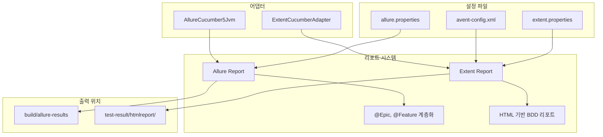
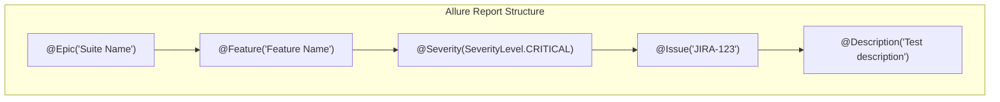
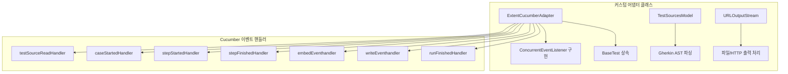

# Chapter 11: Adding Allure and Enhanced Extent Reports (Allure 및 Extent 리포트 추가)

## 📌 핵심 요약

> **"Allure 리포트는 @Epic, @Feature 어노테이션으로 테스트를 계층화하고, Extent 리포트는 커스텀 어댑터(ExtentCucumberAdapter)를 통해 Cucumber와 통합된다. DataTable 출력을 위해 MarkupHelper.createTable()을 활용하고, 테스트 스위트별 별도 폴더에 리포트를 생성한다."**

이 챕터에서는 Allure 리포트와 Extent 리포트를 생성하는 방법을 학습하고, BDD와 non-BDD 모두에서 활용 가능한 리포트 시스템을 구축한다.

---

## 🎯 학습 목표

이 챕터를 완료하면 다음을 할 수 있다:

- [ ] Allure 리포트 설정 및 생성 (JUnit, Cucumber)
- [ ] Extent 리포트 설정 (extent.properties, avent-config.xml)
- [ ] ExtentCucumberAdapter 커스터마이징
- [ ] DataTable을 Extent 리포트에 출력
- [ ] 테스트 스위트별 별도 리포트 폴더 생성

---

## 📖 본문 정리

### 11.1 리포트 시스템 아키텍처



---

### 11.2 Allure 리포트

#### allure.properties

```
파일 위치: src/test/resources/allure.properties
```

```properties
allure.results.directory=build/allure-results
```

#### JUnit 테스트에서 Allure 리포트 생성

```bash
# Smoke 태그 테스트 실행 후 Allure 리포트 생성
./gradlew Smoke --tests "com.taf.testautomation.uitests.AboutAppTestSuite" allurereport
```

#### Cucumber에서 Allure 리포트 생성

```java
@CucumberOptions(
    features = "src/test/resources/features",
    glue = {"com.taf.testautomation.cucumber.aboutapp"},
    monochrome = true,
    plugin = {
        "html:build/cucumber-html-report-normal",
        "json:build/cucumber.json",
        "io.qameta.allure.cucumber5jvm.AllureCucumber5Jvm",  // Allure 플러그인 추가
        "com.taf.testautomation.cucumber.ExtentCucumberAdapter:"
    },
    tags = {"@AboutApp"}
)
```

```bash
# Cucumber BDD 테스트 + Allure 리포트
./gradlew test -Dcucumber.options="--tags @AboutApp" allurereport
```

#### Allure 리포트 보기

```bash
# 브라우저에서 Allure 리포트 열기
allure serve build/allure-results
```

#### Allure 리포트 계층 구조



---

### 11.3 Extent 리포트 설정

#### 폴더 구조

```
project-root/
├── src/test/resources/
│   ├── extent.properties       # Extent 설정
│   └── avent-config.xml        # 리포트 포맷 정의
│
└── test-result/                # 리포트 출력 폴더
    ├── htmlreport/
    │   └── ExtentHtml.html
    ├── pdfreport/              # Chapter 12에서 사용
    └── screenshots/            # Chapter 13에서 사용
```

#### extent.properties

```properties
# 리포트 타입 활성화
extent.reporter.avent.start=false
extent.reporter.bdd.start=false
extent.reporter.cards.start=false
extent.reporter.email.start=false
extent.reporter.html.start=true          # HTML 리포트 활성화
extent.reporter.klov.start=false
extent.reporter.logger.start=false
extent.reporter.tabular.start=false

# 리포트 출력 경로
extent.reporter.avent.out=test-result/AventReport/
extent.reporter.bdd.out=test-result/BddReport/
extent.reporter.cards.out=test-result/CardsReport/
extent.reporter.email.out=test-result/emailreport/ExtentEmail.html
extent.reporter.html.out=test-result/htmlreport/ExtentHtml.html
extent.reporter.logger.out=test-result/LoggerReport/
extent.reporter.tabular.out=test-result/TabularReport/
```

#### avent-config.xml

```xml
<?xml version="1.0" encoding="UTF-8"?>
<extentreports>
    <configuration>
        <!-- 테마: standard, dark -->
        <theme>standard</theme>
        <viewstyle></viewstyle>
        <encoding>UTF-8</encoding>
        <enableOfflineMode>false</enableOfflineMode>
        <enableTimeline>true</enableTimeline>
        <protocol>https</protocol>
        <documentTitle>Extent Framework</documentTitle>
        <reportName>Build 1</reportName>
        <timeStampFormat>MMM dd, yyyy HH:mm:ss</timeStampFormat>

        <!-- 커스텀 JavaScript -->
        <scripts>
            <![CDATA[
                $(document).ready(function() {
                });
            ]]>
        </scripts>

        <!-- 커스텀 CSS -->
        <styles>
            <![CDATA[
            ]]>
        </styles>
    </configuration>
</extentreports>
```

---

### 11.4 ExtentCucumberAdapter 커스터마이징

#### 클래스 구조



#### ExtentCucumberAdapter.java (핵심 코드)

```java
package com.taf.testautomation.cucumber;

import com.taf.testautomation.BaseTest;
import com.aventstack.extentreports.ExtentTest;
import com.aventstack.extentreports.GherkinKeyword;
import com.aventstack.extentreports.markuputils.MarkupHelper;
import com.aventstack.extentreports.reporter.ExtentHtmlReporter;
import com.aventstack.extentreports.service.ExtentService;
import io.cucumber.plugin.ConcurrentEventListener;
import io.cucumber.plugin.event.*;
import lombok.extern.slf4j.Slf4j;

@Slf4j
public class ExtentCucumberAdapter extends BaseTest
        implements ConcurrentEventListener {

    private static final String REPORT_PATH = "test-result/htmlreport/ExtentHtml.html";
    private static final String REPORT_CONFIG = "src/test/resources/avent-config.xml";

    // ThreadLocal 변수들 - 병렬 실행 지원
    private static ThreadLocal<ExtentTest> featureTestThreadLocal = new InheritableThreadLocal<>();
    private static ThreadLocal<ExtentTest> scenarioThreadLocal = new InheritableThreadLocal<>();
    private static ThreadLocal<ExtentTest> stepTestThreadLocal = new InheritableThreadLocal<>();

    // 이벤트 핸들러들
    private EventHandler<TestCaseStarted> caseStartedHandler = event -> handleTestCaseStarted(event);
    private EventHandler<TestStepStarted> stepStartedHandler = event -> handleTestStepStarted(event);
    private EventHandler<TestStepFinished> stepFinishedHandler = event -> handleTestStepFinished(event);
    private EventHandler<TestRunFinished> runFinishedHandler = event -> finishReport();

    @Override
    public void setEventPublisher(EventPublisher publisher) {
        publisher.registerHandlerFor(TestSourceRead.class, testSourceReadHandler);
        publisher.registerHandlerFor(TestCaseStarted.class, caseStartedHandler);
        publisher.registerHandlerFor(TestStepStarted.class, stepStartedHandler);
        publisher.registerHandlerFor(TestStepFinished.class, stepFinishedHandler);
        publisher.registerHandlerFor(TestRunFinished.class, runFinishedHandler);
    }

    // 결과 업데이트
    private synchronized void updateResult(Result result) {
        switch (result.getStatus().toString()) {
            case "FAILED":
                stepTestThreadLocal.get().fail(result.getError());
                break;
            case "SKIPPED":
            case "PENDING":
                stepTestThreadLocal.get().skip(result.toString());
                break;
            case "PASSED":
                if (stepTestThreadLocal.get() != null) {
                    ExtentHtmlReporter avent = new ExtentHtmlReporter(REPORT_PATH);
                    ExtentService.getInstance().attachReporter(avent);
                    avent.loadXMLConfig(REPORT_CONFIG);
                    stepTestThreadLocal.get().pass("");
                }
                break;
        }
    }

    // 리포트 완료
    private void finishReport() {
        ExtentService.getInstance().flush();
    }
}
```

#### 핵심 패턴: ThreadLocal 사용

```java
// 병렬 실행 시 스레드 안전성 보장
private static ThreadLocal<ExtentTest> featureTestThreadLocal = new InheritableThreadLocal<>();
private static ThreadLocal<ExtentTest> scenarioThreadLocal = new InheritableThreadLocal<>();
private static ThreadLocal<ExtentTest> stepTestThreadLocal = new InheritableThreadLocal<>();
```

**ThreadLocal 사용 이유**:
- Cucumber 병렬 실행 시 각 스레드별 독립적인 상태 유지
- Feature/Scenario/Step 정보가 스레드 간 충돌 방지

---

### 11.5 DataTable을 Extent 리포트에 출력

#### createTestStep 메서드 수정

```java
private synchronized void createTestStep(PickleStepTestStep testStep) {
    // ... 기존 코드 ...

    if (!testStep.getStep().getText().isEmpty()) {
        StepArgument argument = testStep.getStep().getArgument();

        // PickleTable 처리
        if (argument instanceof PickleTable) {
            List<PickleRow> rows = ((PickleTable) argument).getRows();
            stepTestThreadLocal.get().pass(
                MarkupHelper.createTable(getPickleTable(rows)).getMarkup()
            );
        }

        // "following" 키워드가 포함된 스텝에서 DataTable 출력
        if (testStep.getStep().getText().contains("following")) {
            stepTestThreadLocal.get().pass(
                MarkupHelper.createTable(dataTable).getMarkup()
            );
        }
    }
}
```

#### DataTable 출력 규칙

```gherkin
# Feature 파일에서 "following" 키워드 사용
And verified user sees the following in-app screen
  | Screen_Title   |
  | App_Logo       |
  | App_Name       |
```

**규칙**: Step 텍스트에 `following` 키워드가 포함되면 `dataTable`을 리포트에 출력

---

### 11.6 테스트 스위트별 별도 리포트 폴더

#### FileUtil에 fileCopy 메서드 추가

```java
public static void fileCopy(String inputFile, String outputFile) {
    String cleanLine = "";
    try {
        fos = new FileOutputStream(outputFile);
        FileInputStream fileInputStream = new FileInputStream(inputFile);
        BufferedReader br = new BufferedReader(new InputStreamReader(fileInputStream));
        String strLine = null;

        while ((strLine = br.readLine()) != null) {
            cleanLine += strLine + "\n";
        }

        char[] stringToCharArray = cleanLine.toCharArray();
        for (char ch : stringToCharArray)
            fos.write(ch);
        fos.close();
    } catch (IOException e) {
        // Handle exception
    }
}
```

#### Runner 클래스에 @AfterClass 추가

```java
@RunWith(Cucumber.class)
@CucumberOptions(
    features = "src/test/resources/features",
    glue = {"com.taf.testautomation.cucumber.aboutapp"},
    monochrome = true,
    plugin = {
        "html:build/cucumber-html-report-normal",
        "json:build/cucumber.json",
        "com.taf.testautomation.cucumber.ExtentCucumberAdapter:"
    },
    tags = {"@AboutApp"}
)
public class AboutAppTest {

    @AfterClass
    public static void sendExtentReport() {
        // 클래스 이름으로 폴더 생성
        String folder = new Object() {}.getClass().getName();
        folder = folder.substring(folder.lastIndexOf('.') + 1, folder.indexOf('$'));

        // 리포트 경로 설정
        String htmlFilePath = getCustomProperties().get("reportPrefix")
            + "test-result/htmlreport/" + folder;
        String htmlFile = htmlFilePath + "/ExtentHtml.html";

        // 폴더 생성
        String folderExists = new File(htmlFilePath).mkdir()
            ? "Folder Created" : "Folder Exists";

        // 리포트 복사
        FileUtil.fileCopy(
            "test-result/htmlreport/ExtentHtml.html",
            new File(htmlFile).getPath()
        );
    }
}
```

#### 결과 폴더 구조

```
test-result/
└── htmlreport/
    ├── ExtentHtml.html           # 기본 리포트
    ├── AboutAppTest/
    │   └── ExtentHtml.html       # AboutApp 테스트 리포트
    ├── LoginTest/
    │   └── ExtentHtml.html       # Login 테스트 리포트
    └── SettingsTest/
        └── ExtentHtml.html       # Settings 테스트 리포트
```

---

### 11.7 TestSourcesModel 및 URLOutputStream

#### TestSourcesModel.java

```java
// Gherkin AST(Abstract Syntax Tree) 파싱
final class TestSourcesModel {
    private final Map<String, TestSourceRead> pathToReadEventMap = new HashMap<>();
    private final Map<String, GherkinDocument> pathToAstMap = new HashMap<>();
    private final Map<String, Map<Integer, AstNode>> pathToNodeMap = new HashMap<>();

    // Feature 가져오기
    Feature getFeature(String path) {
        if (!pathToAstMap.containsKey(path)) {
            parseGherkinSource(path);
        }
        return pathToAstMap.get(path).getFeature();
    }

    // Scenario/ScenarioOutline 판별
    static boolean isScenarioOutlineScenario(AstNode astNode) {
        return !(astNode.node instanceof ScenarioDefinition);
    }

    // AST 노드 래퍼
    static class AstNode {
        final Node node;
        final AstNode parent;

        AstNode(Node node, AstNode parent) {
            this.node = node;
            this.parent = parent;
        }
    }
}
```

#### URLOutputStream.java

```java
// 파일 또는 HTTP URL로 바이트 출력
class URLOutputStream extends OutputStream {
    private final URL url;
    private final OutputStream out;

    URLOutputStream(URL url) throws IOException {
        this.url = url;
        if (url.getProtocol().equals("file")) {
            File file = new File(url.getFile());
            ensureParentDirExists(file);
            out = new FileOutputStream(file);
        } else if (url.getProtocol().startsWith("http")) {
            HttpURLConnection urlConnection = (HttpURLConnection) url.openConnection();
            urlConnection.setRequestMethod("PUT");
            urlConnection.setDoOutput(true);
            out = urlConnection.getOutputStream();
        }
    }
}
```

---

## 💡 실무 적용 포인트

### 리포트 시스템 비교

| 항목 | Allure | Extent |
|------|--------|--------|
| **설정 복잡도** | 낮음 (properties만) | 중간 (xml 추가) |
| **계층 구조** | @Epic/@Feature | Feature/Scenario |
| **커스터마이징** | 제한적 | 유연함 (어댑터) |
| **DataTable** | 기본 지원 | 커스텀 필요 |
| **스크린샷** | 기본 지원 | 커스텀 필요 |
| **병렬 실행** | 지원 | ThreadLocal 필요 |

### 리포트 생성 명령어 요약

```bash
# JUnit + Allure
./gradlew Smoke --tests "...AboutAppTestSuite" allurereport

# Cucumber + Allure
./gradlew test -Dcucumber.options="--tags @AboutApp" allurereport

# Allure 리포트 보기
allure serve build/allure-results

# Cucumber + Extent (자동 생성)
./gradlew test -Dcucumber.options="--tags @AboutApp"
```

### 체크리스트

```
□ 리포트 설정
  ├── allure.properties (Allure 결과 경로)
  ├── extent.properties (Extent 타입/경로)
  └── avent-config.xml (Extent 포맷)

□ 커스텀 어댑터
  ├── ExtentCucumberAdapter (BaseTest 상속)
  ├── TestSourcesModel (Gherkin 파싱)
  └── URLOutputStream (파일 출력)

□ DataTable 출력
  └── "following" 키워드 사용 규칙

□ 별도 폴더 리포트
  └── @AfterClass + FileUtil.fileCopy()
```

---

## ✅ 핵심 개념 체크리스트

- [ ] allure.properties 설정 (결과 디렉토리)
- [ ] Allure 플러그인 Runner에 추가 (`AllureCucumber5Jvm`)
- [ ] `allure serve` 명령으로 리포트 보기
- [ ] extent.properties 리포터 타입 설정
- [ ] avent-config.xml 테마/포맷 설정
- [ ] ExtentCucumberAdapter가 BaseTest 상속
- [ ] ThreadLocal로 병렬 실행 지원
- [ ] MarkupHelper.createTable()로 DataTable 출력
- [ ] @AfterClass에서 테스트별 리포트 폴더 생성

---

## 🔗 참고 자료

- [Allure Framework Documentation](https://docs.qameta.io/allure/)
- [Extent Reports Documentation](https://www.extentreports.com/docs/versions/5/java/index.html)
- [extentreports-cucumber4-adapter GitHub](https://github.com/extent-framework/extentreports-cucumber4-adapter)
- [Cucumber Event Listener](https://cucumber.io/docs/cucumber/api/#events)

---

## 📚 다음 챕터 미리보기

- **Chapter 12**: 스크린샷이 포함된 커스텀 PDF 리포트 생성
