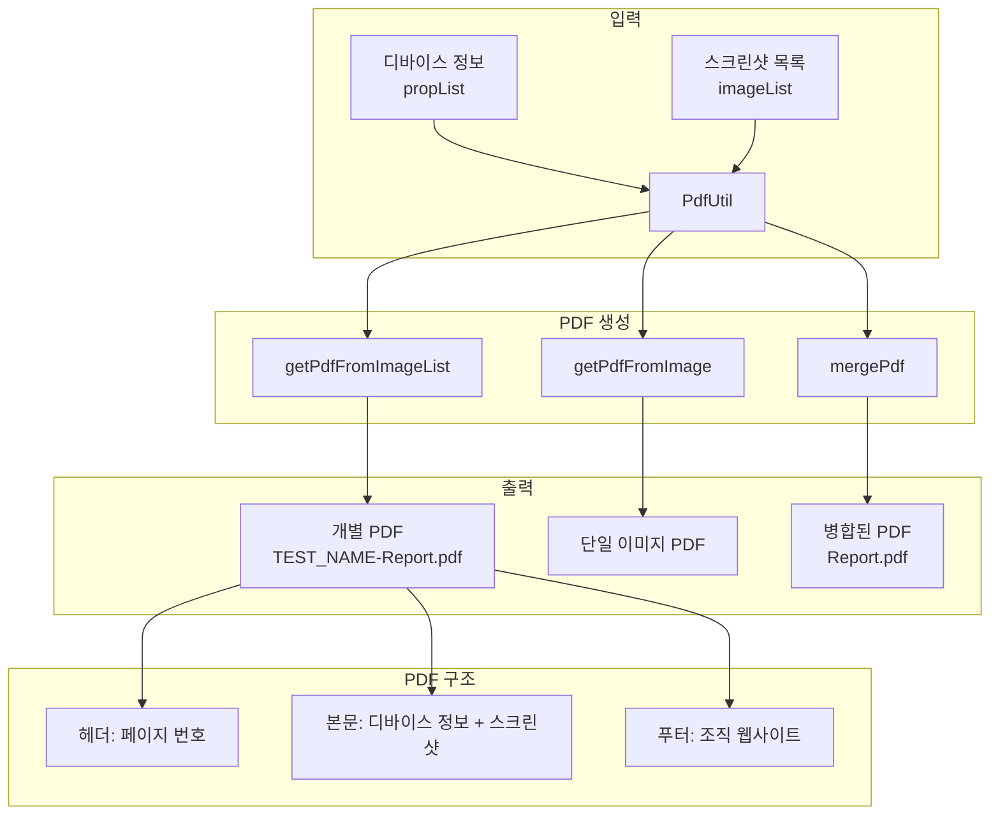
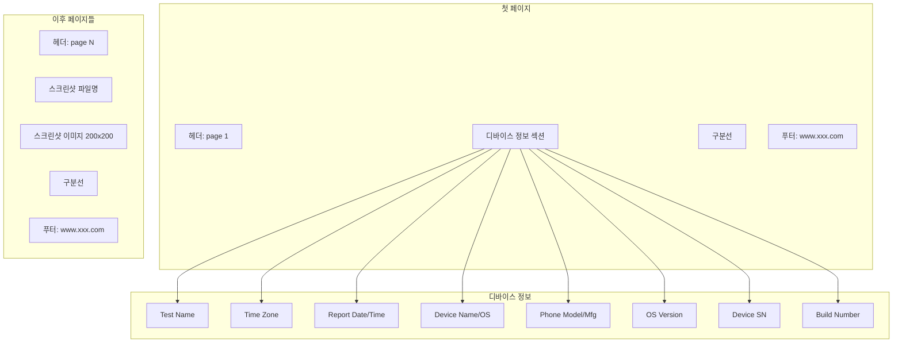

# Chapter 12: Creating a PDF Report with Screenshots (스크린샷이 포함된 PDF 리포트 생성)

## 📌 핵심 요약

> **"iTextPDF 라이브러리를 사용하여 디바이스 정보와 스크린샷이 포함된 커스텀 PDF 리포트를 생성한다. 각 테스트 스위트별로 개별 PDF를 생성하고, mergePdf()로 여러 PDF를 하나로 병합한다. 리포트에는 헤더(페이지 번호)와 푸터(조직 웹사이트)가 자동으로 추가된다."**

이 챕터에서는 조직의 요구사항에 맞게 커스터마이징 가능한 PDF 리포트를 생성하는 방법을 학습한다.

---

## 🎯 학습 목표

이 챕터를 완료하면 다음을 할 수 있다:

- [ ] PdfUtil 클래스로 PDF 리포트 생성
- [ ] 디바이스 정보와 스크린샷을 PDF에 포함
- [ ] 헤더/푸터 추가 (페이지 번호, 조직 정보)
- [ ] 여러 PDF 파일 병합
- [ ] 테스트 스위트에 PDF 리포트 모듈 통합
- [ ] BDD Step Definition에서 리포트 생성 호출

---

## 📖 본문 정리

### 12.1 PDF 리포트 아키텍처



---

### 12.2 PdfUtil 클래스

#### 파일 위치

```
src/main/java/com/taf/testautomation/utilities/pdfutil/PdfUtil.java
```

#### PdfUtil.java

```java
package com.taf.testautomation.utilities.pdfutil;

import com.itextpdf.text.*;
import com.itextpdf.text.pdf.*;
import java.io.*;
import java.net.URI;
import java.net.URL;
import java.nio.file.Files;
import java.nio.file.Paths;
import java.util.ArrayList;
import java.util.List;
import java.util.stream.IntStream;

import static com.taf.testautomation.utilities.excelutil.ExcelUtil.getCustomProperties;

public class PdfUtil extends PdfPageEventHelper {

    /**
     * 디바이스 정보와 이미지 목록으로 PDF 생성
     * @param props 디바이스 속성 목록 (11개 항목)
     * @param image 스크린샷 이미지 경로 목록
     * @param pdfFile 출력 PDF 파일
     */
    public void getPdfFromImageList(List<String> props, List<String> image, File pdfFile) {
        try {
            int count = 1;
            int lineCount = 30;
            Document document = new Document();
            PdfWriter writer = PdfWriter.getInstance(document, new FileOutputStream(pdfFile));
            document.open();

            // 헤더/푸터 추가
            addHeaderFooter(document, writer, count);

            // 문서 메타데이터
            document.addAuthor("Koushik Das");
            document.addCreationDate();
            document.addCreator("Koushik Das");
            document.addTitle("Test ScreenShots");
            document.addSubject("Test ScreenShots");

            // 디바이스 정보 섹션
            Paragraph pg = new Paragraph();
            pg.add("\n");
            pg.add("\n Test Name:      " + props.get(0));
            pg.add("\n =============================================================");
            pg.add("\n Time Zone:      " + props.get(1));
            pg.add("\n Report Date:      " + props.get(2));
            pg.add("\n Report Time:      " + props.get(3));
            pg.add("\n Device Name:      " + props.get(4));
            pg.add("\n Device OS:      " + props.get(5));
            pg.add("\n Phone Model:      " + props.get(6));
            pg.add("\n Device Mfg:      " + props.get(7));
            pg.add("\n OS Version:      " + props.get(8));
            pg.add("\n Device SN:      " + props.get(9));
            pg.add("\n Build Number:      " + props.get(10));

            // 페이지 채우기
            IntStream.range(0, 33).forEach(i -> pg.add("\n"));
            pg.add("\n =============================================================");
            document.add(pg);

            // 스크린샷 추가
            for (String str : image) {
                // 이미지 파일명 (확장자 제외)
                document.add(new Paragraph(
                    str.substring(str.lastIndexOf("/") + 1, str.indexOf("."))
                ));

                // 이미지 삽입
                Image image1 = Image.getInstance(str);
                image1.scaleAbsolute(200, 200);
                document.add(image1);

                // 페이지 구분
                Paragraph para = new Paragraph();
                count++;
                if ((count % 2) == 0) lineCount = 33;
                else lineCount = 28;
                IntStream.range(0, lineCount).forEach(i -> para.add("\n"));
                para.add("\n =============================================================");

                addHeaderFooter(document, writer, count);
                document.add(para);
            }

            document.close();
            writer.close();
        } catch (Exception e) {
            e.printStackTrace();
        }
    }

    /**
     * 헤더/푸터 추가
     */
    private void addHeaderFooter(Document doc, PdfWriter writer, int count) {
        doc.setPageCount(count);
        onStartPage(doc, writer);
        onEndPage(doc, writer);
    }

    /**
     * 헤더: 페이지 번호
     */
    private void onStartPage(Document doc, PdfWriter writer) {
        int numberOfPages = doc.getPageNumber();
        ColumnText.showTextAligned(
            writer.getDirectContent(),
            Element.ALIGN_CENTER,
            new Phrase("page " + numberOfPages),
            550, 800, 0
        );
    }

    /**
     * 푸터: 조직 웹사이트
     */
    private void onEndPage(Document doc, PdfWriter writer) {
        ColumnText.showTextAligned(
            writer.getDirectContent(),
            Element.ALIGN_CENTER,
            new Phrase("www.xxx.com"),
            550, 30, 0
        );
    }

    /**
     * 단일 이미지 PDF 생성
     */
    public static void getPdfFromImage(String image, String pdfFile) {
        try {
            Document document = new Document();
            PdfWriter writer = PdfWriter.getInstance(document, new FileOutputStream(pdfFile));
            document.open();

            document.addAuthor("Koushik Das");
            document.addCreationDate();
            document.addCreator("Koushik Das");
            document.addTitle("Test ScreenShots");
            document.addSubject("Test ScreenShots");

            document.add(new Paragraph("Screenshots"));

            Image image1 = Image.getInstance(image);
            image1.scaleAbsolute(200, 200);
            document.add(image1);

            document.close();
            writer.close();
        } catch (Exception e) {
            e.printStackTrace();
        }
    }

    /**
     * 여러 PDF 병합
     */
    public static void mergePdf(File pdfFile) {
        try {
            String folder = getCustomProperties().get("reportPrefix") + "test-result/pdfreport";
            List<String> inputPdfList = new ArrayList<>();

            // pdfreport 폴더 내 모든 PDF 파일 수집
            Files.newDirectoryStream(Paths.get(folder),
                path -> path.toString().endsWith(".pdf"))
                .forEach(filePath -> inputPdfList.add(filePath.toString()));

            Document document = new Document();
            PdfCopy copy = new PdfCopy(document, new FileOutputStream(pdfFile));
            document.open();

            for (String file : inputPdfList) {
                // 병합 결과 파일은 입력에서 제외
                if (!file.equals(getCustomProperties().get("mergedReport"))) {
                    File pdf = new File(file);
                    URI uri = pdf.toURI();
                    URL url = uri.toURL();
                    PdfReader reader = new PdfReader(url);
                    copy.addDocument(reader);
                    copy.freeReader(reader);
                    reader.close();
                }
            }
            document.close();
        } catch (Exception e) {
            e.printStackTrace();
        }
    }

    /**
     * HTML to PDF 변환 (향후 구현)
     */
    public static void getPdfFromHtml(String htmlSource, String pdfFile) {
        try {
            // 구현 예정
        } catch (Exception e) {
            e.printStackTrace();
        }
    }
}
```

---

### 12.3 PdfUtil 메서드 요약

| 메서드 | 용도 | 파라미터 |
|--------|------|----------|
| `getPdfFromImageList()` | 디바이스 정보 + 스크린샷 PDF | props, image, pdfFile |
| `getPdfFromImage()` | 단일 이미지 PDF | image, pdfFile |
| `mergePdf()` | 여러 PDF 병합 | pdfFile |
| `addHeaderFooter()` | 헤더/푸터 추가 | doc, writer, count |

#### props 리스트 구조 (11개 항목)

```java
List<String> propList = Stream.of(
    testCase,      // [0] 테스트 이름
    timeZone,      // [1] 타임존
    reportDate,    // [2] 리포트 날짜
    reportTime,    // [3] 리포트 시간
    deviceName,    // [4] 디바이스 이름
    deviceOS,      // [5] OS 종류
    deviceModel,   // [6] 폰 모델
    deviceMfg,     // [7] 제조사
    osVersion,     // [8] OS 버전
    deviceSN,      // [9] 시리얼 번호
    buildNumber    // [10] 빌드 번호
).collect(Collectors.toList());
```

---

### 12.4 테스트 스위트에 PDF 리포트 통합

#### AboutAppTestSuite.java (업데이트)

```java
@TestMethodOrder(MethodOrderer.OrderAnnotation.class)
@TestInstance(TestInstance.Lifecycle.PER_CLASS)
@Epic("xxxx")
@Feature("About App Page Layout")
public class AboutAppTestSuite extends BaseTest {

    private AboutAppScreen aboutAppScreen;
    private JsonUtil jsonUtil;
    private ExcelUtil excelUtil = new ExcelUtil();
    private AppiumUtil appiumUtil;
    protected String testStatus = "";

    private static final String SCREEN_NAME = "aboutAppScreen";
    private static final String TEST_NAME = "AboutApp-Screen-Verification-";

    private static int i = 0, j = 0;
    private static List<String> imageList = new ArrayList<>();  // 스크린샷 목록 (Chapter 13에서 채움)

    @BeforeAll
    @Override
    public void setUp() throws Exception {
        super.setUp();
        if (getCustomProperties().get("loadExcel").equals("Y")) {
            excelUtil.generateJsonFilesFromExcel1();
        }
        jsonUtil = new JsonUtil();
        appiumUtil = new AppiumUtil(getSession().getAppiumDriver());
    }

    // ... 기존 테스트 메서드들 (testScenario1~5) ...

    /**
     * PDF 리포트 생성 테스트
     */
    @Severity(SeverityLevel.CRITICAL)
    @Issue("xxxx")
    @DisplayName("xxxx")
    @Description("xxxx: Create Report")
    @Test
    @Order(6)
    @Smoke
    @Regression
    @SIT
    @AT
    public void create_pdf_report() {
        String tcName = new Object() {}.getClass().getEnclosingMethod().getName();
        log("Test Name" + tcName);

        appiumUtil = new AppiumUtil(getSession().getAppiumDriver());

        // PDF 파일 경로
        String pdfFile = getCustomProperties().get("reportPrefix")
            + "test-result/pdfreport/" + TEST_NAME + "Report.pdf";

        // 디바이스 정보 수집 (Chapter 17에서 구현)
        String testCase = TEST_NAME + "Screenshots:";
        String timeZone = appiumUtil.getDeviceProperties("TimeZone");
        String reportDate = appiumUtil.getDeviceProperties("ReportDate");
        String reportTime = appiumUtil.getDeviceProperties("ReportTime");
        String deviceName = appiumUtil.getDeviceProperties("Name");
        String deviceOS = appiumUtil.getDeviceProperties("OS");
        String deviceModel = appiumUtil.getDeviceProperties("Model");
        String deviceMfg = appiumUtil.getDeviceProperties("Manufacturer");
        String osVersion = appiumUtil.getDeviceProperties("Version");
        String deviceSN = appiumUtil.getDeviceProperties("Serial_Number");
        String buildNumber = getCustomProperties().get("build");

        // Stream으로 propList 생성
        Stream<String> propStream = Stream.of(
            testCase, timeZone, reportDate, reportTime,
            deviceName, deviceOS, deviceModel, deviceMfg,
            osVersion, deviceSN, buildNumber
        );
        List<String> propList = propStream.collect(Collectors.toList());

        // 테스트 통과율 계산
        String update = j + " of " + i + " Passed";

        // PDF 생성 및 병합
        new PdfUtil().getPdfFromImageList(propList, imageList, new File(pdfFile));
        PdfUtil.mergePdf(new File(getCustomProperties().get("mergedReport")));
    }

    /**
     * 테스트 통과 카운트 업데이트
     */
    private void updateTCPassCount() {
        i++;
        if (testStatus.equals("Passed")) j++;
    }
}
```

---

### 12.5 AppiumUtil 클래스 (Placeholder)

```java
package com.taf.testautomation.devicemanagement;

import io.appium.java_client.AppiumDriver;

public class AppiumUtil {
    private AppiumDriver driver;

    public AppiumUtil(AppiumDriver driver) {
        this.driver = driver;
    }

    /**
     * 디바이스 속성 조회 (Chapter 17에서 구현)
     * @param devProp 속성 키 (TimeZone, Name, OS, Model, etc.)
     * @return 속성 값
     */
    public String getDeviceProperties(String devProp) {
        return "string";  // Placeholder - Chapter 17에서 구현
    }
}
```

---

### 12.6 BDD Step Definition 업데이트

```java
@Then("close application and update HP QC test run")
public void close_application_and_update_HP_QC_test_run() throws Exception {
    create_pdf_report();  // PDF 리포트 생성 추가
    tearDown();
}
```

---

### 12.7 PDF 리포트 구조



---

### 12.8 폴더 구조

```
project-root/
├── src/main/java/com/taf/testautomation/
│   ├── devicemanagement/
│   │   └── AppiumUtil.java           # 디바이스 정보 조회
│   └── utilities/pdfutil/
│       └── PdfUtil.java              # PDF 생성 유틸리티
│
└── test-result/
    ├── htmlreport/                   # Extent HTML 리포트
    ├── pdfreport/                    # PDF 리포트
    │   ├── AboutApp-Screen-Verification-Report.pdf
    │   ├── LoginTest-Report.pdf
    │   └── Report.pdf                # 병합된 리포트
    └── screenshots/                  # 스크린샷 이미지 (Chapter 13)
```

---

## 💡 실무 적용 포인트

### iTextPDF 주요 클래스

| 클래스 | 역할 |
|--------|------|
| `Document` | PDF 문서 컨테이너 |
| `PdfWriter` | PDF 쓰기 엔진 |
| `PdfCopy` | PDF 병합 |
| `PdfReader` | PDF 읽기 |
| `Paragraph` | 텍스트 단락 |
| `Image` | 이미지 삽입 |
| `ColumnText` | 위치 지정 텍스트 |
| `PdfPageEventHelper` | 페이지 이벤트 처리 |

### 베스트 프랙티스

```
□ 메서드 인자 개수 제한
  └── 3개 이하 권장 (Chapter 1 원칙)

□ 디바이스 정보 동적 수집
  └── AppiumUtil.getDeviceProperties() (Chapter 17)

□ 스크린샷 목록 관리
  └── imageList에 경로 저장 (Chapter 13)

□ PDF 병합 시 주의
  └── mergedReport 파일은 입력에서 제외
```

### PDF 커스터마이징 옵션

```java
// 문서 메타데이터
document.addAuthor("조직명");
document.addTitle("테스트 리포트");
document.addCreator("테스트 자동화 팀");

// 이미지 크기 조정
image.scaleAbsolute(300, 400);  // 가로 300, 세로 400

// 헤더/푸터 위치 (x, y 좌표)
ColumnText.showTextAligned(..., 550, 800, 0);  // 헤더
ColumnText.showTextAligned(..., 550, 30, 0);   // 푸터
```

---

## ✅ 핵심 개념 체크리스트

- [ ] iTextPDF 의존성 추가 (build.gradle)
- [ ] PdfPageEventHelper 상속으로 페이지 이벤트 처리
- [ ] getPdfFromImageList()로 디바이스 정보 + 스크린샷 PDF 생성
- [ ] getPdfFromImage()로 단일 이미지 PDF 생성
- [ ] mergePdf()로 여러 PDF 병합
- [ ] ColumnText.showTextAligned()로 헤더/푸터 추가
- [ ] Image.scaleAbsolute()로 이미지 크기 조정
- [ ] AppiumUtil.getDeviceProperties() placeholder (Chapter 17)
- [ ] 테스트 스위트에 create_pdf_report() 메서드 추가
- [ ] BDD Step Definition에서 리포트 생성 호출

---

## 🔗 참고 자료

- [iText 7 Documentation](https://itextpdf.com/en/resources/books/itext-7-jump-start-tutorial-java)
- [iText PDF Examples](https://itextpdf.com/en/resources/examples)
- [Java NIO Files](https://docs.oracle.com/javase/8/docs/api/java/nio/file/Files.html)

---

## 📚 다음 챕터 미리보기

- **Chapter 13**: 스크린샷 생성 및 저장 방법 (imageList 채우기)
