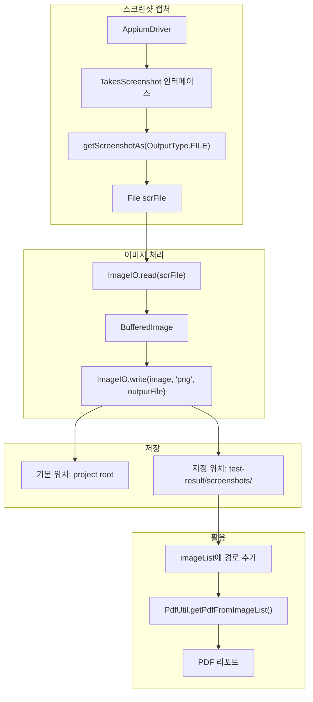
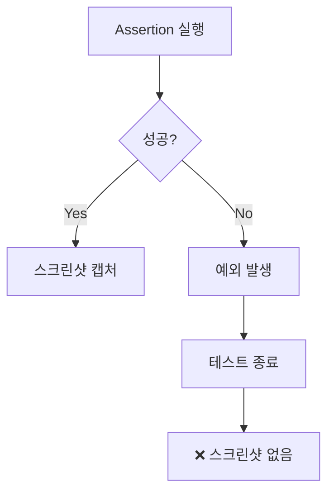
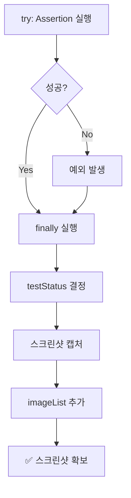

# Chapter 13: Enhancing the Framework: Screenshots (프레임워크 강화: 스크린샷)

## 📌 핵심 요약

> **"TakesScreenshot 인터페이스와 ImageIO를 사용하여 스크린샷을 캡처하고 저장한다. try-finally 블록으로 Assertion 실패 시에도 스크린샷을 확보하며, 테스트 메서드명과 Pass/Fail 상태를 파일명에 포함하여 추적성을 높인다. imageList에 경로를 저장하여 PDF 리포트에 활용한다."**

이 챕터에서는 스크린샷을 생성하고 저장하는 다양한 방법을 학습하고, Chapter 12에서 생성한 imageList를 채워 PDF 리포트에 스크린샷을 포함시킨다.

---

## 🎯 학습 목표

이 챕터를 완료하면 다음을 할 수 있다:

- [ ] takeScreenShot() 메서드로 기본 위치에 스크린샷 저장
- [ ] takeScreenShot(fileName) 오버로드로 지정 위치에 저장
- [ ] 테스트 메서드명 + 상태를 파일명에 포함
- [ ] try-finally로 실패 케이스 스크린샷 확보
- [ ] imageList 채워서 PDF 리포트에 연동
- [ ] Page Object 레벨에서 스크린샷 캡처

---

## 📖 본문 정리

### 13.1 스크린샷 캡처 아키텍처



---

### 13.2 기본 스크린샷 메서드

#### takeScreenShot() - 기본 위치 저장

```java
/**
 * 현재 화면 스크린샷을 프로젝트 루트에 저장
 */
public void takeScreenShot() throws IOException {
    // 1. AppiumDriver에서 스크린샷 파일 가져오기
    File scrFile = ((TakesScreenshot) getSession().getAppiumDriver())
        .getScreenshotAs(OutputType.FILE);

    // 2. BufferedImage로 변환
    BufferedImage image = ImageIO.read(scrFile);

    // 3. 파일로 저장
    File outputFile = new File("screenshot.png");
    ImageIO.write(image, "png", outputFile);
}
```

**용도**: 이미지 비교 유틸리티에서 레퍼런스 이미지와 비교 시 사용 (Appendix A)

---

### 13.3 오버로드 스크린샷 메서드

#### takeScreenShot(String fileName) - 지정 위치 저장

```java
/**
 * 현재 화면 스크린샷을 지정된 파일명으로 저장
 * @param fileName 저장할 파일 경로 및 이름
 */
public void takeScreenShot(String fileName) throws IOException {
    File scrFile = ((TakesScreenshot) getSession().getAppiumDriver())
        .getScreenshotAs(OutputType.FILE);

    BufferedImage image = ImageIO.read(scrFile);

    File outputFile = new File(fileName);
    ImageIO.write(image, "png", outputFile);
}
```

**호출 예시**:
```java
aboutAppScreen.takeScreenShot("test-result/screenshots/" + tcName + "--" + testStatus + ".png");
```

---

### 13.4 테스트 스위트에 스크린샷 통합

#### 파일명 규칙

```
test-result/screenshots/
├── testScenario1--Passed.png
├── testScenario2--Failed.png
├── testScenario3--Passed.png
├── testScenario4--Passed.png
└── testScenario5--Failed.png
```

**파일명 패턴**: `{테스트메서드명}--{Passed|Failed}.png`

#### 테스트 메서드명 추출

```java
String tcName = new Object() {}.getClass().getEnclosingMethod().getName();
// 결과: "testScenario1"
```

---

### 13.5 기본 테스트 메서드 (스크린샷 포함)

```java
@Severity(SeverityLevel.CRITICAL)
@Issue("xxxx")
@DisplayName("xxxx")
@Description("xxxx: Verify that the AboutAppScreen Title is displayed")
@Test
@Order(1)
@Smoke
@Regression
@SIT
@AT
public void testScenario1() {
    String tcName = new Object() {}.getClass().getEnclosingMethod().getName();
    log("Test Name" + tcName);

    // Assertion 수행
    SoftAssertions.assertSoftly(
        softAssertions -> {
            softAssertions.assertThat(aboutAppScreen.isScreenTitleDisplayed())
                .as("The Screen title is displayed")
                .isTrue();
        }
    );

    // 테스트 상태 결정
    testStatus = aboutAppScreen.isScreenTitleDisplayed() ? "Passed" : "Failed";
    updateTCPassCount();

    // 스크린샷 캡처
    try {
        aboutAppScreen.takeScreenShot(
            "test-result/screenshots/" + tcName + "--" + testStatus + ".png"
        );
    } catch (Exception e) {
        e.printStackTrace();
    }

    // imageList에 경로 추가 (PDF 리포트용)
    imageList.add("test-result/screenshots/" + tcName + "--" + testStatus + ".png");
}
```

---

### 13.6 try-finally로 실패 케이스 스크린샷 확보

#### 문제점



**문제**: Assertion이 실패하면 이후 코드가 실행되지 않아 스크린샷을 얻을 수 없음

#### 해결: try-finally 블록

```java
@Test
@Order(1)
@Smoke
@Regression
@SIT
@AT
public void testScenario1() {
    String tcName = new Object() {}.getClass().getEnclosingMethod().getName();
    log("Test Name" + tcName);

    try {
        // Assertion 수행
        SoftAssertions.assertSoftly(
            softAssertions -> {
                softAssertions.assertThat(aboutAppScreen.isScreenTitleDisplayed())
                    .as("The Screen title is displayed")
                    .isTrue();
            }
        );
    } finally {
        // finally 블록은 항상 실행됨
        testStatus = aboutAppScreen.isScreenTitleDisplayed() ? "Passed" : "Failed";
        updateTCPassCount();

        try {
            aboutAppScreen.takeScreenShot(
                "test-result/screenshots/" + tcName + "--" + testStatus + ".png"
            );
        } catch (Exception e) {
            e.printStackTrace();
        }

        imageList.add("test-result/screenshots/" + tcName + "--" + testStatus + ".png");
    }
}
```

#### 동작 흐름



---

### 13.7 모든 테스트 메서드 업데이트

```java
// testScenario2
@Test
@Order(2)
@Smoke
public void testScenario2() {
    String tcName = new Object() {}.getClass().getEnclosingMethod().getName();
    log("Test Name" + tcName);
    try {
        SoftAssertions.assertSoftly(
            softAssertions -> {
                softAssertions.assertThat(aboutAppScreen.isAppLogoDisplayed())
                    .as("The App Logo is displayed").isTrue();
            }
        );
    } finally {
        testStatus = aboutAppScreen.isAppLogoDisplayed() ? "Passed" : "Failed";
        updateTCPassCount();
        try {
            aboutAppScreen.takeScreenShot(
                "test-result/screenshots/" + tcName + "--" + testStatus + ".png"
            );
        } catch (Exception e) {
            e.printStackTrace();
        }
        imageList.add("test-result/screenshots/" + tcName + "--" + testStatus + ".png");
    }
}

// testScenario3, testScenario4, testScenario5도 동일한 패턴 적용
```

---

### 13.8 Page Object 레벨 스크린샷

#### 용도

- 여러 Assertion을 하나의 assertSoftly에서 수행할 때
- 개별 검증 포인트마다 스크린샷이 필요할 때
- 테스트 스위트 레벨이 아닌 Page Object 내부에서 캡처

#### AboutAppScreen.java 업데이트

```java
public class AboutAppScreen extends MobileBaseActionScreen {

    // ... 기존 필드 및 메서드 ...

    /**
     * 앱 이미지 표시 여부 검증
     */
    @Step("Verifying the app images are Displayed")
    public boolean areAppImagesDisplayed() {
        getScreenShot();  // Page Object 내부에서 스크린샷 캡처
        return doesElementExist(appImages.get(0), MIN_WAIT)
            && doesElementExist(appImages.get(1), MIN_WAIT)
            && doesElementExist(appImages.get(2), MIN_WAIT);
    }

    /**
     * Page Object 레벨 스크린샷
     */
    private void getScreenShot() {
        // 클래스명 추출
        String name = new Object() {}.getClass().getName();
        name = name.substring(name.lastIndexOf('.') + 1, name.indexOf('$'));
        // 결과: "AboutAppScreen"

        try {
            this.takeScreenShot("test-result/screenshots/" + name + ".png");
        } catch (Exception e) {
            e.printStackTrace();
        }
    }
}
```

#### 결과 파일

```
test-result/screenshots/
├── testScenario1--Passed.png       # 테스트 스위트 레벨
├── testScenario2--Passed.png
├── ...
└── AboutAppScreen.png              # Page Object 레벨
```

---

### 13.9 클래스명/메서드명 추출 패턴

| 목적 | 코드 | 결과 |
|------|------|------|
| 메서드명 | `new Object(){}.getClass().getEnclosingMethod().getName()` | `"testScenario1"` |
| 클래스명 | `new Object(){}.getClass().getName()` | `"...AboutAppScreen$1"` |
| 정리된 클래스명 | `name.substring(name.lastIndexOf('.') + 1, name.indexOf('$'))` | `"AboutAppScreen"` |

---

## 💡 실무 적용 포인트

### 스크린샷 관리 체크리스트

```
□ MobileBaseActionScreen
  ├── takeScreenShot() - 기본 위치
  └── takeScreenShot(String fileName) - 지정 위치

□ 테스트 스위트
  ├── imageList 선언 (static List<String>)
  ├── try-finally로 실패 케이스 처리
  ├── 파일명: {tcName}--{Passed|Failed}.png
  └── imageList.add(경로) 호출

□ Page Object (선택적)
  └── getScreenShot() - 개별 검증 포인트별

□ PDF 리포트 연동
  └── PdfUtil.getPdfFromImageList(propList, imageList, pdfFile)
```

### 스크린샷 저장 위치

```
project-root/
└── test-result/
    ├── screenshots/            # 스크린샷 저장
    │   ├── testScenario1--Passed.png
    │   ├── testScenario2--Failed.png
    │   └── AboutAppScreen.png
    ├── pdfreport/              # PDF 리포트
    └── htmlreport/             # HTML 리포트
```

### 핵심 API 요약

| API | 출처 | 역할 |
|-----|------|------|
| `TakesScreenshot` | Selenium | 스크린샷 인터페이스 |
| `OutputType.FILE` | Selenium | 파일 출력 타입 |
| `BufferedImage` | java.awt.image | 이미지 버퍼 |
| `ImageIO.read()` | javax.imageio | 파일 → 이미지 |
| `ImageIO.write()` | javax.imageio | 이미지 → 파일 |

---

## ✅ 핵심 개념 체크리스트

- [ ] TakesScreenshot 인터페이스로 드라이버에서 스크린샷 캡처
- [ ] OutputType.FILE로 임시 파일 생성
- [ ] BufferedImage + ImageIO로 PNG 저장
- [ ] takeScreenShot(fileName) 오버로드로 지정 위치 저장
- [ ] 테스트 메서드명 동적 추출 (`getEnclosingMethod().getName()`)
- [ ] try-finally로 Assertion 실패 시에도 스크린샷 확보
- [ ] imageList에 경로 추가하여 PDF 리포트 연동
- [ ] Page Object 레벨 스크린샷 (선택적)

---

## 🔗 참고 자료

- [Selenium TakesScreenshot](https://www.selenium.dev/selenium/docs/api/java/org/openqa/selenium/TakesScreenshot.html)
- [Java ImageIO](https://docs.oracle.com/javase/8/docs/api/javax/imageio/ImageIO.html)
- [Java Reflection - getEnclosingMethod](https://docs.oracle.com/javase/8/docs/api/java/lang/Class.html#getEnclosingMethod--)

---

## 📚 다음 챕터 미리보기

- **Chapter 14**: 동일 테스트 스위트에서 여러 앱 및 버전 테스트
