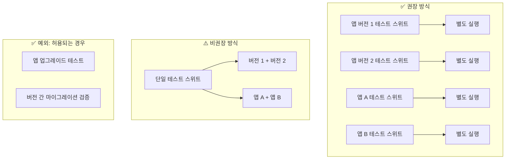
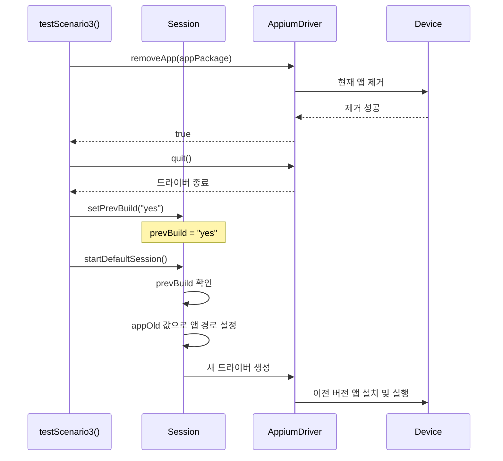
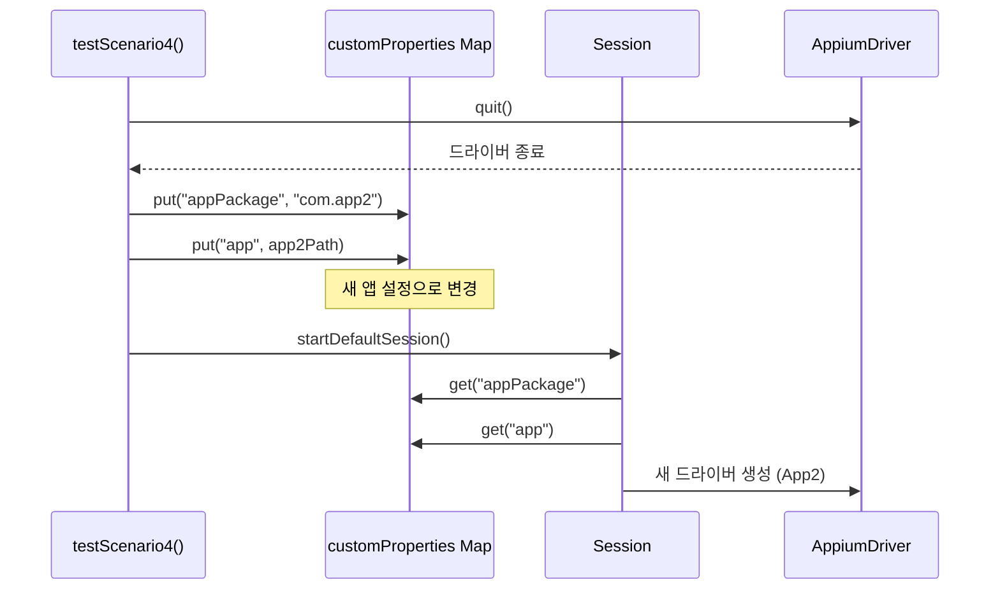
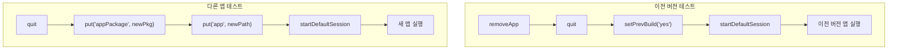

# Chapter 14: Testing Multiple Apps and Versions in Same Test Suite (동일 테스트 스위트에서 여러 앱 및 버전 테스트)

## 📌 핵심 요약

> **"동일 테스트 스위트에서 다른 앱이나 버전을 테스트하려면 Session의 prevBuild 설정이나 customProperties 맵의 appPackage/app 값을 동적으로 변경한 후 드라이버를 재생성한다. 단, 앱 업그레이드 테스트 같은 특수한 경우가 아니면 별도 실행을 권장한다."**

이 챕터에서는 동일 테스트 스위트 내에서 여러 앱 버전 또는 여러 앱을 테스트하는 방법을 학습한다.

---

## 🎯 학습 목표

이 챕터를 완료하면 다음을 할 수 있다:

- [ ] 동일 스위트에서 다중 앱/버전 테스트의 권장 사항 이해
- [ ] prevBuild 설정으로 이전 버전 앱 실행
- [ ] customProperties 맵 동적 변경으로 다른 앱 실행
- [ ] removeApp()으로 기존 앱 제거 후 드라이버 재생성
- [ ] 앱 업그레이드 시나리오 테스트 구현

---

## 📖 본문 정리

### 14.1 Best Practice: 권장 사항



#### 비권장 이유

| 문제 | 설명 |
|------|------|
| **로케이터 변경** | 다른 앱/버전에서 로케이터가 다를 수 있음 |
| **리포트 복잡성** | 여러 앱/버전 결과가 혼재되어 분석 어려움 |
| **유지보수 부담** | 조건부 로직 증가로 코드 복잡도 상승 |
| **디버깅 어려움** | 실패 원인 파악이 복잡해짐 |

#### 허용되는 사용 사례

- **앱 업그레이드 테스트**: 구버전 → 신버전 전환 검증
- **데이터 마이그레이션**: 버전 간 데이터 호환성 검증
- **기능 비교 테스트**: 동일 기능의 버전별 동작 비교

---

### 14.2 동일 앱의 여러 버전 테스트

#### 아키텍처



#### uitest.properties 설정

```properties
# 현재 버전
app=/Users/{userId}/Downloads/myapp_v2.0.apk
appPackage=com.example.myapp

# 이전 버전
appOld=/Users/{userId}/Downloads/myapp_v1.5.apk
```

#### Session 클래스 (Chapter 5 복습)

```java
public class Session {
    private String prevBuild = "no";  // 기본값: 현재 버전

    // Getter/Setter
    public String getPrevBuild() { return prevBuild; }
    public void setPrevBuild(String prevBuild) { this.prevBuild = prevBuild; }

    // 드라이버 생성 시 prevBuild 체크
    public void createAndroidDriver() {
        String appPath;
        if ("yes".equals(prevBuild)) {
            appPath = customProperties.get("appOld");  // 이전 버전
        } else {
            appPath = customProperties.get("app");     // 현재 버전
        }
        // Desired Capabilities 설정...
    }
}
```

#### testScenario3 구현 (이전 버전 테스트)

```java
@Severity(SeverityLevel.CRITICAL)
@Issue("xxxx")
@DisplayName("xxxx")
@Description("xxxx: Verify that the App Name is displayed")
@Test
@Order(3)
@Regression
public void testScenario3() {
    String tcName = new Object() {}.getClass().getEnclosingMethod().getName();
    log("Test Name" + tcName);

    // 1. 현재 앱 제거 및 드라이버 재생성
    if (session.getAppiumDriver().removeApp(getCustomProperties().get("appPackage"))) {
        try {
            session.getAppiumDriver().quit();           // 현재 드라이버 종료
            session.setPrevBuild("yes");                // 이전 버전 플래그 설정
            session = startDefaultSession();            // 새 세션 시작 (이전 버전 앱)
        } catch (Exception e) {
            e.printStackTrace();
        }
    }

    // 2. 테스트 수행 (try-finally 패턴)
    try {
        SoftAssertions.assertSoftly(
            softAssertions -> {
                softAssertions.assertThat(aboutAppScreen.isAppNameDisplayed())
                    .as("The App Name is displayed")
                    .isTrue();
            }
        );
    } finally {
        testStatus = aboutAppScreen.isAppNameDisplayed() ? "Passed" : "Failed";
        updateTCPassCount();
        try {
            aboutAppScreen.takeScreenShot(
                "test-result/screenshots/" + tcName + "--" + testStatus + ".png"
            );
        } catch (Exception e) {
            e.printStackTrace();
        }
        imageList.add("test-output/ScreenShots/" + tcName + "--" + testStatus + ".png");
    }
}
```

---

### 14.3 여러 앱 테스트

#### 아키텍처



#### uitest.properties 설정

```properties
# 기본 앱
app=/Users/{userId}/Downloads/app1.apk
appPackage=com.example.app1

# 두 번째 앱
app2=/Users/{userId}/Downloads/app2.apk
# app2Package=com.example.app2  (코드에서 직접 지정)
```

#### testScenario4 구현 (다른 앱 테스트)

```java
@Severity(SeverityLevel.CRITICAL)
@Issue("xxxx")
@DisplayName("xxxx")
@Description("xxxx: Verify that the App Version is displayed")
@Test
@Order(4)
@SIT
public void testScenario4() {
    String tcName = new Object() {}.getClass().getEnclosingMethod().getName();
    log("Test Name" + tcName);

    // 1. 두 번째 앱 경로 가져오기
    String app = getCustomProperties().get("app2");

    // 2. 현재 드라이버 종료
    session.getAppiumDriver().quit();

    // 3. customProperties 맵 동적 변경
    getCustomProperties().put("appPackage", "xxxx");  // 새 앱 패키지명
    getCustomProperties().put("app", app);             // 새 앱 경로

    // 4. 새 세션 시작
    try {
        session = startDefaultSession();
    } catch (Exception e) {
        e.printStackTrace();
    }

    // 5. 테스트 수행 (try-finally 패턴)
    try {
        SoftAssertions.assertSoftly(
            softAssertions -> {
                softAssertions.assertThat(aboutAppScreen.isAppVersionDisplayed("xxxx"))
                    .as("The App Version is displayed")
                    .isTrue();
            }
        );
    } finally {
        testStatus = aboutAppScreen.isAppVersionDisplayed("xxxx") ? "Passed" : "Failed";
        updateTCPassCount();
        try {
            aboutAppScreen.takeScreenShot(
                "test-result/screenshots/" + tcName + "--" + testStatus + ".png"
            );
        } catch (Exception e) {
            e.printStackTrace();
        }
        imageList.add("test-output/ScreenShots/" + tcName + "--" + testStatus + ".png");
    }
}
```

---

### 14.4 다중 버전/앱 테스트 비교

| 시나리오 | 변경 항목 | 주요 메서드 |
|----------|-----------|-------------|
| **이전 버전 테스트** | `prevBuild = "yes"` | `removeApp()`, `setPrevBuild()`, `startDefaultSession()` |
| **다른 앱 테스트** | `appPackage`, `app` | `quit()`, `put()`, `startDefaultSession()` |

---

### 14.5 실행 흐름 비교



---

## 💡 실무 적용 포인트

### 앱 업그레이드 테스트 시나리오

```java
/**
 * 앱 업그레이드 테스트 시나리오 예시
 * 1. 이전 버전 설치 → 데이터 생성
 * 2. 현재 버전으로 업그레이드
 * 3. 데이터 마이그레이션 검증
 */
@Test
@Order(1)
public void testAppUpgrade() {
    // Phase 1: 이전 버전 설치 및 데이터 생성
    session.setPrevBuild("yes");
    session = startDefaultSession();
    // ... 테스트 데이터 생성 ...

    // Phase 2: 현재 버전으로 업그레이드
    session.getAppiumDriver().quit();
    session.setPrevBuild("no");
    session = startDefaultSession();

    // Phase 3: 마이그레이션 검증
    assertThat(dataScreen.isDataMigrated()).isTrue();
}
```

### Properties 설정 체크리스트

```properties
# uitest.properties
# ===== 현재 버전 =====
app=/path/to/current_version.apk
appPackage=com.example.myapp
appActivity=com.example.myapp.MainActivity

# ===== 이전 버전 =====
appOld=/path/to/previous_version.apk

# ===== 추가 앱 =====
app2=/path/to/another_app.apk
# app2Package 및 app2Activity는 코드에서 동적 설정
```

### 드라이버 전환 패턴

```
□ 이전 버전으로 전환
  ├── removeApp(currentPackage)  ← 현재 앱 제거
  ├── quit()                      ← 드라이버 종료
  ├── setPrevBuild("yes")         ← 플래그 설정
  └── startDefaultSession()       ← 이전 버전으로 재시작

□ 다른 앱으로 전환
  ├── quit()                      ← 드라이버 종료
  ├── put("appPackage", newPkg)   ← 맵 업데이트
  ├── put("app", newPath)         ← 맵 업데이트
  └── startDefaultSession()       ← 새 앱으로 시작
```

### 주의사항

| 항목 | 권장 사항 |
|------|-----------|
| **로케이터 관리** | 앱/버전별 로케이터 분리 (별도 Page Object 또는 조건부 로직) |
| **리포트 분리** | 가능하면 앱/버전별 별도 리포트 생성 |
| **예외 처리** | 앱 전환 실패 시 적절한 예외 처리 및 복구 로직 |
| **테스트 순서** | `@Order` 어노테이션으로 실행 순서 명시 |
| **세션 정리** | `@AfterAll`에서 모든 세션 정리 확인 |

---

## ✅ 핵심 개념 체크리스트

- [ ] 동일 스위트에서 다중 앱/버전 테스트는 특수 케이스에만 권장
- [ ] `prevBuild` 플래그로 이전 버전 앱 전환
- [ ] `removeApp()`으로 현재 앱 제거 후 이전 버전 설치
- [ ] `customProperties` 맵 동적 변경으로 다른 앱 전환
- [ ] `quit()` → 설정 변경 → `startDefaultSession()` 패턴
- [ ] 앱 업그레이드 시나리오가 대표적인 사용 사례
- [ ] 로케이터 및 리포트 관리에 주의 필요

---

## 🔗 참고 자료

- [Appium removeApp](https://appium.io/docs/en/commands/device/app/remove-app/)
- [Appium Session Management](https://appium.io/docs/en/commands/session/)
- [Mobile App Upgrade Testing Best Practices](https://www.browserstack.com/guide/mobile-app-testing)

---

## 📚 다음 챕터 미리보기

- **Chapter 15**: 테스트 스위트에서 스크립트 또는 배치 파일 실행

