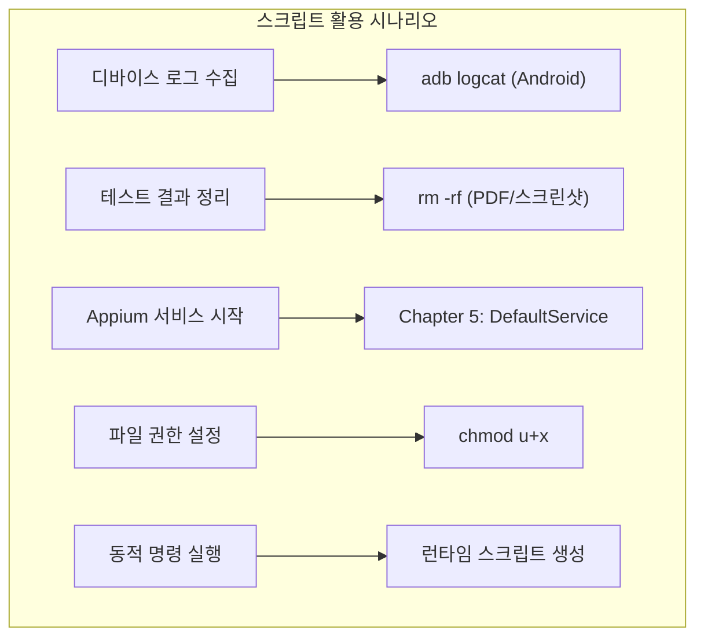
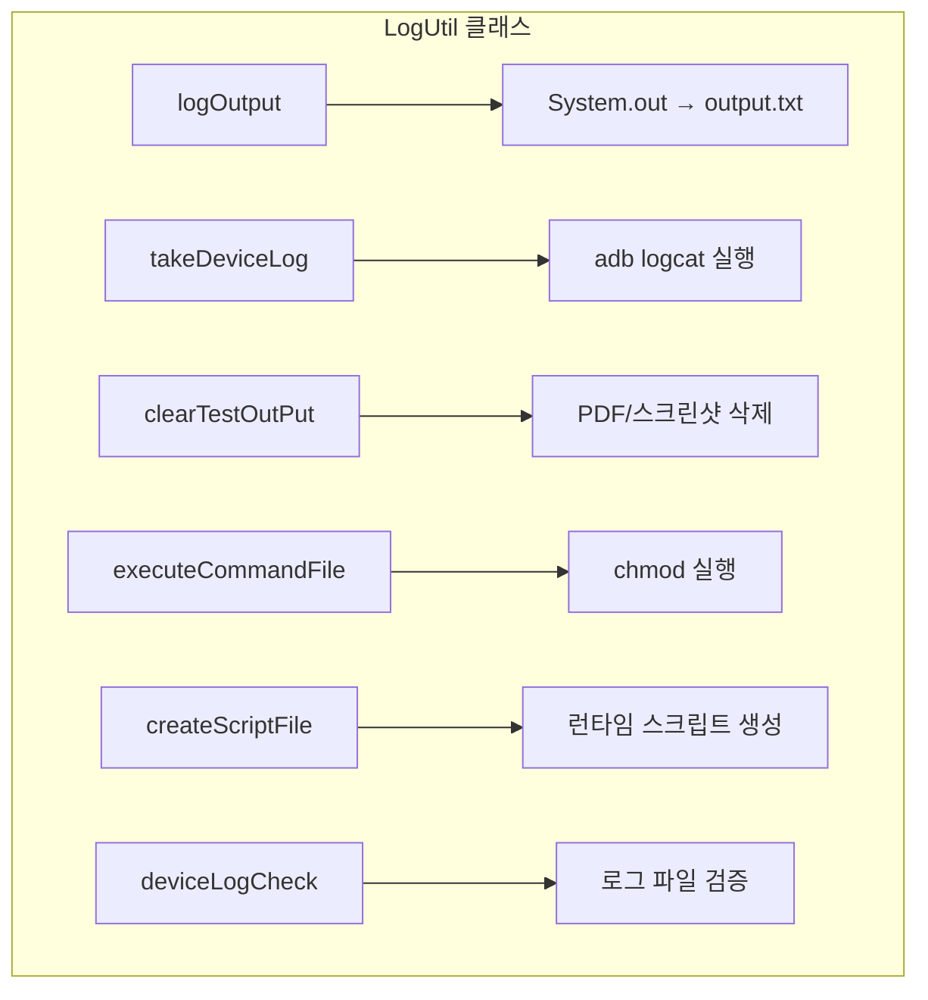
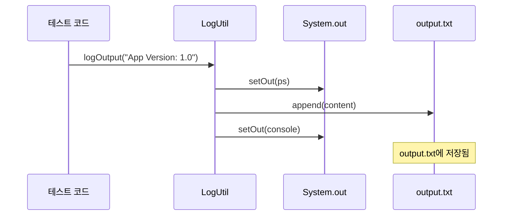
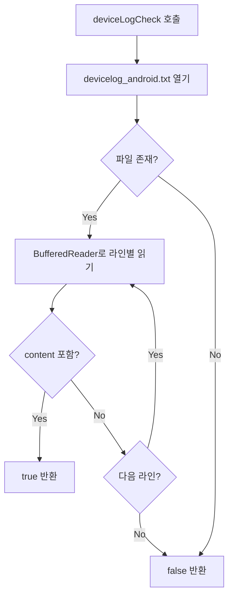
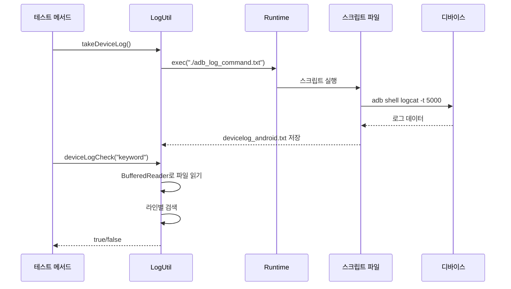

# Chapter 15: Running Scripts or Batch Files from Test Suite (테스트 스위트에서 스크립트/배치 파일 실행)

## 📌 핵심 요약

> **"Runtime.getRuntime().exec()로 외부 스크립트를 실행하고, BufferedReader로 로그 파일을 파싱하여 검증한다. LogUtil 클래스를 통해 디바이스 로그 수집, 테스트 결과 정리, 동적 스크립트 생성 기능을 제공한다."**

이 챕터에서는 테스트 스위트 내에서 스크립트 또는 배치 파일을 실행하는 방법과 디바이스 로그 검증 구현을 학습한다.

---

## 🎯 학습 목표

이 챕터를 완료하면 다음을 할 수 있다:

- [ ] Runtime.exec()로 외부 스크립트 실행
- [ ] adb 명령어로 Android 디바이스 로그 수집
- [ ] LogUtil 클래스로 로그 관리 유틸리티 구현
- [ ] BufferedReader로 로그 파일 파싱 및 검증
- [ ] 런타임에 스크립트 파일 동적 생성
- [ ] 디바이스 로그 검증을 Assertion에 통합

---

## 📖 본문 정리

### 15.1 스크립트 실행이 필요한 시나리오



| 시나리오 | 설명 | 스크립트 |
|----------|------|----------|
| **디바이스 로그** | Android: adb logcat, iOS: log.txt | `adb_log_command.txt` |
| **테스트 정리** | PDF, 스크린샷 삭제 | `clear_testresult_command.txt` |
| **권한 설정** | 스크립트 실행 권한 부여 | `make_executable_command.txt` |

---

### 15.2 스크립트 파일 생성

#### adb_log_command.txt (Android 로그 수집)

```bash
#! /bin/bash
cd ~/Downloads/testautomation/appautomation
rm devicelog_android.txt
cd ~
./adb shell logcat -t 5000 > Downloads/testautomation/appautomation/devicelog_android.txt
```

**동작 설명**:
1. 프로젝트 디렉토리로 이동
2. 기존 로그 파일 삭제
3. 홈 디렉토리로 이동
4. adb logcat으로 최근 5000줄 로그 저장

#### clear_testresult_command.txt (테스트 결과 정리)

```bash
#! /bin/bash
cd ~/Downloads/testautomation/appautomation/test-result/pdfreport
rm -rf *.pdf
cd ~/Downloads/testautomation/appautomation/test-result/screenshots
rm -rf *.png
```

**⚠️ 주의**: 경로를 정확히 지정하지 않으면 잘못된 파일이 삭제될 수 있음

#### make_executable_command.txt (실행 권한 부여)

```bash
#! /bin/bash
cd ~/Downloads/testautomation/appautomation
chmod u+x xxxx.txt
```

**용도**: `createScriptFile()` 메서드로 생성된 스크립트에 실행 권한 부여

---

### 15.3 LogUtil 클래스 구현

#### 클래스 구조



#### LogUtil.java 전체 코드

```java
package com.taf.testautomation.utilities.logutil;

import lombok.extern.slf4j.Slf4j;
import java.io.*;
import static com.taf.testautomation.utilities.excelutil.ExcelUtil.getCustomProperties;

@Slf4j
public class LogUtil {

    private static PrintStream ps;
    private static FileOutputStream fos = null;

    static {
        try {
            ps = new PrintStream(new File("./output.txt"));
        } catch (FileNotFoundException e) {
            e.printStackTrace();
        }
    }

    public LogUtil() {}

    /**
     * System.out 출력을 output.txt 파일로 리다이렉트
     */
    public static void logOutput(String content) {
        PrintStream console = System.out;
        try {
            System.setOut(ps);
            System.out.append(content);
        } catch (Exception e) {
            log.info(e.getMessage());
        }
        System.setOut(console);
    }

    /**
     * Android 디바이스 로그 수집
     */
    public static void takeDeviceLog() {
        try {
            Runtime.getRuntime().exec("./adb_log_command.txt");
        } catch (IOException e) {
            e.printStackTrace();
        }
    }

    /**
     * 테스트 결과 파일 정리 (PDF/스크린샷)
     */
    public static void clearTestOutPut() {
        try {
            Runtime.getRuntime().exec("./clear_testresult_command.txt");
        } catch (IOException e) {
            e.printStackTrace();
        }
    }

    /**
     * 스크립트 파일에 실행 권한 부여
     */
    public static void executeCommandFile() {
        try {
            Runtime.getRuntime().exec("./make_executable_command.txt");
        } catch (IOException e) {
            e.printStackTrace();
        }
    }

    /**
     * 런타임에 스크립트 파일 동적 생성
     */
    public static void createScriptFile(String command) {
        try {
            String commandFilePath = getCustomProperties().get("reportPrefix") + "xxxx.txt";
            File commandFile = new File(commandFilePath);
            BufferedWriter writer = new BufferedWriter(new FileWriter(commandFile));
            String temp = "";

            writer.write("#! /bin/bash");
            writer.newLine();

            switch (command) {
                case "command1":
                    temp = "xxxx";
                    log.info("the command is" + temp);
                    break;
                case "command2":
                    temp = "yyyy";
                    log.info("the command is" + temp);
                    break;
                default:
                    temp = "zzzz";
                    log.info("the command is" + temp);
                    break;
            }

            writer.write(temp);
            writer.newLine();
            String lastLine = "xxxx";
            writer.write(lastLine);
            writer.flush();
            writer.close();
        } catch (IOException e) {
            e.printStackTrace();
        }
    }

    /**
     * 디바이스 로그에서 특정 문자열 검색
     * @return 문자열이 발견되면 true, 아니면 false
     */
    public static boolean deviceLogCheck(String content) {
        if (content.contains("xxxx")) {
            content = "xxxx";
        } else {
            content = "xxxx";
        }

        try {
            String filePath = getCustomProperties().get("reportPrefix") + "devicelog_android.txt";
            BufferedReader br = new BufferedReader(new FileReader(filePath));
            String strLine = null;

            while ((strLine = br.readLine()) != null) {
                if (strLine.contains(content)) {
                    return true;
                }
            }
            br.close();
        } catch (Exception e1) {
            log.info(e1.getMessage());
        }
        return false;
    }
}
```

---

### 15.4 메서드 상세 설명

#### logOutput() - 콘솔 출력 리다이렉트



**Page Object에서 활용 예시**:

```java
@Step("Verifying the App Version is Displayed")
public boolean isAppVersionDisplayed(String text) {
    IntStream.range(0, 2).forEach(i -> scrollUpTouchAction());
    waitInSeconds(MIN_WAIT);

    // 콘솔 출력을 파일로 저장
    LogUtil.logOutput("App Version label on Screen is: " + appVersion.getText() + "\n");

    return doesElementExist(appVersion, SMALL_WAIT)
        && appVersion.getText().contains(text);
}
```

#### deviceLogCheck() - 로그 검증



---

### 15.5 테스트 스위트에 통합

#### testScenario2 업데이트 (디바이스 로그 검증 추가)

```java
@Severity(SeverityLevel.CRITICAL)
@Issue("xxxx")
@DisplayName("xxxx")
@Description("xxxx: Verify that the App Logo is displayed")
@Test
@Order(2)
@Smoke
public void testScenario2() {
    String tcName = new Object() {}.getClass().getEnclosingMethod().getName();
    log("Test Name" + tcName);

    // 디바이스 로그 수집
    LogUtil.takeDeviceLog();

    try {
        // Assertion 1: UI 검증
        SoftAssertions.assertSoftly(
            softAssertions -> {
                softAssertions.assertThat(aboutAppScreen.isAppLogoDisplayed())
                    .as("The App Logo is displayed")
                    .isTrue();
            }
        );

        // Assertion 2: 디바이스 로그 검증
        SoftAssertions.assertSoftly(
            softAssertions -> {
                softAssertions.assertThat(LogUtil.deviceLogCheck("xxxx"))
                    .as("Device log shows correct data")
                    .isTrue();
            }
        );
    } finally {
        testStatus = aboutAppScreen.isAppLogoDisplayed() ? "Passed" : "Failed";
        updateTCPassCount();
        try {
            aboutAppScreen.takeScreenShot(
                "test-result/screenshots/" + tcName + "--" + testStatus + ".png"
            );
        } catch (Exception e) {
            e.printStackTrace();
        }
        imageList.add("test-output/ScreenShots/" + tcName + "--" + testStatus + ".png");
    }
}
```

---

### 15.6 스크립트 실행 패턴



---

## 💡 실무 적용 포인트

### 디렉토리 구조

```
project-root/
├── adb_log_command.txt          # Android 로그 수집
├── clear_testresult_command.txt # 테스트 결과 정리
├── make_executable_command.txt  # 권한 설정
├── output.txt                   # logOutput() 결과
├── devicelog_android.txt        # adb logcat 결과
│
└── src/main/java/com/taf/testautomation/
    └── utilities/
        └── logutil/
            └── LogUtil.java
```

### LogUtil 메서드 요약

| 메서드 | 용도 | 반환값 |
|--------|------|--------|
| `logOutput(String)` | System.out → output.txt | void |
| `takeDeviceLog()` | adb logcat 실행 | void |
| `clearTestOutPut()` | PDF/스크린샷 삭제 | void |
| `executeCommandFile()` | chmod 실행 | void |
| `createScriptFile(String)` | 동적 스크립트 생성 | void |
| `deviceLogCheck(String)` | 로그 검증 | boolean |

### 스크립트 실행 체크리스트

```
□ 스크립트 파일 생성
  ├── Shebang 라인 포함 (#! /bin/bash)
  ├── 경로 정확히 지정
  └── 필요한 명령어 추가

□ 실행 권한 설정
  ├── chmod u+x script.txt
  └── 또는 make_executable_command.txt 사용

□ 테스트 코드 통합
  ├── LogUtil.takeDeviceLog() 호출
  ├── Assertion에 deviceLogCheck() 사용
  └── try-finally 패턴 유지

□ 경로 주의사항
  ├── 프로젝트 경로 확인
  ├── 상대 경로 vs 절대 경로
  └── clear_testresult 경로 특히 주의
```

### 핵심 API 요약

| API | 출처 | 역할 |
|-----|------|------|
| `Runtime.getRuntime().exec()` | java.lang | 외부 프로세스 실행 |
| `PrintStream` | java.io | 출력 스트림 제어 |
| `System.setOut()` | java.lang | 표준 출력 리다이렉트 |
| `BufferedReader.readLine()` | java.io | 파일 라인별 읽기 |
| `BufferedWriter` | java.io | 파일 쓰기 |

---

## ✅ 핵심 개념 체크리스트

- [ ] Runtime.getRuntime().exec()로 외부 스크립트 실행
- [ ] adb logcat으로 Android 디바이스 로그 수집
- [ ] BufferedReader로 로그 파일 라인별 파싱
- [ ] logOutput()으로 콘솔 출력을 파일로 리다이렉트
- [ ] createScriptFile()로 런타임 스크립트 동적 생성
- [ ] deviceLogCheck()을 Assertion에 통합
- [ ] 스크립트 경로 및 권한 설정 주의

---

## 🔗 참고 자료

- [Java Runtime.exec()](https://docs.oracle.com/javase/8/docs/api/java/lang/Runtime.html#exec-java.lang.String-)
- [Android adb logcat](https://developer.android.com/studio/command-line/logcat)
- [Bash Scripting Guide](https://www.gnu.org/software/bash/manual/)

---

## 📚 다음 챕터 미리보기

- **Chapter 16**: Spring WebClient를 사용한 API 테스팅

