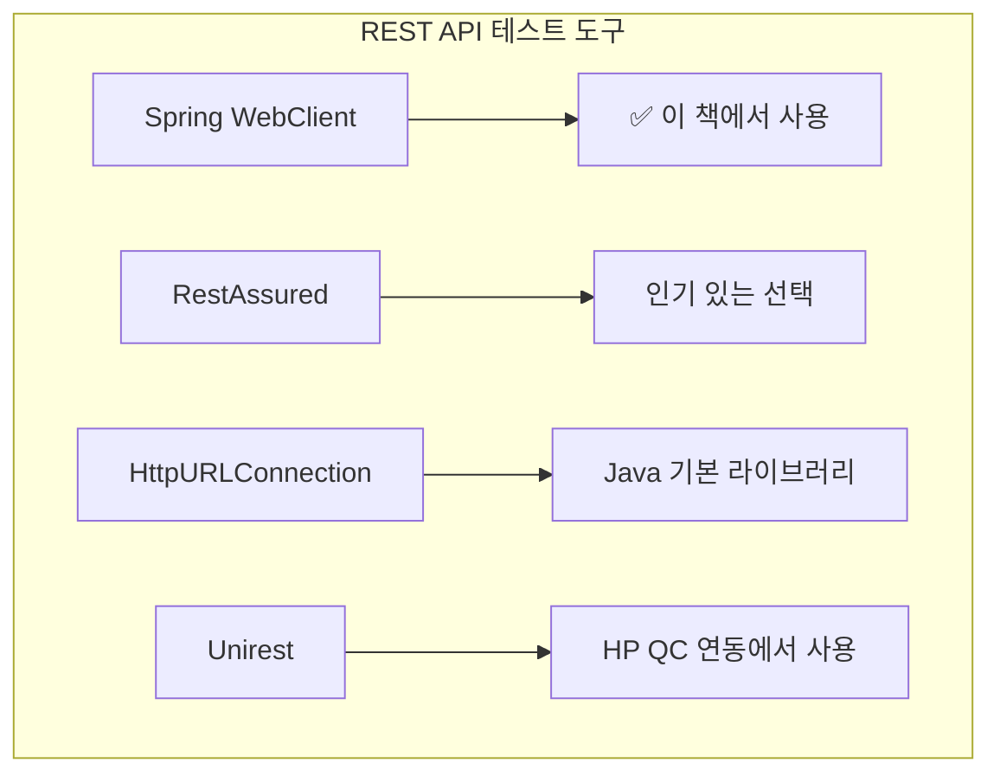
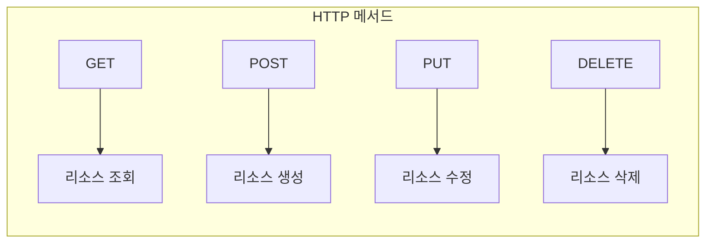
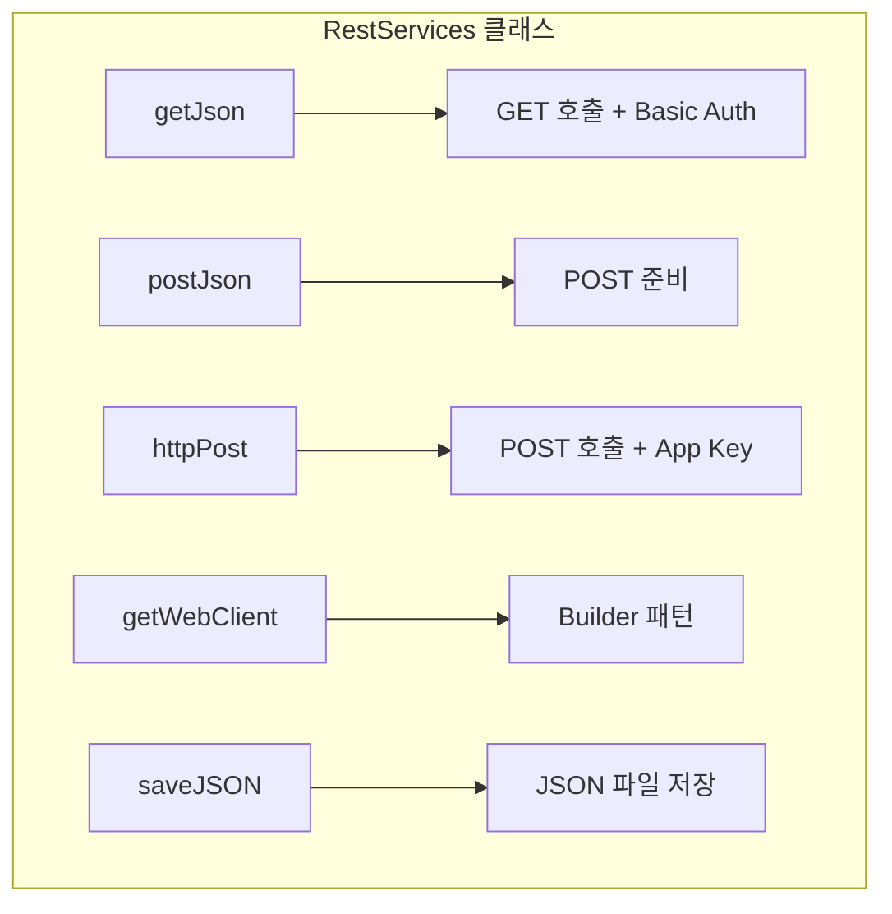
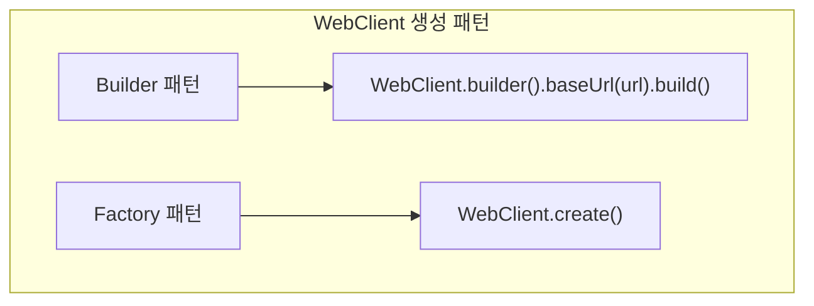
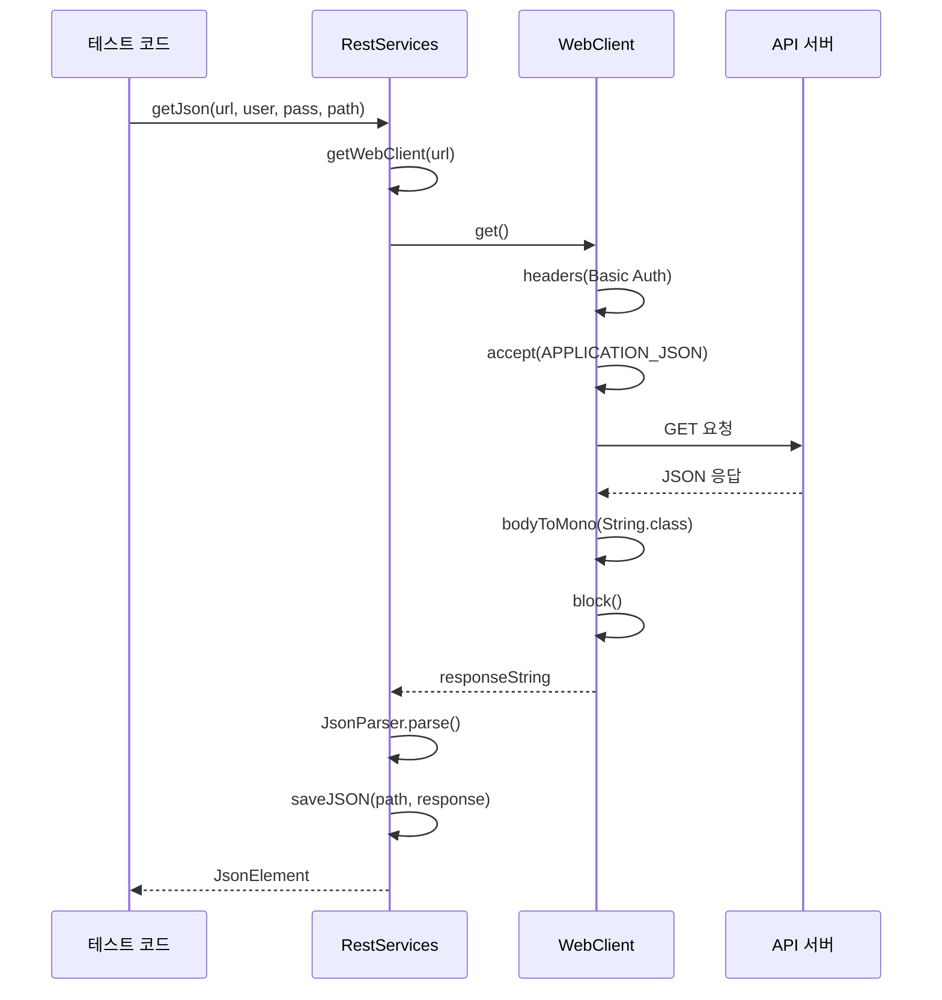
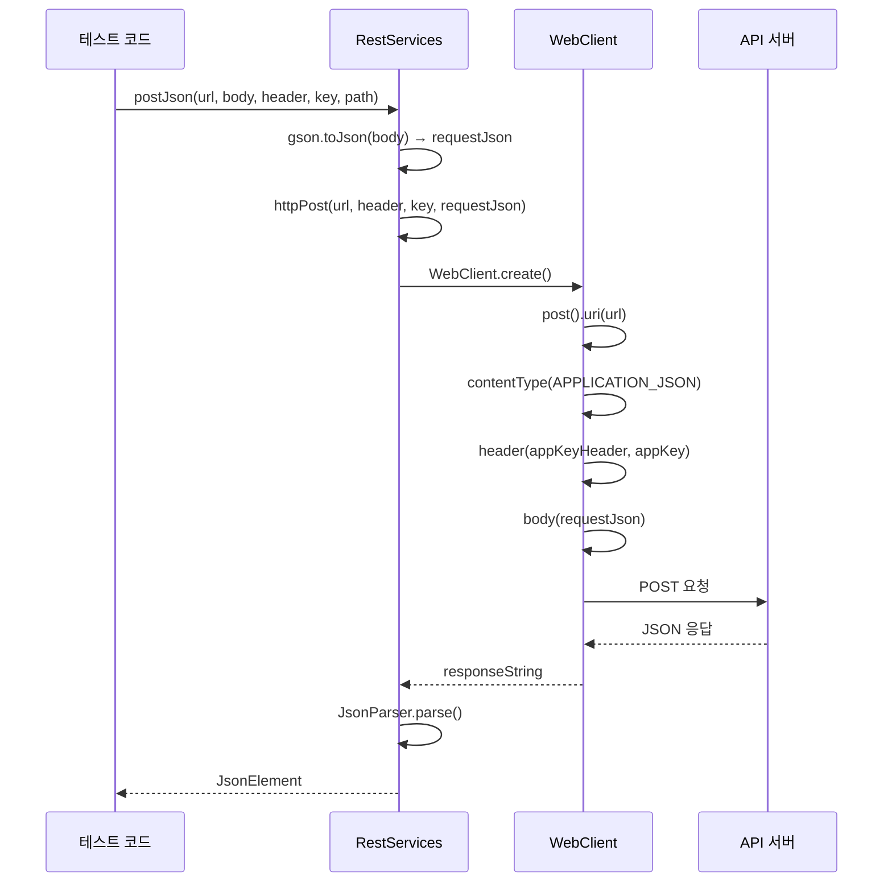
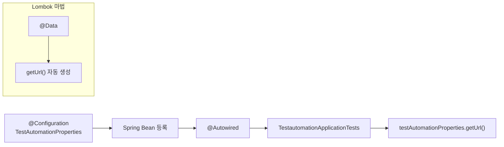
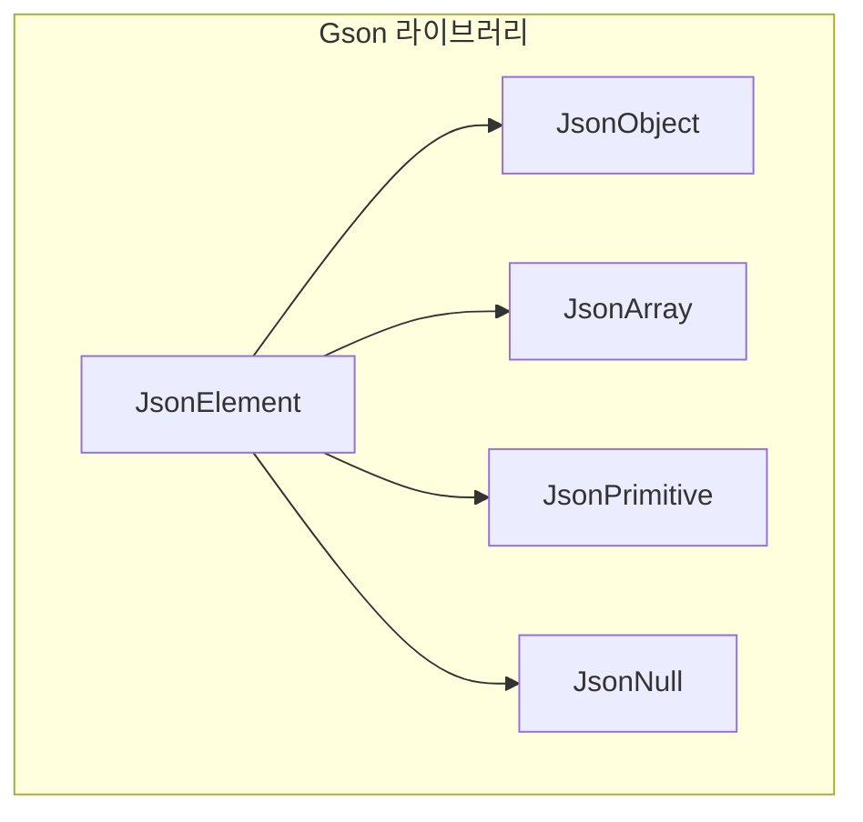

# Chapter 16: API Testing (API 테스팅)

## 📌 핵심 요약

> **"Spring WebClient를 사용하여 REST API 테스트를 구현한다. GET/POST 호출에 대해 Builder 패턴으로 WebClient를 구성하고, Gson의 JsonParser로 응답을 파싱하며, @Autowired로 TestAutomationProperties를 주입하여 설정값을 활용한다."**

이 챕터에서는 Spring WebClient를 활용한 REST API 테스트 설계 방법을 학습한다.

---

## 🎯 학습 목표

이 챕터를 완료하면 다음을 할 수 있다:

- [ ] WebClient로 GET/POST REST 호출 구현
- [ ] Builder 패턴과 Factory 패턴으로 WebClient 생성
- [ ] Gson JsonParser로 응답 파싱
- [ ] @Autowired로 Properties 의존성 주입
- [ ] API 응답 JSON 파일로 저장
- [ ] 인증 방식 (Basic Auth, App Key) 적용

---

## 📖 본문 정리

### 16.1 REST API 테스트 도구 비교



| 도구 | 특징 | 사용 시점 |
|------|------|-----------|
| **WebClient** | Spring 기반, Reactive, 비동기 지원 | Spring Boot 프로젝트 |
| **RestAssured** | BDD 스타일, Fluent API | 독립 API 테스트 |
| **HttpURLConnection** | Java 기본, 추가 의존성 없음 | 간단한 호출 |
| **Unirest** | 경량, 간편한 API | 빠른 통합 |

---

### 16.2 REST 메서드 개요



| 메서드 | 용도 | 멱등성 |
|--------|------|--------|
| **GET** | 서버에서 리소스 조회 | ✅ 멱등 |
| **POST** | 서버에 새 리소스 생성 | ❌ 비멱등 |
| **PUT** | 서버 리소스 업데이트 | ✅ 멱등 |
| **DELETE** | 서버 리소스 삭제 | ✅ 멱등 |

---

### 16.3 RestServices 클래스 구현

#### 클래스 구조



#### RestServices.java 전체 코드

```java
package com.taf.testautomation.services;

import com.google.gson.Gson;
import com.google.gson.GsonBuilder;
import com.google.gson.JsonElement;
import com.google.gson.JsonParser;
import org.springframework.http.MediaType;
import org.springframework.web.reactive.function.BodyInserters;
import org.springframework.web.reactive.function.client.WebClient;
import reactor.core.publisher.Mono;

import java.io.FileWriter;
import java.io.Writer;

public class RestServices {

    /**
     * GET 호출 - Basic Authentication
     */
    public static JsonElement getJson(String url, String userName, String password,
                                       String saveAsPath) throws Exception {
        WebClient webClient = getWebClient(url);

        // GET 요청 실행
        String responseString = webClient.get()
            .headers(header -> header.setBasicAuth(userName, password))
            .accept(MediaType.APPLICATION_JSON)
            .retrieve()
            .bodyToMono(String.class)
            .block();

        // 응답 파싱
        JsonParser jsonParser = new JsonParser();
        JsonElement response = jsonParser.parse(responseString);

        // JSON 파일 저장
        saveJSON(saveAsPath, response);

        return response;
    }

    /**
     * WebClient 생성 - Builder 패턴
     */
    public static WebClient getWebClient(String url) {
        return WebClient.builder()
            .baseUrl(url)
            .build();
    }

    /**
     * JSON 응답을 파일로 저장
     */
    public static void saveJSON(String path, JsonElement response) throws Exception {
        try (Writer writer = new FileWriter(path)) {
            Gson gson = new GsonBuilder()
                .setPrettyPrinting()
                .serializeNulls()
                .create();
            gson.toJson(response, writer);
        }
    }

    /**
     * POST 호출 준비 - JsonElement 변환
     */
    public static JsonElement postJson(String url, JsonElement body,
                                        String appKeyHeader, String appKey,
                                        String saveAsPath) {
        Gson gson = new Gson();
        String requestJson = gson.toJson(body);
        return httpPost(url, appKeyHeader, appKey, requestJson);
    }

    /**
     * POST 호출 - App Key Authentication
     */
    public static JsonElement httpPost(String url, String appKeyHeader,
                                        String appKey, String requestJson) {
        WebClient webClient = WebClient.create();

        String postString = webClient.post()
            .uri(url)
            .contentType(MediaType.APPLICATION_JSON)
            .header(appKeyHeader, appKey)
            .accept(MediaType.APPLICATION_JSON)
            .body(BodyInserters.fromPublisher(Mono.just(requestJson), String.class))
            .retrieve()
            .bodyToMono(String.class)
            .block();

        JsonParser jsonParser = new JsonParser();
        JsonElement response = jsonParser.parse(postString);

        return response;
    }
}
```

---

### 16.4 WebClient 생성 패턴



#### Builder 패턴 (getWebClient)

```java
// 기본 URL 설정 가능
public static WebClient getWebClient(String url) {
    return WebClient.builder()
        .baseUrl(url)          // 기본 URL 설정
        .build();
}
```

#### Factory 패턴 (create)

```java
// 단순 생성, URL은 호출 시 지정
WebClient webClient = WebClient.create();
webClient.post().uri(url)...
```

| 패턴 | 장점 | 사용 시점 |
|------|------|-----------|
| **Builder** | baseUrl 미리 설정, 설정 체이닝 | 동일 호스트 여러 호출 |
| **Factory** | 간편, 호출마다 다른 URL | 단일 호출 또는 다양한 호스트 |

---

### 16.5 GET 호출 상세



#### GET 호출 체인 분석

```java
webClient.get()                                    // HTTP GET 메서드
    .headers(header -> header.setBasicAuth(userName, password))  // Basic Auth 헤더
    .accept(MediaType.APPLICATION_JSON)            // Accept 헤더
    .retrieve()                                    // 응답 추출
    .bodyToMono(String.class)                      // Mono<String>으로 변환
    .block();                                      // 동기 블로킹 호출
```

---

### 16.6 POST 호출 상세



#### POST 호출 체인 분석

```java
webClient.post()                                   // HTTP POST 메서드
    .uri(url)                                      // 요청 URI
    .contentType(MediaType.APPLICATION_JSON)       // Content-Type 헤더
    .header(appKeyHeader, appKey)                  // 커스텀 헤더 (App Key)
    .accept(MediaType.APPLICATION_JSON)            // Accept 헤더
    .body(BodyInserters.fromPublisher(             // Request Body
        Mono.just(requestJson), String.class))
    .retrieve()
    .bodyToMono(String.class)
    .block();
```

---

### 16.7 인증 방식 비교

| 인증 방식 | 구현 | 사용 메서드 |
|-----------|------|-------------|
| **Basic Auth** | `header.setBasicAuth(user, pass)` | `getJson()` |
| **App Key** | `.header(appKeyHeader, appKey)` | `httpPost()` |

```java
// Basic Authentication
.headers(header -> header.setBasicAuth(userName, password))

// App Key Authentication
.header("X-API-KEY", appKey)
// 또는
.header("Authorization", "Bearer " + token)
```

---

### 16.8 TestautomationApplicationTests 업데이트

```java
package com.taf.testautomation;

import com.google.gson.JsonElement;
import com.taf.testautomation.services.RestServices;
import org.junit.jupiter.api.Test;
import org.springframework.beans.factory.annotation.Autowired;
import org.springframework.boot.test.context.SpringBootTest;

import static org.junit.jupiter.api.Assertions.assertNotNull;

@SpringBootTest
class TestautomationApplicationTests {

    @Autowired
    private TestAutomationProperties testAutomationProperties;

    @Test
    void contextLoads() {
    }

    @Test
    void testApiCall() throws Exception {
        // Properties에서 URL 가져오기
        String url = testAutomationProperties.getUrl();

        // GET 호출
        JsonElement response = RestServices.getJson(
            url,
            "username",
            "password",
            "./response.json"
        );

        // 검증
        assertNotNull(response);
        // TODO: JsonElement 내용 검증 추가
    }
}
```

#### Spring 의존성 주입 흐름



---

### 16.9 Gson 활용

#### JsonElement 클래스



#### JSON 저장 (Pretty Printing)

```java
public static void saveJSON(String path, JsonElement response) throws Exception {
    try (Writer writer = new FileWriter(path)) {
        Gson gson = new GsonBuilder()
            .setPrettyPrinting()    // 들여쓰기 적용
            .serializeNulls()       // null 값도 직렬화
            .create();
        gson.toJson(response, writer);
    }
}
```

#### 출력 예시

```json
{
  "id": 1,
  "name": "Test User",
  "email": "test@example.com",
  "address": null
}
```

---

## 💡 실무 적용 포인트

### 디렉토리 구조

```
src/main/java/com/taf/testautomation/
├── services/
│   └── RestServices.java        # REST API 호출
├── TestAutomationProperties.java  # URL 등 설정
└── TestautomationApplication.java

src/test/java/com/taf/testautomation/
└── TestautomationApplicationTests.java  # API 테스트
```

### application.properties (Chapter 4)

```properties
prop.url=https://jsonplaceholder.typicode.com/users
```

### RestServices 메서드 요약

| 메서드 | 용도 | 인증 방식 |
|--------|------|-----------|
| `getJson()` | GET 호출 | Basic Auth |
| `postJson()` | POST 준비 | - |
| `httpPost()` | POST 호출 | App Key |
| `getWebClient()` | WebClient 생성 | - |
| `saveJSON()` | JSON 파일 저장 | - |

### PUT/DELETE 구현 예시 (확장)

```java
// PUT 호출
public static JsonElement httpPut(String url, String appKeyHeader,
                                   String appKey, String requestJson) {
    WebClient webClient = WebClient.create();
    String putString = webClient.put()
        .uri(url)
        .contentType(MediaType.APPLICATION_JSON)
        .header(appKeyHeader, appKey)
        .body(BodyInserters.fromPublisher(Mono.just(requestJson), String.class))
        .retrieve()
        .bodyToMono(String.class)
        .block();

    return new JsonParser().parse(putString);
}

// DELETE 호출
public static void httpDelete(String url, String appKeyHeader, String appKey) {
    WebClient webClient = WebClient.create();
    webClient.delete()
        .uri(url)
        .header(appKeyHeader, appKey)
        .retrieve()
        .bodyToMono(Void.class)
        .block();
}
```

### 핵심 API 요약

| API | 출처 | 역할 |
|-----|------|------|
| `WebClient` | Spring WebFlux | HTTP 클라이언트 |
| `Mono` | Reactor | 비동기 단일 값 Publisher |
| `JsonElement` | Gson | JSON 루트 타입 |
| `JsonParser` | Gson | String → JsonElement 변환 |
| `GsonBuilder` | Gson | Gson 인스턴스 생성 |
| `@Autowired` | Spring | 의존성 자동 주입 |

---

## ✅ 핵심 개념 체크리스트

- [ ] WebClient로 GET/POST REST 호출 구현
- [ ] Builder 패턴 (`WebClient.builder()`) vs Factory 패턴 (`WebClient.create()`)
- [ ] `bodyToMono(String.class).block()` 동기 호출
- [ ] `JsonParser.parse()`로 String → JsonElement 변환
- [ ] `GsonBuilder.setPrettyPrinting()`으로 포맷팅
- [ ] Basic Auth: `header.setBasicAuth(user, pass)`
- [ ] App Key: `.header(headerName, keyValue)`
- [ ] `@Autowired`로 TestAutomationProperties 주입
- [ ] `@Data` (Lombok)로 getter 자동 생성

---

## 🔗 참고 자료

- [Spring WebClient](https://docs.spring.io/spring-framework/docs/current/reference/html/web-reactive.html#webflux-client)
- [Gson User Guide](https://github.com/google/gson/blob/master/UserGuide.md)
- [Project Reactor - Mono](https://projectreactor.io/docs/core/release/reference/#mono)

---

## 📚 다음 챕터 미리보기

- **Chapter 17**: 디바이스 관리 유틸리티 (Wi-Fi 토글, 날짜/시간/타임존 설정 등)

