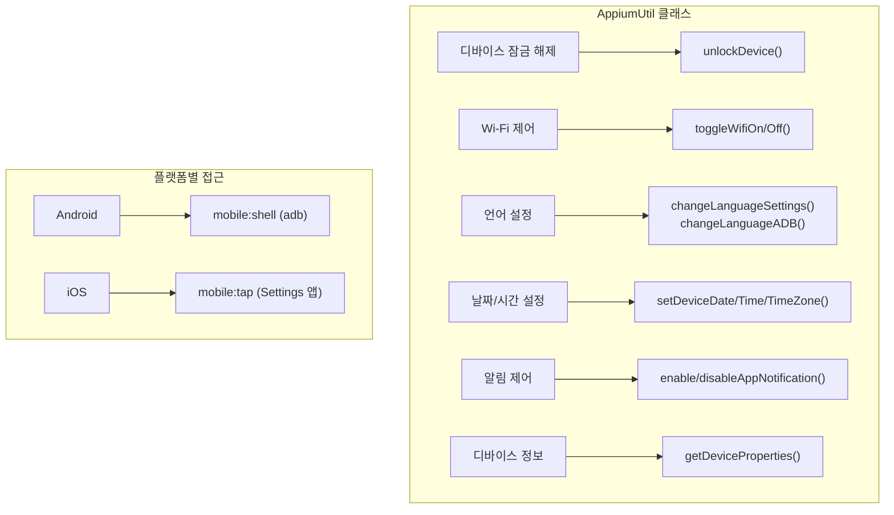
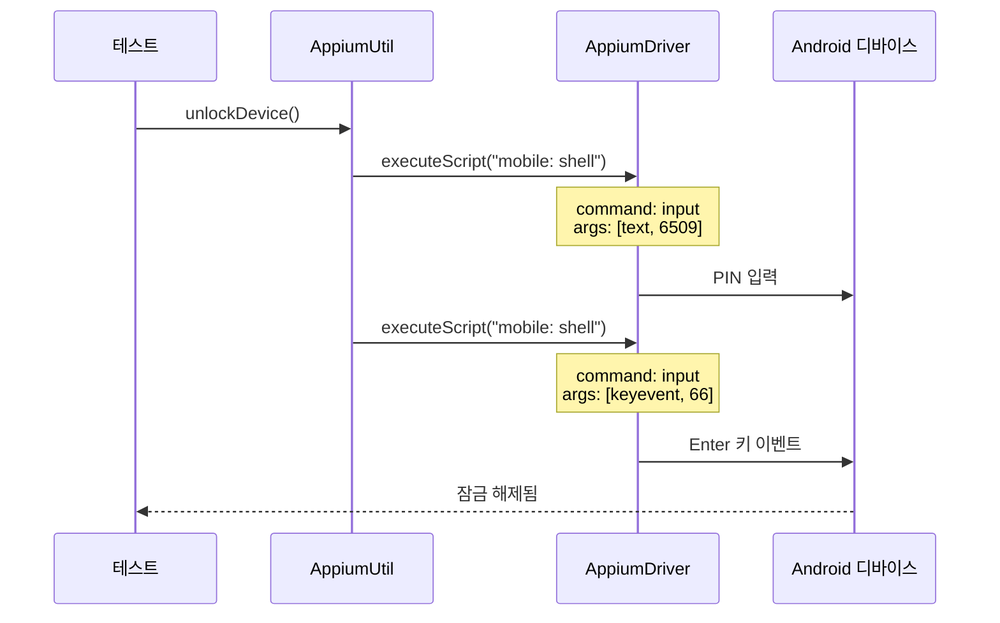

# Chapter 17: Advanced Topic 1 - Adding Device Management Functions (디바이스 관리 기능 추가)

## 📌 핵심 요약

> **"AppiumUtil 클래스에서 mobile:shell 명령어로 adb를 실행하고, mobile:tap으로 iOS Settings 앱을 자동화한다. 디바이스 잠금 해제, Wi-Fi 토글, 언어 변경, 날짜/시간/타임존 설정, 앱 알림 제어, 디바이스 속성 조회 기능을 구현한다."**

이 챕터에서는 디바이스 Settings 앱과 상호작용하여 다양한 디바이스 관리 기능을 구현하는 방법을 학습한다.

---

## 🎯 학습 목표

이 챕터를 완료하면 다음을 할 수 있다:

- [ ] mobile:shell로 adb 명령어 실행 (Android)
- [ ] mobile:tap으로 Settings 앱 자동화 (iOS)
- [ ] 디바이스 잠금 해제 구현
- [ ] Wi-Fi 토글 기능 구현
- [ ] 언어 설정 변경 (Appium + adb)
- [ ] 날짜/시간/타임존/시간 포맷 설정
- [ ] 앱 알림 활성화/비활성화
- [ ] 디바이스 속성 조회 (PDF 리포트용)

---

## 📖 본문 정리

### 17.1 AppiumUtil 클래스 개요



#### 파일 위치

```
src/main/java/com/taf/testautomation/
└── devicemanagement/
    └── AppiumUtil.java
```

---

### 17.2 핵심 명령어 패턴

#### Android: mobile:shell

```java
// adb 명령어 실행 패턴
List<String> args = Arrays.asList("command", "arg1", "arg2");
Map<String, Object> targetMap = ImmutableMap.of(
    "command", "am",      // am, pm, service, getprop 등
    "args", args
);
mobileDriver.executeScript("mobile: shell", targetMap);
```

#### iOS: mobile:tap

```java
// Settings 앱 UI 탭 패턴
MobileElement element = (MobileElement) mobileDriver.findElementByXPath(XPATH);
Map<String, Object> tapArgs = new HashMap<>();
tapArgs.put("element", element.getId());
tapArgs.put("x", 2);
tapArgs.put("y", 2);
mobileDriver.executeScript("mobile: tap", tapArgs);
```

---

### 17.3 디바이스 잠금 해제



```java
public void unlockDevice() {
    if (getCustomProperties().get("isAndroid").equals("true")) {
        // 1. PIN 입력 (예: 6509)
        List<String> enterPinArgs = Arrays.asList("text", "6509");
        targetMap = ImmutableMap.of(
            "command", "input",
            "args", enterPinArgs
        );
        mobileDriver.executeScript("mobile: shell", targetMap);

        // 2. Enter 키 이벤트 (keyevent 66)
        List<String> unlockPhoneArgs = Arrays.asList("keyevent", "66");
        targetMap = ImmutableMap.of(
            "command", "input",
            "args", unlockPhoneArgs
        );
        mobileDriver.executeScript("mobile: shell", targetMap);
    } else {
        log.info("iOS: 스와이프 잠금 해제는 좌표 하드코딩 필요 - 생략");
    }
}
```

**참고**: iOS는 스와이프 잠금 해제 자동화가 좌표 하드코딩 없이는 어려움

---

### 17.4 Wi-Fi 토글

#### Android (adb broadcast)

```java
public void toggleWifiOff() {
    if (getCustomProperties().get("isAndroid").equals("true")) {
        List<String> wifiOffArgs = Arrays.asList(
            "broadcast", "-a", "io.appium.settings.wifi",
            "--es", "setstatus", "disable"
        );
        targetMap = ImmutableMap.of("command", "am", "args", wifiOffArgs);
        mobileDriver.executeScript("mobile: shell", targetMap);
    } else {
        iosToggleWifi(getCustomProperties().get("iosBundleId"));
    }
}

public void toggleWifiOn() {
    if (getCustomProperties().get("isAndroid").equals("true")) {
        List<String> wifiOnArgs = Arrays.asList(
            "broadcast", "-a", "io.appium.settings.wifi",
            "--es", "setstatus", "enable"
        );
        targetMap = ImmutableMap.of("command", "am", "args", wifiOnArgs);
        mobileDriver.executeScript("mobile: shell", targetMap);
    } else {
        iosToggleWifi(getCustomProperties().get("iosBundleId"));
    }
}
```

#### iOS (Settings 앱 자동화)

```java
private void iosToggleWifi(String bundleId) {
    // 1. Settings 앱 열기
    mobileDriver.activateApp("com.apple.Preferences");

    // 2. Wi-Fi 아이콘 탭
    MobileElement wifiIcon = (MobileElement) mobileDriver
        .findElementByXPath(XPATH_WIFI_ICON_IOS);
    Map<String, Object> tapWifiArgs = new HashMap<>();
    tapWifiArgs.put("element", wifiIcon.getId());
    tapWifiArgs.put("x", 2);
    tapWifiArgs.put("y", 2);
    mobileDriver.executeScript("mobile: tap", tapWifiArgs);

    // 3. Wi-Fi 토글 스위치 탭
    MobileElement wifiToggle = (MobileElement) mobileDriver
        .findElementByXPath(XPATH_WIFI_TOGGLE_IOS);
    Map<String, Object> tapWifiToggleArgs = new HashMap<>();
    tapWifiToggleArgs.put("element", wifiToggle.getId());
    tapWifiToggleArgs.put("x", 0);
    tapWifiToggleArgs.put("y", 0);
    mobileDriver.executeScript("mobile: tap", tapWifiToggleArgs);

    // 4. Settings로 돌아가기
    MobileElement settingsLink = (MobileElement) mobileDriver
        .findElementByXPath(XPATH_SETTINGS_ICON_IOS);
    // ... 탭 후 테스트 앱으로 복귀
    mobileDriver.activateApp(bundleId);
}
```

---

### 17.5 언어 설정

#### 방법 1: Appium 기반 (changeLanguageSettings)

```java
public void changeLanguageSettings(String deviceLanguage) {
    // 1. 언어 설정 화면 열기
    List<String> languageArgs = Arrays.asList(
        "start", "-a", "android.settings.LOCALE_SETTINGS"
    );
    targetMap = ImmutableMap.of("command", "am", "args", languageArgs);
    mobileDriver.executeScript("mobile: shell", targetMap);

    // 2. 현재 언어와 원하는 언어 요소 찾기
    MobileElement currentLanguage = (MobileElement) mobileDriver
        .findElementByXPath(XPATH_LANGUAGE_CURRENT);
    MobileElement desiredLanguage = getDesiredLangElement(deviceLanguage);

    // 3. 드래그로 언어 순서 변경 (맨 위로)
    Dimension size = mobileDriver.manage().window().getSize();
    int width = (int) (size.getWidth() * 0.95);
    int start = desiredLanguage.getLocation().getY() + desiredLanguage.getSize().getHeight() / 2;
    int end = (int) (currentLanguage.getLocation().getY() + currentLanguage.getSize().getHeight() * 0.25);

    new TouchAction(mobileDriver)
        .press(PointOption.point(width, start))
        .waitAction(waitOptions(ofMillis(1000)))
        .moveTo(PointOption.point(width, end))
        .release()
        .perform();

    // 4. 앱으로 복귀
    mobileDriver.activateApp(getCustomProperties().get("appPackage"));
}
```

**언어 파라미터 형식**: `de-DE`, `en-US`, `es-ES`

#### 방법 2: adb 기반 (changeLanguageADB)

```java
public void changeLanguageADB(String language, String country) {
    // 1. 언어 변경 앱에 권한 부여
    List<String> permissionArgs = Arrays.asList(
        "grant", "net.sanapeli.adbchangelanguage",
        "android.permission.CHANGE_CONFIGURATION"
    );
    targetMap = ImmutableMap.of("command", "pm", "args", permissionArgs);
    mobileDriver.executeScript("mobile: shell", targetMap);

    // 2. 언어 변경 실행
    List<String> changeLangArgs = Arrays.asList(
        "start", "-n", "net.sanapeli.adbchangelanguage/.AdbChangeLanguage",
        "-e", "language", language,
        "-e", "country", country
    );
    targetMap = ImmutableMap.of("command", "am", "args", changeLangArgs);
    mobileDriver.executeScript("mobile: shell", targetMap);
}
```

**필수 조건**: `net.sanapeli.adbchangelanguage` 앱 사전 설치

| 파라미터 | 예시 | 설명 |
|----------|------|------|
| `language` | `de` | 2자리 언어 코드 |
| `country` | `DE` | 2자리 국가 코드 (대문자) |

---

### 17.6 날짜/시간/타임존 설정

#### Android 설정 UI

```
Settings > System > Date & time
├── Use network-provided time (토글)
├── Date (날짜 선택)
├── Time (시간 선택)
├── Use locale default (토글)
└── Use 24-hour format (토글)
```

#### setDeviceDate (날짜 설정)

```java
public void setDeviceDate(String date) {  // 형식: "2023-06-15"
    mobileDriver.runAppInBackground(Duration.ofMillis(10000));

    // 네트워크 시간 토글 해제
    if (i == 0) {
        tapOn(XPATH_NETWORK_TIME_TOGGLE);
    }

    // 날짜 파싱
    targetYear = date.substring(0, 4);
    targetMonth = date.substring(5, 7);
    targetDate = date.substring(8).replaceAll("^0+(?!$)", "");

    // 날짜 설정 화면 열기
    tapOn(XPATH_DATE_SET);
    tapOn(XPATH_YEAR);

    // 연도 선택 (스크롤하며 찾기)
    setLocatorsDatePicker(String.valueOf(currentYear), targetYear, targetDate);
    // ... 연도 스크롤 및 선택 로직

    // 월 선택 (이전 월 버튼 탭)
    while (currentMonth > Integer.valueOf(targetMonth)) {
        // Previous month 버튼 탭
        currentMonth--;
    }

    // 날짜 선택 및 확인
    tapOn(XPATH_DATE);
    tapOn(XPATH_CLOCK_OK);

    mobileDriver.activateApp(getCustomProperties().get("appPackage"));
}
```

#### setDeviceTime (시간 설정)

```java
public void setDeviceTime(String time) {  // 형식: "14:30"
    hour = time.substring(0, 2);
    minute = time.substring(3).equals("00") ? "0" : time.substring(3);

    setLocatorsHourMinute(hour, minute);
    tapOn(XPATH_NETWORK_TIME_TOGGLE);

    tapOn(XPATH_TIME_SET);
    tapOn(XPATH_HOUR);
    tapOn(XPATH_MINUTE);
    tapOn(XPATH_CLOCK_OK);

    i++;
    mobileDriver.activateApp(getCustomProperties().get("appPackage"));
}
```

#### setDeviceTimeZone (타임존 설정 - adb)

```java
public void setDeviceTimeZone(String timeZone) {
    switch (timeZone) {
        case "PST": timeZone = "America/Los_Angeles"; break;
        case "EST": timeZone = "America/New_York"; break;
        default: timeZone = "America/Chicago"; break;
    }

    List<String> timeZoneArgs = Arrays.asList(
        "call", "alarm", "3", "s16", timeZone
    );
    targetMap = ImmutableMap.of("command", "service", "args", timeZoneArgs);
    mobileDriver.executeScript("mobile: shell", targetMap);
}
```

#### iOS 날짜/시간 설정

```java
public void IosSetDeviceDate(String bundleId, String targetDate) {
    openIosDateTimeSettings();

    // Set Automatically 토글 해제
    MobileElement automaticTimeToggle = (MobileElement) mobileDriver
        .findElementByXPath(XPATH_AUTOMATIC_TIME_TOGGLE_IOS);
    mobileDriver.executeScript("mobile: tap", ...);

    // 날짜 차이 계산
    long noOfDaysBetween = ChronoUnit.DAYS.between(dateBefore, dateAfter);
    int days = (int) noOfDaysBetween;

    // Picker Wheel 스와이프
    swipeOnWheel(XPATH_DATE_PICKER_WHEEL_IOS, days, "UP");

    // Settings로 돌아가기 후 앱 복귀
    mobileDriver.activateApp(bundleId);
}
```

---

### 17.7 디바이스 속성 조회

```java
public String getDeviceProperties(String devProp) {
    switch (devProp) {
        case "Name":
            if (isAndroid) {
                devProp = getCustomProperties().get("deviceName");
            } else {
                devProp = iosAboutMenu(bundleId, deviceName);
            }
            break;

        case "Model":
            if (isAndroid) {
                // adb getprop ro.product.model
                List<String> modelArgs = Arrays.asList("ro.product.model");
                targetMap = ImmutableMap.of("command", "getprop", "args", modelArgs);
                devProp = String.valueOf(mobileDriver.executeScript("mobile: shell", targetMap));
            } else {
                devProp = iosAboutMenu(bundleId, modelName);
            }
            break;

        case "OS":
            devProp = isAndroid ? getCustomProperties().get("platformName")
                               : getCustomProperties().get("iosPlatformName");
            break;

        case "Manufacturer":
            if (isAndroid) {
                // adb getprop ro.product.manufacturer
                List<String> mfgArgs = Arrays.asList("ro.product.manufacturer");
                targetMap = ImmutableMap.of("command", "getprop", "args", mfgArgs);
                devProp = String.valueOf(mobileDriver.executeScript("mobile: shell", targetMap));
            } else {
                devProp = "Apple";
            }
            break;

        case "Version":
            devProp = isAndroid ? getCustomProperties().get("platformVersion")
                               : getCustomProperties().get("iosPlatformVersion");
            break;

        case "Serial_Number":
            if (isAndroid) {
                // adb getprop ro.boot.serialno
                List<String> snArgs = Arrays.asList("ro.boot.serialno");
                targetMap = ImmutableMap.of("command", "getprop", "args", snArgs);
                devProp = String.valueOf(mobileDriver.executeScript("mobile: shell", targetMap));
            } else {
                devProp = iosAboutMenu(bundleId, serialNumber);
            }
            break;

        case "TimeZone":
            Calendar now = Calendar.getInstance();
            TimeZone timeZone = now.getTimeZone();
            devProp = timeZone.getDisplayName();
            break;

        case "ReportDate":
            devProp = new SimpleDateFormat("dd-MMM-yyyy").format(Calendar.getInstance().getTime());
            break;

        case "ReportTime":
            devProp = new SimpleDateFormat("HH:mm:ss").format(Calendar.getInstance().getTime());
            break;
    }
    return devProp;
}
```

**PDF 리포트 활용** (Chapter 12):

```java
// AboutAppTestSuite에서 호출
List<String> propList = new ArrayList<>();
propList.add(appiumUtil.getDeviceProperties("Name"));
propList.add(appiumUtil.getDeviceProperties("Model"));
propList.add(appiumUtil.getDeviceProperties("OS"));
// ...
pdfUtil.getPdfFromImageList(propList, imageList, pdfFile);
```

---

### 17.8 앱 알림 제어

#### Android (adb service call)

```java
public void disableAppNotification(String appPackage) {
    if (isAndroid) {
        List<String> disableNotificationArgs = Arrays.asList(
            "call", "notification", "10", "s16", appPackage,
            "i32", "11346", "i32", "0"  // 0 = disable
        );
        targetMap = ImmutableMap.of("command", "service", "args", disableNotificationArgs);
        mobileDriver.executeScript("mobile: shell", targetMap);
    } else {
        iOSToggleAppNotification(bundleId, appName);
    }
}

public void enableAppNotification(String appPackage) {
    if (isAndroid) {
        List<String> enableNotificationArgs = Arrays.asList(
            "call", "notification", "10", "s16", appPackage,
            "i32", "11346", "i32", "1"  // 1 = enable
        );
        targetMap = ImmutableMap.of("command", "service", "args", enableNotificationArgs);
        mobileDriver.executeScript("mobile: shell", targetMap);
    } else {
        iOSToggleAppNotification(bundleId, appName);
    }
}
```

#### iOS (Settings 앱 자동화)

```java
public void iOSToggleAppNotification(String bundleId, String appName) {
    // 1. Settings > Notifications 열기
    mobileDriver.activateApp("com.apple.Preferences");
    // Notifications 메뉴 탭

    // 2. 앱 찾기 (스크롤하며 검색)
    setLocatorText(appName);
    boolean appFound = false;
    while (!appFound) {
        // 스크롤 후 앱 찾기 시도
        try {
            tapOn(XPATH_IOS);
            appFound = true;
        } catch (Exception e) {
            appFound = false;
        }
    }

    // 3. Allow Notifications 토글
    MobileElement notificationToggle = (MobileElement) mobileDriver
        .findElementByXPath(XPATH_ALLOW_NOTIFICATIONS_TOGGLE_IOS);
    mobileDriver.executeScript("mobile: tap", ...);

    // 4. Settings 루트로 돌아가기 (중요!)
    backToNotifications.click();
    backToSettings.click();
    mobileDriver.activateApp(bundleId);
}
```

**⚠️ iOS 주의사항**: Settings 앱에서 특정 화면에 있다가 나가면, 다음에 Settings를 열 때 마지막 화면이 표시됨. 반드시 루트 화면으로 돌아가야 함.

---

### 17.9 주요 adb 명령어 요약

| 명령어 | 용도 | 예시 |
|--------|------|------|
| `am start` | Activity 시작 | 언어 설정 화면 열기 |
| `am broadcast` | 브로드캐스트 전송 | Wi-Fi 토글 |
| `pm grant` | 권한 부여 | 언어 변경 앱 권한 |
| `service call` | 시스템 서비스 호출 | 타임존, 알림 설정 |
| `getprop` | 시스템 속성 조회 | 모델명, 제조사 |
| `input text` | 텍스트 입력 | PIN 입력 |
| `input keyevent` | 키 이벤트 | Enter 키 (66) |

---

## 💡 실무 적용 포인트

### AppiumUtil 메서드 요약

| 메서드 | 플랫폼 | 용도 |
|--------|--------|------|
| `unlockDevice()` | Android | PIN 잠금 해제 |
| `toggleWifiOn/Off()` | Both | Wi-Fi 토글 |
| `changeLanguageSettings()` | Android | 언어 변경 (Appium) |
| `changeLanguageADB()` | Android | 언어 변경 (adb) |
| `setDeviceDate()` | Android | 날짜 설정 |
| `setDeviceTime()` | Android | 시간 설정 |
| `setDeviceTimeZone()` | Android | 타임존 설정 |
| `setDeviceTimeFormat()` | Android | 12/24시간 포맷 |
| `IosSetDeviceDate()` | iOS | 날짜 설정 |
| `IosSetDeviceTime()` | iOS | 시간 설정 |
| `IosSetDeviceTimeZone()` | iOS | 타임존 설정 |
| `IosSetDeviceTimeFormat()` | iOS | 시간 포맷 |
| `getDeviceProperties()` | Both | 디바이스 정보 조회 |
| `enable/disableAppNotification()` | Both | 앱 알림 제어 |

### 로케이터 상수 패턴

```java
// Android XPath 상수
private static final String XPATH_WIFI_TOGGLE = "//*[contains(@text,'Wi-Fi')]";
private static final String XPATH_DATE_SET = "//*[@text='Date']";

// iOS XPath 상수
private static final String XPATH_WIFI_ICON_IOS = "//XCUIElementTypeStaticText[@name='Wi-Fi']";
private static final String XPATH_GENERAL_MENU_IOS = "//XCUIElementTypeStaticText[@name='General']";
```

### 핵심 API 요약

| API | 출처 | 역할 |
|-----|------|------|
| `executeScript("mobile: shell")` | Appium | adb 명령 실행 |
| `executeScript("mobile: tap")` | Appium | iOS UI 탭 |
| `ImmutableMap.of()` | Guava | 불변 맵 생성 |
| `TouchAction` | Appium | 스와이프, 드래그 |
| `activateApp()` | Appium | 앱 활성화/전환 |
| `runAppInBackground()` | Appium | 앱 백그라운드 |

---

## ✅ 핵심 개념 체크리스트

- [ ] `mobile:shell`로 adb 명령어 실행
- [ ] `mobile:tap`으로 iOS UI 요소 탭
- [ ] `ImmutableMap`으로 명령 인자 구성
- [ ] Android: `am`, `pm`, `service`, `getprop` 명령어
- [ ] iOS: `activateApp()`, `findElementByXPath()`, Settings 앱 자동화
- [ ] 디바이스별 로케이터 커스터마이징 필요
- [ ] iOS Settings 앱 복귀 패턴 (루트 화면으로)
- [ ] `getDeviceProperties()`로 PDF 리포트 데이터 수집

---

## 🔗 참고 자료

- [Appium mobile:shell](http://appium.io/docs/en/commands/mobile-command/)
- [Android adb commands](https://developer.android.com/studio/command-line/adb)
- [adbchangelanguage app](https://github.com/nicholasgcoles/adb-change-language)

---

## 📚 다음 챕터 미리보기

- **Chapter 18**: HP ALM 통합 - 테스트 실행 및 결함 관리

