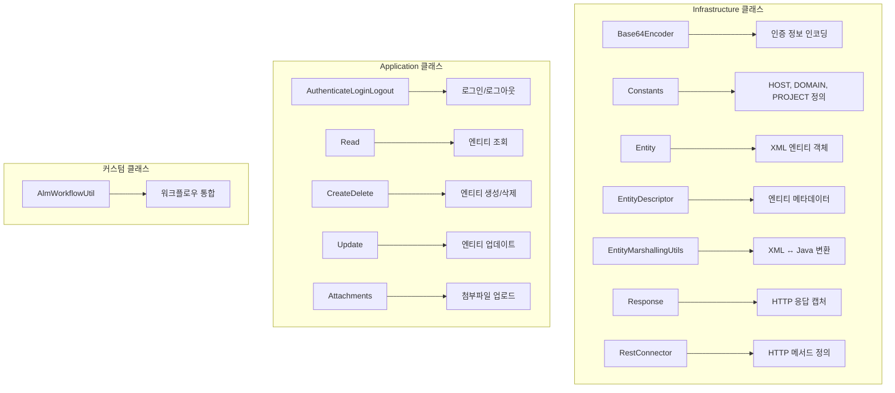
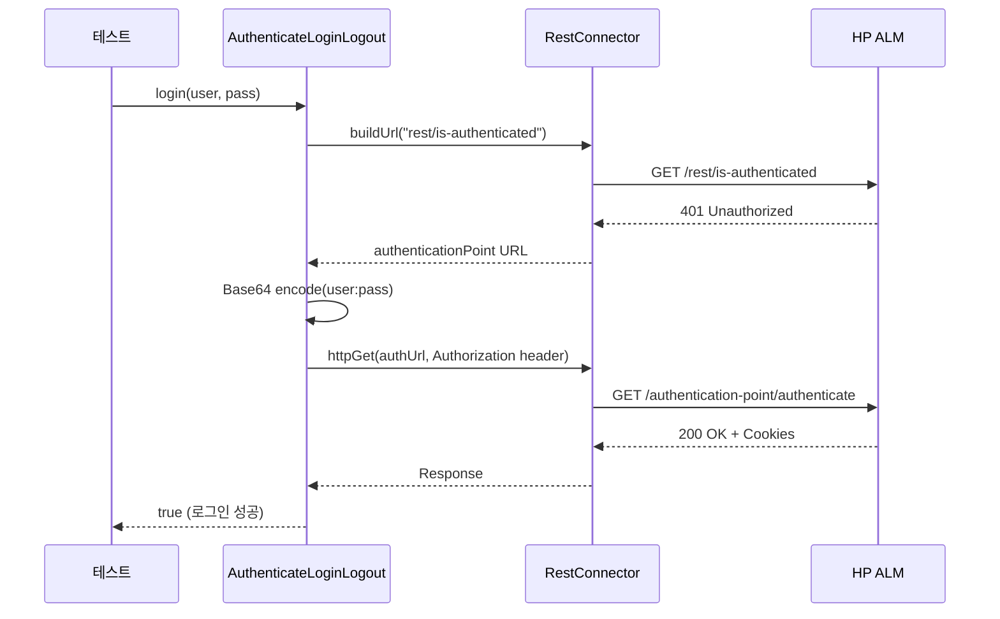
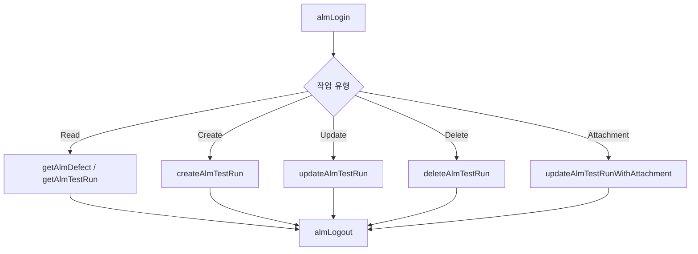

# Chapter 18: Advanced Topic 2 - Integrating with HP ALM (HP ALM 통합)

## 📌 핵심 요약

> **"ALM REST API의 Infrastructure 클래스와 Application 클래스를 활용하여 테스트 실행(Test Run), 결함(Defect) 등의 엔티티에 대한 CRUD 작업을 수행한다. AlmWorkflowUtil 클래스를 통해 로그인, 조회, 생성, 업데이트, 삭제, 첨부파일 업로드 기능을 테스트 스위트에 통합한다."**

이 챕터에서는 HP ALM(Quality Center)과 테스트 자동화 프레임워크를 통합하는 방법을 학습한다.

---

## 🎯 학습 목표

이 챕터를 완료하면 다음을 할 수 있다:

- [ ] ALM REST API 구조 (Infrastructure/Application) 이해
- [ ] RestConnector로 HTTP 메서드 호출
- [ ] Base64Encoder로 인증 정보 인코딩
- [ ] AuthenticateLoginLogout으로 로그인/로그아웃
- [ ] AlmWorkflowUtil로 CRUD 작업 수행
- [ ] 테스트 스위트에서 ALM 엔티티 업데이트
- [ ] 테스트 결과에 PDF 첨부파일 업로드

---

## 📖 본문 정리

### 18.1 ALM REST API 구조



#### 폴더 구조

```
src/main/java/com/taf/testautomation/testmanagement/alm/
├── infrastructure/
│   ├── Base64Encoder.java
│   ├── Constants.java
│   ├── Entity.java
│   ├── EntityDescriptor.java
│   ├── EntityMarshallingUtils.java
│   ├── Response.java
│   └── RestConnector.java
│
└── application/
    ├── AuthenticateLoginLogout.java
    ├── CreateDelete.java
    ├── Read.java
    ├── Update.java
    ├── Attachments.java
    └── AlmWorkflowUtil.java
```

---

### 18.2 Infrastructure 클래스 역할

| 클래스 | 역할 | 사용 예 |
|--------|------|---------|
| `Base64Encoder` | 로그인 자격 증명 인코딩 | `user:password` → Base64 |
| `Constants` | QC HOST, PORT, DOMAIN, PROJECT, 엔티티 XML 정의 | 환경 설정 |
| `Entity` | XML 필드 집합 (test run, defect 등) | JAXB 객체 |
| `EntityDescriptor` | 엔티티 메타데이터 | 필드 설명 |
| `EntityMarshallingUtils` | XML ↔ Java 변환 (Marshall/UnMarshall) | 파싱 |
| `Response` | HTTP 응답 캡처 | 상태 코드, 바디 |
| `RestConnector` | GET, PUT, POST, DELETE 정의 | HTTP 클라이언트 |

---

### 18.3 RestConnector 쿠키 업데이트

#### ALM 15.x 쿠키 문제 해결

```java
public void getQCSession() {
    try {
        HttpResponse<JsonNode> response = Unirest.post(buildUrl("rest/site-session"))
            .header("Accept", "application/xml")
            .header("Content-Type", "text/html")
            .header("Cookie", getCookieString())
            .asJson();

        this.updateCookies(response);
        System.out.println("Post QC Session code is " + response.getStatus());
    } catch (Exception e) {
        e.printStackTrace();
    }
}

private void updateCookies(HttpResponse<JsonNode> response) {
    Iterable<String> newCookies = response.getHeaders().get("Set-Cookie");

    if (newCookies != null) {
        for (String cookie : newCookies) {
            int equalIndex = cookie.indexOf('=');
            int semicolonIndex = cookie.indexOf(';');
            String cookieKey = cookie.substring(0, equalIndex);
            String cookieValue = cookie.substring(equalIndex + 1, semicolonIndex);
            cookies.put(cookieKey, cookieValue);
        }
    }
}
```

**참고**: ALM 15.x에서 CRU 작업 전 `getQCSession()` 호출 필수

---

### 18.4 Update 메서드 수정 (ALM 15.x)

```java
/**
 * 엔티티 업데이트
 * @param entityUrl 업데이트할 엔티티 URL
 * @param updatedEntityXml 업데이트된 필드만 포함한 XML
 * @return 서버 응답
 */
public String update(String entityUrl, String updatedEntityXml) {
    Map<String, String> headers = new HashMap<String, String>();
    headers.put("Accept", "application/xml");
    headers.put("Content-Type", "application/xml");
    headers.put("Cookie", RestConnector.getInstance().getCookieString());

    HttpResponse<JsonNode> putResponse = Unirest.put(entityUrl)
        .headers(headers)
        .body(updatedEntityXml.getBytes())
        .asJson();

    System.out.println("Put response code is " + putResponse.getStatus());
    return putResponse.getStatusText();
}
```

---

### 18.5 AuthenticateLoginLogout 클래스

```java
package com.taf.testautomation.testmanagement.alm.application;

import com.taf.testautomation.testmanagement.alm.infrastructure.*;
import java.net.HttpURLConnection;
import java.util.*;

public class AuthenticateLoginLogout {
    private RestConnector con;

    public AuthenticateLoginLogout() {
        this.con = RestConnector.getInstance();
    }

    /**
     * ALM 프로젝트 로그인
     */
    public boolean login(String username, String password) throws Exception {
        String authenticationPoint = this.isAuthenticated();
        if (authenticationPoint != null) {
            return this.login(authenticationPoint, username, password);
        }
        return true;  // 이미 인증됨
    }

    /**
     * Basic Authentication 로그인
     */
    private boolean login(String loginUrl, String username, String password)
            throws Exception {
        byte[] credBytes = (username + ":" + password).getBytes();
        String credEncodedString = "Basic " + Base64Encoder.encode(credBytes);

        Map<String, String> map = new HashMap<String, String>();
        map.put("Authorization", credEncodedString);

        Response response = con.httpGet(loginUrl, null, map);
        System.out.println("Login GET response is " + response.getStatusCode());

        return response.getStatusCode() == HttpURLConnection.HTTP_OK;
    }

    /**
     * 세션 종료 및 쿠키 정리
     */
    public boolean logout() throws Exception {
        Response response = con.httpGet(
            con.buildUrl("authentication-point/logout"), null, null);
        return (response.getStatusCode() == HttpURLConnection.HTTP_OK);
    }

    /**
     * 인증 상태 확인
     * @return null: 이미 인증됨, URL: 인증 필요
     */
    public String isAuthenticated() throws Exception {
        String isAuthenticateUrl = con.buildUrl("rest/is-authenticated");
        Response response = con.httpGet(isAuthenticateUrl, null, null);
        int responseCode = response.getStatusCode();

        if (responseCode == HttpURLConnection.HTTP_OK) {
            return null;  // 이미 인증됨
        } else if (responseCode == HttpURLConnection.HTTP_UNAUTHORIZED) {
            return con.buildUrl("authentication-point/authenticate");
        } else {
            throw response.getFailure();
        }
    }
}
```

#### 인증 흐름



---

### 18.6 AlmWorkflowUtil 클래스

```java
package com.taf.testautomation.testmanagement.alm.application;

import com.taf.testautomation.testmanagement.alm.infrastructure.*;
import java.io.*;
import java.util.*;
import static com.taf.testautomation.utilities.excelutil.ExcelUtil.getCustomProperties;

public class AlmWorkflowUtil {
    AuthenticateLoginLogout alm = new AuthenticateLoginLogout();
    RestConnector conn = RestConnector.getInstance();

    /**
     * HP ALM 로그인
     */
    public void almLogin(String userName, String password) throws Exception {
        conn.init(new HashMap<String, String>(),
            Constants.HOST, Constants.DOMAIN, Constants.PROJECT);
        alm.login(userName, password);
    }

    /**
     * Defect 조회
     */
    public void getAlmDefect(String defectID) throws Exception {
        String defectUrl = conn.buildEntityCollectionUrl("defect") + "/" + defectID;

        Map<String, String> requestHeaders = new HashMap<>();
        requestHeaders.put("Accept", "application/xml");

        Response res = conn.httpGet(defectUrl, null, requestHeaders);
        String postedEntityReturnedXml = res.toString();

        Entity entity = EntityMarshallingUtils.marshal(Entity.class, postedEntityReturnedXml);

        // 필드 출력
        List<Entity.Fields.Field> fields = entity.getFields().getField();
        for (Entity.Fields.Field field : fields) {
            System.out.println(field.getName() + " : " + field.getValue());
        }
    }

    /**
     * Test Run 조회
     */
    public void getAlmTestRun(String testRunID) throws Exception {
        conn.getQCSession();  // 쿠키 업데이트
        String testRunUrl = conn.buildEntityCollectionUrl("run") + "/" + testRunID;

        Map<String, String> map = new HashMap<>();
        map.put("Accept", "application/xml");

        Response resp = conn.httpGet(testRunUrl, null, map);
        System.out.println(resp.getStatusCode());
    }

    /**
     * Test Run 생성
     */
    public void createAlmTestRun() throws Exception {
        conn.getQCSession();
        String requirementsUrl = conn.buildEntityCollectionUrl("run");

        CreateDelete createTestRun = new CreateDelete();
        String newCreatedResourceUrl = createTestRun.createEntity(
            requirementsUrl, Constants.entityToPostXmlTR);
    }

    /**
     * Test Run 업데이트
     */
    public void updateAlmTestRun(String tcStatus, String updateKey, String updateValue)
            throws Exception {
        conn.getQCSession();
        String updateURL = getCustomProperties().get("updateURL");

        // Entity에서 ID 추출
        Entity testRun = EntityMarshallingUtils.marshal(Entity.class, Constants.entityToPostXmlTR);
        String idValue = extractIdFromEntity(testRun);

        updateURL = updateURL + idValue;

        Update update = new Update();
        String updatedEntityXml = update.generateSingleFieldUpdateXmlTR(
            updateKey, updateValue, "id", idValue);
        update.update(updateURL, updatedEntityXml);
    }

    /**
     * Test Run 업데이트 + 첨부파일
     */
    public void updateAlmTestRunWithAttachment(String tcStatus, String filePath,
            String contentType) throws Exception {
        String updateURL = getCustomProperties().get("updateURL");

        Entity testRun = EntityMarshallingUtils.marshal(Entity.class, Constants.entityToPostXmlTR);
        String idValue = extractIdFromEntity(testRun);

        updateURL = updateURL + idValue;
        String url = attachFile(updateURL, filePath, contentType);

        // 이메일 발송 (Appendix A)
        EmailUtil.sendEmailAttachment(
            "Test run was updated with attachment - " + updateURL, tcStatus);
    }

    /**
     * Test Run 삭제
     */
    public void deleteAlmTestRun() throws Exception {
        String deleteURL = getCustomProperties().get("deleteURL");

        Entity testRun = EntityMarshallingUtils.marshal(Entity.class, Constants.entityToPostXmlTR);
        String idValue = extractIdFromEntity(testRun);

        deleteURL = deleteURL + idValue;

        CreateDelete deleteTestRun = new CreateDelete();
        String serverResponse = deleteTestRun.deleteEntity(deleteURL);
        System.out.println(serverResponse);
    }

    /**
     * HP ALM 로그아웃
     */
    public void almLogout() throws Exception {
        alm.logout();
    }

    /**
     * 첨부파일 업로드
     */
    private String attachFile(String updateUrl, String filePath, String contentType)
            throws Exception {
        File uploadFile = new File(filePath);
        String fileName = uploadFile.getName();

        FileInputStream inputStream = new FileInputStream(uploadFile);
        byte[] byteSteam = new byte[inputStream.available()];
        inputStream.read(byteSteam);

        Attachments attachments = new Attachments();
        String newImageAttachmentUrl = attachments.attachWithMultipart(
            updateUrl, byteSteam, contentType, fileName, "File description");

        return newImageAttachmentUrl;
    }

    private String extractIdFromEntity(Entity entity) {
        List<Entity.Fields.Field> fields = entity.getFields().getField();
        for (Entity.Fields.Field field : fields) {
            if (field.getName().equals("id")) {
                String str = field.getValue().toString();
                return str.substring(str.indexOf("[") + 1, str.indexOf("]"));
            }
        }
        return "";
    }
}
```

---

### 18.7 테스트 스위트에 ALM 통합

#### AboutAppTestSuite - 리포트 메서드

```java
@Severity(SeverityLevel.CRITICAL)
@Test
@Order(6)
public void create_pdf_report_update_hpalm() throws Exception {
    String tcName = new Object() {}.getClass().getEnclosingMethod().getName();
    log("Test Name" + tcName);

    // PDF 리포트 생성
    appiumUtil = new AppiumUtil(getSession().getAppiumDriver());
    String pdfFile = getCustomProperties().get("reportPrefix")
        + "test-result/pdfreport/" + TEST_NAME + "Report.pdf";

    // 디바이스 속성 수집
    Stream<String> propStream = Stream.of(
        TEST_NAME + "Screenshots:",
        appiumUtil.getDeviceProperties("TimeZone"),
        appiumUtil.getDeviceProperties("ReportDate"),
        appiumUtil.getDeviceProperties("ReportTime"),
        appiumUtil.getDeviceProperties("Name"),
        appiumUtil.getDeviceProperties("OS"),
        appiumUtil.getDeviceProperties("Model"),
        appiumUtil.getDeviceProperties("Manufacturer"),
        appiumUtil.getDeviceProperties("Version"),
        appiumUtil.getDeviceProperties("Serial_Number"),
        getCustomProperties().get("build")
    );
    List<String> propList = propStream.collect(Collectors.toList());

    String update = j + " of " + i + " Passed";

    // PDF 생성 및 병합
    new PdfUtil().getPdfFromImageList(propList, imageList, new File(pdfFile));
    PdfUtil.mergePdf(new File(getCustomProperties().get("mergedReport")));

    // ALM 업데이트
    updateALMEntity(update);
}

private void updateALMEntity(String tcStatus) throws Exception {
    almWorkflowUtil.almLogin(
        getCustomProperties().get("almUsername"),
        getCustomProperties().get("almPassword")
    );

    switch (testStatus) {
        case "Passed":
            almWorkflowUtil.updateAlmTestRun(tcStatus,
                getCustomProperties().get("updateKeyPass"),
                getCustomProperties().get("updateValuePass"));
            almWorkflowUtil.updateAlmTestRunWithAttachment(tcStatus,
                getCustomProperties().get("pdfFilePath"),
                getCustomProperties().get("pdfContentType"));
            break;
        default:
            almWorkflowUtil.updateAlmTestRun(tcStatus,
                getCustomProperties().get("updateKeyFail"),
                getCustomProperties().get("updateValueFail"));
            break;
    }

    almWorkflowUtil.almLogout();
}
```

#### Step Definition 업데이트 (Cucumber)

```java
@Then("close application and update HP QC test run")
public void close_application_and_update_HP_QC_test_run() throws Exception {
    create_pdf_report_update_hpalm();
    tearDown();
}
```

---

### 18.8 TestautomationApplicationTests - API 테스트

```java
@Slf4j
@ExtendWith(SpringExtension.class)
@SpringBootTest(classes = {TestautomationApplication.class})
class TestautomationApplicationTests {

    AlmWorkflowUtil almWorkflowUtil = new AlmWorkflowUtil();

    @Autowired
    TestAutomationProperties testAutomationProperties;

    @Test
    public void testGetServiceCall() throws Exception {
        // REST API 호출
        JsonElement response = RestServices.getJson(
            testAutomationProperties.getUrl(), "", "", "sample-service.json");
        log.info(String.valueOf(response));

        if (response.isJsonNull()) {
            Assertions.fail();
        }

        // HP ALM 로그인
        almWorkflowUtil.almLogin(
            testAutomationProperties.getAlmUsername(),
            testAutomationProperties.getAlmPassword());

        // Defect 조회
        almWorkflowUtil.getAlmDefect(testAutomationProperties.getDefectID());

        // Test Run 조회
        almWorkflowUtil.getAlmTestRun(testAutomationProperties.getTestRunID());

        // Test Run 생성
        almWorkflowUtil.createAlmTestRun();

        // Test Run 업데이트
        almWorkflowUtil.updateAlmTestRun(
            testAutomationProperties.getUpdateURL(),
            testAutomationProperties.getUpdateKeyPass(),
            testAutomationProperties.getUpdateValuePass());

        // 첨부파일 업로드
        almWorkflowUtil.updateAlmTestRunWithAttachment(
            testAutomationProperties.getUpdateURL(),
            testAutomationProperties.getPdfFilePath(),
            testAutomationProperties.getPdfContentType());

        // Test Run 삭제
        almWorkflowUtil.deleteAlmTestRun();

        // HP ALM 로그아웃
        almWorkflowUtil.almLogout();
    }
}
```

---

### 18.9 uitest.properties 설정

```properties
# HP ALM 설정
almUsername=your_username
almPassword=your_password
updateURL=https://alm.company.com/qcbin/rest/domains/DOMAIN/projects/PROJECT/runs/
deleteURL=https://alm.company.com/qcbin/rest/domains/DOMAIN/projects/PROJECT/runs/
updateKeyPass=status
updateValuePass=Passed
updateKeyFail=status
updateValueFail=Failed

# 첨부파일 설정
pdfFilePath=./test-result/pdfreport/Report.pdf
pdfContentType=application/pdf
```

---

## 💡 실무 적용 포인트

### CRUD 작업 흐름



### AlmWorkflowUtil 메서드 요약

| 메서드 | HTTP | 용도 |
|--------|------|------|
| `almLogin()` | GET | 로그인 + 세션 초기화 |
| `getAlmDefect()` | GET | Defect 조회 |
| `getAlmTestRun()` | GET | Test Run 조회 |
| `createAlmTestRun()` | POST | Test Run 생성 |
| `updateAlmTestRun()` | PUT | Test Run 상태 업데이트 |
| `updateAlmTestRunWithAttachment()` | PUT + POST | 상태 + PDF 첨부 |
| `deleteAlmTestRun()` | DELETE | Test Run 삭제 |
| `almLogout()` | GET | 로그아웃 |

### 엔티티 URL 패턴

```
Base URL: https://alm.company.com/qcbin/rest/domains/{DOMAIN}/projects/{PROJECT}

Defect:   /defects/{id}
Test Run: /runs/{id}
Test Set: /test-sets/{id}
```

### 핵심 API 요약

| API | 출처 | 역할 |
|-----|------|------|
| `Unirest` | kong | HTTP 클라이언트 (Chapter 16 RestAssured 대안) |
| `Base64Encoder` | ALM | Basic Auth 인코딩 |
| `EntityMarshallingUtils.marshal()` | ALM | XML → Java 객체 |
| `RestConnector.buildEntityCollectionUrl()` | ALM | 엔티티 URL 생성 |
| `RestConnector.getQCSession()` | Custom | 쿠키 갱신 (ALM 15.x) |

---

## ✅ 핵심 개념 체크리스트

- [ ] ALM REST API Infrastructure/Application 클래스 구조
- [ ] `Base64Encoder`로 Basic Authentication 인코딩
- [ ] `RestConnector.getQCSession()`으로 ALM 15.x 쿠키 관리
- [ ] `AuthenticateLoginLogout`으로 로그인/로그아웃
- [ ] `AlmWorkflowUtil`로 CRUD 작업 통합
- [ ] `EntityMarshallingUtils.marshal()`로 XML 파싱
- [ ] Test Run 상태 업데이트 (Passed/Failed)
- [ ] PDF 리포트 첨부파일 업로드
- [ ] uitest.properties에 ALM 설정 추가

---

## 🔗 참고 자료

- [ALM 15.x REST API Reference](https://admhelp.microfocus.com/alm/api_refs/REST_TECH_PREVIEW/)
- [ALM REST API GitHub Example](https://github.com/alonso05/ALM)
- [Unirest Java](http://kong.github.io/unirest-java/)

---

## 📚 다음 챕터 미리보기

- **Chapter 19**: 로컬라이제이션 테스팅 - 다국어 앱 테스트

