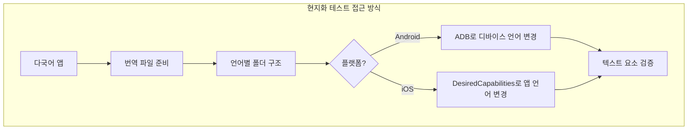
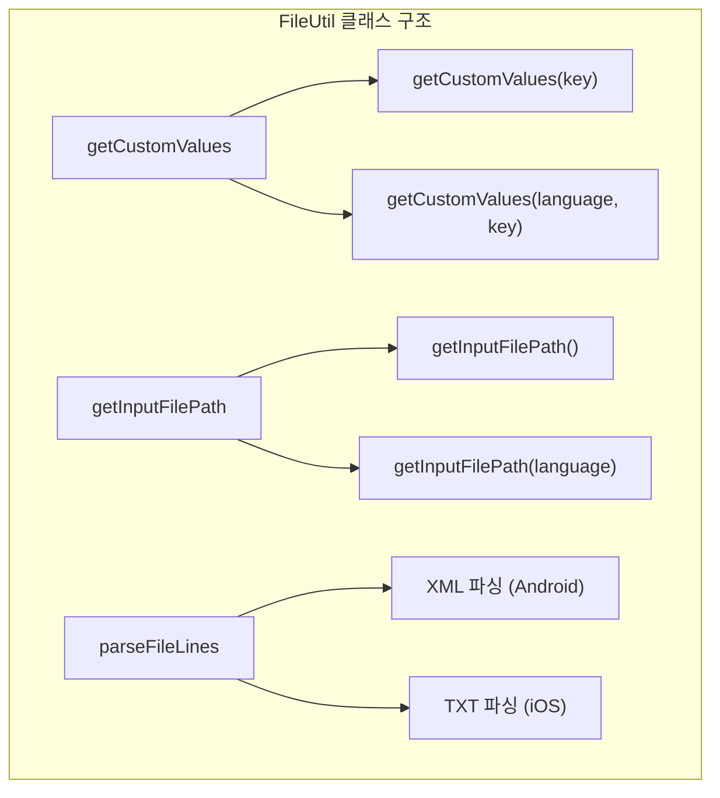
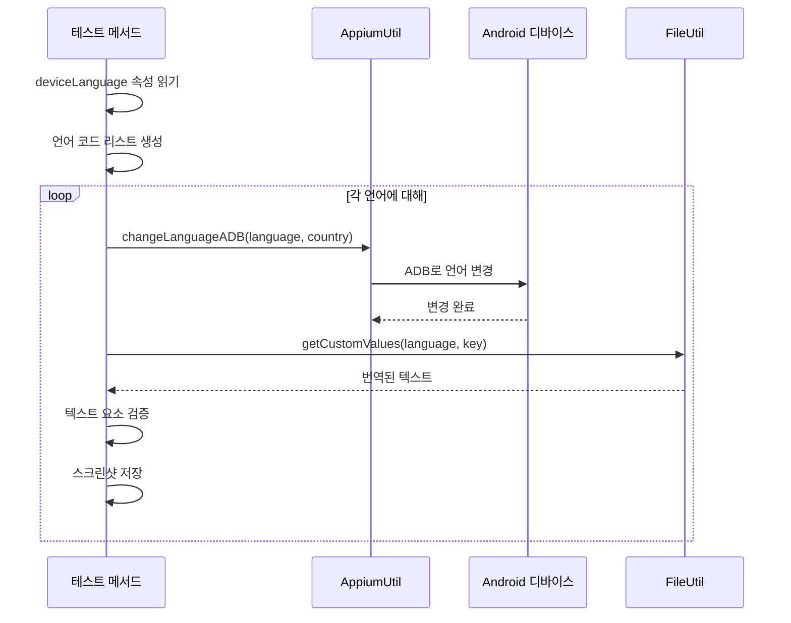
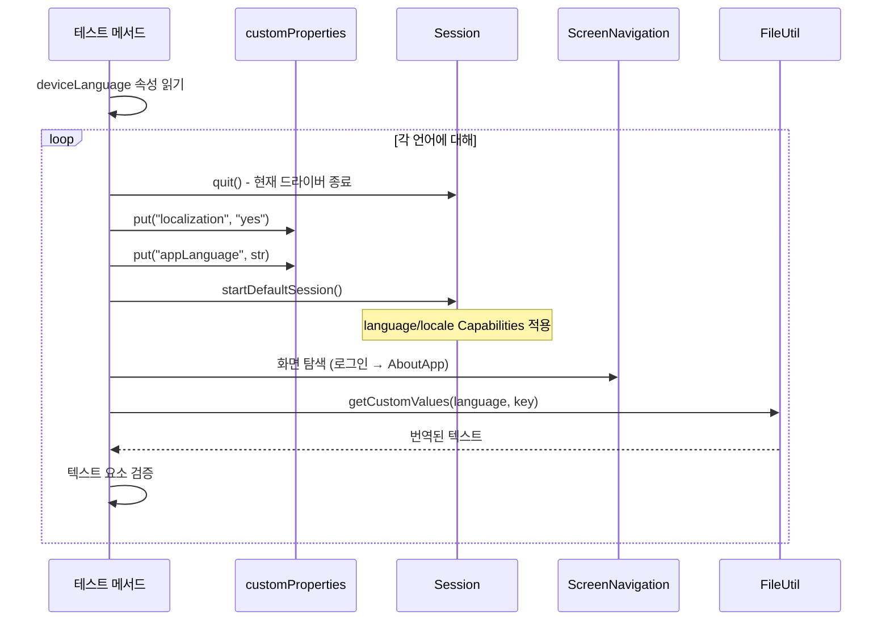
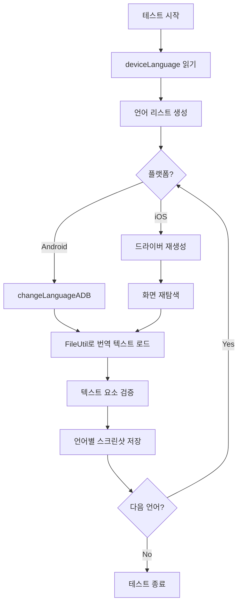

# Chapter 19: Adding Localization Testing Capabilities (현지화 테스트 기능 추가)

## 📌 핵심 요약

> **"다국어 앱의 현지화 테스트는 언어별 번역 파일(XML/TXT)을 파싱하고, Android는 changeLanguageADB()로 디바이스 언어를 변경하며, iOS는 language/locale DesiredCapabilities를 동적으로 변경 후 드라이버를 재생성하여 수행한다. FileUtil 클래스의 getCustomValues() 메서드를 오버로딩하여 언어 파라미터를 추가한다."**

이 챕터에서는 다국어 앱의 텍스트 요소를 여러 언어로 검증하는 현지화 테스트 구현 방법을 학습한다.

---

## 🎯 학습 목표

이 챕터를 완료하면 다음을 할 수 있다:

- [ ] 언어별 번역 파일 구조 설계 (XML/TXT)
- [ ] FileUtil 클래스에 언어 파라미터 오버로딩 추가
- [ ] Android에서 ADB로 디바이스 언어 변경
- [ ] iOS에서 DesiredCapabilities로 앱 언어 변경
- [ ] 다국어 환경에서 동작하는 제네릭 로케이터 작성
- [ ] BDD Feature 파일에 현지화 테스트 시나리오 추가

---

## 📖 본문 정리

### 19.1 현지화 테스트 접근 방식



#### 핵심 개념

| 용어 | 설명 |
|------|------|
| **Localization Testing** | 앱이 지원하는 모든 언어에서 화면 요소가 올바르게 표시되는지 검증 |
| **Translation File** | 언어별 텍스트 데이터를 저장하는 파일 (XML 또는 TXT) |
| **Locale** | 언어 + 국가 코드 조합 (예: en-US, ko-KR) |

---

### 19.2 번역 파일 구조

#### 디렉토리 구조

```
src/test/resources/
├── testdata/
│   ├── xml/
│   │   ├── en-US/
│   │   │   └── data.xml
│   │   ├── ko-KR/
│   │   │   └── data.xml
│   │   └── ja-JP/
│   │       └── data.xml
│   └── txt/
│       ├── en-US/
│       │   └── data.txt
│       ├── ko-KR/
│       │   └── data.txt
│       └── ja-JP/
│           └── data.txt
```

#### data.xml (Android용)

```xml
<?xml version="1.0" encoding="utf-8"?>
<!-- Localization text for Test Engineer to Architect -->
<resources>
   <!-- Text -->
   <string name="copyrighttext">Data1</string>
   <string name="appdescstrng1">Data2</string>
   <string name="appdescstrng2">Data3</string>
</resources>
```

#### data.txt (iOS용)

```
/* Localization text for Test Engineer to Architect */
/* Text */
"copyrighttext" = "Data1";
"appdescstrng1" = "Data2";
"appdescstrng2" = "Data3";
```

---

### 19.3 FileUtil 클래스 업데이트



#### FileUtil.java 핵심 코드

```java
package com.taf.testautomation.utilities.fileutil;

import lombok.extern.slf4j.Slf4j;
import org.w3c.dom.*;
import javax.xml.parsers.*;
import java.io.*;
import java.nio.file.*;
import java.util.*;
import java.util.stream.*;

import static com.taf.testautomation.utilities.excelutil.ExcelUtil.getCustomProperties;

@Slf4j
public class FileUtil {

    private LinkedHashMap<String, String> customSettings = new LinkedHashMap<>();
    private static final String INPUT_XML_BASE_PATH = "src/test/resources/testdata/xml/";
    private static final String INPUT_TXT_BASE_PATH = "src/test/resources/testdata/txt/";
    private static final String XML_FILENAME = "data.xml";
    private static final String DATA_FILENAME = "data.txt";

    /**
     * 기본 getCustomValues - 언어 파라미터 없음
     */
    public String getCustomValues(String key) {
        String filePath = getInputFilePath();
        String value = "";
        try {
            value = parseFileLines(filePath, key);
        } catch (Exception e) {
            e.printStackTrace();
        }
        return value;
    }

    /**
     * 오버로딩된 getCustomValues - 언어 파라미터 포함
     */
    public String getCustomValues(String language, String key) {
        String filePath = getInputFilePath(language);
        String value = "";
        try {
            value = parseFileLines(filePath, key);
        } catch (Exception e) {
            e.printStackTrace();
        }
        return value;
    }

    /**
     * 기본 파일 경로 반환
     */
    private String getInputFilePath() {
        if (getCustomProperties().get("isAndroid").equals("true")) {
            return INPUT_XML_BASE_PATH + XML_FILENAME;
        } else {
            return INPUT_TXT_BASE_PATH + DATA_FILENAME;
        }
    }

    /**
     * 언어별 파일 경로 반환
     */
    private String getInputFilePath(String language) {
        if (getCustomProperties().get("isAndroid").equals("true")) {
            return INPUT_XML_BASE_PATH + language + "/" + XML_FILENAME;
        } else {
            return INPUT_TXT_BASE_PATH + language + "/" + DATA_FILENAME;
        }
    }

    /**
     * 파일 라인 파싱 - 플랫폼별 처리
     */
    private String parseFileLines(String filePath, String key) {
        String strLine = "";
        try {
            Stream<String> lines = Files.lines(Paths.get(filePath));
            strLine = lines.filter(s -> s.contains(key))
                          .collect(Collectors.toList()).get(0);
        } catch (Exception e) {
            e.printStackTrace();
        }

        // 플랫폼별 파싱 로직
        if (getCustomProperties().get("isAndroid").equals("true")) {
            // XML: <string name="key">value</string>
            return strLine.substring(strLine.indexOf(">") + 1, strLine.lastIndexOf("<"));
        } else {
            // TXT: "key" = "value";
            return strLine.substring(strLine.indexOf("=") + 3, strLine.indexOf(";") - 1);
        }
    }

    /**
     * XML 파싱 (전체 설정 로드)
     */
    private void parseXML(String filePath, LinkedHashMap<String, String> customProperties)
            throws Exception {
        File fXmlFile = new File(filePath);
        DocumentBuilderFactory dbFactory = DocumentBuilderFactory.newInstance();
        DocumentBuilder dBuilder = dbFactory.newDocumentBuilder();
        Document doc = dBuilder.parse(fXmlFile);
        doc.getDocumentElement().normalize();

        NodeList nList = doc.getElementsByTagName("string");
        for (int i = 0; i < nList.getLength(); i++) {
            Node nNode = nList.item(i);
            Element eElement = (Element) nNode;
            String key = eElement.getAttribute("name");
            String value = nNode.getTextContent();
            customProperties.put(key, value);
        }
    }
}
```

---

### 19.4 Android 현지화 테스트



#### testScenario6 - 저작권 텍스트 검증

```java
@Severity(SeverityLevel.CRITICAL)
@Issue("xxxx")
@DisplayName("xxxx")
@Description("xxxx: Verify that the copyright text is displayed")
@Test
@Order(6)
@Smoke
@Regression
@SIT
@AT
public void testScenario6() throws Exception {
    String tcName = new Object() {}.getClass().getEnclosingMethod().getName();
    log("Test Name" + tcName);

    String copyrightTxt = "";

    // 1. deviceLanguage 속성에서 언어 코드 리스트 생성
    String languageCodes = getCustomProperties().get("deviceLanguage");
    List<String> list = Stream.of(languageCodes.split("\\s*,\\s*"))
                              .collect(Collectors.toList());

    // 2. 각 언어에 대해 테스트 수행
    for (String str : list) {
        try {
            log("Language code is: " + str.substring(0, 2) +
                "\nCountry code is: " + str.substring(3));

            // 3. 플랫폼별 언어 변경
            if (getCustomProperties().get("isAndroid").equals("true")) {
                // Android: ADB로 디바이스 언어 변경
                appiumUtil.changeLanguageADB(str.substring(0, 2), str.substring(3));
            } else {
                // iOS: 드라이버 재생성
                session.getAppiumDriver().quit();
                getCustomProperties().put("localization", "yes");
                getCustomProperties().put("appLanguage", str);
                session = startDefaultSession();
                aboutAppScreen = new ScreenNavigation(session)
                    .getAboutAppScreenFromAccountCreationScreen(
                        getCustomProperties().get("username"),
                        getCustomProperties().get("password"));
            }

            // 4. 언어별 번역 텍스트 가져오기
            fileUtil = new FileUtil();
            copyrightTxt = fileUtil.getCustomValues(str, "copyrighttext");

            // 5. 텍스트 검증
            SoftAssertions.assertSoftly(softAssertions -> {
                softAssertions.assertThat(
                    aboutAppScreen.isCopyrightTextDisplayed(
                        fileUtil.getCustomValues(str, "copyrighttext")))
                    .as("The Copyright is correctly displayed")
                    .isTrue();
            });

        } finally {
            testStatus = aboutAppScreen.isCopyrightTextDisplayed(copyrightTxt)
                ? "Passed" : "Failed";
            updateTCPassCount();
            try {
                // 언어 코드를 포함한 스크린샷 저장
                aboutAppScreen.takeScreenShot(
                    "test-result/screenshots/" + tcName + "-" + str +
                    copyrightTxt + "--" + testStatus + ".png");
            } catch (Exception e) {
                e.printStackTrace();
            }
            imageList.add("test-result/screenshots/" + tcName + "-" + str +
                         copyrightTxt + "--" + testStatus + ".png");
        }
    }
}
```

---

### 19.5 iOS 현지화 테스트



#### Android vs iOS 언어 변경 비교

| 항목 | Android | iOS |
|------|---------|-----|
| **변경 레벨** | 디바이스 레벨 | 앱 레벨 |
| **방법** | ADB 명령어 (changeLanguageADB) | DesiredCapabilities (language/locale) |
| **드라이버 재생성** | 불필요 | 필요 |
| **화면 재탐색** | 불필요 | 필요 |
| **번역 파일** | XML (data.xml) | TXT (data.txt) |

---

### 19.6 제네릭 로케이터

다국어 환경에서 동작하는 로케이터는 텍스트 기반이 아닌 구조 기반으로 작성해야 한다.

```java
// ❌ 잘못된 예: 텍스트 기반 (언어 변경 시 실패)
@AndroidFindBy(xpath = "//android.widget.TextView[@text='Settings']")
private MobileElement settingsButton;

// ✅ 올바른 예: 구조 기반 (모든 언어에서 동작)
@AndroidFindBy(xpath = "//android.widget.LinearLayout/android.widget.FrameLayout/android.view.ViewGroup")
@iOSXCUITFindBy(xpath = "//XCUIElementTypeCollectionView/XCUIElementTypeCell/XCUIElementTypeOther")
private MobileElement someMobileElement;
```

#### 제네릭 로케이터 전략

| 전략 | 설명 | 예시 |
|------|------|------|
| **구조 기반** | 요소의 계층 구조 사용 | `//parent/child[position]` |
| **속성 기반** | 고유 ID나 클래스명 사용 | `@resource-id='btn_submit'` |
| **인덱스 기반** | 동일 타입 중 순서 사용 | `(//Button)[1]` |
| **content-desc** | 접근성 레이블 사용 | `@content-desc='submit_button'` |

---

### 19.7 BDD 아티팩트 업데이트

#### AboutApp.feature

```gherkin
@AboutApp
Feature: AboutApp
  Req number: xxxx

  Background:
    Given application is installed and launched

  @AboutApp @Regression
  Scenario: client wants to verify about app screen elements
    When user opens the application
    Then verify create account screen is displayed
    When user fills in details
    And clicks on Create Account button
    Then verified user is taken to the app login screen
    When user logs in with email and password
    And clicks on Sign In button
    Then verified user is taken to the about app screen
    And verified user sees the following in-app screen
      | Screen_Title    |
      | App_Logo        |
      | App_Name        |
      | App_Version     |
      | App_Images      |
      | Copyright_Txt   |
      | App_Description |
    Then close application and update HP QC test run
```

#### AboutAppStepDefinitions.java

```java
@And("verified user sees the following in app screen")
public void verify_user_sees_the_following_in_app_screen(DataTable dt) {
    List<String> list = dt.asList(String.class);
    dataTable = new String[list.size()][1];

    for (int i = 0; i < list.size(); i++) {
        dataTable[i][0] = list.get(i);
    }

    for (String str : list) {
        switch (str) {
            case "Screen_Title":
                testScenario1();
                break;
            case "App_Logo":
                testScenario2();
                break;
            case "App_Name":
                testScenario3();
                break;
            case "App_Version":
                testScenario4();
                break;
            case "App_Images":
                testScenario5();
                break;
            case "Copyright_Txt":
                try {
                    testScenario6();  // 현지화 테스트
                } catch (Exception e) {
                    e.printStackTrace();
                }
                break;
            default:
                try {
                    testScenario7();  // 앱 설명 현지화 테스트
                } catch (Exception e) {
                    e.printStackTrace();
                }
                break;
        }
    }
}
```

---

### 19.8 uitest.properties 설정

```properties
# 현지화 테스트 설정
deviceLanguage=en-US, ko-KR, ja-JP, zh-CN

# iOS 현지화 설정
localization=no
appLanguage=en-US

# 플랫폼 구분
isAndroid=true
```

---

## 💡 실무 적용 포인트

### 디렉토리 구조

```
src/
├── main/java/com/taf/testautomation/
│   └── utilities/
│       └── fileutil/
│           └── FileUtil.java          # 번역 파일 파싱
│
├── test/java/com/taf/testautomation/
│   ├── testsuite/
│   │   └── AboutAppTestSuite.java      # testScenario6, testScenario7
│   └── cucumber/
│       └── aboutapp/
│           ├── AboutApp.feature        # BDD Feature
│           └── AboutAppStepDefinitions.java
│
└── test/resources/
    └── testdata/
        ├── xml/                        # Android용
        │   ├── en-US/data.xml
        │   ├── ko-KR/data.xml
        │   └── ja-JP/data.xml
        └── txt/                        # iOS용
            ├── en-US/data.txt
            ├── ko-KR/data.txt
            └── ja-JP/data.txt
```

### 현지화 테스트 흐름



### Lambda 표현식 주의사항

```java
// ❌ 잘못된 예: 로컬 변수를 람다 내부에서 수정
String copyrightTxt = "";
SoftAssertions.assertSoftly(softAssertions -> {
    copyrightTxt = "new value";  // 컴파일 에러!
});

// ✅ 올바른 예: 람다 외부에서 값 설정 후 사용
String copyrightTxt = fileUtil.getCustomValues(str, "copyrighttext");
SoftAssertions.assertSoftly(softAssertions -> {
    softAssertions.assertThat(
        aboutAppScreen.isCopyrightTextDisplayed(
            fileUtil.getCustomValues(str, "copyrighttext")))  // 메서드 직접 호출
        .isTrue();
});
```

### 핵심 API 요약

| API | 출처 | 역할 |
|-----|------|------|
| `Files.lines()` | java.nio.file | 파일 라인 스트림 |
| `Stream.filter()` | java.util.stream | 조건 필터링 |
| `DocumentBuilder` | javax.xml.parsers | XML 파싱 |
| `changeLanguageADB()` | AppiumUtil | Android 언어 변경 |
| `DesiredCapabilities` | Appium | iOS 언어/로케일 설정 |

---

## ✅ 핵심 개념 체크리스트

- [ ] 언어별 번역 파일 구조 (XML for Android, TXT for iOS)
- [ ] FileUtil 클래스의 getCustomValues() 오버로딩
- [ ] getInputFilePath(language)로 언어별 경로 생성
- [ ] Android: changeLanguageADB()로 디바이스 레벨 언어 변경
- [ ] iOS: DesiredCapabilities 변경 + 드라이버 재생성 + 화면 재탐색
- [ ] 제네릭 로케이터 (텍스트 기반 ❌, 구조 기반 ✅)
- [ ] Lambda 표현식에서 로컬 변수 사용 불가 (effectively final 필요)
- [ ] 언어 코드 포함 스크린샷 네이밍

---

## 🔗 참고 자료

- [Appium Localization Testing](https://appium.io/docs/en/writing-running-appium/other/locale/)
- [Java Stream API](https://docs.oracle.com/javase/8/docs/api/java/util/stream/package-summary.html)
- [Android ADB Language Settings](https://developer.android.com/studio/command-line/adb)
- [iOS Localization Testing](https://developer.apple.com/documentation/xcode/testing-your-app-s-localization)

---

## 📚 다음 챕터 미리보기

- **Chapter 20**: 병렬 테스트 실행 (Parallel Test Execution)

