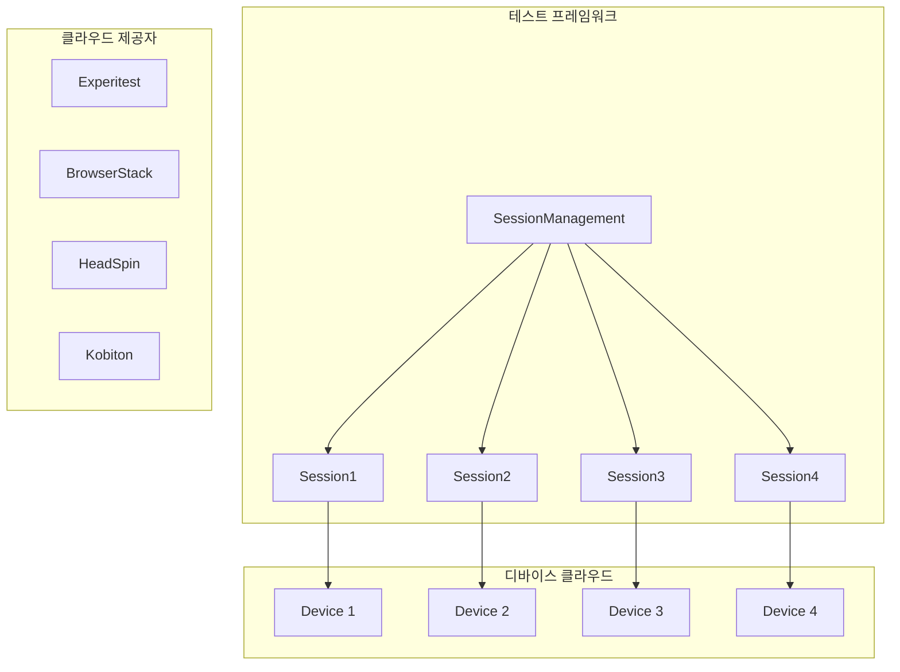
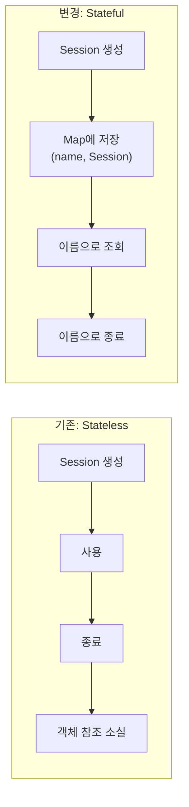
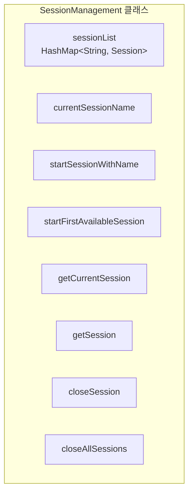
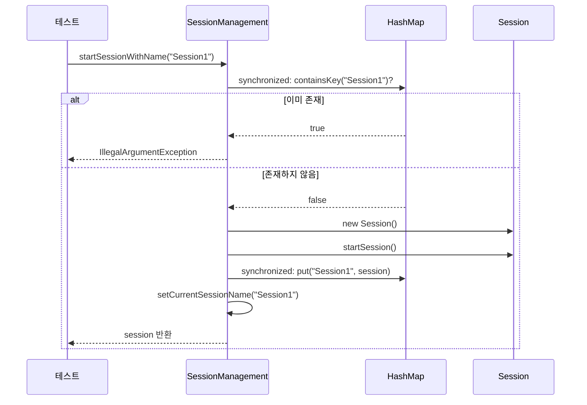
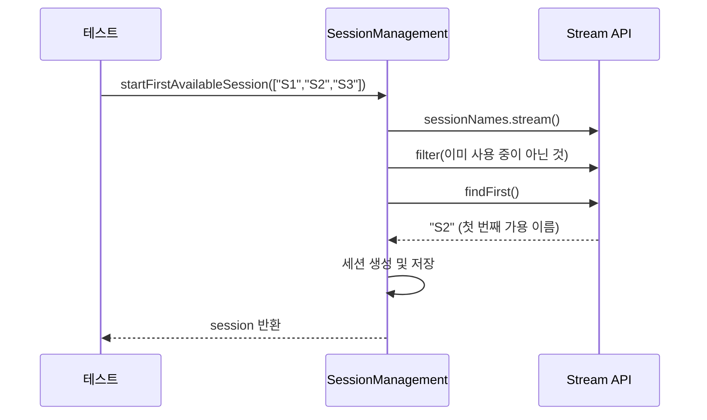
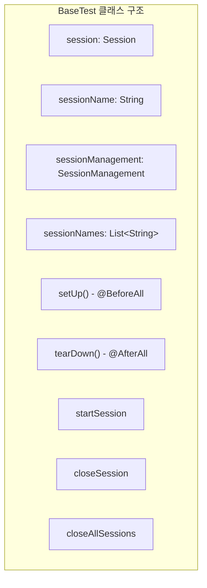
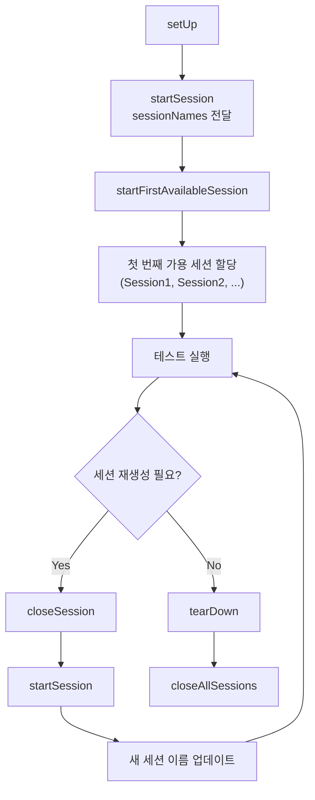

# Chapter 20: Implementing Parallel Test Execution (병렬 테스트 실행 구현)

## 📌 핵심 요약

> **"병렬 테스트 실행을 위해 SessionManagement 클래스에서 HashMap<String, Session>으로 세션을 관리한다. startSessionWithName()으로 명명된 세션을 생성하고, startFirstAvailableSession()으로 사용 가능한 첫 번째 세션을 할당하며, synchronized 블록으로 스레드 안전성을 보장한다. BaseTest와 테스트 스위트에서 closeSession() 대신 SessionManagement를 통해 세션을 관리한다."**

이 챕터에서는 디바이스 클라우드에서 병렬 실행을 위해 여러 드라이버 인스턴스를 생성하고 관리하는 방법을 학습한다.

---

## 🎯 학습 목표

이 챕터를 완료하면 다음을 할 수 있다:

- [ ] SessionManagement 클래스로 다중 세션 관리
- [ ] HashMap<String, Session>으로 세션 이름-객체 매핑
- [ ] synchronized 블록으로 스레드 안전성 보장
- [ ] startFirstAvailableSession()으로 가용 세션 자동 할당
- [ ] BaseTest 클래스에 병렬 실행 지원 추가
- [ ] 테스트 스위트 업데이트 (closeSession → SessionManagement)

---

## 📖 본문 정리

### 20.1 병렬 실행 아키텍처



#### 핵심 개념

| 용어 | 설명 |
|------|------|
| **Parallel Execution** | 여러 디바이스에서 동시에 테스트 실행 |
| **Device Cloud** | 테스트용 디바이스를 호스팅하는 클라우드 서비스 |
| **Session Management** | 여러 세션 객체를 이름으로 식별하고 관리 |
| **Thread Safety** | synchronized로 멀티스레드 환경에서 안전한 접근 보장 |

---

### 20.2 Stateless vs Stateful 세션



| 방식 | 특징 | 사용 시점 |
|------|------|-----------|
| **Stateless** | 생성 후 참조 없음 | 단일 디바이스 실행 |
| **Stateful** | HashMap으로 이름-객체 매핑 | 병렬 디바이스 실행 |

---

### 20.3 SessionManagement 클래스



#### SessionManagement.java 전체 코드

```java
package com.taf.testautomation;

import lombok.extern.slf4j.Slf4j;
import java.util.*;
import java.util.function.Consumer;

@Slf4j
public class SessionManagement {

    private HashMap<String, Session> sessionList;
    private String currentSessionName;

    public SessionManagement() {
        this.sessionList = new HashMap<String, Session>();
    }

    /**
     * 지정된 이름으로 세션 시작
     * @throws IllegalArgumentException 동일 이름의 세션이 이미 존재하는 경우
     */
    public Session startSessionWithName(String name) {
        // 동기화 블록: 중복 체크
        synchronized (this.sessionList) {
            if (this.sessionList.containsKey(name)) {
                throw new IllegalArgumentException(
                    "Session already started, please close Session before " +
                    "starting a new Session with same name:" + name);
            }
        }

        Session session = new Session();
        try {
            session.startSession();
            synchronized (this.sessionList) {
                this.sessionList.put(name, session);
            }
            this.setCurrentSessionName(name);
        } catch (Exception e) {
            log.info("Error starting session:" + "\n" + e);
            throw new RuntimeException(e);
        }
        return session;
    }

    /**
     * 사용 가능한 첫 번째 세션 이름으로 세션 시작
     */
    public Session startFirstAvailableSession(List<String> sessionNames) {
        // 사용 중이지 않은 첫 번째 세션 이름 찾기
        String sessionName = sessionNames.stream()
            .filter(e -> !new ArrayList<String>(this.sessionList.keySet()).contains(e))
            .findFirst()
            .orElse(null);

        Session session = new Session();
        try {
            session.startSession();
            synchronized (this.sessionList) {
                this.sessionList.put(sessionName, session);
            }
            this.setCurrentSessionName(sessionName);
        } catch (Exception e) {
            log.info("Error starting session:" + "\n" + e);
            throw new RuntimeException(e);
        }

        log.info("Available Session names are " +
                 new ArrayList<String>(this.sessionList.keySet()));
        return session;
    }

    /**
     * 현재 세션 반환
     */
    public Session getCurrentSession() {
        String currentSessionName = this.getCurrentSessionName();
        return this.getSession(currentSessionName);
    }

    /**
     * 이름으로 세션 조회
     */
    public Session getSession(String sessionName) {
        synchronized (this.sessionList) {
            return this.sessionList.get(this.currentSessionName);
        }
    }

    /**
     * 이름으로 세션 종료
     */
    public void closeSession(String sessionName) {
        Session session;
        synchronized (this.sessionList) {
            session = this.sessionList.get(sessionName);
        }
        this.closeSession(sessionName, session);
    }

    /**
     * 세션 종료 (내부 메서드)
     */
    private void closeSession(String name, Session session) {
        try {
            session.closeSession();
            synchronized (this.sessionList) {
                this.sessionList.remove(name);
            }
        } catch (Exception e) {
            log.info("Error closing session", e);
        }
    }

    /**
     * 모든 세션 병렬 종료
     */
    public void closeAllSessions() {
        List<String> sessions;
        synchronized (this.sessionList) {
            sessions = new ArrayList<String>(this.sessionList.keySet());
        }
        // 병렬 스트림으로 모든 세션 종료
        sessions.parallelStream()
            .forEach((Consumer<? super Object>) e -> closeSession((String) e));
    }

    // Getter/Setter
    public HashMap<String, Session> getSessionList() {
        return this.sessionList;
    }

    public String getCurrentSessionName() {
        return this.currentSessionName;
    }

    public void setSessionList(HashMap<String, Session> sessionList) {
        this.sessionList = sessionList;
    }

    public void setCurrentSessionName(String currentSessionName) {
        this.currentSessionName = currentSessionName;
    }
}
```

---

### 20.4 메서드 상세 설명

#### startSessionWithName() 흐름



#### startFirstAvailableSession() 흐름



#### 스레드 안전성 (synchronized)

```java
// ✅ 올바른 패턴: synchronized 블록 사용
synchronized (this.sessionList) {
    if (this.sessionList.containsKey(name)) {
        throw new IllegalArgumentException("...");
    }
}

// ❌ 잘못된 패턴: 동기화 없이 접근
if (this.sessionList.containsKey(name)) {  // Race condition 발생 가능
    throw new IllegalArgumentException("...");
}
```

---

### 20.5 BaseTest 클래스 업데이트



#### BaseTest.java 전체 코드

```java
package com.taf.testautomation;

import lombok.Getter;
import lombok.Setter;
import org.junit.jupiter.api.*;
import org.slf4j.Logger;
import org.slf4j.LoggerFactory;
import java.util.*;

@Getter
@Setter
@SuppressWarnings("rawtypes")
public class BaseTest {

    protected Session session = new Session();
    protected String sessionName;
    protected SessionManagement sessionManagement = new SessionManagement();
    protected HashMap<String, String> customProperties = session.getCustomProperties();
    private Logger logger = LoggerFactory.getLogger(this.getClass());
    protected static String[][] dataTable;

    // 사용 가능한 세션 이름 리스트
    protected static List<String> sessionNames = Arrays.asList(
        "Session1", "Session2", "Session3", "Session4", "Session5"
    );

    @BeforeAll
    public void setUp() throws Exception {
        log("Initializing Session");
        session = startSession(sessionNames);
        sessionName = sessionManagement.getCurrentSessionName();
        log("Session created");
    }

    @AfterAll
    public void tearDown() throws Exception {
        log("Destroying Session");
        closeAllSessions();
        log("Session destroyed");
    }

    public void log(String message) {
        getLogger().info(message);
    }

    public void logError(String message) {
        getLogger().error(message);
    }

    /**
     * 특정 이름으로 세션 시작
     */
    public Session startSession(String sessionName) {
        try {
            sessionManagement.startSessionWithName(sessionName);
        } catch (Exception e) {
            logError("Error starting Session, trying again" + e.getMessage());
            sessionManagement.startSessionWithName(sessionName);
        }

        if (sessionManagement.getCurrentSession().getAppiumDriver() != null) {
            return sessionManagement.getCurrentSession();
        } else {
            throw new IllegalArgumentException("Error starting Session:" + sessionName);
        }
    }

    /**
     * 사용 가능한 첫 번째 세션으로 시작
     */
    public Session startSession(List<String> sessionNames) {
        try {
            sessionManagement.startFirstAvailableSession(sessionNames);
        } catch (Exception e) {
            logError("Error starting Session, trying again" + e.getMessage());
            sessionManagement.startFirstAvailableSession(sessionNames);
        }

        if (sessionManagement.getCurrentSession().getAppiumDriver() != null) {
            return sessionManagement.getCurrentSession();
        } else {
            throw new IllegalArgumentException("Error starting Session:");
        }
    }

    /**
     * 특정 세션 종료
     */
    public void closeSession(String sessionName) {
        try {
            sessionManagement.closeSession(sessionName);
        } catch (Exception e) {
            throw new IllegalArgumentException("Error closing Session:" + sessionName);
        }
    }

    /**
     * 모든 세션 종료
     */
    public void closeAllSessions() {
        try {
            sessionManagement.closeAllSessions();
        } catch (Exception e) {
            throw new IllegalArgumentException("Error closing Sessions:" + e.getMessage());
        }
    }
}
```

---

### 20.6 기존 코드 vs 업데이트된 코드

#### 세션 종료 및 재생성

```java
// ❌ 기존: Session 직접 호출
session.getAppiumDriver().quit();
session = startDefaultSession();

// ✅ 업데이트: SessionManagement 통해 관리
closeSession(sessionName);
session = startSession(sessionNames);
sessionName = sessionManagement.getCurrentSessionName();
```

#### testScenario3 (이전 버전 테스트)

```java
@Test
@Order(3)
@Regression
public void testScenario3() {
    String tcName = new Object() {}.getClass().getEnclosingMethod().getName();
    log("Test Name" + tcName);

    if (session.getAppiumDriver().removeApp(getCustomProperties().get("appPackage"))) {
        try {
            // ✅ SessionManagement 통해 세션 관리
            closeSession(sessionName);
            session.setPrevBuild("yes");
            session = startSession(sessionNames);
            sessionName = sessionManagement.getCurrentSessionName();
        } catch (Exception e) {
            e.printStackTrace();
        }
    }

    try {
        SoftAssertions.assertSoftly(softAssertions -> {
            softAssertions.assertThat(aboutAppScreen.isAppNameDisplayed())
                .as("The App Name is displayed")
                .isTrue();
        });
    } finally {
        // ... 스크린샷 및 결과 처리
    }
}
```

#### testScenario4 (다른 앱 테스트)

```java
@Test
@Order(4)
@SIT
public void testScenario4() {
    String tcName = new Object() {}.getClass().getEnclosingMethod().getName();
    log("Test Name" + tcName);

    String app = getCustomProperties().get("app2");

    // ✅ SessionManagement 통해 세션 관리
    closeSession(sessionName);
    getCustomProperties().put("appPackage", "xxxx");
    getCustomProperties().put("app", app);

    try {
        session = startSession(sessionNames);
        sessionName = sessionManagement.getCurrentSessionName();
    } catch (Exception e) {
        e.printStackTrace();
    }

    try {
        SoftAssertions.assertSoftly(softAssertions -> {
            softAssertions.assertThat(aboutAppScreen.isAppVersionDisplayed("xxxx"))
                .as("The App Version is displayed")
                .isTrue();
        });
    } finally {
        // ... 스크린샷 및 결과 처리
    }
}
```

---

### 20.7 병렬 실행 설정 (build.gradle)

Chapter 3에서 설정한 병렬 실행 관련 설정:

```groovy
// build.gradle
test {
    useJUnitPlatform()

    // 병렬 실행 설정
    maxParallelForks = Runtime.runtime.availableProcessors()

    // 또는 특정 개수 지정
    maxParallelForks = 4

    // 테스트 격리
    forkEvery = 1
}
```

---

## 💡 실무 적용 포인트

### 디렉토리 구조

```
src/main/java/com/taf/testautomation/
├── Session.java                    # 세션 객체
├── SessionManagement.java          # 다중 세션 관리 ← 신규
├── BaseTest.java                   # 테스트 베이스 클래스 (업데이트)
│
└── testsuite/
    └── AboutAppTestSuite.java      # 테스트 스위트 (업데이트)
```

### 세션 관리 흐름



### 디바이스 클라우드 제공자

| 제공자 | 특징 |
|--------|------|
| **Experitest** | SeeTest, 상세 쿼리 기능 |
| **BrowserStack** | 광범위한 디바이스, 쉬운 설정 |
| **HeadSpin** | AI 기반 성능 분석 |
| **Kobiton** | 유연한 가격, 커스텀 옵션 |

### 핵심 패턴 비교

| 항목 | 단일 실행 | 병렬 실행 |
|------|-----------|-----------|
| **세션 관리** | Session 직접 사용 | SessionManagement 통해 관리 |
| **세션 식별** | 없음 | 이름으로 식별 (Session1, Session2...) |
| **세션 종료** | session.quit() | closeSession(sessionName) |
| **스레드 안전성** | 불필요 | synchronized 필수 |
| **세션 재생성** | startDefaultSession() | startSession(sessionNames) |

### 핵심 API 요약

| API | 출처 | 역할 |
|-----|------|------|
| `HashMap<String, Session>` | java.util | 세션 이름-객체 매핑 |
| `synchronized` | Java 키워드 | 스레드 동기화 |
| `Stream.filter().findFirst()` | java.util.stream | 첫 번째 가용 세션 찾기 |
| `parallelStream().forEach()` | java.util.stream | 병렬 세션 종료 |
| `@BeforeAll/@AfterAll` | JUnit 5 | 테스트 생명주기 |

---

## ✅ 핵심 개념 체크리스트

- [ ] SessionManagement 클래스로 HashMap<String, Session> 관리
- [ ] startSessionWithName()으로 명명된 세션 생성
- [ ] startFirstAvailableSession()으로 가용 세션 자동 할당
- [ ] synchronized 블록으로 스레드 안전성 보장
- [ ] BaseTest에서 sessionNames 리스트 정의 및 전달
- [ ] closeSession(sessionName)으로 특정 세션 종료
- [ ] closeAllSessions()으로 모든 세션 병렬 종료
- [ ] 테스트 스위트에서 sessionName 업데이트 유지

---

## 🔗 참고 자료

- [JUnit 5 Parallel Execution](https://junit.org/junit5/docs/current/user-guide/#writing-tests-parallel-execution)
- [Java synchronized](https://docs.oracle.com/javase/tutorial/essential/concurrency/syncmeth.html)
- [BrowserStack App Automate](https://www.browserstack.com/app-automate)
- [Experitest SeeTest](https://docs.experitest.com/)
- [HeadSpin Platform](https://www.headspin.io/)

---

## 📚 다음 챕터 미리보기

- **Appendix**: 자동화 설정 재검토 및 추가 유틸리티

