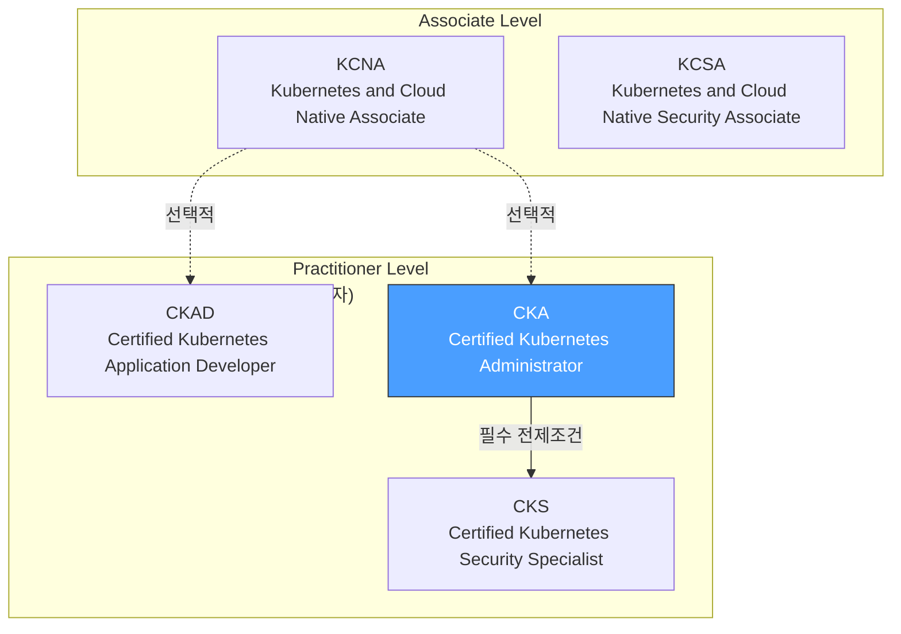
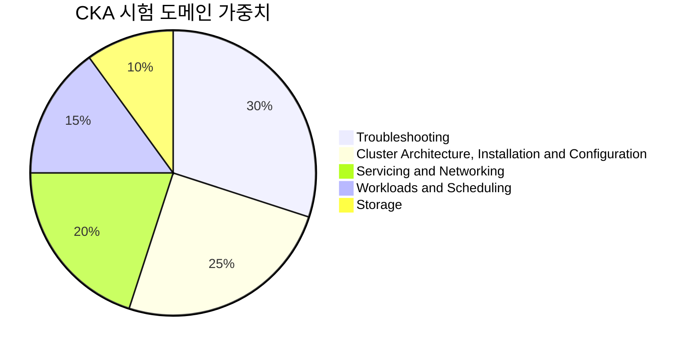
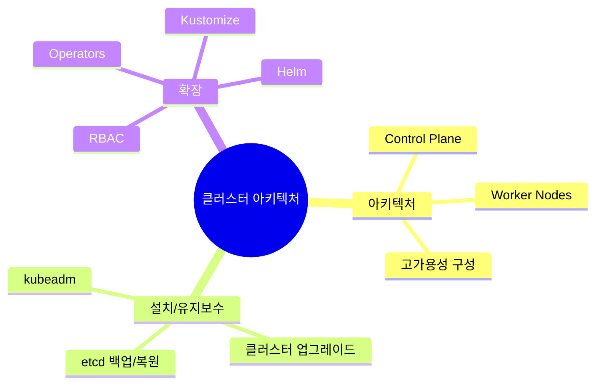
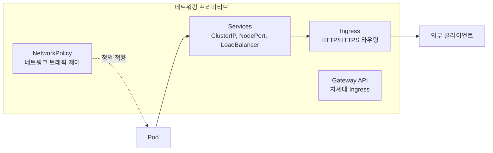
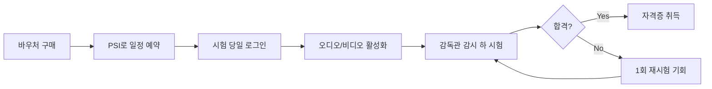
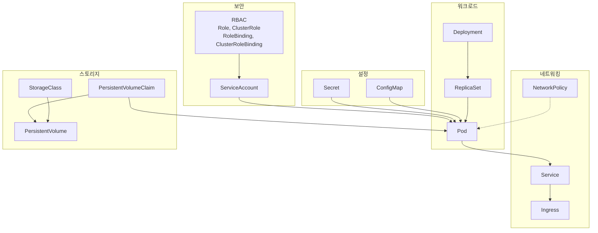

---

## 📌 핵심 요약
> 이 장에서는 **CKA(Certified Kubernetes Administrator) 시험의 상세 정보와 준비 리소스**를 다룬다. 핵심은 **5가지 시험 도메인과 가중치**를 이해하고, **시험 환경 및 시간 관리 전략**을 파악하며, **kubectl 사용 효율성**을 높이는 것이다.

## 🎯 학습 목표
이 내용을 읽고 나면:
- [ ] CNCF의 5가지 Kubernetes 자격증과 CKA의 위치를 설명할 수 있다
- [ ] CKA 시험의 5가지 도메인과 각각의 가중치를 알 수 있다
- [ ] 시험 중 허용되는 문서와 효율적인 활용 방법을 알 수 있다
- [ ] 시험 환경, 시간 관리 전략, 명령줄 팁을 적용할 수 있다
- [ ] 실습 환경 구축 및 연습 리소스를 활용할 수 있다

## 📖 본문 정리

### 1. Kubernetes 자격증 학습 경로

CNCF는 5가지 Kubernetes 자격증을 제공하며, 대상 청중과 난이도에 따라 분류된다.



#### 자격증 비교

| 자격증 | 대상 | 형식 | 주요 내용 |
|--------|------|------|-----------|
| **KCNA** | 클라우드/K8s 입문자 | 객관식 | 클라우드 네이티브 개발, 런타임, 도구 |
| **KCSA** | 보안 입문자 | 객관식 | 보안 개념 및 K8s 적용 |
| **CKAD** | 개발자 | 실습 | 마이크로서비스 빌드, 설정, 배포 |
| **CKA** | 관리자/SRE/DevOps | 실습 | 클러스터, 네트워크, 스토리지, 보안, 트러블슈팅 |
| **CKS** | 보안 전문가 | 실습 | 컨테이너 보안, K8s 런타임 보안 (CKA 필수) |

> 💬 **Kubestronaut**: 5개 자격증을 모두 취득하면 Kubestronaut 프로그램에 인정받을 수 있다.

---

### 2. CKA 시험 목표 및 커리큘럼

CKA는 **Kubernetes 관리자**의 역량을 검증하며, 클러스터 유지보수, 네트워킹, 스토리지 솔루션, 트러블슈팅에 중점을 둔다.

#### 시험 정보

| 항목 | 내용 |
|------|------|
| **Kubernetes 버전** | 1.33 (집필 시점) |
| **시험 시간** | 2시간 |
| **문제 수** | 15-20개 (성능 기반 실습) |
| **문제당 평균 시간** | 약 6-8분 |
| **시험 방식** | 온라인, 실시간 Kubernetes 클러스터에서 실습 |
| **재시험** | 바우처당 2회 시도 가능 |

#### 도메인별 가중치



| 순위 | 도메인 | 가중치 | 핵심 내용 |
|------|--------|--------|-----------|
| 1 | **Troubleshooting** | 30% | 애플리케이션/클러스터 노드 문제 진단 및 해결 |
| 2 | **Cluster Architecture, Installation and Configuration** | 25% | 아키텍처, 설치, 업그레이드, etcd 백업/복원, RBAC |
| 3 | **Servicing and Networking** | 20% | Services, Ingress, NetworkPolicy, Gateway API |
| 4 | **Workloads and Scheduling** | 15% | Deployments, ReplicaSets, ConfigMaps, Secrets, 스케줄링 |
| 5 | **Storage** | 10% | PV, PVC, StorageClass, 정적/동적 프로비저닝 |

---

### 3. 도메인별 상세 내용

#### 3.1 Cluster Architecture, Installation and Configuration (25%)



#### 3.2 Workloads and Scheduling (15%)

| 개념 | 설명 |
|------|------|
| **Deployments** | 애플리케이션 배포 및 업데이트 관리 |
| **ReplicaSets** | Pod 복제본 수 유지 |
| **ConfigMaps** | 설정 데이터 관리 |
| **Secrets** | 민감한 데이터 관리 |
| **Node Affinity** | Pod를 특정 노드에 스케줄링 |
| **Taints/Tolerations** | 노드에 제약 조건 설정 |

#### 3.3 Servicing and Networking (20%)



#### 3.4 Storage (10%)

| 개념 | 설명 |
|------|------|
| **Volume** | 컨테이너에 마운트되는 저장소 |
| **Persistent Volume (PV)** | 클러스터 수준의 스토리지 리소스 |
| **Persistent Volume Claim (PVC)** | PV에 대한 요청 |
| **StorageClass** | 동적 프로비저닝을 위한 스토리지 클래스 |

#### 3.5 Troubleshooting (30%)

**가장 높은 가중치** - 실제 시나리오에서 문제 진단 및 해결 능력 평가

- 애플리케이션 오작동/무응답 해결
- 클러스터 노드 충돌/설정 문제 해결
- 효과적인 트러블슈팅 전략 개발

---

### 4. 시험 중 허용 문서

| 리소스 | URL |
|--------|-----|
| **Kubernetes 공식 문서** | https://kubernetes.io/docs |
| **Kubernetes 블로그** | https://kubernetes.io/blog |
| **Helm 문서** | https://helm.sh/docs |

> 💡 **효율적인 문서 활용 팁**:
> - 메뉴 탐색보다 **검색 기능**을 활용하면 더 빠르게 찾을 수 있다
> - 코드 스니펫 복사/붙여넣기 가능 (YAML 들여쓰기 수동 조정 필요할 수 있음)
> - 시험 전 문서를 최소 1회 전체 읽어볼 것

---

### 5. 시험 환경 및 팁

#### 시험 진행 방식



#### 필수 배경 지식

| 분야 | 필요 지식 |
|------|-----------|
| **Kubernetes 아키텍처** | 컴포넌트, 개념 이해 |
| **kubectl CLI** | 명령어 및 옵션 숙달 |
| **클러스터 유지보수 도구** | kubeadm, etcdctl, etcdutl |
| **컨테이너 런타임** | containerd, 이미지와 컨테이너 차이 |
| **Linux 기초** | 파일 시스템, vi/vim, 프로세스 관리, 네트워킹 명령어 |

#### Linux 필수 명령어

| 카테고리 | 명령어 |
|----------|--------|
| **텍스트 처리** | grep, awk, sed |
| **파일 조작** | cat, less, head, tail |
| **편집기** | vi, vim |
| **프로세스** | ps, top, htop |
| **네트워킹** | netstat, curl, wget, ssh |
| **쉘** | 파이핑(\|), 리다이렉션(>, >>), 환경변수 |

---

### 6. 시간 관리 전략

#### 문제당 시간 배분

```
2시간 = 120분
15-20 문제
→ 문제당 평균 6-8분
```

#### 3가지 접근 전략

| 전략 | 방법 | 장점 |
|------|------|------|
| **전체 스캔 우선** | 모든 문제를 먼저 읽고 난이도 파악 → 쉬운 것부터 풀기 | 자신감 확보, 빠른 점수 획득 |
| **순서대로 타임박스** | 문제당 4-5분 엄격히 제한, 미완료 시 마킹 후 다음으로 | 시간 낭비 방지 |
| **하이브리드** | 전체 스캔 + 타임박스 + 3차 재방문 | 유연한 대응 |

> ⚠️ **핵심**: 어려운 문제에 초반에 막히지 않는 것이 중요. 부분 점수가 있으므로 모든 문제 시도가 중요!

---

### 7. 명령줄 팁과 트릭

#### 7.1 컨텍스트 및 네임스페이스 설정

시험 환경에는 **여러 Kubernetes 클러스터**가 설정되어 있다. 문제 풀이 전 반드시 설정할 것!

```bash
# 컨텍스트와 네임스페이스 설정
$ kubectl config set-context <context-of-question> \
  --namespace=<namespace-of-question>

# 컨텍스트 사용
$ kubectl config use-context <context-of-question>
```

#### 7.2 kubectl 별칭 사용

시험 환경에서는 `k` 별칭이 이미 설정되어 있다.

```bash
# 로컬 연습 시 설정
$ alias k=kubectl
$ k version
```

#### 7.3 자동 완성 활성화

시험 환경에서는 자동 완성이 기본 활성화되어 있다.

```bash
# 로컬 연습 시 설정 (bash)
$ source <(kubectl completion bash)
$ echo "source <(kubectl completion bash)" >> ~/.bashrc
```

#### 7.4 리소스 축약어 활용

```bash
# 축약어 목록 확인
$ kubectl api-resources
NAME                    SHORTNAMES  APIGROUP  NAMESPACED  KIND
persistentvolumeclaims  pvc                   true        PersistentVolumeClaim
configmaps              cm                    true        ConfigMap
services                svc                   true        Service
...

# 축약어 사용 예시
$ kubectl describe pvc my-claim    # persistentvolumeclaims 대신
$ kubectl get svc                  # services 대신
$ kubectl get cm                   # configmaps 대신
```

#### 주요 축약어 정리

| 전체 명령어 | 축약어 |
|-------------|--------|
| nodes | no |
| pods | po |
| services | svc |
| deployments | deploy |
| replicasets | rs |
| configmaps | cm |
| secrets | - |
| persistentvolumes | pv |
| persistentvolumeclaims | pvc |
| namespaces | ns |
| endpoints | ep |
| ingresses | ing |
| networkpolicies | netpol |

---

### 8. 실습 환경 및 연습 리소스

#### 로컬 실습 환경

| 도구 | 설명 |
|------|------|
| **Minikube** | 단일 노드 K8s, Ingress/StorageClass 등 애드온 지원 |
| **kind** | Docker 컨테이너 기반 로컬 K8s |
| **Vagrant + VirtualBox** | 다중 VM 기반 격리된 K8s 환경 |

#### 연습 리소스

| 리소스 | 설명 | 비용 |
|--------|------|------|
| **Killer Shell** | 시험 시뮬레이터, 바우처 구매 시 2회 무료 세션 | 무료/유료 |
| **Killercoda** | 커뮤니티 기여 인터랙티브 시나리오 | 무료 |
| **O'Reilly Learning Platform** | K8s 샌드박스, CKA 연습 테스트 | 구독 |
| **KodeKloud** | 비디오 코스 + 연습 환경 | 구독 |
| **A Cloud Guru** | 비디오 코스 + 연습 환경 | 구독 |

---

### 9. Kubernetes 프리미티브 관계도



---

## 🔍 심화 학습

### 추가 조사 내용

- **Kubernetes 릴리스 노트**: 시험 전 해당 버전의 변경사항 확인 필수
- **etcd 백업/복원**: 클러스터 관리의 핵심 기술
- **kubeadm**: 클러스터 설치 및 업그레이드 도구

### 출처
- [Kubernetes 공식 문서](https://kubernetes.io/docs)
- [CKA Exam FAQ](https://docs.linuxfoundation.org/tc-docs/certification/faq-cka-ckad-cks)
- [CNCF Training](https://www.cncf.io/training/certification/cka/)
- [Killer Shell](https://killer.sh/)

---

## 💡 실무 적용 포인트

### 시험 준비 체크리스트
- ✅ Kubernetes 아키텍처 및 개념 이해
- ✅ kubectl 명령어 및 옵션 숙달
- ✅ kubeadm, etcdctl 사용법 습득
- ✅ Linux 명령줄 능숙
- ✅ 공식 문서 탐색 연습
- ✅ Killer Shell 등 시뮬레이터로 실전 연습

### 주의할 점 / 흔한 실수
- ⚠️ 문제 풀이 전 **컨텍스트와 네임스페이스** 설정을 반드시 확인
- ⚠️ 어려운 문제에 너무 오래 매달리지 말 것 (타임박스 적용)
- ⚠️ 문서에서 복사한 YAML의 **들여쓰기** 확인 필수
- ⚠️ `kubectl` 축약어와 자동 완성 적극 활용
- ⚠️ ssh로 노드 접속 시 작업 완료 후 **exit** 잊지 말 것

### 면접에서 나올 수 있는 질문
- Q: CKA 시험의 5가지 도메인과 각각의 가중치는?
- Q: 시험 중 어떤 문서를 참조할 수 있는가?
- Q: kubectl의 축약어 사용 이점은?
- Q: 시험 시간 관리를 위한 전략은?
- Q: CKA와 CKAD의 차이점은?

---

## ✅ 핵심 개념 체크리스트
- [ ] CNCF의 5가지 Kubernetes 자격증을 나열하고 CKA의 위치를 설명할 수 있는가?
- [ ] CKA 시험의 5가지 도메인과 가중치를 알고 있는가?
- [ ] 시험 중 허용되는 문서 URL 3가지를 알고 있는가?
- [ ] kubectl 컨텍스트/네임스페이스 설정 명령어를 알고 있는가?
- [ ] kubectl 축약어 (pvc, svc, deploy 등)를 사용할 수 있는가?
- [ ] 시험 시간 관리 전략을 이해하고 있는가?
- [ ] 필수 배경 지식 (Linux, kubectl, kubeadm 등)을 갖추고 있는가?
- [ ] 실습 환경 (Minikube, kind, Killer Shell)을 구축할 수 있는가?

---

## 🔗 참고 자료
- 📄 공식 문서: [Kubernetes Documentation](https://kubernetes.io/docs)
- 📄 시험 정보: [CKA Certification](https://www.cncf.io/training/certification/cka/)
- 📄 시험 FAQ: [Linux Foundation Docs](https://docs.linuxfoundation.org/tc-docs/certification/faq-cka-ckad-cks)
- 📄 Killer Shell: [CKA Simulator](https://killer.sh/)
- 📄 Killercoda: [Interactive Scenarios](https://killercoda.com/)
- 📚 무료 과정: [Introduction to Kubernetes (CNCF)](https://www.cncf.io/training/courses/introduction-to-kubernetes/)

---
