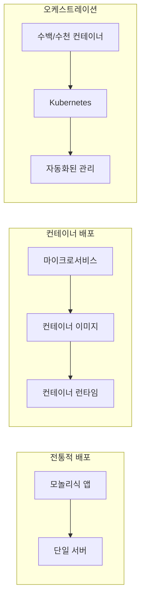
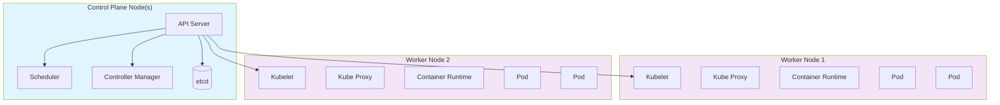
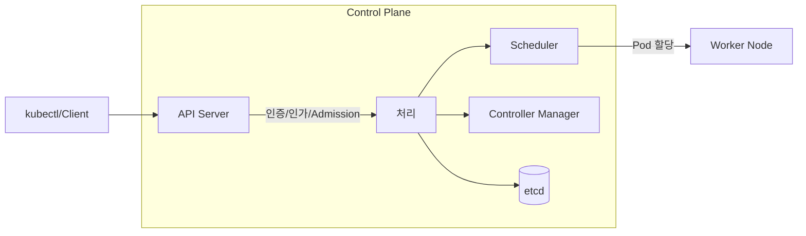
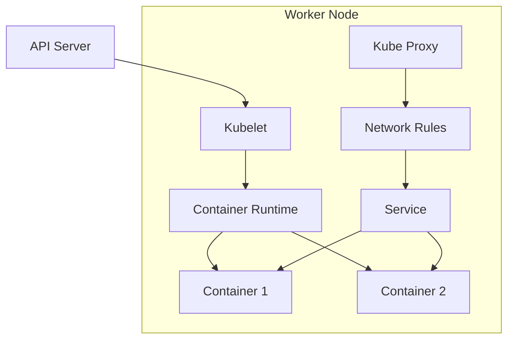

---

## 📌 핵심 요약
> 이 장에서는 Kubernetes의 기본 개념과 작동 원리를 다룬다. 핵심은 **마이크로서비스와 컨테이너의 관계**, **Kubernetes 클러스터 아키텍처(Control Plane/Worker Node)**, 그리고 **각 노드 컴포넌트의 역할**을 이해하는 것이다.

## 🎯 학습 목표
이 내용을 읽고 나면:
- [ ] Kubernetes가 무엇이고 왜 필요한지 설명할 수 있다
- [ ] Control Plane Node와 Worker Node의 차이를 설명할 수 있다
- [ ] 각 노드 컴포넌트(API Server, Scheduler, etcd, Kubelet 등)의 역할을 이해한다
- [ ] Kubernetes의 주요 기능(선언적 모델, 자동 스케일링, 네트워킹 등)을 나열할 수 있다
- [ ] Kubernetes 사용의 장점을 설명할 수 있다

## 📖 본문 정리

### 1. Kubernetes란?

#### 배경: 마이크로서비스와 컨테이너



| 개념 | 설명 | 도구 예시 |
|------|------|-----------|
| **마이크로서비스** | 애플리케이션을 독립적인 서비스로 분리하여 개발/운영 | - |
| **컨테이너 이미지** | 소프트웨어 아티팩트를 패키징 | buildkit, Podman |
| **컨테이너 런타임** | 이미지를 사용해 컨테이너 실행 | Docker Engine, containerd |
| **컨테이너 오케스트레이션** | 수백/수천 개 컨테이너를 관리 | **Kubernetes** |

> 💡 **Pod**: Kubernetes의 가장 핵심적인 기본 단위(primitive). 하나 이상의 컨테이너를 실행하면서 보안 요구사항, 리소스 소비 등 횡단 관심사(cross-cutting concerns)를 관리한다.

---

### 2. Kubernetes 주요 기능

| 기능 | 설명 | 특징 |
|------|------|------|
| **선언적 모델 (Declarative Model)** | 원하는 상태를 YAML/JSON으로 선언 | 프로그래밍 언어 불필요, 자동 복구 |
| **자동 스케일링 (Autoscaling)** | 부하에 따라 리소스 자동 조절 | 수동/자동 스케일링 지원 |
| **애플리케이션 관리** | 새 버전 롤아웃, 롤백 지원 | 복제(replication) 기능 |
| **영구 스토리지 (Persistent Storage)** | 컨테이너 재시작 후에도 데이터 유지 | 스토리지 마운트 기능 |
| **네트워킹** | 컨테이너 간, 외부-컨테이너 간 통신 | 내부/외부 로드 밸런싱 |

#### 선언적 모델 예시
```yaml
# 원하는 상태를 선언 - Kubernetes가 이 상태를 유지
apiVersion: apps/v1
kind: Deployment
metadata:
  name: my-app
spec:
  replicas: 3  # 3개의 Pod 유지
  selector:
    matchLabels:
      app: my-app
  template:
    metadata:
      labels:
        app: my-app
    spec:
      containers:
      - name: my-app
        image: my-app:v1.0
```

---

### 3. 고수준 아키텍처



#### 노드 유형 비교

| 구분 | Control Plane Node | Worker Node |
|------|-------------------|-------------|
| **주요 역할** | API 노출, 클러스터 관리, 이벤트 응답 | 워크로드(컨테이너) 실행 |
| **워크로드 실행** | 일반적으로 실행 안 함 | 실행 |
| **컨테이너 런타임** | 선택적 | 필수 |
| **프로덕션 구성** | HA를 위해 3개 이상 권장 | 애플리케이션 요구에 따라 결정 |

---

### 4. Control Plane Node 컴포넌트



| 컴포넌트 | 역할 | 핵심 포인트 |
|----------|------|-------------|
| **API Server** | API 엔드포인트 노출, 클라이언트 통신 처리 | 인증, 인가, Admission Control 수행 |
| **Scheduler** | 노드가 할당되지 않은 Pod를 감시하고 Worker Node에 할당 | 백그라운드 프로세스 |
| **Controller Manager** | 클러스터 상태 감시, 필요시 변경 적용 | Desired State 유지 |
| **etcd** | 클러스터 상태 데이터 영구 저장 | Key-Value 저장소, 오픈소스 |

> 🔑 **etcd의 중요성**: 노드 또는 전체 클러스터 재시작 시 상태를 복구하기 위해 모든 클러스터 데이터를 저장한다.

---

### 5. 공통 노드 컴포넌트

모든 노드(Control Plane & Worker)에서 사용되는 컴포넌트:

| 컴포넌트 | 역할 | 설명 |
|----------|------|------|
| **Kubelet** | Pod 내 컨테이너 실행 보장 | Kubernetes와 컨테이너 런타임 사이의 **접착제** |
| **Kube Proxy** | 네트워크 규칙 유지, 통신 활성화 | Service 개념 구현 (Chapter 17) |
| **Container Runtime** | 컨테이너 관리 소프트웨어 | containerd, CRI-O 등 |



#### Kubelet의 역할
- 모든 노드에서 실행 (Worker Node에서 가장 중요)
- 컨테이너가 실행 중이고 건강한지(healthy) 확인
- Kubernetes ↔ Container Runtime 간 중개자

---

### 6. Kubernetes의 장점

| 장점 | 설명 |
|------|------|
| **이식성 (Portability)** | 온프레미스, 클라우드 어디서든 실행 가능. 플랫폼 변경 시 앱 재작성 불필요 |
| **복원력 (Resilience)** | 선언적 상태 머신. Controller가 현재 상태를 원하는 상태로 유지 |
| **확장성 (Scalability)** | 수요에 따라 Pod 수 조절 (수동/자동) |
| **API 기반 (API-based)** | 모든 기능이 API로 노출. 새 클라이언트 구현 용이 |
| **확장성 (Extensibility)** | 커스텀 기능 구현 가능 (모니터링, 로깅 솔루션 등) |

> ⚠️ **주의**: 클라우드별 제품 특화 기능 사용 시 플랫폼 간 이동이 어려워질 수 있다.

---

### 7. 핵심 용어 정리

| 용어 | 정의 |
|------|------|
| **Pod** | Kubernetes의 가장 기본적인 배포 단위, 1개 이상의 컨테이너 포함 |
| **Control Plane** | 클러스터 관리를 담당하는 노드 집합 |
| **Worker Node** | 실제 워크로드를 실행하는 노드 |
| **Declarative Model** | 원하는 상태를 선언하면 Kubernetes가 자동으로 유지 |
| **Reconciliation Loop** | Controller가 현재 상태를 원하는 상태로 맞추는 과정 |

---

## 🔍 심화 학습

### 추가 조사 내용
- **Container Runtime Interface (CRI)**: Kubernetes와 컨테이너 런타임 간의 표준 인터페이스
- **고가용성(HA) 아키텍처**: 프로덕션 환경에서 Control Plane 3개 이상 구성하는 이유
- **Add-ons**: 클러스터 DNS, 모니터링, 로깅 등 추가 기능

### 출처
- [Kubernetes 공식 문서 - Components](https://kubernetes.io/docs/concepts/overview/components/)
- [Kubernetes 공식 문서 - Cluster Architecture](https://kubernetes.io/docs/concepts/architecture/)

---

## 💡 실무 적용 포인트

### 이런 상황에서 기억하세요
- **CKA 시험**: 각 컴포넌트의 역할과 위치를 정확히 알아야 트러블슈팅 가능
- **클러스터 설계**: Control Plane과 Worker Node의 적절한 수와 구성 결정
- **장애 대응**: etcd 백업/복구, API Server 상태 확인 등

### 주의할 점 / 흔한 실수
- ⚠️ Control Plane Node에서 워크로드를 실행하는 것은 권장되지 않음
- ⚠️ etcd 데이터 손실 시 전체 클러스터 상태 복구 불가 → 정기 백업 필수
- ⚠️ 클라우드 특화 기능 과다 사용 시 이식성 감소

### 면접에서 나올 수 있는 질문
- Q: Kubernetes의 Control Plane 컴포넌트를 설명하세요.
- Q: Kubelet의 역할은 무엇인가요?
- Q: 선언적 모델(Declarative Model)이란 무엇이고 장점은?
- Q: etcd는 무엇이고 왜 중요한가요?
- Q: Kubernetes의 복원력(Resilience)은 어떻게 보장되나요?

---

## ✅ 핵심 개념 체크리스트
- [ ] Kubernetes가 해결하는 문제(컨테이너 오케스트레이션)를 설명할 수 있는가?
- [ ] Control Plane Node의 4가지 컴포넌트(API Server, Scheduler, Controller Manager, etcd)를 나열할 수 있는가?
- [ ] 공통 노드 컴포넌트(Kubelet, Kube Proxy, Container Runtime)의 역할을 설명할 수 있는가?
- [ ] 선언적 모델의 의미와 장점을 이해하는가?
- [ ] Kubernetes의 5가지 장점을 설명할 수 있는가?

---

## 🔗 참고 자료
- 📄 공식 문서: [Kubernetes Components](https://kubernetes.io/docs/concepts/overview/components/)
- 📄 아키텍처: [Cluster Architecture](https://kubernetes.io/docs/concepts/architecture/)
- 📄 Pod 개념: [Pods](https://kubernetes.io/docs/concepts/workloads/pods/)
- 📘 관련 챕터: Chapter 9 (Pod 보안 및 리소스), Chapter 6 (API 인증/인가), Chapter 17 (Service)

---
