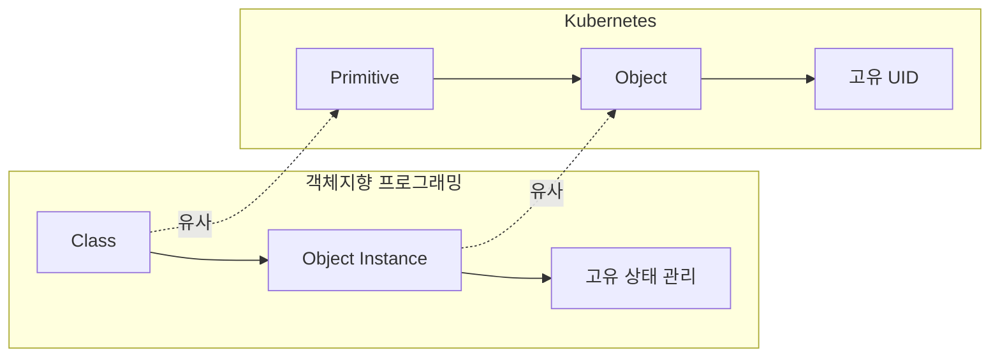
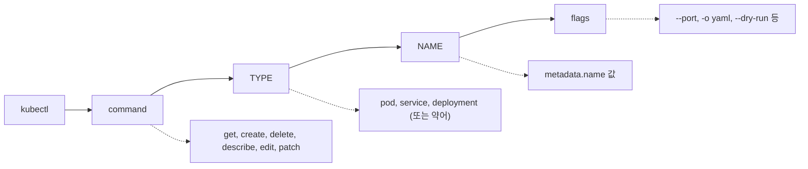
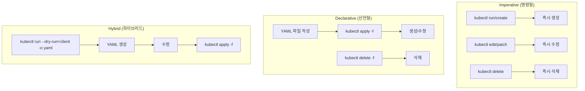
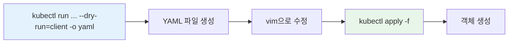
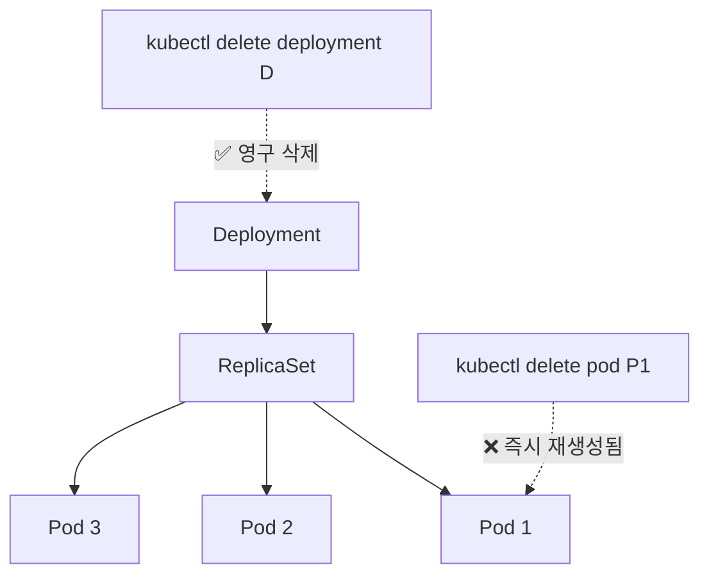

---

## 📌 핵심 요약
> 이 장에서는 kubectl을 사용한 Kubernetes 클러스터 상호작용 방법을 다룬다. 핵심은 **API Primitives와 Object 구조 이해**, **kubectl 명령어 패턴 숙지**, 그리고 **명령형(Imperative) vs 선언형(Declarative) 객체 관리 방식**의 차이와 활용법을 익히는 것이다.

## 🎯 학습 목표
이 내용을 읽고 나면:
- [ ] Kubernetes Primitive와 Object의 관계를 설명할 수 있다
- [ ] YAML 매니페스트의 5가지 구조(apiVersion, kind, metadata, spec, status)를 이해한다
- [ ] kubectl 명령어 패턴(command, TYPE, NAME, flags)을 활용할 수 있다
- [ ] 명령형(Imperative)과 선언형(Declarative) 객체 관리 방식의 차이를 설명할 수 있다
- [ ] 하이브리드 접근법(--dry-run)을 사용하여 효율적으로 작업할 수 있다

## 📖 본문 정리

### 1. API Primitives와 Objects

#### 개념 비교: OOP vs Kubernetes



| OOP 개념 | Kubernetes 개념 | 설명 |
|----------|-----------------|------|
| Class | Primitive | 설계도, 타입 정의 (Pod, Deployment, Service 등) |
| Object Instance | Object | 실제 생성된 인스턴스 |
| 고유 식별자 | UID | 시스템이 자동 생성하는 고유 식별자 |

> 💡 **예시**: Pod는 Primitive(클래스)이고, "frontend"라는 이름의 Pod 인스턴스는 Object이다.

---

### 2. Kubernetes Object 구조

모든 Kubernetes 객체는 YAML 매니페스트로 정의되며, 다음 5가지 섹션으로 구성된다:

```yaml
apiVersion: v1          # API 버전
kind: Pod               # 리소스 종류
metadata:               # 메타데이터
  name: frontend
  namespace: default
  labels:
    app: web
spec:                   # 원하는 상태 (Desired State)
  containers:
  - name: nginx
    image: nginx:1.29.0
status: {}              # 실제 상태 (Actual State)
```

| 섹션 | 역할 | 핵심 포인트 |
|------|------|-------------|
| **apiVersion** | 데이터 구조 및 유효성 검증 | alpha → beta → stable 성숙도 |
| **kind** | 리소스 타입 정의 | Pod, Service, Deployment 등 |
| **metadata** | 상위 정보 (이름, 네임스페이스, 레이블, UID) | 객체 식별에 사용 |
| **spec** | 원하는 상태 선언 | "이렇게 되어야 한다" |
| **status** | 실제 상태 | Kubernetes가 자동 관리, `{}`이면 미생성 |

```bash
# 클러스터에서 사용 가능한 API 버전 확인
$ kubectl api-versions
```

---

### 3. kubectl 사용법

#### 기본 명령어 패턴

```
kubectl [command] [TYPE] [NAME] [flags]
```



| 구성요소 | 설명 | 예시 |
|----------|------|------|
| **command** | 수행할 작업 | `create`, `get`, `describe`, `delete`, `edit`, `patch` |
| **TYPE** | 리소스 타입 (전체 또는 약어) | `service` 또는 `svc` |
| **NAME** | 객체 이름 (metadata.name) | `frontend`, `nginx-deployment` |
| **flags** | 추가 옵션 | `--port=80`, `-o yaml`, `--dry-run=client` |

#### 실용적인 명령어: kubectl explain

```bash
# 리소스 스펙 즉시 확인 (문서 검색 없이!)
$ kubectl explain pods.spec.containers
$ kubectl explain deployment.spec.strategy.rollingUpdate

# 전체 필드 목록
$ kubectl explain pod --recursive
```

> 🎯 **시험 팁**: `kubectl explain`은 필드명 확인, 타입 검증, 중첩 구조 이해에 필수. 문서 검색 시간 절약!

---

### 4. 객체 관리 방식



---

### 5. 명령형(Imperative) 객체 관리

YAML 매니페스트 없이 명령어만으로 객체 관리:

#### 생성 (run/create)

```bash
# Pod 생성
$ kubectl run frontend --image=nginx:1.29.0 --port=80
pod/frontend created
```

#### 수정 (edit/patch)

```bash
# 편집기로 수정 (vi/notepad)
$ kubectl edit pod frontend

# JSON 패치로 특정 속성 수정
$ kubectl patch pod frontend -p '{"spec":{"containers":[{"name":"frontend","image":"nginx:1.29.2"}]}}'
pod/frontend patched
```

#### 삭제 (delete)

```bash
# 일반 삭제 (graceful, 기본 30초)
$ kubectl delete pod frontend

# 즉시 삭제 (시험에서 시간 절약!)
$ kubectl delete pod nginx --now
```

> ⚠️ **시험 팁**: `--now` 옵션으로 즉시 삭제하여 시간 절약. Graceful 삭제 대기는 시간 낭비!

---

### 6. 선언형(Declarative) 객체 관리

YAML 매니페스트를 사용한 객체 관리:

#### 생성 (apply)

```bash
# 단일 파일에서 생성
$ kubectl apply -f nginx-deployment.yaml

# 디렉토리 내 모든 파일
$ kubectl apply -f app-stack/

# 재귀적으로 하위 디렉토리 포함
$ kubectl apply -f web-app/ -R

# URL에서 직접 생성
$ kubectl apply -f https://raw.githubusercontent.com/.../nginx-deployment.yaml
```

#### 디렉토리 구조 예시

```
.
├── app-stack/
│   ├── mysql-pod.yaml
│   ├── mysql-service.yaml
│   ├── web-app-pod.yaml
│   └── web-app-service.yaml
├── nginx-deployment.yaml
└── web-app/
    ├── config/
    │   ├── db-configmap.yaml
    │   └── db-secret.yaml
    └── web-app-pod.yaml
```

#### 수정 (apply)

```yaml
# nginx-deployment.yaml 수정
apiVersion: apps/v1
kind: Deployment
metadata:
  name: nginx-deployment
  labels:
    app: nginx
    team: red        # 새 레이블 추가
spec:
  replicas: 5        # 3에서 5로 변경
...
```

```bash
# 변경사항 적용
$ kubectl apply -f nginx-deployment.yaml
deployment.apps/nginx-deployment configured
```

#### 삭제 (delete -f)

```bash
$ kubectl delete -f nginx-deployment.yaml
deployment.apps "nginx-deployment" deleted
```

> 🔑 **last-applied-configuration**: `apply` 명령은 `kubectl.kubernetes.io/last-applied-configuration` 어노테이션에 변경 이력을 저장한다.

---

### 7. kubectl create vs kubectl apply

| 구분 | kubectl create | kubectl apply |
|------|----------------|---------------|
| **동작 방식** | 명령형 (Imperative) | 선언형 (Declarative) |
| **객체 존재 시** | 에러 발생 ❌ | 업데이트 적용 ✅ |
| **멱등성** | 없음 | 있음 (Idempotent) |
| **사용 시나리오** | 일회성 리소스 생성 | 지속적인 리소스 관리 |
| **권장 상황** | 시험, 빠른 테스트 | 프로덕션 환경 |

---

### 8. 하이브리드 접근법 (Hybrid Approach)

명령형의 속도 + 선언형의 유연성 결합:

```bash
# 1. 명령형으로 YAML 생성 (실제로 생성하지 않음)
$ kubectl run frontend --image=nginx:1.29.2 --port=80 \
  -o yaml --dry-run=client > pod.yaml

# 2. YAML 파일 수정
$ vim pod.yaml

# 3. 선언형으로 적용
$ kubectl apply -f pod.yaml
pod/frontend created
```



> 🎯 **시험 핵심 전략**: `--dry-run=client -o yaml` 조합으로 빠르게 YAML 템플릿 생성 후 필요한 부분만 수정!

---

### 9. 어떤 접근법을 사용할까?

| 상황 | 권장 접근법 | 이유 |
|------|-------------|------|
| **CKA 시험** | 명령형 (Imperative) | 빠른 속도, 시간 절약 |
| **복잡한 설정 필요** | 하이브리드 | 명령형으로 시작 → YAML 수정 |
| **프로덕션 환경** | 선언형 (Declarative) | 버전 관리, 감사, 재현성 |
| **GitOps** | 선언형 (Declarative) | Argo CD, Flux 등과 연동 |

---

### 10. 주의사항: Controller가 관리하는 객체



> ⚠️ **중요**: ReplicaSet이나 Deployment가 관리하는 Pod를 직접 삭제하면 Controller가 자동으로 재생성한다. 상위 리소스(Deployment)를 삭제해야 영구 삭제된다!

---

### 11. 핵심 명령어 요약

| 작업 | 명령형 | 선언형 |
|------|--------|--------|
| **생성** | `kubectl run/create` | `kubectl apply -f` |
| **조회** | `kubectl get`, `kubectl describe` | 동일 |
| **수정** | `kubectl edit`, `kubectl patch` | `kubectl apply -f` (파일 수정 후) |
| **삭제** | `kubectl delete <type> <name>` | `kubectl delete -f` |
| **YAML 생성** | `--dry-run=client -o yaml` | - |

---

## 🔍 심화 학습

### 추가 조사 내용
- **GitOps**: Argo CD, Flux를 사용한 선언적 배포 자동화
- **Kustomize**: kubectl에 내장된 구성 관리 도구
- **Helm**: Kubernetes 패키지 매니저

### 출처
- [Kubernetes 공식 문서 - kubectl](https://kubernetes.io/docs/reference/kubectl/)
- [Kubernetes 공식 문서 - Object Management](https://kubernetes.io/docs/concepts/overview/working-with-objects/object-management/)

---

## 💡 실무 적용 포인트

### 이런 상황에서 기억하세요
- **CKA 시험**: 명령형 + `--dry-run=client -o yaml` 조합 최대 활용
- **시간 절약**: `kubectl delete --now`로 즉시 삭제
- **필드 확인**: `kubectl explain`으로 문서 검색 없이 즉시 확인

### 주의할 점 / 흔한 실수
- ⚠️ `kubectl create`는 이미 존재하는 객체에 대해 에러 발생
- ⚠️ Controller가 관리하는 Pod 직접 삭제 시 자동 재생성됨
- ⚠️ `--dry-run` 옵션은 반드시 `--dry-run=client` 형식 사용 (deprecated 경고 방지)

### 면접에서 나올 수 있는 질문
- Q: kubectl create와 kubectl apply의 차이점은?
- Q: 명령형과 선언형 객체 관리의 장단점을 설명하세요.
- Q: `--dry-run=client -o yaml`은 어떤 상황에서 유용한가요?
- Q: Kubernetes 객체의 5가지 구조적 요소를 설명하세요.
- Q: Deployment가 관리하는 Pod를 삭제하면 어떻게 되나요?

---

## ✅ 핵심 개념 체크리스트
- [ ] Primitive와 Object의 관계(Class:Instance)를 설명할 수 있는가?
- [ ] YAML 매니페스트의 5가지 섹션(apiVersion, kind, metadata, spec, status)을 알고 있는가?
- [ ] kubectl 명령어 패턴(command, TYPE, NAME, flags)을 활용할 수 있는가?
- [ ] `kubectl explain`으로 리소스 스펙을 확인할 수 있는가?
- [ ] 명령형 명령어(run, create, edit, patch, delete)를 사용할 수 있는가?
- [ ] 선언형 명령어(apply -f, delete -f)를 사용할 수 있는가?
- [ ] 하이브리드 접근법(--dry-run=client -o yaml)을 활용할 수 있는가?

---

## 🔗 참고 자료
- 📄 공식 문서: [kubectl Overview](https://kubernetes.io/docs/reference/kubectl/)
- 📄 명령어 참조: [kubectl Cheat Sheet](https://kubernetes.io/docs/reference/kubectl/cheatsheet/)
- 📄 객체 관리: [Object Management Using kubectl](https://kubernetes.io/docs/concepts/overview/working-with-objects/object-management/)
- 📘 GitHub: [CKA Study Guide Repository](https://github.com/bmuschko/cka-study-guide)

---
