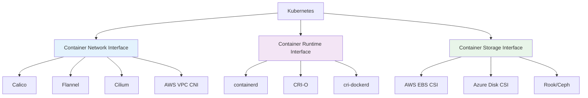
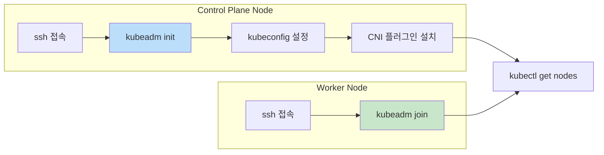
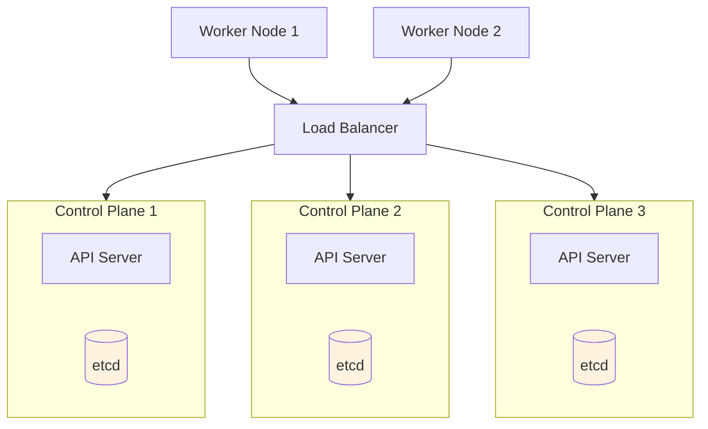
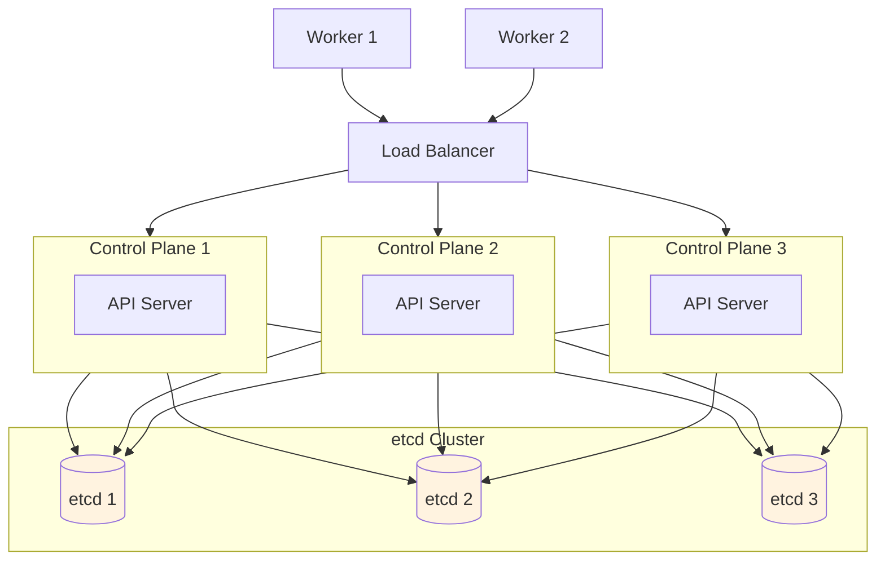
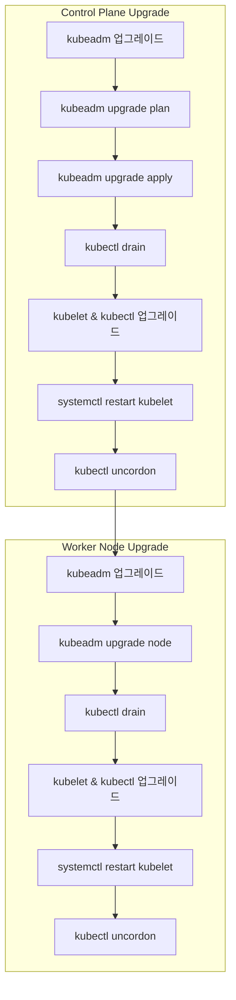

---

## 📌 핵심 요약
> 이 장에서는 Kubernetes 클러스터 설치, 유지보수, 업그레이드 방법을 다룬다. 핵심은 **확장 인터페이스(CNI, CRI, CSI) 이해**, **kubeadm을 사용한 클러스터 설치/업그레이드**, 그리고 **고가용성(HA) 클러스터 토폴로지**를 이해하는 것이다.

## 🎯 학습 목표
이 내용을 읽고 나면:
- [ ] CNI, CRI, CSI 확장 인터페이스의 역할을 설명할 수 있다
- [ ] kubeadm을 사용하여 클러스터를 설치할 수 있다
- [ ] CNI 플러그인(Flannel, Calico 등)을 설치할 수 있다
- [ ] 클러스터 버전을 업그레이드하는 절차를 수행할 수 있다
- [ ] 고가용성(HA) 클러스터 토폴로지를 이해한다

## 📖 본문 정리

### 1. 커리큘럼 목표

| 목표 | 설명 |
|------|------|
| 인프라 준비 | Kubernetes 클러스터 설치를 위한 기반 인프라 준비 |
| 확장 인터페이스 이해 | CNI, CSI, CRI 등의 인터페이스 이해 |
| kubeadm 클러스터 관리 | kubeadm을 사용한 클러스터 생성 및 관리 |
| 클러스터 라이프사이클 관리 | 버전 업그레이드 등 유지보수 |
| HA Control Plane 구성 | 고가용성 Control Plane 구현 및 설정 |

---

### 2. 확장 인터페이스 (Extension Interfaces)

Kubernetes는 모듈화되고 확장 가능한 아키텍처를 가진다. 핵심 인터페이스:



| 인터페이스 | 역할 | 주요 프로바이더 |
|------------|------|-----------------|
| **CNI** | Pod 간 네트워크 연결 설정 | Calico, Flannel, Cilium, AWS VPC CNI, Azure CNI |
| **CRI** | 컨테이너 런타임과 Kubernetes 간 상호작용 | containerd (기본), CRI-O, cri-dockerd |
| **CSI** | 블록/파일 스토리지 시스템 통합 | AWS EBS, Azure Disk, NetApp, Rook/Ceph (100+ 드라이버) |

> 💡 **CNI 필수**: Control Plane 노드에 CNI 플러그인을 설치해야 Pod 간 통신이 가능하다!

---

### 3. kubeadm을 사용한 클러스터 설치

#### 설치 프로세스 개요



#### Step 1: Control Plane 노드 초기화

```bash
# Control Plane 노드에 SSH 접속
$ ssh kube-control-plane

# kubeadm init 실행 (CIDR 및 API 서버 주소 지정)
$ sudo kubeadm init --pod-network-cidr=10.244.0.0/16

# kubeconfig 설정
$ mkdir -p $HOME/.kube
$ sudo cp -i /etc/kubernetes/admin.conf $HOME/.kube/config
$ sudo chown $(id -u):$(id -g) $HOME/.kube/config
```

> 🔑 **중요**: `kubeadm init` 출력에 나오는 `kubeadm join` 명령어를 저장해둘 것!

```bash
# join 명령어 분실 시 재생성
$ kubeadm token create --print-join-command
```

#### Step 2: CNI 플러그인 설치 (Flannel 예시)

**방법 1: kubectl apply (YAML 매니페스트)**
```bash
$ kubectl apply -f https://github.com/flannel-io/flannel/releases/latest/download/kube-flannel.yml
```

**방법 2: Helm 차트**
```bash
$ kubectl create ns kube-flannel
$ kubectl label --overwrite ns kube-flannel pod-security.kubernetes.io/enforce=privileged
$ helm repo add flannel https://flannel-io.github.io/flannel/
$ helm install flannel --set podCidr="10.244.0.0/16" --namespace kube-flannel flannel/flannel
```

```bash
# CNI Pod 상태 확인
$ kubectl get pods -n kube-flannel
NAME                    READY   STATUS    RESTARTS   AGE
kube-flannel-ds-h6455   1/1     Running   0          25s

# 노드 상태 확인 (Ready 확인)
$ kubectl get nodes
NAME                 STATUS   ROLES           AGE     VERSION
kube-control-plane   Ready    control-plane   5m31s   v1.31.1
```

#### Step 3: Worker 노드 Join

```bash
# Worker 노드에 SSH 접속
$ ssh kube-worker-1

# kubeadm join 실행 (init에서 제공된 명령어)
$ sudo kubeadm join 172.16.0.5:6443 --token fi8io0.dtkzsy9kws56dmsp \
    --discovery-token-ca-cert-hash sha256:cc89ea1f82d5ec460e21b69476e0c052d691d0c52cce83fbd7e403559c1ebdac
```

```bash
# Control Plane에서 노드 확인
$ kubectl get nodes
NAME                 STATUS   ROLES           AGE     VERSION
kube-control-plane   Ready    control-plane   2m14s   v1.31.1
kube-worker-1        Ready    <none>          6m43s   v1.31.1
```

---

### 4. 고가용성(HA) 클러스터 토폴로지

#### 왜 HA가 필요한가?

| 문제 | 단일 Control Plane | HA Control Plane |
|------|-------------------|------------------|
| Control Plane 손실 시 | 클러스터 접근 불가, Pod 재생성 불가 | 다른 노드가 역할 대체 |
| 확장성 | 제한적 | 향상됨 |
| API Server 접근 | 단일 장애점 | Load Balancer 통해 분산 |

#### Topology 1: Stacked etcd



| 특징 | 설명 |
|------|------|
| etcd 위치 | Control Plane 노드에 같이 위치 (colocated) |
| 최소 권장 노드 수 | 3개 (redundancy) |
| 장점 | 간단한 구성, 호스트 수 절약 |
| 단점 | etcd와 Control Plane이 밀접하게 결합 |

#### Topology 2: External etcd



| 특징 | 설명 |
|------|------|
| etcd 위치 | 별도의 전용 머신에서 실행 |
| 호스트 수 | Stacked 대비 2배 필요 |
| 장점 | etcd와 Control Plane 분리로 더 나은 redundancy |
| 단점 | 더 많은 인프라 필요 |

---

### 5. 클러스터 버전 업그레이드

#### 업그레이드 규칙

| 규칙 | 설명 | 예시 |
|------|------|------|
| ✅ Minor +1 | 한 번에 하나의 마이너 버전만 업그레이드 | 1.31.0 → 1.32.0 |
| ✅ Patch +N | 여러 패치 버전은 가능 | 1.31.0 → 1.31.3 |
| ❌ Skip Minor | 마이너 버전 건너뛰기 금지 | 1.31.0 → 1.33.0 ❌ |

#### 업그레이드 프로세스



#### Control Plane 노드 업그레이드 명령어

```bash
# 1. 업그레이드 가능한 버전 확인
$ sudo apt update
$ sudo apt-cache madison kubeadm

# 2. kubeadm 업그레이드
$ sudo apt-mark unhold kubeadm && \
  sudo apt-get update && \
  sudo apt-get install -y kubeadm=1.31.5-1.1 && \
  sudo apt-mark hold kubeadm

# 3. 업그레이드 계획 확인
$ sudo kubeadm upgrade plan

# 4. 업그레이드 적용
$ sudo kubeadm upgrade apply v1.31.5

# 5. 노드 drain (워크로드 축출)
$ kubectl drain kube-control-plane --ignore-daemonsets

# 6. kubelet & kubectl 업그레이드
$ sudo apt-mark unhold kubelet kubectl && \
  sudo apt-get update && \
  sudo apt-get install -y kubelet=1.31.5-1.1 kubectl=1.31.5-1.1 && \
  sudo apt-mark hold kubelet kubectl

# 7. kubelet 재시작
$ sudo systemctl daemon-reload
$ sudo systemctl restart kubelet

# 8. 노드 uncordon (스케줄링 재활성화)
$ kubectl uncordon kube-control-plane
```

#### Worker 노드 업그레이드 명령어

```bash
# 1. kubeadm 업그레이드 (Control Plane과 동일)
$ sudo apt-mark unhold kubeadm && \
  sudo apt-get update && \
  sudo apt-get install -y kubeadm=1.31.5-1.1 && \
  sudo apt-mark hold kubeadm

# 2. 노드 구성 업그레이드
$ sudo kubeadm upgrade node

# 3. 노드 drain
$ kubectl drain kube-worker-1 --ignore-daemonsets

# 4. kubelet & kubectl 업그레이드
$ sudo apt-mark unhold kubelet kubectl && \
  sudo apt-get update && \
  sudo apt-get install -y kubelet=1.31.5-1.1 kubectl=1.31.5-1.1 && \
  sudo apt-mark hold kubelet kubectl

# 5. kubelet 재시작
$ sudo systemctl daemon-reload
$ sudo systemctl restart kubelet

# 6. 노드 uncordon
$ kubectl uncordon kube-worker-1
```

---

### 6. 핵심 명령어 요약

| 작업 | 명령어 |
|------|--------|
| **Control Plane 초기화** | `kubeadm init --pod-network-cidr=10.244.0.0/16` |
| **Worker 노드 Join** | `kubeadm join <IP>:6443 --token <token> --discovery-token-ca-cert-hash sha256:<hash>` |
| **Join 토큰 재생성** | `kubeadm token create --print-join-command` |
| **업그레이드 계획 확인** | `kubeadm upgrade plan` |
| **업그레이드 적용** | `kubeadm upgrade apply v1.31.5` |
| **노드 Drain** | `kubectl drain <node> --ignore-daemonsets` |
| **노드 Uncordon** | `kubectl uncordon <node>` |
| **kubelet 재시작** | `sudo systemctl daemon-reload && sudo systemctl restart kubelet` |

---

## 🔍 심화 학습

### 추가 조사 내용
- **Infrastructure as Code**: Ansible, Terraform을 사용한 인프라 프로비저닝 자동화
- **CNI 비교**: Calico vs Flannel vs Cilium의 차이점과 사용 사례
- **kubeadm 고급 설정**: kubeadm-config.yaml을 사용한 커스텀 설정

### 출처
- [Kubernetes 공식 문서 - kubeadm](https://kubernetes.io/docs/setup/production-environment/tools/kubeadm/)
- [Kubernetes 공식 문서 - HA Clusters](https://kubernetes.io/docs/setup/production-environment/tools/kubeadm/high-availability/)
- [Kubernetes 공식 문서 - Cluster Upgrade](https://kubernetes.io/docs/tasks/administer-cluster/kubeadm/kubeadm-upgrade/)

---

## 💡 실무 적용 포인트

### 이런 상황에서 기억하세요
- **CKA 시험**: kubeadm 명령어는 문서에서 복사-붙여넣기 가능. 단계 순서 이해가 중요!
- **업그레이드**: 반드시 한 번에 하나의 마이너 버전만 업그레이드
- **HA 구성**: 실제 구성보다 토폴로지 이해가 시험에서 중요

### 주의할 점 / 흔한 실수
- ⚠️ `kubeadm init` 후 kubeconfig 설정을 잊지 말 것
- ⚠️ CNI 플러그인 없이는 노드가 `NotReady` 상태로 유지됨
- ⚠️ `drain` 후 `uncordon`을 잊으면 워크로드가 스케줄되지 않음
- ⚠️ 마이너 버전 건너뛰기 업그레이드 금지 (1.31 → 1.33 ❌)

### 면접에서 나올 수 있는 질문
- Q: CNI, CRI, CSI의 역할을 각각 설명하세요.
- Q: kubeadm을 사용한 클러스터 설치 과정을 설명하세요.
- Q: 클러스터 버전 업그레이드 시 주의사항은?
- Q: Stacked etcd와 External etcd 토폴로지의 차이점은?
- Q: `kubectl drain`은 무엇을 하고 왜 필요한가요?

---

## ✅ 핵심 개념 체크리스트
- [ ] CNI, CRI, CSI의 역할과 주요 프로바이더를 알고 있는가?
- [ ] `kubeadm init`과 `kubeadm join`의 사용법을 이해하는가?
- [ ] CNI 플러그인 설치 방법 (kubectl apply 또는 Helm)을 알고 있는가?
- [ ] 클러스터 업그레이드 프로세스 (drain → upgrade → uncordon)를 이해하는가?
- [ ] Stacked etcd와 External etcd 토폴로지의 차이를 설명할 수 있는가?
- [ ] 버전 업그레이드 규칙 (Minor +1)을 알고 있는가?

---

## 🔗 참고 자료
- 📄 공식 문서: [Creating a cluster with kubeadm](https://kubernetes.io/docs/setup/production-environment/tools/kubeadm/create-cluster-kubeadm/)
- 📄 HA 클러스터: [Creating Highly Available Clusters](https://kubernetes.io/docs/setup/production-environment/tools/kubeadm/high-availability/)
- 📄 업그레이드: [Upgrading kubeadm clusters](https://kubernetes.io/docs/tasks/administer-cluster/kubeadm/kubeadm-upgrade/)
- 📄 CNI 플러그인: [Cluster Networking](https://kubernetes.io/docs/concepts/cluster-administration/addons/)
- 📘 GitHub: [CKA Study Guide Repository](https://github.com/bmuschko/cka-study-guide)

---
