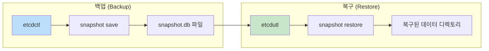
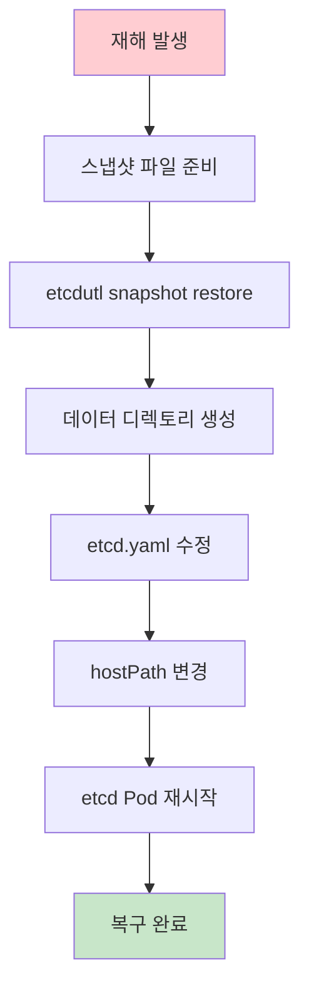
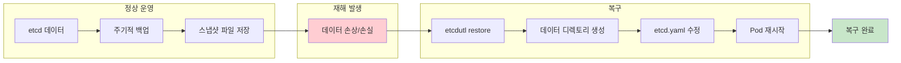

---

## 📌 핵심 요약
> 이 장에서는 etcd 데이터의 백업과 복구 방법을 다룬다. 핵심은 **etcdctl을 사용한 스냅샷 백업**, **etcdutl을 사용한 복구**, 그리고 **etcd Pod 설정 변경**을 통해 복구된 데이터를 적용하는 것이다.

## 🎯 학습 목표
이 내용을 읽고 나면:
- [ ] etcd가 Kubernetes에서 담당하는 역할을 설명할 수 있다
- [ ] etcdctl을 사용하여 etcd 스냅샷을 생성할 수 있다
- [ ] etcdutl을 사용하여 스냅샷에서 etcd를 복구할 수 있다
- [ ] etcd Pod 설정을 수정하여 복구된 데이터를 적용할 수 있다

## 📖 본문 정리

### 1. etcd 개요

| 항목 | 설명 |
|------|------|
| **역할** | Kubernetes 클러스터의 선언된 상태(declared state)와 관측된 상태(observed state) 저장 |
| **타입** | 분산형 Key-Value 저장소 |
| **중요성** | 데이터 손실 시 전체 클러스터 상태 복구 불가 |
| **백업 주기** | 짧은 간격으로 주기적 백업 권장 (데이터 손실 최소화) |

---

### 2. etcd 관리 도구



| 도구 | 용도 | 명령어 |
|------|------|--------|
| **etcdctl** | 백업 스냅샷 생성 | `etcdctl snapshot save` |
| **etcdutl** | 스냅샷에서 복구 | `etcdutl snapshot restore` |

> ⚠️ **주의**: `etcdctl snapshot restore`는 deprecated되었고 etcd 3.6에서 제거될 예정. **etcdutl**을 사용할 것!

---

### 3. 백업 프로세스

#### Step 1: etcd Pod 정보 확인

```bash
# Control Plane 노드에 SSH 접속
$ ssh kube-control-plane

# etcdctl 버전 확인
$ etcdctl version
etcdctl version: 3.5.15
API version: 3.5

# etcd Pod 확인
$ kubectl get pods -n kube-system
NAME                                       READY   STATUS    RESTARTS   AGE
etcd-kube-control-plane                    1/1     Running   0          33m

# etcd 버전 및 설정 확인
$ kubectl describe pod etcd-kube-control-plane -n kube-system
```

#### Step 2: 인증서 경로 확인

etcd Pod의 `describe` 출력에서 인증서 경로를 확인:

```yaml
Command:
  etcd
  --cert-file=/etc/kubernetes/pki/etcd/server.crt      # 서버 인증서
  --key-file=/etc/kubernetes/pki/etcd/server.key       # 서버 키
  --listen-client-urls=https://127.0.0.1:2379          # 엔드포인트 URL
  --trusted-ca-file=/etc/kubernetes/pki/etcd/ca.crt    # CA 인증서
```

| 옵션 | 경로 | 설명 |
|------|------|------|
| `--cert-file` | `/etc/kubernetes/pki/etcd/server.crt` | 서버 인증서 |
| `--key-file` | `/etc/kubernetes/pki/etcd/server.key` | 서버 키 |
| `--trusted-ca-file` | `/etc/kubernetes/pki/etcd/ca.crt` | CA 인증서 |
| `--listen-client-urls` | `https://127.0.0.1:2379` | 클라이언트 엔드포인트 |

#### Step 3: 스냅샷 백업 실행

```bash
$ sudo ETCDCTL_API=3 etcdctl \
  --cacert=/etc/kubernetes/pki/etcd/ca.crt \
  --cert=/etc/kubernetes/pki/etcd/server.crt \
  --key=/etc/kubernetes/pki/etcd/server.key \
  snapshot save /opt/etcd-backup.db

# 출력
Snapshot saved at /opt/etcd-backup.db
```

> 💡 **팁**: etcd가 같은 서버에서 실행 중이면 `--endpoints` 옵션 불필요

---

### 4. 복구 프로세스



#### Step 1: 스냅샷에서 데이터 복구

```bash
# Control Plane 노드에 SSH 접속
$ ssh kube-control-plane

# 스냅샷에서 데이터 복구
$ sudo ETCDCTL_API=3 etcdutl \
  --data-dir=/var/lib/from-backup \
  snapshot restore /opt/etcd-backup.db

# 복구된 데이터 확인
$ sudo ls /var/lib/from-backup
member
```

#### Step 2: etcd Pod 매니페스트 수정

```bash
# etcd.yaml 파일 위치로 이동
$ cd /etc/kubernetes/manifests/

# etcd.yaml 편집
$ sudo vim etcd.yaml
```

**수정할 내용**: `spec.volumes.hostPath.path` 변경

```yaml
# 수정 전
spec:
  volumes:
  - hostPath:
      path: /var/lib/etcd           # 기존 경로
      type: DirectoryOrCreate
    name: etcd-data

# 수정 후
spec:
  volumes:
  - hostPath:
      path: /var/lib/from-backup    # 복구된 데이터 경로
      type: DirectoryOrCreate
    name: etcd-data
```

#### Step 3: etcd Pod 재시작 확인

```bash
# etcd Pod 상태 확인 (자동으로 재생성됨)
$ kubectl get pod etcd-kube-control-plane -n kube-system
NAME                      READY   STATUS    RESTARTS   AGE
etcd-kube-control-plane   1/1     Running   0          5m1s
```

> ⚠️ Pod가 `Running` 상태로 전환되지 않으면 수동 삭제:
> ```bash
> $ kubectl delete pod etcd-kube-control-plane -n kube-system
> ```

---

### 5. 전체 프로세스 요약



---

### 6. 핵심 명령어 요약

| 작업 | 명령어 |
|------|--------|
| **etcdctl 버전 확인** | `etcdctl version` |
| **etcd Pod 확인** | `kubectl get pods -n kube-system` |
| **etcd 설정 확인** | `kubectl describe pod etcd-kube-control-plane -n kube-system` |
| **스냅샷 백업** | `sudo ETCDCTL_API=3 etcdctl --cacert=<ca> --cert=<cert> --key=<key> snapshot save <file>` |
| **스냅샷 복구** | `sudo ETCDCTL_API=3 etcdutl --data-dir=<dir> snapshot restore <file>` |
| **etcd 매니페스트 편집** | `sudo vim /etc/kubernetes/manifests/etcd.yaml` |

---

### 7. 인증서 경로 빠른 참조

```bash
# 표준 경로 (대부분의 kubeadm 설치)
--cacert=/etc/kubernetes/pki/etcd/ca.crt
--cert=/etc/kubernetes/pki/etcd/server.crt
--key=/etc/kubernetes/pki/etcd/server.key
```

---

## 🔍 심화 학습

### 추가 조사 내용
- **멀티노드 etcd 클러스터 백업/복구**: 고가용성 클러스터에서의 etcd 관리
- **스냅샷 암호화**: 민감한 정보 보호를 위한 스냅샷 파일 암호화
- **자동화된 백업**: CronJob을 사용한 주기적 etcd 백업 자동화

### 출처
- [Kubernetes 공식 문서 - Backing up an etcd cluster](https://kubernetes.io/docs/tasks/administer-cluster/configure-upgrade-etcd/#backing-up-an-etcd-cluster)
- [etcd GitHub Repository](https://github.com/etcd-io/etcd)

---

## 💡 실무 적용 포인트

### 이런 상황에서 기억하세요
- **CKA 시험**: 인증서 경로는 `kubectl describe pod`로 확인. 암기 불필요!
- **백업 파일**: 안전한 외부 저장소에 보관 (클러스터 외부)
- **복구 테스트**: 정기적으로 복구 프로세스 테스트 권장

### 주의할 점 / 흔한 실수
- ⚠️ `etcdctl snapshot restore`는 deprecated → **etcdutl** 사용
- ⚠️ 복구 후 `etcd.yaml`의 `hostPath` 변경을 잊지 말 것
- ⚠️ 인증서 경로는 클러스터마다 다를 수 있음 → 반드시 확인
- ⚠️ 백업 파일은 클러스터 외부에 안전하게 보관

### 면접에서 나올 수 있는 질문
- Q: etcd는 Kubernetes에서 어떤 역할을 하나요?
- Q: etcd 백업과 복구에 사용하는 도구는 무엇인가요?
- Q: etcd 복구 후 추가로 해야 할 작업은 무엇인가요?
- Q: 왜 etcd 백업이 중요한가요?
- Q: etcd 스냅샷 백업 시 필요한 인증서 옵션은?

---

## ✅ 핵심 개념 체크리스트
- [ ] etcd가 Kubernetes 클러스터 상태를 저장한다는 것을 이해하는가?
- [ ] etcdctl과 etcdutl의 역할 차이를 알고 있는가?
- [ ] 백업 명령어 (`etcdctl snapshot save`)를 사용할 수 있는가?
- [ ] 복구 명령어 (`etcdutl snapshot restore`)를 사용할 수 있는가?
- [ ] 복구 후 `etcd.yaml`의 `hostPath` 수정이 필요함을 알고 있는가?
- [ ] 인증서 경로를 `kubectl describe`로 확인할 수 있는가?

---

## 🔗 참고 자료
- 📄 공식 문서: [Backing up an etcd cluster](https://kubernetes.io/docs/tasks/administer-cluster/configure-upgrade-etcd/#backing-up-an-etcd-cluster)
- 📄 etcd 운영: [Operating etcd clusters for Kubernetes](https://kubernetes.io/docs/tasks/administer-cluster/configure-upgrade-etcd/)
- 📘 GitHub: [etcd-io/etcd](https://github.com/etcd-io/etcd)
- 📘 CKA Study Guide: [bmuschko/cka-study-guide](https://github.com/bmuschko/cka-study-guide)

---
