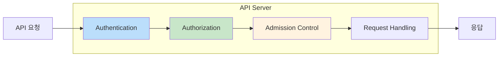
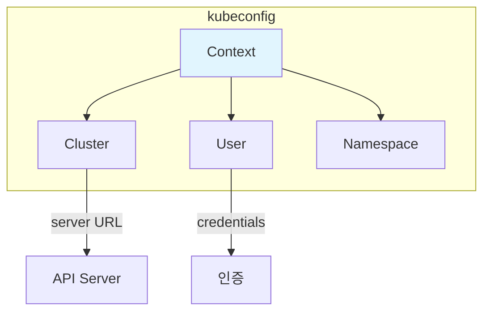
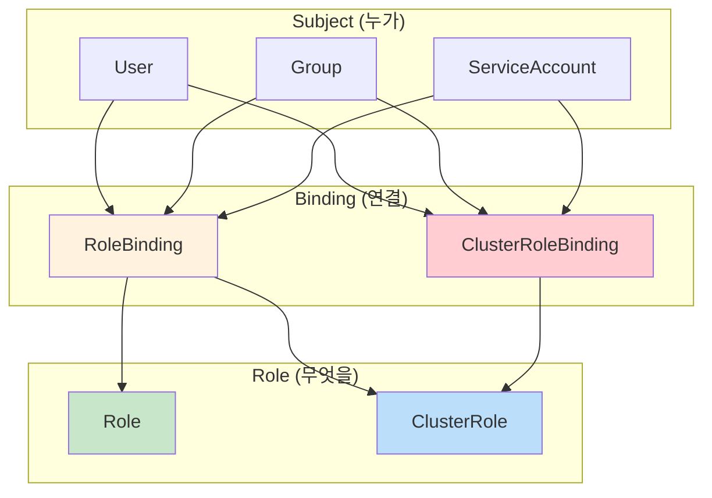
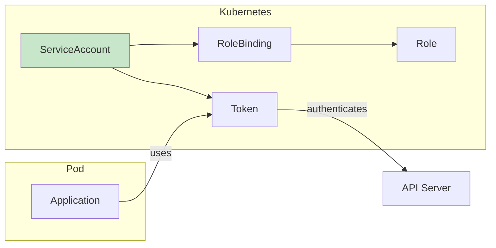
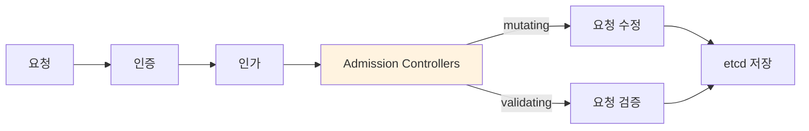
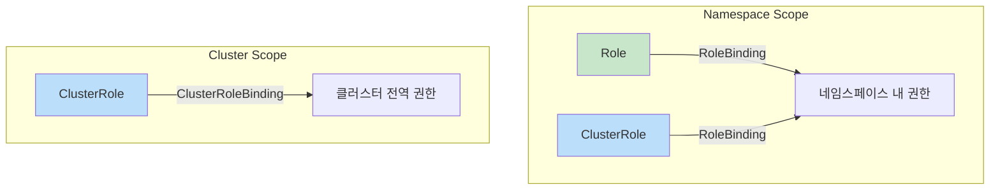

---

## 📌 핵심 요약
> 이 장에서는 Kubernetes API 서버의 보안 메커니즘을 다룬다. 핵심은 **API 요청 처리의 3단계(인증, 인가, Admission Control)**, **kubeconfig를 통한 클러스터 접근 관리**, 그리고 **RBAC를 사용한 세분화된 권한 제어**를 이해하는 것이다.

## 🎯 학습 목표
이 내용을 읽고 나면:
- [ ] API 요청 처리의 3단계(인증, 인가, Admission Control)를 설명할 수 있다
- [ ] kubeconfig 파일의 구조와 관리 방법을 이해한다
- [ ] RBAC의 4가지 기본 요소(Role, RoleBinding, ClusterRole, ClusterRoleBinding)를 구분할 수 있다
- [ ] Service Account를 생성하고 RBAC와 연결할 수 있다
- [ ] kubectl auth can-i 명령어로 권한을 확인할 수 있다

## 📖 본문 정리

### 1. API 요청 처리 흐름



| 단계 | 역할 | 실패 시 |
|------|------|---------|
| **Authentication (인증)** | 요청자 신원 확인 (Who are you?) | 401 Unauthorized |
| **Authorization (인가)** | 요청 수행 권한 확인 (Are you allowed?) | 403 Forbidden |
| **Admission Control** | 요청 수정/검증 (Is it valid?) | 요청 거부 또는 수정 |

---

### 2. kubeconfig 파일

#### kubeconfig 구조

```yaml
apiVersion: v1
kind: Config
current-context: minikube           # 현재 사용 중인 컨텍스트

clusters:                           # 클러스터 정보
- name: minikube
  cluster:
    certificate-authority: /path/to/ca.crt
    server: https://192.168.64.2:8443

contexts:                           # 컨텍스트 (클러스터 + 사용자 조합)
- name: minikube
  context:
    cluster: minikube
    user: minikube
    namespace: default              # 기본 네임스페이스 (선택)

users:                              # 사용자 인증 정보
- name: minikube
  user:
    client-certificate: /path/to/client.crt
    client-key: /path/to/client.key
```



#### kubeconfig 관리 명령어

```bash
# kubeconfig 파일 위치
~/.kube/config (기본)

# 현재 컨텍스트 확인
$ kubectl config current-context
minikube

# 사용 가능한 컨텍스트 목록
$ kubectl config get-contexts
CURRENT   NAME       CLUSTER    AUTHINFO   NAMESPACE
*         minikube   minikube   minikube   default

# 컨텍스트 전환
$ kubectl config use-context production

# 현재 컨텍스트의 기본 네임스페이스 변경
$ kubectl config set-context --current --namespace=kube-system

# 새 컨텍스트 생성
$ kubectl config set-context dev-context \
  --cluster=dev-cluster \
  --user=dev-user \
  --namespace=development
```

| 명령어 | 설명 |
|--------|------|
| `kubectl config view` | kubeconfig 내용 확인 |
| `kubectl config current-context` | 현재 컨텍스트 이름 |
| `kubectl config use-context <name>` | 컨텍스트 전환 |
| `kubectl config set-context --current --namespace=<ns>` | 기본 네임스페이스 변경 |

---

### 3. RBAC (Role-Based Access Control)

#### RBAC 개요



#### Role vs ClusterRole

| 구분 | Role | ClusterRole |
|------|------|-------------|
| **범위** | 네임스페이스 내 | 클러스터 전체 |
| **리소스 대상** | 네임스페이스 리소스 | 모든 리소스 + 클러스터 리소스 |
| **클러스터 리소스** | ❌ 접근 불가 | ✅ nodes, namespaces, pv 등 |
| **사용 예시** | 특정 네임스페이스 Pod 관리 | 전체 클러스터 관리 |

#### RoleBinding vs ClusterRoleBinding

| 구분 | RoleBinding | ClusterRoleBinding |
|------|-------------|-------------------|
| **범위** | 네임스페이스 내 | 클러스터 전체 |
| **연결 가능한 Role** | Role, ClusterRole | ClusterRole만 |
| **사용 시나리오** | 네임스페이스별 권한 부여 | 클러스터 전역 권한 부여 |

> 💡 **핵심**: RoleBinding으로 ClusterRole을 연결하면, 해당 네임스페이스 내에서만 ClusterRole의 권한이 적용된다!

---

### 4. RBAC 리소스 생성

#### Role 생성

```yaml
# pod-reader-role.yaml
apiVersion: rbac.authorization.k8s.io/v1
kind: Role
metadata:
  namespace: default
  name: pod-reader
rules:
- apiGroups: [""]              # core API group
  resources: ["pods"]
  verbs: ["get", "list", "watch"]
- apiGroups: [""]
  resources: ["pods/log"]      # 하위 리소스
  verbs: ["get"]
```

```bash
# 명령형으로 Role 생성
$ kubectl create role pod-reader \
  --verb=get,list,watch \
  --resource=pods \
  -n default
```

#### ClusterRole 생성

```yaml
# node-reader-clusterrole.yaml
apiVersion: rbac.authorization.k8s.io/v1
kind: ClusterRole
metadata:
  name: node-reader
rules:
- apiGroups: [""]
  resources: ["nodes"]
  verbs: ["get", "list", "watch"]
- apiGroups: [""]
  resources: ["persistentvolumes"]
  verbs: ["get", "list"]
```

```bash
# 명령형으로 ClusterRole 생성
$ kubectl create clusterrole node-reader \
  --verb=get,list,watch \
  --resource=nodes
```

#### RoleBinding 생성

```yaml
# read-pods-binding.yaml
apiVersion: rbac.authorization.k8s.io/v1
kind: RoleBinding
metadata:
  name: read-pods
  namespace: default
subjects:
- kind: User
  name: jane
  apiGroup: rbac.authorization.k8s.io
roleRef:
  kind: Role
  name: pod-reader
  apiGroup: rbac.authorization.k8s.io
```

```bash
# 명령형으로 RoleBinding 생성
$ kubectl create rolebinding read-pods \
  --role=pod-reader \
  --user=jane \
  -n default

# ClusterRole을 RoleBinding으로 연결 (네임스페이스 범위로 제한)
$ kubectl create rolebinding read-pods-clusterrole \
  --clusterrole=view \
  --user=jane \
  -n default
```

#### ClusterRoleBinding 생성

```yaml
# cluster-admin-binding.yaml
apiVersion: rbac.authorization.k8s.io/v1
kind: ClusterRoleBinding
metadata:
  name: admin-binding
subjects:
- kind: User
  name: admin
  apiGroup: rbac.authorization.k8s.io
- kind: Group
  name: admins
  apiGroup: rbac.authorization.k8s.io
roleRef:
  kind: ClusterRole
  name: cluster-admin
  apiGroup: rbac.authorization.k8s.io
```

```bash
# 명령형으로 ClusterRoleBinding 생성
$ kubectl create clusterrolebinding admin-binding \
  --clusterrole=cluster-admin \
  --user=admin
```

---

### 5. 기본 제공 ClusterRole

Kubernetes는 사용자 편의를 위해 기본 ClusterRole을 제공한다:

| ClusterRole | 권한 범위 | 설명 |
|-------------|-----------|------|
| **cluster-admin** | 전체 관리 | 모든 리소스에 대한 모든 권한 |
| **admin** | 네임스페이스 관리 | 네임스페이스 내 대부분 리소스 관리 (ResourceQuota 제외) |
| **edit** | 읽기/쓰기 | 네임스페이스 내 리소스 생성/수정/삭제 (Role/RoleBinding 제외) |
| **view** | 읽기 전용 | 네임스페이스 내 리소스 조회 (Secrets 제외) |

```bash
# 기본 ClusterRole 확인
$ kubectl get clusterroles
NAME                                                                   CREATED AT
admin                                                                  2025-03-21T10:00:00Z
cluster-admin                                                          2025-03-21T10:00:00Z
edit                                                                   2025-03-21T10:00:00Z
view                                                                   2025-03-21T10:00:00Z
...

# ClusterRole 상세 확인
$ kubectl describe clusterrole view
```

---

### 6. Service Account

#### Service Account란?

| 구분 | User Account | Service Account |
|------|--------------|-----------------|
| **대상** | 사람 | Pod 내 애플리케이션 |
| **범위** | 클러스터 전역 | 네임스페이스별 |
| **생성** | Kubernetes 외부 관리 | Kubernetes API로 생성 |
| **기본 제공** | 없음 | 각 네임스페이스에 `default` SA 존재 |



#### Service Account 생성 및 사용

```bash
# Service Account 생성
$ kubectl create serviceaccount my-service-account -n default
serviceaccount/my-service-account created

# Service Account 목록 확인
$ kubectl get serviceaccounts -n default
NAME                 SECRETS   AGE
default              0         10d
my-service-account   0         5s
```

#### Pod에 Service Account 연결

```yaml
# pod-with-sa.yaml
apiVersion: v1
kind: Pod
metadata:
  name: my-pod
spec:
  serviceAccountName: my-service-account    # Service Account 지정
  containers:
  - name: nginx
    image: nginx:1.29.0
```

#### Service Account에 RBAC 권한 부여

```bash
# Service Account에 Role 연결
$ kubectl create rolebinding sa-pod-reader \
  --role=pod-reader \
  --serviceaccount=default:my-service-account \
  -n default

# Service Account에 ClusterRole 연결 (네임스페이스 범위)
$ kubectl create rolebinding sa-view \
  --clusterrole=view \
  --serviceaccount=default:my-service-account \
  -n default

# Service Account에 ClusterRole 연결 (클러스터 전역)
$ kubectl create clusterrolebinding sa-cluster-view \
  --clusterrole=view \
  --serviceaccount=default:my-service-account
```

> 💡 **Service Account 지정 형식**: `--serviceaccount=<namespace>:<name>`

---

### 7. 권한 확인 (can-i)

```bash
# 현재 사용자의 권한 확인
$ kubectl auth can-i create pods
yes

$ kubectl auth can-i delete nodes
no

# 특정 사용자의 권한 확인 (관리자용)
$ kubectl auth can-i create pods --as=jane
no

$ kubectl auth can-i list pods --as=jane -n default
yes

# Service Account 권한 확인
$ kubectl auth can-i get pods \
  --as=system:serviceaccount:default:my-service-account
yes

# 모든 권한 나열
$ kubectl auth can-i --list
Resources                                       Non-Resource URLs   Resource Names   Verbs
pods                                            []                  []               [get list watch]
...
```

| 명령어 | 설명 |
|--------|------|
| `kubectl auth can-i <verb> <resource>` | 현재 사용자 권한 확인 |
| `kubectl auth can-i ... --as=<user>` | 특정 사용자로 권한 확인 |
| `kubectl auth can-i ... --as=system:serviceaccount:<ns>:<name>` | Service Account 권한 확인 |
| `kubectl auth can-i --list` | 모든 권한 나열 |

---

### 8. Aggregated ClusterRoles

여러 ClusterRole을 하나로 집계하는 기능:

```yaml
# 기본 ClusterRole에 권한 추가
apiVersion: rbac.authorization.k8s.io/v1
kind: ClusterRole
metadata:
  name: custom-view-extension
  labels:
    rbac.authorization.k8s.io/aggregate-to-view: "true"   # view에 집계
rules:
- apiGroups: ["custom.io"]
  resources: ["customresources"]
  verbs: ["get", "list", "watch"]
```

| Label | 집계 대상 ClusterRole |
|-------|---------------------|
| `aggregate-to-admin: "true"` | admin |
| `aggregate-to-edit: "true"` | edit |
| `aggregate-to-view: "true"` | view |

> 💡 **활용**: CRD를 추가할 때, 기본 ClusterRole에 자동으로 권한을 추가할 수 있다.

---

### 9. Admission Control

API 요청이 인증/인가를 통과한 후 최종 처리 전에 실행되는 플러그인:



#### 주요 Admission Controller

| 플러그인 | 유형 | 역할 |
|---------|------|------|
| **NamespaceLifecycle** | Validating | 삭제 중인 네임스페이스에 객체 생성 방지 |
| **LimitRanger** | Mutating | 리소스 기본값 설정, 제한 적용 |
| **ResourceQuota** | Validating | 네임스페이스 리소스 사용량 제한 |
| **PodSecurity** | Validating | Pod 보안 표준 적용 |
| **DefaultStorageClass** | Mutating | PVC에 기본 StorageClass 설정 |

```bash
# 활성화된 Admission Controller 확인
$ kubectl exec -n kube-system kube-apiserver-<node> -- \
  kube-apiserver --help | grep enable-admission-plugins
```

---

### 10. 핵심 명령어 요약

| 작업 | 명령어 |
|------|--------|
| **kubeconfig 확인** | `kubectl config view` |
| **컨텍스트 전환** | `kubectl config use-context <name>` |
| **현재 컨텍스트** | `kubectl config current-context` |
| **네임스페이스 변경** | `kubectl config set-context --current --namespace=<ns>` |
| **Role 생성** | `kubectl create role <name> --verb=<verbs> --resource=<res>` |
| **ClusterRole 생성** | `kubectl create clusterrole <name> --verb=<verbs> --resource=<res>` |
| **RoleBinding 생성** | `kubectl create rolebinding <name> --role=<role> --user=<user>` |
| **ClusterRoleBinding 생성** | `kubectl create clusterrolebinding <name> --clusterrole=<role> --user=<user>` |
| **ServiceAccount 생성** | `kubectl create serviceaccount <name>` |
| **권한 확인** | `kubectl auth can-i <verb> <resource>` |
| **다른 사용자로 권한 확인** | `kubectl auth can-i <verb> <resource> --as=<user>` |

---

### 11. RBAC 4가지 조합 정리



| 조합 | Role 유형 | Binding 유형 | 결과 범위 |
|------|-----------|--------------|-----------|
| 1 | Role | RoleBinding | 특정 네임스페이스 |
| 2 | ClusterRole | RoleBinding | 특정 네임스페이스 (재사용 가능) |
| 3 | ClusterRole | ClusterRoleBinding | 클러스터 전체 |
| 4 | Role | ClusterRoleBinding | ❌ 불가능 |

---

## 🔍 심화 학습

### 추가 조사 내용
- **OIDC 인증**: 외부 Identity Provider 연동
- **Webhook 인증/인가**: 커스텀 인증/인가 로직 구현
- **Pod Security Standards**: baseline, restricted, privileged 정책

### 출처
- [Kubernetes 공식 문서 - RBAC](https://kubernetes.io/docs/reference/access-authn-authz/rbac/)
- [Kubernetes 공식 문서 - Authentication](https://kubernetes.io/docs/reference/access-authn-authz/authentication/)
- [Kubernetes 공식 문서 - Admission Controllers](https://kubernetes.io/docs/reference/access-authn-authz/admission-controllers/)

---

## 💡 실무 적용 포인트

### 이런 상황에서 기억하세요
- **CKA 시험**: RBAC 리소스 생성 명령어 숙지 필수!
- **최소 권한 원칙**: 필요한 권한만 부여 (view → edit → admin 순)
- **권한 디버깅**: `kubectl auth can-i --as=<user>` 활용

### 주의할 점 / 흔한 실수
- ⚠️ RoleBinding으로 ClusterRole을 연결하면 네임스페이스 범위로 제한됨
- ⚠️ Service Account는 `system:serviceaccount:<namespace>:<name>` 형식
- ⚠️ Role은 ClusterRoleBinding과 연결할 수 없음
- ⚠️ 기본 `default` Service Account는 최소 권한만 가짐

### 면접에서 나올 수 있는 질문
- Q: Role과 ClusterRole의 차이점은?
- Q: RoleBinding으로 ClusterRole을 연결하면 어떻게 되나요?
- Q: Service Account는 무엇이고 왜 필요한가요?
- Q: kubectl auth can-i 명령어는 어떤 상황에서 유용한가요?
- Q: RBAC에서 최소 권한 원칙을 어떻게 적용하나요?

---

## ✅ 핵심 개념 체크리스트
- [ ] API 요청 처리의 3단계(인증, 인가, Admission Control)를 설명할 수 있는가?
- [ ] kubeconfig 파일 구조(clusters, contexts, users)를 이해하는가?
- [ ] Role과 ClusterRole의 차이를 알고 있는가?
- [ ] RoleBinding과 ClusterRoleBinding의 차이를 알고 있는가?
- [ ] Service Account를 생성하고 RBAC와 연결할 수 있는가?
- [ ] kubectl auth can-i 명령어를 사용할 수 있는가?
- [ ] 기본 제공 ClusterRole(cluster-admin, admin, edit, view)을 알고 있는가?

---

## 🔗 참고 자료
- 📄 공식 문서: [Using RBAC Authorization](https://kubernetes.io/docs/reference/access-authn-authz/rbac/)
- 📄 인증: [Authenticating](https://kubernetes.io/docs/reference/access-authn-authz/authentication/)
- 📄 Service Accounts: [Configure Service Accounts for Pods](https://kubernetes.io/docs/tasks/configure-pod-container/configure-service-account/)
- 📄 Admission Controllers: [Admission Controllers Reference](https://kubernetes.io/docs/reference/access-authn-authz/admission-controllers/)
- 📘 GitHub: [bmuschko/cka-study-guide](https://github.com/bmuschko/cka-study-guide)

---
