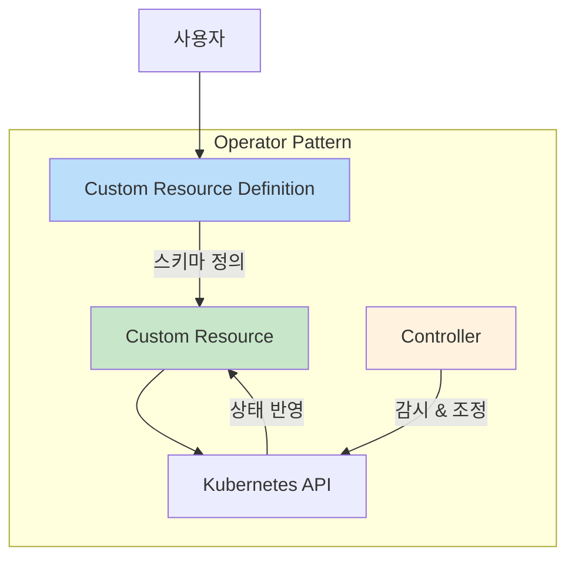
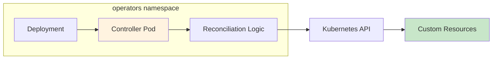

---

## 📌 핵심 요약
> 이 장에서는 Kubernetes Operator와 Custom Resource Definition(CRD)을 다룬다. 핵심은 **Operator 패턴의 이해**, **CRD 스키마 탐색**, 그리고 **Custom Resource(CR) 생성 및 상호작용**을 익히는 것이다.

## 🎯 학습 목표
이 내용을 읽고 나면:
- [ ] Operator 패턴의 구성요소(CRD, Controller)를 설명할 수 있다
- [ ] Operator Hub에서 Operator를 검색하고 설치할 수 있다
- [ ] 설치된 CRD를 조회하고 스키마를 확인할 수 있다
- [ ] CRD를 기반으로 Custom Resource(CR)를 생성하고 관리할 수 있다

## 📖 본문 정리

### 1. Operator란?

| 항목 | 설명 |
|------|------|
| **정의** | Kubernetes 핵심 동작을 확장하는 플러그인 |
| **목적** | 배포, 구성, 스케일링, 업그레이드, 관리 작업 자동화 |
| **특징** | Kubernetes 코드 변경 없이 기능 확장 |

> 💡 **핵심**: Operator = CRD(스키마) + Controller(조정 로직)

---

### 2. Operator 패턴



| 구성요소 | 역할 | 설명 |
|----------|------|------|
| **CRD** | 스키마 정의 | 커스텀 객체의 청사진 (타입 정의) |
| **CR** | 인스턴스 | CRD 스키마를 따르는 실제 객체 |
| **Controller** | 조정 로직 | Kubernetes API와 상호작용하여 원하는 상태 유지 |
| **RBAC Rules** | 권한 | 필요한 권한 정의 |

> 📝 **시험 범위**: Controller 구현은 시험 범위 외. CRD와 CR 상호작용에 집중!

---

### 3. Operator 검색 및 설치

#### Operator 검색 사이트

| 사이트 | URL | 설명 |
|--------|-----|------|
| **Operator Hub** | operatorhub.io | Kubernetes 커뮤니티 Operator 허브 |
| **Artifact Hub** | artifacthub.io | CNCF 아티팩트 저장소 |

#### 인기 Operator 예시

| Operator | 용도 |
|----------|------|
| **External Secrets Operator** | AWS Secrets Manager, HashiCorp Vault 통합 |
| **Crossplane Operator** | 선언적 구문으로 클라우드 리소스 관리 |
| **Argo CD Operator** | GitOps 기반 지속적 배포 |
| **Prometheus Operator** | 모니터링 시스템 관리 |

#### Operator 설치 (Argo CD 예시)

```bash
# 1. Operator Lifecycle Manager (OLM) 설치 (일회성)
$ curl -sL https://github.com/operator-framework/operator-lifecycle-manager/\
releases/download/v0.31.0/install.sh | bash -s v0.31.0

# 2. Argo CD Operator 설치
$ kubectl create -f https://operatorhub.io/install/argocd-operator.yaml
subscription.operators.coreos.com/my-argocd-operator created

# 3. 설치 확인 (Succeeded 상태 확인)
$ kubectl get csv -n operators
NAME                      DISPLAY   VERSION   REPLACES                  PHASE
argocd-operator.v0.13.0   Argo CD   0.13.0    argocd-operator.v0.12.0   Succeeded
```

---

### 4. CRD (Custom Resource Definition) 작업

#### CRD 조회

```bash
# 설치된 모든 CRD 목록 조회
$ kubectl get crds
NAME                                          CREATED AT
applications.argoproj.io                      2025-03-21T23:02:40Z
applicationsets.argoproj.io                   2025-03-21T23:02:39Z
appprojects.argoproj.io                       2025-03-21T23:02:39Z
argocdexports.argoproj.io                     2025-03-21T23:02:39Z
argocds.argoproj.io                           2025-03-21T23:02:39Z
```

#### CRD 상세 정보 확인

```bash
# CRD 스키마 상세 조회
$ kubectl describe crd applications.argoproj.io
```

> 💡 CRD 스키마에서 **kind**, **API group/version**, **properties**를 확인할 수 있다.

---

### 5. Custom Resource (CR) 생성

#### CR 정의 예시 (Argo CD Application)

```yaml
# nginx-application.yaml
apiVersion: argoproj.io/v1alpha1
kind: Application
metadata:
  name: nginx
spec:
  project: default
  source:
    repoURL: https://github.com/bmuschko/cka-study-guide.git
    targetRevision: HEAD
    path: ./ch07/nginx
  destination:
    server: https://kubernetes.default.svc
    namespace: default
```

#### CR 생성 및 관리

```bash
# CR 생성
$ kubectl apply -f nginx-application.yaml
application.argoproj.io/nginx created

# CR 상세 조회
$ kubectl describe application nginx

# CR 목록 조회
$ kubectl get applications

# CR 삭제
$ kubectl delete application nginx
application.argoproj.io "nginx" deleted
```

---

### 6. Controller 확인

Operator는 Controller를 Pod/Deployment로 실행:

```bash
# Controller Deployment 및 Pod 확인
$ kubectl get deployments,pods -n operators
NAME                                                 READY   UP-TO-DATE
deployment.apps/argocd-operator-controller-manager   1/1     1

NAME                                                      READY   STATUS
pod/argocd-operator-controller-manager-6998544bff-zx8bg   1/1     Running
```



---

### 7. Argo CD CRD 종류

| CRD | 용도 |
|-----|------|
| **Application** | 매니페스트로 정의된 Kubernetes 리소스 그룹 |
| **ApplicationSet** | Application 리소스의 집합 |
| **AppProject** | Git 저장소, 클러스터, 네임스페이스 접근 제어 (멀티테넌시) |

---

### 8. 핵심 명령어 요약

| 작업 | 명령어 |
|------|--------|
| **CRD 목록 조회** | `kubectl get crds` |
| **CRD 상세 조회** | `kubectl describe crd <crd-name>` |
| **CR 생성** | `kubectl apply -f <cr-manifest.yaml>` |
| **CR 목록 조회** | `kubectl get <cr-kind>` |
| **CR 상세 조회** | `kubectl describe <cr-kind> <cr-name>` |
| **CR 삭제** | `kubectl delete <cr-kind> <cr-name>` |
| **Operator 설치 확인** | `kubectl get csv -n operators` |

---

### 9. CRD와 기본 Primitive 비교

| 구분 | 기본 Primitive | Custom Resource |
|------|----------------|-----------------|
| **정의** | Kubernetes 내장 | 사용자/Operator 정의 |
| **예시** | Pod, Deployment, Service | Application, MongoDBCommunity |
| **스키마** | Kubernetes API에 내장 | CRD로 등록 |
| **관리 도구** | kubectl (동일) | kubectl (동일) |

---

## 🔍 심화 학습

### 추가 조사 내용
- **Operator SDK**: Operator 개발 도구
- **Kubebuilder**: CRD 및 Controller 개발 프레임워크
- **OLM (Operator Lifecycle Manager)**: Operator 라이프사이클 관리

### 출처
- [Kubernetes 공식 문서 - Custom Resources](https://kubernetes.io/docs/concepts/extend-kubernetes/api-extension/custom-resources/)
- [Operator Hub](https://operatorhub.io/)
- [Artifact Hub](https://artifacthub.io/)

---

## 💡 실무 적용 포인트

### 이런 상황에서 기억하세요
- **CKA 시험**: CRD 구현 불필요, 조회 및 CR 생성/관리에 집중
- **Operator 설치**: 웹페이지 설치 지침 따르기 (암기 불필요)
- **CR 상호작용**: 일반 Kubernetes 객체와 동일한 kubectl 명령어 사용

### 주의할 점 / 흔한 실수
- ⚠️ CRD 스키마 구현은 시험 범위 외
- ⚠️ CR 생성 시 apiVersion과 kind가 CRD와 일치해야 함
- ⚠️ Operator 설치 후 CRD가 등록되기까지 약간의 시간 필요

### 면접에서 나올 수 있는 질문
- Q: Operator 패턴이란 무엇인가요?
- Q: CRD와 CR의 차이점은?
- Q: Operator를 설치하면 어떤 리소스가 생성되나요?
- Q: CRD 스키마를 어떻게 확인하나요?
- Q: 설치된 CRD 목록을 어떻게 조회하나요?

---

## ✅ 핵심 개념 체크리스트
- [ ] Operator가 CRD + Controller로 구성됨을 이해하는가?
- [ ] `kubectl get crds`로 설치된 CRD를 조회할 수 있는가?
- [ ] `kubectl describe crd`로 CRD 스키마를 확인할 수 있는가?
- [ ] CRD를 기반으로 CR(Custom Resource)을 생성할 수 있는가?
- [ ] CR을 일반 Kubernetes 객체처럼 CRUD 할 수 있는가?
- [ ] Operator Hub에서 Operator를 찾고 설치할 수 있는가?

---

## 🔗 참고 자료
- 📄 공식 문서: [Custom Resources](https://kubernetes.io/docs/concepts/extend-kubernetes/api-extension/custom-resources/)
- 📄 CRD 문서: [Extend the Kubernetes API with CustomResourceDefinitions](https://kubernetes.io/docs/tasks/extend-kubernetes/custom-resources/custom-resource-definitions/)
- 🌐 Operator Hub: [operatorhub.io](https://operatorhub.io/)
- 🌐 Artifact Hub: [artifacthub.io](https://artifacthub.io/)
- 📘 GitHub: [bmuschko/cka-study-guide](https://github.com/bmuschko/cka-study-guide)

---
