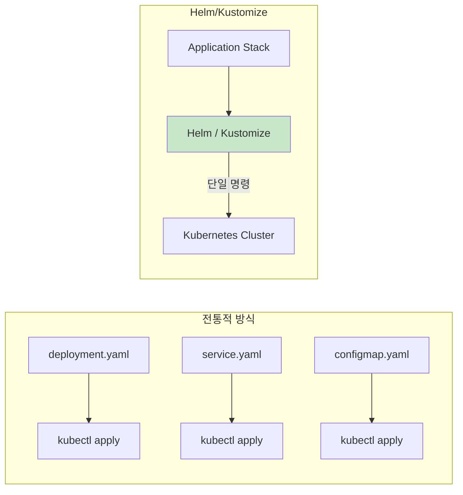
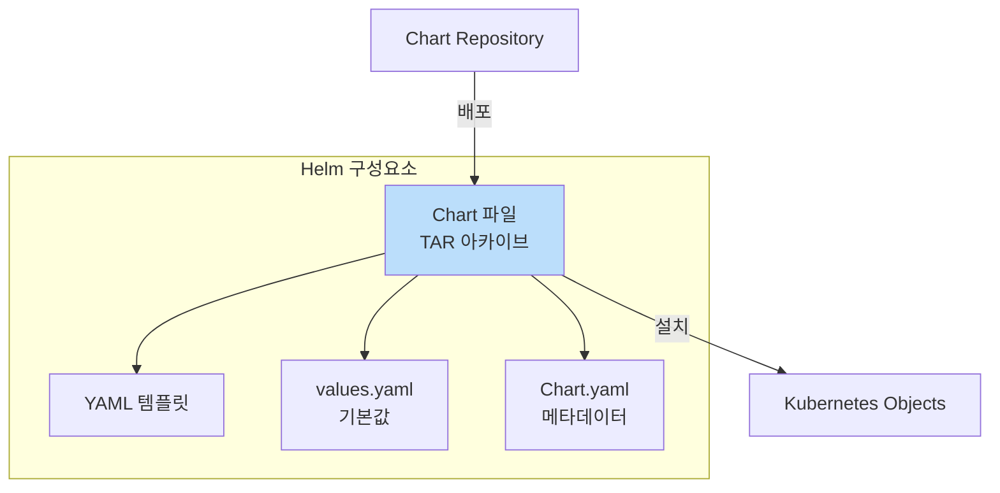
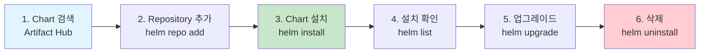
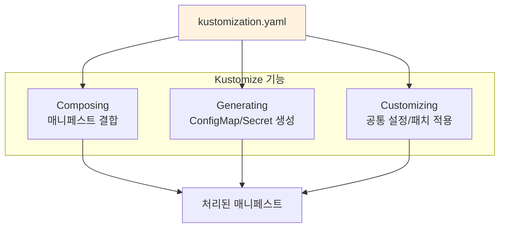
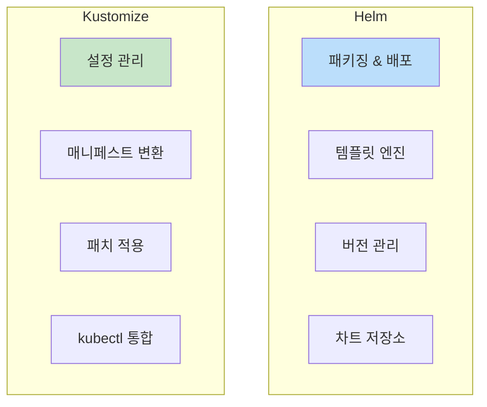
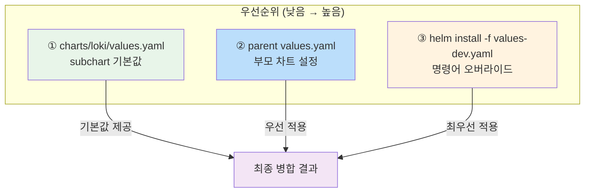
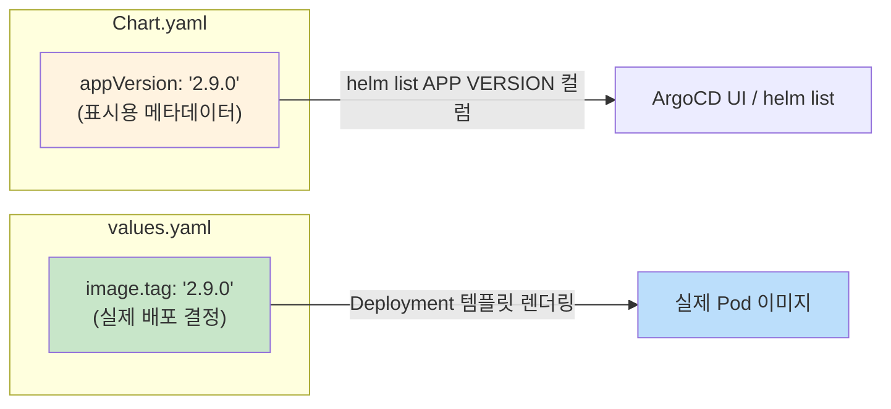
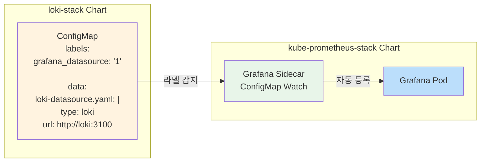

---

## 📌 핵심 요약
> 이 장에서는 Kubernetes 애플리케이션 스택 관리 도구인 Helm과 Kustomize를 다룬다. 핵심은 **Helm을 통한 패키지(차트) 관리 워크플로우**, **Kustomize를 통한 매니페스트 생성/결합/커스터마이징**, 그리고 **두 도구의 차이점**을 이해하는 것이다.

## 🎯 학습 목표
이 내용을 읽고 나면:
- [ ] Helm의 역할과 Chart 개념을 설명할 수 있다
- [ ] Artifact Hub에서 Helm 차트를 검색하고 설치할 수 있다
- [ ] helm repo add, install, upgrade, uninstall 명령어를 사용할 수 있다
- [ ] Kustomize의 3가지 핵심 기능(결합, 생성, 커스터마이징)을 활용할 수 있다
- [ ] Helm과 Kustomize의 차이점을 설명할 수 있다

## 📖 본문 정리

### 1. 배경: 왜 Helm과 Kustomize가 필요한가?



| 문제점 | 해결책 |
|--------|--------|
| 개별 kubectl 명령 관리 비효율 | 애플리케이션 스택을 단일 단위로 관리 |
| 환경별 설정 변경 어려움 | 배포 시점에 파라미터 조정 가능 |
| 매니페스트 재사용 어려움 | 패키징 및 템플릿화 |

---

## Part 1: Helm

### 2. Helm 개요



| 개념 | 설명 |
|------|------|
| **Chart** | Kubernetes 매니페스트를 번들링한 TAR 파일 |
| **Chart Repository** | Chart 파일을 호스팅하는 저장소 |
| **Artifact Hub** | Chart를 검색하는 웹 UI (artifacthub.io) |
| **Release** | Chart의 설치된 인스턴스 |
| **values.yaml** | Chart의 기본 설정값 |

> 💡 **시험 포인트**: Chart 직접 생성은 시험 범위 외! 기존 Chart 설치/관리만 숙지!

---

### 3. Helm 워크플로우



---

### 4. Helm 명령어 상세

#### 4.1 Repository 관리

```bash
# 등록된 Repository 목록 확인
$ helm repo list
Error: no repositories to show    # 초기 상태

# Repository 추가 (예: Jenkins)
$ helm repo add jenkinsci https://charts.jenkins.io/
"jenkinsci" has been added to your repositories

# Repository 목록 확인
$ helm repo list
NAME        URL
jenkinsci   https://charts.jenkins.io/

# Repository 업데이트 (최신 Chart 정보 가져오기)
$ helm repo update
...Successfully got an update from the "jenkinsci" chart repository
Update Complete. *Happy Helming!*
```

#### 4.2 Chart 검색

```bash
# Repository에서 Chart 검색
$ helm search repo jenkinsci
NAME                CHART VERSION   APP VERSION   DESCRIPTION
jenkinsci/jenkins   5.8.26          2.492.2       ...

# 모든 버전 나열
$ helm search repo jenkinsci --versions
```

#### 4.3 Chart 설치

```bash
# 기본 설치 (최신 버전)
$ helm install my-jenkins jenkinsci/jenkins
NAME: my-jenkins
LAST DEPLOYED: Wed Mar 26 13:48:50 2025
NAMESPACE: default
STATUS: deployed
REVISION: 1

# 특정 버전 설치
$ helm install my-jenkins jenkinsci/jenkins --version 5.8.25

# 설정값 커스터마이징 (--set)
$ helm install my-jenkins jenkinsci/jenkins \
  --set controller.adminUser=boss \
  --set controller.adminPassword=password

# 설정 파일로 커스터마이징 (--values)
$ helm install my-jenkins jenkinsci/jenkins --values custom-values.yaml

# 특정 네임스페이스에 설치
$ helm install my-jenkins jenkinsci/jenkins \
  -n jenkins --create-namespace
```

| 플래그 | 설명 |
|--------|------|
| `--version` | 특정 Chart 버전 지정 |
| `--set` | 명령줄에서 설정값 지정 |
| `--values` / `-f` | YAML 파일로 설정값 지정 |
| `-n` / `--namespace` | 설치할 네임스페이스 지정 |
| `--create-namespace` | 네임스페이스 자동 생성 |

#### 4.4 Chart 기본값 확인

```bash
# Chart의 기본 설정값 확인
$ helm show values jenkinsci/jenkins
...
controller:
  adminUser: "admin"
  # adminPassword: <defaults to random>
...
```

#### 4.5 설치된 Chart 관리

```bash
# 설치된 Chart 목록 (현재 네임스페이스)
$ helm list
NAME         NAMESPACE   REVISION   UPDATED         STATUS     CHART
my-jenkins   default     1          2023-09-28...   deployed   jenkins-4.6.4

# 모든 네임스페이스
$ helm list --all-namespaces

# Chart 업그레이드
$ helm upgrade my-jenkins jenkinsci/jenkins --version 5.8.26
Release "my-jenkins" has been upgraded. Happy Helming!

# Chart 삭제
$ helm uninstall my-jenkins
release "my-jenkins" uninstalled

# 특정 네임스페이스의 Chart 삭제
$ helm uninstall my-jenkins -n jenkins
```

---

### 5. Helm 명령어 요약

| 작업 | 명령어 |
|------|--------|
| **Repository 추가** | `helm repo add <name> <url>` |
| **Repository 목록** | `helm repo list` |
| **Repository 업데이트** | `helm repo update` |
| **Chart 검색** | `helm search repo <keyword>` |
| **Chart 기본값 확인** | `helm show values <chart>` |
| **Chart 설치** | `helm install <release> <chart> [--version]` |
| **설치 목록** | `helm list [--all-namespaces]` |
| **Chart 업그레이드** | `helm upgrade <release> <chart> [--version]` |
| **Chart 삭제** | `helm uninstall <release>` |

---

## Part 2: Kustomize

### 6. Kustomize 개요



| 특징 | 설명 |
|------|------|
| **kubectl 통합** | 별도 설치 불필요, kubectl에 내장 |
| **중심 파일** | `kustomization.yaml` (이름 변경 불가) |
| **선언적 방식** | YAML 매니페스트 기반 |

---

### 7. Kustomize 실행 모드

```bash
# 모드 1: 결과 렌더링 (Dry-run)
$ kubectl kustomize <target>

# 모드 2: 객체 생성
$ kubectl apply -k <target>
```

| 명령어 | 설명 |
|--------|------|
| `kubectl kustomize ./` | 처리 결과를 콘솔에 출력 (생성 안 함) |
| `kubectl apply -k ./` | 처리 결과로 객체 생성 |

---

### 8. Kustomize 기능 1: 매니페스트 결합 (Composing)

여러 매니페스트 파일을 하나로 결합:

```
.
├── kustomization.yaml
├── web-app-deployment.yaml
└── web-app-service.yaml
```

```yaml
# kustomization.yaml
resources:
- web-app-deployment.yaml
- web-app-service.yaml
```

```bash
$ kubectl kustomize ./
apiVersion: v1
kind: Service
metadata:
  name: web-app-service
...
---
apiVersion: apps/v1
kind: Deployment
metadata:
  name: web-app-deployment
...
```

> 💡 결합된 매니페스트는 `---`로 구분됨

---

### 9. Kustomize 기능 2: ConfigMap/Secret 생성 (Generating)

파일에서 ConfigMap과 Secret 자동 생성:

```
.
├── config
│   ├── db-config.properties
│   └── db-secret.properties
├── kustomization.yaml
└── web-app-pod.yaml
```

```yaml
# kustomization.yaml
configMapGenerator:
- name: db-config
  files:
  - config/db-config.properties

secretGenerator:
- name: db-creds
  files:
  - config/db-secret.properties

resources:
- web-app-pod.yaml
```

```bash
$ kubectl apply -k ./
configmap/db-config-t4c79h4mtt created     # 해시 접미사 자동 추가
secret/db-creds-4t9dmgtf9h created
pod/web-app created
```

> 💡 **해시 접미사**: Kustomize는 ConfigMap/Secret 이름에 해시를 추가하여 변경 감지

---

### 10. Kustomize 기능 3: 공통 설정 추가

모든 리소스에 공통 네임스페이스, 레이블 적용:

```yaml
# kustomization.yaml
namespace: persistence           # 공통 네임스페이스
commonLabels:                    # 공통 레이블
  team: helix

resources:
- web-app-deployment.yaml
- web-app-service.yaml
```

```bash
# 네임스페이스 생성 후 적용
$ kubectl create namespace persistence
$ kubectl apply -k ./
```

결과:
```yaml
apiVersion: v1
kind: Service
metadata:
  labels:
    team: helix              # 레이블 추가됨
  name: web-app-service
  namespace: persistence     # 네임스페이스 추가됨
...
```

| 공통 필드 | 설명 |
|-----------|------|
| `namespace` | 모든 리소스에 네임스페이스 설정 |
| `commonLabels` | 모든 리소스에 레이블 추가 |
| `commonAnnotations` | 모든 리소스에 어노테이션 추가 |
| `namePrefix` | 모든 리소스 이름에 접두사 추가 |
| `nameSuffix` | 모든 리소스 이름에 접미사 추가 |

---

### 11. Kustomize 기능 4: 패치 (Customizing)

기존 매니페스트에 설정 병합:

```
.
├── kustomization.yaml
├── nginx-deployment.yaml
└── security-context.yaml
```

```yaml
# kustomization.yaml
resources:
- nginx-deployment.yaml

patchesStrategicMerge:
- security-context.yaml
```

```yaml
# security-context.yaml (패치 파일)
apiVersion: apps/v1
kind: Deployment
metadata:
  name: nginx-deployment
spec:
  template:
    spec:
      containers:
      - name: nginx
        securityContext:
          runAsUser: 1000
          runAsGroup: 3000
          fsGroup: 2000
```

```bash
$ kubectl kustomize ./
# nginx-deployment에 securityContext가 병합됨
```

---

### 12. Kustomize 명령어 요약

| 작업 | 명령어 |
|------|--------|
| **결과 렌더링 (Dry-run)** | `kubectl kustomize <directory>` |
| **객체 생성** | `kubectl apply -k <directory>` |
| **객체 삭제** | `kubectl delete -k <directory>` |

---

## Part 3: Helm vs Kustomize 비교

### 13. 핵심 차이점



| 비교 항목 | Helm | Kustomize |
|-----------|------|-----------|
| **주요 목적** | 패키징 & 배포 | 설정 관리 |
| **설치 필요** | ✅ helm 실행 파일 | ❌ kubectl에 내장 |
| **학습 곡선** | 높음 (템플릿 문법, 워크플로우) | 낮음 (YAML만 알면 됨) |
| **아카이브** | TAR 파일 (Chart) | 불필요 (YAML 파일들) |
| **버전 관리** | Chart.yaml에 버전 명시 | Git 커밋/태그 |
| **템플릿** | Go 템플릿 문법 | 없음 (순수 YAML) |
| **사용 시나리오** | 재사용 가능한 패키지 배포 | 환경별 설정 변경 |

---

### 14. 언제 무엇을 사용할까?

| 상황 | 권장 도구 |
|------|-----------|
| 오픈소스 애플리케이션 설치 (Prometheus, Jenkins) | **Helm** |
| 환경별 설정 관리 (dev/staging/prod) | **Kustomize** |
| 재사용 가능한 패키지 배포 | **Helm** |
| 기존 매니페스트에 공통 설정 추가 | **Kustomize** |
| GitOps 워크플로우 | **둘 다 지원** (Argo CD, Flux) |

> 💡 **실무**: 두 도구를 함께 사용하는 경우도 많음!

---

### 15. Subchart Values 병합과 Chart 메타데이터

#### 15.1 Subchart Values Deep Merge

Helm은 subchart(의존 차트)를 포함할 때 values를 deep merge한다. 상위에서 선언하지 않은 키는 하위 기본값이 그대로 유지되며, 부모 차트에서 subchart 값을 오버라이드하려면 **subchart 이름을 키**로 사용해야 한다. 왜냐하면 Helm은 flat merge가 아니라 구조적 merge를 수행하기 때문이다.



**3계층 병합 예시**:

```yaml
# ① charts/loki/values.yaml (subchart 기본값)
image:
  tag: "3.1.0"
  repository: grafana/loki
retention: 168h

# ② values.yaml (부모 차트) — loki 키로 오버라이드
loki:
  retention: 720h   # 오버라이드: 168h → 720h
  # image 미선언 → ①의 image.tag: "3.1.0" 유지

# ③ values-dev.yaml (-f 플래그) — 특정 환경 오버라이드
loki:
  # image 미선언 → ①의 image.tag: "3.1.0" 유지
  # retention 미선언 → ②의 720h 유지
```

```bash
# 최종 loki 설정: image.tag=3.1.0(①), retention=720h(②)
helm install my-stack grafana/loki-stack \
  --values values.yaml \
  -f values-dev.yaml
```

| 계층 | 파일 | 우선순위 |
|------|------|---------|
| subchart 기본값 | `charts/<name>/values.yaml` | 가장 낮음 |
| 부모 차트 설정 | `values.yaml` (subchart 이름 키 사용) | 중간 |
| 명령어 주입 | `helm install -f <file>` / `--set` | 가장 높음 |

> 💡 **주의**: 부모에서 subchart 값을 오버라이드할 때 반드시 subchart 이름을 최상위 키로 사용해야 한다. `loki.image.tag: 3.1.0`처럼 작성하면 loki 차트의 image.tag만 덮어쓰고 나머지는 기본값을 유지한다.

---

#### 15.2 Chart.yaml appVersion vs values.yaml

Chart.yaml의 `appVersion`은 순수 표시용 문자열이다. **실제 배포 이미지는 values.yaml의 `image.tag`가 결정**한다. 왜냐하면 Helm 템플릿은 `Chart.appVersion`을 직접 참조하지 않고 values를 참조하도록 작성되기 때문이다.



```yaml
# Chart.yaml
apiVersion: v2
name: my-app
version: 1.3.0        # Chart 자체 버전 (helm list의 CHART 컬럼)
appVersion: "2.9.0"   # 표시용 앱 버전 (helm list의 APP VERSION 컬럼)

# values.yaml
image:
  repository: my-app
  tag: "2.9.0"         # 이 값이 Deployment.spec.containers.image를 결정
```

| 항목 | 역할 | 영향받는 곳 |
|------|------|------------|
| `Chart.yaml version` | Chart 패키지 버전 | `helm list` CHART 컬럼 |
| `Chart.yaml appVersion` | 앱 버전 표시 (메타데이터) | `helm list` APP VERSION, ArgoCD UI |
| `values.yaml image.tag` | **실제 컨테이너 이미지** | Deployment 매니페스트 |

> 💡 **비유**: Chart.yaml은 책 표지(제목, 버전 표시), values.yaml은 책 내용(실제 동작 결정). appVersion과 image.tag를 동기화하는 것은 팀 관례이지 Helm이 강제하지 않는다.

---

#### 15.3 Grafana Sidecar Datasource 자동 발견 (실무 패턴)

`kube-prometheus-stack`과 `loki-stack` 같은 차트가 같은 네임스페이스에 배포될 때, ConfigMap에 `grafana_datasource: "1"` 라벨을 붙이면 Grafana sidecar가 자동으로 감지하여 datasource로 등록한다. 왜냐하면 Grafana의 sidecar 컨테이너가 해당 라벨이 있는 ConfigMap을 watch하고 동적으로 datasource를 로드하기 때문이다.



```yaml
# loki-stack이 자동 생성하는 ConfigMap 예시
apiVersion: v1
kind: ConfigMap
metadata:
  name: loki-grafana-datasource
  labels:
    grafana_datasource: "1"      # Grafana sidecar가 이 라벨을 감지
data:
  loki-datasource.yaml: |
    apiVersion: 1
    datasources:
    - name: Loki
      type: loki
      url: http://loki:3100
      access: proxy
```

```bash
# 같은 네임스페이스에 배포하면 별도 설정 없이 자동 연동
helm install prometheus-stack prometheus-community/kube-prometheus-stack \
  -n monitoring --create-namespace

helm install loki-stack grafana/loki-stack \
  -n monitoring    # ← 같은 네임스페이스!
```

| 조건 | 동작 |
|------|------|
| 같은 네임스페이스 + 라벨 `grafana_datasource: "1"` | Grafana sidecar가 자동 감지 → datasource 자동 등록 |
| 다른 네임스페이스 | sidecar가 감지 못함 → 수동 datasource 설정 필요 |

> 💡 **실무 포인트**: `loki-stack`의 `values.yaml`에서 `loki.grafana.sidecar.datasources.enabled: true` (기본값)가 활성화되어 있으면 ConfigMap이 자동 생성된다. 두 차트를 같은 네임스페이스에 배포하는 것만으로 Loki↔Grafana 연동이 완성되는 이유가 이 패턴 덕분이다.

---

## 🔍 심화 학습

### 추가 조사 내용
- **Helm Hooks**: 설치/업그레이드 전후 작업 실행
- **Helm Dependencies**: 차트 간 의존성 관리
- **Kustomize Overlays**: base/overlay 패턴으로 환경별 설정
- **GitOps**: Argo CD, Flux를 통한 선언적 배포

### 출처
- [Helm 공식 문서](https://helm.sh/docs/)
- [Artifact Hub](https://artifacthub.io/)
- [Kustomize 공식 문서](https://kustomize.io/)
- [Kustomize GitHub](https://github.com/kubernetes-sigs/kustomize)

---

## 💡 실무 적용 포인트

### 이런 상황에서 기억하세요
- **CKA 시험**: Helm/Kustomize 실행 파일은 미리 설치되어 있다고 가정
- **Chart 설치**: Repository URL이 문제에 제공됨 (Artifact Hub 접속 불필요)
- **Kustomize**: `kubectl apply -k ./` 한 줄로 모든 리소스 생성

### 주의할 점 / 흔한 실수
- ⚠️ Helm Chart 직접 생성은 시험 범위 외
- ⚠️ `helm install` 시 release 이름 필수
- ⚠️ Kustomize의 중심 파일명은 `kustomization.yaml` (변경 불가)
- ⚠️ `kubectl apply -k`와 `kubectl kustomize`의 차이 주의

### 면접에서 나올 수 있는 질문
- Q: Helm과 Kustomize의 차이점은?
- Q: Helm Chart란 무엇인가요?
- Q: Kustomize의 주요 기능 3가지는?
- Q: 언제 Helm을 사용하고 언제 Kustomize를 사용하나요?
- Q: kustomization.yaml 파일의 역할은?

---

## ✅ 핵심 개념 체크리스트
- [ ] Helm의 역할(패키지 매니저)과 Chart 개념을 이해하는가?
- [ ] `helm repo add`, `helm install`, `helm upgrade`, `helm uninstall` 명령어를 사용할 수 있는가?
- [ ] Helm 설치 시 `--set`, `--values`, `-n` 플래그를 활용할 수 있는가?
- [ ] Kustomize가 kubectl에 통합되어 있음을 알고 있는가?
- [ ] `kubectl kustomize`와 `kubectl apply -k`의 차이를 아는가?
- [ ] kustomization.yaml의 `resources`, `configMapGenerator`, `patchesStrategicMerge`를 이해하는가?
- [ ] Helm과 Kustomize의 주요 차이점을 설명할 수 있는가?

---

## 🔗 참고 자료
- 📄 Helm 공식 문서: [helm.sh/docs](https://helm.sh/docs/)
- 🌐 Artifact Hub: [artifacthub.io](https://artifacthub.io/)
- 📄 Kustomize: [kustomize.io](https://kustomize.io/)
- 📘 GitHub: [kubernetes-sigs/kustomize](https://github.com/kubernetes-sigs/kustomize)
- 📘 CKA Study Guide: [bmuschko/cka-study-guide](https://github.com/bmuschko/cka-study-guide)

---
