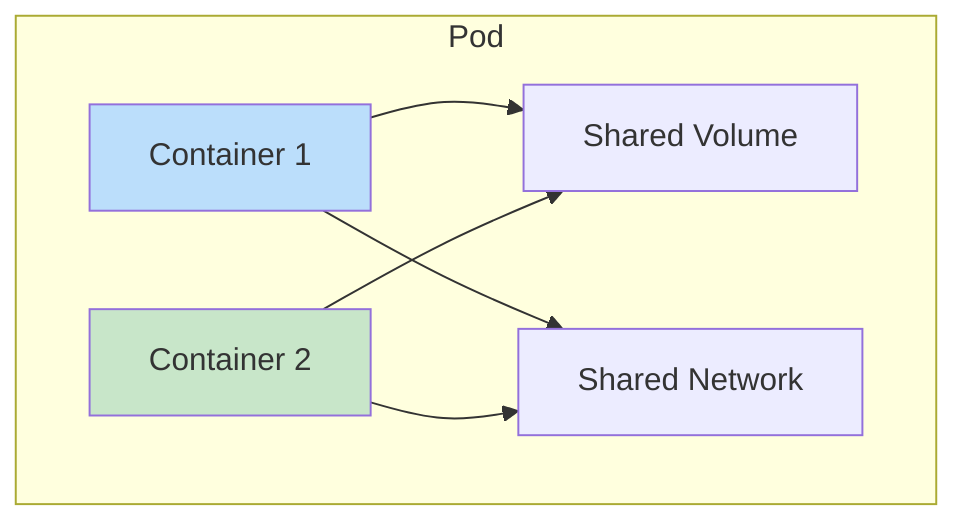
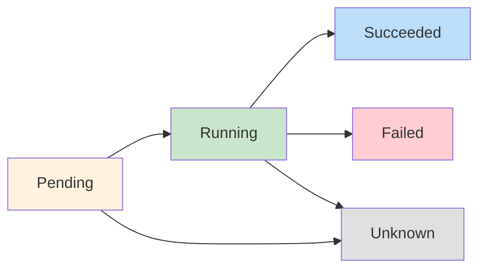
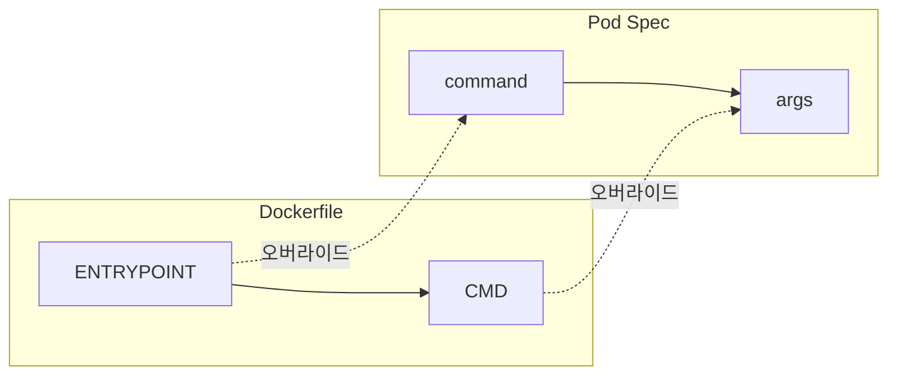
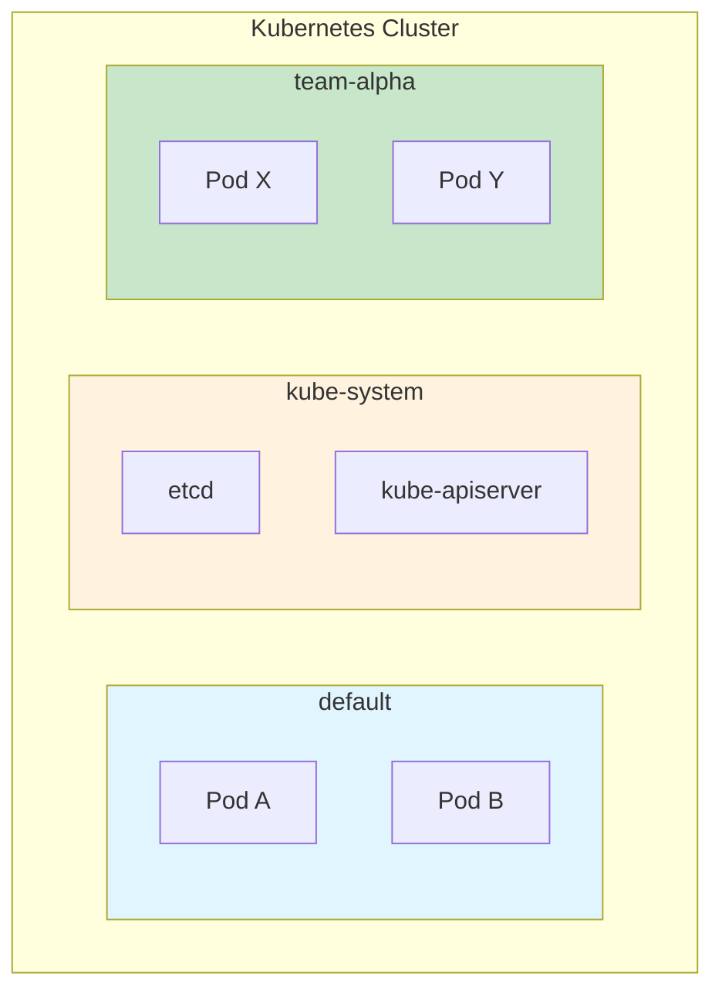

---

## 📌 핵심 요약
> 이 장에서는 Kubernetes의 가장 핵심적인 primitive인 Pod와 객체 그룹화를 위한 Namespace를 다룬다. 핵심은 **Pod 생성/조회/삭제 명령어**, **Pod 생명주기 단계 이해**, **컨테이너 설정(환경변수, command/args)**, 그리고 **Namespace를 통한 객체 격리**를 익히는 것이다.

## 🎯 학습 목표
이 내용을 읽고 나면:
- [ ] kubectl run 명령어로 Pod를 생성할 수 있다
- [ ] Pod의 생명주기 단계(Pending, Running, Succeeded, Failed, Unknown)를 설명할 수 있다
- [ ] kubectl logs, exec 명령어로 컨테이너와 상호작용할 수 있다
- [ ] 환경변수, command/args를 사용하여 Pod를 설정할 수 있다
- [ ] Namespace를 생성하고 영구 설정할 수 있다

## 📖 본문 정리

### 1. Pod란?



| 개념 | 설명 |
|------|------|
| **Pod** | 컨테이너화된 애플리케이션을 실행하는 가장 기본적인 Kubernetes primitive |
| **단일 컨테이너 Pod** | 가장 일반적인 패턴 (1 Pod : 1 Container) |
| **다중 컨테이너 Pod** | 밀접하게 결합된 프로세스 (Sidecar, Adapter, Ambassador, Init Container) |

> 💡 **핵심**: Pod는 컨테이너를 실행하는 래퍼이면서, 스토리지/설정 등 Kubernetes 기능을 혼합하는 단위

---

### 2. Pod 생성

#### 2.1 명령형 생성 (Imperative)

```bash
# 기본 Pod 생성
$ kubectl run hazelcast --image=hazelcast/hazelcast:5.1.7

# 포트, 환경변수, 레이블 포함
$ kubectl run hazelcast --image=hazelcast/hazelcast:5.1.7 \
  --port=5701 \
  --env="DNS_DOMAIN=cluster" \
  --labels="app=hazelcast,env=prod"
```

**kubectl run 주요 옵션**:

| 옵션 | 예시 | 설명 |
|------|------|------|
| `--image` | `nginx:1.25.1` | 컨테이너 이미지 |
| `--port` | `80` | 노출할 포트 |
| `--env` | `KEY=value` | 환경변수 설정 |
| `--labels` | `app=web,env=prod` | 레이블 (쉼표 구분) |
| `--rm` | `true` | 명령 완료 후 Pod 자동 삭제 |

#### 2.2 선언형 생성 (Declarative)

```yaml
# pod.yaml
apiVersion: v1
kind: Pod
metadata:
  name: hazelcast
  labels:
    app: hazelcast
    env: prod
spec:
  containers:
  - name: hazelcast
    image: hazelcast/hazelcast:5.1.7
    env:
    - name: DNS_DOMAIN
      value: cluster
    ports:
    - containerPort: 5701
```

```bash
$ kubectl apply -f pod.yaml
pod/hazelcast created
```

---

### 3. Pod 조회

```bash
# 모든 Pod 조회
$ kubectl get pods
NAME        READY   STATUS    RESTARTS   AGE
hazelcast   1/1     Running   0          17s

# 특정 Pod 조회
$ kubectl get pods hazelcast

# 상세 정보 (IP 포함)
$ kubectl get pods hazelcast -o wide

# 레이블로 필터링
$ kubectl get pods -l app=hazelcast

# 모든 네임스페이스
$ kubectl get pods -A
$ kubectl get pods --all-namespaces
```

---

### 4. Pod 생명주기 단계



| 단계 | 설명 |
|------|------|
| **Pending** | Pod가 승인되었으나, 컨테이너 이미지가 아직 생성되지 않음 |
| **Running** | 최소 하나의 컨테이너가 실행 중이거나 시작/재시작 중 |
| **Succeeded** | 모든 컨테이너가 성공적으로 종료됨 |
| **Failed** | 모든 컨테이너가 종료됨, 최소 하나가 오류로 실패 |
| **Unknown** | Pod 상태를 알 수 없음 |

> ⚠️ **주의**: Pod 생명주기 단계 ≠ 컨테이너 상태 (Waiting, Running, Terminated)

---

### 5. 컨테이너 재시작 정책

```yaml
apiVersion: v1
kind: Pod
metadata:
  name: hazelcast
spec:
  containers:
  - name: hazelcast
    image: hazelcast/hazelcast:5.1.7
  restartPolicy: Never    # Always | OnFailure | Never
```

| 정책 | 설명 | 기본값 |
|------|------|--------|
| **Always** | 종료 시 항상 재시작 | ✅ 기본값 |
| **OnFailure** | 오류(비정상 종료)시에만 재시작 | |
| **Never** | 재시작하지 않음 | |

---

### 6. Pod 상세 정보 조회

```bash
# 상세 정보 확인
$ kubectl describe pods hazelcast
Name:               hazelcast
Namespace:          default
Node:               docker-desktop/192.168.65.3
Labels:             app=hazelcast
                    env=prod
Status:             Running
IP:                 10.1.0.41
Containers:
  ...
Events:
  ...

# 특정 정보 추출 (grep과 조합)
$ kubectl describe pods hazelcast | grep Image:
    Image:          hazelcast/hazelcast:5.1.7
```

---

### 7. 컨테이너 로그 확인

```bash
# 로그 조회
$ kubectl logs hazelcast

# 실시간 로그 스트리밍 (-f)
$ kubectl logs hazelcast -f

# 이전 컨테이너 로그 (-p)
$ kubectl logs hazelcast -p

# 다중 컨테이너 Pod에서 특정 컨테이너 로그
$ kubectl logs hazelcast -c container-name
```

| 옵션 | 설명 |
|------|------|
| `-f` / `--follow` | 실시간 로그 스트리밍 |
| `-p` / `--previous` | 이전(재시작 전) 컨테이너 로그 |
| `-c` | 특정 컨테이너 지정 (다중 컨테이너 Pod) |

---

### 8. 컨테이너 내 명령 실행

```bash
# 대화형 셸 접속
$ kubectl exec -it hazelcast -- /bin/sh
# ls -l
# exit

# 단일 명령 실행
$ kubectl exec hazelcast -- env
$ kubectl exec hazelcast -- cat /etc/config

# 다중 컨테이너 Pod에서 특정 컨테이너
$ kubectl exec -it hazelcast -c container-name -- /bin/sh
```

> 💡 **핵심**: `--` (두 개의 대시)는 kubectl 옵션과 컨테이너 내 명령을 구분

---

### 9. 임시 Pod 생성 (--rm)

트러블슈팅용 일회성 Pod:

```bash
# 환경변수 확인 후 자동 삭제
$ kubectl run busybox --image=busybox:1.36.1 --rm -it --restart=Never -- env
...
pod "busybox" deleted

# 다른 Pod에 네트워크 요청 테스트
$ kubectl run busybox --image=busybox:1.36.1 --rm -it --restart=Never \
  -- wget 10.244.0.5:80
```

| 플래그 | 설명 |
|--------|------|
| `--rm` | 명령 완료 후 Pod 자동 삭제 |
| `-it` | 대화형 터미널 |
| `--restart=Never` | 재시작하지 않음 |

---

### 10. Pod IP 주소

```bash
# IP 주소 확인 방법 1: -o wide
$ kubectl get pod nginx -o wide
NAME    READY   STATUS    RESTARTS   AGE   IP           NODE
nginx   1/1     Running   0          37s   10.244.0.5   minikube

# IP 주소 확인 방법 2: YAML 출력
$ kubectl get pod nginx -o yaml | grep podIP
  podIP: 10.244.0.5

# 다른 Pod에서 접근 테스트
$ kubectl run busybox --image=busybox:1.36.1 --rm -it --restart=Never \
  -- wget 10.244.0.5:80
```

> ⚠️ **주의**: Pod IP는 재시작 시 변경됨 (불안정). 안정적인 통신은 **Service** 사용

---

### 11. Pod 설정

#### 11.1 환경변수

```yaml
apiVersion: v1
kind: Pod
metadata:
  name: spring-boot-app
spec:
  containers:
  - name: spring-boot-app
    image: springio/gs-spring-boot-docker
    env:
    - name: SPRING_PROFILES_ACTIVE
      value: dev
    - name: VERSION
      value: '1.5.3'
```

> 💡 **Best Practice**: 환경별 컨테이너 이미지 생성 ❌ → 환경변수로 런타임 설정 ✅

#### 11.2 Command와 Args



| Docker 지시어 | Pod 속성 | 설명 |
|---------------|----------|------|
| `ENTRYPOINT` | `command` | 실행할 명령 |
| `CMD` | `args` | 명령에 전달할 인자 |

```yaml
# 방법 1: args만 사용
apiVersion: v1
kind: Pod
metadata:
  name: mypod
spec:
  containers:
  - name: mypod
    image: busybox:1.36.1
    args:
    - /bin/sh
    - -c
    - while true; do date; sleep 10; done

# 방법 2: command + args
apiVersion: v1
kind: Pod
metadata:
  name: mypod
spec:
  containers:
  - name: mypod
    image: busybox:1.36.1
    command: ["/bin/sh"]
    args: ["-c", "while true; do date; sleep 10; done"]
```

**명령형으로 YAML 생성**:

```bash
$ kubectl run mypod --image=busybox:1.36.1 -o yaml --dry-run=client \
  > pod.yaml -- /bin/sh -c "while true; do date; sleep 10; done"
```

---

### 12. Pod 삭제

```bash
# 이름으로 삭제 (graceful, 기본 30초)
$ kubectl delete pod hazelcast
pod "hazelcast" deleted

# 즉시 삭제 (시험에서 시간 절약!)
$ kubectl delete pod hazelcast --now

# YAML 파일로 삭제
$ kubectl delete -f pod.yaml
```

> 🎯 **시험 팁**: `--now` 옵션으로 graceful 삭제 대기 시간 절약!

---

## Namespace

### 13. Namespace 개요



| Namespace | 설명 |
|-----------|------|
| `default` | 명시적 네임스페이스 없이 생성된 객체 |
| `kube-system` | Kubernetes 시스템 컴포넌트 |
| `kube-public` | 모든 사용자 읽기 가능 |
| `kube-node-lease` | 노드 heartbeat 관련 |

---

### 14. Namespace 명령어

```bash
# Namespace 목록 조회
$ kubectl get namespaces
NAME              STATUS   AGE
default           Active   157d
kube-system       Active   157d

# Namespace 생성
$ kubectl create namespace code-red
namespace/code-red created

# 특정 Namespace에 Pod 생성
$ kubectl run nginx --image=nginx:1.25.1 -n code-red
pod/nginx created

# 특정 Namespace의 Pod 조회
$ kubectl get pods -n code-red

# Namespace 삭제 (⚠️ 내부 객체도 모두 삭제됨!)
$ kubectl delete namespace code-red
```

---

### 15. 영구 Namespace 설정

매번 `-n` 옵션 입력을 피하기 위해 기본 네임스페이스 설정:

```bash
# 기본 Namespace 설정
$ kubectl config set-context --current --namespace=code-red
Context "minikube" modified.

# 현재 설정된 Namespace 확인
$ kubectl config view --minify | grep namespace:
    namespace: code-red

# 이제 -n 없이 해당 Namespace 사용
$ kubectl get pods
NAME    READY   STATUS    RESTARTS   AGE
nginx   1/1     Running   0          13s

# default로 복귀
$ kubectl config set-context --current --namespace=default
```

---

### 16. 핵심 명령어 요약

#### Pod 관련

| 작업 | 명령어 |
|------|--------|
| **Pod 생성** | `kubectl run <name> --image=<image>` |
| **Pod 조회** | `kubectl get pods` |
| **상세 조회** | `kubectl describe pod <name>` |
| **로그 확인** | `kubectl logs <name> [-f] [-p]` |
| **셸 접속** | `kubectl exec -it <name> -- /bin/sh` |
| **명령 실행** | `kubectl exec <name> -- <command>` |
| **Pod 삭제** | `kubectl delete pod <name> [--now]` |
| **임시 Pod** | `kubectl run <name> --image=<image> --rm -it --restart=Never -- <cmd>` |

#### Namespace 관련

| 작업 | 명령어 |
|------|--------|
| **Namespace 목록** | `kubectl get namespaces` |
| **Namespace 생성** | `kubectl create namespace <name>` |
| **특정 NS에서 작업** | `kubectl <command> -n <namespace>` |
| **기본 NS 설정** | `kubectl config set-context --current --namespace=<name>` |
| **Namespace 삭제** | `kubectl delete namespace <name>` |

---

## 🔍 심화 학습

### 추가 조사 내용
- **다중 컨테이너 Pod 패턴**: Sidecar, Adapter, Ambassador, Init Container
- **Pod QoS Classes**: Guaranteed, Burstable, BestEffort
- **Static Pods**: kubelet이 직접 관리하는 Pod

### 출처
- [Kubernetes 공식 문서 - Pods](https://kubernetes.io/docs/concepts/workloads/pods/)
- [Kubernetes 공식 문서 - Namespaces](https://kubernetes.io/docs/concepts/overview/working-with-objects/namespaces/)
- [Kubernetes Blog - Multi-container Pod Design Patterns](https://kubernetes.io/blog/)

---

## 💡 실무 적용 포인트

### 이런 상황에서 기억하세요
- **CKA 시험**: 대부분 특정 Namespace에서 작업 요구 → `-n` 옵션 필수!
- **트러블슈팅**: `kubectl logs -p`로 재시작 전 로그 확인
- **시간 절약**: `kubectl delete pod --now`로 즉시 삭제

### 주의할 점 / 흔한 실수
- ⚠️ Namespace 삭제 시 내부 객체도 모두 삭제됨
- ⚠️ Pod IP는 불안정 → Service 사용 권장
- ⚠️ `kubectl exec`에서 `--` 빠뜨리지 않기
- ⚠️ 기본 Namespace 설정 후 다른 NS 작업 시 혼동 주의

### 면접에서 나올 수 있는 질문
- Q: Pod의 생명주기 단계를 설명하세요.
- Q: restartPolicy의 종류와 차이점은?
- Q: Pod IP가 불안정한 이유는?
- Q: Namespace를 사용하는 이유는?
- Q: `kubectl exec -it -- /bin/sh`에서 `--`의 역할은?

---

## ✅ 핵심 개념 체크리스트
- [ ] `kubectl run`으로 Pod를 생성할 수 있는가?
- [ ] Pod 생명주기 단계(Pending, Running, Succeeded, Failed, Unknown)를 이해하는가?
- [ ] `kubectl logs`, `kubectl exec` 명령어를 사용할 수 있는가?
- [ ] 임시 Pod(`--rm`)를 생성하고 활용할 수 있는가?
- [ ] 환경변수, command/args를 Pod에 설정할 수 있는가?
- [ ] Namespace를 생성하고 기본 Namespace를 설정할 수 있는가?
- [ ] `-n` 옵션으로 특정 Namespace에서 작업할 수 있는가?

---

## 🔗 참고 자료
- 📄 공식 문서: [Pods](https://kubernetes.io/docs/concepts/workloads/pods/)
- 📄 공식 문서: [Namespaces](https://kubernetes.io/docs/concepts/overview/working-with-objects/namespaces/)
- 📄 kubectl 참조: [kubectl Cheat Sheet](https://kubernetes.io/docs/reference/kubectl/cheatsheet/)
- 📘 GitHub: [bmuschko/cka-study-guide](https://github.com/bmuschko/cka-study-guide)

---
