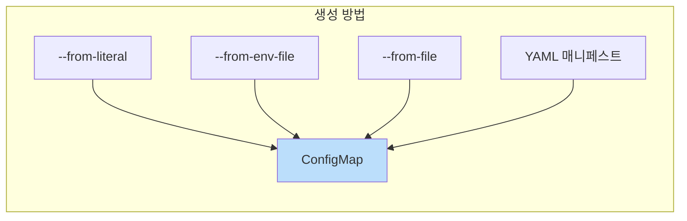
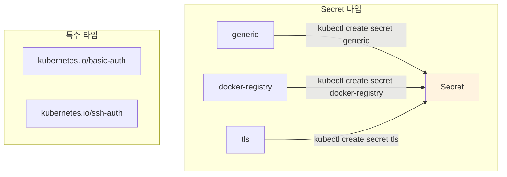
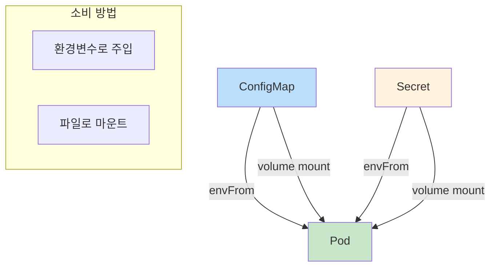

## 📌 핵심 요약
> 이 장에서는 Kubernetes의 설정 데이터 관리 도구인 ConfigMap과 Secret을 다룬다. 핵심은 **ConfigMap/Secret 생성 방법**, **Pod에서의 소비 방법(환경변수, 볼륨 마운트)**, 그리고 **Secret의 Base64 인코딩 특성**을 이해하는 것이다.

## 🎯 학습 목표
이 내용을 읽고 나면:
- [ ] ConfigMap과 Secret의 목적과 차이점을 설명할 수 있다
- [ ] 다양한 방법으로 ConfigMap/Secret을 생성할 수 있다
- [ ] Pod에서 ConfigMap/Secret을 환경변수나 볼륨으로 소비할 수 있다
- [ ] Secret의 Base64 인코딩과 보안 특성을 이해할 수 있다

## 📖 본문 정리

### 1. ConfigMap과 Secret 개요

| 구분 | ConfigMap | Secret |
|------|-----------|--------|
| **용도** | 일반 설정 데이터 | 민감한 데이터 (비밀번호, API 키 등) |
| **저장 방식** | 평문 (Plain text) | Base64 인코딩 |
| **etcd 저장** | 암호화 없음 | 암호화 가능 (Encryption at Rest) |
| **최대 크기** | 1MB | 1MB |

> ⚠️ **주의**: Secret의 Base64 인코딩은 **암호화가 아님**! 단순 인코딩일 뿐 보안을 제공하지 않는다.

---

### 2. ConfigMap 생성



#### 방법 1: --from-literal (리터럴 값)

```bash
# 단일 키-값
$ kubectl create configmap db-config --from-literal=db=staging

# 여러 키-값
$ kubectl create configmap db-config \
  --from-literal=db=staging \
  --from-literal=username=jdoe
```

#### 방법 2: --from-env-file (환경 파일)

```bash
# config.env 파일 내용
# db=staging
# username=jdoe

$ kubectl create configmap db-config --from-env-file=config.env
```

#### 방법 3: --from-file (파일 전체)

```bash
# 파일명이 키가 됨
$ kubectl create configmap db-config --from-file=config.txt

# 키 이름 지정
$ kubectl create configmap db-config --from-file=myconfig=config.txt

# 디렉토리 전체
$ kubectl create configmap db-config --from-file=config-dir/
```

#### 방법 4: YAML 매니페스트

```yaml
apiVersion: v1
kind: ConfigMap
metadata:
  name: db-config
data:
  db: staging
  username: jdoe
```

---

### 3. Secret 생성



#### Secret 타입

| 타입 | 용도 | 생성 명령어 |
|------|------|-------------|
| **generic** | 범용 Secret | `kubectl create secret generic` |
| **docker-registry** | 컨테이너 레지스트리 인증 | `kubectl create secret docker-registry` |
| **tls** | TLS 인증서 | `kubectl create secret tls` |
| **kubernetes.io/basic-auth** | HTTP Basic Auth | 매니페스트로 생성 |
| **kubernetes.io/ssh-auth** | SSH 키 | 매니페스트로 생성 |

#### Generic Secret 생성

```bash
# --from-literal
$ kubectl create secret generic db-creds \
  --from-literal=pwd=s3cre!

# --from-file
$ kubectl create secret generic db-creds \
  --from-file=password.txt
```

#### Base64 인코딩 확인

```bash
# Secret 조회 (Base64 인코딩된 값)
$ kubectl get secret db-creds -o yaml
data:
  pwd: czNjcmUh

# 디코딩
$ echo "czNjcmUh" | base64 -d
s3cre!

# 직접 조회 (자동 디코딩)
$ kubectl get secret db-creds -o jsonpath='{.data.pwd}' | base64 -d
```

#### YAML 매니페스트 (data vs stringData)

```yaml
apiVersion: v1
kind: Secret
metadata:
  name: db-creds
type: Opaque
# data: Base64 인코딩된 값 사용
data:
  pwd: czNjcmUh
---
apiVersion: v1
kind: Secret
metadata:
  name: db-creds
type: Opaque
# stringData: 평문 사용 (생성 시 자동 인코딩)
stringData:
  pwd: s3cre!
```

> 💡 `stringData`는 생성 후 조회 시 `data`로 변환되어 Base64 값으로 표시됨

---

### 4. Pod에서 ConfigMap/Secret 소비



#### 방법 1: envFrom (전체 키를 환경변수로)

```yaml
apiVersion: v1
kind: Pod
metadata:
  name: backend
spec:
  containers:
  - name: backend
    image: nginx:1.25.1
    envFrom:
    # ConfigMap 전체를 환경변수로
    - configMapRef:
        name: db-config
    # Secret 전체를 환경변수로
    - secretRef:
        name: db-creds
```

```bash
# 환경변수 확인
$ kubectl exec backend -- env
db=staging
username=jdoe
pwd=s3cre!
```

#### 방법 2: valueFrom (개별 키 선택 + 이름 변경)

```yaml
apiVersion: v1
kind: Pod
metadata:
  name: backend
spec:
  containers:
  - name: backend
    image: nginx:1.25.1
    env:
    # ConfigMap에서 특정 키
    - name: DATABASE      # 환경변수 이름 (커스텀)
      valueFrom:
        configMapKeyRef:
          name: db-config
          key: db         # ConfigMap의 키
    # Secret에서 특정 키
    - name: PASSWORD      # 환경변수 이름 (커스텀)
      valueFrom:
        secretKeyRef:
          name: db-creds
          key: pwd        # Secret의 키
```

#### 방법 3: Volume Mount (파일로 마운트)

```yaml
apiVersion: v1
kind: Pod
metadata:
  name: backend
spec:
  containers:
  - name: backend
    image: nginx:1.25.1
    volumeMounts:
    - name: config-vol
      mountPath: /etc/config     # 마운트 경로
    - name: secret-vol
      mountPath: /etc/secret
      readOnly: true             # Secret은 읽기 전용 권장
  volumes:
  - name: config-vol
    configMap:
      name: db-config
  - name: secret-vol
    secret:
      secretName: db-creds
```

```bash
# 마운트된 파일 확인
$ kubectl exec backend -- ls /etc/config
db
username

$ kubectl exec backend -- cat /etc/config/db
staging

$ kubectl exec backend -- cat /etc/secret/pwd
s3cre!
```

---

### 5. 소비 방법 비교

| 특성 | envFrom | valueFrom | Volume Mount |
|------|---------|-----------|--------------|
| **사용 방식** | 환경변수 (전체) | 환경변수 (선택) | 파일 |
| **키 이름 변경** | ❌ | ✅ | ❌ |
| **부분 선택** | ❌ | ✅ | ✅ (items) |
| **런타임 업데이트** | ❌ (재시작 필요) | ❌ (재시작 필요) | ✅ (자동 반영) |
| **대용량 데이터** | 부적합 | 부적합 | 적합 |

> 💡 **Volume Mount 장점**: ConfigMap/Secret 변경 시 Pod 재시작 없이 자동 반영 (단, 애플리케이션이 파일 변경을 감지해야 함)

---

### 6. 핵심 명령어 요약

| 작업 | 명령어 |
|------|--------|
| **ConfigMap 생성 (리터럴)** | `kubectl create configmap <name> --from-literal=key=value` |
| **ConfigMap 생성 (env 파일)** | `kubectl create configmap <name> --from-env-file=<file>` |
| **ConfigMap 생성 (파일)** | `kubectl create configmap <name> --from-file=<file>` |
| **Secret 생성 (generic)** | `kubectl create secret generic <name> --from-literal=key=value` |
| **Secret 생성 (docker)** | `kubectl create secret docker-registry <name> --docker-server=... --docker-username=... --docker-password=...` |
| **Secret 생성 (tls)** | `kubectl create secret tls <name> --cert=<cert-file> --key=<key-file>` |
| **ConfigMap 조회** | `kubectl get configmap <name> -o yaml` |
| **Secret 조회** | `kubectl get secret <name> -o yaml` |
| **Secret 값 디코딩** | `kubectl get secret <name> -o jsonpath='{.data.<key>}' \| base64 -d` |

---

### 7. 특수 Secret 타입 예시

#### kubernetes.io/basic-auth

```yaml
apiVersion: v1
kind: Secret
metadata:
  name: basic-auth-secret
type: kubernetes.io/basic-auth
stringData:
  username: admin
  password: secret123
```

#### kubernetes.io/ssh-auth

```yaml
apiVersion: v1
kind: Secret
metadata:
  name: ssh-key-secret
type: kubernetes.io/ssh-auth
data:
  ssh-privatekey: <base64-encoded-private-key>
```

---

## 🔍 심화 학습

### 추가 조사 내용
- **Encryption at Rest**: etcd에 저장된 Secret 암호화 설정
- **External Secrets Operator**: AWS Secrets Manager, HashiCorp Vault 통합
- **Sealed Secrets**: GitOps 환경에서 Secret 관리

### 출처
- [Kubernetes 공식 문서 - ConfigMaps](https://kubernetes.io/docs/concepts/configuration/configmap/)
- [Kubernetes 공식 문서 - Secrets](https://kubernetes.io/docs/concepts/configuration/secret/)

---

## 💡 실무 적용 포인트

### 이런 상황에서 기억하세요
- **설정 분리**: 애플리케이션 이미지와 설정을 분리하여 재사용성 향상
- **환경별 설정**: 개발/스테이징/프로덕션 환경마다 다른 ConfigMap/Secret 사용
- **민감 정보**: 비밀번호, API 키는 반드시 Secret 사용

### 주의할 점 / 흔한 실수
- ⚠️ Secret의 Base64는 **암호화가 아님** - 누구나 디코딩 가능
- ⚠️ `data` 필드에는 Base64 인코딩된 값, `stringData`에는 평문 사용
- ⚠️ ConfigMap/Secret 변경 시 환경변수는 Pod 재시작 필요, 볼륨은 자동 반영
- ⚠️ Git에 Secret 매니페스트 커밋 금지 (Sealed Secrets 또는 외부 Secret 관리 도구 사용)

### 면접에서 나올 수 있는 질문
- Q: ConfigMap과 Secret의 차이점은?
- Q: Secret이 안전하지 않은 이유는?
- Q: Pod에서 ConfigMap/Secret을 소비하는 방법은?
- Q: ConfigMap 변경 시 Pod를 재시작해야 하는 경우와 아닌 경우는?
- Q: 프로덕션 환경에서 Secret을 안전하게 관리하는 방법은?

---

## ✅ 핵심 개념 체크리스트
- [ ] ConfigMap과 Secret의 용도 차이를 이해하는가?
- [ ] `--from-literal`, `--from-env-file`, `--from-file` 차이를 아는가?
- [ ] Secret의 `data`와 `stringData` 차이를 아는가?
- [ ] Base64 인코딩/디코딩을 할 수 있는가?
- [ ] `envFrom`과 `valueFrom`의 차이를 아는가?
- [ ] Volume Mount 방식으로 ConfigMap/Secret을 사용할 수 있는가?
- [ ] 환경변수 방식과 볼륨 방식의 업데이트 차이를 아는가?

---

## 🔗 참고 자료
- 📄 공식 문서: [ConfigMaps](https://kubernetes.io/docs/concepts/configuration/configmap/)
- 📄 공식 문서: [Secrets](https://kubernetes.io/docs/concepts/configuration/secret/)
- 📄 Secret 타입: [Secret Types](https://kubernetes.io/docs/concepts/configuration/secret/#secret-types)
- 📘 GitHub: [bmuschko/cka-study-guide](https://github.com/bmuschko/cka-study-guide)

---
