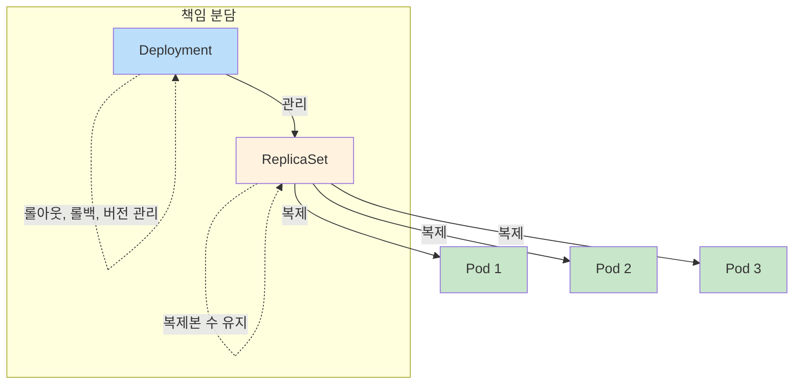
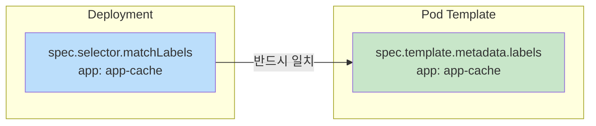
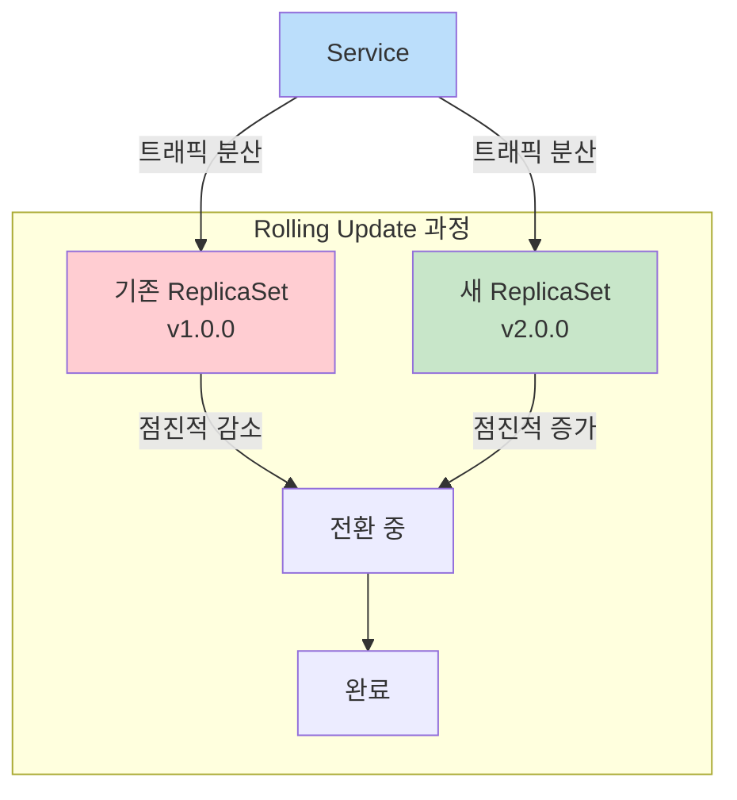

## 📌 핵심 요약
> 이 장에서는 Kubernetes의 핵심 워크로드 관리 도구인 Deployment와 ReplicaSet을 다룬다. 핵심은 **Deployment 생성과 관리**, **Rolling Update를 통한 새 버전 배포**, 그리고 **Rollback을 통한 이전 버전 복구**를 이해하는 것이다.

## 🎯 학습 목표
이 내용을 읽고 나면:
- [ ] Deployment와 ReplicaSet의 관계를 설명할 수 있다
- [ ] Deployment를 생성하고 replicas를 관리할 수 있다
- [ ] Rolling Update로 애플리케이션을 업데이트할 수 있다
- [ ] Rollback으로 이전 버전으로 되돌릴 수 있다

## 📖 본문 정리

### 1. Deployment와 ReplicaSet 개요



| 구성요소 | 역할 | 직접 관리 필요 |
|----------|------|----------------|
| **Deployment** | ReplicaSet 관리, 롤아웃/롤백, 버전 이력 | ✅ 사용자가 관리 |
| **ReplicaSet** | 동일한 Pod의 복제본 수 유지 | ❌ Deployment가 자동 관리 |
| **Pod** | 실제 컨테이너 실행 | ❌ ReplicaSet이 자동 관리 |

> 💡 **핵심**: Deployment만 관리하면 ReplicaSet과 Pod는 자동으로 관리됨

---

### 2. 단일 Pod의 한계

| 문제점 | 설명 |
|--------|------|
| **단일 장애점** | 하나의 Pod에 모든 트래픽이 집중 |
| **확장성 부족** | 부하 증가 시 대응 불가 |
| **내결함성 없음** | 노드 장애 시 Pod 재스케줄링 안 됨 |

→ **해결책**: Deployment + ReplicaSet으로 복제본 관리

---

### 3. Deployment 생성

#### 명령형 (Imperative)

```bash
# 기본 생성 (replicas 기본값: 1)
$ kubectl create deployment app-cache --image=memcached:1.6.8

# replicas 지정
$ kubectl create deployment app-cache --image=memcached:1.6.8 --replicas=4
deployment.apps/app-cache created
```

#### 선언형 (Declarative)

```yaml
apiVersion: apps/v1
kind: Deployment
metadata:
  name: app-cache
  labels:
    app: app-cache
spec:
  replicas: 4
  selector:
    matchLabels:
      app: app-cache        # ← Pod 선택 기준
  template:
    metadata:
      labels:
        app: app-cache      # ← 반드시 selector와 일치해야 함
    spec:
      containers:
      - name: memcached
        image: memcached:1.6.8
```

#### Label Selection 규칙



> ⚠️ **주의**: `spec.selector.matchLabels`와 `spec.template.metadata.labels`가 일치하지 않으면 생성 실패!

---

### 4. Deployment 조회

#### Deployment 목록

```bash
$ kubectl get deployments
NAME        READY   UP-TO-DATE   AVAILABLE   AGE
app-cache   4/4     4            4           125m
```

| 컬럼 | 설명 |
|------|------|
| **READY** | `<준비됨>/<원하는 수>` (spec.replicas 기준) |
| **UP-TO-DATE** | 최신 상태로 업데이트된 replicas 수 |
| **AVAILABLE** | 사용자에게 서비스 가능한 replicas 수 |

#### ReplicaSet과 Pod 함께 조회

```bash
$ kubectl get replicasets,pods
NAME                                   DESIRED   CURRENT   READY   AGE
replicaset.apps/app-cache-596bc5586d   4         4         4       6h5m

NAME                             READY   STATUS    RESTARTS   AGE
pod/app-cache-596bc5586d-84dkv   1/1     Running   0          6h5m
pod/app-cache-596bc5586d-8bzfs   1/1     Running   0          6h5m
pod/app-cache-596bc5586d-rc257   1/1     Running   0          6h5m
pod/app-cache-596bc5586d-tvm4d   1/1     Running   0          6h5m
```

> 💡 **네이밍 규칙**: `<deployment-name>-<replicaset-hash>-<pod-hash>`

#### Deployment 상세 정보

```bash
$ kubectl describe deployment app-cache
```

---

### 5. Self-Healing (자가 복구)

ReplicaSet은 **원하는 replicas 수를 항상 유지**한다.

```bash
# Pod 삭제
$ kubectl delete pod app-cache-596bc5586d-rc257
pod "app-cache-596bc5586d-rc257" deleted

# 자동으로 새 Pod 생성됨
$ kubectl get pods
NAME                             READY   STATUS    RESTARTS   AGE
pod/app-cache-596bc5586d-84dkv   1/1     Running   0          6h47m
pod/app-cache-596bc5586d-8bzfs   1/1     Running   0          6h47m
pod/app-cache-596bc5586d-lwflz   1/1     Running   0          5s    ← 새로 생성
pod/app-cache-596bc5586d-tvm4d   1/1     Running   0          6h47m
```

---

### 6. Deployment 삭제

Deployment 삭제 시 **ReplicaSet과 Pod도 함께 삭제됨** (Cascading Delete)

```bash
$ kubectl delete deployment app-cache
deployment.apps "app-cache" deleted

$ kubectl get deployments,replicasets,pods
No resources found in default namespace.
```

---

### 7. Rolling Update (롤링 업데이트)



#### Pod Template 업데이트 방법

| 방법 | 명령어 | 설명 |
|------|--------|------|
| **set image** | `kubectl set image deployment <name> <container>=<image>` | 이미지만 변경 (권장) |
| **edit** | `kubectl edit deployment <name>` | 에디터에서 직접 수정 |
| **apply** | `kubectl apply -f deployment.yaml` | 매니페스트 파일 적용 |
| **replace** | `kubectl replace -f deployment.yaml` | 기존 객체 교체 |
| **patch** | `kubectl patch deployment <name> -p '<json>'` | JSON 패치 적용 |

#### 이미지 업데이트 예시

```bash
# 이미지 변경
$ kubectl set image deployment app-cache memcached=memcached:1.6.10
deployment.apps/app-cache image updated

# 롤아웃 상태 확인
$ kubectl rollout status deployment app-cache
Waiting for rollout to finish: 2 out of 4 new replicas have been updated...
deployment "app-cache" successfully rolled out
```

---

### 8. Rollout History (롤아웃 이력)

```bash
# 이력 조회
$ kubectl rollout history deployment app-cache
REVISION  CHANGE-CAUSE
1         <none>
2         <none>

# 특정 revision 상세 조회
$ kubectl rollout history deployment app-cache --revision=2
deployment.apps/app-cache with revision #2
Pod Template:
  Labels:    app=app-cache
  Containers:
   memcached:
    Image:    memcached:1.6.10
    ...
```

> 💡 **기본 이력 보관**: 최대 10개 (`spec.revisionHistoryLimit`으로 변경 가능)

#### Change Cause 추가

```bash
# annotation으로 변경 사유 기록
$ kubectl annotate deployment app-cache \
  kubernetes.io/change-cause="Image updated to 1.6.10"

# 이력에 반영됨
$ kubectl rollout history deployment app-cache
REVISION  CHANGE-CAUSE
1         <none>
2         Image updated to 1.6.10
```

---

### 9. Rollback (롤백)

```bash
# 이전 revision으로 롤백 (기본: 바로 이전)
$ kubectl rollout undo deployment app-cache

# 특정 revision으로 롤백
$ kubectl rollout undo deployment app-cache --to-revision=1
deployment.apps/app-cache rolled back

# 롤백 후 이력 (revision 1이 3으로 변경됨)
$ kubectl rollout history deployment app-cache
REVISION  CHANGE-CAUSE
2         Image updated to 1.6.10
3         <none>
```

> ⚠️ **주의**: 롤백은 Pod 템플릿만 복원. **영구 데이터는 복원되지 않음!**

---

### 10. Deployment Strategy

| 전략 | 설명 | 다운타임 |
|------|------|----------|
| **RollingUpdate** (기본) | 점진적으로 새 버전으로 교체 | 없음 |
| **Recreate** | 모든 Pod 종료 후 새 Pod 생성 | 있음 |

```yaml
spec:
  strategy:
    type: RollingUpdate  # 또는 Recreate
    rollingUpdate:
      maxUnavailable: 25%  # 업데이트 중 사용 불가 Pod 최대 비율
      maxSurge: 25%        # 원하는 수 초과 Pod 최대 비율
```

---

### 11. 핵심 명령어 요약

| 작업 | 명령어 |
|------|--------|
| **Deployment 생성** | `kubectl create deployment <name> --image=<image> --replicas=<n>` |
| **Deployment 조회** | `kubectl get deployments` |
| **ReplicaSet/Pod 조회** | `kubectl get replicasets,pods` |
| **상세 정보** | `kubectl describe deployment <name>` |
| **이미지 업데이트** | `kubectl set image deployment <name> <container>=<image>` |
| **롤아웃 상태** | `kubectl rollout status deployment <name>` |
| **롤아웃 이력** | `kubectl rollout history deployment <name>` |
| **특정 revision 조회** | `kubectl rollout history deployment <name> --revision=<n>` |
| **롤백** | `kubectl rollout undo deployment <name> --to-revision=<n>` |
| **Change Cause 추가** | `kubectl annotate deployment <name> kubernetes.io/change-cause="<msg>"` |
| **Deployment 삭제** | `kubectl delete deployment <name>` |

---

### 12. Deployment vs ReplicaSet 비교

| 기능 | Deployment | ReplicaSet |
|------|------------|------------|
| **복제본 관리** | ✅ (ReplicaSet 위임) | ✅ |
| **롤아웃/롤백** | ✅ | ❌ |
| **버전 이력** | ✅ | ❌ |
| **직접 사용 권장** | ✅ | ❌ (Deployment 사용) |

---

## 🔍 심화 학습

### 추가 조사 내용
- **Blue-Green Deployment**: 두 버전 동시 운영 후 트래픽 전환
- **Canary Deployment**: 일부 트래픽만 새 버전으로 라우팅
- **StatefulSet vs DaemonSet**: 다른 워크로드 컨트롤러

### 출처
- [Kubernetes 공식 문서 - Deployments](https://kubernetes.io/docs/concepts/workloads/controllers/deployment/)
- [Kubernetes 공식 문서 - ReplicaSet](https://kubernetes.io/docs/concepts/workloads/controllers/replicaset/)

---

## 💡 실무 적용 포인트

### 이런 상황에서 기억하세요
- **고가용성**: 항상 replicas ≥ 2 설정으로 단일 장애점 방지
- **무중단 배포**: RollingUpdate로 서비스 중단 없이 업데이트
- **빠른 복구**: 문제 발생 시 `rollout undo`로 즉시 롤백

### 주의할 점 / 흔한 실수
- ⚠️ `selector.matchLabels`와 `template.metadata.labels`가 일치해야 함
- ⚠️ 롤백은 Pod 템플릿만 복원, **데이터는 복원 안 됨**
- ⚠️ Recreate 전략은 다운타임 발생 → 프로덕션에서 주의
- ⚠️ ReplicaSet 직접 생성하지 말고 Deployment 사용

### 면접에서 나올 수 있는 질문
- Q: Deployment와 ReplicaSet의 차이점은?
- Q: Rolling Update가 무엇이며 어떻게 동작하는가?
- Q: Deployment 롤백은 어떻게 수행하는가?
- Q: RollingUpdate와 Recreate 전략의 차이점은?
- Q: Kubernetes의 Self-Healing이란 무엇인가?

---

## ✅ 핵심 개념 체크리스트
- [ ] Deployment가 ReplicaSet을 관리한다는 것을 이해하는가?
- [ ] Label Selection 규칙을 이해하는가?
- [ ] `kubectl create deployment`로 Deployment를 생성할 수 있는가?
- [ ] `kubectl set image`로 이미지를 업데이트할 수 있는가?
- [ ] `kubectl rollout status/history`를 사용할 수 있는가?
- [ ] `kubectl rollout undo`로 롤백할 수 있는가?
- [ ] Self-Healing 동작 원리를 설명할 수 있는가?
- [ ] RollingUpdate vs Recreate 차이를 아는가?

---

## 🔗 참고 자료
- 📄 공식 문서: [Deployments](https://kubernetes.io/docs/concepts/workloads/controllers/deployment/)
- 📄 공식 문서: [ReplicaSet](https://kubernetes.io/docs/concepts/workloads/controllers/replicaset/)
- 📄 롤아웃 전략: [Performing a Rolling Update](https://kubernetes.io/docs/tutorials/kubernetes-basics/update/update-intro/)
- 📘 GitHub: [bmuschko/cka-study-guide](https://github.com/bmuschko/cka-study-guide)

---
