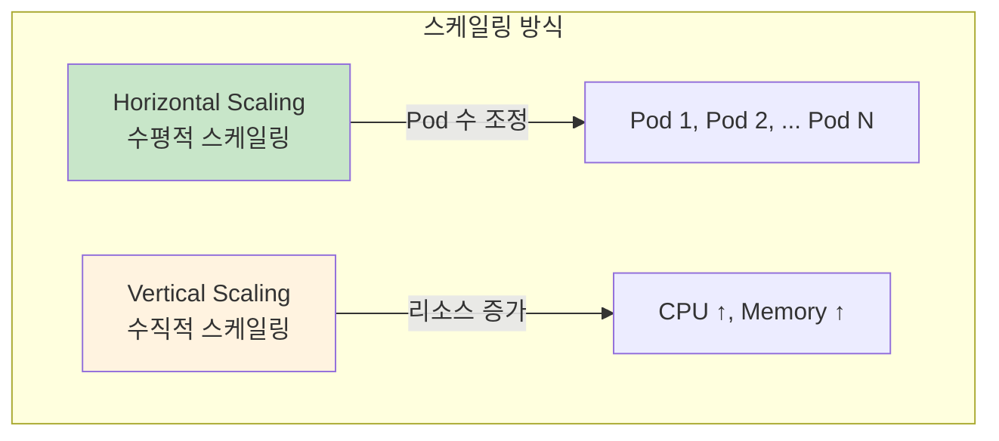
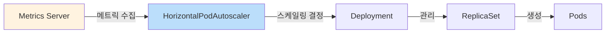
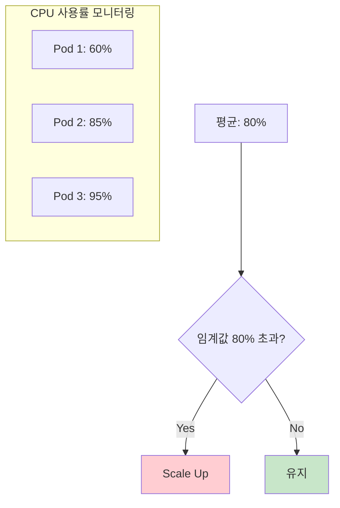

## 📌 핵심 요약
> 이 장에서는 Kubernetes 워크로드 스케일링을 다룬다. 핵심은 **수동 스케일링 (`kubectl scale`)**, **HorizontalPodAutoscaler (HPA)를 통한 자동 스케일링**, 그리고 **CPU/메모리 기반 스케일링 조건 설정**을 이해하는 것이다.

## 🎯 학습 목표
이 내용을 읽고 나면:
- [ ] 수동으로 Deployment/StatefulSet의 replicas를 조정할 수 있다
- [ ] HorizontalPodAutoscaler를 생성하고 구성할 수 있다
- [ ] HPA의 사전 요구사항을 이해할 수 있다
- [ ] CPU/메모리 기반 스케일링 메트릭을 설정할 수 있다

## 📖 본문 정리

### 1. 스케일링 개요



| 스케일링 방식 | 설명 | Kubernetes 구현 |
|---------------|------|-----------------|
| **Horizontal** | Pod 수를 늘리거나 줄임 | HorizontalPodAutoscaler (HPA) |
| **Vertical** | 개별 Pod의 리소스 증가 | VerticalPodAutoscaler (VPA) - 시험 범위 외 |

> 💡 **CKA 시험**: HPA만 시험 범위에 포함

---

### 2. 수동 스케일링 (Manual Scaling)

#### Deployment 스케일링

```bash
# replicas 증가 (4 → 6)
$ kubectl scale deployment app-cache --replicas=6
deployment.apps/app-cache scaled

# 실시간 모니터링 (-w 옵션)
$ kubectl get pods -w
NAME                         READY   STATUS              RESTARTS   AGE
app-cache-5d6748d8b9-6cc4j   1/1     ContainerCreating   0          11s
app-cache-5d6748d8b9-6rmlj   1/1     Running             0          28m
...
```

#### StatefulSet 스케일링

```bash
# StatefulSet도 동일한 명령어 사용
$ kubectl scale statefulset redis --replicas=3
statefulset.apps/redis scaled

$ kubectl get pods
NAME      READY   STATUS    RESTARTS   AGE
redis-0   1/1     Running   0          101m
redis-1   1/1     Running   0          97m
redis-2   1/1     Running   0          97m
```

> ⚠️ **StatefulSet 주의**: Scale Down 시 모든 replicas가 healthy 상태여야 함

#### 수동 스케일링의 한계

| 문제점 | 설명 |
|--------|------|
| **추측 필요** | 적절한 replicas 수를 예측해야 함 |
| **지속적 모니터링** | 트래픽 변화에 따라 수동 조정 필요 |
| **Over-provisioning** | 리소스 낭비 |
| **Under-provisioning** | 성능 저하, 사용자 경험 악화 |

---

### 3. HorizontalPodAutoscaler (HPA)



#### HPA 동작 원리

1. **Metrics Server**가 Pod의 CPU/메모리 사용량 수집
2. **HPA**가 메트릭을 평가하여 임계값 비교
3. 임계값 초과 시 **replicas 수 자동 조정**

---

### 4. HPA 사전 요구사항

| 요구사항 | 설명 |
|----------|------|
| **Metrics Server 설치** | 메트릭 수집을 위한 필수 컴포넌트 |
| **Resource Requests 정의** | Pod 템플릿에 CPU/메모리 requests 설정 |
| **충분한 클러스터 리소스** | 새 Pod 스케줄링을 위한 여유 리소스 |
| **스케일 가능한 리소스** | Deployment, ReplicaSet, StatefulSet만 가능 (단독 Pod 불가) |

#### Resource Requests 설정 예시

```yaml
spec:
  template:
    spec:
      containers:
      - name: memcached
        image: memcached:1.6.8
        resources:
          requests:
            cpu: 250m        # CPU 기반 HPA에 필수
            memory: 100Mi    # 메모리 기반 HPA에 필수
          limits:
            cpu: 500m
            memory: 500Mi
```

> ⚠️ **주의**: Resource Requests 없이 HPA 생성 시 TARGETS에 `<unknown>` 표시

---

### 5. HPA 생성

#### 명령형 (Imperative)

```bash
$ kubectl autoscale deployment app-cache \
  --cpu-percent=80 \
  --min=3 \
  --max=5
horizontalpodautoscaler.autoscaling/app-cache autoscaled
```

| 옵션 | 설명 |
|------|------|
| `--cpu-percent` | 평균 CPU 사용률 임계값 |
| `--min` | 최소 replicas 수 |
| `--max` | 최대 replicas 수 |

> 💡 **참고**: 명령형으로는 메모리 임계값 설정 불가 → YAML 매니페스트 사용

#### 선언형 (Declarative)

```yaml
apiVersion: autoscaling/v2
kind: HorizontalPodAutoscaler
metadata:
  name: app-cache
spec:
  scaleTargetRef:
    apiVersion: apps/v1
    kind: Deployment
    name: app-cache           # 대상 Deployment
  minReplicas: 3
  maxReplicas: 5
  metrics:
  - type: Resource
    resource:
      name: cpu
      target:
        type: Utilization
        averageUtilization: 80  # 평균 80% CPU 사용률
```

---

### 6. HPA 조회

#### HPA 목록

```bash
$ kubectl get hpa
NAME        REFERENCE              TARGETS   MINPODS   MAXPODS   REPLICAS   AGE
app-cache   Deployment/app-cache   15%/80%   3         5         4          58s
```

| 컬럼 | 설명 |
|------|------|
| **TARGETS** | `<현재 사용률>/<임계값>` |
| **MINPODS** | 최소 replicas |
| **MAXPODS** | 최대 replicas |
| **REPLICAS** | 현재 replicas |

#### HPA 상세 정보

```bash
$ kubectl describe hpa app-cache
Name:                                                  app-cache
Reference:                                             Deployment/app-cache
Metrics:                                               ( current / target )
  resource cpu on pods (as a percentage of request):   0% (1m) / 80%
Min replicas:                                          3
Max replicas:                                          5
Deployment pods:                                       3 current / 3 desired
Conditions:
  Type            Status  Reason
  ----            ------  ------
  AbleToScale     True    ReadyForNewScale
  ScalingActive   True    ValidMetricFound
  ScalingLimited  True    TooFewReplicas
Events:
  Type    Reason             Age   Message
  ----    ------             ----  -------
  Normal  SuccessfulRescale  13m   New size: 3; reason: All metrics below target
```

---

### 7. 다중 메트릭 설정

CPU와 메모리를 **동시에** 스케일링 조건으로 사용:

```yaml
apiVersion: autoscaling/v2
kind: HorizontalPodAutoscaler
metadata:
  name: app-cache
spec:
  scaleTargetRef:
    apiVersion: apps/v1
    kind: Deployment
    name: app-cache
  minReplicas: 3
  maxReplicas: 5
  metrics:
  # CPU 메트릭
  - type: Resource
    resource:
      name: cpu
      target:
        type: Utilization
        averageUtilization: 80
  # 메모리 메트릭
  - type: Resource
    resource:
      name: memory
      target:
        type: AverageValue
        averageValue: 500Mi
```

#### 다중 메트릭 조회

```bash
$ kubectl get hpa
NAME        REFERENCE              TARGETS                 MINPODS   MAXPODS   REPLICAS
app-cache   Deployment/app-cache   1994752/500Mi, 0%/80%   3         5         3
```

---

### 8. 스케일링 시나리오



| 시나리오 | 동작 |
|----------|------|
| 평균 CPU > 80% | replicas 증가 (maxReplicas까지) |
| 평균 CPU < 80% | replicas 감소 (minReplicas까지) |
| 메트릭 수집 불가 | 스케일링 중단 (`<unknown>` 표시) |

---

### 9. 핵심 명령어 요약

| 작업 | 명령어 |
|------|--------|
| **수동 스케일링** | `kubectl scale deployment <name> --replicas=<n>` |
| **StatefulSet 스케일링** | `kubectl scale statefulset <name> --replicas=<n>` |
| **HPA 생성** | `kubectl autoscale deployment <name> --cpu-percent=<n> --min=<n> --max=<n>` |
| **HPA 조회** | `kubectl get hpa` |
| **HPA 상세 조회** | `kubectl describe hpa <name>` |
| **실시간 Pod 모니터링** | `kubectl get pods -w` |

---

### 10. HPA YAML 구조

```yaml
apiVersion: autoscaling/v2     # API 버전
kind: HorizontalPodAutoscaler
metadata:
  name: <hpa-name>
spec:
  scaleTargetRef:              # 스케일링 대상
    apiVersion: apps/v1
    kind: Deployment           # 또는 ReplicaSet, StatefulSet
    name: <deployment-name>
  minReplicas: <min>           # 최소 replicas
  maxReplicas: <max>           # 최대 replicas
  metrics:                     # 스케일링 조건
  - type: Resource
    resource:
      name: cpu                # 또는 memory
      target:
        type: Utilization      # 또는 AverageValue
        averageUtilization: <percent>
```

---

### 11. 수동 vs 자동 스케일링 비교

| 특성 | 수동 스케일링 | 자동 스케일링 (HPA) |
|------|---------------|---------------------|
| **조정 방식** | `kubectl scale` 명령어 | 메트릭 기반 자동 |
| **실시간 대응** | ❌ 수동 개입 필요 | ✅ 자동 대응 |
| **리소스 효율** | 낮음 (over/under-provisioning) | 높음 |
| **복잡도** | 낮음 | 중간 (설정 필요) |
| **사전 요구사항** | 없음 | Metrics Server, Resource Requests |
| **적합한 환경** | 개발/테스트 | 프로덕션 |

---

## 🔍 심화 학습

### 추가 조사 내용
- **VerticalPodAutoscaler (VPA)**: Pod의 리소스 requests/limits 자동 조정
- **KEDA**: Kubernetes Event-Driven Autoscaling (외부 메트릭 기반)
- **Cluster Autoscaler**: 노드 수준 자동 스케일링

### 출처
- [Kubernetes 공식 문서 - HPA](https://kubernetes.io/docs/tasks/run-application/horizontal-pod-autoscale/)
- [Kubernetes 공식 문서 - Metrics Server](https://kubernetes.io/docs/tasks/debug/debug-cluster/resource-metrics-pipeline/)

---

## 💡 실무 적용 포인트

### 이런 상황에서 기억하세요
- **트래픽 변동**: 예측 불가능한 트래픽에는 HPA 사용
- **비용 최적화**: 사용량 기반 자동 스케일링으로 리소스 비용 절감
- **안정성**: minReplicas로 최소 가용성 보장

### 주의할 점 / 흔한 실수
- ⚠️ **Metrics Server 미설치**: HPA가 동작하지 않음
- ⚠️ **Resource Requests 미설정**: TARGETS에 `<unknown>` 표시
- ⚠️ **너무 낮은 임계값**: 과도한 스케일링으로 리소스 낭비
- ⚠️ **너무 높은 임계값**: 스케일링 지연으로 성능 저하
- ⚠️ **StatefulSet Scale Down**: 모든 Pod가 healthy 상태여야 함

### 면접에서 나올 수 있는 질문
- Q: HorizontalPodAutoscaler란 무엇인가?
- Q: HPA가 동작하기 위한 사전 요구사항은?
- Q: 수동 스케일링과 자동 스케일링의 차이점은?
- Q: CPU와 메모리 메트릭을 동시에 사용할 수 있는가?
- Q: HPA의 TARGETS에 `<unknown>`이 표시되는 이유는?

---

## ✅ 핵심 개념 체크리스트
- [ ] `kubectl scale`로 수동 스케일링을 수행할 수 있는가?
- [ ] HPA의 사전 요구사항(Metrics Server, Resource Requests)을 아는가?
- [ ] `kubectl autoscale`로 HPA를 생성할 수 있는가?
- [ ] HPA YAML 매니페스트를 작성할 수 있는가?
- [ ] `kubectl get hpa`의 TARGETS 컬럼을 해석할 수 있는가?
- [ ] CPU와 메모리 다중 메트릭을 설정할 수 있는가?
- [ ] minReplicas와 maxReplicas의 역할을 이해하는가?

---

## 🔗 참고 자료
- 📄 공식 문서: [Horizontal Pod Autoscaling](https://kubernetes.io/docs/tasks/run-application/horizontal-pod-autoscale/)
- 📄 공식 문서: [Metrics Server](https://kubernetes.io/docs/tasks/debug/debug-cluster/resource-metrics-pipeline/)
- 📄 API 참조: [HorizontalPodAutoscaler v2](https://kubernetes.io/docs/reference/kubernetes-api/workload-resources/horizontal-pod-autoscaler-v2/)
- 📘 GitHub: [bmuschko/cka-study-guide](https://github.com/bmuschko/cka-study-guide)

---
