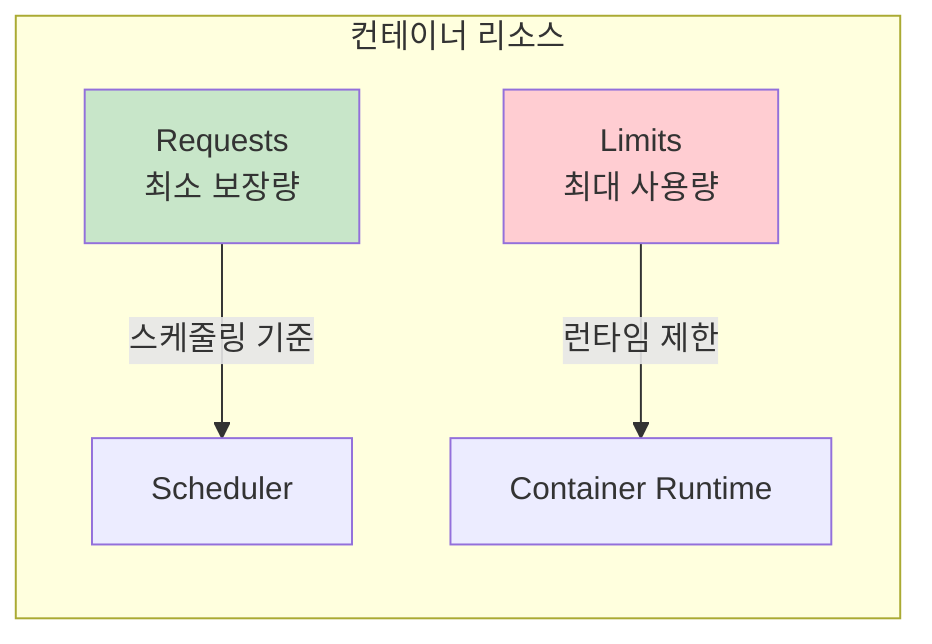
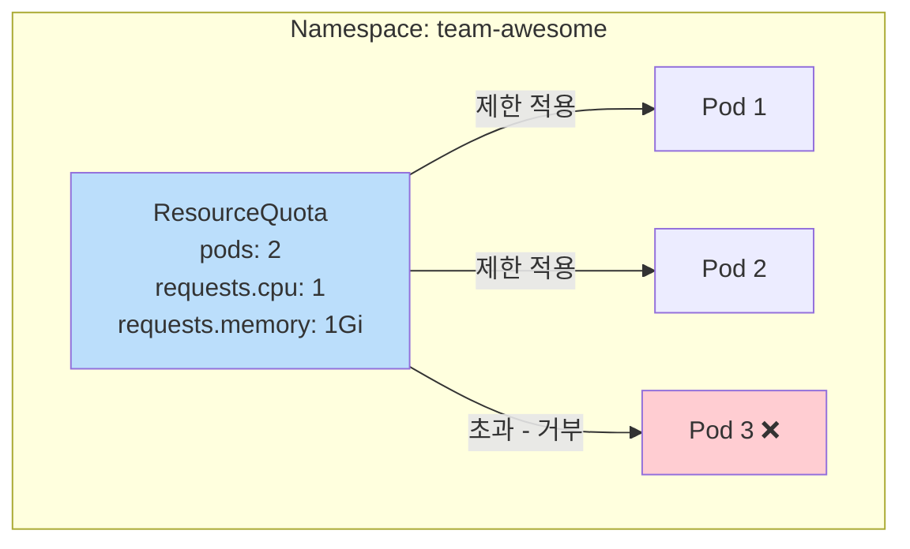
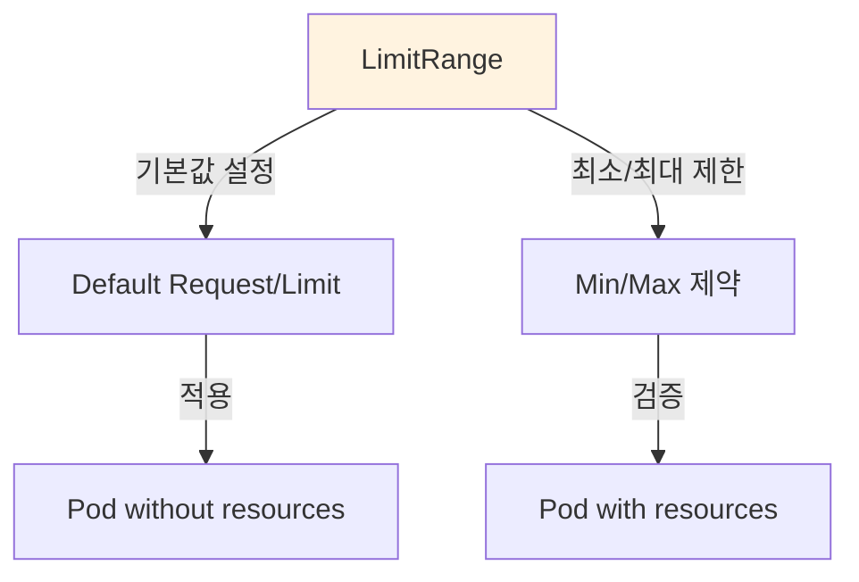

## 📌 핵심 요약
> 이 장에서는 Kubernetes 리소스 관리를 다룬다. 핵심은 **컨테이너 리소스 requests/limits 설정**, **ResourceQuota로 네임스페이스 수준 제한**, 그리고 **LimitRange로 개별 객체 제약 및 기본값 설정**을 이해하는 것이다.

## 🎯 학습 목표
이 내용을 읽고 나면:
- [ ] 컨테이너에 리소스 requests와 limits를 정의할 수 있다
- [ ] ResourceQuota로 네임스페이스 리소스 제한을 설정할 수 있다
- [ ] LimitRange로 기본 리소스 값과 제약을 설정할 수 있다
- [ ] 리소스 관련 에러 메시지를 이해하고 해결할 수 있다

## 📖 본문 정리

### 1. 리소스 단위

| 리소스 | 단위 | 예시 |
|--------|------|------|
| **CPU** | millicores (m) | `500m` = 0.5 CPU, `1` = 1 CPU |
| **Memory** | bytes (Mi, Gi) | `256Mi` = 256 MiB, `1Gi` = 1 GiB |
| **Ephemeral Storage** | bytes | `4Gi` |

> 💡 **1000m = 1 CPU core**

---

### 2. Resource Requests와 Limits



| 구분 | 설명 | 용도 |
|------|------|------|
| **Requests** | 컨테이너에 **보장**되는 최소 리소스 | 스케줄링 결정 기준 |
| **Limits** | 컨테이너가 사용할 수 있는 **최대** 리소스 | 초과 시 throttle/terminate |

#### YAML 정의

```yaml
apiVersion: v1
kind: Pod
metadata:
  name: rate-limiter
spec:
  containers:
  - name: business-app
    image: bmuschko/nodejs-business-app:1.0.0
    resources:
      requests:
        cpu: "1"           # 최소 1 CPU
        memory: "256Mi"    # 최소 256Mi 메모리
      limits:
        memory: "256Mi"    # 최대 256Mi 메모리
  - name: ambassador
    image: bmuschko/nodejs-ambassador:1.0.0
    resources:
      requests:
        cpu: "250m"        # 최소 0.25 CPU
        memory: "64Mi"     # 최소 64Mi 메모리
      limits:
        memory: "64Mi"     # 최대 64Mi 메모리
```

#### 리소스 옵션

| YAML 속성 | 설명 |
|-----------|------|
| `spec.containers[].resources.requests.cpu` | CPU 요청 |
| `spec.containers[].resources.requests.memory` | 메모리 요청 |
| `spec.containers[].resources.limits.cpu` | CPU 제한 |
| `spec.containers[].resources.limits.memory` | 메모리 제한 |
| `spec.containers[].resources.requests.ephemeral-storage` | 임시 스토리지 요청 |
| `spec.containers[].resources.limits.ephemeral-storage` | 임시 스토리지 제한 |

---

### 3. 리소스 설정 권장사항

| 권장사항 | 이유 |
|----------|------|
| ✅ **항상 memory requests 정의** | 스케줄링에 필요 |
| ✅ **항상 memory limits 정의** | OOM 방지 |
| ✅ **memory requests = limits** | 예측 가능한 동작 |
| ✅ **항상 CPU requests 정의** | 스케줄링에 필요 |
| ❌ **CPU limits 설정하지 않음** | CPU throttling 방지 |

> ⚠️ **주의**: 리소스 부족 시 Pod 상태가 `PodExceedsFreeCPU` 또는 `PodExceedsFreeMemory`로 표시됨

---

### 4. ResourceQuota (리소스 쿼터)

네임스페이스 수준에서 **전체 리소스 사용량**을 제한



#### ResourceQuota 생성

```yaml
apiVersion: v1
kind: ResourceQuota
metadata:
  name: awesome-quota
  namespace: team-awesome
spec:
  hard:
    pods: 2                   # 최대 Pod 수
    requests.cpu: "1"         # 총 CPU requests 합계
    requests.memory: 1024Mi   # 총 메모리 requests 합계
    limits.cpu: "4"           # 총 CPU limits 합계
    limits.memory: 4096Mi     # 총 메모리 limits 합계
```

```bash
# 네임스페이스 생성
$ kubectl create namespace team-awesome

# ResourceQuota 생성
$ kubectl apply -f awesome-quota.yaml
resourcequota/awesome-quota created
```

#### ResourceQuota 조회

```bash
$ kubectl describe resourcequota awesome-quota -n team-awesome
Name:            awesome-quota
Namespace:       team-awesome
Resource         Used  Hard
--------         ----  ----
limits.cpu       2     4
limits.memory    2Gi   4Gi
pods             2     2
requests.cpu     1     1
requests.memory  1Gi   1Gi
```

| 컬럼 | 설명 |
|------|------|
| **Used** | 현재 사용 중인 리소스 |
| **Hard** | 최대 허용 리소스 |

---

### 5. ResourceQuota 동작

#### 리소스 요구사항 없이 Pod 생성 시

```bash
$ kubectl apply -f nginx-pod.yaml
Error from server (Forbidden): pods "nginx" is forbidden: failed quota: \
awesome-quota: must specify limits.cpu for: nginx; limits.memory for: nginx; \
requests.cpu for: nginx; requests.memory for: nginx
```

> ⚠️ **중요**: ResourceQuota가 있는 네임스페이스에서는 **모든 Pod에 리소스 requests/limits 필수**

#### 쿼터 초과 시

```bash
$ kubectl apply -f nginx-pod3.yaml
Error from server (Forbidden): pods "nginx3" is forbidden: exceeded quota: \
awesome-quota, requested: pods=1,requests.cpu=500m,requests.memory=512Mi, \
used: pods=2,requests.cpu=1,requests.memory=1Gi, \
limited: pods=2,requests.cpu=1,requests.memory=1Gi
```

---

### 6. LimitRange (리밋 레인지)

**개별 객체**에 대한 리소스 제약 및 기본값 설정



| 기능 | 설명 |
|------|------|
| **기본값 설정** | 리소스 미지정 시 자동 적용 |
| **최소/최대 제한** | 허용 범위 강제 |
| **적용 대상** | Container, Pod, PersistentVolumeClaim |

#### LimitRange 생성

```yaml
apiVersion: v1
kind: LimitRange
metadata:
  name: cpu-resource-constraint
spec:
  limits:
  - type: Container
    defaultRequest:       # 기본 requests 값
      cpu: 200m
    default:              # 기본 limits 값
      cpu: 200m
    min:                  # 최소 허용값
      cpu: 100m
    max:                  # 최대 허용값
      cpu: "2"
```

```bash
$ kubectl apply -f cpu-resource-constraint.yaml
limitrange/cpu-resource-constraint created
```

#### LimitRange 조회

```bash
$ kubectl describe limitrange cpu-resource-constraint
Name:       cpu-resource-constraint
Namespace:  default
Type        Resource  Min   Max  Default Request  Default Limit
----        --------  ---   ---  ---------------  -------------
Container   cpu       100m  2    200m             200m
```

> ⚠️ **주의**: 네임스페이스당 **하나의 LimitRange만** 권장 (여러 개 시 예측 불가)

---

### 7. LimitRange 동작

#### 기본값 자동 적용

리소스 미지정 Pod 생성 시:

```yaml
apiVersion: v1
kind: Pod
metadata:
  name: nginx-without-resource-requirements
spec:
  containers:
  - image: nginx:1.25.3
    name: nginx
    # resources 미지정
```

```bash
$ kubectl apply -f nginx-without-resource-requirements.yaml
pod/nginx-without-resource-requirements created

$ kubectl describe pod nginx-without-resource-requirements
Annotations:  kubernetes.io/limit-ranger: LimitRanger plugin set: cpu \
              request for container nginx; cpu limit for container nginx
Containers:
  nginx:
    Limits:
      cpu: 200m       # LimitRange의 default 적용
    Requests:
      cpu: 200m       # LimitRange의 defaultRequest 적용
```

#### 제약 위반 시

```yaml
apiVersion: v1
kind: Pod
metadata:
  name: nginx-with-resource-requirements
spec:
  containers:
  - image: nginx:1.25.3
    name: nginx
    resources:
      requests:
        cpu: "50m"    # min(100m)보다 낮음 ❌
      limits:
        cpu: "3"      # max(2)보다 높음 ❌
```

```bash
$ kubectl apply -f nginx-with-resource-requirements.yaml
Error from server (Forbidden): pods "nginx-with-resource-requirements" \
is forbidden: [minimum cpu usage per Container is 100m, but request is 50m, \
maximum cpu usage per Container is 2, but limit is 3]
```

---

### 8. ResourceQuota vs LimitRange 비교

| 특성 | ResourceQuota | LimitRange |
|------|---------------|------------|
| **범위** | 네임스페이스 전체 | 개별 객체 |
| **제한 대상** | 총합 리소스 | 단일 컨테이너/Pod |
| **기본값 설정** | ❌ | ✅ |
| **객체 수 제한** | ✅ (pods, secrets 등) | ❌ |
| **적용 시점** | 객체 생성 시 | 객체 생성 시 |

---

### 9. 핵심 명령어 요약

| 작업 | 명령어 |
|------|--------|
| **ResourceQuota 생성** | `kubectl apply -f resourcequota.yaml` |
| **ResourceQuota 조회** | `kubectl describe resourcequota <name> -n <namespace>` |
| **ResourceQuota 목록** | `kubectl get resourcequotas -n <namespace>` |
| **LimitRange 생성** | `kubectl apply -f limitrange.yaml` |
| **LimitRange 조회** | `kubectl describe limitrange <name>` |
| **LimitRange 목록** | `kubectl get limitranges` |

---

### 10. 완전한 예시

#### ResourceQuota + LimitRange + Pod

```yaml
# 1. ResourceQuota
apiVersion: v1
kind: ResourceQuota
metadata:
  name: compute-quota
  namespace: dev
spec:
  hard:
    pods: "10"
    requests.cpu: "4"
    requests.memory: 8Gi
    limits.cpu: "8"
    limits.memory: 16Gi
---
# 2. LimitRange
apiVersion: v1
kind: LimitRange
metadata:
  name: default-limits
  namespace: dev
spec:
  limits:
  - type: Container
    defaultRequest:
      cpu: 100m
      memory: 128Mi
    default:
      cpu: 200m
      memory: 256Mi
    min:
      cpu: 50m
      memory: 64Mi
    max:
      cpu: "2"
      memory: 2Gi
---
# 3. Pod (리소스 지정)
apiVersion: v1
kind: Pod
metadata:
  name: app
  namespace: dev
spec:
  containers:
  - name: app
    image: nginx:1.25.3
    resources:
      requests:
        cpu: 250m
        memory: 256Mi
      limits:
        cpu: 500m
        memory: 512Mi
```

---

## 🔍 심화 학습

### 추가 조사 내용
- **Quality of Service (QoS)**: Guaranteed, Burstable, BestEffort 클래스
- **Container Resize Policies**: Kubernetes 1.27+ 런타임 리소스 조정
- **Goldilocks / KRR**: 리소스 권장 도구

### 출처
- [Kubernetes 공식 문서 - Resource Management](https://kubernetes.io/docs/concepts/configuration/manage-resources-containers/)
- [Kubernetes 공식 문서 - Resource Quotas](https://kubernetes.io/docs/concepts/policy/resource-quotas/)
- [Kubernetes 공식 문서 - Limit Ranges](https://kubernetes.io/docs/concepts/policy/limit-range/)

---

## 💡 실무 적용 포인트

### 이런 상황에서 기억하세요
- **멀티테넌트 환경**: ResourceQuota로 팀/프로젝트별 리소스 격리
- **리소스 낭비 방지**: LimitRange 기본값으로 적정 리소스 할당
- **OOM 방지**: memory limits 설정 필수

### 주의할 점 / 흔한 실수
- ⚠️ ResourceQuota 있는 네임스페이스에서 리소스 미지정 Pod 생성 실패
- ⚠️ LimitRange는 네임스페이스당 하나만 권장
- ⚠️ LimitRange 변경 시 기존 Pod에는 적용 안 됨
- ⚠️ CPU limits 과도하게 설정 시 throttling 발생
- ⚠️ memory limits 초과 시 OOMKilled로 컨테이너 종료

### 면접에서 나올 수 있는 질문
- Q: Resource requests와 limits의 차이점은?
- Q: ResourceQuota와 LimitRange의 차이점은?
- Q: Pod이 스케줄링되지 않는 이유가 리소스 부족일 때 어떻게 확인하는가?
- Q: LimitRange의 기본값은 언제 적용되는가?
- Q: CPU limits를 설정하지 않는 것이 권장되는 이유는?

---

## ✅ 핵심 개념 체크리스트
- [ ] CPU/메모리 리소스 단위(m, Mi, Gi)를 이해하는가?
- [ ] requests와 limits의 차이를 설명할 수 있는가?
- [ ] ResourceQuota를 생성하고 조회할 수 있는가?
- [ ] ResourceQuota가 Pod 생성에 미치는 영향을 아는가?
- [ ] LimitRange를 생성하고 조회할 수 있는가?
- [ ] LimitRange의 기본값 적용 동작을 이해하는가?
- [ ] 리소스 관련 에러 메시지를 해석할 수 있는가?

---

## 🔗 참고 자료
- 📄 공식 문서: [Managing Resources for Containers](https://kubernetes.io/docs/concepts/configuration/manage-resources-containers/)
- 📄 공식 문서: [Resource Quotas](https://kubernetes.io/docs/concepts/policy/resource-quotas/)
- 📄 공식 문서: [Limit Ranges](https://kubernetes.io/docs/concepts/policy/limit-range/)
- 📄 블로그: [For the Love of God, Stop Using CPU Limits on Kubernetes](https://home.robusta.dev/blog/stop-using-cpu-limits)
- 📘 GitHub: [bmuschko/cka-study-guide](https://github.com/bmuschko/cka-study-guide)

---
